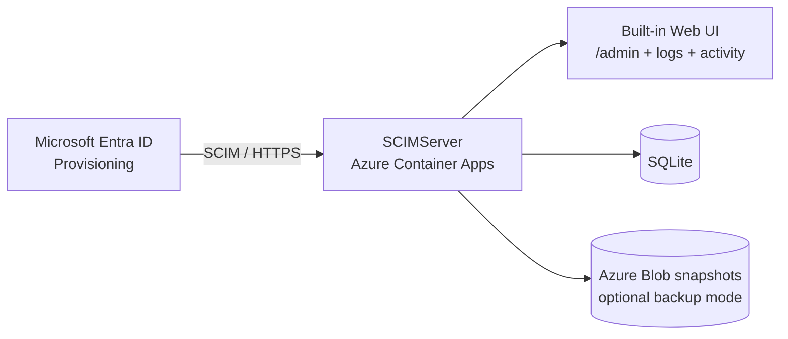

# ✨ SCIMServer

Production-ready SCIM 2.0 server with a built-in observability UI for Microsoft Entra ID provisioning.

| Key | Value |
|---|---|
| Version | [`v0.10.0`](https://github.com/pranems/SCIMServer/releases/latest) |
| Protocol | [SCIM 2.0](https://scim.cloud/) |
| Target Platform | [Microsoft Entra ID](https://entra.microsoft.com/) |
| Runtime | Node.js 24 |
| License | [MIT](LICENSE) |

SCIM endpoint: `/scim/v2`  
Admin & observability endpoint family: `/scim/admin/*`

---

## Why SCIMServer

- Full SCIM resource surface: Users, Groups, Schemas, ResourceTypes, ServiceProviderConfig
- Entra-focused behavior and validator alignment (24/24 + 7 preview scenarios)
- Built-in UI for activity feed, log inspection, endpoint management, and runtime status
- Production operations support: log streaming/download, backup stats, version metadata
- Cloud-ready deployment with Azure Container Apps and optional blob snapshot backup mode

---

## Quick Start

### Option A — Azure (recommended)

```powershell
iex (iwr https://raw.githubusercontent.com/pranems/SCIMServer/master/bootstrap.ps1).Content
```

The bootstrap flow provisions resources, deploys the app, and prints required secrets/URLs.

### Option B — Docker (fast local smoke test)

```powershell
docker build -t scimserver:latest -f Dockerfile .
docker run --rm -p 8080:8080 `
  -e PORT=8080 `
  -e SCIM_SHARED_SECRET=local-scim-secret `
  -e JWT_SECRET=local-jwt-secret `
  -e OAUTH_CLIENT_ID=scimserver-client `
  -e OAUTH_CLIENT_SECRET=local-oauth-secret `
  scimserver:latest
```

- UI: `http://localhost:8080/`
- SCIM base: `http://localhost:8080/scim/v2`
- Health: `http://localhost:8080/health`

### Option C — Local dev (API + web)

```powershell
git clone https://github.com/pranems/SCIMServer.git
cd SCIMServer

# API terminal
cd api
npm install
npx prisma generate
npx prisma migrate deploy
npm run start:dev

# Web terminal
cd ..\web
npm install
npm run dev
```

---

## Prerequisites

- Node.js 24+
- npm 10+
- Docker Desktop (optional, for container workflow)
- Azure CLI + PowerShell 7 (optional, for Azure deployment scripts)

---

## Configuration

### Required in production

| Variable | Purpose |
|---|---|
| `SCIM_SHARED_SECRET` | Entra provisioning bearer token for SCIM calls |
| `JWT_SECRET` | OAuth/JWT signing key |
| `OAUTH_CLIENT_SECRET` | OAuth client credential secret |

### Common optional variables

| Variable | Default | Purpose |
|---|---|---|
| `PORT` | `8080` | API/web runtime port |
| `OAUTH_CLIENT_ID` | `scimserver-client` | OAuth client identifier |
| `DATABASE_URL` | `file:./data.db` | SQLite DB path/connection |
| `NODE_ENV` | `production` (container) | Runtime mode |

Security note: treat all secrets as sensitive and rotate after sharing/output exposure.

---

## Configure Microsoft Entra Provisioning

Use these values in Enterprise Application provisioning:

- Tenant URL: `https://<your-app-url>/scim/v2`
- Secret Token: value of `SCIM_SHARED_SECRET`

Then test connection, configure mappings, assign users/groups, and enable provisioning.

References:

- [docs/AZURE_DEPLOYMENT_AND_USAGE_GUIDE.md](docs/AZURE_DEPLOYMENT_AND_USAGE_GUIDE.md)
- [docs/SCIM_REFERENCE.md](docs/SCIM_REFERENCE.md)
- [docs/SCIM_COMPLIANCE.md](docs/SCIM_COMPLIANCE.md)

---

## Architecture



Request shape:

- SCIM API: `https://<host>/scim/v2`
- Admin APIs: `https://<host>/scim/admin/*`
- Web UI: `https://<host>/`

---

## Operations

Key admin endpoints:

- `GET /scim/admin/version`
- `GET /scim/admin/log-config/recent?limit=25`
- `GET /scim/admin/log-config/stream?level=INFO` (SSE)
- `GET /scim/admin/log-config/download?format=json`
- `GET /scim/admin/backup/stats`

Remote log helper:

```powershell
.\scripts\remote-logs.ps1 -Mode recent -BaseUrl https://<your-app-url>
.\scripts\remote-logs.ps1 -Mode tail -BaseUrl https://<your-app-url>
.\scripts\remote-logs.ps1 -Mode download -BaseUrl https://<your-app-url> -Format json
```

Live sample payloads:

- [docs/images/readme/version-latest.json](docs/images/readme/version-latest.json)
- [docs/images/readme/recent-logs-latest.json](docs/images/readme/recent-logs-latest.json)

Operational docs:

- [docs/LOGGING_AND_OBSERVABILITY.md](docs/LOGGING_AND_OBSERVABILITY.md)
- [docs/REMOTE_DEBUGGING_AND_DIAGNOSIS.md](docs/REMOTE_DEBUGGING_AND_DIAGNOSIS.md)
- [docs/STORAGE_AND_BACKUP.md](docs/STORAGE_AND_BACKUP.md)

---

## Update / Upgrade

```powershell
iex (irm https://raw.githubusercontent.com/pranems/SCIMServer/master/scripts/update-scimserver-func.ps1)
Update-SCIMServer -Version v0.10.0 -ResourceGroup <rg> -AppName <app>
```

Admin/release references:

- [admin.md](admin.md)
- [CHANGELOG.md](CHANGELOG.md)
- [DEPLOYMENT.md](DEPLOYMENT.md)

---

## Quality Status

Latest validated matrix:

- Unit tests: **666/666**
- E2E tests: **184/184**
- Live integration tests: **280/280** (local + Docker)
- Microsoft SCIM Validator: **24/24 passed** (+ 7 preview scenarios)

Testing references:

- [docs/TESTING-WORKFLOW.md](docs/TESTING-WORKFLOW.md)
- [docs/SCIM_VALIDATION_GAP_ANALYSIS.md](docs/SCIM_VALIDATION_GAP_ANALYSIS.md)
- [docs/SCIM_GROUP_PERFORMANCE_ANALYSIS.md](docs/SCIM_GROUP_PERFORMANCE_ANALYSIS.md)
- [docs/PERSISTENCE_PERFORMANCE_ANALYSIS.md](docs/PERSISTENCE_PERFORMANCE_ANALYSIS.md)

---

## Documentation Index

Start here: [docs/INDEX.md](docs/INDEX.md)

High-value paths:

- Deploy and operate: [docs/AZURE_DEPLOYMENT_AND_USAGE_GUIDE.md](docs/AZURE_DEPLOYMENT_AND_USAGE_GUIDE.md), [DEPLOYMENT.md](DEPLOYMENT.md)
- API and collections: [docs/COMPLETE_API_REFERENCE.md](docs/COMPLETE_API_REFERENCE.md), [docs/openapi/](docs/openapi/), [docs/postman/](docs/postman/), [docs/insomnia/](docs/insomnia/)
- SCIM protocol: [docs/SCIM_REFERENCE.md](docs/SCIM_REFERENCE.md), [docs/SCIM_RFC_COMPLIANCE_LAYER.md](docs/SCIM_RFC_COMPLIANCE_LAYER.md)
- Observability: [docs/LOGGING_AND_OBSERVABILITY.md](docs/LOGGING_AND_OBSERVABILITY.md), [docs/REMOTE_DEBUGGING_AND_DIAGNOSIS.md](docs/REMOTE_DEBUGGING_AND_DIAGNOSIS.md)
- Design context: [docs/TECHNICAL_DESIGN_DOCUMENT.md](docs/TECHNICAL_DESIGN_DOCUMENT.md), [docs/SQLITE_COMPROMISE_ANALYSIS.md](docs/SQLITE_COMPROMISE_ANALYSIS.md)

---

## Repository Structure

```text
SCIMServer/
├── api/                  # NestJS SCIM API + admin APIs + Prisma
├── web/                  # React/Vite frontend
├── docs/                 # Protocol, operations, and product docs
├── infra/                # Bicep infrastructure templates
├── scripts/              # Deploy, test, and operations automation
├── Dockerfile            # Unified production image (web + api)
├── bootstrap.ps1         # One-liner bootstrap entrypoint
├── setup.ps1             # Local/deploy helper wrapper
└── deploy.ps1            # Deployment entrypoint wrapper
```

---

## Contributing

- Issues: [GitHub Issues](https://github.com/pranems/SCIMServer/issues)
- Discussions: [GitHub Discussions](https://github.com/pranems/SCIMServer/discussions)

---

## License

MIT — see [LICENSE](LICENSE).
