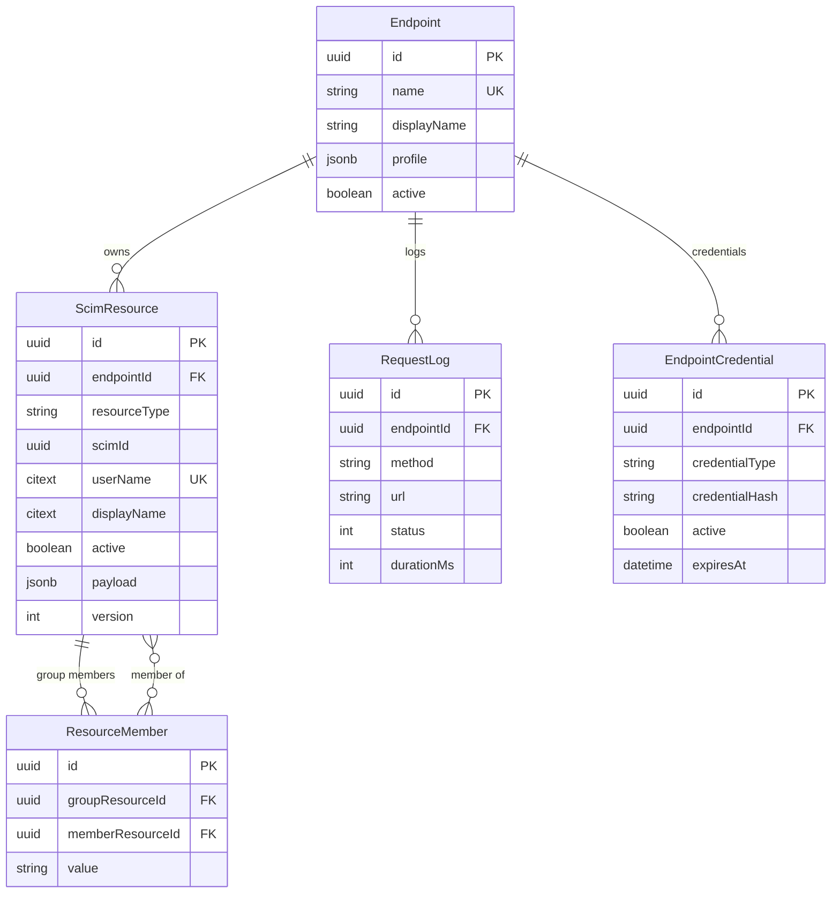
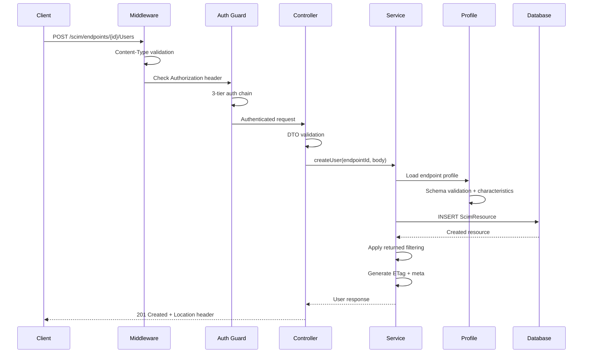
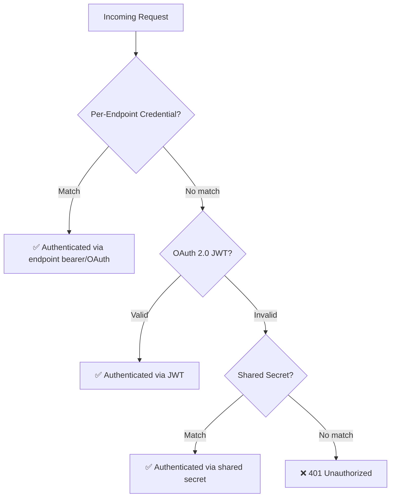

# SCIMServer

Production-ready, multi-tenant SCIM 2.0 server purpose-built for Microsoft Entra ID provisioning — with a built-in observability UI, full RFC compliance, and four deployment options.

| | |
|---|---|
| **Version** | `0.37.0` |
| **Protocol** | SCIM 2.0 ([RFC 7643](https://datatracker.ietf.org/doc/html/rfc7643) / [RFC 7644](https://datatracker.ietf.org/doc/html/rfc7644)) |
| **Target IdP** | [Microsoft Entra ID](https://entra.microsoft.com/) |
| **Runtime** | Node.js 24 · NestJS 11 · TypeScript 5.9 |
| **Persistence** | PostgreSQL 17 (Prisma 7) **or** in-memory |
| **Registry** | `ghcr.io/pranems/scimserver` (public, anonymous pull) |
| **License** | MIT |

---

## Table of Contents

- [Why SCIMServer](#why-scimserver)
- [Quick Start](#quick-start)
- [Architecture](#architecture)
- [SCIM Compliance Matrix](#scim-compliance-matrix)
- [Authentication](#authentication)
- [Endpoint Profiles & Presets](#endpoint-profiles--presets)
- [Per-Endpoint Configuration Flags](#per-endpoint-configuration-flags)
- [Microsoft Entra ID Setup](#microsoft-entra-id-setup)
- [Environment Variables](#environment-variables)
- [Observability Quick Start](#observability-quick-start)
- [Testing](#testing)
- [Repository Structure](#repository-structure)
- [Technology Stack](#technology-stack)
- [Documentation](#documentation)
- [License](#license)

---

## Why SCIMServer

| Capability | Detail |
|---|---|
| **Full SCIM surface** | Users, Groups, custom resource types, Schemas, ResourceTypes, ServiceProviderConfig, Bulk, /Me, .search |
| **Entra-validated** | 25/25 Microsoft SCIM Validator tests pass with 0 false positives |
| **Multi-tenant isolation** | Each endpoint owns its schemas, resources, config flags, and optional dedicated credentials |
| **6 endpoint presets** | `entra-id`, `entra-id-minimal`, `rfc-standard`, `minimal`, `user-only`, `user-only-with-custom-ext` — with tighten-only validation |
| **Schema-driven validation** | RFC 7643 §2 attribute characteristics — type, required, mutability, returned, uniqueness, caseExact. Pre-computed URN-dot-path cache with zero per-request tree walks |
| **Built-in observability UI** | Real-time activity feed, searchable log viewer, endpoint management dashboard |
| **3-tier auth** | Per-endpoint bcrypt → OAuth 2.0 JWT → global shared secret fallback chain |
| **ISV profiles** | Vendor-specific presets with custom extensions + writeOnly/returned:never support |
| **Cloud-ready** | Azure Container Apps with scale-to-zero, Docker Compose, or local dev — all first-class |

---

## Quick Start

### Option A — Docker Compose (recommended)

```bash
git clone https://github.com/pranems/SCIMServer.git
cd SCIMServer
docker compose up -d          # PostgreSQL 17 + API on port 8080
```

Open http://localhost:8080/admin for the observability UI.

### Option B — Local Development

```bash
cd api
npm install
# In-memory mode (no database required):
PERSISTENCE_BACKEND=inmemory JWT_SECRET=dev SCIM_SHARED_SECRET=dev OAUTH_CLIENT_SECRET=dev npm run start:dev
```

Server starts on http://localhost:3000. Set `PORT=6000` to use port 6000.

### Option C — Azure Container Apps

```bash
cd scripts
./deploy-azure.ps1            # Deploys to Azure Container Apps with PostgreSQL Flexible Server
```

See [AZURE_DEPLOYMENT_AND_USAGE_GUIDE.md](docs/AZURE_DEPLOYMENT_AND_USAGE_GUIDE.md) for detailed setup.  
For sovereign/gov clouds (Azure Gov, BLEU France, China): see [SOVEREIGN_AND_GOV_CLOUD_DEPLOYMENT.md](docs/SOVEREIGN_AND_GOV_CLOUD_DEPLOYMENT.md).

### Option D — Pre-built Docker Image

```bash
docker run -d -p 8080:8080 \
  -e PERSISTENCE_BACKEND=inmemory \
  -e JWT_SECRET=changeme \
  -e SCIM_SHARED_SECRET=changeme \
  -e OAUTH_CLIENT_SECRET=changeme \
  ghcr.io/pranems/scimserver:latest
```

### Verify It Works

```bash
# 1. Get an OAuth token
TOKEN=$(curl -s -X POST http://localhost:8080/scim/oauth/token \
  -H "Content-Type: application/x-www-form-urlencoded" \
  -d 'grant_type=client_credentials&client_id=scimserver-client&client_secret=changeme' \
  | jq -r .access_token)

# 2. Create an endpoint
ENDPOINT_ID=$(curl -s -X POST http://localhost:8080/scim/admin/endpoints \
  -H "Authorization: Bearer $TOKEN" \
  -H "Content-Type: application/json" \
  -d '{"name":"my-tenant","profilePreset":"entra-id"}' \
  | jq -r .id)

# 3. Create a user
curl -s -X POST "http://localhost:8080/scim/endpoints/$ENDPOINT_ID/Users" \
  -H "Authorization: Bearer $TOKEN" \
  -H "Content-Type: application/scim+json" \
  -d '{
    "schemas": ["urn:ietf:params:scim:schemas:core:2.0:User"],
    "userName": "jdoe@example.com",
    "displayName": "John Doe",
    "active": true,
    "emails": [{"value":"jdoe@example.com","type":"work","primary":true}]
  }' | jq .
```

---

## Architecture

```
┌─────────────────────────────────────────────────────────────┐
│                     Client / Entra ID                       │
└─────────────┬───────────────────────────────────┬───────────┘
              │ HTTPS                             │ HTTPS
┌─────────────▼───────────────────────────────────▼───────────┐
│                      NestJS Application                      │
│  ┌───────────────┐  ┌────────────────┐  ┌────────────────┐  │
│  │  Auth Module   │  │  SCIM Module   │  │  Admin Module  │  │
│  │ SharedSecret   │  │ Users/Groups   │  │ Endpoints      │  │
│  │ OAuth2 JWT     │  │ Bulk / .search │  │ Credentials    │  │
│  │ PerEndpoint    │  │ Discovery      │  │ Profiles       │  │
│  └───────────────┘  │ /Me            │  └────────────────┘  │
│                      │ Filtering      │                      │
│  ┌────────────────┐  │ PATCH engine   │  ┌────────────────┐  │
│  │ Logging Module │  │ ETag/If-Match  │  │  Web Module    │  │
│  │ Per-endpoint   │  └────────────────┘  │ Observability  │  │
│  │ Structured     │                      │ UI (React)     │  │
│  └────────────────┘  ┌────────────────┐  └────────────────┘  │
│                      │   Endpoint     │                      │
│                      │   Profile      │                      │
│                      │  (6 presets)   │                      │
│                      └────────────────┘                      │
├──────────────────────────────────────────────────────────────┤
│                    Persistence Layer                          │
│         ┌──────────────┐     ┌──────────────────┐           │
│         │  PostgreSQL   │     │   In-Memory      │           │
│         │  (Prisma 7)   │     │   (dev/test)     │           │
│         └──────────────┘     └──────────────────┘           │
└──────────────────────────────────────────────────────────────┘
```

### Data Model (Prisma)


```mermaid
erDiagram
    Endpoint ||--o{ ScimResource : "owns"
    Endpoint ||--o{ RequestLog : "logs"
    Endpoint ||--o{ EndpointCredential : "credentials"
    ScimResource ||--o{ ResourceMember : "group members"
    ScimResource }o--o{ ResourceMember : "member of"

    Endpoint {
        uuid id PK
        string name UK
        string displayName
        jsonb profile
        boolean active
    }
    ScimResource {
        uuid id PK
        uuid endpointId FK
        string resourceType
        uuid scimId
        citext userName UK
        citext displayName
        boolean active
        jsonb payload
        int version
    }
    ResourceMember {
        uuid id PK
        uuid groupResourceId FK
        uuid memberResourceId FK
        string value
    }
    EndpointCredential {
        uuid id PK
        uuid endpointId FK
        string credentialType
        string credentialHash
        boolean active
        datetime expiresAt
    }
    RequestLog {
        uuid id PK
        uuid endpointId FK
        string method
        string url
        int status
        int durationMs
    }
```

### Request Flow


```mermaid
sequenceDiagram
    participant C as Client
    participant MW as Middleware
    participant G as Auth Guard
    participant CT as Controller
    participant SV as Service
    participant PR as Profile
    participant DB as Database

    C->>MW: POST /scim/endpoints/{id}/Users
    MW->>MW: Content-Type validation
    MW->>G: Check Authorization header
    G->>G: 3-tier auth chain
    G->>CT: Authenticated request
    CT->>CT: DTO validation
    CT->>SV: createUser(endpointId, body)
    SV->>PR: Load endpoint profile
    PR->>PR: Schema validation + characteristics
    SV->>DB: INSERT ScimResource
    DB-->>SV: Created resource
    SV->>SV: Apply returned filtering
    SV->>SV: Generate ETag + meta
    SV-->>CT: User response
    CT-->>C: 201 Created + Location header
```

---

## SCIM Compliance Matrix

| RFC Section | Feature | Status |
|-------------|---------|--------|
| **7643 §4.1** | User resource (24 attributes) | ✅ Full |
| **7643 §4.2** | Group resource (6 attributes) | ✅ Full |
| **7643 §6** | ResourceTypes discovery | ✅ Full |
| **7643 §7** | Schemas discovery | ✅ Full |
| **7643 §2** | Attribute characteristics (type, required, mutability, returned, uniqueness, caseExact) | ✅ Full |
| **7644 §3.1** | POST (Create) | ✅ Full |
| **7644 §3.2** | GET (Read by ID) | ✅ Full |
| **7644 §3.3** | PUT (Replace) | ✅ Full |
| **7644 §3.4** | GET (List + Filter) | ✅ Full |
| **7644 §3.4.2.3** | Sorting | ✅ Full |
| **7644 §3.4.2.5** | Attribute projection (`attributes`, `excludedAttributes`) | ✅ Full |
| **7644 §3.4.3** | POST /.search | ✅ Full |
| **7644 §3.5.2** | PATCH (Add/Replace/Remove) | ✅ Full |
| **7644 §3.6** | DELETE | ✅ Full |
| **7644 §3.7** | Bulk operations | ✅ Full |
| **7644 §3.11** | /Me endpoint | ✅ Full |
| **7644 §3.14** | ETag + If-Match/If-None-Match | ✅ Full |
| **7644 §4** | ServiceProviderConfig | ✅ Full |
| **7644 §3.12** | Error responses (SCIM Error format) | ✅ Full |
| **Custom** | Extension schemas (Enterprise, Custom) | ✅ Full |
| **Custom** | Multi-endpoint isolation | ✅ Full |

---

## Authentication

SCIMServer supports a **3-tier authentication chain** resolved per-request:


```mermaid
flowchart TD
    A[Incoming Request] --> B{Per-Endpoint Credential?}
    B -->|Match| C[✅ Authenticated via endpoint bearer/OAuth]
    B -->|No match| D{OAuth 2.0 JWT?}
    D -->|Valid| E[✅ Authenticated via JWT]
    D -->|Invalid| F{Shared Secret?}
    F -->|Match| G[✅ Authenticated via shared secret]
    F -->|No match| H[❌ 401 Unauthorized]
```

### OAuth 2.0 Token Endpoint

```http
POST /scim/oauth/token
Content-Type: application/x-www-form-urlencoded

grant_type=client_credentials&client_id=scimserver-client&client_secret=<OAUTH_CLIENT_SECRET>
```

Response:

```json
{
  "access_token": "eyJhbGciOiJIUzI1NiIs...",
  "token_type": "Bearer",
  "expires_in": 3600
}
```

### Shared Secret

```http
GET /scim/endpoints/{id}/Users
Authorization: Bearer <SCIM_SHARED_SECRET>
```

### Per-Endpoint Credentials

Create via Admin API:

```http
POST /scim/admin/endpoints/{id}/credentials
Authorization: Bearer <admin-token>
Content-Type: application/json

{
  "credentialType": "bearer",
  "token": "my-endpoint-secret",
  "label": "Entra provisioning"
}
```

---

## Endpoint Profiles & Presets

Every endpoint is created with a **profile** — a unified JSONB document containing schemas, resource types, service provider config, and behavioral settings.

### 6 Built-in Presets

| Preset | Schemas | Resource Types | Bulk | Sort | ETag | Use Case |
|--------|---------|---------------|------|------|------|----------|
| `entra-id` (default) | 7 (User, Group, Enterprise, 4× msfttest) | User + Group | ❌ | ❌ | ✅ | Microsoft Entra ID provisioning |
| `entra-id-minimal` | 7 (scoped attributes) | User + Group | ❌ | ❌ | ✅ | Entra with minimal attribute set |
| `rfc-standard` | 3 (User, Group, Enterprise) | User + Group | ✅ | ✅ | ✅ | Pure RFC compliance testing |
| `minimal` | 2 (User, Group) | User + Group | ❌ | ❌ | ❌ | Bare minimum testing |
| `user-only` | 2 (User, Enterprise) | User | ❌ | ✅ | ✅ | User-only provisioning |
| `user-only-with-custom-ext` | 3 (User, Enterprise, Custom) | User | ❌ | ✅ | ❌ | User-only with custom extension |

### Create an Endpoint

```http
POST /scim/admin/endpoints
Content-Type: application/json
Authorization: Bearer <token>

{
  "name": "my-tenant",
  "profilePreset": "entra-id"
}
```

### Create with Inline Profile

```http
POST /scim/admin/endpoints
Content-Type: application/json

{
  "name": "custom-tenant",
  "profile": {
    "schemas": [
      { "id": "urn:ietf:params:scim:schemas:core:2.0:User", "name": "User", "attributes": "all" },
      { "id": "urn:custom:extension:2.0:User", "name": "CustomExt", "attributes": [
        { "name": "badge", "type": "string", "mutability": "writeOnly", "returned": "never" }
      ]}
    ],
    "resourceTypes": [
      { "id": "User", "name": "User", "endpoint": "/Users",
        "schema": "urn:ietf:params:scim:schemas:core:2.0:User",
        "schemaExtensions": [{ "schema": "urn:custom:extension:2.0:User", "required": false }]
      }
    ],
    "serviceProviderConfig": {
      "patch": { "supported": true }, "bulk": { "supported": false },
      "filter": { "supported": true, "maxResults": 200 },
      "sort": { "supported": true }, "etag": { "supported": false },
      "changePassword": { "supported": false }
    }
  }
}
```

### ServiceProviderConfig Capabilities (RFC 7644 §4)

Each endpoint's `profile.serviceProviderConfig` advertises SCIM capabilities. Set on create or PATCH.

| Capability | Default | Options | Description |
|------------|---------|---------|-------------|
| `patch` | **`supported: true`** | `true` / `false` | PATCH operations on resources |
| `bulk` | `supported: false` | `supported`, `maxOperations`, `maxPayloadSize` | Bulk operations via `/Bulk` endpoint |
| `filter` | **`supported: true`** | `supported`, `maxResults` (default: 200) | Filter expressions on LIST queries |
| `changePassword` | `supported: false` | `true` / `false` | Password change via `/Me` |
| `sort` | `supported: false` | `true` / `false` | Sort parameter on LIST responses |
| `etag` | `supported: false` | `true` / `false` | ETag-based versioning and `If-Match` support |

> Discovery: `GET /scim/endpoints/{id}/ServiceProviderConfig` (no auth required)

---

## Per-Endpoint Configuration Flags

All flags are stored in `profile.settings` and can be PATCHed per-endpoint:

| Flag | Type | Default | Description |
|------|------|---------|-------------|
| `UserSoftDeleteEnabled` | bool/string | **`true`** | PATCH `{active:false}` deactivates user; `false` → 400 error |
| `UserHardDeleteEnabled` | bool/string | **`true`** | DELETE /Users/{id} permanently removes user; `false` → error |
| `GroupHardDeleteEnabled` | bool/string | **`true`** | DELETE /Groups/{id} permanently removes group; `false` → error |
| `MultiMemberPatchOpForGroupEnabled` | bool/string | **`true`** | Multi-member add/remove in single PATCH op on Group |
| `SchemaDiscoveryEnabled` | bool/string | **`true`** | Endpoint-scoped discovery endpoints respond; `false` → 404 |
| `StrictSchemaValidation` | bool/string | **`true`** | Enforce extension URNs in `schemas[]`, types, mutability |
| `AllowAndCoerceBooleanStrings` | bool/string | **`true`** | Coerce `"True"`/`"False"` to native booleans |
| `PatchOpAllowRemoveAllMembers` | bool/string | `false` | Allow remove-all-members via `path=members` without value array |
| `VerbosePatchSupported` | bool/string | `false` | Enable dot-notation PATCH paths |
| `RequireIfMatch` | bool/string | `false` | Require `If-Match` header on PUT/PATCH/DELETE (428 if missing) |
| `PerEndpointCredentialsEnabled` | bool/string | `false` | Enable per-endpoint credential validation |
| `IncludeWarningAboutIgnoredReadOnlyAttribute` | bool/string | `false` | Add warning in write responses for readOnly stripping |
| `IgnoreReadOnlyAttributesInPatch` | bool/string | `false` | Strip (don't error) readOnly PATCH ops when strict is on |
| `logLevel` | string/number | *(unset)* | Per-endpoint log level override (TRACE/DEBUG/INFO/WARN/ERROR/FATAL/OFF) |

> For the full reference with flag interactions, Mermaid diagrams, and examples, see [docs/ENDPOINT_CONFIG_FLAGS_REFERENCE.md](docs/ENDPOINT_CONFIG_FLAGS_REFERENCE.md).

### PATCH Settings

```http
PATCH /scim/admin/endpoints/{id}
Content-Type: application/json

{
  "profile": {
    "settings": {
      "UserHardDeleteEnabled": "True",
      "RequireIfMatch": "True"
    }
  }
}
```

---

## Microsoft Entra ID Setup

1. **Deploy SCIMServer** using any of the 4 options above
2. **Create an endpoint** with `profilePreset: "entra-id"`
3. In **Entra admin center** → Enterprise Applications → your app → Provisioning:
   - **Tenant URL:** `https://your-server/scim/v2/endpoints/{endpoint-id}`
   - **Secret Token:** Your OAuth token or shared secret
4. **Test Connection** → should succeed
5. **Map attributes** as needed (SCIMServer accepts all standard User/Group attributes)
6. **Start provisioning**

> **Note:** SCIMServer rewrites `/scim/v2/*` → `/scim/*` automatically, so Entra's `/scim/v2/Users` maps correctly.

---

## Environment Variables

| Variable | Required | Default | Description |
|----------|----------|---------|-------------|
| `PORT` | No | `3000` | Server listen port |
| `PERSISTENCE_BACKEND` | No | `prisma` | `prisma` (PostgreSQL) or `inmemory` |
| `DATABASE_URL` | If prisma | — | PostgreSQL connection string |
| `JWT_SECRET` | Yes | — | Secret for OAuth JWT signing |
| `SCIM_SHARED_SECRET` | Yes | — | Global bearer token for shared-secret auth |
| `OAUTH_CLIENT_SECRET` | Yes | — | OAuth client credentials secret |
| `OAUTH_CLIENT_ID` | No | `scimserver-client` | OAuth client ID |
| `OAUTH_CLIENT_SCOPES` | No | `scim.read,scim.write,scim.manage` | Comma-separated OAuth scopes |
| `API_PREFIX` | No | `scim` | URL prefix for all routes |
| `NODE_ENV` | No | — | `production`, `development`, `test` |
| `LOG_LEVEL` | No | `info` | Global log level (TRACE/DEBUG/INFO/WARN/ERROR/FATAL/OFF) |

---

## Observability Quick Start

All log and audit endpoints require `Authorization: Bearer <shared-secret>`. Pick your deployment:

| Deployment | Base URL | Bearer Token |
|------------|----------|-------------|
| **Local** | `http://localhost:6000` | `local-secret` |
| **Docker** | `http://localhost:8080` | `devscimsharedsecret` |
| **Azure** | `https://scimserver2.yellowsmoke-af7a3fff.eastus.azurecontainerapps.io` | `changeme-scim` |

### Recent Logs (Ring Buffer)

Returns the last N entries from the in-memory ring buffer (default 2,000 entries).

```http
GET /scim/admin/log-config/recent?limit=25&level=WARN HTTP/1.1
Authorization: Bearer changeme-scim
```

```json
{
  "count": 2,
  "entries": [
    {
      "timestamp": "2026-04-13T10:30:46.456Z",
      "level": "WARN",
      "category": "http",
      "message": "Slow request: 3456ms",
      "requestId": "b2c3d4e5-...",
      "endpointId": "f8e7d6c5-...",
      "method": "GET",
      "path": "/scim/endpoints/.../Users",
      "durationMs": 3456
    }
  ]
}
```

```powershell
$base = "https://scimserver2.yellowsmoke-af7a3fff.eastus.azurecontainerapps.io"
$h = @{ Authorization = "Bearer changeme-scim" }
Invoke-RestMethod "$base/scim/admin/log-config/recent?limit=25" -Headers $h | ConvertTo-Json -Depth 5
```

### Audit Trail

Returns CONFIG, ENDPOINT, and AUTH events — config changes, endpoint CRUD, auth successes/failures.

```http
GET /scim/admin/log-config/audit?limit=100 HTTP/1.1
Authorization: Bearer changeme-scim
```

### Per-Endpoint Logs

Each endpoint has isolated log access. First list endpoints, then query:

```powershell
# List endpoints → get endpoint IDs
Invoke-RestMethod "$base/scim/admin/endpoints" -Headers $h | ConvertTo-Json -Depth 3

# Get logs for one endpoint
$epId = "f8e7d6c5-b4a3-2190-fedc-ba0987654321"
Invoke-RestMethod "$base/scim/endpoints/$epId/logs/recent?limit=50" -Headers $h | ConvertTo-Json -Depth 5
```

### Full Request Detail (Headers + Bodies)

View complete request/response including headers and bodies from the persistent database:

```http
GET /scim/admin/logs/clu8x9y0z-log-uuid-001 HTTP/1.1
Authorization: Bearer changeme-scim
```

```json
{
  "method": "POST",
  "url": "/scim/endpoints/.../Users",
  "status": 409,
  "requestHeaders": { "content-type": "application/scim+json", "x-request-id": "f47ac10b-..." },
  "requestBody": { "schemas": ["urn:ietf:params:scim:schemas:core:2.0:User"], "userName": "jsmith@contoso.com" },
  "responseBody": {
    "schemas": ["urn:ietf:params:scim:api:messages:2.0:Error"],
    "detail": "A resource with userName 'jsmith@contoso.com' already exists.",
    "status": "409",
    "scimType": "uniqueness",
    "urn:scimserver:api:messages:2.0:Diagnostics": {
      "requestId": "f47ac10b-...",
      "conflictingResourceId": "usr-existing-456",
      "logsUrl": "/scim/endpoints/.../logs/recent?requestId=f47ac10b-..."
    }
  }
}
```

### Trace a Failed Request

Every error response includes a `requestId` in the diagnostics extension. Use it to see all correlated logs:

```powershell
Invoke-RestMethod "$base/scim/admin/log-config/recent?requestId=f47ac10b-..." -Headers $h | ConvertTo-Json -Depth 5
```

### More Operations

```powershell
# Download logs (Azure — files are ephemeral in container)
Invoke-RestMethod "$base/scim/admin/log-config/download" -Headers $h -OutFile "logs.ndjson"

# Search persistent history by userName/email
Invoke-RestMethod "$base/scim/admin/logs?search=jsmith@contoso.com" -Headers $h | ConvertTo-Json -Depth 5

# Live SSE stream (use curl, Ctrl+C to stop)
# curl -N "$base/scim/admin/log-config/stream?level=INFO" -H "Authorization: Bearer changeme-scim"

# Set to TRACE for max detail (no restart needed)
Invoke-RestMethod -Method PUT "$base/scim/admin/log-config/level/TRACE" -Headers $h
# Restore
Invoke-RestMethod -Method PUT "$base/scim/admin/log-config/level/INFO" -Headers $h
```

> **Full reference:** [REMOTE_DEBUGGING_AND_DIAGNOSIS.md](docs/REMOTE_DEBUGGING_AND_DIAGNOSIS.md) — 20 troubleshooting scenarios, log file layout, SSE live stream, per-endpoint isolation, 4 diagnosis workflows.

---

## Testing

### Test Pyramid

| Layer | Suites | Tests | Framework |
|-------|--------|-------|-----------|
| **Unit** | 82 | 3,241 | Jest + ts-jest |
| **E2E** | 46 | 965 | Jest + supertest + NestJS testing |
| **Live Integration** | 43 sections | ~753 | PowerShell (live-test.ps1) |
| **ISV Live (Lexmark)** | 13 sections | 112 | PowerShell (lexmark-live-test.ps1) |
| **Total** | **~184** | **~5,012** | — |

### Run Tests

```bash
cd api

# Unit tests
npm test

# E2E tests (starts a real NestJS app with in-memory backend)
PERSISTENCE_BACKEND=inmemory npm run test:e2e

# All tests
npm run test:all

# Live integration tests (requires running server on port 6000)
cd ../scripts
./live-test.ps1

# Lexmark ISV live tests
./lexmark-live-test.ps1
```

---

## Repository Structure

```
SCIMServer/
├── api/                          # NestJS backend
│   ├── src/
│   │   ├── main.ts              # Server bootstrap
│   │   ├── domain/              # Domain logic (patch engines, validators)
│   │   ├── infrastructure/      # Repositories (Prisma + InMemory)
│   │   └── modules/
│   │       ├── app/             # AppModule (root)
│   │       ├── auth/            # Auth guard + shared secret
│   │       ├── database/        # DB health + management
│   │       ├── endpoint/        # Endpoint CRUD + config
│   │       ├── health/          # Health check
│   │       ├── logging/         # Structured logging + per-endpoint levels
│   │       ├── prisma/          # Prisma service
│   │       ├── scim/            # ★ Main SCIM module
│   │       │   ├── controllers/ # Users, Groups, Bulk, Discovery, Me, Admin
│   │       │   ├── services/    # CRUD + generic resource + bulk processor
│   │       │   ├── endpoint-profile/  # Profile system (6 presets)
│   │       │   ├── discovery/   # Schema registry + discovery service
│   │       │   ├── filters/     # SCIM filter parser + evaluator
│   │       │   ├── interceptors/# ETag + Content-Type
│   │       │   └── dto/         # Request DTOs
│   │       └── web/             # Observability UI serving
│   ├── prisma/
│   │   └── schema.prisma        # 5 models (Endpoint, ScimResource, etc.)
│   └── test/
│       └── e2e/                 # 37 E2E spec files + helpers
├── scripts/
│   ├── live-test.ps1            # Main live test suite (43 sections, ~951 tests)
│   ├── lexmark-live-test.ps1    # Lexmark ISV live tests (13 sections, 112 tests)
│   ├── deploy-azure.ps1         # Azure deployment
│   └── ...                      # 20+ automation scripts
├── docs/                        # 52+ documentation files
├── web/                         # React observability UI
├── infra/                       # Azure Bicep templates
├── Dockerfile                   # 4-stage multi-stage build
├── docker-compose.yml           # PostgreSQL 17 + API
└── CHANGELOG.md                 # Version history
```

---

## Technology Stack

| Layer | Technology | Version |
|-------|-----------|---------|
| **Runtime** | Node.js | 24 |
| **Framework** | NestJS | 11.1 |
| **Language** | TypeScript | 5.9 |
| **ORM** | Prisma | 7.4 |
| **Database** | PostgreSQL | 17 (citext, pgcrypto, pg_trgm) |
| **Auth** | Passport + JWT | passport 0.7, @nestjs/jwt 11 |
| **Test Runner** | Jest | 30.2 |
| **HTTP Testing** | Supertest | 7.2 |
| **Linting** | ESLint + Prettier | 10 / 3.8 |
| **Container** | Docker (Alpine) | node:24-alpine |
| **Frontend** | React + Vite | (web/) |
| **Cloud** | Azure Container Apps | Bicep IaC |

---

## Documentation

Full documentation is in the [`docs/`](docs/) directory. Key documents:

| Document | Description |
|----------|-------------|
| [docs/INDEX.md](docs/INDEX.md) | Complete documentation index |
| [docs/COMPLETE_API_REFERENCE.md](docs/COMPLETE_API_REFERENCE.md) | Full API reference with examples |
| [docs/ENDPOINT_LIFECYCLE_AND_USAGE.md](docs/ENDPOINT_LIFECYCLE_AND_USAGE.md) | Endpoint lifecycle & usage quick start |
| [docs/ENDPOINT_CONFIG_FLAGS_REFERENCE.md](docs/ENDPOINT_CONFIG_FLAGS_REFERENCE.md) | Configuration flags reference |
| [docs/SOVEREIGN_AND_GOV_CLOUD_DEPLOYMENT.md](docs/SOVEREIGN_AND_GOV_CLOUD_DEPLOYMENT.md) | Azure Gov, BLEU (France), China deployment |
| [docs/SCIM_COMPLIANCE.md](docs/SCIM_COMPLIANCE.md) | RFC compliance matrix |
| [docs/TECHNICAL_DESIGN_DOCUMENT.md](docs/TECHNICAL_DESIGN_DOCUMENT.md) | Architecture & design |
| [CHANGELOG.md](CHANGELOG.md) | Version history |

---

## License

MIT — see [LICENSE](LICENSE) for details.
