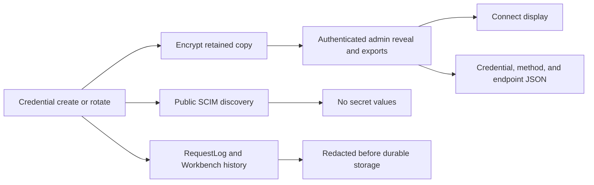

# API Output Fidelity and Secret Surface Contract

> **Status:** Implemented in v0.55.33
> **Last verified:** 2026-09-24

## Purpose

This contract makes three related behaviors explicit:

1. URL and SCIM attribute identifiers resolve case-insensitively while responses keep canonical casing.
2. API output is derived from effective runtime state and cannot expose server-owned persistence fields.
3. Recoverable credential secrets are visible and exportable on authenticated admin surfaces, but never enter public SCIM discovery or durable diagnostic stores.

## Identifier Rules

The following comparisons are case-insensitive:

| Identifier | Examples |
|---|---|
| Endpoint UUID and name URL segments | uppercase UUID, `PartnerA`, `partnera` |
| Built-in Bulk collection paths | `/Users`, `/users`, `/uSeRs` |
| Custom ResourceType name, id, and endpoint | `Device`, `device`, `/DEVICES` |
| Schema URNs | mixed-case profile and request URNs |
| SCIM PATCH attribute paths | `status`, `Status`, `Emails[Type eq "work"].Value` |

Canonical response locations and discovered endpoints retain the configured casing. Endpoint names keep their stored display casing, while an additive unique index on `lower(name)` rejects case-only duplicates safely under concurrent creation.

## Effective Output Rules

`ServiceProviderConfig.authenticationSchemes` uses the same effective authentication resolver as token and credential enforcement. A dedicated `OAuthClientCredentialsAuthEnabled` or `WifCredentialsEnabled` setting is advertised even when `profile.authentication.methods[]` is absent.

The Endpoint Settings WIF/JWKS section reads `/scim/admin/endpoints/{id}/egress-policy`. Every one of its 11 fields displays:

- effective value
- unit
- endpoint configured value or inherit state
- provenance (`endpoint`, `server-env`, or `default`)
- inclusive runtime bounds
- clamping information when applicable

Settings JSON export contains effective numeric values instead of blank inherited placeholders.

SCIM resource responses recursively remove internal keys, including underscore-prefixed fields, `endpointId`, `scimId`, and raw persistence payload fields. Extension URN objects are matched case-insensitively and emitted under the canonical configured URN before `returned:never` filtering.

## Secret Boundary

Bearer and OAuth client secrets are retained encrypted and automatically displayed to authenticated admins. Credential JSON, per-method connection JSON, whole-endpoint connection JSON, clipboard payloads, and downloads include the recoverable secret.

WIF trusts have no shared secret. Their exports contain only public trust configuration.

The former `once` policy is retired for new writes. Existing credentials whose encrypted copy was already purged cannot be reconstructed; admin exports mark them `rotation-required` and include the server-provided reason. Rotation creates a newly retained secret.

The following surfaces never contain plaintext credential secrets:

- public `ServiceProviderConfig`, `Schemas`, and `ResourceTypes`
- unauthenticated OAuth metadata and SCIM protocol responses
- endpoint overview and credential list projections
- persisted RequestLog rows
- persisted Workbench history
- console and file structured logs
- URL query parameters written to Workbench history, structured request messages, or RequestLog rows

## Back Navigation

The shared Back control uses TanStack Router's `useCanGoBack()`. This reads TanStack's private history index, not browser history length. An externally loaded page starts at router index zero even when the browser has an external predecessor, so direct links use the explicit in-app fallback. In-app navigation restores the exact previous URL, including search and hash state.

## Validation Evidence

| Layer | Result |
|---|---|
| API unit | 5,192 passed across 174 suites |
| API E2E | 1,533 passed across 97 suites |
| Web Vitest | 1,544 passed across 116 files |
| Local live HTTP | 1,532 passed |
| Six-mode available lanes | 4 of 4 passed; Prisma lanes skipped without `DATABASE_URL` |
| Focused Playwright | Connect 2 passed; Settings 3 passed |
| API lint | 0 errors, 527 existing warnings |
| Builds and size budgets | API build, web build, and all route budgets passed |
| Migration gate | 0 violations across 22 migrations |

The live suite includes mixed-case custom and Bulk paths, endpoint UUID/name casing, complete authentication scheme advertisement, all 11 egress fields, retained-secret admin disclosure, public discovery sentinel exclusion, and durable-log redaction.
