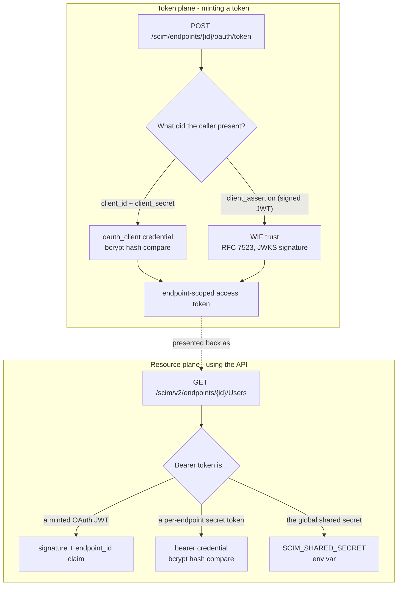
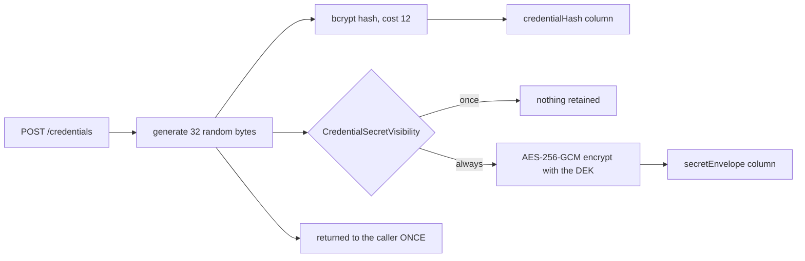

# Authentication configuration: what exists, where it lives, and how to change it

**Last verified:** 2026-08-20
**Applies to:** v0.55.13
**Source-derived.** Every path and field below was read from source; file references are given so you can check any claim.

## 1. The shape of the problem

SCIMServer authenticates on **two planes**, and almost every confusion about its configuration comes from conflating them.

A `401` on the resource plane and a `401` from the token endpoint are different failures with different configuration behind them.

## 2. Where every piece of configuration is persisted

There are **four** distinct stores. Knowing which one holds a given setting tells you how it is backed up, how it survives a migration, and who can change it.

| Store | What lives there | Why there |
|---|---|---|
| **`EndpointCredential` table** ([schema.prisma L140-165](../api/prisma/schema.prisma)) | The credentials themselves: `credentialType`, `credentialHash` (bcrypt), `label`, `metadata` (JSONB), `secretEnvelope`, `active`, `expiresAt` | Secrets need row-level lifecycle (rotate, revoke, reactivate) that a JSON blob cannot give |
| **`Endpoint.profile` JSONB** ([endpoint-profile.types.ts L186-205](../api/src/modules/scim/endpoint-profile/endpoint-profile.types.ts)) | `profile.authentication` = `{schemaVersion, methods[], defaultMethodId, policy}` and the auth **flags** under `profile.settings` | Declares *which methods this endpoint offers* and how they are advertised. **No secret material ever rides here** |
| **Server-global tables** | `ServerSetting` (the `CredentialSecretVisibility` ceiling), `CredentialDek` (the wrapped data-encryption key), `JwksHostAllowlistEntry` (SSRF allowlist) | Apply to the whole install, not one endpoint |
| **Environment variables** | `SCIM_SHARED_SECRET`, `OAUTH_CLIENT_ID` / `OAUTH_CLIENT_SECRET`, `JWT_SECRET`, `OAUTH_JWT_PRIVATE_KEY`, `CREDENTIAL_KEK` | Bootstrap identity and key material. **Not** editable through the API by design |

**The separation that matters most:** a WIF trust is *entirely non-secret* (issuer, subject, audience, JWKS URI) and lives in `EndpointCredential.metadata`; a bearer or OAuth secret is *never stored in plaintext* - only a bcrypt hash, plus optionally an encrypted copy. These are different things sharing one table.

## 3. The method types

Ten `type` values are accepted by the admin API ([admin-authentication-method.controller.ts L34-44](../api/src/modules/scim/controllers/admin-authentication-method.controller.ts)):

`shared-secret`, `bearer`, `oauth-client`, `external-jwt`, `wif-7523`, `wif-8693`, `oauth-authcode`, `mtls`, `dpop`, `httpbasic`

**Being accepted is not the same as being enforced.** Only `shared-secret`, `bearer`, `oauth-client` and the WIF pair have runtime providers. Declaring `mtls` or `dpop` records an intent and advertises it in discovery; nothing enforces it. That gap is tracked as **N8** in the auth work register - treat those two as documentation, not protection.

## 4. How an operator changes each thing

### 4.1 Per-endpoint credentials (the common case)

All under `/scim/admin/endpoints/{endpointId}/credentials`, all requiring admin bearer auth ([admin-credential.controller.ts](../api/src/modules/scim/controllers/admin-credential.controller.ts)):

| Verb | Path | Effect |
|---|---|---|
| `POST` | `/credentials` | Create. Returns the plaintext secret **once** |
| `GET` | `/credentials` | List. Never returns hashes or secrets |
| `PATCH` | `/credentials/{id}` | Edit the label only |
| `PUT` | `/credentials/{id}` | WIF only: replace the trust config in place |
| `DELETE` | `/credentials/{id}` | Deactivate (`active=false`); the row is retained |
| `POST` | `/credentials/{id}/activate` | Reactivate a deactivated credential |
| `POST` | `/credentials/{id}/rotate` | Mint a new secret, deactivate the old one, keep the `client_id` |
| `POST` | `/credentials/{id}/reveal` | Return the retained secret, if retention is on |

**Recovering a lost secret is `rotate`, not `reveal`** - unless the install retains secrets (section 6). `reveal` answers `{retained:false, reason}` rather than erroring when it cannot help, so a client can tell "not allowed" from "broken".

### 4.2 Declaring authentication methods

`/scim/admin/endpoints/{endpointId}/authentication/methods` ([admin-authentication-method.controller.ts](../api/src/modules/scim/controllers/admin-authentication-method.controller.ts)): `GET` to list, `POST` to add (validated against the ten types), `DELETE /{methodId}` to remove.

These writes are **serialized per endpoint**. They are read-modify-write over the whole `authentication` block, and before v0.55.12 three simultaneous adds each returned `201` while only one method survived. See [ENDPOINT_WRITE_CONCURRENCY.md](ENDPOINT_WRITE_CONCURRENCY.md).

You can also write the block directly with `PATCH /scim/admin/endpoints/{id}` carrying `profile.authentication`. If you do, send a **complete** block: a partial one is refused, because `authentication` is replaced wholesale and a partial write would silently delete every method ([A10](auth/A10_PARTIAL_AUTHENTICATION_BLOCK.md)).

### 4.3 WIF trusts

Beyond create/edit through the credential routes, three diagnostic routes exist, all gated on `WifCredentialsEnabled`:

| Verb | Path | Purpose |
|---|---|---|
| `POST` | `/wif/resolve` | Read an issuer's OIDC discovery document to fill in `jwksUri` etc. |
| `POST` | `/wif/verify` | Check the issuer and JWKS are actually reachable and serve keys |
| `POST` | `/wif/debug-assertion` | Dry-run a real assertion against every configured trust and return a per-check trace, minting no token |

`debug-assertion` is the tool to reach for when a partner's token is rejected: it says *which* trust failed and *which* check, without issuing anything.

### 4.4 Server-global settings

| Verb | Path | Purpose |
|---|---|---|
| `GET`/`PUT` | `/scim/admin/settings/security` | Read or set `CredentialSecretVisibility`; reports whether the KEK is still the default |
| `GET` | `/scim/admin/settings/security/connection-secrets` | Return the global shared secret and OAuth client credentials, **only** when server visibility is `always`. Audit-logged |
| `GET`/`POST`/`PUT`/`PATCH`/`DELETE` | `/scim/admin/settings/jwks-hosts` | Manage the JWKS host allowlist. Hot-reloads |

The JWKS allowlist is an **SSRF control**: WIF verification fetches remote URLs, and only allowlisted hosts may be contacted. It is layered (built-in seed + env var + persisted entries), and the effective list is the union.

### 4.5 In the UI

| Surface | File | What you can do |
|---|---|---|
| **Credentials tab** | [CredentialsTab.tsx](../web/src/pages/CredentialsTab.tsx) | Everything in 4.1 and 4.3, with per-method sub-tabs |
| **Settings tab** | [SettingsTab.tsx](../web/src/pages/SettingsTab.tsx) | The per-endpoint auth flags in 5 |
| **Settings page** | [SettingsPage.tsx](../web/src/pages/SettingsPage.tsx) | Server-global: security settings, JWKS allowlist, connection secrets |

## 5. The flags that gate all of this

| Flag | Gates |
|---|---|
| `SecretTokenBearerAuthEnabled` | Creating and accepting per-endpoint bearer tokens |
| `OAuthClientCredentialsAuthEnabled` | Creating and using `oauth_client` credentials |
| `SharedSecretBearerAuthEnabled` | Whether this endpoint accepts the **global** `SCIM_SHARED_SECRET`. Defaults **true** for backward compatibility |
| `WifCredentialsEnabled` | WIF trust creation and all three diagnostic routes |
| `PerEndpointCredentialsEnabled` | Legacy combined switch, superseded by the two split flags above |
| `CredentialSecretVisibility` | `always` or `once` - see section 6 |

Resolution order for the per-method enablement is explicit ([endpoint-config.interface.ts L1040-1052](../api/src/modules/endpoint/endpoint-config.interface.ts)): an explicit entry in `profile.authentication.methods[]` wins, then the specific flag, then the legacy combined flag, then the default.

**A practical consequence:** turning off every auth method on an endpoint makes its **data plane** return `401`, which is correct and configured. Its **admin** routes keep working, so you can always undo it.

## 6. Secret handling

- The plaintext is **never** persisted. Verification is a bcrypt compare against `credentialHash`.
- With retention on, a second **encrypted** copy is kept in `secretEnvelope` (format `v1.<iv>.<ct>.<tag>`, AES-256-GCM). It is decrypted only on the audit-logged `reveal` path, never on the auth hot path.
- The data-encryption key is stored **wrapped** in `CredentialDek.wrappedDek`; the key that wraps it (`CREDENTIAL_KEK`) lives only in an environment variable.
- Visibility resolves **most-restrictive-wins**: the server-global setting is a ceiling, the endpoint setting a floor. Flipping the server to `once` **purges retained envelopes**.

**Read this before trusting the encryption.** `CREDENTIAL_KEK` ships with a public default (`changeme-credential-kek`), and [credential-kek.ts](../api/src/security/credential-kek.ts) exposes `isDefaultKek()` precisely so the API can admit it. While the default is in place the encryption is **cosmetic** - anyone with the database and the open-source repo can unwrap it. `GET /admin/settings/security` reports this honestly as `kek.isDefault`. Set a real KEK before enabling retention on anything you care about.

## 7. Choosing a method

| You want | Use | Why |
|---|---|---|
| Fastest possible setup, one shared credential | Global `SCIM_SHARED_SECRET` | No per-endpoint config; but one secret for the whole install |
| Per-tenant isolation with a simple token | `bearer` credential | Endpoint-scoped, revocable, rotatable |
| A standard OAuth client-credentials flow | `oauth-client` | What Entra and most ISVs expect |
| No shared secret at all | `wif-7523` | The partner signs an assertion with their own key; you store only public trust config, so there is nothing to leak or rotate |

WIF is the strongest option precisely because **there is no secret on our side to lose**.

## 8. Known gaps

- **`mtls` and `dpop` are advertised but not enforced** (N8). Do not treat them as controls.
- **RFC 8693 token exchange** is accepted as a `type` but has no runtime handler (Wave 4).
- **The default KEK makes retention cosmetic** until an operator sets a real one.
- **Nine config flags have no UI** (the JWKS numeric tuning knobs and `logFileEnabled`); they are API-only.
