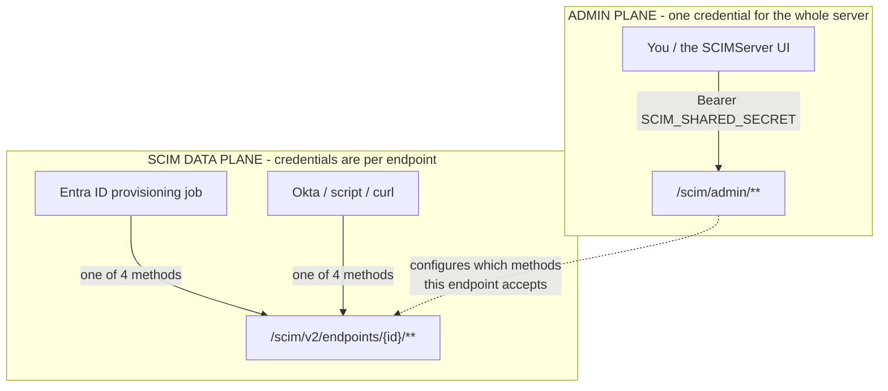
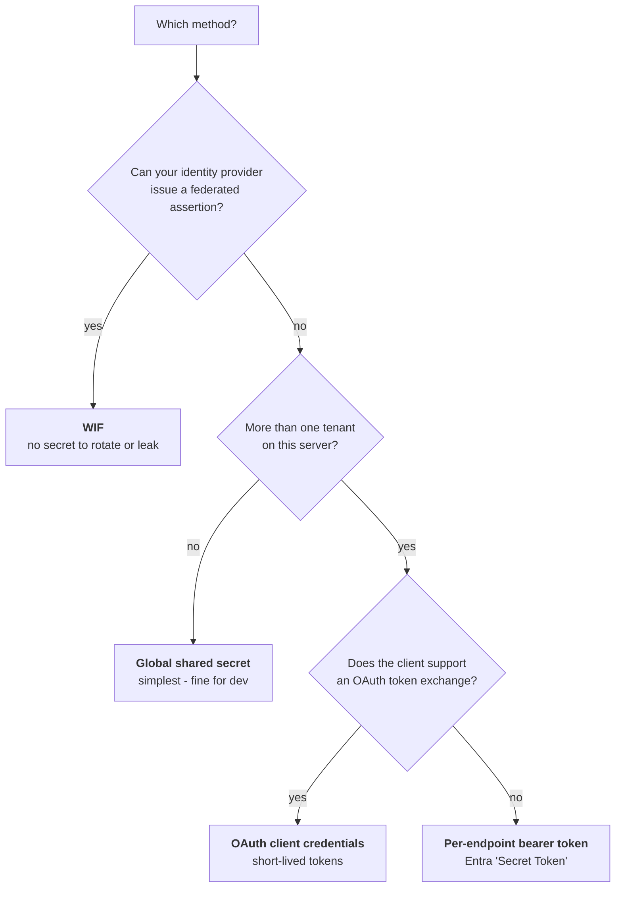
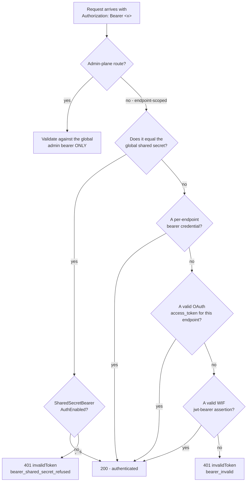
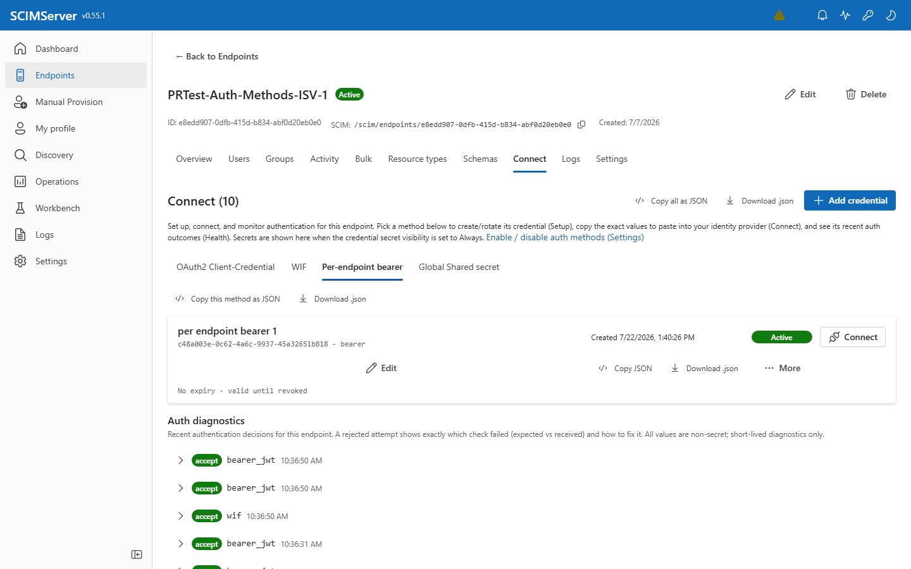
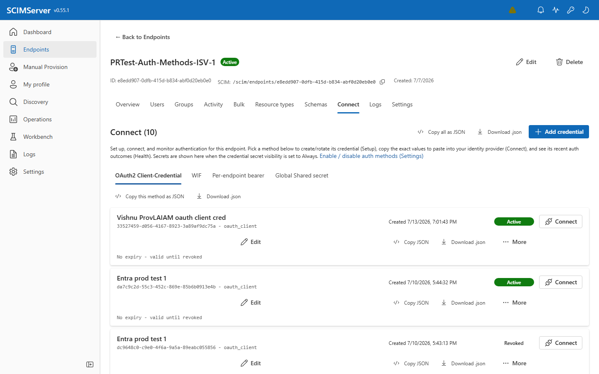
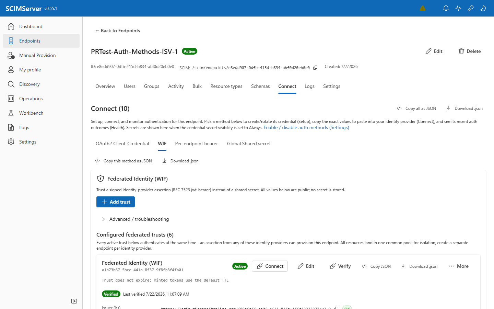
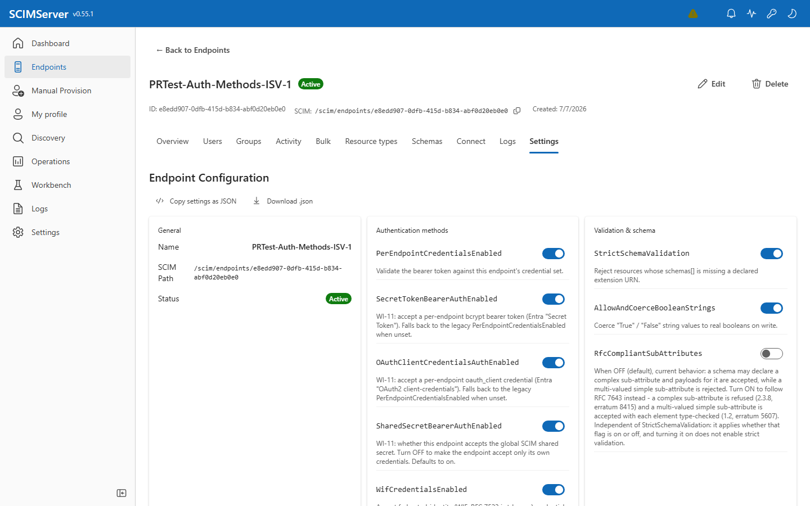
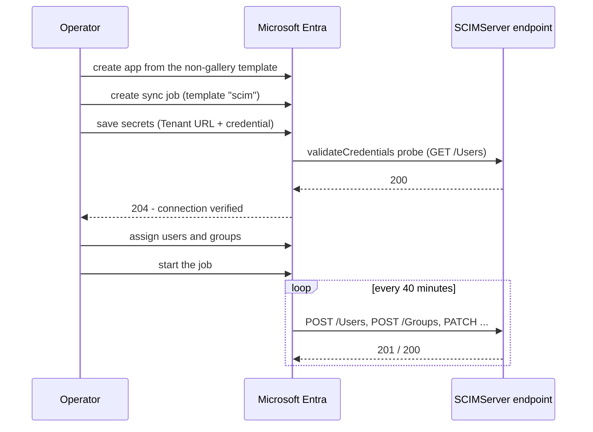

# Authentication Guide

> **Status:** Living reference - **Created:** 2026-07-31 - **Last verified:** 2026-07-31 - **Product version:** `0.55.1`
>
> **Everything in this guide was measured against running servers.** Request and response bodies are verbatim wire captures; status codes are what the server actually returned; screenshots were taken on **2026-07-31** from the live dev estate at v0.55.1. The Microsoft Entra walkthrough in [Section 7](#7-connecting-microsoft-entra-id) was performed end to end against **customer-facing production**, and the users it provisioned are still there. Live secret values are redacted as `<...>`; nothing else is edited.
>
> **Companion docs:** [ENDPOINT_SETTINGS_OPERATOR_GUIDE.md](ENDPOINT_SETTINGS_OPERATOR_GUIDE.md) - all 27 endpoint settings. [UI_GUIDE.md](UI_GUIDE.md) - screen-by-screen tour. [COMPLETE_API_REFERENCE.md](COMPLETE_API_REFERENCE.md) - route reference.

---

## Contents

1. [The one thing to understand first](#1-the-one-thing-to-understand-first)
2. [Pick a method in 30 seconds](#2-pick-a-method-in-30-seconds)
3. [Where authentication lives in the UI](#3-where-authentication-lives-in-the-ui)
4. [How a request is authenticated](#4-how-a-request-is-authenticated)
5. [The four methods, step by step](#5-the-four-methods-step-by-step)
6. [Hardening an endpoint](#6-hardening-an-endpoint)
7. [Connecting Microsoft Entra ID](#7-connecting-microsoft-entra-id)
8. [Troubleshooting](#8-troubleshooting)
9. [Reference](#9-reference)

---

## 1. The one thing to understand first

SCIMServer has **two planes**, and they use **different credentials**. Almost every authentication question resolves once this is clear.

| | Admin plane | SCIM data plane |
|---|---|---|
| **Paths** | `/scim/admin/...` | `/scim/v2/endpoints/{id}/...` and `/scim/endpoints/{id}/...` |
| **Who uses it** | you - creating endpoints, editing settings, reading logs | the provisioning client - Entra ID, Okta, a script |
| **Credential** | the **global** admin bearer (`SCIM_SHARED_SECRET`) | whatever **that endpoint** is configured to accept |
| **Scope** | the whole server | one endpoint |



An endpoint's choice about which credentials its **data plane** accepts says nothing about who may **administer** it. You can switch off every data-plane method on an endpoint and still open it in the UI and fix it.

> **This was genuinely broken before 0.55.1.** Two admin routes (`/overview` and `/stats`) started returning 401 when an endpoint's data-plane auth was disabled, because the auth guard extracted an endpoint id from any URL matching `/endpoints/<uuid>/`. Since that pattern needs a trailing slash, `/admin/endpoints/{id}` was fine while `/admin/endpoints/{id}/overview` was not. If you are on 0.55.1 or later this cannot happen.

---

## 2. Pick a method in 30 seconds



| Method | Setting that enables it | What the client sends | Secret lifetime |
|---|---|---|---|
| **Global shared secret** | `SharedSecretBearerAuthEnabled` (default **on**) | `Authorization: Bearer <SCIM_SHARED_SECRET>` | forever, shared by every endpoint |
| **Per-endpoint bearer** | `SecretTokenBearerAuthEnabled` | `Authorization: Bearer <endpoint token>` | until revoked |
| **OAuth client credentials** | `OAuthClientCredentialsAuthEnabled` | exchange client id + secret for an `access_token` | token 1 hour, secret until rotated |
| **Workload Identity Federation** | `WifCredentialsEnabled` | RFC 7523 `jwt-bearer` assertion | assertion ~1 hour, **no stored secret** |

> `PerEndpointCredentialsEnabled` is a legacy master switch. The bearer and OAuth flags fall back to it when they are unset, so leaving it on is harmless.

---

## 3. Where authentication lives in the UI

Everything is on the endpoint's **Connect** tab. There is no separate Credentials tab - `/credentials` redirects here.


The tab is organised as **Setup -> Connect -> Health**:

- **Setup** - create or rotate a credential for a method
- **Connect** - copy the exact values to paste into your identity provider
- **Health** - see recent authentication outcomes for this endpoint

Four sub-tabs, one per method: **OAuth2 Client-Credential**, **WIF**, **Per-endpoint bearer**, **Global Shared secret**. The **Enable / disable auth methods (Settings)** link jumps to the switches that turn each method on or off.

Whether a method's secret is visible here is governed by `CredentialSecretVisibility` (`always` or `once`).

---

## 4. How a request is authenticated

The server tries methods in order and the first one that accepts wins. A method that is switched off is skipped, not tried and failed.



### What the endpoint advertises

Clients discover available schemes from `ServiceProviderConfig`. On a fresh `entra-id` endpoint:

```json
{
  "authenticationSchemes": [
    {
      "name": "OAuth Bearer Token",
      "type": "oauthbearertoken",
      "primary": true
    }
  ]
}
```

Turn `WifCredentialsEnabled` on and the same endpoint advertises a second scheme:

```json
{
  "authenticationSchemes": [
    {
      "name": "OAuth Bearer Token",
      "type": "oauthbearertoken",
      "primary": true
    },
    {
      "name": "Workload Identity Federation",
      "type": "oauth2",
      "primary": false
    }
  ]
}
```

---

## 5. The four methods, step by step

### 5.1 Global shared secret

The default. Every endpoint accepts it until you turn it off.

```http
GET /scim/v2/endpoints/{endpointId}/Users?count=1 HTTP/1.1
Host: scimserver-dev.proudbush-ae90986e.eastus.azurecontainerapps.io
Authorization: Bearer changeme-scim
```

**Use it for** local development, demos, a single-tenant deployment you fully control.

**Do not use it for** multiple independent tenants. Every endpoint shares one secret, so a client configured for endpoint A can call endpoint B. Close that off by setting `SharedSecretBearerAuthEnabled` to `False` on the endpoint and issuing it its own credential.

---

### 5.2 Per-endpoint bearer token

This is the value you paste into Entra's **Secret Token** field.



**Create one**

```http
POST /scim/admin/endpoints/{endpointId}/credentials HTTP/1.1
Authorization: Bearer <admin-token>
Content-Type: application/json
```

```json
{
  "credentialType": "bearer",
  "label": "entra-secret-token"
}
```

**Response `201`** - measured keys: `id`, `endpointId`, `credentialType`, `label`, `description`, `active`, `createdAt`, `expiresAt`, `token`.

```json
{
  "id": "ebe06e5b-6708-4e5d-be2e-ee4c06634a3d",
  "endpointId": "72c18731-52d7-43d3-bada-370c15e0dfc8",
  "credentialType": "bearer",
  "label": "entra-secret-token",
  "active": true,
  "createdAt": "2026-07-31T13:05:00.000Z",
  "token": "<43-character secret - shown once>"
}
```

> **The `token` is returned once and never again.** It is stored as a bcrypt hash, so the server itself cannot show it to you later. Copy it when you create it. `CredentialSecretVisibility` controls whether the UI keeps it on screen (`always`) or hides it after first reveal (`once`).

**Use it**

```http
GET /scim/v2/endpoints/{endpointId}/Users?count=1 HTTP/1.1
Authorization: Bearer <the token from above>
```

Measured: **200**.

---

### 5.3 OAuth 2.0 client credentials

Entra's **OAuth2 client-credentials** option. Two steps: mint a client, then exchange it for a short-lived access token.



**Create the client**

```json
{
  "credentialType": "oauth_client",
  "label": "entra-oauth-client"
}
```

**Response `201`** adds `clientId` and `clientSecret`. The `clientId` is derived from the endpoint id:

```json
{
  "id": "33527459-d056-4167-8923-3a89af9dc75a",
  "credentialType": "oauth_client",
  "label": "entra-oauth-client",
  "active": true,
  "clientId": "client-id-72c18731-52d7-43d3-bada-370c15e0dfc8",
  "clientSecret": "<shown once>"
}
```

**Exchange it for a token**

```http
POST /scim/endpoints/{endpointId}/oauth/token HTTP/1.1
Content-Type: application/json
```

```json
{
  "grant_type": "client_credentials",
  "client_id": "client-id-72c18731-52d7-43d3-bada-370c15e0dfc8",
  "client_secret": "<the clientSecret>"
}
```

**Response `200`**, measured verbatim:

```json
{
  "access_token": "<jwt>",
  "token_type": "Bearer",
  "expires_in": 3600,
  "scope": "scim"
}
```

The token is valid for **3600 seconds**. Re-exchange when it expires.

---

### 5.4 Workload Identity Federation (WIF)

Secretless. Instead of holding a long-lived secret, the client presents a JWT signed by an identity provider you have told the endpoint to trust (RFC 7523 `jwt-bearer`).



A trust pins five things. All are **public** - no secret is stored:

| Field | What it must match | Where it comes from in Entra |
|---|---|---|
| `expectedIssuer` | the assertion's `iss` | `https://login.microsoftonline.com/<tenantId>/v2.0` |
| `expectedSubject` | the assertion's `sub` | the **service principal object id** |
| `expectedAudience` | the assertion's `aud` | the resource app's Application ID URI or app id |
| `expectedTenantId` | the assertion's `tid` | your tenant id |
| `requiredRoles` | a subset of the assertion's `roles` | an app role such as `Scim.Provision` |

A real assertion, decoded during the verification run:

```json
{
  "iss": "https://login.microsoftonline.com/f08e6aff-ca0f-4f11-81fa-1ffd43323373/v2.0",
  "aud": "70a79486-167b-42f8-a2c5-de85a3f4e229",
  "sub": "2bd6f086-353a-44e8-b8a6-78d6878733d6",
  "tid": "f08e6aff-ca0f-4f11-81fa-1ffd43323373",
  "azp": "70a79486-167b-42f8-a2c5-de85a3f4e229",
  "roles": ["Scim.Provision"]
}
```

> **Every active trust authenticates at the same time.** An assertion from *any* configured trust can provision this endpoint, and all resources land in one common pool. If you need isolation between identity providers, create a **separate endpoint per provider**. The UI states this on the WIF tab.

**Two things that will bite you when setting up the Entra side**, both hit during the verification run:

| Symptom | Cause | Fix |
|---|---|---|
| `AADSTS501051: Application ... is not assigned to a role` | the app has no app role assigned to its own service principal, so the token carries no `roles` | define an app role (`allowedMemberTypes: ["Application"]`) and assign it to the app's own SP |
| `AADSTS500011: The resource principal named api://<appId> was not found` | the app has no Application ID URI | set `identifierUris` to `api://<appId>` |

**TTL is capped to the assertion.** If you ask for a 6-hour token against a 1-hour assertion, the minted token is capped so it never outlives the authorization that produced it. Verified: a 6h request against a 1h assertion produced an overrun of **-1s**.

#### JWKS host allowlist

The server only fetches signing keys from allowlisted hosts. The seeded set:

`accounts.google.com`, `login.chinacloudapi.cn`, `login.microsoftonline.com`, `login.microsoftonline.us`, `login.partner.microsoftonline.cn`, `www.googleapis.com`

If your issuer uses the legacy Entra v1 host `login.windows.net`, add it:

```http
POST /scim/admin/settings/jwks-hosts HTTP/1.1
Authorization: Bearer <admin-token>
Content-Type: application/json
```

```json
{
  "host": "login.windows.net",
  "label": "AAD v1 issuer"
}
```

`GET /scim/admin/settings/jwks-hosts` returns `seed`, `env`, `persisted` and `effective` arrays so you can see exactly where each host came from.

Four settings tune the fetch: `JwksFetchTimeoutMs`, `JwksFetchRetries`, `JwksFetchRetryBackoffMs`, `JwksCacheMaxAgeMs`. See [the settings guide](ENDPOINT_SETTINGS_OPERATOR_GUIDE.md).

---

## 6. Hardening an endpoint

Enabling a method and **disabling the global shared secret** is what actually isolates an endpoint. The switches are on the Settings tab.



```http
PATCH /scim/admin/endpoints/{endpointId} HTTP/1.1
Authorization: Bearer <admin-token>
Content-Type: application/json
```

```json
{
  "profile": {
    "settings": {
      "SecretTokenBearerAuthEnabled": "True",
      "SharedSecretBearerAuthEnabled": "False"
    }
  }
}
```

Measured effect of turning `SharedSecretBearerAuthEnabled` off, on 0.55.1:

| Call | Before | After |
|---|---|---|
| `GET /scim/admin/endpoints` | 200 | 200 |
| `GET /scim/admin/endpoints/{id}` | 200 | 200 |
| `GET /scim/admin/endpoints/{id}/overview` | 200 | 200 |
| `GET /scim/admin/endpoints/{id}/stats` | 200 | 200 |
| `GET /scim/v2/endpoints/{id}/Users` | 200 | **401** |

Only the data plane changes. You can always get back in and re-enable it.

---

## 7. Connecting Microsoft Entra ID

This section was performed end to end against **customer-facing production** on 2026-07-31. The users it provisioned are still on that endpoint.

### 7.1 Which fields Entra needs

The endpoint tells you. `GET /scim/admin/endpoints/{id}/connection-info` returns, per enabled method, the exact Entra field names and the values to paste. Verbatim excerpt:

```json
{
  "enabledMethods": [
    {
      "method": "bearer",
      "label": "Per-endpoint bearer token (Secret Token)",
      "entraAuthenticationMethod": "Secret Token",
      "entraFields": {
        "tenantUrl": "https://<host>/scim/v2/endpoints/<endpointId>",
        "secretToken": "<redacted>"
      },
      "validity": "ok"
    },
    {
      "method": "oauth_client",
      "label": "OAuth2 client credentials",
      "entraAuthenticationMethod": "OAuth2 Client Credentials Grant",
      "entraFields": {
        "tenantUrl": "https://<host>/scim/v2/endpoints/<endpointId>",
        "tokenEndpoint": "https://<host>/scim/endpoints/<endpointId>/oauth/token",
        "clientIdentifier": "client-id-<endpointId>",
        "clientSecret": "<redacted>"
      },
      "validity": "unverified"
    },
    {
      "method": "wif",
      "label": "Workload Identity Federation",
      "entraAuthenticationMethod": "Workload Identity based authentication",
      "entraFields": {
        "tenantUrl": "https://<host>/scim/v2/endpoints/<endpointId>",
        "tokenEndpoint": "https://<host>/scim/endpoints/<endpointId>/oauth/token",
        "clientIdentifier": "<endpointId>"
      },
      "expectedAudience": "3899c688-f6e4-4f49-ad70-f6b86cef502c",
      "expectedAssertionSubject": "b06b3b54-ab22-4844-af61-044d111c517a",
      "validity": "ok"
    }
  ]
}
```

The same values are on the **Connect** tab behind each method's **Connect** button.

### 7.2 Setting up provisioning



| Entra field | Value |
|---|---|
| **Tenant URL** | `https://<host>/scim/v2/endpoints/<endpointId>` |
| **Secret Token** | the per-endpoint bearer token, or the global shared secret |

Assignment matters: the SCIM template's default scope is **"Sync only assigned users and groups"**, so an app with nothing assigned runs and provisions nothing while still reporting success.

### 7.3 Two problems you will probably hit

Both were hit during the production run, and neither is obvious.

**Users fail with `emails: Required attribute 'emails' is missing`.** The `entra-id` preset requires `userName`, `displayName` and `emails`. Entra's default mapping sources `emails[type eq "work"].value` from `mail`, and cloud-only Entra users have no `mail` unless they are Exchange-licensed. So Entra sends nothing and the endpoint correctly rejects the create. Verbatim from Entra's provisioning log:

```text
errorCode : SystemForCrossDomainIdentityManagementServiceIncompatible
Web Response:
{"schemas":["urn:ietf:params:scim:api:messages:2.0:Error"],
 "detail":"Schema validation failed: emails: Required attribute 'emails' is missing.",
 "scimType":"invalidValue","status":"400",
 "urn:scimserver:api:messages:2.0:Diagnostics":{
   "triggeredBy":"StrictSchemaValidation",
   "activeConfig":{"StrictSchemaValidation":true}}}
```

Fix the **mapping**, not the endpoint: point `emails[type eq "work"].value` at `userPrincipalName`, which always exists. Weakening the endpoint would only hide the problem.

**OAuth fails with `bearer_oauth_signature_invalid`.** Entra does **not** perform the initial token exchange itself. It expects to already hold an access token in the `Oauth2AccessToken` secret and uses the token endpoint only to *refresh* it. With only client id, secret and exchange URI set, Entra goes straight to `/Users` with an invalid token. The endpoint's own request log makes this unmistakable: the `/Users` failures had **no preceding call** to `/oauth/token`.

Mint a token from the endpoint and seed it alongside the other values:

| Secret key | Value |
|---|---|
| `BaseAddress` | the Tenant URL |
| `Oauth2ClientId` | `client-id-<endpointId>` |
| `Oauth2ClientSecret` | the client secret |
| `Oauth2TokenExchangeUri` | `https://<host>/scim/endpoints/<endpointId>/oauth/token` |
| `Oauth2AccessToken` | a freshly minted `access_token` |
| `Oauth2AccessTokenCreationTime` | ISO-8601 timestamp |

After seeding, Entra's own `validateCredentials` returned **204**.

### 7.4 What actually provisioned

| App | Method | Entra validateCredentials | Result on the endpoint |
|---|---|---|---|
| `SCIMServer-Calmsand-SecretToken` | Secret Token | **204** | 3 users created, group membership 0 to 3 |
| `SCIMServer-Calmsand-OAuth2ClientCreds` | OAuth2 client credentials | **204** | 1 dedicated user created |

The endpoint went from 2 users to 6. The OAuth app was deliberately given its **own** user, because both apps target the same endpoint and a job can report success purely by matching records another app already created.

### 7.5 WIF and Entra provisioning - an honest limitation

**Entra's provisioning service cannot currently be configured for WIF outbound through the Graph API.** The synchronization secrets API has a fixed key enum; `TenantId` and `WorkloadIdentityFederationEnabled` both return *"Requested value ... was not found"* and nothing persists. None of the existing SCIM provisioning apps in the tenant carry any WIF-shaped secret key.

This is a gap on the Entra side, not in SCIMServer. The server's WIF support is fully working and was verified against customer-facing production with a genuine Microsoft-signed assertion: **50 of 50 assertions passed**, covering trust setup, assertion validation, token mint, TTL capping and real SCIM provisioning.

So today: use **Secret Token** or **OAuth2 client credentials** for Entra provisioning jobs, and use **WIF** for any client that can present a `jwt-bearer` assertion directly.

---

## 8. Troubleshooting

### Start with Auth diagnostics

The Connect tab shows recent authentication decisions for the endpoint. A rejected attempt shows exactly which check failed, expected versus received, and how to fix it. All values are non-secret.

### Read the error envelope

Every failure carries a diagnostics extension. Verbatim 401:

```json
{
  "schemas": ["urn:ietf:params:scim:api:messages:2.0:Error"],
  "detail": "Invalid bearer token.",
  "status": "401",
  "scimType": "invalidToken",
  "urn:scimserver:api:messages:2.0:Diagnostics": {
    "reason_code": "bearer_invalid",
    "requestId": "2fe79251-758a-4151-b26d-522e1fba995f",
    "endpointId": "889be902-6330-4c0d-a794-3327a888274f",
    "logsUrl": "/scim/endpoints/889be902-6330-4c0d-a794-3327a888274f/logs/recent?requestId=2fe79251-758a-4151-b26d-522e1fba995f"
  }
}
```

`logsUrl` is a deep link. Follow it to see the request exactly as the server saw it.

### Reason codes

| `reason_code` | Meaning | Fix |
|---|---|---|
| `bearer_invalid` | the token matched no configured credential | check you are using the right credential for this endpoint |
| `bearer_shared_secret_refused` | the token **is** the global shared secret, but this endpoint refuses it | enable `SharedSecretBearerAuthEnabled`, or use the endpoint's own credential |
| `bearer_oauth_signature_invalid` | an OAuth-shaped token whose signature did not verify | the token was not minted by this server, or is stale - re-exchange |
| `oauth_client_auth_failed` | client id or secret rejected at the token endpoint | re-check `client_id` and `client_secret`; rotate if unsure |
| `wif_issuer_mismatch` | assertion `iss` did not match `expectedIssuer` | align the trust; v1.0 and v2.0 issuers differ |
| `wif_subject_mismatch` | assertion `sub` did not match `expectedSubject` | use the **service principal object id** |
| `wif_audience_mismatch` | assertion `aud` did not match `expectedAudience` | set the resource app's Application ID URI |
| `wif_missing_role` | assertion is missing a required role | grant the app role, or remove it from `requiredRoles` |

### Common situations

| Symptom | Likely cause |
|---|---|
| The UI logs you out when you change an auth setting | a pre-0.55.1 build. Fixed in 0.55.1 - a data-plane 401 no longer ends the admin session |
| WIF verification fails against a healthy issuer | the issuer host is not on the JWKS allowlist |
| Entra Test Connection fails on a user-only endpoint | it probes `/Groups`. Turn `EnforceResourceTypes` **off** so an un-served type returns `200 empty` instead of `404` |
| Everything worked, then stopped after an hour | an OAuth `access_token` expired and was not refreshed |

---

## 9. Reference

### Routes

| Purpose | Route |
|---|---|
| Create a credential | `POST /scim/admin/endpoints/{id}/credentials` |
| List credentials (metadata only) | `GET /scim/admin/endpoints/{id}/credentials` |
| Entra field values per method | `GET /scim/admin/endpoints/{id}/connection-info` |
| Token exchange | `POST /scim/endpoints/{id}/oauth/token` |
| OAuth metadata (RFC 8414) | `GET /scim/endpoints/{id}/.well-known/oauth-authorization-server` |
| Advertised schemes | `GET /scim/v2/endpoints/{id}/ServiceProviderConfig` |
| JWKS host allowlist | `GET` and `POST /scim/admin/settings/jwks-hosts` |
| Request log for a requestId | `GET /scim/endpoints/{id}/logs/recent?requestId=...` |

### Settings

| Setting | Default | Governs |
|---|---|---|
| `SharedSecretBearerAuthEnabled` | on | the global shared secret on this endpoint |
| `SecretTokenBearerAuthEnabled` | falls back to `PerEndpointCredentialsEnabled` | per-endpoint bearer tokens |
| `OAuthClientCredentialsAuthEnabled` | falls back to `PerEndpointCredentialsEnabled` | `oauth_client` credentials |
| `PerEndpointCredentialsEnabled` | off | legacy master switch for the two above |
| `WifCredentialsEnabled` | off | federated assertions and WIF scheme advertisement |
| `CredentialSecretVisibility` | `once` | whether the UI keeps a secret on screen |
| `PersistRequestSecrets` | on | whether request logs retain secret-bearing values |

### Source

| Concern | Path |
|---|---|
| Guard, plane separation, method cascade | [api/src/modules/auth/shared-secret.guard.ts](../api/src/modules/auth/shared-secret.guard.ts) |
| Credential CRUD | [api/src/modules/scim/controllers/admin-credential.controller.ts](../api/src/modules/scim/controllers/admin-credential.controller.ts) |
| WIF end-to-end proof harness | [scripts/wif-e2e-proof.ps1](../scripts/wif-e2e-proof.ps1) |
