# Authentication Guide

> **Status:** Living reference - **Last verified:** 2026-09-04 - **Product version:** `0.55.20`
>
> **Everything here was measured against a running server.** Request and response bodies are verbatim wire captures. Status codes and `reason_code` values are what the server actually returned. The reason-code table in [Section 8](#8-troubleshooting) is generated from [auth-reason-catalog.ts](../api/src/oauth/auth-reason-catalog.ts), so it cannot drift from the implementation.
>
> **Reference endpoint.** All screenshots and traces come from the dev endpoint **`PRTest-Auth-Methods-ISV-1`** (`e8edd907-0dfb-415d-b834-abf0d20eb0e0`), which has **all four authentication methods enabled at once**, **six federated trusts**, and **real Microsoft Entra applications provisioning into it**. At capture time it held 767 request-log rows and 50 recorded auth decisions across `shared_secret`, `bearer_jwt` and `wif`.
>
> **Reproduce the screenshots:** `pwsh scripts/capture-auth-guide.ps1 -BaseUrl <url> -EndpointId <id> -Apply`
>
> **Companions:** [ENDPOINT_SETTINGS_OPERATOR_GUIDE.md](ENDPOINT_SETTINGS_OPERATOR_GUIDE.md) - every endpoint setting. [UI_GUIDE.md](UI_GUIDE.md) - screen tour. [COMPLETE_API_REFERENCE.md](COMPLETE_API_REFERENCE.md) - route reference.

---

## Contents

1. [The one thing to understand first](#1-the-one-thing-to-understand-first)
2. [Pick a method](#2-pick-a-method)
3. [Where authentication lives in the UI](#3-where-authentication-lives-in-the-ui)
4. [How a request is actually authenticated](#4-how-a-request-is-actually-authenticated)
5. [The four methods, step by step](#5-the-four-methods-step-by-step)
6. [Workload Identity Federation in depth](#6-workload-identity-federation-in-depth)
7. [Connecting Microsoft Entra ID](#7-connecting-microsoft-entra-id)
8. [Troubleshooting](#8-troubleshooting)
9. [Reference](#9-reference)

---

## 1. The one thing to understand first

SCIMServer has **two planes**, and they use **different credentials**. Almost every authentication question resolves once this is clear.

| | Admin plane | SCIM data plane |
|---|---|---|
| **Paths** | `/scim/admin/...` | `/scim/v2/endpoints/{id}/...` and `/scim/endpoints/{id}/...` |
| **Who uses it** | you - creating endpoints, editing settings, reading logs | the provisioning client - Entra ID, Okta, a script |
| **Credential** | the **global** admin bearer (`SCIM_SHARED_SECRET`) | whatever **that endpoint** is configured to accept |
| **Scope** | the whole server | one endpoint |

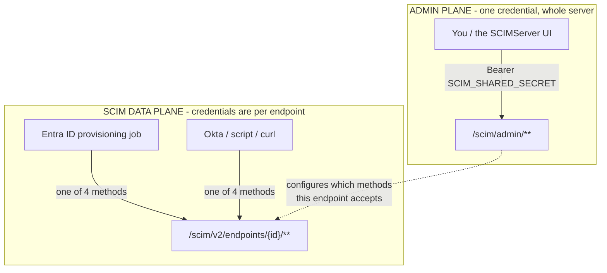

An endpoint's choice about which credentials its **data plane** accepts says nothing about who may **administer** it. You can switch off every data-plane method and still open the endpoint in the UI and fix it.

> **This was genuinely broken before 0.55.1.** Two admin routes (`/overview`, `/stats`) returned 401 when data-plane auth was disabled, because the guard extracted an endpoint id from any URL matching `/endpoints/<uuid>/`. That pattern needs a trailing slash, so `/admin/endpoints/{id}` worked while `/admin/endpoints/{id}/overview` did not. Fixed in 0.55.1.

---

## 2. Pick a method

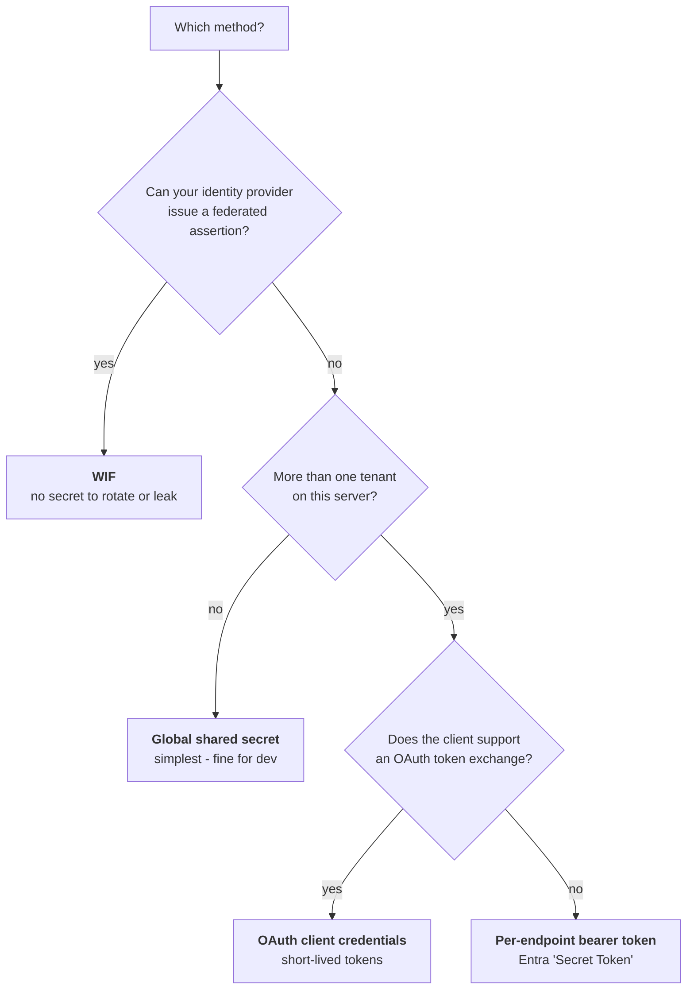

| Method | Setting that enables it | What the client sends | Secret lifetime |
|---|---|---|---|
| **Global shared secret** | `SharedSecretBearerAuthEnabled` (default **on**) | `Authorization: Bearer <SCIM_SHARED_SECRET>` | forever, shared by every endpoint |
| **Per-endpoint bearer** | `SecretTokenBearerAuthEnabled` | `Authorization: Bearer <endpoint token>` | until revoked |
| **OAuth client credentials** | `OAuthClientCredentialsAuthEnabled` | exchange client id + secret for an `access_token` | token 1 hour, secret until rotated |
| **Workload Identity Federation** | `WifCredentialsEnabled` | RFC 7523 `jwt-bearer` assertion | assertion about 1 hour, **no stored secret** |

> `PerEndpointCredentialsEnabled` is a legacy master switch. The bearer and OAuth flags fall back to it when unset, so leaving it on is harmless.

**These are not mutually exclusive.** The reference endpoint runs all four simultaneously, which is exactly why its diagnostics show `shared_secret`, `bearer_jwt` and `wif` decisions interleaved.

---

## 3. Where authentication lives in the UI

Everything is on the endpoint's **Connect** tab. There is no separate Credentials tab; `/endpoints/{id}/credentials` redirects here.

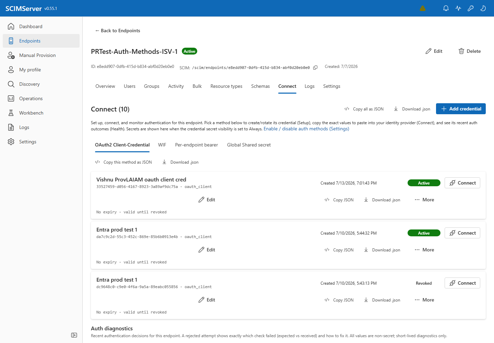

The tab is organised as **Setup -> Connect -> Health**:

- **Setup** - create or rotate a credential for a method
- **Connect** - copy the exact values to paste into your identity provider
- **Health** - recent authentication outcomes for this endpoint

One sub-tab per method. Only **enabled** methods appear, so the sub-tab row is itself a live readout of the endpoint's auth configuration.

| Sub-tab | Testid |
|---|---|
| OAuth2 Client-Credential | `credentials-method-tab-oauth_client` |
| WIF | `credentials-method-tab-wif` |
| Per-endpoint bearer | `credentials-method-tab-bearer` |
| Global Shared secret | `credentials-method-tab-shared_secret` |

**Global Shared secret** - the server-wide credential, shown here so you can see whether this endpoint still accepts it:

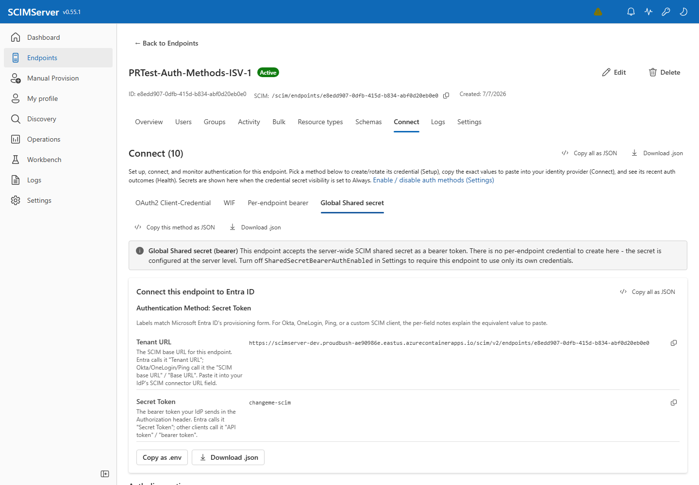

**Per-endpoint bearer** - Entra's "Secret Token" value:

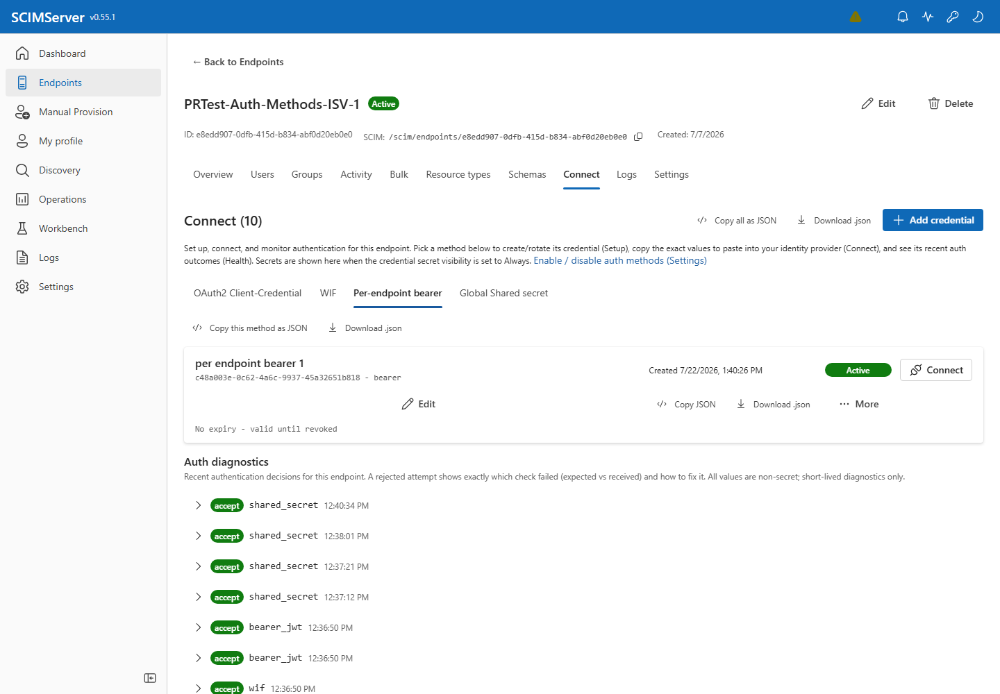

**OAuth2 Client-Credential** - client id, client secret and token endpoint:


The auth switches themselves live on **Settings**:

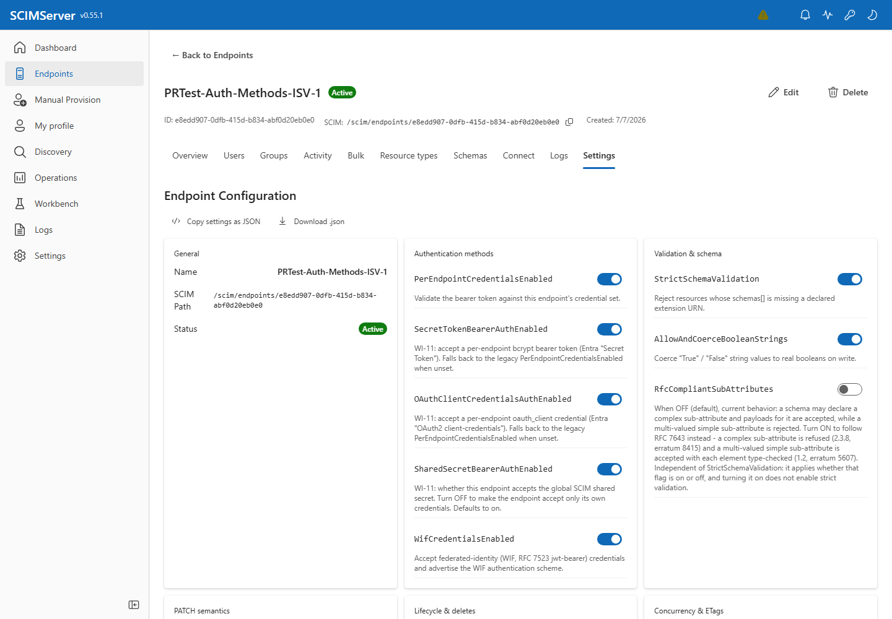

---

## 4. How a request is actually authenticated

> **Each endpoint has a limit on how many ACTIVE credentials of each type it may hold**, because
> every additional one makes authentication measurably slower. When a per-endpoint opaque secret is
> presented, the server compares it against **every** active credential using bcrypt - measured at
> roughly **293 ms per comparison** - so three credentials already push a failed attempt past the
> 800 ms latency budget. Defaults are `MaxActiveBearerCredentials` **5**,
> `MaxActiveOAuthClientCredentials` **5**, `MaxActiveWifTrusts` **10** (bounds 1 - 25, editable per
> endpoint on the Settings tab). WIF is more generous on purpose: WIF trusts are verified against a
> JWKS and never enter that comparison loop. Exceeding a cap refuses the **create** with `400`; it
> never affects credentials that already exist. Deactivating one frees a slot immediately.

The server tries methods in order; the first that accepts wins. A disabled method is **skipped**, not tried and failed. Every attempt produces an **Auth Decision Trace**: an ordered list of checks, each with `expected` and `received`.

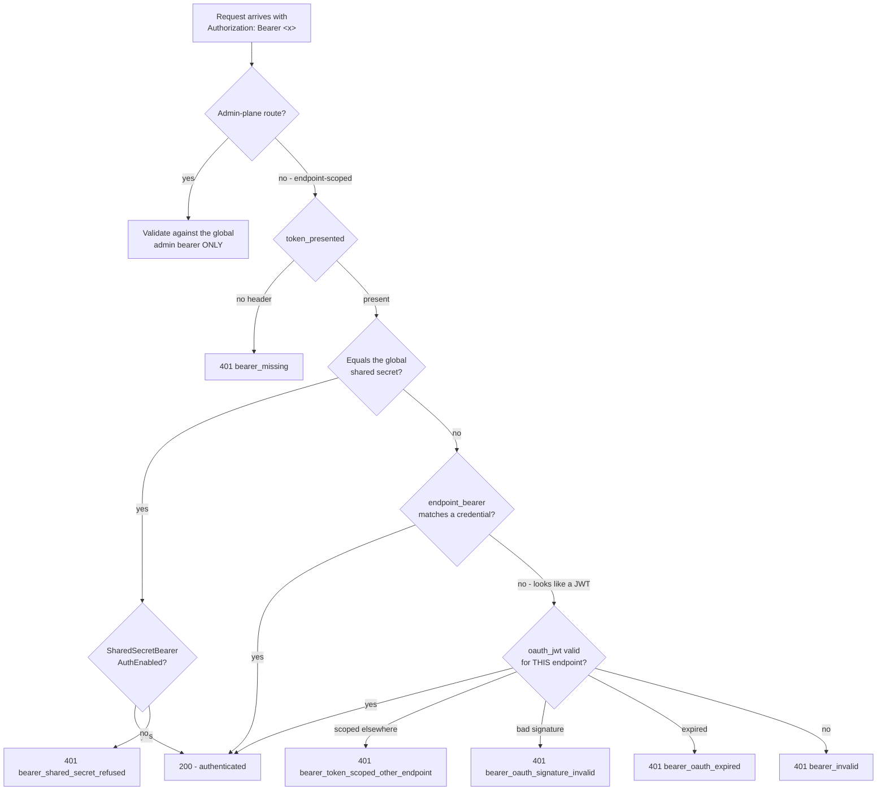

A real accepted resource-plane trace from the reference endpoint, showing the cascade working exactly as drawn - the per-endpoint bearer check is **skipped** because the token is a JWT, so OAuth validation handles it:

| Check | Status | Expected | Received |
|---|---|---|---|
| `token_presented` | PASS | `Authorization: Bearer <token>` | `bearer` |
| `endpoint_bearer` | SKIP | a matching per-endpoint bearer credential | token is a JWT (validated by OAuth, not a per-endpoint opaque secret) |
| `oauth_jwt` | PASS | a valid OAuth 2.0 JWT | valid (endpoint-scoped) |

### What the endpoint advertises

Clients discover schemes from `ServiceProviderConfig`. With WIF enabled the endpoint advertises two:

```json
{
  "authenticationSchemes": [
    {
      "name": "OAuth Bearer Token",
      "type": "oauthbearertoken",
      "primary": true
    },
    {
      "name": "Workload Identity Federation",
      "type": "oauth2",
      "primary": false
    }
  ]
}
```

---

## 5. The four methods, step by step

### 5.1 Global shared secret

The default. Every endpoint accepts it until you turn it off.

```http
GET /scim/v2/endpoints/{endpointId}/Users?count=1 HTTP/1.1
Host: scimserver-dev.purplecliff-91e4026d.eastus.azurecontainerapps.io
Authorization: Bearer changeme-scim
```

**Use it for** local development, demos, a single-tenant deployment you control.

**Do not use it for** multiple independent tenants: every endpoint shares one secret, so a client configured for endpoint A can call endpoint B. Set `SharedSecretBearerAuthEnabled` to `False` and issue the endpoint its own credential.

### 5.2 Per-endpoint bearer token

The value you paste into Entra's **Secret Token** field.

```http
POST /scim/admin/endpoints/{endpointId}/credentials HTTP/1.1
Authorization: Bearer <admin-token>
Content-Type: application/json
```

```json
{
  "credentialType": "bearer",
  "label": "entra-secret-token"
}
```

**Response `201`** - measured keys: `id`, `endpointId`, `credentialType`, `label`, `description`, `active`, `createdAt`, `expiresAt`, `token`.

```json
{
  "id": "ebe06e5b-6708-4e5d-be2e-ee4c06634a3d",
  "endpointId": "e8edd907-0dfb-415d-b834-abf0d20eb0e0",
  "credentialType": "bearer",
  "label": "entra-secret-token",
  "active": true,
  "createdAt": "2026-07-31T13:05:00.000Z",
  "expiresAt": null,
  "token": "<43-character secret - shown once>"
}
```

> **The `token` is returned once.** It is stored as a bcrypt hash, so the server cannot show it to you again. `CredentialSecretVisibility` controls whether the UI keeps it on screen (`always`) or hides it after first reveal (`once`).

> **Token format (v0.55.16).** A bearer credential is now issued as
> `scim_<lookupKey>_<secret>`. The `lookupKey` half is a **public identifier** -
> it names which credential the token is, so the server verifies it with one
> indexed lookup and one constant-time comparison. Before this, a presented token
> had to be bcrypt-compared against *every* active credential on the endpoint
> (~287 ms each), which an unauthenticated caller could force; a wrong token
> against 10 credentials now answers in **7 ms** instead of ~2.9 s.
>
> The `scim_` prefix is deliberate, so secret scanners can recognise a leaked
> credential. **Credentials issued before v0.55.16 keep working unchanged** and
> are upgraded when you rotate them.

> **There is a limit on how many can be ACTIVE at once.** Each credential type
> has its own cap - `MaxActiveBearerCredentials` and
> `MaxActiveOAuthClientCredentials` default to **5**, `MaxActiveWifTrusts` to
> **10** - and a create or re-activate past the cap returns `400` naming the
> flag. Deactivating a credential frees a slot immediately.
>
> This is not bookkeeping. An opaque bearer token carries nothing that says which
> credential it is, so the server must bcrypt-compare a presented token against
> **every** active secret credential on the endpoint - measured at ~293 ms each.
> The cap bounds how much work an unauthenticated caller can force. Raise it
> deliberately: a higher cap is a higher worst-case cost per request. Rotation is
> exempt, so a compromised secret can always be replaced.
> See [ENDPOINT_CONFIG_FLAGS_REFERENCE.md](ENDPOINT_CONFIG_FLAGS_REFERENCE.md#active-credential-caps-p2).

### 5.3 OAuth 2.0 client credentials

Two steps: mint a client, then exchange it for a short-lived access token.

```json
{
  "credentialType": "oauth_client",
  "label": "entra-oauth-client"
}
```

**Response `201`** adds `clientId` (derived from the endpoint id) and `clientSecret`:

```json
{
  "id": "33527459-d056-4167-8923-3a89af9dc75a",
  "credentialType": "oauth_client",
  "label": "entra-oauth-client",
  "active": true,
  "clientId": "client-id-e8edd907-0dfb-415d-b834-abf0d20eb0e0",
  "clientSecret": "<shown once>"
}
```

> **Secret format (v0.55.17).** The `clientSecret` is issued as
> `client-secret-<lookupKey>-<secret>`. The readable `client-secret-` prefix is
> unchanged; the `lookupKey` in the middle is a **public identifier** that lets
> the server find the one credential it belongs to, so verification is a single
> indexed lookup plus one constant-time comparison instead of a hash comparison
> against every credential on the endpoint.
>
> **Treat the whole string as opaque and copy it verbatim** - the secret half is
> base64url and legitimately contains `-` and `_`, so splitting on `-` will
> corrupt it. **Secrets issued before v0.55.17 (`client-secret-<uuid>`) keep
> working unchanged** and are upgraded when you rotate them; rotation preserves
> the public `clientId`, so only the secret changes.

**Exchange it:**

```http
POST /scim/endpoints/{endpointId}/oauth/token HTTP/1.1
Content-Type: application/json
```

```json
{
  "grant_type": "client_credentials",
  "client_id": "client-id-e8edd907-0dfb-415d-b834-abf0d20eb0e0",
  "client_secret": "<the clientSecret>"
}
```

**Response `200`:**

```json
{
  "access_token": "<jwt>",
  "token_type": "Bearer",
  "expires_in": 3600,
  "scope": "scim"
}
```

> **The minted token is never written to the request log.** A token-mint log row records only `clientId`, `endpointId`, `expiresIn` and `scopes`. This is deliberate, and it is why you will not find a token to copy out of the logs.

### 5.4 Workload Identity Federation

Covered in depth in [Section 6](#6-workload-identity-federation-in-depth).

---

## 6. Workload Identity Federation in depth

Secretless. The client presents a JWT signed by an identity provider the endpoint trusts (RFC 7523 `jwt-bearer`), and the endpoint exchanges it for a scoped access token.

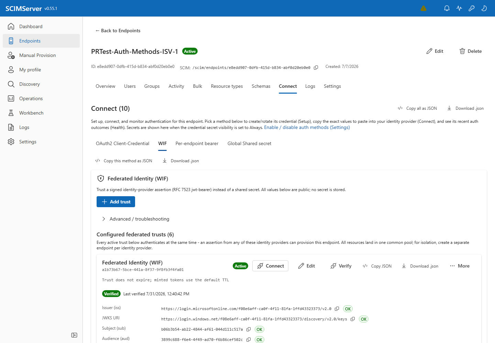

### 6.1 What a trust pins

All five values are **public**; no secret is stored.

| Field | Must match | In Entra this is |
|---|---|---|
| `expectedIssuer` | assertion `iss` | `https://login.microsoftonline.com/<tenantId>/v2.0` |
| `expectedSubject` | assertion `sub` | the **service principal object id** |
| `expectedAudience` | assertion `aud` | the resource app's Application ID URI or app id |
| `expectedTenantId` | assertion `tid` | your tenant id |
| `requiredRoles` | subset of assertion `roles` | an app role such as `Scim.Provision` |

Creating one, with the JWKS host allowlist shown inline:

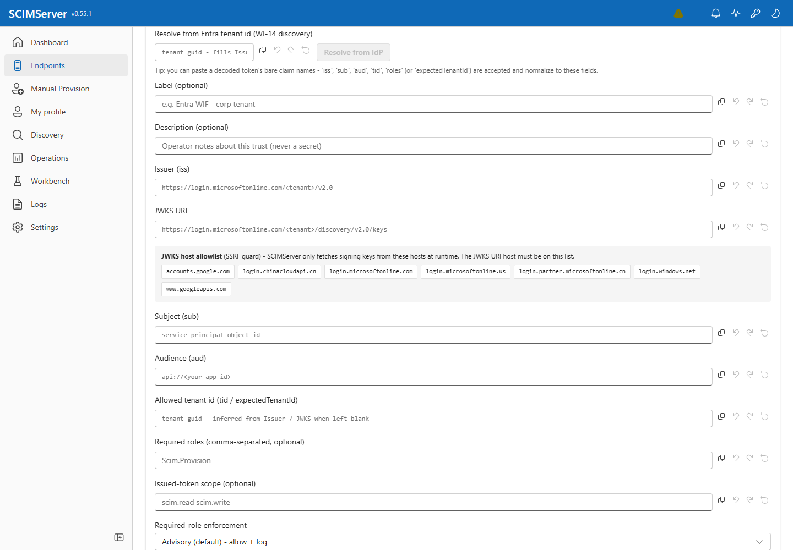

**Resolve from IdP** fills the issuer and JWKS URI from a tenant id, which avoids the most common source of typos.

### 6.2 A real accepted assertion

Verbatim from the reference endpoint's decision store:

```json
{
  "plane": "token-mint",
  "method": "wif",
  "outcome": "accept",
  "checks": [
    {
      "id": "jwks_signature",
      "status": "pass",
      "expected": "https://login.windows.net/139b0ac9-f3c3-41ff-8999-6b264dc7f7c3/discovery/v2.0/keys",
      "received": "signature verified",
      "detail": "signature + alg + time window verified"
    },
    {
      "id": "issuer_match",
      "status": "pass",
      "expected": "https://login.microsoftonline.com/139b0ac9-f3c3-41ff-8999-6b264dc7f7c3/v2.0",
      "received": "https://login.microsoftonline.com/139b0ac9-f3c3-41ff-8999-6b264dc7f7c3/v2.0"
    },
    {
      "id": "subject_match",
      "status": "pass",
      "expected": "4089bcde-9d00-4442-844e-19bac4195335",
      "received": "4089bcde-9d00-4442-844e-19bac4195335"
    },
    {
      "id": "audience_match",
      "status": "pass",
      "expected": "e0e109e1-140a-4b38-bd7c-7ccf33a49317",
      "received": "e0e109e1-140a-4b38-bd7c-7ccf33a49317"
    },
    {
      "id": "tenant_match",
      "status": "pass",
      "expected": "139b0ac9-f3c3-41ff-8999-6b264dc7f7c3",
      "received": "139b0ac9-f3c3-41ff-8999-6b264dc7f7c3"
    }
  ],
  "decodedClaims": {
    "aud": "e0e109e1-140a-4b38-bd7c-7ccf33a49317",
    "iss": "https://login.microsoftonline.com/139b0ac9-f3c3-41ff-8999-6b264dc7f7c3/v2.0",
    "iat": 1785522109,
    "nbf": 1785522109,
    "exp": 1785526009,
    "azp": "e0e109e1-140a-4b38-bd7c-7ccf33a49317",
    "oid": "4089bcde-9d00-4442-844e-19bac4195335",
    "sub": "4089bcde-9d00-4442-844e-19bac4195335",
    "tid": "139b0ac9-f3c3-41ff-8999-6b264dc7f7c3"
  },
  "joseHeader": {
    "alg": "RS256",
    "kid": "aFkmKVFc-4WV6sXCBvNZkXI505Y",
    "typ": "JWT"
  },
  "selectedTrustId": "adaa72c0-5098-4981-9187-19e55dd37447"
}
```

Note `issuer_match` expects the **v2.0** issuer (`login.microsoftonline.com`) while the keys are fetched from the **v1** host (`login.windows.net`). Entra legitimately does this, which is why `login.windows.net` must be on the JWKS allowlist even though it never appears as an issuer.

### 6.3 Multi-trust behaviour

> **Every active trust authenticates at the same time.** An assertion from *any* configured trust can provision the endpoint, and all resources land in one common pool. For isolation between identity providers, create a **separate endpoint per provider**. The UI states this on the WIF tab.

The reference endpoint has **six** trusts. On a token mint the server evaluates them in order and records a sub-trace per rejected trust, so `wif_no_trust_accepted` always tells you which trust came closest.

#### Two trusts for one caller: the slice-dependent audience

Multi-trust is not only for multiple identity providers. It is also the supported answer when **one**
caller can legitimately present **two different `aud` values**.

SyncFabric composes its requested scope differently depending on which acquisition chain is active,
so Entra mints a different audience:

| Acquisition chain | Resulting assertion `aud` |
|---|---|
| `CustomerApplication` (legacy) | `api://<appId>` |
| `FirstPartyApplication` (newer) | `api://<appId>/<normalized-dns-host>` |

The chain is chosen by a SyncFabric feature flag that is enabled on some slices and not others, so a
job can change shape **with no change on this side**. The symptom is a sudden `401`
`wif_audience_mismatch` after a period of working normally.

**Register both shapes as two trusts on the same endpoint.** Everything else - issuer, subject,
tenant, JWKS URI, scope - stays identical; only `expectedAudience` differs. Each trust still matches
its audience **exactly**, so this is not a widening: the endpoint accepts two explicitly-declared
audience strings instead of one. Give them distinct **labels**, since the credential list shows the
label but not the trust detail.

Do **not** ask for prefix or wildcard audience matching instead. That would turn an exact check into a
pattern check on the claim that binds a token to this server.

Full diagnosis and fix steps: [auth/N6_SLICE_DEPENDENT_AUDIENCE_RUNBOOK.md](auth/N6_SLICE_DEPENDENT_AUDIENCE_RUNBOOK.md).

### 6.4 Signing algorithms and TTL

Only **RS256** and **ES256** are accepted (`assertion_alg_not_allowed` otherwise).

**Token TTL is capped to the assertion.** A 6-hour token request against a 1-hour assertion is capped so the token never outlives the authorization that produced it. Measured overrun: **-1s**.

### 6.5 JWKS host allowlist

Signing keys are only fetched from allowlisted hosts. Seeded set:

`accounts.google.com`, `login.chinacloudapi.cn`, `login.microsoftonline.com`, `login.microsoftonline.us`, `login.partner.microsoftonline.cn`, `login.windows.net`, `www.googleapis.com`

Legacy Entra v1 (`login.windows.net`) is **not** seeded and must be added:

```http
POST /scim/admin/settings/jwks-hosts HTTP/1.1
Authorization: Bearer <admin-token>
Content-Type: application/json
```

```json
{
  "host": "login.windows.net",
  "label": "AAD v1 issuer"
}
```

`GET /scim/admin/settings/jwks-hosts` returns `seed`, `env`, `persisted` and `effective` so you can see where each host came from.

Fetch behaviour is tuned by `JwksFetchTimeoutMs`, `JwksFetchRetries`, `JwksFetchRetryBackoffMs` and `JwksCacheMaxAgeMs`. The fetch **fails closed**: an unreachable JWKS rejects with `jwks_unreachable` rather than skipping signature verification.

---

## 7. Connecting Microsoft Entra ID

### 7.1 Which fields Entra needs

The endpoint tells you. `GET /scim/admin/endpoints/{id}/connection-info` returns, per enabled method, the exact Entra field names, the values to paste, and live health:

```json
{
  "enabledMethods": [
    {
      "method": "bearer",
      "label": "Per-endpoint bearer token (Secret Token)",
      "entraAuthenticationMethod": "Secret Token",
      "entraFields": {
        "tenantUrl": "https://<host>/scim/v2/endpoints/<endpointId>",
        "secretToken": "<redacted>"
      },
      "validity": "ok",
      "authHealth": {
        "lastOutcome": "accept",
        "lastAttemptAt": "2026-07-31T18:26:50.000Z",
        "lastCorrelationId": "822b4fa8-cdcc-44d9-a2ed-f849fab4906e"
      }
    },
    {
      "method": "oauth_client",
      "entraAuthenticationMethod": "OAuth2 Client Credentials Grant",
      "entraFields": {
        "tenantUrl": "https://<host>/scim/v2/endpoints/<endpointId>",
        "tokenEndpoint": "https://<host>/scim/endpoints/<endpointId>/oauth/token",
        "clientIdentifier": "client-id-<endpointId>",
        "clientSecret": "<redacted>"
      },
      "validity": "unverified"
    },
    {
      "method": "wif",
      "entraAuthenticationMethod": "Workload Identity based authentication",
      "entraFields": {
        "tenantUrl": "https://<host>/scim/v2/endpoints/<endpointId>",
        "tokenEndpoint": "https://<host>/scim/endpoints/<endpointId>/oauth/token",
        "clientIdentifier": "<endpointId>"
      },
      "validity": "ok"
    }
  ]
}
```

### 7.2 The provisioning flow

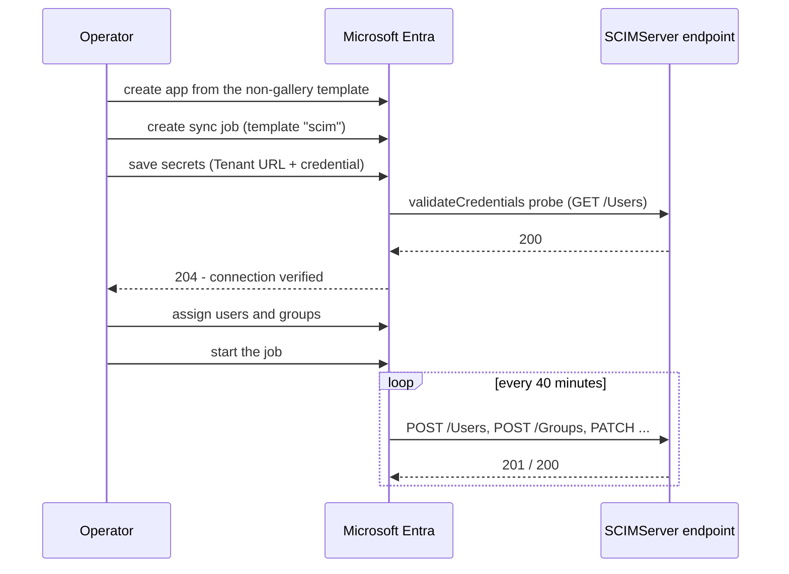

| Entra field | Value |
|---|---|
| **Tenant URL** | `https://<host>/scim/v2/endpoints/<endpointId>` |
| **Secret Token** | the per-endpoint bearer token, or the global shared secret |

Assignment matters: the SCIM template's default scope is **"Sync only assigned users and groups"**, so an app with nothing assigned runs, reports success, and provisions nothing.

### 7.3 Two problems you will probably hit
**Users fail with `emails: Required attribute 'emails' is missing`.** The `entra-id` preset requires `userName`, `displayName` and `emails`. Entra's default mapping sources `emails[type eq "work"].value` from `mail`, and cloud-only users have no `mail` unless Exchange-licensed. Verbatim from Entra's provisioning log:

```text
errorCode : SystemForCrossDomainIdentityManagementServiceIncompatible
Web Response:
{"schemas":["urn:ietf:params:scim:api:messages:2.0:Error"],
 "detail":"Schema validation failed: emails: Required attribute 'emails' is missing.",
 "scimType":"invalidValue","status":"400",
 "urn:scimserver:api:messages:2.0:Diagnostics":{
   "triggeredBy":"StrictSchemaValidation",
   "activeConfig":{"StrictSchemaValidation":true}}}
```

Fix the **mapping**, not the endpoint: point it at `userPrincipalName`, which always exists. Weakening the endpoint would only hide the problem.

**OAuth fails with `bearer_oauth_signature_invalid`.** Entra does **not** perform the initial token exchange. It expects to already hold an access token in `Oauth2AccessToken` and uses the token endpoint only to *refresh*. The endpoint's own request log makes this unmistakable: the `/Users` failures have **no preceding call** to `/oauth/token`.

| Secret key | Value |
|---|---|
| `BaseAddress` | the Tenant URL |
| `Oauth2ClientId` | `client-id-<endpointId>` |
| `Oauth2ClientSecret` | the client secret |
| `Oauth2TokenExchangeUri` | `https://<host>/scim/endpoints/<endpointId>/oauth/token` |
| `Oauth2AccessToken` | a freshly minted `access_token` |
| `Oauth2AccessTokenCreationTime` | ISO-8601 timestamp |

After seeding, Entra's `validateCredentials` returned **204**.

### 7.4 WIF and Entra provisioning - an honest limitation

**Entra's provisioning service cannot currently be configured for WIF outbound via the Graph API.** The synchronization secrets API has a fixed key enum; `TenantId` and `WorkloadIdentityFederationEnabled` both return *"Requested value ... was not found"* and nothing persists.

This is a gap on the Entra side, not in SCIMServer. WIF itself works: the reference endpoint records **live `wif` accepts** from genuine Microsoft-signed assertions, and a dedicated harness passed **50 of 50** against production.

Use **Secret Token** or **OAuth2 client credentials** for Entra provisioning jobs; use **WIF** for any client that can present a `jwt-bearer` assertion directly.

---

## 8. Troubleshooting

SCIMServer gives you four diagnostic tools. Use them in this order.

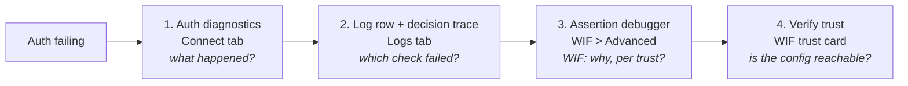

### 8.1 Auth diagnostics - what happened

**Connect tab -> Health.** Every recent authentication decision for the endpoint, accept or reject, with method and timestamp. Expand a row for the full check list.

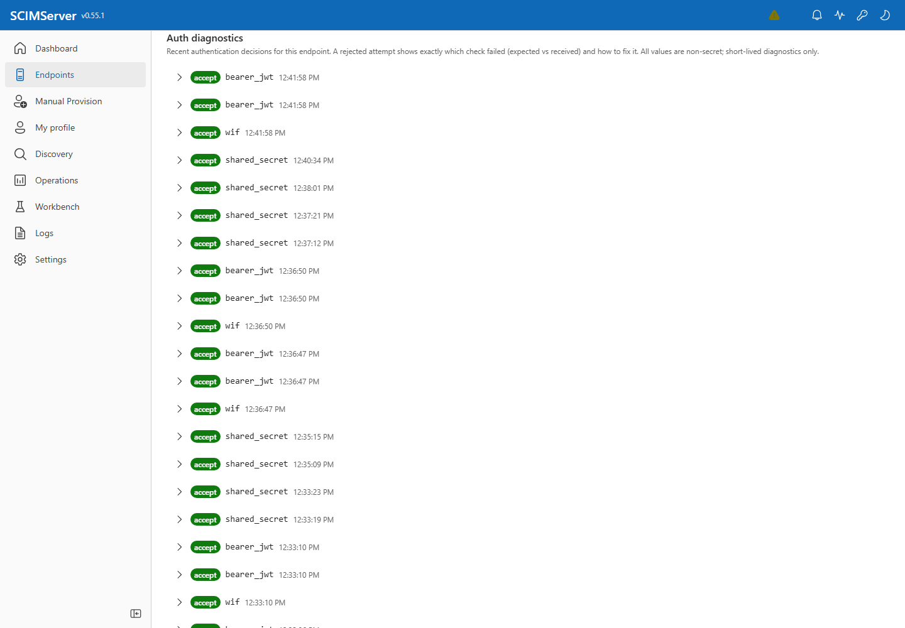

> "Recent authentication decisions for this endpoint. A rejected attempt shows exactly which check failed (expected vs received) and how to fix it. All values are non-secret; short-lived diagnostics only."

These records are **short-TTL and in-memory**. For anything older, use the logs.

API: `GET /scim/admin/endpoints/{id}/auth-decisions?outcome=reject&limit=50`

### 8.2 The log row and its decision trace - which check failed

Every request-log row carries an **auth outcome chip**:

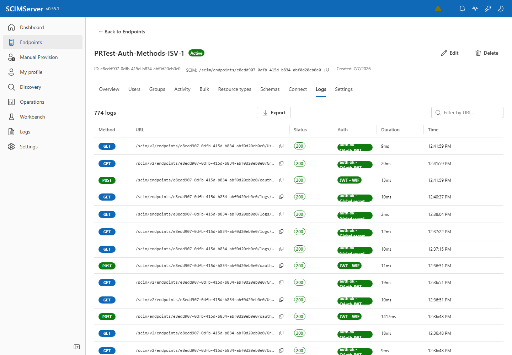

Open a row and the **Authentication** section shows the persisted decision: the outcome, the method, and the ordered checks with `expected` versus `received` - plus the full decision record as JSON.

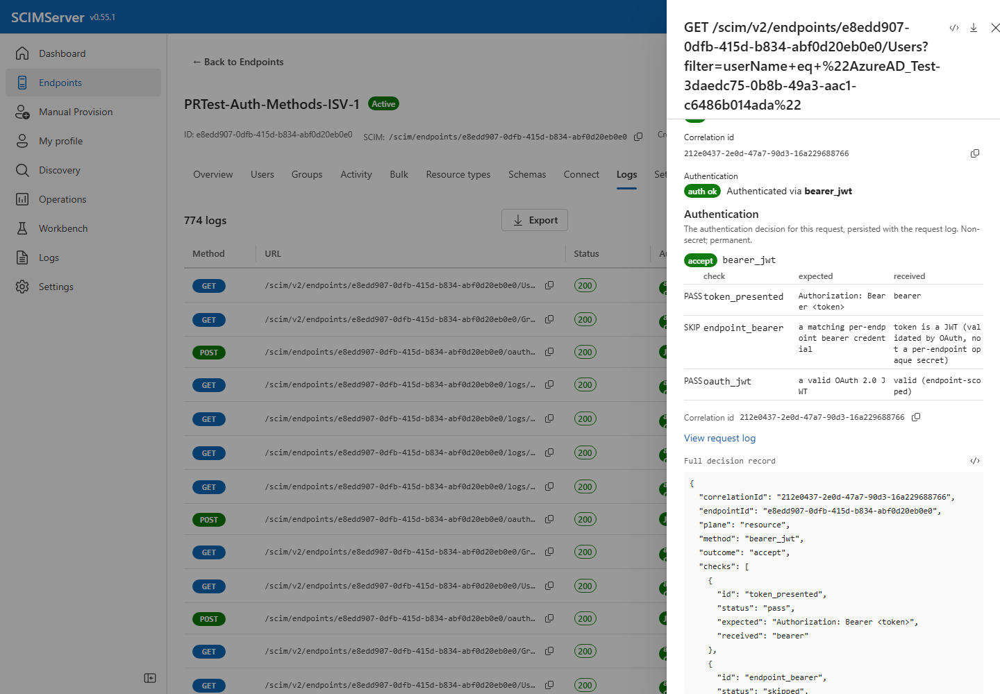

Unlike the in-memory diagnostics, this is **persisted with the request log**, so it survives restarts. The two are joined by one id: the log row's `requestId` equals the trace's `correlationId`.

### 8.3 The assertion debugger - WIF, per trust

**Connect -> WIF -> Advanced / troubleshooting.** Paste a `client_assertion` and dry-run it against **every** configured trust. It runs the exact server-side checks a real mint would (signature, issuer, subject, audience, tenant, roles) but never mints a token.

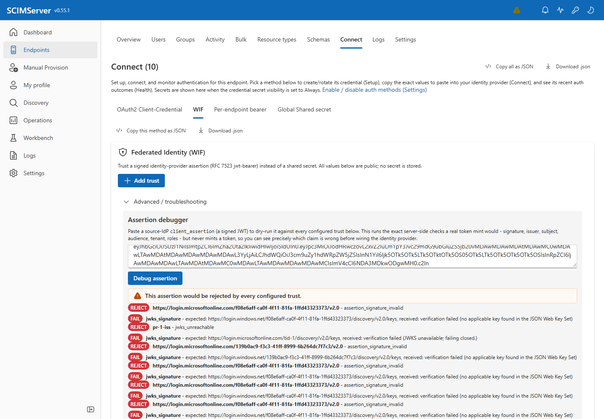

This is the fastest way to answer "why is my assertion rejected?" when several trusts are configured, because it shows the per-trust verdict side by side rather than one aggregate failure.

### 8.4 "It worked yesterday and now every WIF token is 401"

If WIF mints start failing with `wif_audience_mismatch` and **nothing changed on this side** - no
deploy, no config edit, no rotation - check the `audience_match` line in the decision trace:

```text
audience_match   FAIL   expected: api://<appId>   received: api://<appId>/scim.example.com
```

If `received` is `expected` plus a `/<host>` suffix (or the reverse), the caller has switched
acquisition chain and Entra is minting a different audience. This is a known SyncFabric behaviour
selected by a per-slice feature flag, not a fault on either side.

**Fix:** register the other shape as a second WIF trust on the same endpoint (see
[section 6.3](#63-multi-trust-behaviour)). No deploy is involved.

Full runbook: [auth/N6_SLICE_DEPENDENT_AUDIENCE_RUNBOOK.md](auth/N6_SLICE_DEPENDENT_AUDIENCE_RUNBOOK.md).

API: `POST /scim/admin/endpoints/{id}/wif/debug-assertion` with `{"assertion": "<jwt>"}`, returning `overallOutcome` plus a `results[]` entry per trust:

```json
{
  "expectedIssuer": "pr-1-iss",
  "outcome": "reject",
  "reasonCode": "jwks_unreachable",
  "trace": {
    "plane": "token-mint",
    "method": "wif",
    "outcome": "reject",
    "checks": [
      {
        "id": "jwks_signature",
        "status": "fail",
        "expected": "https://login.microsoftonline.com/tid-1/discovery/v2.0/keys",
        "received": "verification failed",
        "detail": "JWKS unavailable; failing closed."
      }
    ],
    "reasonCode": "jwks_unreachable"
  }
}
```

### 8.4 Verify a trust - is the configuration reachable

Each trust card has a **Verify** button that re-runs the server-side checks against the live identity provider and stamps the card with a **Verified** badge and timestamp.

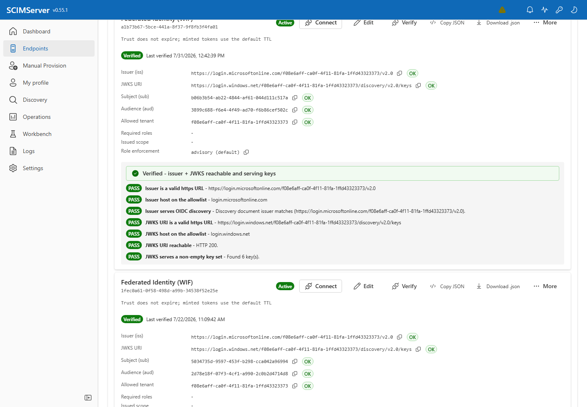

Use this after editing a trust, or when an identity provider rotates keys. It distinguishes "my configuration is wrong" from "my assertion is wrong".

### 8.5 The error envelope

Every failure carries a diagnostics extension. Verbatim 401 from the reference endpoint:

```json
{
  "schemas": ["urn:ietf:params:scim:api:messages:2.0:Error"],
  "detail": "Invalid bearer token.",
  "status": "401",
  "scimType": "invalidToken",
  "urn:scimserver:api:messages:2.0:Diagnostics": {
    "reason_code": "bearer_invalid",
    "requestId": "f4d18caf-8d49-42d0-b42c-d4b455bee369",
    "endpointId": "e8edd907-0dfb-415d-b834-abf0d20eb0e0",
    "logsUrl": "/scim/endpoints/e8edd907-0dfb-415d-b834-abf0d20eb0e0/logs/recent?requestId=f4d18caf-8d49-42d0-b42c-d4b455bee369"
  }
}
```

`logsUrl` is a deep link. Follow it to the exact request, and from there to its decision trace.

### 8.6 Why the wire says less than the UI

The wire response is deliberately less specific than the diagnostics panel. Each reason has a **visibility tier**:

| Tier | Meaning | On the wire |
|---|---|---|
| **T1** config-transparent | safe to reveal; the caller proved control of the IdP key | full reason |
| **T2** protocol | request-shape errors, no secret content | full reason |
| **T3** secret-opaque | must not distinguish "no such client" from "wrong secret" | merged |
| **T4** internal | server fault | generic |

So `oauth_client_auth_failed` (T3) is deliberately ambiguous on the wire while the **log** records whether the client was found. If the wire message seems unhelpfully vague, the answer is in the diagnostics panel.

### 8.7 Every reason code

Generated from [auth-reason-catalog.ts](../api/src/oauth/auth-reason-catalog.ts). Codes are additive and never repurposed.

#### Token-mint plane: WIF

| `reason_code` | Wire error | Tier | Meaning | Fix |
|---|---|---|---|---|
| `wif_no_trust_configured` | `invalid_client` | T1 | No federated-identity trust is configured for this endpoint. | Create a WIF credential, or enable `WifCredentialsEnabled`. |
| `wif_no_trust_accepted` | `invalid_client` | T1 | No configured WIF trust accepted the assertion. | Multi-trust: check which trust should match the assertion's issuer. |
| `jwks_host_not_allowlisted` | `invalid_client` | T1 | The trust's JWKS host is not permitted by the server allowlist. | Add the host via `POST /scim/admin/settings/jwks-hosts`. |
| `jwks_scheme_not_https` | `invalid_client` | T1 | The trust's JWKS URI must use https. | Fix `jwksUri` to an https URL. |
| `jwks_unreachable` | `invalid_client` | T1 | The identity provider's key set could not be retrieved. | Transient or network/allowlist issue; verify the JWKS URL resolves. |
| `assertion_malformed` | `invalid_client` | T1 | The client assertion is not a well-formed JWT. | Verify the IdP is sending a compact JWS. |
| `assertion_signature_invalid` | `invalid_client` | T1 | The signature did not verify against the IdP keys. | Key rotation or wrong `jwksUri`. |
| `assertion_alg_not_allowed` | `invalid_client` | T1 | Signing algorithm not permitted (RS256/ES256 only). | The IdP must sign with RS256 or ES256. |
| `assertion_expired` | `invalid_client` | T1 | The assertion is expired or not yet valid. | Check clock skew; request a fresh assertion. |
| `wif_issuer_mismatch` | `invalid_client` | T1 | Issuer did not match `expectedIssuer`. | Align with the IdP's `iss` (v2.0 and v1.0 differ). |
| `wif_subject_mismatch` | `invalid_client` | T1 | Subject did not match `expectedSubject`. | Use the service-principal object id. |
| `wif_audience_mismatch` | `invalid_client` | T1 | Audience did not match `expectedAudience`. | In Entra, set the resource app's Application ID URI. |
| `wif_tenant_mismatch` | `invalid_client` | T1 | Tenant did not match the allowed tenant. | Align `allowedTenantId` with the IdP `tid`. |
| `wif_missing_role` | `invalid_client` | T1 | The assertion is missing a required role. | Grant the app role, or remove it from `requiredRoles`. |
| `assertion_missing_claim` | `invalid_client` | T1 | A required claim is absent. | Ensure the IdP emits `sub`, `aud`, `iss`, `tid`. |

#### Token-mint plane: OAuth client

| `reason_code` | Wire error | Tier | Meaning | Fix |
|---|---|---|---|---|
| `oauth_client_auth_failed` | `invalid_client` | T3 | Client authentication failed. | Deliberately merged: client-not-found and secret-mismatch are indistinguishable on the wire; the log records `credentialFound`. |
| `grant_type_unsupported` | `unsupported_grant_type` | T2 | Only `client_credentials` is supported. | Send `grant_type=client_credentials`. |
| `missing_credentials` | `invalid_request` | T2 | Neither `client_secret` nor `client_assertion` present. | Provide one of them. |
| `mutually_exclusive_credentials` | `invalid_request` | T2 | Both `client_secret` and `client_assertion` present. | Send exactly one. |
| `unsupported_assertion_type` | `invalid_request` | T2 | `client_assertion_type` is not the jwt-bearer URN. | Set it to `urn:ietf:params:oauth:client-assertion-type:jwt-bearer`. |

#### Resource plane: bearer

| `reason_code` | Wire error | Tier | Meaning | Fix |
|---|---|---|---|---|
| `bearer_missing` | `invalid_token` | T1 | No credentials presented. | Send an `Authorization: Bearer <token>` header. |
| `bearer_token_scoped_other_endpoint` | `invalid_token` | T1 | The token is scoped to a different endpoint. | Use a token minted for this endpoint. |
| `bearer_shared_secret_refused` | `invalid_token` | T1 | Shared-secret bearer auth is disabled here. | Enable `SharedSecretBearerAuthEnabled`, or use a per-endpoint credential. |
| `bearer_oauth_expired` | `invalid_token` | T1 | The bearer token is expired. | Mint a fresh token. |
| `bearer_oauth_signature_invalid` | `invalid_token` | T1 | The token signature did not verify. | Mint a fresh token; the signing key may have rotated. |
| `bearer_invalid` | `invalid_token` | T1 | The bearer token is invalid. | Mint a fresh token. |

### 8.8 Common situations

| Symptom | Likely cause |
|---|---|
| The UI logs you out when you change an auth setting | a pre-0.55.1 build. Fixed in 0.55.1 |
| WIF fails against a healthy issuer | the JWKS host is not allowlisted (`login.windows.net` is not seeded) |
| Entra Test Connection fails on a user-only endpoint | it probes `/Groups`. Turn `EnforceResourceTypes` off so an un-served type returns `200 empty` rather than `404` |
| Worked, then stopped after an hour | an OAuth `access_token` expired and was not refreshed |
| No token to copy out of the logs | by design; tokens are never persisted |
| Assertion accepted but the token expires sooner than requested | TTL is capped to the assertion lifetime |

---

## 9. Reference

### Auditing who changed the authentication configuration

The routes above answer *"who authenticated?"*. A separate stream answers *"who changed how
authentication works?"*, which is what an auditor usually needs after an incident.

Every config-time authentication change emits exactly one structured `Auth config change` event,
readable at:

```http
GET /scim/admin/log-config/recent?category=auth&limit=300
Authorization: Bearer <admin token>
```

Filter on `data.action`:

| `data.action` | Emitted when |
|---|---|
| `auth_method_add` / `auth_method_remove` | an `authentication.methods[]` entry is added or removed (v0.55.8) |
| `auth_flags_changed` | an auth-affecting endpoint flag is flipped (carries `changedFlags[]` with before/after) |
| `jwks_host_add` / `jwks_host_update` / `jwks_host_patch` / `jwks_host_remove` | the JWKS host allowlist is edited |
| `wif_verify` / `wif_debug_assertion` | a WIF trust is verified or an assertion is debugged (`dryRun: true`, never mints) |

Every event carries `outcome` (`success` / `failure` / `denied`) and `correlationId`, which is the
same `X-Request-Id` on the request log, so a config change can be tied back to the call that made it.
**Failures are emitted too, not just successes** - a rejected change is exactly what an auditor wants
to see - and a `success` is logged at `INFO` while a `failure` or `denied` is logged at `WARN`.

Payloads are non-secret by construction: hostnames, flag names, ids, and reason codes only. A method's
`config` is never included, since it can hold operator-supplied material.

One field is worth knowing about when writing a query: an authentication-method event identifies the
method through **`methodId`**, *not* `credentialId`. The log redactor blanks any field whose name
contains `credential`, so anything emitted under that name arrives as `[REDACTED]`. Note the
consequence for the credential events specifically: their `credentialId` **is** redacted today, so
those records tell you a credential was created, revealed or rotated on an endpoint, but not which
one.

### Routes

| Purpose | Route |
|---|---|
| Create a credential | `POST /scim/admin/endpoints/{id}/credentials` |
| List credentials (metadata only) | `GET /scim/admin/endpoints/{id}/credentials` |
| Rotate / revoke | `POST .../credentials/{cid}/rotate`, `DELETE .../credentials/{cid}` |
| Entra field values per method | `GET /scim/admin/endpoints/{id}/connection-info` |
| Recent auth decisions | `GET /scim/admin/endpoints/{id}/auth-decisions` |
| All endpoints' auth decisions | `GET /scim/admin/auth-decisions` |
| Resolve issuer + JWKS from a tenant | `POST /scim/admin/endpoints/{id}/wif/resolve` |
| Verify a trust | `POST /scim/admin/endpoints/{id}/wif/verify` |
| Dry-run an assertion | `POST /scim/admin/endpoints/{id}/wif/debug-assertion` |
| Token exchange | `POST /scim/endpoints/{id}/oauth/token` |
| OAuth metadata (RFC 8414) | `GET /scim/endpoints/{id}/.well-known/oauth-authorization-server` |
| Advertised schemes | `GET /scim/v2/endpoints/{id}/ServiceProviderConfig` |
| JWKS host allowlist | `GET` / `POST` / `PATCH /scim/admin/settings/jwks-hosts` |
| Request log by correlation id | `GET /scim/endpoints/{id}/logs/recent?requestId=...` |

### Settings

| Setting | Default | Governs |
|---|---|---|
| `SharedSecretBearerAuthEnabled` | on | the global shared secret on this endpoint |
| `SecretTokenBearerAuthEnabled` | falls back to `PerEndpointCredentialsEnabled` | per-endpoint bearer tokens |
| `OAuthClientCredentialsAuthEnabled` | falls back to `PerEndpointCredentialsEnabled` | `oauth_client` credentials |
| `PerEndpointCredentialsEnabled` | off | legacy master switch for the two above |
| `WifCredentialsEnabled` | off | federated assertions and WIF scheme advertisement |
| `CredentialSecretVisibility` | `once` | whether the UI keeps a secret on screen |
| `PersistRequestSecrets` | on | whether request logs retain secret-bearing values |
| `JwksFetchTimeoutMs` / `JwksFetchRetries` / `JwksFetchRetryBackoffMs` / `JwksCacheMaxAgeMs` | see settings guide | JWKS fetch behaviour |

### Source

| Concern | Path |
|---|---|
| Reason-code catalog | [api/src/oauth/auth-reason-catalog.ts](../api/src/oauth/auth-reason-catalog.ts) |
| Decision trace | [api/src/oauth/auth-decision-trace.ts](../api/src/oauth/auth-decision-trace.ts) |
| Guard and method cascade | [api/src/modules/auth/shared-secret.guard.ts](../api/src/modules/auth/shared-secret.guard.ts) |
| WIF assertion validation | [api/src/oauth/wif-assertion-validator.service.ts](../api/src/oauth/wif-assertion-validator.service.ts) |
| Credential and WIF admin API | [api/src/modules/scim/controllers/admin-credential.controller.ts](../api/src/modules/scim/controllers/admin-credential.controller.ts) |
| Auth decisions API | [api/src/modules/scim/controllers/auth-decisions.controller.ts](../api/src/modules/scim/controllers/auth-decisions.controller.ts) |
| Diagnostics UI | [web/src/components/primitives/AuthDiagnosticsPanel.tsx](../web/src/components/primitives/AuthDiagnosticsPanel.tsx) |
| Connect tab UI | [web/src/pages/CredentialsTab.tsx](../web/src/pages/CredentialsTab.tsx) |
| Screenshot capture | [scripts/capture-auth-guide.ps1](../scripts/capture-auth-guide.ps1) |
