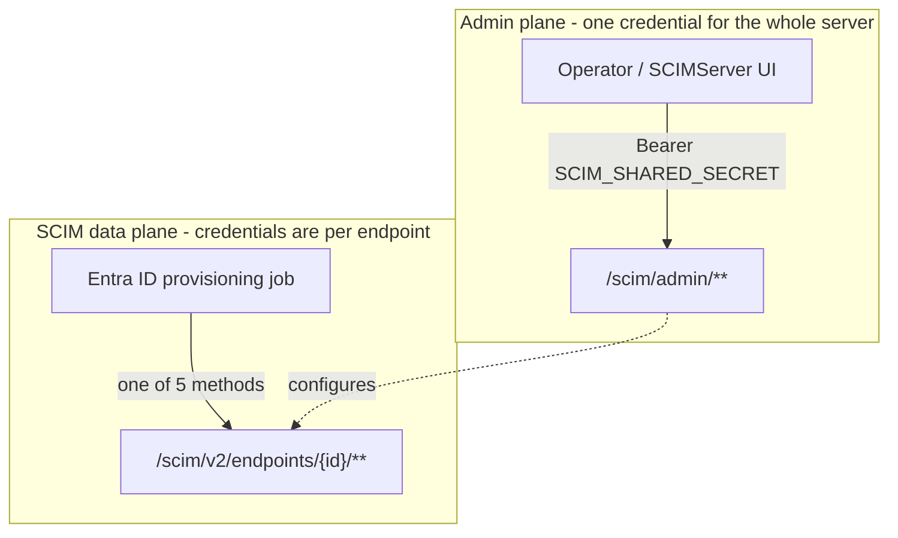
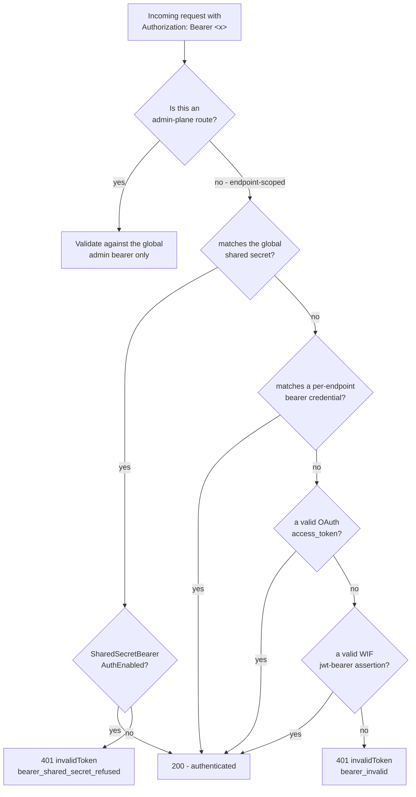
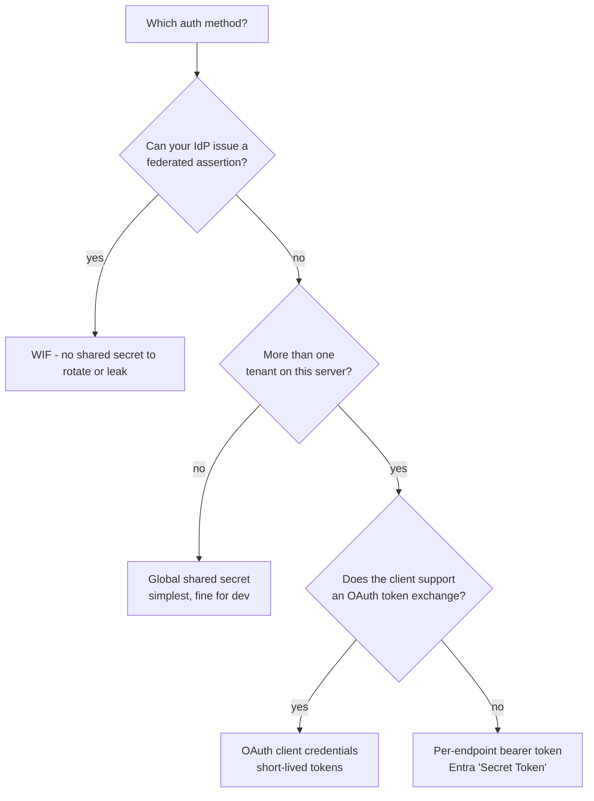

# Authentication Guide

> **Status:** Living reference - **Created:** 2026-07-31 - **Last verified:** 2026-07-31 - **Product version at capture:** `0.55.1`
> **Every request, response and status code in this document was captured from a running server.** Where a body is shown, it is the actual wire payload with only secrets and tenant identifiers replaced.
> **Companion docs:** [ENDPOINT_SETTINGS_OPERATOR_GUIDE.md](ENDPOINT_SETTINGS_OPERATOR_GUIDE.md) (all 27 endpoint settings), [COMPLETE_API_REFERENCE.md](COMPLETE_API_REFERENCE.md) (route reference), [UI_GUIDE.md](UI_GUIDE.md) (screen tour).

---

## 1. Two planes, two kinds of credential

The single most important idea in this document:

| Plane | Base path | Who it is for | Credential |
|---|---|---|---|
| **Admin plane** | `/scim/admin/...` | you, the operator - creating endpoints, editing settings, reading logs | the **global** admin bearer (`SCIM_SHARED_SECRET`) |
| **SCIM data plane** | `/scim/v2/endpoints/{id}/...` and `/scim/endpoints/{id}/...` | the provisioning client (Entra ID, Okta, a script) | whatever **that endpoint** is configured to accept |



An endpoint's choice about which credentials its data plane accepts says **nothing** about who may administer it. You can disable every data-plane auth method on an endpoint and still open it in the UI and fix it. (That separation was genuinely broken before 0.55.1 - see [Section 8](#8-troubleshooting).)

---

## 2. The five data-plane methods

Each is gated by a per-endpoint setting. All five can be on at once; the server tries them in order and the first that accepts wins.

| # | Method | Setting that enables it | What the client sends |
|---|---|---|---|
| 1 | **Global shared secret** | `SharedSecretBearerAuthEnabled` (default ON) | `Authorization: Bearer <SCIM_SHARED_SECRET>` |
| 2 | **Per-endpoint bearer token** | `SecretTokenBearerAuthEnabled` | `Authorization: Bearer <endpoint token>` |
| 3 | **OAuth client credentials** | `OAuthClientCredentialsAuthEnabled` | exchange `client_id`+`client_secret` for an `access_token`, then send it |
| 4 | **Workload Identity Federation (WIF)** | `WifCredentialsEnabled` | RFC 7523 `jwt-bearer` assertion from a federated IdP |
| 5 | **Legacy per-endpoint credentials** | `PerEndpointCredentialsEnabled` | fallback master switch for #2 and #3 when those are unset |



### What the endpoint advertises

`ServiceProviderConfig` tells a client which schemes are available. Measured on a fresh `entra-id` endpoint:

```json
{
  "authenticationSchemes": [
    {
      "name": "OAuth Bearer Token",
      "type": "oauthbearertoken",
      "primary": true
    }
  ]
}
```

After turning `WifCredentialsEnabled` on, the same endpoint advertises a second scheme:

```json
{
  "authenticationSchemes": [
    {
      "name": "OAuth Bearer Token",
      "type": "oauthbearertoken",
      "primary": true
    },
    {
      "name": "Workload Identity Federation",
      "type": "oauth2",
      "primary": false
    }
  ]
}
```

---

## 3. Method 1 - the global shared secret

The simplest option, and the default. Every endpoint accepts it until you turn it off.

```http
GET /scim/v2/endpoints/{endpointId}/Users?count=1 HTTP/1.1
Host: scimserver-dev.proudbush-ae90986e.eastus.azurecontainerapps.io
Authorization: Bearer changeme-scim
```

**Use it for:** local development, demos, a single-tenant deployment you fully control.

**Do not use it for:** multiple independent tenants. Every endpoint shares one secret, so a client configured for endpoint A can call endpoint B. To close that off, set `SharedSecretBearerAuthEnabled` to `False` on the endpoint and issue it its own credential.

---

## 4. Method 2 - per-endpoint bearer token

This is the credential you paste into Entra's **Secret Token** field.

### Create one

```http
POST /scim/admin/endpoints/{endpointId}/credentials HTTP/1.1
Authorization: Bearer <admin-token>
Content-Type: application/json
```

```json
{
  "credentialType": "bearer",
  "label": "entra-secret-token"
}
```

**Response `201`** - measured keys: `id`, `endpointId`, `credentialType`, `label`, `description`, `active`, `createdAt`, `expiresAt`, `token`.

```json
{
  "id": "<credential id>",
  "endpointId": "<endpoint id>",
  "credentialType": "bearer",
  "label": "entra-secret-token",
  "active": true,
  "createdAt": "2026-07-31T10:00:00.000Z",
  "token": "<43-character secret - shown once>"
}
```

> **The `token` is returned once and never again.** It is stored as a bcrypt hash, so the server itself cannot show it to you later. Listing credentials afterwards returns metadata only. Copy it when you create it. The `CredentialSecretVisibility` setting controls whether the UI keeps it on screen (`always`) or hides it after first reveal (`once`).

### Use it

```http
GET /scim/v2/endpoints/{endpointId}/Users?count=1 HTTP/1.1
Authorization: Bearer <the token from above>
```

Measured result: **200**.

---

## 5. Method 3 - OAuth 2.0 client credentials

This is Entra's **OAuth2 client-credentials** option. Two steps: mint a client, then exchange it for a short-lived access token.

### Create the client

```http
POST /scim/admin/endpoints/{endpointId}/credentials HTTP/1.1
Authorization: Bearer <admin-token>
Content-Type: application/json
```

```json
{
  "credentialType": "oauth_client",
  "label": "entra-oauth"
}
```

**Response `201`** - measured keys: `id`, `endpointId`, `credentialType`, `label`, `description`, `active`, `createdAt`, `expiresAt`, `clientId`, `clientSecret`. The `clientId` is derived from the endpoint id, e.g. `client-id-dac65814-b015-4cfa-87b6-1fc8c27e587c`.

### Exchange it for a token

```http
POST /scim/endpoints/{endpointId}/oauth/token HTTP/1.1
Content-Type: application/json
```

```json
{
  "grant_type": "client_credentials",
  "client_id": "client-id-<endpoint id>",
  "client_secret": "<the clientSecret from above>"
}
```

**Response `200`**, measured:

```json
{
  "access_token": "<jwt>",
  "token_type": "Bearer",
  "expires_in": 3600,
  "scope": "scim"
}
```

### Use the access token

```http
GET /scim/v2/endpoints/{endpointId}/Users?count=1 HTTP/1.1
Authorization: Bearer <access_token>
```

Measured result: **200**. The token is valid for **3600 seconds**; the client is expected to re-exchange when it expires.

---

## 6. Method 4 - Workload Identity Federation

Secretless. Instead of holding a long-lived secret, the client presents a signed JWT from an identity provider you have told the endpoint to trust (RFC 7523 `jwt-bearer`).

Enable `WifCredentialsEnabled`, then register a trust naming the issuer and the JWKS URI. When a request arrives, the server fetches the issuer's signing keys and verifies the assertion.

The four **JWKS egress knobs** in [the settings guide](ENDPOINT_SETTINGS_OPERATOR_GUIDE.md#28-runtime-egress-wif-jwks-fetch) tune that fetch: timeout, retries, backoff and cache max-age.

> **JWKS fetches are allowlisted.** The server will only fetch signing keys from hosts on its JWKS allowlist. The seeded set is:
>
> `accounts.google.com`, `login.chinacloudapi.cn`, `login.microsoftonline.com`, `login.microsoftonline.us`, `login.partner.microsoftonline.cn`, `www.googleapis.com`
>
> If your issuer uses the legacy Entra v1 host `login.windows.net`, add it explicitly:
>
> ```http
> POST /scim/admin/settings/jwks-hosts
> Authorization: Bearer <admin-token>
> Content-Type: application/json
>
> { "host": "login.windows.net", "label": "AAD v1 issuer" }
> ```
>
> Inspect the current allowlist with `GET /scim/admin/settings/jwks-hosts`, which returns `seed`, `env`, `persisted` and `effective` arrays so you can see exactly where each host came from.

---

## 7. Choosing a method



| Priority | Recommended |
|---|---|
| Strongest posture | **WIF** - nothing long-lived to steal |
| Good isolation, widely supported | **OAuth client credentials** - 1 hour token lifetime |
| Simple per-tenant isolation | **Per-endpoint bearer token** |
| Convenience only | **Global shared secret** - turn it off per endpoint once real credentials exist |

Hardening an endpoint means enabling the method you want and setting `SharedSecretBearerAuthEnabled` to `False`, so the endpoint accepts only its own credentials.

---

## 8. Troubleshooting

Every auth failure carries a diagnostics extension telling you exactly why. Real captured 401:

```json
{
  "schemas": ["urn:ietf:params:scim:api:messages:2.0:Error"],
  "detail": "Invalid bearer token.",
  "status": "401",
  "scimType": "invalidToken",
  "urn:scimserver:api:messages:2.0:Diagnostics": {
    "reason_code": "bearer_invalid",
    "requestId": "2fe79251-758a-4151-b26d-522e1fba995f",
    "endpointId": "889be902-6330-4c0d-a794-3327a888274f",
    "logsUrl": "/scim/endpoints/889be902-6330-4c0d-a794-3327a888274f/logs/recent?requestId=2fe79251-758a-4151-b26d-522e1fba995f"
  }
}
```

`logsUrl` is a deep link - follow it to see the full request as the server saw it.

| `reason_code` | Meaning | Fix |
|---|---|---|
| `bearer_invalid` | the token matched no configured credential | check you are using the right credential for this endpoint |
| `bearer_shared_secret_refused` | the token **is** the global shared secret, but this endpoint refuses it | either enable `SharedSecretBearerAuthEnabled` or use the endpoint's own credential |

**If the UI logs you out when you change an auth setting:** that was a real defect, fixed in **0.55.1**. Two admin routes (`/overview`, `/stats`) returned 401 when an endpoint's data-plane auth was disabled, and the web client treated any 401 as an expired admin session. On 0.55.1 or later, changing a data-plane auth method never affects your admin session. If you see it, you are on an older build.

**If WIF verification fails with a reachable issuer:** check the JWKS allowlist ([Section 6](#6-method-4---workload-identity-federation)). A host that is not on the effective list will not be fetched, and verification fails even though the issuer is perfectly healthy.

---

## 9. Where this lives in the code

| Concern | Path |
|---|---|
| Guard, plane separation, method cascade | [api/src/modules/auth/shared-secret.guard.ts](../api/src/modules/auth/shared-secret.guard.ts) |
| Global shared secret authenticator | [api/src/modules/auth/authenticators/global-shared-secret.authenticator.ts](../api/src/modules/auth/authenticators/global-shared-secret.authenticator.ts) |
| E2E coverage of the enablement flags | [api/test/e2e/per-endpoint-credentials.e2e-spec.ts](../api/test/e2e/per-endpoint-credentials.e2e-spec.ts) |
