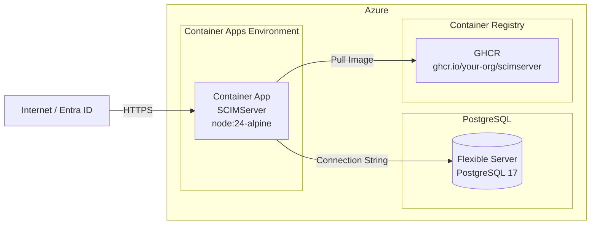
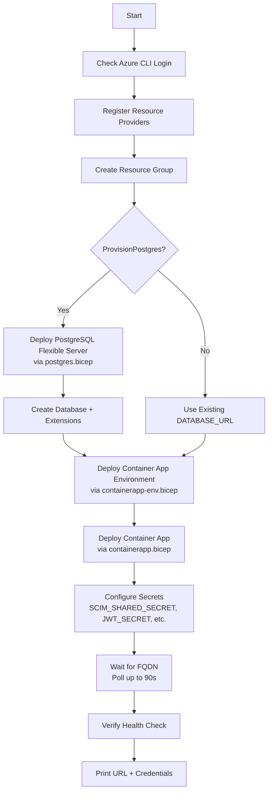

# Azure Deployment & Usage Guide

> **Version:** 0.38.0 - **Updated:** April 24, 2026  
> **Source of truth:** [deploy.ps1](../deploy.ps1), [scripts/deploy-azure.ps1](../scripts/deploy-azure.ps1), [infra/](../infra/)

---

## Table of Contents

- [Overview](#overview)
- [Architecture](#architecture)
- [Quick Deploy (One-Click)](#quick-deploy-one-click)
- [Manual Deployment](#manual-deployment)
- [Deployment Parameters](#deployment-parameters)
- [Post-Deployment Setup](#post-deployment-setup)
- [Entra ID Integration](#entra-id-integration)
- [Environment Variables](#environment-variables)
- [Infrastructure Components](#infrastructure-components)
- [Monitoring & Logs](#monitoring--logs)
- [Updating & Redeployment](#updating--redeployment)
- [Troubleshooting](#troubleshooting)
- [Cost Estimation](#cost-estimation)

---

## Overview

SCIMServer deploys to Azure Container Apps with a managed PostgreSQL Flexible Server backend. The deployment is fully automated via PowerShell scripts and Azure Bicep templates.



---

## Architecture

| Component | Azure Service | SKU |
|-----------|--------------|-----|
| Application | Container Apps | Consumption (serverless) |
| Database | PostgreSQL Flexible Server | Burstable B1ms |
| Container Registry | GitHub Container Registry | Free tier |
| Networking | Container Apps Environment | Managed VNet |

---

## Quick Deploy (One-Click)

### Option 1: Bootstrap Script

```powershell
irm https://raw.githubusercontent.com/your-org/SCIMServer/main/bootstrap.ps1 | iex
```

This downloads and runs `setup.ps1` which:
1. Checks Azure CLI is logged in
2. Prompts for subscription selection
3. Auto-generates secure secrets (48-char base64url)
4. Deploys PostgreSQL + Container App
5. Waits for the app to become healthy
6. Prints the URL and credentials

### Option 2: Deploy Script

```powershell
git clone https://github.com/your-org/SCIMServer.git
cd SCIMServer
.\deploy.ps1
```

Interactive prompts guide through:
- Azure subscription selection
- Container App name (2-32 chars, lowercase, alphanumeric + hyphens)
- Secret generation (auto or manual)
- Region selection

---

## Manual Deployment

### Prerequisites

- Azure CLI (`az`) installed and logged in
- PowerShell 7+
- Azure subscription with `Microsoft.App` and `Microsoft.ContainerService` providers registered

### Step-by-Step

```powershell
# 1. Login to Azure
az login
az account set --subscription "your-subscription"

# 2. Run the deployment script
cd scripts
.\deploy-azure.ps1 `
  -ResourceGroup "rg-scim" `
  -AppName "scimserver" `
  -Location "eastus" `
  -ScimSecret "your-scim-secret-min-16-chars" `
  -JwtSecret "your-jwt-secret" `
  -OauthClientSecret "your-oauth-secret" `
  -ProvisionPostgres `
  -PgAdminPassword "your-pg-admin-password"
```

### What the Script Does



---

## Deployment Parameters

| Parameter | Required | Default | Description |
|-----------|----------|---------|-------------|
| `ResourceGroup` | Yes | - | Azure resource group name |
| `AppName` | Yes | - | Container App name (2-32 chars) |
| `Location` | No | `eastus` | Azure region |
| `ScimSecret` | No | Auto-generated | SCIM shared secret |
| `JwtSecret` | No | Auto-generated | JWT signing key |
| `OauthClientSecret` | No | Auto-generated | OAuth client secret |
| `ImageTag` | No | From package.json | Docker image version |
| `GhcrUsername` | No | - | GHCR username (if private) |
| `GhcrPassword` | No | - | GHCR PAT (if private) |
| `DatabaseUrl` | No | - | Existing PostgreSQL URL |
| `ProvisionPostgres` | No | `false` | Auto-create PostgreSQL |
| `PgAdminPassword` | If provisioning | - | PostgreSQL admin password |
| `PgLocation` | No | Same as Location | Override PG region |

### Secret Generation

When secrets are not provided, the scripts auto-generate them using `[System.Security.Cryptography.RandomNumberGenerator]::GetBytes(36)` - 48-character base64url-encoded strings.

---

## Post-Deployment Setup

### 1. Verify Health

```bash
curl https://your-app.azurecontainerapps.io/health
# {"status":"ok","uptime":5,"timestamp":"2026-04-24T10:00:00.000Z"}
```

### 2. Create Your First Endpoint

```bash
curl -X POST https://your-app.azurecontainerapps.io/scim/admin/endpoints \
  -H "Authorization: Bearer your-scim-secret" \
  -H "Content-Type: application/json" \
  -d '{"name": "entra-prod", "profilePreset": "entra-id"}'
```

### 3. Check Version

```bash
curl https://your-app.azurecontainerapps.io/scim/admin/version \
  -H "Authorization: Bearer your-scim-secret"
```

---

## Entra ID Integration

### 1. Get Your SCIM URL

After creating an endpoint, use the `scimBasePath` from the response:

```
https://your-app.azurecontainerapps.io/scim/endpoints/{endpointId}/
```

### 2. Configure in Azure Portal

1. Navigate to **Enterprise Applications** > your application
2. Go to **Provisioning** > **Get started**
3. Set **Provisioning Mode** to **Automatic**
4. Enter:
   - **Tenant URL:** `https://your-app.azurecontainerapps.io/scim/endpoints/{endpointId}/`
   - **Secret Token:** Your `SCIM_SHARED_SECRET` value
5. Click **Test Connection** - should succeed
6. Configure attribute mappings
7. Turn provisioning **On**

### 3. Monitor Provisioning

```bash
# Live log stream
curl -N https://your-app.azurecontainerapps.io/scim/endpoints/{id}/logs/stream \
  -H "Authorization: Bearer your-scim-secret"

# Audit trail
curl "https://your-app.azurecontainerapps.io/scim/admin/logs?page=1&pageSize=50" \
  -H "Authorization: Bearer your-scim-secret"

# Endpoint stats
curl https://your-app.azurecontainerapps.io/scim/admin/endpoints/{id}/stats \
  -H "Authorization: Bearer your-scim-secret"
```

---

## Environment Variables

Set as Container App secrets/environment variables:

| Variable | Required | Description |
|----------|----------|-------------|
| `PERSISTENCE_BACKEND` | No | `prisma` (default) |
| `DATABASE_URL` | Yes | PostgreSQL connection string |
| `SCIM_SHARED_SECRET` | Yes | Bearer token for authentication |
| `JWT_SECRET` | Yes | JWT signing key |
| `OAUTH_CLIENT_SECRET` | Yes | OAuth client secret |
| `OAUTH_CLIENT_ID` | No | OAuth client ID (default: `scimserver-client`) |
| `PORT` | No | `8080` (default in Docker) |
| `NODE_ENV` | No | `production` |
| `LOG_LEVEL` | No | `INFO` (default) |

---

## Infrastructure Components

### Bicep Templates

| File | Resource |
|------|----------|
| `infra/containerapp-env.bicep` | Container Apps Environment |
| `infra/containerapp.bicep` | Container App + secrets + scaling |
| `infra/postgres.bicep` | PostgreSQL Flexible Server |
| `infra/acr.bicep` | Azure Container Registry (optional) |
| `infra/networking.bicep` | VNet + subnets (optional) |

### Container App Configuration

| Setting | Value |
|---------|-------|
| Image | `ghcr.io/your-org/scimserver:{version}` |
| Port | 8080 |
| Min replicas | 0 (scale to zero) |
| Max replicas | 10 |
| CPU | 0.5 |
| Memory | 1.0 Gi |
| Health probe | `GET /scim/health` |

---

## Monitoring & Logs

### Azure CLI Log Access

```powershell
# View container logs
az containerapp logs show -g rg-scim -n scimserver --follow

# View system logs
az containerapp logs show -g rg-scim -n scimserver --type system
```

### Application-Level Monitoring

```bash
# SSE live stream
curl -N https://app.azurecontainerapps.io/scim/admin/log-config/stream \
  -H "Authorization: Bearer secret"

# Download logs
curl https://app.azurecontainerapps.io/scim/admin/log-config/download?format=ndjson \
  -H "Authorization: Bearer secret" -o logs.ndjson

# Set DEBUG level for investigation
curl -X PUT https://app.azurecontainerapps.io/scim/admin/log-config/level/DEBUG \
  -H "Authorization: Bearer secret"
```

### Web Admin UI

Access the admin dashboard at:

```
https://your-app.azurecontainerapps.io/admin
```

---

## Updating & Redeployment

### Update to New Version

```powershell
# Re-run deploy with new image tag
.\scripts\deploy-azure.ps1 `
  -ResourceGroup "rg-scim" `
  -AppName "scimserver" `
  -ImageTag "0.39.0" `
  -ScimSecret "existing-secret" `
  -JwtSecret "existing-jwt-secret" `
  -OauthClientSecret "existing-oauth-secret" `
  -DatabaseUrl "postgresql://..."
```

### Deployment State Recovery

The deploy script saves state to `scripts/state/deploy-state-{rg}-{app}.json` for idempotent re-deployments. This file contains:
- Generated secrets
- Resource group and app name
- Database URL
- GHCR credentials

---

## Troubleshooting

### Container Won't Start

```powershell
# Check container logs
az containerapp logs show -g rg-scim -n scimserver --tail 50

# Common causes:
# 1. DATABASE_URL not set or wrong
# 2. PostgreSQL not accessible (firewall rules)
# 3. Image pull failure (check GHCR credentials)
```

### Database Connection Issues

```powershell
# Test PostgreSQL connectivity
az postgres flexible-server show -g rg-scim -n scim-pg

# Check firewall rules
az postgres flexible-server firewall-rule list -g rg-scim -n scim-pg
```

### Health Check Failures

```bash
curl https://your-app.azurecontainerapps.io/health
curl https://your-app.azurecontainerapps.io/scim/admin/version \
  -H "Authorization: Bearer your-secret"
```

### Secret Rotation

```powershell
# Update a secret
az containerapp secret set -g rg-scim -n scimserver \
  --secrets scim-secret=new-value

# Restart to pick up new secrets
az containerapp revision restart -g rg-scim -n scimserver \
  --revision $(az containerapp revision list -g rg-scim -n scimserver --query "[0].name" -o tsv)
```

---

## Cost Estimation

| Component | SKU | Estimated Monthly Cost |
|-----------|-----|----------------------|
| Container Apps | Consumption (scale to zero) | $0-15 (based on usage) |
| PostgreSQL Flexible | Burstable B1ms | ~$15-25 |
| Container Registry | GHCR Free | $0 |
| **Total** | | **~$15-40/month** |

Costs scale with:
- Number of provisioning requests (Container Apps billing per vCPU-second)
- Database storage (charged per GB)
- Network egress (first 5 GB free)
