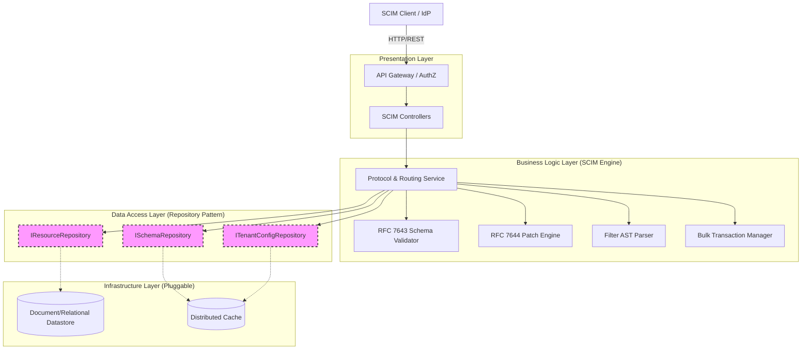
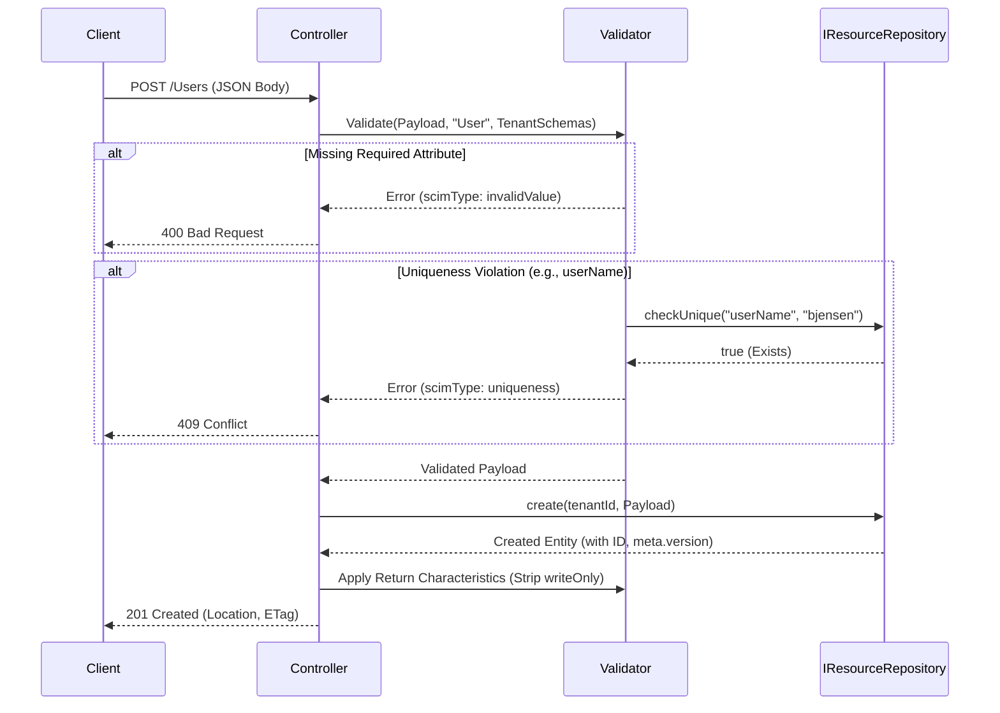

# Complete Technology-Agnostic SCIM 2.0 Architecture

This document provides a comprehensive, technology-agnostic architectural blueprint for a multi-tenant SCIM 2.0 server. It strictly adheres to **RFC 7642 (Concepts)**, **RFC 7643 (Core Schema)**, and **RFC 7644 (Protocol)** in their absolute entirety. 

By utilizing an N-Tier architecture and the **Repository Pattern**, this design ensures that the core SCIM logic is completely decoupled from any specific database, programming language, or caching technology.

---

## 1. High-Level N-Tier Architecture

The system is divided into strict layers. Dependencies only flow downwards.



---

## 2. Component Deep Dive & Interfaces

### 2.1. The Repository Layer (Data Access)
The core mechanism for achieving true persistence agnosticism is the **Repository Pattern**. The Business Logic Layer (SCIM Engine) interacts *exclusively* with abstract interfaces, never with concrete database clients (like Prisma, Mongoose, or raw SQL).

**How this achieves persistence agnosticism:**
*   **Technology Swappability:** You can implement `IResourceRepository` using PostgreSQL (with JSONB), MongoDB, DynamoDB, or even an external REST/gRPC API. The SCIM Engine does not know or care where or how the data lives.
*   **Query Translation:** The SCIM Engine passes an Abstract Syntax Tree (AST) to the `search` method, not a SQL string. The concrete repository implementation is responsible for translating that AST into its native query language (e.g., SQL `WHERE` clauses, MongoDB `$match` objects).
*   **Storage Flexibility:** While the underlying datastore *should* ideally support document-style storage (for dynamic SCIM payloads) and indexing for fast querying, the repository implementation can bridge gaps (e.g., serializing/deserializing JSON if using a strict relational schema).

```typescript
// Conceptual Interfaces

interface IResourceRepository {
    // CRUD
    create(tenantId: string, resource: ScimResource): ResourceEntity;
    getById(tenantId: string, resourceType: string, id: string): ResourceEntity | null;
    update(tenantId: string, resource: ScimResource, expectedVersion: string): ResourceEntity;
    delete(tenantId: string, resourceType: string, id: string): boolean;
    
    // Querying (Receives an Abstract Syntax Tree, not a raw string)
    search(tenantId: string, query: ScimQueryAST, pagination: Pagination, sort: SortConfig): PaginatedResult<ResourceEntity>;
    
    // Uniqueness Checks
    checkUnique(tenantId: string, attributePath: string, value: any): boolean;
}

interface ISchemaRepository {
    getSchemas(tenantId: string): SchemaDefinition[];
    getResourceTypes(tenantId: string): ResourceTypeDefinition[];
}

interface ITenantConfigRepository {
    getConfig(tenantId: string): ServiceProviderConfig;
}
```

### 2.2. The Schema Validator (RFC 7643)
This component enforces the strict rules defined in RFC 7643 for every attribute.

**Attribute Characteristics Handled:**
1. **Type:** `string`, `boolean`, `decimal`, `integer`, `dateTime`, `reference`, `complex`.
2. **Mutability:**
   * `readOnly`: Stripped from incoming POST/PUT/PATCH requests. Generated by the server.
   * `readWrite`: Standard read/write access.
   * `immutable`: Accepted on POST. Rejected on PUT/PATCH if the value differs from the stored value.
   * `writeOnly`: Accepted on input. *Never* returned in output (e.g., passwords).
3. **Returned:**
   * `always`: Always included in the response (e.g., `id`).
   * `never`: Never included in the response (e.g., `password`).
   * `default`: Included unless explicitly excluded via `?excludedAttributes=`.
   * `request`: Only included if explicitly requested via `?attributes=`.
4. **Uniqueness:**
   * `none`: No check required.
   * `server`: Checked against `IResourceRepository.checkUnique` scoped to the `tenantId`.
   * `global`: Checked against `IResourceRepository.checkUnique` globally.
5. **Other:** `required`, `caseExact`, `multiValued`, `canonicalValues`.

---

## 3. Detailed API Flows & Data Models

### 3.1. Discovery: ServiceProviderConfig (RFC 7644 §4)
Clients query this endpoint to understand what the specific tenant supports.

**Request:**
```http
GET /ServiceProviderConfig HTTP/1.1
Host: api.scim.example.com
Authorization: Bearer <tenant_token>
```

**Data Flow:**
1. `Controller` extracts `tenantId` from the token.
2. `Controller` calls `ITenantConfigRepository.getConfig(tenantId)`.
3. `Controller` returns the JSON.

**Response:**
```http
HTTP/1.1 200 OK
Content-Type: application/scim+json

{
  "schemas": ["urn:ietf:params:scim:schemas:core:2.0:ServiceProviderConfig"],
  "patch": { "supported": true },
  "bulk": { "supported": true, "maxOperations": 1000, "maxPayloadSize": 1048576 },
  "filter": { "supported": true, "maxResults": 200 },
  "changePassword": { "supported": false },
  "sort": { "supported": true },
  "etag": { "supported": true },
  "authenticationSchemes": [
    {
      "name": "OAuth Bearer Token",
      "description": "Authentication scheme using the OAuth Bearer Token Standard",
      "specUri": "http://www.rfc-editor.org/info/rfc6750",
      "type": "oauthbearertoken",
      "primary": true
    }
  ]
}
```

### 3.2. Resource Creation: POST /Users (RFC 7644 §3.2)



**Request:**
```http
POST /Users HTTP/1.1
Host: api.scim.example.com
Authorization: Bearer <tenant_token>
Content-Type: application/scim+json

{
  "schemas": ["urn:ietf:params:scim:schemas:core:2.0:User"],
  "userName": "bjensen@example.com",
  "name": { "familyName": "Jensen", "givenName": "Barbara" },
  "password": "SuperSecretPassword123!"
}
```

**Response:**
```http
HTTP/1.1 201 Created
Content-Type: application/scim+json
Location: https://api.scim.example.com/Users/2819c223-7f76-453a-919d-413861904646
ETag: W/"e180ee84f0671b1"

{
  "schemas": ["urn:ietf:params:scim:schemas:core:2.0:User"],
  "id": "2819c223-7f76-453a-919d-413861904646",
  "userName": "bjensen@example.com",
  "name": { "familyName": "Jensen", "givenName": "Barbara" },
  "meta": {
    "resourceType": "User",
    "created": "2026-02-19T10:50:00Z",
    "lastModified": "2026-02-19T10:50:00Z",
    "version": "W/\"e180ee84f0671b1\"",
    "location": "https://api.scim.example.com/Users/2819c223-7f76-453a-919d-413861904646"
  }
}
<!-- Note: "password" is NOT returned because its characteristic is "returned: never" -->
```

### 3.3. Complex Querying & AST Parsing (RFC 7644 §3.4)

SCIM filters cannot be safely parsed with Regex. The `FilterParser` component converts the string into an Abstract Syntax Tree (AST), which is then passed to the `IResourceRepository` to be translated into the datastore's native query language.

**Request:**
```http
GET /Users?filter=userType eq "Employee" and (emails.type eq "work")&sortBy=name.familyName&sortOrder=ascending&startIndex=1&count=10 HTTP/1.1
```

**Data Flow:**
1. `FilterParser` generates the AST:
   ```json
   {
     "operator": "and",
     "left": { "attribute": "userType", "operator": "eq", "value": "Employee" },
     "right": { "attribute": "emails.type", "operator": "eq", "value": "work" }
   }
   ```
2. `Controller` passes the AST, Pagination (`startIndex: 1, count: 10`), and Sort (`attribute: name.familyName, order: asc`) to `IResourceRepository.search()`.
3. The Repository translates the AST into the native datastore query, executes it, and returns the results.

### 3.4. The PATCH Engine (RFC 7644 §3.5.2)

PATCH operations require an in-memory JSON manipulation engine.

**Request:**
```http
PATCH /Groups/e9e30dba-f08f-4109-8486-d5c6a331660a HTTP/1.1
If-Match: W/"a330bc54f0671c9"
Content-Type: application/scim+json

{
  "schemas": ["urn:ietf:params:scim:api:messages:2.0:PatchOp"],
  "Operations": [
    {
      "op": "add",
      "path": "members",
      "value": [ { "value": "2819c223-7f76-453a-919d-413861904646" } ]
    },
    {
      "op": "remove",
      "path": "members[value eq \"8b2b3c4d-5e6f-7a8b-9c0d-1e2f3a4b5c6d\"]"
    }
  ]
}
```

**Data Flow:**
1. `Controller` checks `If-Match` header.
2. `IResourceRepository.getById()` fetches the current Group JSON.
3. `PatchEngine` processes Operation 1 (`add`): Appends the new member to the `members` array in memory.
4. `PatchEngine` processes Operation 2 (`remove`): Evaluates the value selection filter `[value eq "..."]` against the in-memory array, finds the index, and removes it.
5. `SchemaValidator` validates the *entire* mutated JSON object to ensure no schema rules were broken (e.g., ensuring a required attribute wasn't removed).
6. `IResourceRepository.update()` saves the new JSON, bumping the `meta.version`. If the datastore version doesn't match the `If-Match` header, it throws a `412 Precondition Failed` (Optimistic Locking).

### 3.5. Bulk Operations (RFC 7644 §3.7)

The `BulkEngine` orchestrates multiple operations in a single request, handling cross-referencing via `bulkId`.

**Request:**
```http
POST /Bulk HTTP/1.1
Content-Type: application/scim+json

{
  "schemas": ["urn:ietf:params:scim:api:messages:2.0:BulkRequest"],
  "Operations": [
    {
      "method": "POST",
      "path": "/Users",
      "bulkId": "qwerty",
      "data": {
        "schemas": ["urn:ietf:params:scim:schemas:core:2.0:User"],
        "userName": "alice"
      }
    },
    {
      "method": "PATCH",
      "path": "/Groups/12345",
      "data": {
        "schemas": ["urn:ietf:params:scim:api:messages:2.0:PatchOp"],
        "Operations": [
          {
            "op": "add",
            "path": "members",
            "value": [ { "value": "bulkId:qwerty" } ]
          }
        ]
      }
    }
  ]
}
```

**Data Flow:**
1. `BulkEngine` parses the request.
2. It executes Operation 1 (Create User). The `IResourceRepository` returns the new ID (e.g., `99999`).
3. The `BulkEngine` stores a mapping: `{"qwerty": "99999"}`.
4. It prepares Operation 2. It detects `bulkId:qwerty` in the payload and replaces it with `99999`.
5. It executes Operation 2 (Patch Group) with the resolved ID.
6. It compiles the `BulkResponse` containing the status of each operation.

### 3.6. Authenticated Subject Alias: /Me (RFC 7644 §3.11)

The `/Me` endpoint allows users to update their own profile without knowing their SCIM ID.

**Data Flow:**
1. Client sends `GET /Me`.
2. `Gateway` or `AuthZ` layer extracts the `sub` (Subject) claim from the Bearer token.
3. The system maps the `sub` claim to a SCIM Resource ID (e.g., via a lookup table or if the `sub` *is* the SCIM ID).
4. The `Controller` internally rewrites the request to `GET /Users/{resolved_id}`.
5. The standard `GET /Users/{id}` flow executes.

---

## 4. Summary of Extensibility

Because the architecture relies on the `ISchemaRepository` to provide schema definitions at runtime, the system is infinitely extensible. 

If a tenant wishes to support a custom Enterprise extension (e.g., `urn:ietf:params:scim:schemas:extension:enterprise:2.0:User`), the new schema definition is simply added to the datastore backing the `ISchemaRepository`. 

The `SchemaValidator` will immediately begin enforcing the new rules (mutability, required fields, types), and the `FilterParser` will immediately allow querying on the new fields, all without requiring a single line of code to be changed or recompiled in the Business Logic Layer.