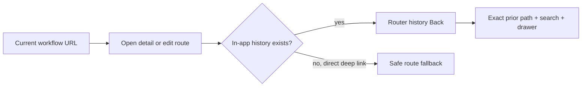

# Context-preserving navigation

> **Status:** Extended with global controls - **Last verified:** 2026-09-24 - **Product version:** `0.55.34`

## Purpose

Back navigation restores the workflow the operator was using, not a generic destination. Endpoint-list filters, endpoint tabs, Connect methods, Operations filters/pages, Discovery comparison state, and open resource drawers are URL state and therefore survive browser Back, Forward, refresh, and shared links.

Back and Forward are also global icon controls in the application header. They remain visible across every route. Forward is enabled only after moving below the highest reachable TanStack history index; a new PUSH truncates that forward branch. See [GLOBAL_NAVIGATION_AND_WORKFLOW_CONTEXT.md](GLOBAL_NAVIGATION_AND_WORKFLOW_CONTEXT.md).

## Navigation contract

`ContextBackButton` and `useContextBack()` share this rule:

- Use TanStack Router history when `useCanGoBack()` reports an in-app entry.
- Preserve the complete prior URL, including typed search state.
- Fall back to a caller-owned safe route for direct deep links.
- Endpoint detail falls back to `/endpoints`.
- Endpoint edit falls back to the endpoint overview.

`GlobalHistoryControls` owns the shell-wide pair:

- Back is available when TanStack `canGoBack()` is true.
- Forward is available when the current `__TSR_index` is below the highest reachable in-app index.
- A new route/search PUSH moves the highest reachable index to the new entry and discards the old forward branch.
- Browser history length is never used because it includes entries outside SCIMServer.

## URL-owned workflow state

| Surface | Restored state |
|---|---|
| Endpoints | `q` list filter |
| Endpoint Users/Groups/Logs | page, page size, filters, and `detail` drawer id |
| Global Logs | endpoint, method, status, time, error, duration, request id, and `detail` drawer id |
| Activity | type, severity, and search filters |
| Connect | selected authentication method |
| Operations | selected subtab, Users search/active/page, Groups search/page |
| Discovery | primary endpoint, compare mode, secondary endpoint, selected discovery subtab |
| Self-service `/Me` | selected endpoint |
| Manual Provision | selected endpoint and ResourceType |

Boolean search values accept actual booleans and the URL strings `true`/`false` explicitly. Truthy coercion is not used.

## Direct links

A page opened in a fresh tab has no valid in-app return entry. Back commands therefore use a deterministic fallback rather than leaving the application or rendering a blank history result. Workflow-local Back buttons inside onboarding and endpoint-creation steps remain step controls, not route-history commands.

## Validation

| Layer | Evidence |
|---|---|
| Search-schema unit | 26/26 typed URL parsing tests, including typed booleans and action-target workflow state |
| Page/component unit | 78 focused review-closure tests plus existing navigation coverage |
| Web coverage | 1,567/1,567 across 118 files |
| Playwright | 3/3 self-cleaning context-restoration journeys plus 6/6 global workflow regressions |
| Live SCIM | 1,516/1,516 against dev |
| Static/docs | Web build and route budgets; zero touched-file diagnostics; docs; 716 Mermaid renders |

The v0.55.31 context-preserving Back implementation is merged and deployed. The v0.55.34 global controls are locally validated; PR, merge, and dev deployment remain pending. Canary and customer prod are unchanged.
