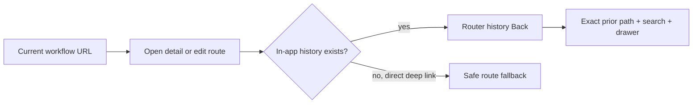

# Context-preserving navigation

> **Status:** Consolidated locally - **Last verified:** 2026-09-24 - **Product version:** `0.55.31`

## Purpose

Back navigation restores the workflow the operator was using, not a generic destination. Endpoint-list filters, endpoint tabs, Connect methods, Operations filters/pages, Discovery comparison state, and open resource drawers are URL state and therefore survive browser Back, Forward, refresh, and shared links.

## Navigation contract

`ContextBackButton` and `useContextBack()` share this rule:

- Use TanStack Router history when `useCanGoBack()` reports an in-app entry.
- Preserve the complete prior URL, including typed search state.
- Fall back to a caller-owned safe route for direct deep links.
- Endpoint detail falls back to `/endpoints`.
- Endpoint edit falls back to the endpoint overview.

## URL-owned workflow state

| Surface | Restored state |
|---|---|
| Endpoints | `q` list filter |
| Endpoint Users/Groups/Logs | page, page size, filters, and `detail` drawer id |
| Connect | selected authentication method |
| Operations | selected subtab, Users search/active/page, Groups search/page |
| Discovery | primary endpoint, compare mode, secondary endpoint, selected discovery subtab |

Boolean search values accept actual booleans and the URL strings `true`/`false` explicitly. Truthy coercion is not used.

## Direct links

A page opened in a fresh tab has no valid in-app return entry. Back commands therefore use a deterministic fallback rather than leaving the application or rendering a blank history result. Workflow-local Back buttons inside onboarding and endpoint-creation steps remain step controls, not route-history commands.

## Validation

| Layer | Evidence |
|---|---|
| Search-schema unit | 23/23 typed URL parsing tests |
| Page/component unit | 155 focused Back and URL-state tests |
| Web coverage | 1,534/1,534 across 115 files |
| Playwright | 3/3 self-cleaning context-restoration journeys |
| Live SCIM | 1,516/1,516 against dev |
| Static/docs | Web build and route budgets; zero touched-file diagnostics; docs; 713 Mermaid renders |

Full consolidation, PR, merge, and dev deployment remain pending. Canary and customer prod are unchanged.
