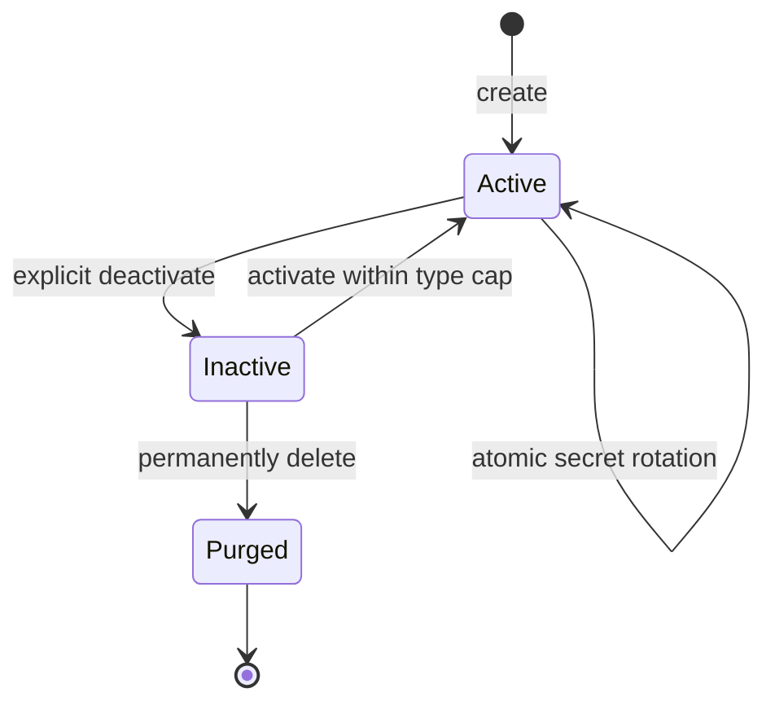

# Credential and WIF trust lifecycle

> **Status:** Merged and verified on dev - **Last verified:** 2026-09-24 - **Product version:** `0.55.30`

## Purpose

SCIMServer gives bearer credentials, OAuth client credentials, and WIF trusts one explicit lifecycle. Deactivation is reversible, permanent deletion is deliberate and inactive-only, and secret rotation is atomic.

## Lifecycle

Rotation applies only to bearer and OAuth client credentials. A WIF trust has no secret to rotate; edit its public trust metadata instead.

## API contract

| Operation | Route | Result |
|---|---|---|
| Create | `POST /scim/admin/endpoints/{endpointId}/credentials` | Active row; secret shown once for bearer/OAuth |
| Explicit deactivate | `POST .../credentials/{credentialId}/deactivate` | Public projection with `active:false` |
| Compatible deactivate | `DELETE .../credentials/{credentialId}` | `204`; retained for existing clients |
| Activate | `POST .../credentials/{credentialId}/activate` | Public projection with `active:true`; type cap enforced |
| Rotate | `POST .../credentials/{credentialId}/rotate` | New active row and one-time secret; old row inactive |
| Purge | `DELETE .../credentials/{credentialId}/purge` | `204`; inactive rows only |

An active purge or inactive rotation returns `409 Conflict`. Unknown and cross-endpoint identifiers return `404`.

## Atomic rotation

The controller no longer composes an independent create followed by deactivate. `IEndpointCredentialRepository.rotate()` owns the transition:

- Prisma deactivates the active source and creates the replacement in one transaction.
- If replacement creation fails, the deactivation rolls back.
- The active predicate rejects repeated or concurrent rotation of an already inactive source.
- InMemory performs the equivalent synchronous state transition.

OAuth rotation preserves the public `client_id`; bearer and OAuth replacements use the keyed credential format. WIF rotation remains invalid because no private secret exists.

## Permanent cleanup

Purge requires an inactive row so an operator cannot destroy a live credential in one click. The repository enforces `active=false` in the delete operation itself and reports whether exactly one row was removed; the controller does not infer success from a fulfilled operation. A concurrent activation makes the delete remove zero rows and returns `409`, while database failures remain failures.

For WIF, create, edit, deactivate, activate, and purge invalidate the endpoint trust cache. Purged rows cannot be reactivated and disappear from management lists.

## Connect UI

Bearer, OAuth, and WIF cards expose the same lifecycle language:

- Active: Rotate for secret credentials, plus Deactivate under More.
- Inactive: Activate and Permanently delete under More.
- Permanent deletion opens a destructive confirmation dialog and states that the action cannot be undone.
- Rotate is absent while inactive and remains absent for WIF trusts.

The UI calls the explicit deactivate route. The historical DELETE-deactivate route remains an API compatibility surface, not an ambiguous UI command.

## Validation

| Layer | Evidence |
|---|---|
| API unit | 5,159 tests across 174 suites; 98 focused repository/controller tests include rollback and purge-race controls |
| API E2E | 1,528 tests across 96 suites; 49 focused bearer, OAuth, and WIF tests pass |
| Web Vitest | 1,525 coverage tests across 114 files; 163 focused mutation and Connect tests pass |
| Browser | 2 self-cleaning Playwright journeys pass against the local built API |
| Local live | 1,516/1,516 pass; lifecycle section T1-T13 passes |
| Parity and static | All six modes, API/web builds, lint, route budgets, docs, and 712 Mermaid renders pass |

PR #171 merged as `524906d0`. Dev revision `scimserver-dev--v524906d0` serves v0.55.30 at 100% traffic. Dev live passed 1,516/1,516 and Playwright passed 238 with 4 intentional skips. Endpoint integrity is 60 -> 60 with no missing IDs; revision hygiene retains two active revisions. Canary and customer prod are unchanged.
