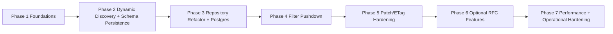

# Current API → Ideal RFC-First Architecture Migration Plan (Fresh)

Status: Draft (implementation roadmap)
Last Updated: 2026-02-20
Scope: Deep migration from current `api` implementation to the ideal target in `IDEAL_SCIM_ARCHITECTURE_RFC_FIRST_FRESH_2026-02-20.md`.

---

## 1) Current-State Snapshot (from `api` code)

### Strong foundations already present
- Endpoint-scoped multi-tenancy routing: `src/modules/scim/controllers/endpoint-scim-*.controller.ts`.
- Discovery endpoints exist at global and endpoint scope.
- SCIM filter parser AST exists: `src/modules/scim/filters/scim-filter-parser.ts`.
- `.search` endpoints exist for Users and Groups.
- ETag metadata is emitted in resource `meta.version` and interceptor sets `ETag` response header.
- Endpoint-level behavior flags exist in `src/modules/endpoint/endpoint-config.interface.ts`.

### Primary gaps vs ideal
1. **Persistence constraints**
   - SQLite provider and stringified payloads in `rawPayload`.
   - Case-insensitive uniqueness via helper columns (`userNameLower`, `displayNameLower`).

2. **Filter execution bottleneck**
   - `apply-scim-filter.ts` pushes only simple `eq` on selected columns.
   - Complex filters fallback to `fetch all + in-memory evaluateFilter`.

3. **Discovery is mostly static/hardcoded**
   - `Schemas`, `ResourceTypes`, `ServiceProviderConfig` controllers return fixed JSON.
   - Not dynamically driven by tenant-stored schema and resource type models.

4. **PATCH engine complexity risk**
   - User PATCH path handling is manual and branch-heavy in `endpoint-scim-users.service.ts`.
   - Group PATCH contains multiple operation modes + flags with complex branching.

5. **ETag conditional writes not strictly pre-validated in service layer**
   - Interceptor notes best-effort behavior; full precondition check should happen before mutation.

6. **Optional RFC features pending**
   - `/Bulk` not implemented.
   - `/Me` not implemented.

---

## 2) Target Migration Strategy

Principles:
- Minimize risk by vertical slices (schema/discovery first, then write paths).
- Keep existing API shape stable while swapping internals behind repository interfaces.
- Add compatibility adapters and feature flags for safe rollout.
- Each phase has acceptance criteria and rollback guardrails.



---

## 3) Detailed Step-by-Step Plan

## Phase 1 — Contract and Safety Foundations

### 1.1 Freeze protocol contracts with tests
- Add/extend test matrix for:
  - discovery response contracts,
  - filter operators and precedence,
  - PATCH valuePath behavior,
  - ETag preconditions,
  - attribute projection (`attributes`, `excludedAttributes`).

Why:
- Prevent regressions while internals are replaced.

Acceptance:
- Existing behavior documented as golden tests.

### 1.2 Introduce explicit domain contracts
- Add interfaces in a new domain package/module:
  - `IResourceRepository`, `ISchemaRepository`, `IResourceTypeRepository`, `ITenantConfigRepository`.
- Add domain types for effective schema model and filter AST query plan.

Why:
- Decouple SCIM domain from Prisma/SQLite implementation details.

Acceptance:
- Services compile using interfaces (even if concrete implementation initially proxies old Prisma service logic).

---

## Phase 2 — Persist Dynamic Schemas, ResourceTypes, and Tenant Config

### 2.1 Add persistence models (initially alongside current models)
Create new tables/entities:
- `tenant`
- `tenant_schema` (`schema_urn`, `attributes jsonb`, status/version)
- `tenant_resource_type` (`name`, `endpoint`, `base_schema_urn`, `schema_extensions jsonb`)
- `tenant_config` (`service_provider_config jsonb`, `behavior_flags jsonb`)

Why:
- Discovery and validation must become config/data-driven.

### 2.2 ResourceType ↔ Schema relation implementation
- `tenant_resource_type.base_schema_urn` references one `tenant_schema.schema_urn`.
- `tenant_resource_type.schema_extensions[]` references 0..N `tenant_schema.schema_urn`.
- Add repository-level referential validation for these URNs.

Why:
- Enables reusable extension schemas and dynamic discovery.

### 2.3 Replace hardcoded discovery JSON
Refactor controllers:
- `endpoint-scim-discovery.controller.ts`
- `resource-types.controller.ts`
- `schemas.controller.ts`
- `service-provider-config.controller.ts`

New behavior:
- Query repositories by tenant/endpoint context.
- Build SCIM `ListResponse` dynamically.

Acceptance:
- Tenant A and Tenant B can advertise different ResourceTypes and capabilities without code changes.

---

## Phase 3 — Persistence Migration to PostgreSQL + Repository Implementations

### 3.1 Move from SQLite to PostgreSQL
- Update datasource provider.
- Migrate current resource rows into PostgreSQL.
- Keep dual-read/dual-write compatibility option during cutover (short-lived).

### 3.2 Data model transformation
For resources:
- Replace `rawPayload` string with `data jsonb`.
- Keep explicit columns for hot identity fields (`externalId`, `userName`, `displayName`) and tenancy keys.
- Add versioning fields for robust ETag checks (`version_num` and/or `etag`).

For case-insensitivity:
- Replace lower helper columns with CITEXT / expression strategy.

### 3.3 Repository concrete implementations
- Implement `PostgresResourceRepository` and metadata repositories using Prisma/PostgreSQL.
- Keep domain orchestration unchanged.

Acceptance:
- All CRUD and discovery tests pass against PostgreSQL profile.

---

## Phase 4 — Filter Pushdown and Query Planning

### 4.1 Add AST planner layer
- Convert parsed AST into a query plan object.
- Classify predicates:
  - scalar indexed predicates,
  - JSON path predicates,
  - multi-valued valuePath predicates.

### 4.2 Replace broad in-memory fallback
- Refactor `apply-scim-filter.ts` to database-first execution.
- Keep bounded fallback only for unsupported edge predicates and log usage.

### 4.3 Add index-backed optimizations
- GIN `jsonb_path_ops` index.
- Expression indexes for frequent paths.
- Query plans verified with explain snapshots.

Acceptance:
- No full tenant scans for common filters.
- p95 list/search latency materially reduced under load.

---

## Phase 5 — PATCH + Attribute Characteristics + ETag Hardening

### 5.1 Central schema validator service
Create one reusable validator enforcing full attribute characteristics:
- `type`, `multiValued`, `required`, `canonicalValues`, `referenceTypes`,
- `mutability`, `returned`, `caseExact`, `uniqueness`.

### 5.2 Replace manual patch branching with structured patch pipeline
Pipeline:
1. Parse operation and path/valuePath.
2. Resolve target nodes by schema.
3. Apply operation.
4. Revalidate final resource document.

### 5.3 Strict ETag precondition enforcement in services
- Extract `If-Match`/`If-None-Match` in controllers.
- Pass to services.
- Validate preconditions before update/delete.
- Use optimistic concurrency in repository update predicate.

Example write precondition:
```http
PATCH /scim/endpoints/{endpointId}/Users/{id}
If-Match: W/"1700000000"
Content-Type: application/scim+json
```

On mismatch:
```http
HTTP/1.1 412 Precondition Failed
Content-Type: application/scim+json
```

Acceptance:
- ETag tests verify race-safe updates.

---

## Phase 6 — Optional RFC Features (/Bulk and /Me)

### 6.1 `/Bulk`
- Add bulk transaction orchestrator.
- Support `bulkId` resolution graph.
- Respect max operations/payload limits from tenant config.

### 6.2 `/Me`
- Resolve authenticated subject to resource id via policy.
- Route internally to standard resource handlers.

Acceptance:
- Discovery only advertises these as supported when enabled and tested.

---

## Phase 7 — Operational Hardening and Rollout

### 7.1 Feature-flagged rollout
- Enable dynamic discovery and schema validation per tenant.
- Canary tenants first.

### 7.2 Observability gates
- Add metrics dashboards:
  - filter pushdown ratio,
  - patch validation failures by type,
  - ETag 412 rates,
  - discovery cache hit ratio.

### 7.3 Data migration fallback strategy
- Migration snapshots + rollback scripts.
- Read-only freeze window for cutover if needed.

---

## 4) Concrete Mapping: Current Files → Migration Workstreams

- `src/modules/scim/filters/apply-scim-filter.ts`
  - Replace simple-db/complex-memory split with query planner pushdown.

- `src/modules/scim/services/endpoint-scim-users.service.ts`
  - Extract patch logic into dedicated patch engine service.
  - Inject schema validator and precondition checker.

- `src/modules/scim/services/endpoint-scim-groups.service.ts`
  - Align patch/member semantics to centralized patch + validator framework.

- `src/modules/scim/controllers/endpoint-scim-discovery.controller.ts`
- `src/modules/scim/controllers/resource-types.controller.ts`
- `src/modules/scim/controllers/schemas.controller.ts`
- `src/modules/scim/controllers/service-provider-config.controller.ts`
  - Refactor from hardcoded JSON to dynamic repository-backed responses.

- `src/modules/endpoint/endpoint-config.interface.ts`
  - Convert behavior flags into typed, discoverable tenant policy model.

- `prisma/schema.prisma`
  - Introduce tenant schema/resource type/config models.
  - Migrate resource payload storage to JSONB.

---

## 5) Example: Dynamic ResourceType + Schema Persistence

`tenant_schema` row:
```json
{
  "schema_urn": "urn:ietf:params:scim:schemas:core:2.0:User",
  "attributes": [
    { "name": "userName", "type": "string", "required": true, "caseExact": false, "uniqueness": "server", "mutability": "readWrite", "returned": "always" }
  ]
}
```

`tenant_resource_type` row:
```json
{
  "name": "User",
  "endpoint": "/Users",
  "base_schema_urn": "urn:ietf:params:scim:schemas:core:2.0:User",
  "schema_extensions": [
    { "schema": "urn:ietf:params:scim:schemas:extension:enterprise:2.0:User", "required": false }
  ]
}
```

Runtime relation:
- ResourceType references schema URNs.
- Schema URNs resolve to full attribute definitions.
- Validator builds effective schema for each request.

---

## 6) Risks and Mitigations

1. **Risk: behavior drift during refactor**
   - Mitigation: protocol golden tests + phased toggles.

2. **Risk: query performance regressions after pushdown changes**
   - Mitigation: explain-plan checks, benchmark gates, bounded fallback metrics.

3. **Risk: migration data incompatibility**
   - Mitigation: preflight validators, dry-run migration, rollback snapshots.

4. **Risk: tenant policy misconfiguration**
   - Mitigation: config schema validation and admin guardrails.

---

## 7) Definition of Done

- Discovery endpoints fully dynamic and tenant-specific.
- Full attribute characteristic enforcement in one shared validator.
- ResourceType-to-schema linkage persisted and validated.
- Filter execution primarily database-pushdown; in-memory fallback rare and observable.
- Strict ETag precondition checks before mutation.
- `/Bulk` and `/Me` implemented or explicitly unsupported in discovery.
- Production SLOs met with observability dashboards and alerting.

---

## 8) Suggested Execution Order (Calendar-Friendly)

- Sprint 1: Phase 1 + Phase 2 foundations.
- Sprint 2: Phase 3 persistence migration.
- Sprint 3: Phase 4 filter pushdown.
- Sprint 4: Phase 5 patch/etag hardening.
- Sprint 5: Phase 6 optional features + Phase 7 rollout hardening.

This sequence minimizes risk by moving from metadata correctness → persistence durability → query efficiency → mutation correctness.
