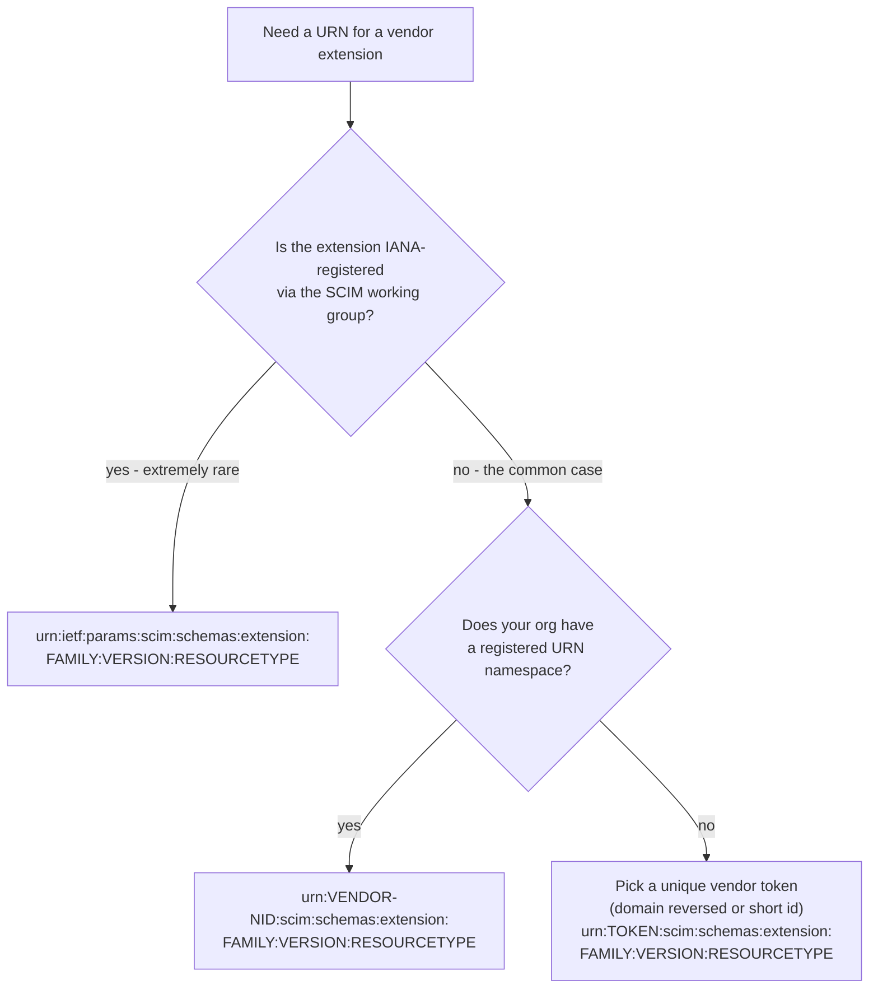
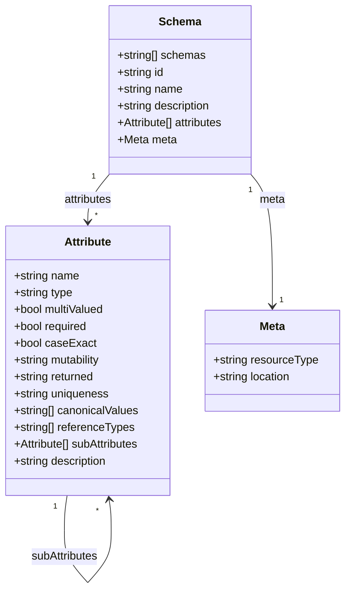
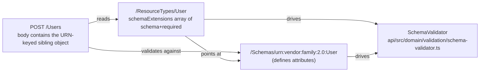
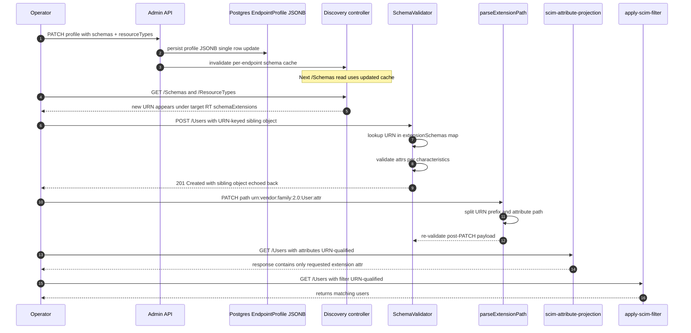

# Custom Resource Extensions - RFC-Compliant Authoring Guide

> **Audience:** operators and integrators defining schema extensions on top of SCIM core resources (`User`, `Group`, or custom resource types) for an endpoint of this server.
> **Author:** Schema-conformance task, May 28, 2026
> **Related:**
> - [OPENTEXT_ISV3_SCHEMA_SOURCE_VS_LIVE.md](OPENTEXT_ISV3_SCHEMA_SOURCE_VS_LIVE.md) - the audit that triggered this guide
> - [SCHEMA_CUSTOMIZATION_GUIDE.md](SCHEMA_CUSTOMIZATION_GUIDE.md) - operator workflow for editing endpoint profiles
> - [ENDPOINT_PROFILE_ARCHITECTURE.md](ENDPOINT_PROFILE_ARCHITECTURE.md) - how custom schemas flow from profile to discovery
> - [RFC_SCHEMA_AND_EXTENSIONS_REFERENCE.md](RFC_SCHEMA_AND_EXTENSIONS_REFERENCE.md) - URN namespace primer
> - [DISCOVERY_ENDPOINTS_RFC_AUDIT.md](DISCOVERY_ENDPOINTS_RFC_AUDIT.md) - server-side discovery audit
> - RFC 7643 (Core Schema): §2.2 attribute characteristics, §3.1 common attributes, §3.3 namespace qualifiers, §6 ResourceType meta-schema, §7 Schema meta-schema, §10 IANA considerations
> - RFC 7644 (Protocol): §3.1 schemas array semantics, §3.5.1 POST, §3.5.2 PATCH path resolution, §3.4.2 query parameters, §4 discovery endpoints

---

## Contents

- [1. Why this guide exists](#1-why-this-guide-exists)
- [2. RFC-mandated extension URN structure](#2-rfc-mandated-extension-urn-structure)
  - [2.1 Vendor URNs (the only legal home for non-IETF extensions)](#21-vendor-urns-the-only-legal-home-for-non-ietf-extensions)
  - [2.2 The "end with `User` or end with `Mailbox`?" decision](#22-the-end-with-user-or-end-with-mailbox-decision)
  - [2.3 URN structure flow diagram](#23-urn-structure-flow-diagram)
- [3. Schema meta-schema requirements (RFC 7643 §7)](#3-schema-meta-schema-requirements-rfc-7643-7)
  - [3.1 RFC 7643 §2.2 attribute characteristic defaults (memorize these)](#31-rfc-7643-22-attribute-characteristic-defaults-memorize-these)
  - [3.2 Conditionally-required characteristics](#32-conditionally-required-characteristics)
  - [3.3 Tightening allowance (RFC 7643 §7)](#33-tightening-allowance-rfc-7643-7)
- [4. ResourceType binding (RFC 7643 §6)](#4-resourcetype-binding-rfc-7643-6)
- [5. Worked end-to-end example: `proxyAddresses` extension to User](#5-worked-end-to-end-example-proxyaddresses-extension-to-user)
  - [5.1 URN](#51-urn)
  - [5.2 Schema definition (`GET /Schemas/{urn}`)](#52-schema-definition-get-schemasurn)
  - [5.3 ResourceType binding (`GET /ResourceTypes/User`)](#53-resourcetype-binding-get-resourcetypesuser)
  - [5.4 POST /Users body using the extension](#54-post-users-body-using-the-extension)
  - [5.5 Expected response](#55-expected-response)
  - [5.6 PATCH paths against the extension (RFC 7644 §3.5.2)](#56-patch-paths-against-the-extension-rfc-7644-352)
  - [5.7 Filter and projection (RFC 7644 §3.4.2)](#57-filter-and-projection-rfc-7644-342)
- [6. Authoring checklist (use this before submitting any new extension)](#6-authoring-checklist-use-this-before-submitting-any-new-extension)
  - [URN](#urn)
  - [Schema document](#schema-document-get-schemasurn)
  - [ResourceType binding](#resourcetype-binding-get-resourcetypesid)
  - [Wire contract](#wire-contract)
  - [Tests](#tests)
- [7. Common authoring mistakes and how the server reacts](#7-common-authoring-mistakes-and-how-the-server-reacts)
- [8. End-to-end flow when a custom extension lands](#8-end-to-end-flow-when-a-custom-extension-lands)
- [9. Operator workflow - registering a new extension on an existing endpoint](#9-operator-workflow---registering-a-new-extension-on-an-existing-endpoint)
  - [9.1 Compose the patched profile](#91-compose-the-patched-profile)
  - [9.2 Verify (discovery, then live round-trip)](#92-verify-discovery-then-live-round-trip)
- [10. Anti-patterns (do not ship)](#10-anti-patterns-do-not-ship)
- [11. Quick reference card](#11-quick-reference-card)

---

## 1. Why this guide exists

The May 28, 2026 OpenText ISV-3 audit ([OPENTEXT_ISV3_SCHEMA_SOURCE_VS_LIVE.md](OPENTEXT_ISV3_SCHEMA_SOURCE_VS_LIVE.md)) surfaced one real RFC violation (URN namespace squatting) plus three cosmetic divergences, all in a custom extension definition. None of the divergences were caught at write time because:

1. The endpoint-profile editor does not lint URN namespace
2. The published `/Schemas` faithfully serves whatever was registered, even if non-conformant
3. There is no operator-facing checklist that walks the RFC requirements end to end

This guide is that checklist. It is the canonical reference for authoring any custom extension that will be served from `/scim/endpoints/:id/Schemas`. Following the rules here will produce an extension definition that:

- passes RFC 7643 §7 (Schema meta-schema) validation
- shows up correctly in `/ResourceTypes` per RFC 7643 §6
- accepts wire payloads per RFC 7644 §3.1 + §3.5.1
- supports PATCH paths per RFC 7644 §3.5.2
- supports filter and projection per RFC 7644 §3.4.2

---

## 2. RFC-mandated extension URN structure

The RFC 7643 §10 IANA registration template for SCIM extension URNs is:

```
urn:ietf:params:scim:schemas:extension:<extension-family>:<version>:<resourceType>
```

Worked example (the only standard-defined extension, RFC 7643 §4.3 EnterpriseUser):

```
urn:ietf:params:scim:schemas:extension:enterprise:2.0:User
                                       └─────────┘ └─┘ └──┘
                                       family    ver  resource it extends
```

### 2.1 Vendor URNs (the only legal home for non-IETF extensions)

The `urn:ietf:params:scim:schemas:extension:` sub-namespace is reserved for IANA-registered SCIM extensions (RFC 7643 §10 + RFC 3553). **Vendor extensions MUST live under a vendor-controlled URN.** Mirror the IETF template for symmetry:

```
urn:<vendor>:scim:schemas:extension:<family>:<version>:<resourceType>
```

| Component | Rule | Example |
|---|---|---|
| `<vendor>` | Your registered URN namespace identifier (NID), or a unique organization token you control | `opentext`, `contoso`, `acme` |
| `scim:schemas:extension` | Literal, mirrors the IETF tree so SCIM tooling parses it uniformly | `scim:schemas:extension` |
| `<family>` | Short PascalCase or lowercase family name; lets you ship multiple extensions to the same resource type without colliding | `mailbox`, `licensing`, `device` |
| `<version>` | Major.minor or just major; bump when shape changes break wire compat | `2.0`, `1`, `3.1` |
| `<resourceType>` | The CORE resource the extension extends; matches the `id` of the target ResourceType | `User`, `Group`, `Device` |

### 2.2 The "end with `User` or end with `Mailbox`?" decision

**Always end with the resource type the extension attaches to**, not the extension's concept name. Reasons:

1. **RFC §10 template alignment** - the canonical layout puts the resource type last
2. **Discoverability** - a client scanning URNs can immediately see "this extension applies to User" by reading the last segment, without first walking `/ResourceTypes.schemaExtensions[]`
3. **Multi-resource extensibility** - if you later want the same shape on a different resource (e.g., a `SharedMailbox` resource type), ship a sibling URN ending in `:SharedMailbox` without overloading one URN across two resource types
4. **Ecosystem alignment** - Azure AD, Okta, Google, Salesforce SCIM all end vendor extension URNs with the resource type
5. **Disambiguation across your own extensions** - the `<family>` token (e.g., `mailbox`) is the namespace for "what kind of extension this is"; the `<resourceType>` token is "what resource it attaches to". Both slots are needed; collapsing them costs you future expansion room

| ✅ Correct | ❌ Wrong |
|---|---|
| `urn:opentext:scim:schemas:extension:mailbox:2.0:User` | `urn:opentext:scim:schemas:extension:2.0:Mailbox` (lost resource type slot) |
| `urn:contoso:scim:schemas:extension:device:1.0:User` | `urn:ietf:params:scim:schemas:extension:contoso:1.0:User` (squats IETF namespace) |
| `urn:acme:scim:schemas:extension:licensing:2.0:User` | `urn:acme:scim:extension:License` (no version, no resource type) |

### 2.3 URN structure flow diagram



> Diagram uses placeholder tokens in UPPERCASE (FAMILY, VERSION, RESOURCETYPE, VENDOR-NID, TOKEN) instead of `<angle-bracket>` notation because Mermaid treats `<...>` as HTML and refuses to render the node. The narrative tables in §2.1 use the conventional `<placeholder>` form.


---

## 3. Schema meta-schema requirements (RFC 7643 §7)

Every extension you publish is itself a SCIM Schema resource that lives at `GET /Schemas/{urn}`. Its shape MUST conform to the Schema meta-schema:



#### Field semantics (matches the class diagram above)

| Class | Field | Notes |
|---|---|---|
| `Schema` | `schemas` | MUST be `["urn:ietf:params:scim:schemas:core:2.0:Schema"]` |
| `Schema` | `id` | The URN identifying THIS extension |
| `Schema` | `name` | Short PascalCase (e.g. `Mailbox`, `EnterpriseUser`) |
| `Schema` | `description` | Optional human-readable summary |
| `Attribute` | `type` | One of: `string`, `boolean`, `decimal`, `integer`, `dateTime`, `reference`, `binary`, `complex` |
| `Attribute` | `mutability` | One of: `readOnly`, `readWrite`, `immutable`, `writeOnly` |
| `Attribute` | `returned` | One of: `always`, `never`, `default`, `request` |
| `Attribute` | `uniqueness` | One of: `none`, `server`, `global` |
| `Attribute` | `referenceTypes` | REQUIRED when `type=reference` |
| `Attribute` | `subAttributes` | REQUIRED when `type=complex` |
| `Meta` | `resourceType` | Literal `"Schema"` |
| `Meta` | `location` | Absolute URI of this Schema resource |


### 3.1 RFC 7643 §2.2 attribute characteristic defaults (memorize these)

If a characteristic is omitted, the client MUST apply the RFC default. **This server materializes the defaults so the published schema is self-describing**, but the wire-level RFC contract still uses defaults:

| Characteristic | Default | Allowed values |
|---|---|---|
| `required` | `false` | `true`, `false` |
| `caseExact` | `false` | `true`, `false` |
| `mutability` | `readWrite` | `readOnly`, `readWrite`, `immutable`, `writeOnly` |
| `returned` | `default` | `always`, `never`, `default`, `request` |
| `uniqueness` | `none` | `none`, `server`, `global` |
| `multiValued` | `false` | `true`, `false` |
| `type` | `"string"` | `string`, `boolean`, `decimal`, `integer`, `dateTime`, `reference`, `binary`, `complex` |

When writing tests against published schemas, ALWAYS go through `effectiveCharacteristic()` in [api/test/e2e/helpers/schema-characteristics.helper.ts](../api/test/e2e/helpers/schema-characteristics.helper.ts) (or `Get-EffectiveUniqueness` in [scripts/live-test.ps1](../scripts/live-test.ps1)). Never hardcode `expect(attr.uniqueness).toBe('none')` - the Schema-Characteristic Test Rule in [.github/copilot-instructions.md](../.github/copilot-instructions.md) exists because of the May 2026 `Group.displayName` uniqueness flip.

### 3.2 Conditionally-required characteristics

| Condition | Required field |
|---|---|
| `type: "reference"` | `referenceTypes` (multi-valued string; e.g., `["User", "Group"]` or `["uri"]`) |
| `type: "complex"` | `subAttributes` (recursive Attribute array) |
| `type: "complex"` AND a sub-attribute is itself `complex` | NOT ALLOWED - RFC 7643 §2.3 prohibits nested-complex (complex of complex). Flatten or split into a separate extension. |

### 3.3 Tightening allowance (RFC 7643 §7)

A server MAY enforce characteristics stricter than what it advertises. This server INVERTS that policy: the published value MUST be at least as strict as the global RFC baseline (see [api/src/modules/scim/endpoint-profile/tighten-only-validator.ts](../api/src/modules/scim/endpoint-profile/tighten-only-validator.ts)). Concretely:

- An extension may declare `uniqueness: "server"` even if the RFC baseline for that attribute name is `none`
- An extension may declare `required: true` even if the RFC baseline is `false`
- An extension may NOT loosen the baseline (e.g., declare `mutability: readWrite` for `id`)

When you tighten, **annotate the divergence in the `description`** so consumers understand the constraint is intentional and not a copy-paste error. Pattern from the live Group schema:

```text
"A human-readable name for the Group. REQUIRED.
 (uniqueness tightened from <baseline> to 'server' to satisfy the
 SCIMServer RFC 7643 §7 tightening-only policy.)"
```

---

## 4. ResourceType binding (RFC 7643 §6)

An extension definition by itself does nothing. It MUST also be attached to a ResourceType via that ResourceType's `schemaExtensions[]` array. Otherwise discovery clients never see it and validation never enforces it.



| ResourceType field | RFC 7643 §6 rule | Notes |
|---|---|---|
| `schemaExtensions[*].schema` | REQUIRED, URI | The full extension URN |
| `schemaExtensions[*].required` | REQUIRED, boolean | `true` means a POST body that omits this extension's sibling object will be `400 invalidValue`. Default `false`. |

A common author mistake: defining the schema at `/Schemas` but forgetting the `schemaExtensions` entry. Symptom: the extension is discoverable but a POST that includes its sibling object is rejected as an unknown URN under `StrictSchemaValidation`.

---

## 5. Worked end-to-end example: `proxyAddresses` extension to User

This is the corrected version of the OpenText ISV-3 Mailbox extension. It fixes the URN-namespace violation, materializes defaults, and uses the flat-string shape (multi-valued primitive string with documented prefix convention) which is wire-compatible with Microsoft Exchange / Entra ID `proxyAddresses`.

### 5.1 URN

```
urn:opentext:scim:schemas:extension:mailbox:2.0:User
```

### 5.2 Schema definition (`GET /Schemas/{urn}`)

```json
{
  "schemas": ["urn:ietf:params:scim:schemas:core:2.0:Schema"],
  "id":   "urn:opentext:scim:schemas:extension:mailbox:2.0:User",
  "name": "Mailbox",
  "description": "OpenText mailbox routing extension for User. Carries the user's full set of mailbox-addressable identifiers as a flat list of typed-prefix strings, wire-compatible with Microsoft Exchange / Entra ID 'proxyAddresses' semantics.",
  "attributes": [
    {
      "name": "proxyAddresses",
      "type": "string",
      "multiValued": true,
      "required": false,
      "caseExact": true,
      "mutability": "readWrite",
      "returned": "default",
      "uniqueness": "none",
      "description": "Multi-valued list of mailbox-addressable identifiers for this user. Each entry MUST be of the form '<TYPE>:<address>' where <TYPE> is a routing-protocol token and <address> is its protocol-specific value. Recognized <TYPE> tokens: 'SMTP' / 'smtp' (RFC 5321 mail; uppercase = primary, lowercase = alias - at most ONE uppercase 'SMTP:' across the array), 'SIP' / 'sip' (SIP / Teams routing), 'X500' / 'x500' (legacy directory DN), 'X400' / 'x400' (legacy X.400 path), 'SMS' / 'sms' (numeric routing), 'EUM' / 'eum' (Exchange Unified Messaging). Case in the <TYPE> prefix is semantic (caseExact:true): uppercase indicates the primary address of that protocol; lowercase indicates a secondary alias. Within each <TYPE>, the <address> portion MUST be unique. The full string (prefix + address) MUST be unique across the entire array."
    }
  ],
  "meta": {
    "resourceType": "Schema",
    "location": "https://scimserver-prod.calmsand-7f4fc5dc.centralus.azurecontainerapps.io/scim/endpoints/128f64b5-ffb5-41f2-9ba2-c874f5ea7335/Schemas/urn:opentext:scim:schemas:extension:mailbox:2.0:User"
  }
}
```

#### Why each characteristic is set the way it is

| Field | Value | RFC anchor / reason |
|---|---|---|
| top-level `schemas` | `[core:2.0:Schema]` | RFC 7643 §7 - every Schema resource describes itself via the Schema meta-schema |
| `id` | vendor URN ending in `:User` | RFC 7643 §10 + §2 of this doc |
| `name` | `"Mailbox"` (short PascalCase) | RFC 7643 §7 convention; matches `User`, `Group`, `EnterpriseUser` |
| `type` | `string` | flat-string shape (per operator decision); RFC 7643 §2.4 allows either primitive or complex multi-valued |
| `multiValued` | `true` | one user has many mailbox routes |
| `required` | `false` (explicit) | a User MAY exist without a mailbox; default is `false` |
| `caseExact` | `true` | non-negotiable - Exchange semantics use case to encode primary-vs-alias (`SMTP:` vs `smtp:`); RFC 7643 §2.3.1 |
| `mutability` | `readWrite` (explicit) | clients can add/remove addresses |
| `returned` | `default` (explicit) | returned on GET unless `?excludedAttributes` |
| `uniqueness` | `none` (explicit) | attribute-level uniqueness is at the whole-attribute scope; per-entry uniqueness is a content invariant documented in `description` |
| no `canonicalValues` | - | the type prefix is embedded inside the value, not a separate sub-attribute; canonical set is documented prose-style |
| no `subAttributes` | - | not a complex type |
| no `referenceTypes` | - | `type: string`, not `reference` |

### 5.3 ResourceType binding (`GET /ResourceTypes/User`)

```json
{
  "schemas": ["urn:ietf:params:scim:schemas:core:2.0:ResourceType"],
  "id":   "User",
  "name": "User",
  "schema": "urn:ietf:params:scim:schemas:core:2.0:User",
  "endpoint": "/Users",
  "description": "Customer Portal User Account",
  "schemaExtensions": [
    { "schema": "urn:ietf:params:scim:schemas:extension:enterprise:2.0:User", "required": false },
    { "schema": "urn:opentext:scim:schemas:extension:mailbox:2.0:User",       "required": false }
  ],
  "meta": {
    "resourceType": "ResourceType",
    "location": "https://scimserver-prod.calmsand-7f4fc5dc.centralus.azurecontainerapps.io/scim/endpoints/128f64b5-ffb5-41f2-9ba2-c874f5ea7335/ResourceTypes/User"
  }
}
```

### 5.4 POST /Users body using the extension

```http
POST /scim/endpoints/128f64b5-ffb5-41f2-9ba2-c874f5ea7335/Users HTTP/1.1
Host:          scimserver-prod.calmsand-7f4fc5dc.centralus.azurecontainerapps.io
Authorization: Bearer <token>
Content-Type:  application/scim+json
Accept:        application/scim+json
```

```json
{
  "schemas": [
    "urn:ietf:params:scim:schemas:core:2.0:User",
    "urn:opentext:scim:schemas:extension:mailbox:2.0:User"
  ],
  "userName": "bjensen@example.com",
  "name":     { "givenName": "Barbara", "familyName": "Jensen" },
  "active":   true,
  "urn:opentext:scim:schemas:extension:mailbox:2.0:User": {
    "proxyAddresses": [
      "SMTP:bjensen@example.com",
      "smtp:bjensen@contoso.example",
      "smtp:babs.jensen@example.com",
      "SIP:bjensen@example.com",
      "X500:/o=ExampleOrg/ou=Users/cn=Recipients/cn=bjensen"
    ]
  }
}
```

### 5.5 Expected response

```http
HTTP/1.1 201 Created
Location: https://scimserver-prod.../scim/endpoints/.../Users/<scimId>
ETag:     W/"v1"
Content-Type: application/scim+json
```

```json
{
  "schemas": [
    "urn:ietf:params:scim:schemas:core:2.0:User",
    "urn:opentext:scim:schemas:extension:mailbox:2.0:User"
  ],
  "id":   "<server-assigned-uuid>",
  "userName": "bjensen@example.com",
  "name":     { "givenName": "Barbara", "familyName": "Jensen" },
  "active":   true,
  "urn:opentext:scim:schemas:extension:mailbox:2.0:User": {
    "proxyAddresses": [
      "SMTP:bjensen@example.com",
      "smtp:bjensen@contoso.example",
      "smtp:babs.jensen@example.com",
      "SIP:bjensen@example.com",
      "X500:/o=ExampleOrg/ou=Users/cn=Recipients/cn=bjensen"
    ]
  },
  "meta": {
    "resourceType": "User",
    "created":      "2026-05-28T18:42:00Z",
    "lastModified": "2026-05-28T18:42:00Z",
    "location":     "https://.../Users/<scimId>",
    "version":      "W/\"v1\""
  }
}
```

### 5.6 PATCH paths against the extension (RFC 7644 §3.5.2)

```jsonc
// Add a secondary alias
{
  "schemas": ["urn:ietf:params:scim:api:messages:2.0:PatchOp"],
  "Operations": [{
    "op":   "add",
    "path": "urn:opentext:scim:schemas:extension:mailbox:2.0:User:proxyAddresses",
    "value": ["smtp:babs@personal.example"]
  }]
}

// Remove one specific address by exact value (caseExact:true means case-sensitive match)
{
  "schemas": ["urn:ietf:params:scim:api:messages:2.0:PatchOp"],
  "Operations": [{
    "op":   "remove",
    "path": "urn:opentext:scim:schemas:extension:mailbox:2.0:User:proxyAddresses[value eq \"smtp:babs.jensen@example.com\"]"
  }]
}

// Replace the whole array (promote a new primary)
{
  "schemas": ["urn:ietf:params:scim:api:messages:2.0:PatchOp"],
  "Operations": [{
    "op":   "replace",
    "path": "urn:opentext:scim:schemas:extension:mailbox:2.0:User:proxyAddresses",
    "value": [
      "SMTP:bjensen@new-primary.example",
      "smtp:bjensen@example.com",
      "smtp:bjensen@contoso.example"
    ]
  }]
}

// Remove the entire extension block in one op
{
  "schemas": ["urn:ietf:params:scim:api:messages:2.0:PatchOp"],
  "Operations": [{
    "op":   "remove",
    "path": "urn:opentext:scim:schemas:extension:mailbox:2.0:User"
  }]
}
```

### 5.7 Filter and projection (RFC 7644 §3.4.2)

```http
# Find users whose Mailbox extension contains a specific alias
GET /Users?filter=urn:opentext:scim:schemas:extension:mailbox:2.0:User:proxyAddresses co "smtp:bjensen"

# Return only core userName plus the Mailbox extension
GET /Users/<id>?attributes=userName,urn:opentext:scim:schemas:extension:mailbox:2.0:User:proxyAddresses

# Hide the Mailbox extension on a list page
GET /Users?excludedAttributes=urn:opentext:scim:schemas:extension:mailbox:2.0:User
```

All three forms resolve through `parseExtensionPath()` in [api/src/modules/scim/utils/scim-patch-path.ts](../api/src/modules/scim/utils/scim-patch-path.ts) and `getExtensionUrns()` in [api/src/modules/scim/common/scim-service-helpers.ts](../api/src/modules/scim/common/scim-service-helpers.ts). The same machinery handles core, enterprise, and any custom URN uniformly - no per-URN branching.

---

## 6. Authoring checklist (use this before submitting any new extension)

Run through every box. A "no" is a fix-before-publish.

### URN
- [ ] URN uses a vendor-controlled namespace (NOT `urn:ietf:params:scim:schemas:extension:` unless IANA-registered)
- [ ] URN ends with the resource type it extends (`:User`, `:Group`, `:Device`, ...)
- [ ] URN contains an explicit version segment (`:2.0`, `:1`, ...)
- [ ] URN contains a family token between `extension:` and the version (`:mailbox:`, `:licensing:`, ...) so multiple extensions on the same resource don't collide

### Schema document (`GET /Schemas/{urn}`)
- [ ] Top-level `schemas` = `["urn:ietf:params:scim:schemas:core:2.0:Schema"]`
- [ ] `id` equals the URN
- [ ] `name` is short PascalCase (NOT verbose like `MailboxExtensionResource`)
- [ ] `description` exists and explains the extension's purpose
- [ ] Every attribute has `type` and `multiValued` (the two RFC-required fields)
- [ ] Every attribute has `required`, `caseExact`, `mutability`, `returned`, `uniqueness` materialized (operator-side rule for self-describing schemas; RFC permits omission)
- [ ] `type: "reference"` attributes also have `referenceTypes`
- [ ] `type: "complex"` attributes also have `subAttributes`
- [ ] No nested-complex (`subAttributes[*].type` is NEVER `complex`) per RFC 7643 §2.3
- [ ] Any tightening vs the RFC baseline is annotated in `description`
- [ ] `meta.resourceType` = `"Schema"` and `meta.location` is the absolute URI

### ResourceType binding (`GET /ResourceTypes/{id}`)
- [ ] Target ResourceType's `schemaExtensions[]` contains an entry for this URN
- [ ] Entry has both `schema` (URN) and `required` (boolean) fields
- [ ] `required` value is intentional (`true` = clients MUST send the sibling block on every create)

### Wire contract
- [ ] Every POST/PUT body that uses the extension lists the URN in `schemas[]`
- [ ] Every POST/PUT body that lists the URN in `schemas[]` includes the corresponding sibling object (or omits both)
- [ ] Extension attributes appear in a sibling object keyed by the FULL URN, NEVER flattened to the top level
- [ ] PATCH paths use the fully-qualified URN-prefixed form when targeting extension attrs
- [ ] Filter and projection paths use the fully-qualified URN-prefixed form

### Tests
- [ ] Unit test against the published schema using `expectCharacteristicIn()` / `effectiveCharacteristic()` - NEVER `toBe('none')` (Schema-Characteristic Test Rule)
- [ ] E2E test exercises POST + GET round-trip with the extension populated
- [ ] Live test ([scripts/live-test.ps1](../scripts/live-test.ps1)) section asserts the URN is in `/Schemas`, in the target ResourceType's `schemaExtensions[]`, and survives a POST + GET round-trip

---

## 7. Common authoring mistakes and how the server reacts

| Mistake | What the server does | RFC anchor |
|---|---|---|
| URN namespace squatting on `urn:ietf:params:scim:schemas:extension:` | Accepts at registration but is non-conformant; flagged in audit | RFC 7643 §10 |
| Sibling block present, URN missing from `schemas[]` | Currently SILENTLY back-fills the URN into response `schemas[]` - known gap per [OPENTEXT_ISV3_SCHEMA_SOURCE_VS_LIVE.md](OPENTEXT_ISV3_SCHEMA_SOURCE_VS_LIVE.md) audit follow-up | RFC 7644 §3.1 expects `400 invalidSyntax` |
| URN in `schemas[]`, sibling block absent, no required attrs | Accepts (no required-attr violation to enforce) | RFC 7643 §7 |
| URN in `schemas[]`, sibling block absent, extension has required attr | `400 invalidValue` with `attributePaths` naming the missing attr | RFC 7643 §7 + §2.2 |
| Extension attrs flattened to top level | Treated as unknown core attrs; under StrictSchemaValidation: `400 invalidSyntax`; under loose: silently dropped | RFC 7643 §3.3 |
| Unknown sub-attribute inside extension block | `400 invalidSyntax` under StrictSchemaValidation | RFC 7643 §7 |
| `mutability: readOnly` attr sent on POST | `400 mutability` | RFC 7643 §2.2 |
| Duplicate value for `uniqueness: server` attr | `409 uniqueness` | RFC 7643 §2.2 |
| `canonicalValues` violation | `400 invalidValue` | RFC 7643 §2.2 |
| Multi-valued: more than one entry with `primary: true` | `400 invalidValue` | RFC 7643 §2.4 |

---

## 8. End-to-end flow when a custom extension lands



Every box uses the SAME per-endpoint `extensionUrns` list (sourced from `getExtensionUrns(endpointId)` in [api/src/modules/scim/common/scim-service-helpers.ts](../api/src/modules/scim/common/scim-service-helpers.ts)). There is no per-URN branching anywhere in the call graph - that uniformity is what makes the server's custom-extension support RFC-correct across discovery, validation, PATCH, projection, and filter.

---

## 9. Operator workflow - registering a new extension on an existing endpoint

### 9.1 Compose the patched profile

```powershell
$base = "https://scimserver-prod.calmsand-7f4fc5dc.centralus.azurecontainerapps.io"
$epId = "<your-endpoint-id>"
$tok  = (Invoke-RestMethod -Uri "$base/scim/oauth/token" -Method Post -ContentType 'application/json' `
          -Body '{"grant_type":"client_credentials","client_id":"scimserver-client","client_secret":"<secret>"}').access_token

# 1. Fetch the current profile
$current = Invoke-RestMethod -Uri "$base/scim/admin/endpoints/$epId" `
             -Headers @{ Authorization = "Bearer $tok" }
$profile = $current.profile

# 2. Append the new Schema (full meta-schema-conformant object)
$newSchema = @{
  id   = 'urn:opentext:scim:schemas:extension:mailbox:2.0:User'
  name = 'Mailbox'
  description = 'OpenText mailbox routing extension for User. ...'
  attributes = @(
    @{
      name = 'proxyAddresses'; type = 'string'; multiValued = $true
      required = $false; caseExact = $true; mutability = 'readWrite'
      returned = 'default'; uniqueness = 'none'
      description = "Multi-valued list of mailbox-addressable identifiers ..."
    }
  )
}
$profile.schemas = @($profile.schemas) + $newSchema

# 3. Wire the URN into the target ResourceType's schemaExtensions[]
$userRt = $profile.resourceTypes | Where-Object { $_.id -eq 'User' }
$userRt.schemaExtensions = @($userRt.schemaExtensions) + @{
  schema   = 'urn:opentext:scim:schemas:extension:mailbox:2.0:User'
  required = $false
}

# 4. PATCH the patched profile back (server replaces schemas[] / resourceTypes[] wholesale,
#    deep-merges settings; see api/src/modules/endpoint/services/endpoint.service.ts mergeProfilePartial)
Invoke-RestMethod -Uri "$base/scim/admin/endpoints/$epId" -Method Patch `
  -Headers @{ Authorization = "Bearer $tok" } -ContentType 'application/json' `
  -Body (@{ profile = @{ schemas = $profile.schemas; resourceTypes = $profile.resourceTypes } } | ConvertTo-Json -Depth 30)
```

### 9.2 Verify (discovery, then live round-trip)

```powershell
$hdr = @{ Authorization = "Bearer $tok"; Accept = 'application/scim+json' }

# (a) Schema appears under /Schemas/{urn}
Invoke-RestMethod -Uri "$base/scim/endpoints/$epId/Schemas/urn:opentext:scim:schemas:extension:mailbox:2.0:User" `
  -Headers $hdr | ConvertTo-Json -Depth 20

# (b) URN is bound to the User resource type
(Invoke-RestMethod -Uri "$base/scim/endpoints/$epId/ResourceTypes/User" `
  -Headers $hdr).schemaExtensions

# (c) Round-trip a POST + GET that exercises the extension
$body = @{
  schemas = @(
    'urn:ietf:params:scim:schemas:core:2.0:User',
    'urn:opentext:scim:schemas:extension:mailbox:2.0:User'
  )
  userName = 'roundtrip@example.com'
  name = @{ givenName = 'Round'; familyName = 'Trip' }
  active = $true
  'urn:opentext:scim:schemas:extension:mailbox:2.0:User' = @{
    proxyAddresses = @('SMTP:roundtrip@example.com')
  }
} | ConvertTo-Json -Depth 10

$created = Invoke-RestMethod -Uri "$base/scim/endpoints/$epId/Users" -Method Post `
             -Headers $hdr -ContentType 'application/scim+json' -Body $body
$created | ConvertTo-Json -Depth 10
```

The response MUST include the extension sibling object AND the URN in its `schemas[]` array. If either is missing, the registration is wrong.

---

## 10. Anti-patterns (do not ship)

1. **URN with `Mailbox` (or other concept) as the last segment** - costs you the per-resource-type slot, breaks ecosystem-wide convention
2. **URN under `urn:ietf:params:scim:schemas:extension:`** for a non-IANA extension - squats the IETF namespace
3. **Schema name like `MailboxExtensionResource`** - RFC convention is short PascalCase (`Mailbox`)
4. **Nested complex (`subAttributes[*].type == "complex"`)** - RFC 7643 §2.3 forbids this; flatten or split
5. **Forgetting the `schemaExtensions[]` binding** - schema is discoverable but POST sees an unregistered URN
6. **`canonicalValues` for a string-encoded prefix** - `canonicalValues` validates the whole attribute value, not a prefix substring; document the prefix convention in `description` instead
7. **Omitting `required` field on `schemaExtensions[*]`** - RFC 7643 §6 makes it REQUIRED even when its value is `false`
8. **Hardcoded test assertion `expect(attr.uniqueness).toBe('none')`** - violates the Schema-Characteristic Test Rule; use `expectCharacteristicIn()`
9. **Same extension URN attached to two different resource types** - pick distinct URNs ending in each respective resource type
10. **Mutating an extension's wire shape under the same URN+version** - bump the version (`:2.0` -> `:3.0`) so existing clients don't silently break

---

## 11. Quick reference card

| Need | Where to look |
|---|---|
| RFC default for an omitted characteristic | §3.1 of this doc |
| URN format | §2 of this doc |
| Schema meta-schema fields | §3 of this doc |
| ResourceType binding fields | §4 of this doc |
| Worked example | §5 of this doc |
| Authoring checklist | §6 of this doc |
| Error catalogue | §7 of this doc |
| End-to-end flow | §8 of this doc |
| How to register on an existing endpoint | §9 of this doc |
| What never to do | §10 of this doc |
| Operator-facing companion (UI flows) | [SCHEMA_CUSTOMIZATION_GUIDE.md](SCHEMA_CUSTOMIZATION_GUIDE.md) |
| How profile storage flows to discovery | [ENDPOINT_PROFILE_ARCHITECTURE.md](ENDPOINT_PROFILE_ARCHITECTURE.md) |
| Filed audit precedent | [OPENTEXT_ISV3_SCHEMA_SOURCE_VS_LIVE.md](OPENTEXT_ISV3_SCHEMA_SOURCE_VS_LIVE.md) |
