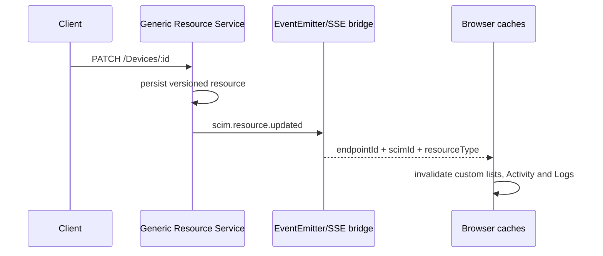

# Custom Resource Observability and Shared Logs

> **Status:** Merged and verified on dev - **Last verified:** 2026-09-24 - **Product version:** `0.55.29`

## Outcome

Custom ResourceTypes now participate in the same operational story as Users and Groups.

- Activity classifies custom create, read, replace, patch, and delete operations as `resource`.
- Each activity carries `resourceType`, `resourceEndpoint`, and `resourceIdentifier` when available.
- Generic PUT and PATCH emit `scim.resource.updated`; the SSE bridge forwards it to browser cache invalidation and notifications.
- Endpoint Logs and global Logs share one URL-driven filter toolbar.
- Custom URLs remain visible and filterable in both Logs surfaces.

## Activity Contract

```json
{
  "id": "request-log-id",
  "timestamp": "2026-09-24T00:00:00.000Z",
  "type": "resource",
  "severity": "info",
  "message": "Device updated: device-1",
  "resourceType": "Device",
  "resourceEndpoint": "/Devices",
  "resourceIdentifier": "device-1"
}
```

The parser recognizes endpoint-scoped SCIM paths and resolves each custom name and endpoint from the owning endpoint profile. Historical logs for a deleted endpoint fall back to the raw path segment without inventing a singular name. Discovery, Bulk, Me, OAuth, and well-known routes remain system activity. User and Group retain their richer specialized parsing.

Prisma pushes exact User, Group, custom-resource, and error predicates into the query. Filters derived from parsed activity semantics read ordered candidates in bounded 200-row batches before total calculation and page slicing. InMemory uses the same bounded parse-filter-page order. Totals and pages therefore describe the returned activity set for every type and severity.

## Update Event Flow



Create, update, and delete are distinct events. Updates do not alter generic-resource counts, so the stats projection observes create/delete only.

## Shared Logs Filters

| Filter | Global Logs | Endpoint Logs |
|---|---:|---:|
| URL contains | yes | yes |
| Method | yes | yes |
| Status | yes | yes |
| Time range | yes | yes |
| Errors only | yes | yes |
| Minimum duration | yes | yes |
| Request ID | yes | yes |
| Endpoint | selectable | fixed by route |

Every filter lives in the URL and in the query key. Reload, deep-link, Back/Forward, and cache separation therefore use one contract.

Relative time bounds are memoized by the selected URL range, so unrelated renders do not churn query keys. The toolbar remains visible for empty results, and both surfaces expose one Reset command. Auth badges retain their complete tooltip while owning a single-line, left-aligned ellipsis contract in narrow table columns.

## Validation

- API unit: 5,150/5,150 across 174 suites.
- API E2E: 1,525/1,525 across 96 suites.
- Affected API and event slice: 144/144.
- Web Vitest/coverage: 1,521/1,521 across 114 files; 85.32% lines, 74.79% branches, 75.13% functions, 82.49% statements.
- Affected web Activity, Logs, query, and SSE slice: 103/103.
- Browser Device lifecycle: 1/1.
- Full local live: 1,507/1,507; custom section T1-T13 plus cleanup.
- API/web builds, API lint with zero errors, unit-2 TypeScript diagnostics, and 25 route budgets pass.
- Populated 1002 px visual review: no page overflow; one Reset command; Auth chip height 20/20 px with bounded right edge and full tooltip.
- Documentation: content/freshness and 711 Mermaid blocks parse/render in both themes.
- Docker context: source-shadow audit passes and a registry-free scratch build copies `LogFiltersToolbar.tsx` from the actual context.

PRs #167, #168, and #169 are merged. Dev revision `scimserver-dev--v5ccafc7c` serves v0.55.29 at 100% traffic. Dev live passed 1,507/1,507 and Playwright passed 238 with 2 intentional skips. Endpoint integrity is 60 -> 60 with no missing IDs; revision hygiene retains two active revisions. Canary and customer prod are unchanged.