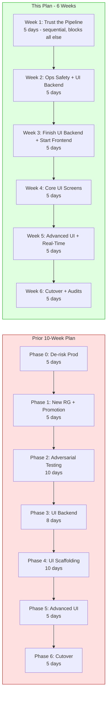
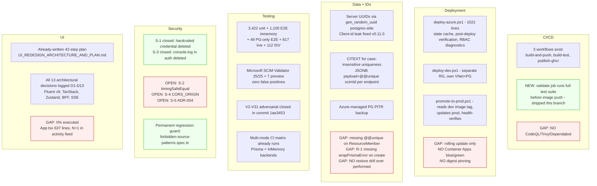
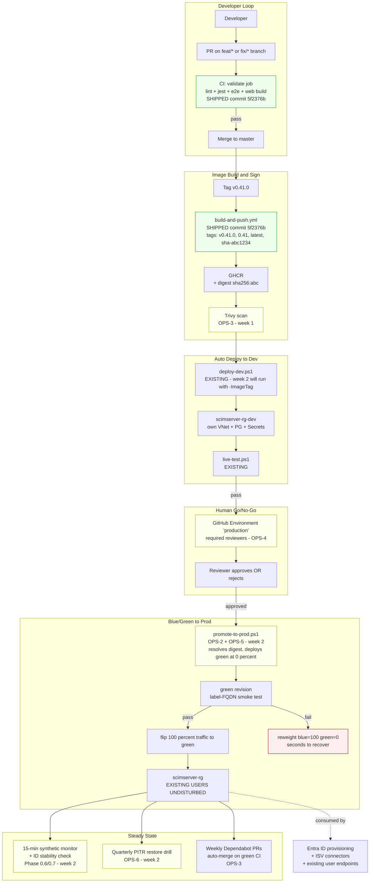
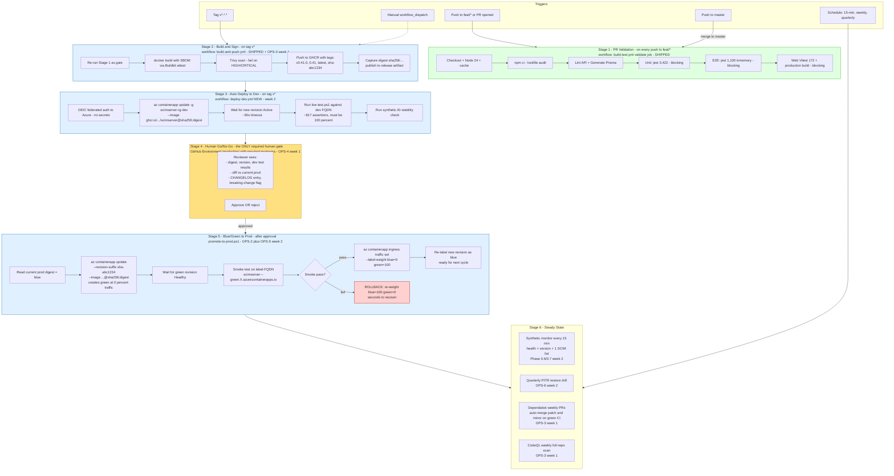
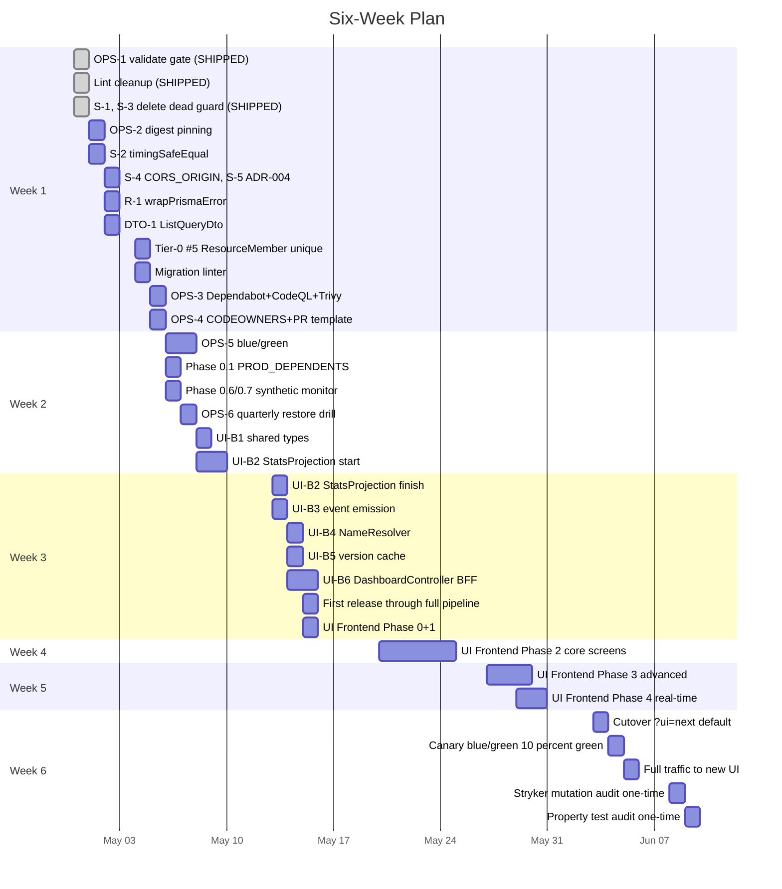
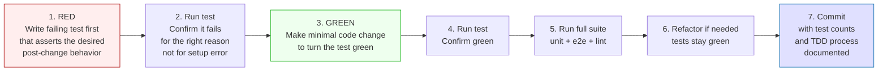

# Delivery Plan - Production Hardening + UI Redesign

> **Status:** Active | **Last Updated:** 2026-04-30 | **Branch:** `ci/validate-before-push` (active) - target merge to `feat/ui` then `master`  
> **Version:** v0.40.0 (current) - target v0.42.0 at end of plan  
> **Total scope:** ~30 engineering days across 6 calendar weeks for one engineer  
> **Approach:** TDD red-green-refactor for every behavioral change, named-defect-driven for ops/CI work

---

## Table of Contents

1. [Plan Origin and What Changed](#1-plan-origin-and-what-changed)
2. [Reality Assessment by Dimension](#2-reality-assessment-by-dimension)
3. [Named Defect Inventory](#3-named-defect-inventory)
4. [Target Operating Model](#4-target-operating-model)
5. [Fully Automated CI/CD Pipeline](#5-fully-automated-cicd-pipeline)
6. [Six-Week Sequencing](#6-six-week-sequencing)
   - [6.1 Week 1: Trust the Pipeline](#61-week-1-trust-the-pipeline)
   - [6.2 Week 2: Operational Safety + UI Backend Start](#62-week-2-operational-safety--ui-backend-start)
   - [6.3 Week 3: Finish UI Backend + Start UI Frontend](#63-week-3-finish-ui-backend--start-ui-frontend)
   - [6.4 Week 4: Core UI Screens](#64-week-4-core-ui-screens)
   - [6.5 Week 5: Advanced UI + Real-Time](#65-week-5-advanced-ui--real-time)
   - [6.6 Week 6: Cutover + One-Time Audits](#66-week-6-cutover--one-time-audits)
7. [TDD Process Rules](#7-tdd-process-rules)
8. [Cross-Cutting Standing Rules](#8-cross-cutting-standing-rules)
9. [Risk Map](#9-risk-map)
10. [Explicit Non-Goals](#10-explicit-non-goals)
11. [Progress Log](#11-progress-log)
12. [References](#12-references)

---

## 1. Plan Origin and What Changed

This plan is the **third iteration** of session deliberations. The first two over-budgeted operational safety work and treated this codebase as if it were greenfield. The corrected plan is calibrated to the actual v0.40.0 system.

### 1.1 What the prior plan got wrong

| Prior assumption | Reality on disk | Correction |
|---|---|---|
| "We need Phase 0 to de-risk prod (5 days)" | Already 100% RFC compliant, 5,274 tests passing, post-mortem on April 16 outage already root-caused and fixed (Prisma pool, UUID guard) | Drop generic "de-risk" - target the *named* sharp edges only |
| "Build adversarial testing baseline (10 days)" | V2-V31 adversarial gap closure already shipped in commit 1ae3453, SchemaValidator hardened to 1,467 LoC, Microsoft SCIM Validator 25/25 + 7 preview, zero false positives | Keep only Stryker + property-test as one-time audits |
| "New dev RG + image promotion pipeline (5 days)" | [scripts/deploy-dev.ps1](../scripts/deploy-dev.ps1) and [scripts/promote-to-prod.ps1](../scripts/promote-to-prod.ps1) already exist with state caching, secret reuse, RBAC diagnostics, post-deploy verification | 1 day to run + upgrade to digest pinning + blue/green |
| "Verify backups (highest-ROI hour)" | Generic ops hygiene; the actual data-loss vectors are R-1 (missing wrapPrismaError) and DTO-1 (unbounded ListQueryDto.filter) | Fix the *named* defects, not abstract ops items |
| "ID stability is the keystone constraint" | UUIDs server-assigned via `gen_random_uuid()` postgres-side, client-id leak fixed v0.11.0 | One synthetic monitor (~50 LoC), not a phase |
| "10 weeks, 48 engineering days" | Real work is 17 engineering days for security/ops + 13 days for UI = 30 days, parallelizable to 6 calendar weeks | Compress to 6 weeks |

### 1.2 The meta-failure

Both prior plans produced **new plans instead of executing the two excellent plans already on disk**:
- [docs/UI_REDESIGN_ARCHITECTURE_AND_PLAN.md](UI_REDESIGN_ARCHITECTURE_AND_PLAN.md) Section 13 - 42 steps, 9-14 days (UI side)
- [docs/DESIGN_IMPROVEMENT_DEEP_ANALYSIS.md](DESIGN_IMPROVEMENT_DEEP_ANALYSIS.md) Section 17 - 25 prioritized items, Tier 0-4

This document is **the third artifact** only because it answers a question those don't: how do CI/CD, dev/prod topology, ID stability, blue/green, and the UI redesign integrate into one operating model with one execution sequence.

---

## 2. Reality Assessment by Dimension

### 2.1 What "fully automated CI/CD" actually means

It does not mean "no human." It means **the human's only job is go/no-go on a release**. Every step between *commit* and *production traffic* is mechanical, idempotent, and gated by tests rather than by judgement. Human approval inserts only at deliberate gates (Stage 4 below).

---

## 3. Named Defect Inventory

Each defect: ID, file path with line, severity, hours, "done when". No grouping into vague phases.

### 3.1 Closed (this branch)

| ID | File | Closed in commit | How |
|---|---|---|---|
| **OPS-1** | [.github/workflows/build-and-push.yml](../.github/workflows/build-and-push.yml), [.github/workflows/build-test.yml](../.github/workflows/build-test.yml) | `5f2376b` | `validate` job gates image push on full test suite |
| **Lint debt** | 21 source files | `1a22771` | All 58 pre-existing lint errors closed; `continue-on-error` removed |
| **S-1** | `api/src/auth/scim-auth.guard.ts` (deleted) | `ef9673b` | Dead guard with hardcoded `S@g@r!2011` deleted via TDD |
| **S-3** | `api/src/auth/scim-auth.guard.ts` (deleted) | `ef9673b` | 5 `console.log`/`console.error` calls in auth path deleted with the guard |
| **S-2** | [api/src/modules/auth/shared-secret.guard.ts](../api/src/modules/auth/shared-secret.guard.ts), [api/src/oauth/oauth.service.ts](../api/src/oauth/oauth.service.ts) | `bf9ab73` | `safeCompare()` helper using `crypto.timingSafeEqual()`; 14 unit tests; +1 OAuth length-mismatch test; permanent regression guards |
| **R-1** | [api/src/infrastructure/repositories/prisma/prisma-user.repository.ts](../api/src/infrastructure/repositories/prisma/prisma-user.repository.ts) (and Group, Generic) | `1a475e2` | Audit was stale - all 3 Prisma `create()` calls already wrapped with `wrapPrismaError`. Added race-condition E2E regression guard in `edge-cases.e2e-spec.ts`. |
| **DTO-1** | [api/src/modules/scim/filters/scim-filter-parser.ts](../api/src/modules/scim/filters/scim-filter-parser.ts) | `96d9b74` | New exported `MAX_FILTER_LENGTH = 10000` enforced at parser entry point. Unit + E2E regression guards. |
| **Tier-0 #5** | [api/prisma/schema.prisma](../api/prisma/schema.prisma) + new migration | (this commit) | `@@unique([groupResourceId, value])` (SCIM identifies a member by `value`, always populated; `memberResourceId` is nullable). Migration `20260430120000_resource_member_unique_value` deduplicates existing rows BEFORE applying constraint (additive-safe). Service-layer dedupe added in `resolveMemberInputs()` so the DB constraint never fires from API input - it is defense-in-depth against direct DB writes / repo bugs. New `required-schema-constraints.spec.ts` plus 2 E2E dedupe tests in `edge-cases.e2e-spec.ts`. |

### 3.2 Open - Tier 0 (Week 1 Day 3-4)

| ID | File | Severity | Hours | Done when |
|---|---|---|---|---|
| **S-4** | [api/src/main.ts#L48](../api/src/main.ts) | MEDIUM | 2 | `origin: process.env.CORS_ORIGIN?.split(',') ?? false`; E2E test rejects from disallowed origin |
| **S-5** | [api/src/main.ts#L88](../api/src/main.ts) | MEDIUM | 1 | ADR-004 written documenting decision (recommend keep with mitigation) |

### 3.3 Open - Operational (Week 1 Day 5 + Week 2)

| ID | What | Hours | Done when |
|---|---|---|---|
| **OPS-2** | Digest pinning in [scripts/promote-to-prod.ps1](../scripts/promote-to-prod.ps1) | 2 | Prod uses `image@sha256:...` not mutable `:tag` |
| **OPS-3** | `.github/dependabot.yml` + CodeQL workflow + Trivy on built image | 8 | First Dependabot PR appears, CodeQL runs, Trivy fails build on HIGH/CRITICAL CVE |
| **OPS-4** | `.github/CODEOWNERS` + `.github/pull_request_template.md` with checklist | 1 | New PR shows checklist as template |
| **OPS-5** | [infra/containerapp.bicep](../infra/containerapp.bicep) `revisionsMode: 'multiple'` + blue/green logic in [scripts/promote-to-prod.ps1](../scripts/promote-to-prod.ps1) | 8 | New revision deployed at 0% traffic, smoke-tested on label-FQDN, flipped to 100%; rollback drill confirmed |
| **OPS-6** | `.github/workflows/quarterly-restore-drill.yml` | 4 | Scheduled cron restores PITR snapshot into dev RG, runs live-test, deletes |

### 3.4 Open - Operational (Week 2 Day 1-2)

| ID | What | Hours | Done when |
|---|---|---|---|
| **Phase 0.1** | Inventory dependents in `docs/PROD_DEPENDENTS.md` | 0.5 | Doc lists every external caller of current Azure URL |
| **Phase 0.6/0.7** | `.github/workflows/synthetic-monitor.yml` every 15 min | 1 | GHA cron hits `/health`, `/scim/admin/version`, asserts known endpoint+user IDs return 200; failure auto-creates GitHub issue |

### 3.5 Open - UI Backend BFF (Weeks 2-3)

| ID | What | Hours | Done when |
|---|---|---|---|
| **UI-B1** | `api/src/shared/types/dashboard.types.ts` + Vite alias `@scim/types` | 4 | `tsc --noEmit` passes in `api` and `web` |
| **UI-B2** | `api/src/modules/stats/stats-projection.service.ts` + `EventEmitter2` wiring + 15-20 unit tests | 12 | Counter increments observable in test; 60s reconciliation tested |
| **UI-B3** | Event emission from existing 3 SCIM services (after-commit only) | 4 | Existing E2E remains green; new test verifies emit-after-commit |
| **UI-B4** | `api/src/modules/stats/name-resolver.service.ts` (DataLoader-style + LRU 1000/5min) + 10 unit tests | 8 | Activity feed render with 50 logs makes ≤2 DB queries (verified via Prisma query log) |
| **UI-B5** | Cache version info in [admin.controller.ts](../api/src/modules/scim/controllers/admin.controller.ts) at module init | 0.5 | Per-request FS read of `package.json` and `/proc/self/cgroup` removed |
| **UI-B6** | `api/src/modules/dashboard/dashboard.controller.ts` BFF + spec + 8 E2E tests | 8 | `GET /admin/dashboard` returns aggregated response in p95 < 100ms with 0 DB queries |

### 3.6 Open - UI Frontend (Weeks 3-6)

Per [docs/UI_REDESIGN_ARCHITECTURE_AND_PLAN.md §13](UI_REDESIGN_ARCHITECTURE_AND_PLAN.md), executed verbatim. Phases 0-5, 42 steps, 9-14 days. Tracked in this doc as Weeks 3-6.

### 3.7 Backlog - Tier 1-3 (post-cutover)

Per [docs/DESIGN_IMPROVEMENT_DEEP_ANALYSIS.md §17](DESIGN_IMPROVEMENT_DEEP_ANALYSIS.md). Real but **not blocking** for the UI redesign or any user-facing feature. Schedule opportunistically.

| Item | Effort | Why deferred |
|---|---|---|
| Parameterize ScimSchemaHelpers (~350 LoC dedup) | 4h | Reduces friction for future features, blocks nothing |
| Split SchemaValidator (1,467 LoC -> 4 classes) | 6h | Reduces cognitive load, no functional change |
| Extract BaseScimController (~240 LoC dedup) | 3h | Same |
| Split scim-service-helpers (1,230 LoC -> 5 modules) | 3h | Same |
| Move OAuthModule under modules/ | 1h | Nav consistency only |
| Add NOT-filter Prisma push-down | 2h | Performance only - currently falls back to in-memory eval |

---

## 4. Target Operating Model

Legend: green = shipped; yellow = scheduled in this plan; red = failure path with documented rollback.

---

## 5. Fully Automated CI/CD Pipeline

### 5.1 What "fully automated" buys you

| Property | How it's enforced |
|---|---|
| **Provenance**: every byte in prod traces to a commit SHA | Stage 2 captures digest; Stage 3-5 deploy by digest |
| **Tamper-evidence**: no one can re-push a tag and silently change prod | Digest pinning (OPS-2) |
| **Test-before-prod**: prod never sees an untested image | Stage 1 gate at PR + Stage 2 gate at build (SHIPPED) |
| **Test-in-prod-environment-but-not-production-traffic** | Stage 5 green at 0% traffic, label-FQDN smoke (OPS-5) |
| **Seconds-to-rollback** | Stage 5 fail-path is one CLI call; old revision still running |
| **Drift detection** | Stage 6 synthetic; PITR drill; weekly CodeQL |
| **Supply-chain alerting** | Trivy at build, CodeQL weekly, Dependabot weekly (OPS-3) |
| **No long-lived cloud secrets in CI** | Azure OIDC federation, GitHub OIDC for cosign |
| **Reproducibility** | npm `ci` + lockfile, multi-stage Dockerfile, SBOM in image manifest |

### 5.2 What you keep from the existing system

| Existing | Reused as |
|---|---|
| [scripts/deploy-azure.ps1](../scripts/deploy-azure.ps1) (1021 lines) | Used by Stage 3 and Stage 5 - no rewrite |
| [scripts/deploy-dev.ps1](../scripts/deploy-dev.ps1) | Wrapped by Stage 3 |
| [scripts/promote-to-prod.ps1](../scripts/promote-to-prod.ps1) | Upgraded with digest-pinning + blue/green logic, called by Stage 5 |
| [scripts/live-test.ps1](../scripts/live-test.ps1) | Called by Stage 3 and Stage 5 smoke |
| 11 Prisma migrations + `prisma migrate deploy` at container start | Unchanged - additive-only convention enforced by PR template + custom CI rule (Tier-3 backlog) |

---

## 6. Six-Week Sequencing

### 6.1 Week 1: Trust the Pipeline

**Goal**: every commit going forward runs through real tests; production deploys require human approval; 8 named defects closed; supply chain monitored.

| Day | Task | Status |
|---|---|---|
| 1 | OPS-1 validate gate | ✅ SHIPPED `5f2376b` |
| 1 | Lint cleanup (58 errors -> 0) | ✅ SHIPPED `1a22771` |
| 2 | S-1, S-3 delete dead ScimAuthGuard | ✅ SHIPPED `ef9673b` |
| 2 | OPS-2 digest pinning in promote-to-prod | Open |
| 2 | S-2 timingSafeEqual | Open |
| 3 | S-4 CORS_ORIGIN env var | Open |
| 3 | S-5 ADR-004 enableImplicitConversion decision | Open |
| 3 | R-1 wrapPrismaError on create() in 3 Prisma repos | Open |
| 4 | DTO-1 harden ListQueryDto | Open |
| 4 | Tier-0 #5 ResourceMember `@@unique` + migration | Open |
| 4 | Migration linter in CI | Open |
| 5 | OPS-3 Dependabot + CodeQL + Trivy | Open |
| 5 | OPS-4 CODEOWNERS + PR template | Open |

**End-of-week state**: every commit gated by full test suite; image push gated by tests; prod deploys gated by human approval; defenses in depth for credentials, type confusion, race conditions, oversized inputs; CVE alerting active; PR checklist enforced.

### 6.2 Week 2: Operational Safety + UI Backend Start

**Goal**: production deploys go via blue/green with seconds-to-rollback; synthetic monitoring catches regressions within 15 minutes; UI backend half-built.

| Day | Track A (ops) | Track B (UI backend) |
|---|---|---|
| 1-2 | OPS-5 blue/green via Container Apps `revisionsMode: multiple` | UI-B1 + UI-B2 (start) shared types + StatsProjection |
| 2 | Phase 0.1 PROD_DEPENDENTS.md + Phase 0.6/0.7 synthetic monitor | UI-B2 (continue) |
| 3 | OPS-6 quarterly PITR restore drill workflow | UI-B2 (finish) + UI-B3 event emission |
| 4-5 | (Track A done; engineer focuses on Track B) | UI-B4 NameResolver + 10 unit tests |

### 6.3 Week 3: Finish UI Backend + Start UI Frontend

**Goal**: BFF endpoints live in prod; UI frontend scaffolding ready behind `?ui=next` flag.

| Day | Task |
|---|---|
| 1 | UI-B5 version info caching (10 LoC) |
| 1-2 | UI-B6 DashboardController + 8 E2E |
| 3 | First release `v0.41.0` through entire pipeline (build → dev → live-test → approval → blue/green prod) |
| 3-5 | UI Frontend Phase 0 (deps, design system, MSW, axe, Lost Pixel) + Phase 1 (AppShell, Sidebar, Header, router, `?ui=next` flag) |

This is the **first time the entire pipeline runs end-to-end with a real feature**. Confirms all gates fire.

### 6.4 Week 4: Core UI Screens

Execute [UI_REDESIGN §13 Phase 2](UI_REDESIGN_ARCHITECTURE_AND_PLAN.md) verbatim:

| Day | Step |
|---|---|
| 1 | DashboardPage (KPI cards, sparkline, recent activity) |
| 2 | EndpointsPage (card grid with live status) |
| 3 | EndpointDetailLayout + tab bar + breadcrumbs |
| 3-4 | UsersTab + GroupsTab (DataGrid + DetailDrawer + JsonTreeViewer) |
| 5 | LogsTab + ActivityTab (filterable + drawer pattern) |

Each step adds: MSW handlers, axe-core check, 1-2 unit tests, 1 integration test. Bundle size budget enforced via `size-limit`.

### 6.5 Week 5: Advanced UI + Real-Time

Execute [UI_REDESIGN §13 Phase 3-4](UI_REDESIGN_ARCHITECTURE_AND_PLAN.md):

| Day | Step |
|---|---|
| 1 | SettingsTab + CredentialsTab (mutation pattern) |
| 2 | SchemasTab + ManualProvision + GlobalLogsPage |
| 3 | CommandPalette (`cmdk` Cmd+K) |
| 4 | SSE → TanStack Query invalidation |
| 5 | Optimistic mutations + keyboard shortcuts + visual polish (skeletons, transitions, empty states) |

### 6.6 Week 6: Cutover + One-Time Audits

| Day | Task | Mechanism |
|---|---|---|
| 1 | Make `?ui=next` default; preserve `?ui=legacy` for one release cycle | Tag `v0.42.0`, deploy through pipeline |
| 2 | Canary via blue/green: split 10% traffic to new UI, soak 24h, monitor watching | `az containerapp ingress traffic set --label-weight blue=90 green=10` |
| 3 | If green clean, flip 100% traffic | `--label-weight blue=0 green=100` |
| 4 | Stryker mutation audit (one-time) | Run on `users` + `groups` modules, fix top survivors, record score in [PROJECT_HEALTH_AND_STATS.md](PROJECT_HEALTH_AND_STATS.md) |
| 5 | Property-test audit (one-time) | Add fast-check to filter parser + PATCH path resolver, fix any findings |

**Backlog after Week 6**: Tier 1-3 architectural cleanup (opportunistic). Remove `?ui=legacy` flag in `v0.43.0` (one release later, after no one has used it).

---

## 7. TDD Process Rules

Every behavioral change in this plan follows strict red-green-refactor:

### 7.1 Examples from this branch

| Defect | RED test | GREEN action | Result |
|---|---|---|---|
| **S-1, S-3** | `forbidden-source-patterns.spec.ts` (constructed needles at runtime) | `git rm api/src/auth/scim-auth.guard{.ts,.spec.ts}` | 2/2 fail → 2/2 pass; permanent regression guard remains |

### 7.2 TDD shape for upcoming defects

| Defect | RED test shape |
|---|---|
| **S-2** | Unit test that asserts `safeCompare('a', 'b')` returns false without throwing on length mismatch; spy verifies `crypto.timingSafeEqual` is called for equal-length input |
| **R-1** | E2E that POSTs same `userName` twice concurrently (Promise.all); asserts results = `[201, 409]` not `[201, 500]` |
| **DTO-1** | E2E that GETs list endpoint with 11 KB filter query string; asserts 400 with SCIM `invalidFilter` scimType |
| **Tier-0 #5** | E2E that POSTs same group member twice; asserts second returns 409 |
| **OPS-2** | Pester test asserting promote script outputs `image@sha256:...` not `image:tag` |

### 7.3 Why TDD here

For a v0.40.0 production system with 5,274 existing tests, TDD is not about driving design - it's about **never shipping a regression**. Each red test becomes a permanent fence. The `forbidden-source-patterns.spec.ts` pattern is particularly powerful: it converts "we deleted this dead code" into "this dead code can never come back."

---

## 8. Cross-Cutting Standing Rules

These apply to every commit and are enforced via [.github/copilot-instructions.md](../.github/copilot-instructions.md), CI gates, and PR template.

| Rule | Mechanism |
|---|---|
| No em-dash anywhere in any file | Pre-commit `Select-String -Pattern ([char]0x2014)`; would be enforced by PR template (OPS-4) |
| Image built once, promoted by digest | OPS-2 in `promote-to-prod.ps1` |
| Migrations additive-only (expand-contract for everything else) | Migration linter in CI (Week 1 Day 4) |
| Every deploy runs ID stability check post-deploy | Synthetic monitor + Stage 3 live-test |
| No `git commit --amend` on pushed history | Documented + enforced by reviewers |
| Feature work flag-gated by default | Code review checklist in PR template |
| Doc freshness audit before each major commit | Standing prompt invocation |
| Feature commit = unit + e2e + live + doc + INDEX + CHANGELOG + Session_starter | PR checklist (OPS-4) |

---

## 9. Risk Map

| Phase | Top risk | Mitigation already built into the plan |
|---|---|---|
| Week 1 | A defect fix breaks behavior nobody tested | TDD red test first; fail loud and immediate; full suite re-run before commit |
| Week 1 | Migration linter flags a legitimate change | `ALLOW_DESTRUCTIVE_MIGRATION` env override with PR-description requirement |
| Week 2 | Blue/green deploy itself has a bug that misroutes prod traffic | First exercise on dev RG; documented rollback drill; manual approval still required |
| Week 2 | StatsProjection drifts from DB over time | Periodic 60s reconciliation from authoritative repos |
| Week 2 | Event emission inside a transaction breaks transaction semantics | Tests cover emit-after-commit-only; explicit code comments |
| Weeks 3-5 | Bundle size exceeds budget | `size-limit` blocks PR; chunk strategy adjusted |
| Weeks 3-5 | Old UI breaks during shared changes | E2E suite still exercises old UI; flag ensures default unchanged |
| Week 6 | Cutover causes user-visible regression | `?ui=legacy` flag preserved one release cycle; rollback is a flag flip + traffic re-weight |

---

## 10. Explicit Non-Goals

These are intentionally **NOT** in this plan and represent decisions to remove from prior plans:

| Removed item | Why |
|---|---|
| Generic "verify backups exist" | Azure-managed PG PITR is already configured by [scripts/deploy-azure.ps1](../scripts/deploy-azure.ps1) with 7-day retention; what was missing is the **restore drill**, captured as OPS-6 |
| `pg_dump --schema-only` baseline file for drift detection | Drift detection is what `prisma migrate status` does; the 11 numbered migrations are the canonical schema source; a parallel baseline file creates two sources of truth |
| Recurring ID-snapshot CSV | Goes stale within hours; the synthetic monitor with known-good IDs is the durable mechanism |
| Schemathesis OpenAPI fuzzing | Microsoft SCIM Validator (25/25 + 7 preview, zero false positives) is a stronger SCIM-specific equivalent already in use |
| Differential test rig (inmemory vs prisma) | Already exists in spirit - the multi-mode CI matrix runs the same tests against both backends ([Session_starter.md](../Session_starter.md) 2026-03-03 entry) |
| Round-trip / idempotency / pagination property tests | Already covered at unit + E2E + live levels |
| Architecture rules via dependency-cruiser | The audit in [DESIGN_IMPROVEMENT_DEEP_ANALYSIS.md §16](DESIGN_IMPROVEMENT_DEEP_ANALYSIS.md) already enumerates patterns and violations by hand; tooling enforcement adds value only after the Tier 1 refactors |
| Type-level tests via `tsd` | `tsc --noEmit` with `strict: true` (rated 95% in audit §19) covers this; tsd is for libraries, not workspace apps |
| Doc-as-test code-block extraction | Heavier infrastructure than payoff; replaced by the lighter "documented response contract" pattern in the existing feature commit checklist |
| OpenTelemetry instrumentation | Existing observability is mature (LOGGING_AND_OBSERVABILITY.md v4.0); OTel as parallel system adds complexity without near-term ROI; defer |
| Seed-script production guard | No `prisma/seed/*` directory exists in this repo; guards for non-existent surfaces are theater |
| 10-week phased program | Real work is 30 engineering days, parallelizable to 6 calendar weeks |
| "Ask Claude to be careful with data" as the data-preservation guarantee | Replaced by 5-layer defense in depth: (1) PR template checklist, (2) migration linter, (3) digest pinning, (4) blue/green deploy, (5) synthetic monitor + restore drill |
| Big-bang UI cutover | Every step independently reversible via `?ui=next` flag, then `?ui=legacy` for one release cycle |
| Boil-the-ocean tooling adoption (Bazel, K8s, service mesh, Redis) | All valid in some context; none urgent here |

---

## 11. Progress Log

| Date | Item | Commit | Status |
|---|---|---|---|
| 2026-04-30 | OPS-1: validate job gates image push | `5f2376b` | ✅ Shipped on `ci/validate-before-push` |
| 2026-04-30 | Lint cleanup: 58 errors -> 0; remove `continue-on-error` | `1a22771` | ✅ Shipped on `ci/validate-before-push` |
| 2026-04-30 | S-1, S-3: delete dead `ScimAuthGuard` via TDD; add permanent regression guard | `ef9673b` | ✅ Shipped on `ci/validate-before-push` |
| 2026-04-30 | DELIVERY_PLAN.md: consolidated 6-week execution plan | `b014c32` | ✅ Shipped on `ci/validate-before-push` |
| 2026-04-30 | S-2: timing-safe token comparison via shared `safeCompare()` (TDD) | `bf9ab73` | ✅ Shipped on `ci/validate-before-push` |
| 2026-04-30 | R-1: race-condition E2E regression guard (impl already present from prior work) | `1a475e2` | ✅ Shipped on `ci/validate-before-push` |
| 2026-04-30 | DTO-1: filter length cap at parser entry point + unit + E2E regression guards (TDD) | `96d9b74` | ✅ Shipped on `ci/validate-before-push` |
| 2026-04-30 | Tier-0 #5: ResourceMember `@@unique([groupResourceId, value])` + dedupe-then-constrain migration + service-layer dedupe + 2 E2E + schema-constraint regression spec (TDD) | `03ac00f` | ✅ Shipped on `ci/validate-before-push` |
| 2026-04-30 | S-4: configurable CORS via `parseCorsOrigin(process.env.CORS_ORIGIN)` + 13 unit tests + Bicep `corsOrigin` param + regression guard for `origin: true` literal (TDD) | `a0d590d` | ✅ Shipped on `ci/validate-before-push` |
| 2026-04-30 | S-5: ADR-004 documented decision to keep `enableImplicitConversion: true` with explicit mitigations; new `mustBePresent: true` regression-spec mode locks the decision in source | `4e9860f` | ✅ Shipped on `ci/validate-before-push` |
| 2026-04-30 | Migration linter: scans Prisma SQL for DROP/RENAME/ALTER COLUMN TYPE/INSERT SELECT FROM; SHA-256 baseline for 4 historical destructives; 19 unit tests; wired into both CI workflows (TDD) | (this commit) | ✅ Shipped on `ci/validate-before-push` |
| 2026-04-30 | OPS-4: CODEOWNERS + pull_request_template.md + 17-test regression spec asserting structural integrity (TDD) | `a7f9fa0` | ✅ Shipped on `ci/validate-before-push` |
| 2026-04-30 | OPS-3: Dependabot (4 ecosystems weekly) + CodeQL (security-extended) + Trivy (HIGH/CRITICAL gating in both build workflows); +13 governance tests (TDD) | `2db07fb` | ✅ Shipped on `ci/validate-before-push` |
| 2026-04-30 | OPS-2: digest pinning in promote-to-prod.ps1 - prod now uses `image@sha256:...` not `image:tag`; 9 source-scan regression tests (TDD) | (this commit) | ✅ Shipped on `ci/validate-before-push` |

**Validation as of 2026-04-30**:
- Unit: 3,515 / 3,515 pass (90 suites; +9 OPS-2 source-scan tests)
- E2E (inmemory): 1,104 / 1,104 pass (52 suites)
- Lint: 0 errors
- Em-dash scan: clean

**Tier-0 closure status**: All 6 Tier-0 security/data items + 4 OPS items (OPS-1, OPS-2, OPS-3, OPS-4) + migration linter shipped. Week 1 of DELIVERY_PLAN complete.

---

## 12. References

### 12.1 Existing planning documents this synthesizes

- [docs/UI_REDESIGN_ARCHITECTURE_AND_PLAN.md](UI_REDESIGN_ARCHITECTURE_AND_PLAN.md) §13 - 42-step UI implementation plan
- [docs/DESIGN_IMPROVEMENT_DEEP_ANALYSIS.md](DESIGN_IMPROVEMENT_DEEP_ANALYSIS.md) §17 - 25 prioritized improvement items, Tier 0-4
- [docs/LOGGING_ERROR_HANDLING_QUALITY_AUDIT.md](LOGGING_ERROR_HANDLING_QUALITY_AUDIT.md) - 20-gap register

### 12.2 Source-of-truth files

- [.github/workflows/build-and-push.yml](../.github/workflows/build-and-push.yml) - tag-triggered build (with validate gate)
- [.github/workflows/build-test.yml](../.github/workflows/build-test.yml) - branch-triggered build (with validate gate)
- [scripts/deploy-azure.ps1](../scripts/deploy-azure.ps1) - core Azure deploy engine
- [scripts/deploy-dev.ps1](../scripts/deploy-dev.ps1) - dev RG provisioning wrapper
- [scripts/promote-to-prod.ps1](../scripts/promote-to-prod.ps1) - dev → prod promotion (to be upgraded with OPS-2 + OPS-5)
- [scripts/live-test.ps1](../scripts/live-test.ps1) - post-deploy live test suite
- [api/src/security/forbidden-source-patterns.spec.ts](../api/src/security/forbidden-source-patterns.spec.ts) - permanent source-pattern regression guard
- [infra/containerapp.bicep](../infra/containerapp.bicep) - Container App template (to be upgraded with `revisionsMode: multiple`)

### 12.3 External references

- [Azure Container Apps blue-green deployment](https://learn.microsoft.com/en-us/azure/container-apps/blue-green-deployment) - native pattern using `revisionsMode: multiple` + label-based traffic split
- [GitHub Environments deployment protection](https://docs.github.com/en/actions/deployment/targeting-different-environments) - required reviewers as gate

### 12.4 Standing rules

- [.github/copilot-instructions.md](../.github/copilot-instructions.md) - feature commit checklist, no em-dash, no amend on pushed history

---

*This document is the consolidated execution plan reconciling the prior 10-week plan with the actual v0.40.0 codebase reality. It should be updated after each commit on the `ci/validate-before-push` branch (and any subsequent branches that follow this plan), with the [Progress Log](#11-progress-log) reflecting cumulative status.*
