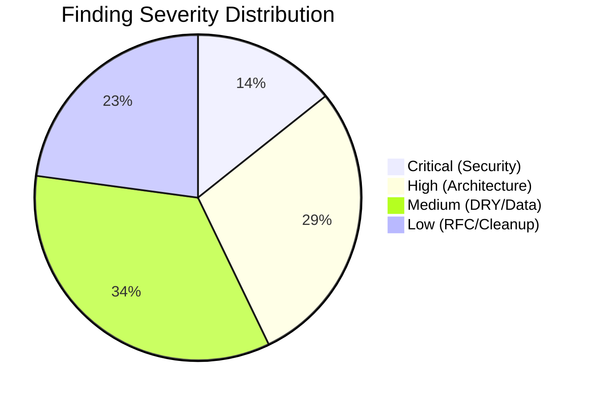
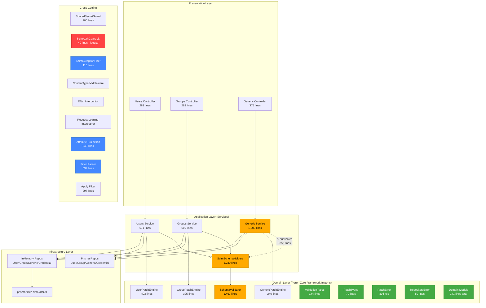
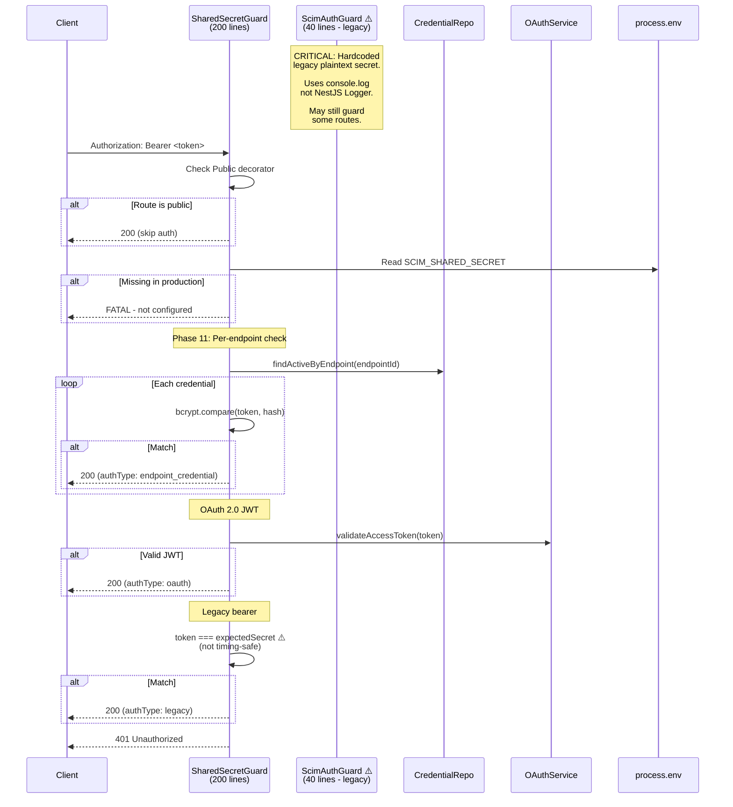
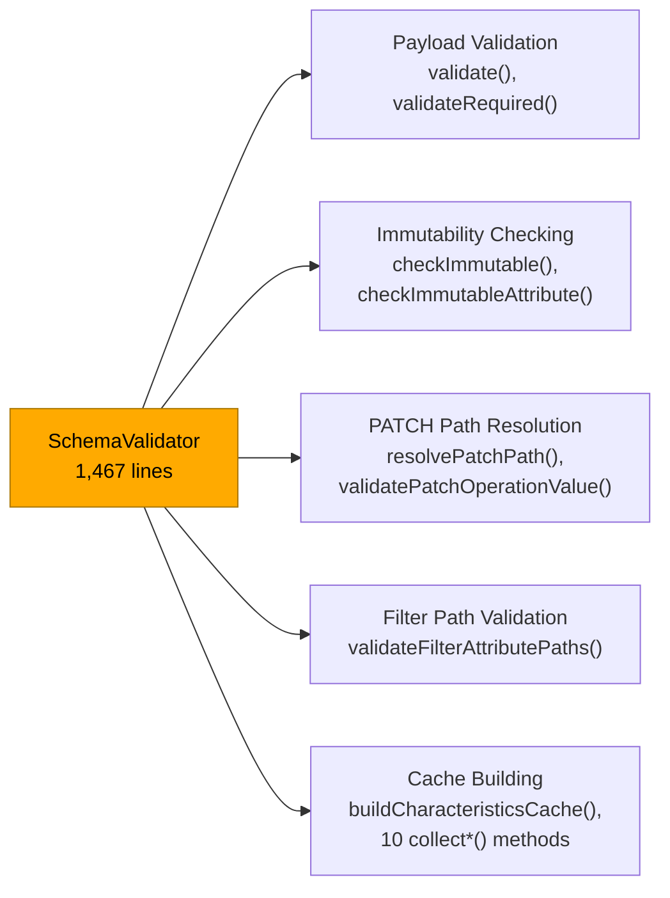
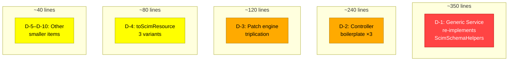
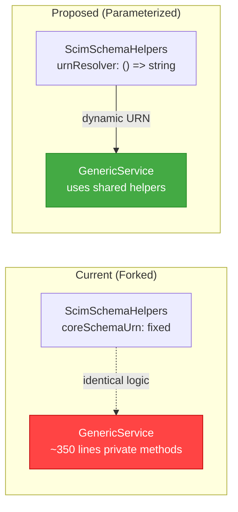
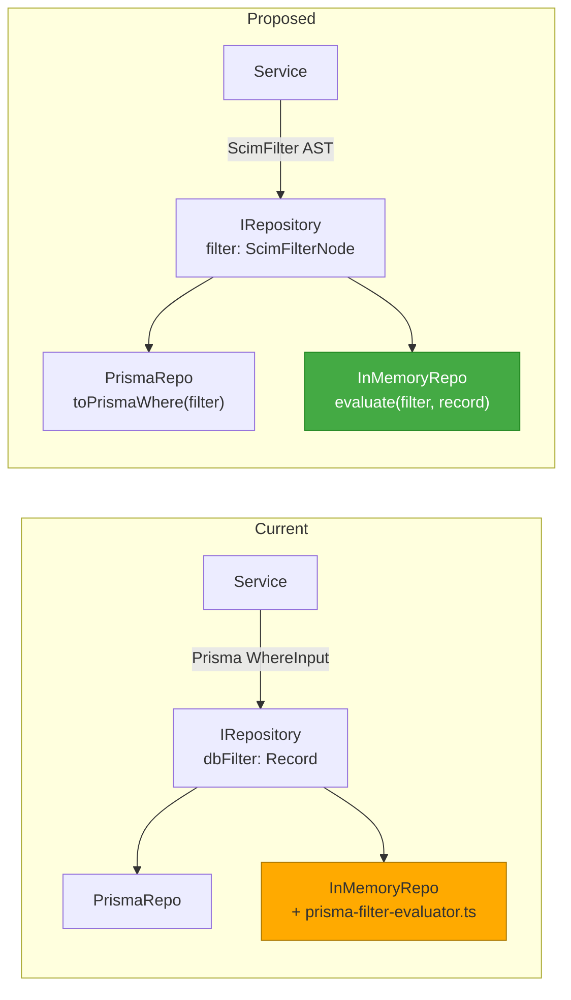
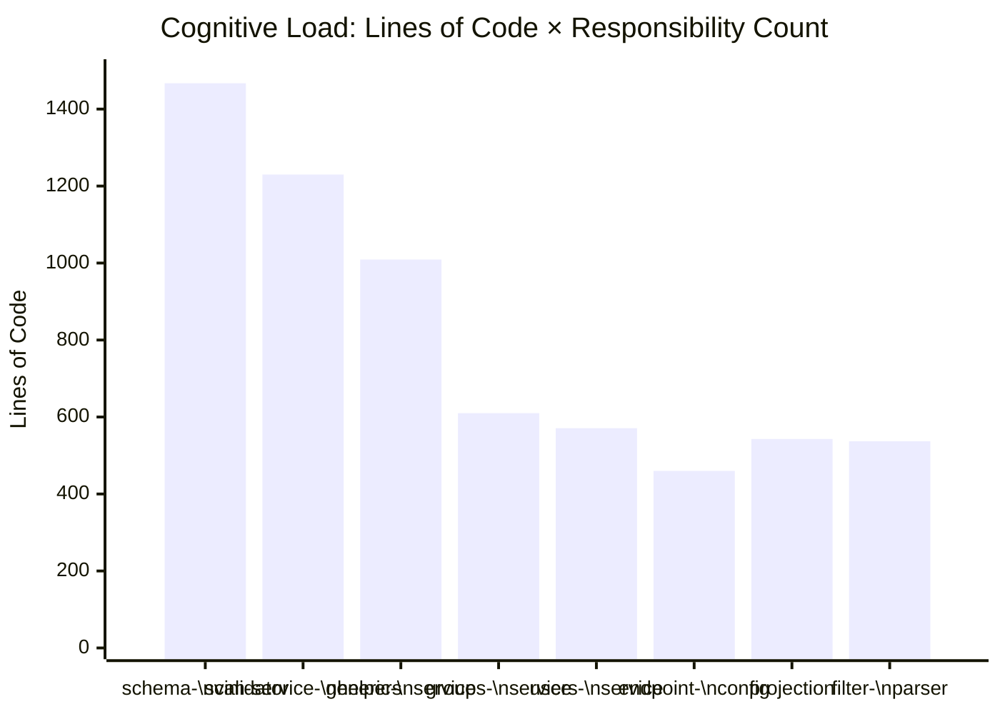
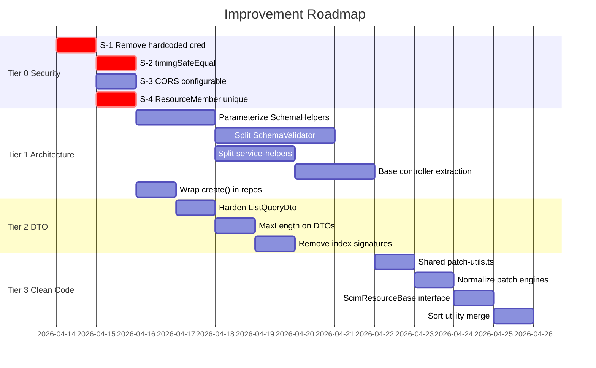

# Design Improvement Deep Analysis - v0.40.0

**Status:** Current | **Last Updated:** 2026-04-28 | **Baseline:** v0.40.0  
**Scope:** Full source-verified audit - architecture, SOLID, DRY, security, RFC compliance, DTO validation, data layer, maintainability  
**RFC References:** RFC 7643 (SCIM Core Schema), RFC 7644 (SCIM Protocol)  
**Test Baseline:** 3,429 unit (84 suites) - 1,149 E2E (54 suites) - ~817 live + 112 Lexmark - ALL PASSING  
**Files Audited:** 60+ source files across all layers  
**Overall Rating:** **B+ (7.5/10)**

---

## Table of Contents

1. [Executive Summary](#1-executive-summary)
2. [Architecture Overview](#2-architecture-overview)
3. [File Inventory & Metrics](#3-file-inventory--metrics)
4. [Security Issues (S1–S5)](#4-security-issues-s1s5)
5. [SOLID Violations (V1–V5)](#5-solid-violations-v1v5)
6. [DRY Violations (D1–D10)](#6-dry-violations-d1d10)
7. [Repository & Data Layer Issues (R1–R5)](#7-repository--data-layer-issues-r1r5)
8. [DTO Validation Gaps (DTO1–DTO5)](#8-dto-validation-gaps-dto1dto5)
9. [RFC Compliance Gaps (RFC1–RFC4)](#9-rfc-compliance-gaps-rfc1rfc4)
10. [Auth Module Design Review](#10-auth-module-design-review)
11. [Patch Engine Architecture Review](#11-patch-engine-architecture-review)
12. [Filter Engine Assessment](#12-filter-engine-assessment)
13. [Prisma Schema & Data Integrity](#13-prisma-schema--data-integrity)
14. [TypeScript & Build Configuration](#14-typescript--build-configuration)
15. [Testing Architecture Assessment](#15-testing-architecture-assessment)
16. [Maintainability & Understandability](#16-maintainability--understandability)
17. [Prioritized Improvement Roadmap](#17-prioritized-improvement-roadmap)
18. [Architecture Decision Records (Proposed)](#18-architecture-decision-records-proposed)
19. [Scorecard](#19-scorecard)

---

## 1. Executive Summary

SCIMServer demonstrates strong domain-driven architecture with impressive RFC 7643/7644 compliance (all 27 G1–G20 migration gaps resolved, 100% SCIM compliance), a pure domain layer with zero NestJS/Prisma coupling, and mature testing discipline (4,900+ total tests across 4 levels). The precomputed schema characteristics cache, typed error hierarchy, and AsyncLocalStorage-based per-request isolation are engineering highlights.

**Key Strengths:**
- Pure domain layer (`schema-validator.ts`, patch engines, models) with zero framework imports
- Schema-driven attribute enforcement - precomputed O(1) cache, zero per-request tree walks
- 3-tier auth cascade with lazy-loaded bcrypt and per-endpoint credential isolation
- Typed error hierarchy (`RepositoryError`, `PatchError`, `createScimError`) with RFC 7644 §3.12 compliance
- Single source of truth for config flags (`ENDPOINT_CONFIG_FLAGS_DEFINITIONS`)

**Key Risks:**
- **Security debt:** Hardcoded credential in legacy guard, no timing-safe comparisons, open CORS
- **Duplication:** ~800–1,000 lines of service/controller/engine duplication across 3 resource types
- **God classes:** `SchemaValidator` (1,467 lines, 15+ static methods), `scim-service-helpers.ts` (1,230 lines)
- **DTO gaps:** `ListQueryDto` (18 lines, no filter length limit) vs `SearchRequestDto` (49 lines, fully hardened)
- **Data integrity:** Missing `@@unique` constraint on `ResourceMember`, missing `wrapPrismaError` on `create()`



---

## 2. Architecture Overview

### 2.1 Layered Architecture



### 2.2 Auth Flow



---

## 3. File Inventory & Metrics

### 3.1 Core Production Files

| Layer | File | Lines | SRP | Notes |
|-------|------|------:|:---:|-------|
| **Entrypoint** | `main.ts` | 92 | ✅ | Open CORS (S-4), `enableImplicitConversion` (S-5) |
| **Auth (Legacy)** | `auth/scim-auth.guard.ts` | 40 | ❌ | **CRITICAL:** Hardcoded credential + console.log |
| **Auth (Modern)** | `modules/auth/shared-secret.guard.ts` | 200 | ✅ | 3-tier auth, proper Logger. Uses `===` not `timingSafeEqual` |
| **OAuth** | `oauth/oauth.service.ts` | 118 | ✅ | `client.clientSecret !== clientSecret` - timing-unsafe |
| **OAuth** | `oauth/oauth.controller.ts` | 89 | ✅ | `TokenRequest` interface - no DTO validation |
| **Validation** | `domain/validation/schema-validator.ts` | 1,467 | ❌ | **God class:** 15+ static methods, 5 responsibilities |
| **Validation** | `domain/validation/validation-types.ts` | 144 | ✅ | 15-field `SchemaCharacteristicsCache` interface |
| **Helpers** | `common/scim-service-helpers.ts` | 1,230 | ❌ | **Swiss army knife:** 10+ concerns in one file |
| **Users Service** | `services/endpoint-scim-users.service.ts` | 571 | ✅ | Clean after G17 dedup |
| **Groups Service** | `services/endpoint-scim-groups.service.ts` | 610 | ✅ | Clean after G17 dedup |
| **Generic Service** | `services/endpoint-scim-generic.service.ts` | 1,009 | ❌ | **~350 lines duplicate** `ScimSchemaHelpers` |
| **Users Controller** | `controllers/endpoint-scim-users.controller.ts` | 283 | ⚠️ | Boilerplate repeated ×3 |
| **Groups Controller** | `controllers/endpoint-scim-groups.controller.ts` | 283 | ⚠️ | Identical to Users controller structure |
| **Generic Controller** | `controllers/endpoint-scim-generic.controller.ts` | 375 | ⚠️ | Same boilerplate + resource type resolution |
| **User Patch** | `domain/patch/user-patch-engine.ts` | 403 | ✅ | Static methods, pure domain |
| **Group Patch** | `domain/patch/group-patch-engine.ts` | 325 | ✅ | Static methods, pure domain |
| **Generic Patch** | `domain/patch/generic-patch-engine.ts` | 240 | ⚠️ | Instance-based ≠ User/Group, re-defines `PatchOperation` |
| **Projection** | `common/scim-attribute-projection.ts` | 543 | ✅ | RFC-compliant, well-focused |
| **Filter Parser** | `filters/scim-filter-parser.ts` | 537 | ✅ | AST-based, depth-guarded, excellent |
| **Filter Pushdown** | `filters/apply-scim-filter.ts` | 297 | ✅ | Partial push, graceful fallback |
| **Exception Filter** | `filters/scim-exception.filter.ts` | 115 | ✅ | RFC 7644 §3.12, auto-enriched diagnostics |
| **Endpoint Config** | `endpoint/endpoint-config.interface.ts` | 460 | ✅ | Single source of truth - but `[key: string]: unknown` |
| **Endpoint Context** | `endpoint/endpoint-context.storage.ts` | 106 | ✅ | Clean `AsyncLocalStorage` isolation |
| **Sort** | `common/scim-sort.util.ts` | 93 | ⚠️ | Two nearly-identical functions |
| **Config Flags** | `common/scim-constants.ts` | 67 | ✅ | Well-organized RFC constants |

### 3.2 Domain Models

| Model | Lines | Shared Fields | Unique Fields |
|-------|------:|:----:|---------------|
| `UserRecord` | 45 | 10 | `userName: string` |
| `GroupRecord` | 54 | 10 | `displayName: string` (required), `MemberRecord[]` |
| `GenericResourceRecord` | 42 | 10 | `resourceType: string` |

> **Common fields** (repeated ×3): `id`, `endpointId`, `scimId`, `externalId`, `active`, `rawPayload`, `version`, `meta`, `createdAt`, `updatedAt`

### 3.3 DTOs

| DTO | Lines | Validators | Findings |
|-----|------:|:---:|----------|
| `CreateUserDto` | 23 | 4 | `[key: string]: unknown` bypass, no `@MaxLength(userName)`, no `@ValidateNested(emails)` |
| `CreateGroupDto` | ~25 | 5 | `@ValidateNested` on members - well done |
| `PatchUserDto` / `PatchGroupDto` | 33 | 6 | `PatchOperationDto.path` has no `@MaxLength` |
| `ListQueryDto` | 18 | 3 | **Dangerously sparse** - no `@MaxLength(filter)`, missing sort/projection params |
| `SearchRequestDto` | 49 | 8 | **Well-hardened** - `@MaxLength`, `@IsIn`, all fields declared |
| `BulkRequestDto` | ~40 | 7 | **Well-hardened** - `@ArrayMaxSize(1000)`, proper nested validation |

---

## 4. Security Issues (S1–S5)

| ID | Severity | File | Line(s) | Issue | RFC | Status |
|----|:--------:|------|------:|-------|-----|:------:|
| **S-1** | 🔴 CRITICAL | `auth/scim-auth.guard.ts` | 7 | Hardcoded credential `S@g@r!2011` in source code history. Any repo reader can authenticate. | - | **Open** |
| **S-2** | 🔴 HIGH | `auth/shared-secret.guard.ts` | 134 | `token === expectedSecret` - timing-attack vulnerable. Same in `oauth.service.ts` L80 (`client.clientSecret !== clientSecret`). Should use `crypto.timingSafeEqual()`. | - | **Open** |
| **S-3** | 🟡 MEDIUM | `auth/scim-auth.guard.ts` | 28–47 | 5× `console.log`/`console.error` in auth path - bypasses structured logging pipeline. Auth events invisible to SSE stream, log download, and audit trail. | - | **Open** |
| **S-4** | 🟡 MEDIUM | `main.ts` | 48 | `origin: true` (Allow all CORS origins). Comment says "for now" - unchanged since v0.3.0 (Sep 2025). Should be configurable via `CORS_ORIGIN` env var. | - | **Open** |
| **S-5** | 🟡 MEDIUM | `main.ts` | 88 | `enableImplicitConversion: true` in `ValidationPipe` - causes `"123"` → `123` type coercion. Combined with DTO index signatures, allows type confusion injection. | - | **Open** |

### S-1 Evidence

```typescript
// api/src/auth/scim-auth.guard.ts - Line 7
@Injectable()
export class ScimAuthGuard implements CanActivate {
  private readonly legacyBearerToken = 'S@g@r!2011';  // ⚠️ PLAINTEXT IN SOURCE
```

### S-2 Recommended Fix

```typescript
// BEFORE (timing-vulnerable):
if (token === expectedSecret) { ... }

// AFTER (timing-safe):
import { timingSafeEqual } from 'node:crypto';

function safeCompare(a: string, b: string): boolean {
  const bufA = Buffer.from(a);
  const bufB = Buffer.from(b);
  if (bufA.length !== bufB.length) return false;
  return timingSafeEqual(bufA, bufB);
}

if (safeCompare(token, expectedSecret)) { ... }
```

---

## 5. SOLID Violations (V1–V5)

### V-1. Single Responsibility - `SchemaValidator` God Class



**Recommendation:** Decompose into 4 focused classes:

| Extracted Class | Methods | Est. Lines |
|-----------------|---------|:----------:|
| `SchemaPayloadValidator` | `validate()`, `validateRequired()`, sub-attribute recursion | ~400 |
| `ImmutabilityChecker` | `checkImmutable()`, `checkImmutableAttribute()`, `checkImmutableMultiValuedComplex()` | ~200 |
| `PatchPathResolver` | `resolvePatchPath()`, `resolveRootAttribute()`, `validatePatchOperationValue()` | ~250 |
| `SchemaCharacteristicsBuilder` | `buildCharacteristicsCache()`, all `collect*()` methods | ~500 |

### V-2. Single Responsibility - `scim-service-helpers.ts` Swiss Army Knife

| Concern | Functions | Lines (est.) |
|---------|-----------|:---:|
| Boolean sanitization | `sanitizeBooleanStringsByParent()`, `coercePatchOpBooleans()` | ~120 |
| ReadOnly stripping | `stripReadOnlyAttributes()`, `stripReadOnlyPatchOps()` | ~180 |
| Returned characteristics | `stripNeverReturnedFromPayload()` | ~80 |
| Schema resolution | `getProfileAwareSchemaDefinitions()`, `getSchemaCache()`, `getAttrMaps()` | ~200 |
| Uniqueness assertion | `assertSchemaUniqueness()` | ~60 |
| Context enrichment | `enrichContext()` | ~30 |
| Error bridging | `handleRepositoryError()` | ~25 |
| Filter validation | `validateFilterPaths()` | ~40 |
| If-Match enforcement | `enforceIfMatch()` | ~30 |
| Class wrapper | `ScimSchemaHelpers` class skeleton | ~100 |

**Recommendation:** Split into focused modules:
- `boolean-sanitizer.ts` - `sanitizeBooleanStringsByParent()`, `coercePatchOpBooleans()`
- `readonly-stripping.ts` - `stripReadOnlyAttributes()`, `stripReadOnlyPatchOps()`
- `returned-characteristics.ts` - `stripNeverReturnedFromPayload()`
- `schema-helpers.ts` - `ScimSchemaHelpers` class, schema resolution, cache access
- `uniqueness-enforcer.ts` - `assertSchemaUniqueness()`

### V-3. Open/Closed - Auth Guard If/Else Chain

`SharedSecretGuard.canActivate()` has a hardcoded sequential `if/else` chain for auth strategies. Adding a new auth method requires modifying the guard body.

**Recommendation:** Strategy pattern:

```typescript
interface IAuthStrategy {
  name: string;
  canHandle(token: string, endpointId?: string): Promise<boolean>;
  authenticate(token: string, request: Request): Promise<AuthResult>;
}

@Injectable()
class CompositeAuthGuard implements CanActivate {
  constructor(@Inject('AUTH_STRATEGIES') private strategies: IAuthStrategy[]) {}

  async canActivate(context: ExecutionContext): Promise<boolean> {
    for (const strategy of this.strategies) {
      if (await strategy.canHandle(token, endpointId)) {
        const result = await strategy.authenticate(token, request);
        if (result.success) return true;
      }
    }
    this.reject(response);
  }
}
```

### V-4. Dependency Inversion - Legacy Guard

`ScimAuthGuard` directly imports and depends on the concrete `OAuthService` class. Should depend on an `IAuthenticationService` interface (if this guard remains at all).

### V-5. Interface Segregation - `SchemaCharacteristicsCache`

`SchemaCharacteristicsCache` (15 properties) is consumed by many callers - each uses only a subset:

| Consumer | Fields Used |
|----------|-------------|
| Boolean coercion | `booleansByParent` |
| ReadOnly stripping | `readOnlyCollected` |
| Returned filtering | `neverReturnedByParent`, `alwaysReturnedByParent`, `requestReturnedByParent` |
| Immutable checking | `immutableByParent`, `coreAttrMap`, `extensionSchemaMap` |
| Uniqueness | `uniqueAttrs` |
| Filter evaluation | `caseExactPaths` |

Breaking into `BooleanCache`, `ReturnedCache`, `MutabilityCache`, `UniquenessCache` would reduce coupling.

---

## 6. DRY Violations (D1–D10)

### 6.1 Summary



### 6.2 Detailed Register

| ID | Severity | Est. Lines | Files | Pattern |
|----|:--------:|:----------:|-------|---------|
| **D-1** | 🔴 HIGH | ~350 | `endpoint-scim-generic.service.ts` vs `scim-service-helpers.ts` | Generic service contains 10 private methods nearly identical to `ScimSchemaHelpers` methods: `enforceStrictSchemaValidation()`, `validatePayloadSchema()`, `coerceBooleanStringsIfEnabled()`, `checkImmutableAttributes()`, `getSchemaCacheForRT()`, `getAttrMapsForRT()`, `buildSchemaDefinitionsFromPayload()`, `validateFilterAttributePaths()`, `getSchemaDefinitions()`, `getBooleansByParentForRT()`. **Root cause:** `ScimSchemaHelpers` was designed with a fixed `coreSchemaUrn` (User/Group); Generic needs a dynamic URN per resource type. Instead of parameterizing, the GenericService forked the logic. |
| **D-2** | 🟡 MEDIUM | ~240 | All 3 controllers | `attachWarnings()` (~15 lines ×3, 100% identical), `validateAndSetContext()` (~15 lines ×3), projection + warning pipeline (~10 lines per write endpoint ×9) |
| **D-3** | 🟡 MEDIUM | ~120 | All 3 patch engines | `DANGEROUS_KEYS` constant (×3), `guardPrototypePollution()` (~10 lines ×2 + inline ×1), op validation loop (×3) |
| **D-4** | 🟡 MEDIUM | ~80 | All 3 services | `toScimUserResource()`, `toScimGroupResource()`, `toScimResponse()` - same skeleton: parse rawPayload → sanitize booleans → strip never-returned → build `schemas[]` → delete reserved keys → merge with DB columns |
| **D-5** | 🟡 MEDIUM | ~40 | All 3 services | `buildExistingPayload()` - reconstruct DB record into SCIM payload for immutable comparison |
| **D-6** | 🟢 LOW | ~36 | All 3 services | 404 guard: check null → log debug → throw `createScimError(404)` - repeated ~12 times |
| **D-7** | 🟢 LOW | ~30 | All 3 services | `PatchError` → `ScimError` translation: identical catch block ×3 |
| **D-8** | 🟢 LOW | ~30 | `scim-sort.util.ts` | `resolveUserSortParams()` and `resolveGroupSortParams()` are structurally identical - only the attribute map differs |
| **D-9** | 🟢 LOW | ~30 | All 3 services | `extractAdditionalAttributes()` - destructure `schemas` and reserved keys from DTO ×2 |
| **D-10** | 🟢 LOW | ~20 | `schema-validator.ts` | Map-building boilerplate `if (preBuiltMaps) { ... } else { build maps }` - repeated 5–6 times |
| | | **~946** | | **Total estimated duplication** |

### 6.3 D-1 Fix Architecture



**Key change:** Refactor `ScimSchemaHelpers` constructor to accept a `urnResolver` callback or a `SchemaContext` object instead of a fixed `coreSchemaUrn`. The Generic service would pass a lambda that resolves URN from the current `ScimResourceType`.

### 6.4 D-2 Fix - Base Controller

```typescript
// Proposed: BaseScimController mixin
abstract class BaseScimController {
  protected attachWarnings(response: Record<string, unknown>, endpointContext: EndpointContextStorage): void {
    const warnings = endpointContext.getWarnings?.();
    if (warnings?.length) {
      response[SCIM_WARNING_EXTENSION_URN] = warnings;
    }
  }

  protected respondWithProjection(
    result: Record<string, unknown>,
    attributes?: string,
    excludedAttributes?: string,
    alwaysByParent?: Map<string, Set<string>>,
    requestByParent?: Map<string, Set<string>>,
  ): Record<string, unknown> {
    // common projection + always-returned + warning logic
    return applyAttributeProjection(result, attributes, excludedAttributes, alwaysByParent, requestByParent);
  }
}
```

---

## 7. Repository & Data Layer Issues (R1–R5)

| ID | Severity | File(s) | Issue | Impact |
|----|:--------:|---------|-------|--------|
| **R-1** | 🔴 HIGH | `prisma/*.repository.ts` | `create()` missing `try/catch` + `wrapPrismaError()`. On P2002 unique-constraint race during concurrent creates, raw `PrismaClientKnownRequestError` escapes → **500 instead of 409**. `update()` and `delete()` correctly wrap errors. | Data integrity |
| **R-2** | 🔴 HIGH | All repo interfaces | **Leaky Prisma filter abstraction** - `dbFilter?: Record<string, unknown>` passes Prisma `WhereInput` shapes through domain interfaces. InMemory repos had to build a 200-line `prisma-filter-evaluator.ts` to emulate Prisma query semantics. | Architecture coupling |
| **R-3** | 🟡 MEDIUM | `prisma-endpoint-credential.repository.ts` | Silent `catch {}` blocks in `findById`, `deactivate`, `delete` - swallow ALL errors including connection failures and permissions errors. Only P2025 (not found) should return null. | Masked failures |
| **R-4** | 🟡 MEDIUM | All Prisma repos | `toUserRecord()`, `toGroupRecord()`, `toGenericRecord()` mapping functions are ~15 lines each with 80% identical structure (same cast pattern + payload stringification). | DRY violation |
| **R-5** | 🟢 LOW | `repository.module.ts` | Static `cachedModule`/`cachedBackend` pattern works but can cause subtle bugs if env vars change during testing without calling `resetCache()`. | Test brittleness |

### R-1 Fix

```typescript
// BEFORE (prisma-user.repository.ts - create):
async create(data: UserCreateInput): Promise<UserRecord> {
  const row = await this.prisma.scimResource.create({ ... });
  return toUserRecord(row);
}

// AFTER:
async create(data: UserCreateInput): Promise<UserRecord> {
  try {
    const row = await this.prisma.scimResource.create({ ... });
    return toUserRecord(row);
  } catch (error) {
    throw wrapPrismaError(error, `create user ${data.scimId}`);
  }
}
```

### R-2 Proposed Fix - Domain Filter Type



---

## 8. DTO Validation Gaps (DTO1–DTO5)

### 8.1 Comparison Matrix: `ListQueryDto` vs `SearchRequestDto`

| Parameter | `SearchRequestDto` (POST .search) | `ListQueryDto` (GET list) | Gap |
|-----------|:---------:|:---------:|:---:|
| `filter` | `@MaxLength(10000)` | **No length limit** | 🔴 |
| `sortBy` | `@MaxLength(200)` | **Not declared** | 🔴 |
| `sortOrder` | `@IsIn(['ascending','descending'])` | **Not declared** | 🔴 |
| `attributes` | `@MaxLength(2000)` | **Not declared** | 🟡 |
| `excludedAttributes` | `@MaxLength(2000)` | **Not declared** | 🟡 |
| `startIndex` | `@IsInt @Min(1)` | `@IsInt @Min(1)` | ✅ |
| `count` | `@IsInt @Min(1)` | `@IsInt @Min(1) @Max(1000)` | ✅ |

> An unbounded `filter` string on GET requests enables memory-based DoS via complex expressions that trigger full-table scan + in-memory evaluation.

### 8.2 Detailed Register

| ID | Severity | DTO | Gap | Recommendation |
|----|:--------:|-----|-----|----------------|
| **DTO-1** | 🔴 HIGH | `ListQueryDto` | No `@MaxLength` on `filter`, missing `sortBy`/`sortOrder`/`attributes`/`excludedAttributes` declarations | Harden to parity with `SearchRequestDto` |
| **DTO-2** | 🟡 MEDIUM | `CreateUserDto` | `[key: string]: unknown` index signature allows arbitrary top-level properties bypassing validation. No `@MaxLength` on `userName`. No `@ValidateNested` on complex attrs (`emails`, `name`, `phoneNumbers`) | Add `@MaxLength(255)` to `userName`, consider `@ValidateNested` for critical sub-objects |
| **DTO-3** | 🟡 MEDIUM | `PatchOperationDto` | `path` has no `@MaxLength` - oversized PATCH paths impact performance | Add `@MaxLength(500)` |
| **DTO-4** | 🟡 MEDIUM | `OAuthController` | `TokenRequest` is a plain interface - no class-validator decorators. `client_secret` could be object/array | Convert to DTO class with `@IsString()` validators |
| **DTO-5** | 🟢 LOW | `PatchOperation` (domain) | `op: string` instead of `'add' \| 'replace' \| 'remove'` union type. Runtime validation exists in DTO but domain type is permissive | Change to union type for compile-time safety |

---

## 9. RFC Compliance Gaps (RFC1–RFC4)

| ID | RFC | Section | Gap | Severity | Notes |
|----|-----|---------|-----|:--------:|-------|
| **RFC-1** | 7644 | §3.4.2.3 | Sort parameters (`sortBy`/`sortOrder`) accepted on GET list as raw `@Query()` strings - bypass DTO validation entirely | 🟢 Low | `SearchRequestDto` validates them; only GET path is unvalidated |
| **RFC-2** | 7644 | §3.12 | Generic service 404 errors inconsistently omit `scimType: 'noTarget'`. Users/Groups always include it. | 🟢 Low | Cosmetic inconsistency |
| **RFC-3** | 7643 | §2.4 | Multi-valued sub-objects (`emails`, `groups`, `addresses`) have no DTO-level structural validation. Accepted blindly. | 🟢 Low | Schema validator catches at service layer |
| **RFC-4** | 7644 | §3.4.2.2 | `NOT` filter expressions not pushed down to Prisma (trigger full-table scan). Prisma supports `{ NOT: {...} }` natively. | 🟢 Low | Correctness not affected - performance only |

---

## 10. Auth Module Design Review

### 10.1 Two Guards - Confusion Risk

| Guard | Location | Routes Protected | Auth Methods | Logging |
|-------|----------|-----------------|--------------|---------|
| `ScimAuthGuard` | `src/auth/` | Some legacy routes (unclear) | Hardcoded token + OAuth JWT | `console.log` ⚠️ |
| `SharedSecretGuard` | `src/modules/auth/` | Endpoint routes (modern) | Per-endpoint bcrypt → OAuth JWT → env secret | Structured `ScimLogger` ✅ |

**Risk:** A new developer cannot determine which guard protects which routes without tracing all module registrations.

**Recommendation:** Consolidate into `SharedSecretGuard`. Delete `ScimAuthGuard` entirely. Migrate any routes still using it.

### 10.2 Positive Patterns

- ✅ `@Public()` decorator for route-level auth bypass
- ✅ Lazy bcrypt loading via `dynamic import` (reduces cold start)
- ✅ Production fail-fast for missing secrets
- ✅ `WWW-Authenticate: Bearer realm="SCIM"` on rejection (RFC 7235 §4.1)
- ✅ JWT token expiration (1hr)
- ✅ Per-endpoint credential isolation with cascade delete

### 10.3 Module Placement Inconsistency

```
src/
├── auth/                    ← ScimAuthGuard (legacy)
├── oauth/                   ← OAuthModule, OAuthService, OAuthController
├── modules/
│   ├── auth/                ← SharedSecretGuard (modern)
│   ├── endpoint/            ← EndpointModule
│   └── scim/                ← ScimModule
```

`OAuthModule` lives at `src/oauth/` (top-level) while `AuthModule` lives at `src/modules/auth/`. Auth concerns should be co-located.

---

## 11. Patch Engine Architecture Review

### 11.1 Architecture Mismatch

| Aspect | UserPatchEngine | GroupPatchEngine | GenericPatchEngine |
|--------|:---:|:---:|:---:|
| **Architecture** | Static methods | Static methods | Instance-based (`this.payload`) |
| **State** | Stateless | Stateless | Mutable instance |
| **`DANGEROUS_KEYS`** | Defined locally | Defined locally | Defined locally |
| **`guardPrototypePollution()`** | Function | Inline check | Function |
| **`PatchOperation` type** | Imports from `patch-types.ts` | Imports from `patch-types.ts` | **Re-defines locally** |
| **Op validation** | Inline loop | Inline loop | Inline loop |
| **Extension URN handling** | Via shared utils | Via shared utils | Via shared utils |

### 11.2 Duplication Heat Map

```
DANGEROUS_KEYS:       ████████████  (3× identical)
guardPrototypePollution: ████████     (2× + 1 inline)
Op validation loop:   ████████████  (3× identical)
Error wrapping:       ████████       (2× - Generic lacks it)
PatchOperation type:  ████            (1× local re-def)
                      ─────────────
                      ~120 lines total duplication
```

### 11.3 Proposed Extraction

```typescript
// domain/patch/patch-utils.ts (new file)
export const DANGEROUS_KEYS = new Set(['__proto__', 'constructor', 'prototype']);

export function guardPrototypePollution(key: string): void {
  if (DANGEROUS_KEYS.has(key)) {
    throw new PatchError(`Forbidden property: ${key}`, 400, 'invalidValue');
  }
}

export function validateOp(op: string): asserts op is 'add' | 'replace' | 'remove' {
  if (!op || !['add', 'replace', 'remove'].includes(op.toLowerCase())) {
    throw new PatchError(`Invalid op: "${op}"`, 400, 'invalidSyntax');
  }
}
```

---

## 12. Filter Engine Assessment

### 12.1 Scorecard

| Aspect | Score | Evidence |
|--------|:-----:|---------|
| Grammar completeness (SCIM ABNF) | **A** | All 10 operators + AND/OR/NOT + grouping + valuePath |
| Depth guard | **A** | `MAX_FILTER_DEPTH = 50` prevents stack overflow |
| Input length guard | **B−** | `SearchRequestDto`: `@MaxLength(10000)` ✅; `ListQueryDto.filter`: **no limit** ❌ |
| Injection resistance | **A** | AST-based - no string interpolation into SQL. Prisma parameterized queries |
| Error messages | **A** | Position-accurate `at position N` errors |
| Escape handling | **A** | Tokenizer handles `\"` escapes correctly |
| Case-insensitivity | **A** | Keywords lowercased during tokenization |
| DB push-down coverage | **B** | 5 User columns, 4 Group columns. `emails`, `name.*` NOT pushable (JSONB) |
| NOT push-down | **C** | Returns null → full-table scan. Prisma supports `{ NOT: {...} }` |

### 12.2 Push-Down Coverage

| Attribute | Users | Groups | Generic | Type |
|-----------|:-----:|:------:|:-------:|------|
| `userName` | ✅ Push | - | - | citext |
| `displayName` | ✅ Push | ✅ Push | - | citext |
| `externalId` | ✅ Push | ✅ Push | - | text |
| `active` | ✅ Push | ✅ Push | - | boolean |
| `id` / `scimId` | ✅ Push | ✅ Push | - | uuid |
| `emails[type eq "work"].value` | ❌ In-memory | - | - | - |
| `name.givenName` | ❌ In-memory | - | - | - |
| Generic attributes | - | - | ❌ eq-only | - |

---

## 13. Prisma Schema & Data Integrity

### 13.1 Model Quality

| Model | PK | Indexes | Unique Constraints | Issues |
|-------|:--:|:-------:|:-----------------------:|--------|
| `Endpoint` | UUID | `name` unique | ✅ | - |
| `ScimResource` | UUID | 4 indexes | `(endpointId, scimId)` ✅, `(endpointId, userName)` ✅ | User/Group share table - `userName` unique allows NULL (Groups) which is safe in PG |
| `ResourceMember` | UUID | 2 indexes | **NONE** ⚠️ | **No `@@unique([groupResourceId, memberResourceId])`** - duplicate memberships possible on concurrent PATCH race |
| `RequestLog` | UUID | 3 indexes | - | Appropriate |
| `EndpointCredential` | UUID | `(endpointId)` index | - | Cascade delete ✅ |

### 13.2 Missing Constraint - ResourceMember

```prisma
// CURRENT:
model ResourceMember {
  id               String    @id @default(dbgenerated("gen_random_uuid()")) @db.Uuid
  groupResourceId  String    @db.Uuid
  memberResourceId String?   @db.Uuid
  @@index([groupResourceId])
  @@index([memberResourceId])
  // ⚠️ NO unique constraint on (groupResourceId, memberResourceId)
}

// PROPOSED FIX:
model ResourceMember {
  // ... existing fields ...
  @@unique([groupResourceId, memberResourceId])  // Prevent duplicate memberships
  @@index([groupResourceId])
  @@index([memberResourceId])
}
```

### 13.3 Missing Indexes

| Index | Benefit | Effort |
|-------|---------|:------:|
| **`@@unique([groupResourceId, memberResourceId])`** on `ResourceMember` | Prevents duplicate memberships at DB level | Low |
| `@@index` with `type: Gin` on `ScimResource.payload` | Enables JSONB filter push-down for sub-attribute queries | Medium |
| `WHERE userName IS NOT NULL` partial unique index | Explicit semantics (currently safe but implicit) | Low |

---

## 14. TypeScript & Build Configuration

### 14.1 TypeScript Config Assessment

| Setting | Value | Verdict |
|---------|-------|:-------:|
| `strict` | `true` | ✅ Excellent - enables all strict flags |
| `target` | `es2022` | ✅ Modern |
| `module` | `commonjs` | ⚠️ Increasingly outdated for Node.js ≥22 - ESM is now standard |
| `forceConsistentCasingInFileNames` | `true` | ✅ Cross-platform safety |
| `esModuleInterop` | `true` | ✅ Standard |
| `skipLibCheck` | `true` | ⚠️ Minor - skips `.d.ts` checking (acceptable perf tradeoff) |
| `incremental` | `true` | ✅ Good for dev speed |

### 14.2 Package.json Concerns

| Item | Current | Expected | Severity |
|------|---------|----------|:--------:|
| `ts-jest` | `^29.4.6` | `^30.x` (match Jest 30) | 🟡 MEDIUM |
| `@types/bcrypt` | In `dependencies` | Should be `devDependencies` | 🟢 LOW |
| `prisma` CLI | In `devDependencies` | May need in `dependencies` for `npx prisma migrate deploy` in Docker | 🟢 LOW |
| Node.js engine | `>=24.0.0` | Aggressive - blocks older Node. Acceptable if intentional | 🟢 LOW |
| No `precommit` hook | - | Lint + type-check on commit | 🟢 LOW |

---

## 15. Testing Architecture Assessment

### 15.1 Strengths

| Metric | Value | Assessment |
|--------|------:|:----------:|
| Unit tests | 3,429 (84 suites) | ✅ Excellent coverage |
| E2E tests | 1,149 (54 suites) | ✅ Comprehensive |
| Live tests (main) | ~817 (60 sections) | ✅ Deployment verification |
| Live tests (Lexmark ISV) | 112 (13 sections) | ✅ Vendor-specific validation |
| **Total** | **~5,507** | ✅ Production-grade |
| Parallel E2E | `maxWorkers=4` with worker-prefixed fixtures | ✅ Proper isolation |
| False positive audit | Conducted (29 FPs fixed) | ✅ Assertion quality verified |
| Zero skipped tests | 0 `skip`/`xdescribe`/`xit` | ✅ No hidden debt |

### 15.2 Gaps

| Gap | Detail | Severity |
|-----|--------|:--------:|
| Branch coverage threshold | 75% (should be 80+ for compliance-critical) | 🟡 |
| DTOs excluded from coverage | `!src/**/*.dto.ts` in jest config - hides validation gap metrics | 🟡 |
| `ts-jest` major version mismatch | v29 + Jest v30 - potential transform failures | 🟡 |
| No mutation testing | Would reveal assertion quality beyond false-positive audit | 🟢 |
| No contract testing | No consumer-driven contract tests for the SCIM API surface | 🟢 |

### 15.3 Test Configuration

```typescript
// jest.config.ts - coverage thresholds
coverageThreshold: {
  global: {
    branches: 75,    // ⚠️ Should be 80+ for compliance-critical software
    functions: 90,   // ✅ Good
    lines: 80,       // ✅ Acceptable
    statements: 80,  // ✅ Acceptable
  },
}
```

---

## 16. Maintainability & Understandability

### 16.1 Positive Patterns

| Pattern | Quality | Evidence |
|---------|:-------:|---------|
| Pure domain layer | ✅ Excellent | `schema-validator.ts`, patch engines, models - zero framework imports |
| Hexagonal architecture boundary | ✅ Good | Repository interfaces in `domain/`, implementations in `infrastructure/` |
| Single source of truth for config | ✅ Excellent | `ENDPOINT_CONFIG_FLAGS_DEFINITIONS` - defaults, validation, docs derived from one array |
| Precomputed schema cache | ✅ Excellent | `buildCharacteristicsCache()` - O(1) lookups, zero per-request allocation |
| Typed error hierarchy | ✅ Excellent | `RepositoryError` → `handleRepositoryError()` → `createScimError()` chain |
| Per-request context isolation | ✅ Excellent | `AsyncLocalStorage` in `EndpointContextStorage` |
| RFC-compliant error format | ✅ Excellent | `ScimExceptionFilter` - auto-enriched diagnostics, correct Content-Type |

### 16.2 Improvement Areas

| Area | Issue | Impact |
|------|-------|--------|
| Two auth guards | Developer confusion about which guard protects what | Onboarding friction |
| `OAuthModule` placement | `src/oauth/` vs `src/modules/auth/` - inconsistent | Navigation difficulty |
| `EndpointConfig` index signature | `[key: string]: unknown` - misspelled flags compile | Subtle bugs |
| Version/doc drift | README 0.35.0, Session_starter mentions 0.29.0–0.33.0, various stale counts | Trust erosion |
| Commented-out code | None found (`// TODO`, `// FIXME`) | ✅ Clean |

### 16.3 Cognitive Load by File



> **Top refactoring targets by cognitive load:** `schema-validator.ts` (1,467 lines, 5 responsibilities), `scim-service-helpers.ts` (1,230 lines, 10 concerns), `generic.service.ts` (1,009 lines, ~350 duplicated).

---

## 17. Prioritized Improvement Roadmap

### Tier 0 - Security (Fix Immediately)

| # | Item | Effort | Impact | Files |
|:-:|------|:------:|:------:|-------|
| 1 | Remove hardcoded `S@g@r!2011` from `ScimAuthGuard` - delete entire guard if `SharedSecretGuard` covers all routes | 1h | Critical | `auth/scim-auth.guard.ts`, module registrations |
| 2 | Add `crypto.timingSafeEqual()` for all secret/token comparisons | 1h | High | `shared-secret.guard.ts` L134, `oauth.service.ts` L80 |
| 3 | Replace `console.log`/`console.error` in `ScimAuthGuard` with `ScimLogger` (or delete guard per #1) | 30m | Medium | `auth/scim-auth.guard.ts` |
| 4 | Make CORS origin configurable via `CORS_ORIGIN` env var | 30m | Medium | `main.ts` L48 |
| 5 | Add `@@unique([groupResourceId, memberResourceId])` to `ResourceMember` + Prisma migration | 1h | High | `schema.prisma`, new migration |

### Tier 1 - Architecture (High ROI)

| # | Item | Effort | Impact | Files |
|:-:|------|:------:|:------:|-------|
| 6 | Parameterize `ScimSchemaHelpers` for dynamic URNs - eliminate ~350 lines of Generic duplication | 4h | High | `scim-service-helpers.ts`, `generic.service.ts` |
| 7 | Split `SchemaValidator` into 4 focused classes | 6h | High | `schema-validator.ts` → 4 new files |
| 8 | Split `scim-service-helpers.ts` (1,230 lines) into focused modules | 3h | Medium | → 5 new files |
| 9 | Extract `BaseScimController` or controller utility functions | 3h | Medium | 3 controllers |
| 10 | Wrap `create()` in all Prisma repos with `wrapPrismaError()` | 1h | High | 3 Prisma repos |

### Tier 2 - DTO Hardening

| # | Item | Effort | Impact | Files |
|:-:|------|:------:|:------:|-------|
| 11 | Harden `ListQueryDto` to parity with `SearchRequestDto` | 1h | High | `list-query.dto.ts` |
| 12 | Add `@MaxLength(255)` to `CreateUserDto.userName` and `@MaxLength(500)` to `PatchOperationDto.path` | 30m | Medium | 2 DTO files |
| 13 | Remove `[key: string]: unknown` from `EndpointConfig` and DTOs | 1h | Medium | `endpoint-config.interface.ts`, `create-user.dto.ts` |
| 14 | Convert OAuth `TokenRequest` to validated DTO class | 30m | Medium | `oauth.controller.ts` |

### Tier 3 - Clean Code & Consistency

| # | Item | Effort | Impact | Files |
|:-:|------|:------:|:------:|-------|
| 15 | Extract shared `patch-utils.ts` - `DANGEROUS_KEYS`, `guardPrototypePollution()`, `validateOp()` | 2h | Medium | 3 patch engines + new file |
| 16 | Normalize patch engine architecture (all static or all instance-based) | 2h | Low | `generic-patch-engine.ts` |
| 17 | Extract `ScimResourceBase` interface from domain models | 30m | Low | 3 model files |
| 18 | Parameterize sort utility into single `resolveSortParams()` | 30m | Low | `scim-sort.util.ts` |
| 19 | Move `OAuthModule` under `modules/` for co-location | 1h | Low | `src/oauth/` → `src/modules/oauth/` |
| 20 | Upgrade `ts-jest` to v30.x, move `@types/bcrypt` to devDependencies | 30m | Low | `package.json` |

### Tier 4 - Strategic (Long-term)

| # | Item | Effort | Impact | Files |
|:-:|------|:------:|:------:|-------|
| 21 | Introduce domain-native `ScimFilter` type to decouple repos from Prisma `WhereInput` | 8h | High | All repo interfaces + implementations |
| 22 | Introduce `IAuthStrategy` interface + composite guard (Open/Closed principle) | 4h | Medium | `shared-secret.guard.ts` → strategy pattern |
| 23 | Add NOT filter push-down to Prisma backend | 2h | Low | `apply-scim-filter.ts` |
| 24 | Raise branch coverage threshold to 80%, include DTOs in coverage | 1h | Low | `jest.config.ts` |
| 25 | Add pre-commit hooks (lint + type-check) | 1h | Low | New `.husky/` or `lint-staged` config |



---

## 18. Architecture Decision Records (Proposed)

Based on recurring design patterns and trade-offs identified in this audit, the following ADRs should be formalized:

| ADR | Title | Context | Decision Needed |
|:---:|-------|---------|-----------------|
| ADR-001 | Generic service vs shared helpers | Generic service duplicates ScimSchemaHelpers because it needs dynamic URNs | Parameterize helpers OR accept duplication |
| ADR-002 | Static vs instance-based patch engines | User/Group are static, Generic is instance-based | Standardize one approach |
| ADR-003 | Repository filter abstraction | `Record<string, unknown>` passes Prisma shapes through domain boundary | Domain-native filter type OR accept leaky abstraction |
| ADR-004 | `enableImplicitConversion` in ValidationPipe | Convenient for query params but creates type confusion risk | Keep (pragmatic) OR disable (strict) |
| ADR-005 | DTO index signatures | `[key: string]: unknown` needed for SCIM extensibility but bypasses validation | Keep (SCIM flexibility) OR remove (strictness) |
| ADR-006 | Auth guard consolidation | Two guards exist with different capabilities and logging | Consolidate to single guard |

---

## 19. Scorecard

| Category | Score | Grade | Key Factor |
|----------|:-----:|:-----:|------------|
| **RFC 7643 Compliance** | 92% | A− | Minor: multi-valued sub-obj validation at DTO level, `uniqueness:global` not implemented |
| **RFC 7644 Compliance** | 95% | A | Minor: sort validation on GET, NOT push-down |
| **Security** | 60% | C | Hardcoded credential, no timing-safe comparison, open CORS |
| **SOLID Adherence** | 65% | C+ | God class (SV), Swiss army knife (helpers), OCP violation in auth |
| **DRY** | 55% | C | ~950 lines of estimated duplication across services/controllers/engines |
| **Data Integrity** | 80% | B | Missing `@@unique` on ResourceMember, missing `wrapPrismaError` on `create()` |
| **DTO Validation** | 65% | C+ | `ListQueryDto` vs `SearchRequestDto` gap |
| **TypeScript Strictness** | 95% | A | `strict: true`, modern target, proper typing (except index signatures) |
| **Testing** | 92% | A− | 4,990 tests, 4 levels, parallel E2E, false-positive audit - minor threshold gaps |
| **Maintainability** | 72% | B− | Strong patterns but large files, duplication, module placement inconsistency |
| **Documentation** | 85% | B+ | Comprehensive - 62 docs, INDEX, but version drift across files |
| **Filter Engine** | 90% | A− | Full ABNF, AST-based, depth-guarded - minor push-down gaps |
| | | | |
| **Overall** | **78%** | **B+** | Strong domain architecture + RFC compliance. Security debt + duplication are the main risks. |

```mermaid
%%{init: {'theme': 'default'}}%%
radar
    title SCIMServer v0.40.0 - Quality Radar
    "RFC Compliance" : 93
    "Security" : 60
    "SOLID" : 65
    "DRY" : 55
    "Data Integrity" : 80
    "DTO Validation" : 65
    "TypeScript" : 95
    "Testing" : 92
    "Maintainability" : 72
    "Documentation" : 85
```

---

*This document was produced by deep analysis of 60+ source files across all architectural layers, verified against RFC 7643 (SCIM Core Schema) and RFC 7644 (SCIM Protocol), and cross-referenced with the project's existing test suite (3,429 unit + 1,149 E2E tests). All line numbers, file paths, and code snippets are sourced directly from the v0.40.0 codebase.*
