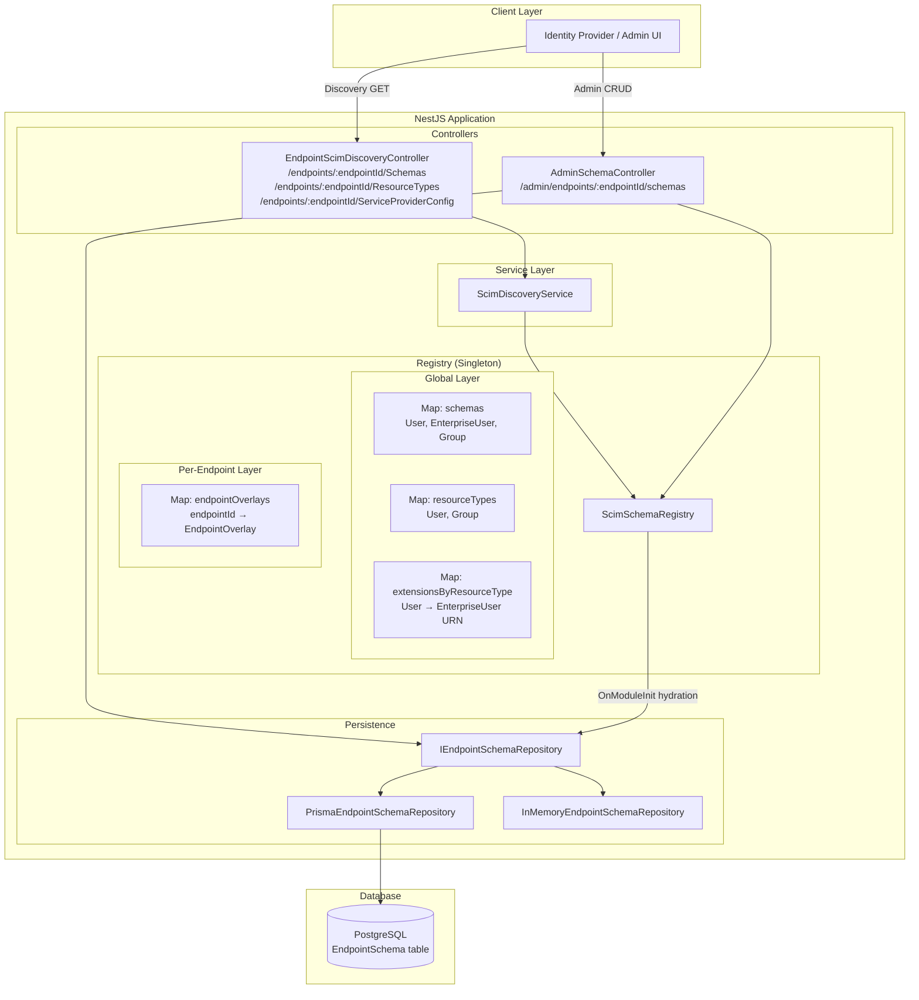
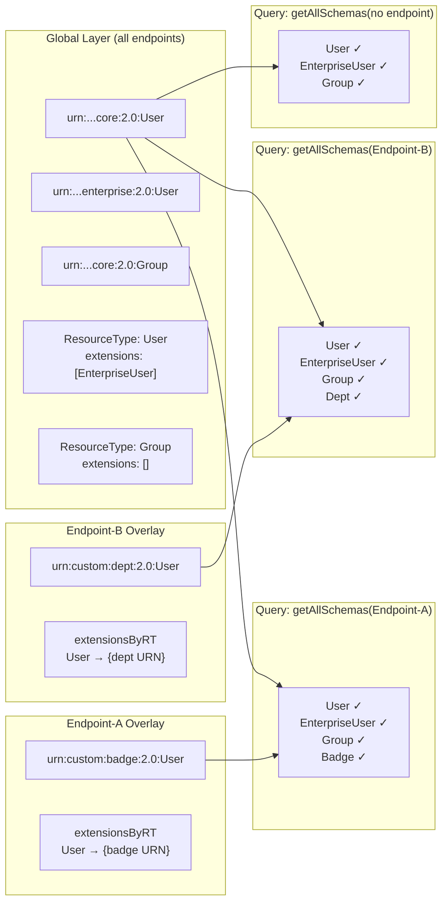
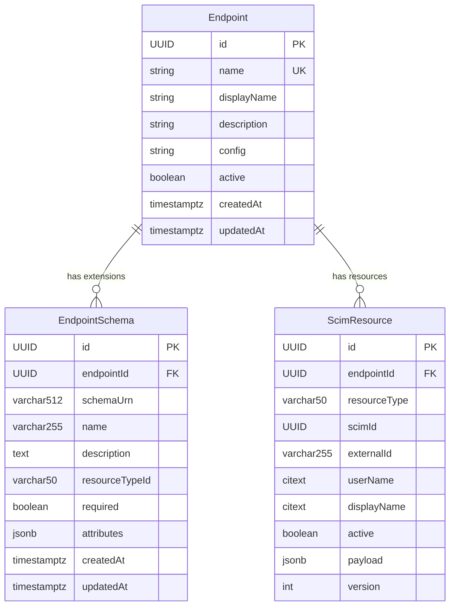
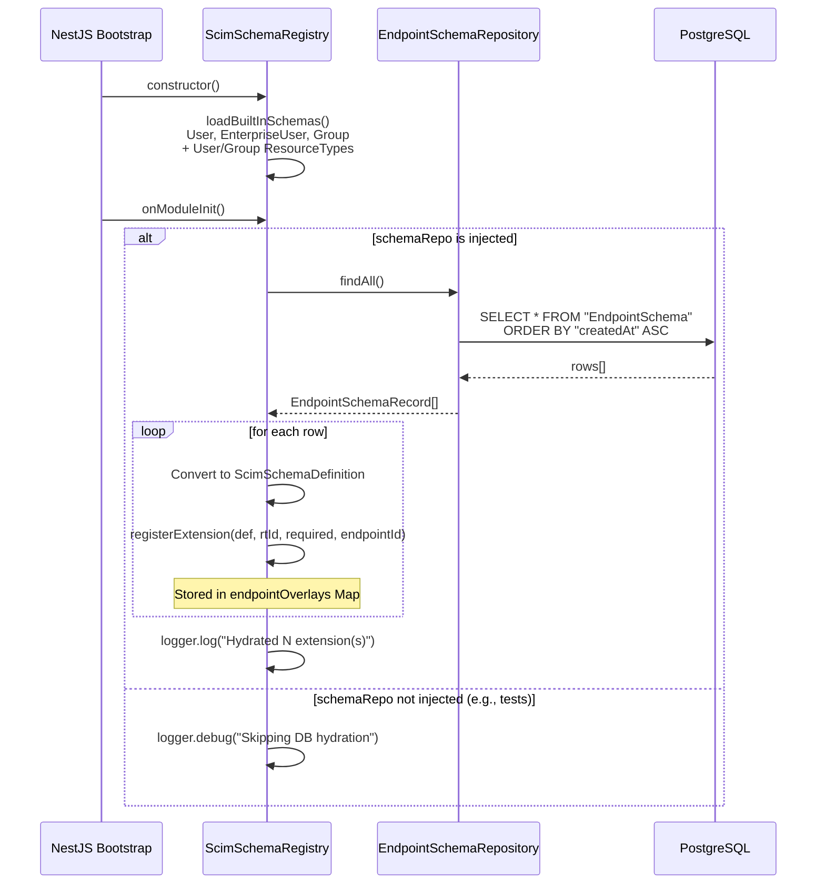
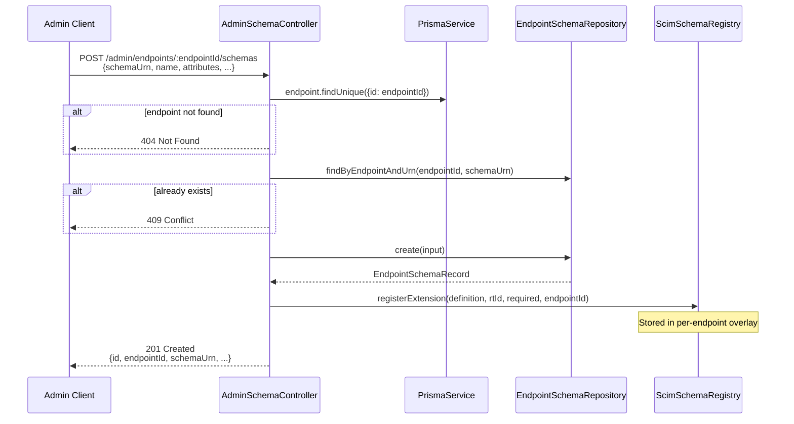
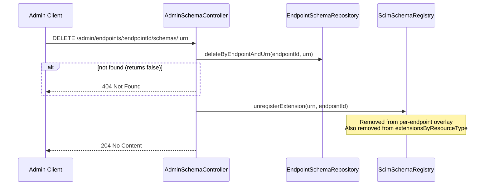
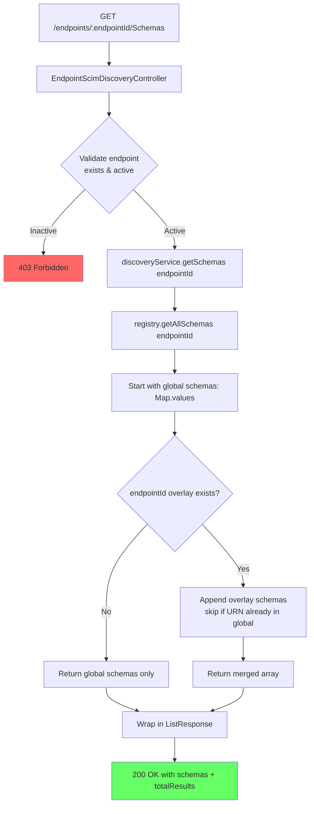
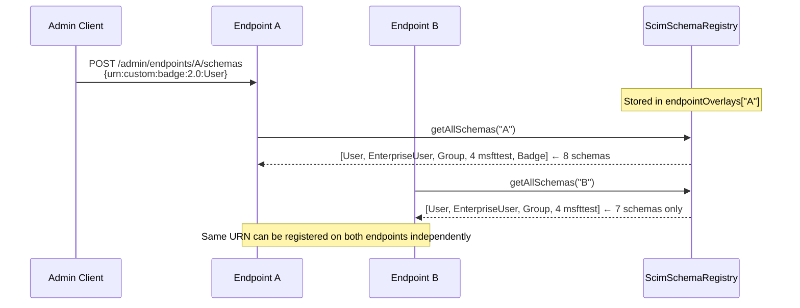

# SCIM Discovery & Per-Endpoint Schema Extensions — Comprehensive Reference

> **Phase 6 — Data-Driven Discovery**
> Last updated: 2026-02-24

---

## Table of Contents

1. [Architecture Overview](#1-architecture-overview)
2. [Two-Layer Registry Architecture](#2-two-layer-registry-architecture)
3. [Database Schema](#3-database-schema)
4. [Discovery Endpoints (RFC 7644 §4)](#4-discovery-endpoints-rfc-7644-4)
5. [Admin Schema Extension API](#5-admin-schema-extension-api)
6. [Startup Hydration Flow](#6-startup-hydration-flow)
7. [Registration & Unregistration Flows](#7-registration--unregistration-flows)
8. [Discovery Response Merging](#8-discovery-response-merging)
9. [DTO Validation Rules](#9-dto-validation-rules)
10. [Complete JSON Examples](#10-complete-json-examples)
11. [Error Responses](#11-error-responses)
12. [Cross-Endpoint Isolation](#12-cross-endpoint-isolation)
13. [Repository Layer](#13-repository-layer)
14. [Test Coverage Summary](#14-test-coverage-summary)
15. [RFC Compliance Notes](#15-rfc-compliance-notes)

---

## 1. Architecture Overview



### Component Responsibilities

| Component | File | Role |
|-----------|------|------|
| `ScimSchemaRegistry` | `src/modules/scim/discovery/scim-schema-registry.ts` | Singleton in-memory registry with global + per-endpoint layers |
| `ScimDiscoveryService` | `src/modules/scim/discovery/scim-discovery.service.ts` | Builds SCIM ListResponse wrappers for discovery endpoints |
| `EndpointScimDiscoveryController` | `src/modules/scim/controllers/endpoint-scim-discovery.controller.ts` | HTTP layer for per-endpoint `/Schemas`, `/ResourceTypes`, `/ServiceProviderConfig` |
| `AdminSchemaController` | `src/modules/scim/controllers/admin-schema.controller.ts` | CRUD API for managing per-endpoint schema extensions |
| `CreateEndpointSchemaDto` | `src/modules/scim/dto/create-endpoint-schema.dto.ts` | Validated DTO for POST schema extension |
| `IEndpointSchemaRepository` | `src/domain/repositories/endpoint-schema.repository.interface.ts` | Repository interface (6 methods) |
| `PrismaEndpointSchemaRepository` | `src/infrastructure/repositories/prisma/prisma-endpoint-schema.repository.ts` | PostgreSQL persistence (Prisma) |
| `InMemoryEndpointSchemaRepository` | `src/infrastructure/repositories/inmemory/inmemory-endpoint-schema.repository.ts` | In-memory persistence (testing) |
| `scim-schemas.constants.ts` | `src/modules/scim/discovery/scim-schemas.constants.ts` | Built-in schema/ResourceType/SPConfig constants |

---

## 2. Two-Layer Registry Architecture



### Layer Details

| Layer | Storage | Populated By | Scope |
|-------|---------|-------------|-------|
| **Global** | `Map<string, ScimSchemaDefinition>` | Constructor (`loadBuiltInSchemas()`) | All endpoints |
| **Per-Endpoint** | `Map<string, EndpointOverlay>` | `registerExtension(…, endpointId)` | Single endpoint only |

**`EndpointOverlay` structure:**
```typescript
interface EndpointOverlay {
  schemas: Map<string, ScimSchemaDefinition>;           // Extension schemas
  extensionsByResourceType: Map<string, Set<string>>;   // Extension URNs per RT
}
```

### Merge Rules

1. **`getAllSchemas(endpointId)`** → global schemas + endpoint overlay schemas (no duplicates)
2. **`getAllResourceTypes(endpointId)`** → global RTs with endpoint extension URNs appended to `schemaExtensions[]`
3. **`getExtensionUrns(endpointId)`** → union of global + endpoint extension URNs
4. **`getSchema(urn, endpointId)`** → checks endpoint overlay first, falls back to global

---

## 3. Database Schema

### Prisma Model

```prisma
model EndpointSchema {
  id              String   @id @default(dbgenerated("gen_random_uuid()")) @db.Uuid
  endpointId      String   @db.Uuid
  schemaUrn       String   @db.VarChar(512)
  name            String   @db.VarChar(255)
  description     String?
  resourceTypeId  String?  @db.VarChar(50)
  required        Boolean  @default(false)
  attributes      Json                          // JSONB array
  createdAt       DateTime @default(now()) @db.Timestamptz
  updatedAt       DateTime @updatedAt     @db.Timestamptz

  endpoint Endpoint @relation(fields: [endpointId], references: [id], onDelete: Cascade)

  @@unique([endpointId, schemaUrn])
  @@index([endpointId])
}
```

### Migration SQL

```sql
CREATE TABLE "EndpointSchema" (
    "id"             UUID         NOT NULL DEFAULT gen_random_uuid(),
    "endpointId"     UUID         NOT NULL,
    "schemaUrn"      VARCHAR(512) NOT NULL,
    "name"           VARCHAR(255) NOT NULL,
    "description"    TEXT,
    "resourceTypeId" VARCHAR(50),
    "required"       BOOLEAN      NOT NULL DEFAULT false,
    "attributes"     JSONB        NOT NULL,
    "createdAt"      TIMESTAMPTZ  NOT NULL DEFAULT CURRENT_TIMESTAMP,
    "updatedAt"      TIMESTAMPTZ  NOT NULL,

    CONSTRAINT "EndpointSchema_pkey" PRIMARY KEY ("id")
);

CREATE INDEX  "EndpointSchema_endpointId_idx"
    ON "EndpointSchema"("endpointId");

CREATE UNIQUE INDEX "EndpointSchema_endpointId_schemaUrn_key"
    ON "EndpointSchema"("endpointId", "schemaUrn");

ALTER TABLE "EndpointSchema"
    ADD CONSTRAINT "EndpointSchema_endpointId_fkey"
    FOREIGN KEY ("endpointId") REFERENCES "Endpoint"("id")
    ON DELETE CASCADE ON UPDATE CASCADE;
```

### Entity-Relationship Diagram



### Sample Database Row

```json
{
  "id": "a1b2c3d4-5678-4def-abcd-111122223333",
  "endpointId": "e1e2e3e4-5678-4def-abcd-444455556666",
  "schemaUrn": "urn:ietf:params:scim:schemas:extension:custom:2.0:User",
  "name": "Custom User Extension",
  "description": "Adds badge number and cost center to users",
  "resourceTypeId": "User",
  "required": false,
  "attributes": [
    {
      "name": "badgeNumber",
      "type": "string",
      "multiValued": false,
      "required": false,
      "description": "Employee badge number",
      "mutability": "readWrite",
      "returned": "default"
    },
    {
      "name": "costCenter",
      "type": "string",
      "multiValued": false,
      "required": true,
      "description": "Cost center code"
    }
  ],
  "createdAt": "2026-02-24T10:30:00.000Z",
  "updatedAt": "2026-02-24T10:30:00.000Z"
}
```

---

## 4. Discovery Endpoints (RFC 7644 §4)

All discovery endpoints are per-endpoint, scoped under:
```
/scim/endpoints/{endpointId}/
```

### 4.1 GET /Schemas

Returns all SCIM schema definitions visible to the endpoint (global + endpoint-specific).

**Request:**
```http
GET /scim/endpoints/e1e2e3e4-5678-4def-abcd-444455556666/Schemas HTTP/1.1
Host: localhost:3000
Authorization: Bearer <token>
Accept: application/scim+json
```

**Response (200 OK) — Default (no custom extensions):**
```json
{
  "schemas": ["urn:ietf:params:scim:api:messages:2.0:ListResponse"],
  "totalResults": 3,
  "startIndex": 1,
  "itemsPerPage": 3,
  "Resources": [
    {
      "id": "urn:ietf:params:scim:schemas:core:2.0:User",
      "name": "User",
      "description": "User Account",
      "attributes": [
        {
          "name": "userName",
          "type": "string",
          "multiValued": false,
          "required": true,
          "caseExact": false,
          "mutability": "readWrite",
          "returned": "always",
          "uniqueness": "server",
          "description": "Unique identifier for the User..."
        },
        {
          "name": "name",
          "type": "complex",
          "multiValued": false,
          "required": false,
          "mutability": "readWrite",
          "returned": "default",
          "description": "The components of the user's real name.",
          "subAttributes": [
            { "name": "formatted", "type": "string", "multiValued": false, "required": false },
            { "name": "familyName", "type": "string", "multiValued": false, "required": false },
            { "name": "givenName", "type": "string", "multiValued": false, "required": false },
            { "name": "middleName", "type": "string", "multiValued": false, "required": false },
            { "name": "honorificPrefix", "type": "string", "multiValued": false, "required": false },
            { "name": "honorificSuffix", "type": "string", "multiValued": false, "required": false }
          ]
        },
        { "name": "displayName", "type": "string", "multiValued": false, "required": false },
        { "name": "nickName", "type": "string", "multiValued": false, "required": false },
        { "name": "profileUrl", "type": "reference", "multiValued": false, "required": false },
        { "name": "title", "type": "string", "multiValued": false, "required": false },
        { "name": "userType", "type": "string", "multiValued": false, "required": false },
        { "name": "preferredLanguage", "type": "string", "multiValued": false, "required": false },
        { "name": "locale", "type": "string", "multiValued": false, "required": false },
        { "name": "timezone", "type": "string", "multiValued": false, "required": false },
        { "name": "active", "type": "boolean", "multiValued": false, "required": false },
        {
          "name": "emails",
          "type": "complex",
          "multiValued": true,
          "required": false,
          "subAttributes": [
            { "name": "value", "type": "string", "required": true },
            { "name": "type", "type": "string", "required": false },
            { "name": "primary", "type": "boolean", "required": false }
          ]
        },
        { "name": "phoneNumbers", "type": "complex", "multiValued": true, "required": false },
        { "name": "addresses", "type": "complex", "multiValued": true, "required": false },
        { "name": "roles", "type": "complex", "multiValued": true, "required": false },
        { "name": "externalId", "type": "string", "multiValued": false, "required": false }
      ],
      "meta": {
        "resourceType": "Schema",
        "location": "/Schemas/urn:ietf:params:scim:schemas:core:2.0:User"
      }
    },
    {
      "id": "urn:ietf:params:scim:schemas:extension:enterprise:2.0:User",
      "name": "EnterpriseUser",
      "description": "Enterprise User Extension",
      "attributes": [
        { "name": "employeeNumber", "type": "string", "multiValued": false, "required": false },
        { "name": "costCenter", "type": "string", "multiValued": false, "required": false },
        { "name": "organization", "type": "string", "multiValued": false, "required": false },
        { "name": "division", "type": "string", "multiValued": false, "required": false },
        { "name": "department", "type": "string", "multiValued": false, "required": false },
        {
          "name": "manager",
          "type": "complex",
          "multiValued": false,
          "required": false,
          "subAttributes": [
            { "name": "value", "type": "string" },
            { "name": "$ref", "type": "reference", "referenceTypes": ["User"] },
            { "name": "displayName", "type": "string", "mutability": "readOnly" }
          ]
        }
      ],
      "meta": {
        "resourceType": "Schema",
        "location": "/Schemas/urn:ietf:params:scim:schemas:extension:enterprise:2.0:User"
      }
    },
    {
      "id": "urn:ietf:params:scim:schemas:core:2.0:Group",
      "name": "Group",
      "description": "Group",
      "attributes": [
        { "name": "displayName", "type": "string", "multiValued": false, "required": true },
        {
          "name": "members",
          "type": "complex",
          "multiValued": true,
          "required": false,
          "subAttributes": [
            { "name": "value", "type": "string", "required": true },
            { "name": "display", "type": "string", "required": false },
            { "name": "type", "type": "string", "required": false }
          ]
        },
        { "name": "externalId", "type": "string", "multiValued": false, "required": false }
      ],
      "meta": {
        "resourceType": "Schema",
        "location": "/Schemas/urn:ietf:params:scim:schemas:core:2.0:Group"
      }
    }
  ]
}
```

**Response (200 OK) — With custom extension registered:**

After registering a custom extension (e.g., badge schema on the User RT), `totalResults` becomes 4 and the `Resources` array includes the extension:

```json
{
  "schemas": ["urn:ietf:params:scim:api:messages:2.0:ListResponse"],
  "totalResults": 4,
  "startIndex": 1,
  "itemsPerPage": 4,
  "Resources": [
    "... (User, EnterpriseUser, Group as above) ...",
    {
      "id": "urn:ietf:params:scim:schemas:extension:custom:2.0:User",
      "name": "Custom User Extension",
      "description": "E2E test extension",
      "attributes": [
        {
          "name": "badgeNumber",
          "type": "string",
          "multiValued": false,
          "required": false,
          "description": "Employee badge number"
        },
        {
          "name": "costCenter",
          "type": "string",
          "multiValued": false,
          "required": true,
          "description": "Cost center code"
        }
      ],
      "meta": {
        "resourceType": "Schema",
        "location": "/Schemas/urn:ietf:params:scim:schemas:extension:custom:2.0:User"
      }
    }
  ]
}
```

---

### 4.2 GET /ResourceTypes

Returns resource type definitions with merged schema extensions.

**Request:**
```http
GET /scim/endpoints/e1e2e3e4-5678-4def-abcd-444455556666/ResourceTypes HTTP/1.1
Host: localhost:3000
Authorization: Bearer <token>
Accept: application/scim+json
```

**Response (200 OK) — Default:**
```json
{
  "schemas": ["urn:ietf:params:scim:api:messages:2.0:ListResponse"],
  "totalResults": 2,
  "startIndex": 1,
  "itemsPerPage": 2,
  "Resources": [
    {
      "id": "User",
      "name": "User",
      "endpoint": "/Users",
      "description": "User Account",
      "schema": "urn:ietf:params:scim:schemas:core:2.0:User",
      "schemaExtensions": [
        {
          "schema": "urn:ietf:params:scim:schemas:extension:enterprise:2.0:User",
          "required": false
        }
      ],
      "meta": {
        "resourceType": "ResourceType",
        "location": "/ResourceTypes/User"
      }
    },
    {
      "id": "Group",
      "name": "Group",
      "endpoint": "/Groups",
      "description": "Group",
      "schema": "urn:ietf:params:scim:schemas:core:2.0:Group",
      "schemaExtensions": [],
      "meta": {
        "resourceType": "ResourceType",
        "location": "/ResourceTypes/Group"
      }
    }
  ]
}
```

**Response (200 OK) — With custom extension on User RT:**
```json
{
  "schemas": ["urn:ietf:params:scim:api:messages:2.0:ListResponse"],
  "totalResults": 2,
  "startIndex": 1,
  "itemsPerPage": 2,
  "Resources": [
    {
      "id": "User",
      "name": "User",
      "endpoint": "/Users",
      "description": "User Account",
      "schema": "urn:ietf:params:scim:schemas:core:2.0:User",
      "schemaExtensions": [
        {
          "schema": "urn:ietf:params:scim:schemas:extension:enterprise:2.0:User",
          "required": false
        },
        {
          "schema": "urn:ietf:params:scim:schemas:extension:custom:2.0:User",
          "required": false
        }
      ],
      "meta": {
        "resourceType": "ResourceType",
        "location": "/ResourceTypes/User"
      }
    },
    {
      "id": "Group",
      "name": "Group",
      "endpoint": "/Groups",
      "description": "Group",
      "schema": "urn:ietf:params:scim:schemas:core:2.0:Group",
      "schemaExtensions": [],
      "meta": {
        "resourceType": "ResourceType",
        "location": "/ResourceTypes/Group"
      }
    }
  ]
}
```

---

### 4.3 GET /ServiceProviderConfig

Returns the server's capability declaration (static — not affected by schema extensions).

**Request:**
```http
GET /scim/endpoints/e1e2e3e4-5678-4def-abcd-444455556666/ServiceProviderConfig HTTP/1.1
Host: localhost:3000
Authorization: Bearer <token>
Accept: application/scim+json
```

**Response (200 OK):**
```json
{
  "schemas": ["urn:ietf:params:scim:schemas:core:2.0:ServiceProviderConfig"],
  "documentationUri": "https://github.com/pranems/SCIMServer",
  "patch": { "supported": true },
  "bulk": { "supported": false, "maxOperations": 0, "maxPayloadSize": 0 },
  "filter": { "supported": true, "maxResults": 200 },
  "changePassword": { "supported": false },
  "sort": { "supported": false },
  "etag": { "supported": true },
  "authenticationSchemes": [
    {
      "type": "oauthbearertoken",
      "name": "OAuth Bearer Token",
      "description": "Authentication scheme using the OAuth Bearer Token Standard",
      "specUri": "https://www.rfc-editor.org/info/rfc6750",
      "documentationUri": "https://github.com/pranems/SCIMServer#authentication"
    }
  ],
  "meta": {
    "resourceType": "ServiceProviderConfig",
    "location": "/ServiceProviderConfig"
  }
}
```

---

## 5. Admin Schema Extension API

Base path: `/scim/admin/endpoints`

All endpoints require OAuth Bearer Token authentication.

### 5.1 POST — Register Schema Extension

**`POST /scim/admin/endpoints/:endpointId/schemas`**

Registers a new per-endpoint SCIM schema extension. Persists to database and hydrates in-memory registry.

**Request:**
```http
POST /scim/admin/endpoints/e1e2e3e4-5678-4def-abcd-444455556666/schemas HTTP/1.1
Host: localhost:3000
Authorization: Bearer <token>
Content-Type: application/json

{
  "schemaUrn": "urn:ietf:params:scim:schemas:extension:custom:2.0:User",
  "name": "Custom User Extension",
  "description": "Adds badge number and cost center to users",
  "resourceTypeId": "User",
  "required": false,
  "attributes": [
    {
      "name": "badgeNumber",
      "type": "string",
      "multiValued": false,
      "required": false,
      "description": "Employee badge number",
      "mutability": "readWrite",
      "returned": "default",
      "caseExact": false,
      "uniqueness": "none"
    },
    {
      "name": "costCenter",
      "type": "string",
      "multiValued": false,
      "required": true,
      "description": "Cost center code"
    }
  ]
}
```

**Response (201 Created):**
```json
{
  "id": "a1b2c3d4-5678-4def-abcd-111122223333",
  "endpointId": "e1e2e3e4-5678-4def-abcd-444455556666",
  "schemaUrn": "urn:ietf:params:scim:schemas:extension:custom:2.0:User",
  "name": "Custom User Extension",
  "description": "Adds badge number and cost center to users",
  "resourceTypeId": "User",
  "required": false,
  "attributes": [
    {
      "name": "badgeNumber",
      "type": "string",
      "multiValued": false,
      "required": false,
      "description": "Employee badge number",
      "mutability": "readWrite",
      "returned": "default",
      "caseExact": false,
      "uniqueness": "none"
    },
    {
      "name": "costCenter",
      "type": "string",
      "multiValued": false,
      "required": true,
      "description": "Cost center code"
    }
  ],
  "createdAt": "2026-02-24T10:30:00.000Z",
  "updatedAt": "2026-02-24T10:30:00.000Z"
}
```

**Minimal Request (no optional fields):**
```json
{
  "schemaUrn": "urn:example:minimal:2.0",
  "name": "Minimal Schema",
  "attributes": []
}
```

**Minimal Response (201):**
```json
{
  "id": "...",
  "endpointId": "e1e2e3e4-...",
  "schemaUrn": "urn:example:minimal:2.0",
  "name": "Minimal Schema",
  "description": null,
  "resourceTypeId": null,
  "required": false,
  "attributes": [],
  "createdAt": "...",
  "updatedAt": "..."
}
```

---

### 5.2 GET — List Schemas for Endpoint

**`GET /scim/admin/endpoints/:endpointId/schemas`**

**Request:**
```http
GET /scim/admin/endpoints/e1e2e3e4-5678-4def-abcd-444455556666/schemas HTTP/1.1
Host: localhost:3000
Authorization: Bearer <token>
```

**Response (200 OK) — Empty:**
```json
{
  "totalResults": 0,
  "schemas": []
}
```

**Response (200 OK) — With registered extensions:**
```json
{
  "totalResults": 1,
  "schemas": [
    {
      "id": "a1b2c3d4-5678-4def-abcd-111122223333",
      "endpointId": "e1e2e3e4-5678-4def-abcd-444455556666",
      "schemaUrn": "urn:ietf:params:scim:schemas:extension:custom:2.0:User",
      "name": "Custom User Extension",
      "description": "Adds badge number and cost center to users",
      "resourceTypeId": "User",
      "required": false,
      "attributes": [ "..." ],
      "createdAt": "2026-02-24T10:30:00.000Z",
      "updatedAt": "2026-02-24T10:30:00.000Z"
    }
  ]
}
```

---

### 5.3 GET — Get Schema by URN

**`GET /scim/admin/endpoints/:endpointId/schemas/:urn`**

> **Note:** The URN must be URL-encoded (`:` → `%3A`).

**Request:**
```http
GET /scim/admin/endpoints/e1e2e3e4-.../schemas/urn%3Aietf%3Aparams%3Ascim%3Aschemas%3Aextension%3Acustom%3A2.0%3AUser HTTP/1.1
Host: localhost:3000
Authorization: Bearer <token>
```

**Response (200 OK):**
```json
{
  "id": "a1b2c3d4-5678-4def-abcd-111122223333",
  "endpointId": "e1e2e3e4-5678-4def-abcd-444455556666",
  "schemaUrn": "urn:ietf:params:scim:schemas:extension:custom:2.0:User",
  "name": "Custom User Extension",
  "description": "Adds badge number and cost center to users",
  "resourceTypeId": "User",
  "required": false,
  "attributes": [ "..." ],
  "createdAt": "2026-02-24T10:30:00.000Z",
  "updatedAt": "2026-02-24T10:30:00.000Z"
}
```

---

### 5.4 DELETE — Remove Schema Extension

**`DELETE /scim/admin/endpoints/:endpointId/schemas/:urn`**

Removes from both database and in-memory registry.

**Request:**
```http
DELETE /scim/admin/endpoints/e1e2e3e4-.../schemas/urn%3Aietf%3Aparams%3Ascim%3Aschemas%3Aextension%3Acustom%3A2.0%3AUser HTTP/1.1
Host: localhost:3000
Authorization: Bearer <token>
```

**Response:** `204 No Content` (empty body)

---

### 5.5 Admin API Summary Table

| Method | Path | Status | Description |
|--------|------|--------|-------------|
| `POST` | `/admin/endpoints/:endpointId/schemas` | 201 | Register schema extension |
| `GET` | `/admin/endpoints/:endpointId/schemas` | 200 | List all extensions for endpoint |
| `GET` | `/admin/endpoints/:endpointId/schemas/:urn` | 200 | Get specific extension by URN |
| `DELETE` | `/admin/endpoints/:endpointId/schemas/:urn` | 204 | Remove extension (DB + registry) |

---

## 6. Startup Hydration Flow

On application startup, `ScimSchemaRegistry` implements `OnModuleInit` to load persisted extensions from the database.



### Key Design Decisions

| Decision | Rationale |
|----------|-----------|
| `@Optional()` on repo injection | Allows ScimSchemaRegistry to work without persistence (unit tests, in-memory mode) |
| Error catch in `onModuleInit()` | Logs error but does not crash app — degraded mode with only built-in schemas |
| `findAll()` not `findByEndpointId()` | Single query loads all extensions across all endpoints |
| re-uses `registerExtension()` | Ensures same code path for API registration and startup hydration |

---

## 7. Registration & Unregistration Flows

### 7.1 Register Extension (Admin API POST)



### 7.2 Unregister Extension (Admin API DELETE)



### 7.3 Registry Internal Flows

**`registerExtension(schema, resourceTypeId, required, endpointId):`**

```
1. Validate schema.id is not empty
2. Validate schema.id is not a core schema (User/Group)
3. Validate resourceTypeId exists if provided
4. Ensure meta is populated (default: { resourceType: "Schema", location: "/Schemas/{urn}" })
5. IF endpointId provided:
   a. getOrCreateOverlay(endpointId) → EndpointOverlay
   b. overlay.schemas.set(urn, definition)
   c. IF resourceTypeId: overlay.extensionsByResourceType.get(rtId).add(urn)
6. ELSE (global):
   a. schemas.set(urn, definition)
   b. IF resourceTypeId: rt.schemaExtensions.push({schema: urn, required})
   c. extensionsByResourceType.get(rtId).add(urn)
```

**`unregisterExtension(schemaUrn, endpointId):`**

```
1. Reject if core schema (BadRequestException)
2. IF endpointId:
   a. Get overlay (return false if none)
   b. Delete from overlay.schemas
   c. Delete from all overlay.extensionsByResourceType sets
3. ELSE (global):
   a. Delete from schemas map
   b. Remove from all resourceType.schemaExtensions arrays
   c. Remove from all extensionsByResourceType sets
```

---

## 8. Discovery Response Merging



### Merging Logic for ResourceTypes

When `getAllResourceTypes(endpointId)` is called:

1. Iterate all global resource types (`User`, `Group`)
2. For each, check if the endpoint overlay has `extensionsByResourceType` entries for that RT id
3. If yes, deep-copy the RT and append endpoint-specific extension refs to `schemaExtensions[]`
4. De-duplicate: skip any extension URN already present from the global layer

---

## 9. DTO Validation Rules

### `CreateEndpointSchemaDto`

| Field | Type | Constraints | Required |
|-------|------|-------------|----------|
| `schemaUrn` | `string` | MinLength: 1, MaxLength: 512 | ✅ |
| `name` | `string` | MinLength: 1, MaxLength: 255 | ✅ |
| `description` | `string` | — | ❌ |
| `resourceTypeId` | `string` | MaxLength: 50. Must be `"User"` or `"Group"` (validated by registry) | ❌ |
| `required` | `boolean` | Default: `false` | ❌ |
| `attributes` | `SchemaAttributeDto[]` | Nested validation, recursive | ✅ |

### `SchemaAttributeDto`

| Field | Type | Constraints | Required |
|-------|------|-------------|----------|
| `name` | `string` | — | ✅ |
| `type` | `string` | — | ✅ |
| `multiValued` | `boolean` | — | ✅ |
| `required` | `boolean` | — | ✅ |
| `description` | `string` | — | ❌ |
| `mutability` | `string` | — | ❌ |
| `returned` | `string` | — | ❌ |
| `caseExact` | `boolean` | — | ❌ |
| `uniqueness` | `string` | — | ❌ |
| `referenceTypes` | `string[]` | — | ❌ |
| `subAttributes` | `SchemaAttributeDto[]` | Recursive nested validation | ❌ |

### Example: Complex Attribute with SubAttributes

```json
{
  "name": "manager",
  "type": "complex",
  "multiValued": false,
  "required": false,
  "description": "The User's manager",
  "subAttributes": [
    {
      "name": "value",
      "type": "string",
      "multiValued": false,
      "required": false,
      "description": "The id of the manager"
    },
    {
      "name": "displayName",
      "type": "string",
      "multiValued": false,
      "required": false,
      "mutability": "readOnly",
      "description": "Display name of the manager"
    }
  ]
}
```

---

## 10. Complete JSON Examples

### 10.1 Built-In Schema URNs

| URN | Name | Type |
|-----|------|------|
| `urn:ietf:params:scim:schemas:core:2.0:User` | User | Core |
| `urn:ietf:params:scim:schemas:extension:enterprise:2.0:User` | EnterpriseUser | Extension (global) |
| `urn:ietf:params:scim:schemas:core:2.0:Group` | Group | Core |
| `urn:ietf:params:scim:schemas:core:2.0:ServiceProviderConfig` | ServiceProviderConfig | Config |

### 10.2 Full CRUD Lifecycle Example

#### Step 1: Create Endpoint

```http
POST /scim/admin/endpoints HTTP/1.1
Authorization: Bearer <token>
Content-Type: application/json

{ "name": "contoso", "displayName": "Contoso Corp" }
```

Response:
```json
{ "id": "e1e2e3e4-5678-4def-abcd-444455556666", "name": "contoso", ... }
```

#### Step 2: Verify Default Discovery (7 schemas)

```http
GET /scim/endpoints/e1e2e3e4-.../Schemas HTTP/1.1
Authorization: Bearer <token>
```

Response: `totalResults: 7` → User, EnterpriseUser, Group + 4 msfttest extensions

#### Step 3: Register Custom Extension

```http
POST /scim/admin/endpoints/e1e2e3e4-.../schemas HTTP/1.1
Authorization: Bearer <token>
Content-Type: application/json

{
  "schemaUrn": "urn:ietf:params:scim:schemas:extension:custom:2.0:User",
  "name": "Custom User Extension",
  "description": "E2E test extension",
  "resourceTypeId": "User",
  "required": false,
  "attributes": [
    {
      "name": "badgeNumber",
      "type": "string",
      "multiValued": false,
      "required": false,
      "description": "Employee badge number"
    },
    {
      "name": "costCenter",
      "type": "string",
      "multiValued": false,
      "required": true,
      "description": "Cost center code"
    }
  ]
}
```

Response: `201 Created`

#### Step 4: Verify Discovery Now Shows 8 Schemas

```http
GET /scim/endpoints/e1e2e3e4-.../Schemas HTTP/1.1
Authorization: Bearer <token>
```

Response: `totalResults: 8` — includes the custom extension

#### Step 5: Verify ResourceTypes Shows Merged Extensions

```http
GET /scim/endpoints/e1e2e3e4-.../ResourceTypes HTTP/1.1
Authorization: Bearer <token>
```

User RT now has 2 items in `schemaExtensions`:
- `urn:...enterprise:2.0:User` (global)
- `urn:...custom:2.0:User` (endpoint-specific)

#### Step 6: Delete Extension

```http
DELETE /scim/admin/endpoints/e1e2e3e4-.../schemas/urn%3A...custom%3A2.0%3AUser HTTP/1.1
Authorization: Bearer <token>
```

Response: `204 No Content`

#### Step 7: Verify Discovery Reverts to 7 Schemas

```http
GET /scim/endpoints/e1e2e3e4-.../Schemas HTTP/1.1
Authorization: Bearer <token>
```

Response: `totalResults: 7` — custom extension removed

---

## 11. Error Responses

### Authentication Required (401)

```http
POST /scim/admin/endpoints/e1e2e3e4-.../schemas HTTP/1.1
(no Authorization header)
```

```json
{
  "statusCode": 401,
  "message": "Unauthorized"
}
```

### Endpoint Not Found (404)

```http
POST /scim/admin/endpoints/00000000-0000-4000-a000-000000000099/schemas HTTP/1.1
Authorization: Bearer <token>
Content-Type: application/json

{ "schemaUrn": "urn:test:2.0", "name": "Test", "attributes": [] }
```

```json
{
  "statusCode": 404,
  "message": "Endpoint \"00000000-0000-4000-a000-000000000099\" not found."
}
```

### Schema Not Found (404)

```http
GET /scim/admin/endpoints/e1e2e3e4-.../schemas/urn%3Anot%3Afound HTTP/1.1
Authorization: Bearer <token>
```

```json
{
  "statusCode": 404,
  "message": "Schema extension \"urn:not:found\" not found for endpoint \"e1e2e3e4-...\"."
}
```

### Duplicate Schema URN (409)

Attempting to POST the same `schemaUrn` for the same endpoint twice:

```json
{
  "statusCode": 409,
  "message": "Schema extension \"urn:...custom:2.0:User\" already registered for endpoint \"e1e2e3e4-...\"."
}
```

### Inactive Endpoint (403)

```http
GET /scim/endpoints/<inactive-endpoint-id>/Schemas HTTP/1.1
Authorization: Bearer <token>
```

```json
{
  "statusCode": 403,
  "message": "Endpoint \"My Endpoint\" is inactive. SCIM operations are not allowed."
}
```

### Core Schema Rejection (400)

Attempting to register with a core schema URN via the registry:

```json
{
  "statusCode": 400,
  "message": "Cannot overwrite core schema \"urn:ietf:params:scim:schemas:core:2.0:User\". Only extension schemas can be registered."
}
```

### Invalid Resource Type (400)

```json
{
  "statusCode": 400,
  "message": "Resource type \"InvalidType\" not found. Available: User, Group"
}
```

---

## 12. Cross-Endpoint Isolation

Extensions are scoped per-endpoint. Registering an extension on endpoint-A does **not** affect endpoint-B.



### Same URN, Different Endpoints

The database enforces `@@unique([endpointId, schemaUrn])`, meaning:
- ✅ Same URN on endpoint-A and endpoint-B → allowed
- ❌ Same URN on endpoint-A twice → `409 Conflict`

---

## 13. Repository Layer

### Interface: `IEndpointSchemaRepository`

```typescript
interface IEndpointSchemaRepository {
  create(input: EndpointSchemaCreateInput): Promise<EndpointSchemaRecord>;
  findByEndpointId(endpointId: string): Promise<EndpointSchemaRecord[]>;
  findAll(): Promise<EndpointSchemaRecord[]>;
  findByEndpointAndUrn(endpointId: string, schemaUrn: string): Promise<EndpointSchemaRecord | null>;
  deleteByEndpointAndUrn(endpointId: string, schemaUrn: string): Promise<boolean>;
  deleteByEndpointId(endpointId: string): Promise<number>;
}
```

### Domain Model

```typescript
interface EndpointSchemaRecord {
  id: string;              // UUID
  endpointId: string;      // UUID → FK to Endpoint
  schemaUrn: string;       // Full SCIM URN
  name: string;            // Human-readable name
  description: string | null;
  resourceTypeId: string | null;  // "User", "Group", or null
  required: boolean;
  attributes: unknown;     // JSONB array of ScimSchemaAttribute
  createdAt: Date;
  updatedAt: Date;
}

interface EndpointSchemaCreateInput {
  endpointId: string;
  schemaUrn: string;
  name: string;
  description?: string | null;
  resourceTypeId?: string | null;
  required?: boolean;      // Default: false
  attributes: unknown;
}
```

### DI Token & Registration

```typescript
// repository.tokens.ts
export const ENDPOINT_SCHEMA_REPOSITORY = 'ENDPOINT_SCHEMA_REPOSITORY';

// RepositoryModule.register() - DynamicModule
{
  provide: ENDPOINT_SCHEMA_REPOSITORY,
  useClass: backend === 'prisma'
    ? PrismaEndpointSchemaRepository
    : InMemoryEndpointSchemaRepository
}
```

### Implementation Details

| Implementation | Storage | Unique Key | Sort |
|---------------|---------|------------|------|
| `PrismaEndpointSchemaRepository` | PostgreSQL | `endpointId_schemaUrn` composite unique (DB-enforced) | `createdAt ASC` |
| `InMemoryEndpointSchemaRepository` | `Map<string, EndpointSchemaRecord>` | `${endpointId}::${schemaUrn}` composite key | insertion order |

---

## 14. Test Coverage Summary

### Unit Tests

| File | Tests | What's Tested |
|------|-------|---------------|
| `scim-schema-registry.spec.ts` | 56 | Global/per-endpoint registration, merge logic, unregister, core schema protection, `onModuleInit` hydration (8 tests), edge cases |
| `scim-discovery.service.spec.ts` | — | Delegated query building, `buildResourceSchemas()` |
| `prisma-endpoint-schema.repository.spec.ts` | 22 | All 6 repository methods with mocked PrismaService, record mapping |
| `inmemory-endpoint-schema.repository.spec.ts` | 15 | All 6 methods with in-memory storage, uniqueness enforcement |
| `admin-schema.controller.spec.ts` | 12 | Controller unit tests with mocked dependencies |
| `create-endpoint-schema.dto.spec.ts` | 26 | DTO validation (class-validator): required fields, max lengths, nested validation, optional fields |
| `repository.module.spec.ts` | +4 | `ENDPOINT_SCHEMA_REPOSITORY` token resolves correctly for both backends |

### E2E Tests

| File | Tests | What's Tested |
|------|-------|---------------|
| `admin-schema.e2e-spec.ts` | 19 | Full HTTP lifecycle: auth (3), POST (5), GET list (4), GET by URN (2), DELETE (2), Discovery integration (3) |
| `discovery-endpoints.e2e-spec.ts` | 9 | ServiceProviderConfig (3), Schemas (2), ResourceTypes (4) — verifies built-in schemas |

### Total: 52 unit suites / 1301 tests, 16 E2E suites / 215 tests — All passing ✅

---

## 15. RFC Compliance Notes

| RFC Section | Requirement | Status |
|-------------|-------------|--------|
| RFC 7643 §7 | Schema definitions available at `/Schemas` | ✅ All registered schemas returned |
| RFC 7643 §6 | ResourceType definitions at `/ResourceTypes` | ✅ With merged `schemaExtensions` |
| RFC 7644 §4 | ServiceProviderConfig at `/ServiceProviderConfig` | ✅ Static response |
| RFC 7644 §4 | Discovery endpoints MUST be present per service provider root | ✅ Per-endpoint scoping |
| RFC 7643 §7 | Schema `meta.resourceType` = "Schema" | ✅ Auto-populated |
| RFC 7643 §7 | Schema `meta.location` = "/Schemas/{urn}" | ✅ Auto-populated |
| RFC 7643 §6 | ResourceType `schemaExtensions` array | ✅ Global + per-endpoint merge |
| RFC 7643 §4 | `schemas[]` on User includes extension URNs when data present | ✅ `buildResourceSchemas()` dynamic |
| RFC 7643 §3.3 | Extension URNs follow `urn:ietf:params:scim:schemas:extension:*` pattern | ✅ Validated by convention |
| RFC 7644 §4 | `meta` SHOULD be included in ServiceProviderConfig | ✅ Included |

### Schema URN Format

Per RFC 7643, extension URNs follow the pattern:
```
urn:ietf:params:scim:schemas:extension:{vendor}:{version}:{ResourceType}
```

Examples:
- `urn:ietf:params:scim:schemas:extension:enterprise:2.0:User` (built-in)
- `urn:ietf:params:scim:schemas:extension:custom:2.0:User` (custom)
- `urn:example:mycompany:badge:2.0:User` (vendor-specific)

---

## Appendix: Request Headers Reference

### Discovery Endpoints

| Header | Value | Required |
|--------|-------|----------|
| `Authorization` | `Bearer <token>` | ✅ |
| `Accept` | `application/scim+json` or `application/json` | Recommended |

### Admin API

| Header | Value | Required |
|--------|-------|----------|
| `Authorization` | `Bearer <token>` | ✅ |
| `Content-Type` | `application/json` | ✅ (POST) |
| `Accept` | `application/json` | Recommended |

### Response Headers

| Header | Value |
|--------|-------|
| `Content-Type` | `application/json; charset=utf-8` |
| `X-Content-Type-Options` | `nosniff` |
