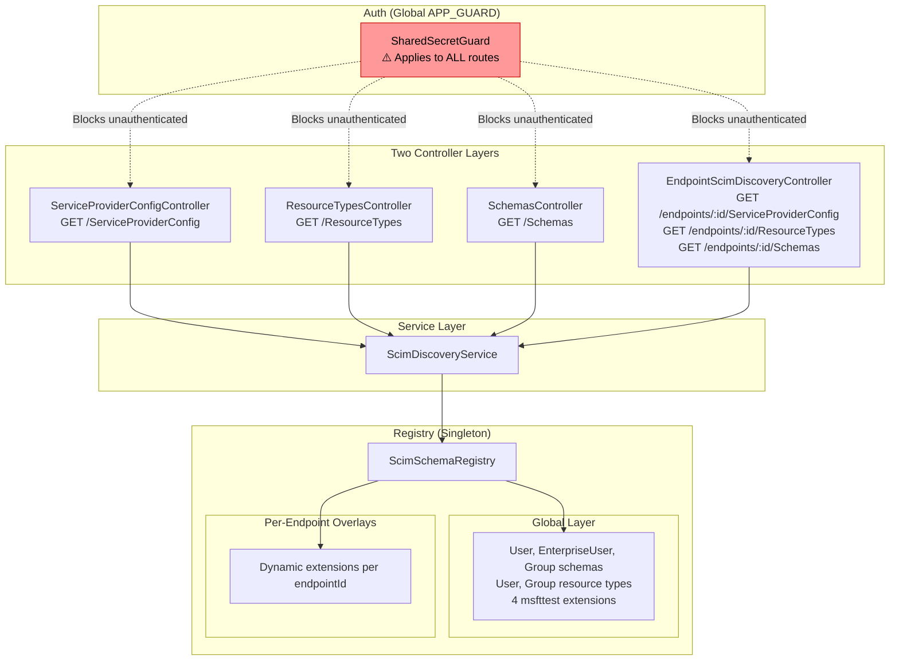
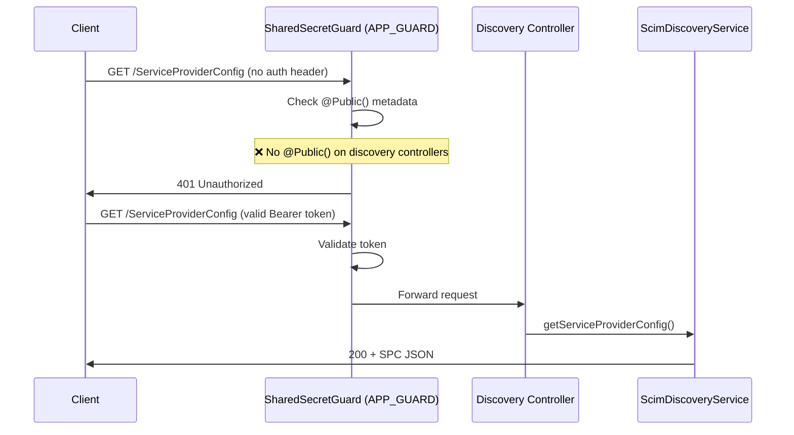
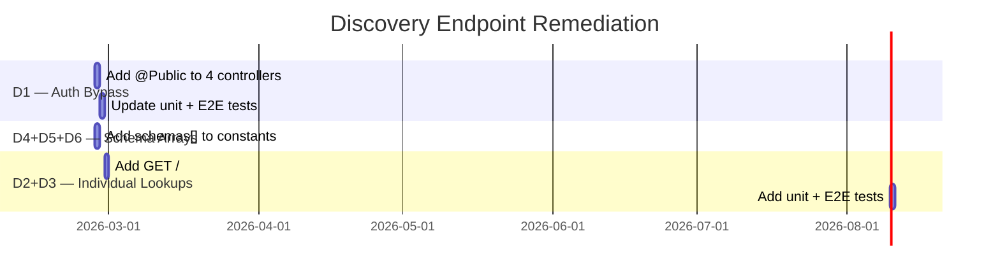

# Discovery Endpoints — RFC 7643/7644 Compliance Audit

> **Document Purpose**: Comprehensive audit of SCIM discovery endpoints (`/ServiceProviderConfig`, `/ResourceTypes`, `/Schemas`) against RFC 7643 §5–§7 and RFC 7644 §4 requirements.
>
> **Created**: February 26, 2026
> **Version**: v0.19.2
> **RFC References**: RFC 7643 §5 (SPC), RFC 7643 §6 (ResourceTypes), RFC 7643 §7 (Schemas), RFC 7644 §4 (Discovery)

---

## Table of Contents

1. [Executive Summary](#1-executive-summary)
2. [RFC Requirements — What the Specs Say](#2-rfc-requirements--what-the-specs-say)
3. [Current Implementation Architecture](#3-current-implementation-architecture)
4. [Audit Methodology](#4-audit-methodology)
5. [Detailed Findings](#5-detailed-findings)
6. [Gap Inventory](#6-gap-inventory)
7. [Remediation Plan](#7-remediation-plan)
8. [Existing Test Coverage](#8-existing-test-coverage)
9. [Cross-References](#9-cross-references)

---

## 1. Executive Summary

SCIMServer exposes all three RFC-mandated discovery endpoints (`/ServiceProviderConfig`, `/ResourceTypes`, `/Schemas`) with correct response shapes, proper `application/scim+json` content types, and comprehensive attribute definitions. However, the audit identified **6 gaps** (1 HIGH, 2 MEDIUM, 2 LOW, 1 VERY LOW) in strict RFC conformance.

### Quick Scorecard

| Endpoint | Response Shape | Content-Type | Auth Bypass | Individual Lookup | `schemas` Array | Overall |
|----------|:---:|:---:|:---:|:---:|:---:|:---:|
| `/ServiceProviderConfig` | ✅ | ✅ | ❌ D1 | N/A (singleton) | ✅ | 90% |
| `/ResourceTypes` | ✅ | ✅ | ❌ D1 | ❌ D3 | ❌ D5 | 70% |
| `/Schemas` | ✅ | ✅ | ❌ D1 | ❌ D2 | ❌ D4 | 70% |

---

## 2. RFC Requirements — What the Specs Say

### 2.1 RFC 7644 §4 — Service Provider Configuration and Discovery

> *"An HTTP client MAY use these endpoints to discover required information in order to interact with a SCIM service provider. The service provider configuration and the resource types supported by a SCIM service provider are discoverable using the following endpoints:"*

**Cross-cutting rules (all three endpoints):**

1. **SHALL NOT require authentication** — RFC 7644 §4 explicitly states: *"service provider configuration endpoints...SHALL NOT require authentication"*
2. **`application/scim+json`** content type on all responses
3. **Read-only** — only `GET` is defined; no `POST`/`PUT`/`PATCH`/`DELETE`
4. **No filter/sort/pagination support** — these are metadata singletons or small lists

### 2.2 RFC 7643 §5 — ServiceProviderConfig

> *"SCIM provides a schema for representing the service provider's configuration, including the supported SCIM operations and their parameters."*

The response is a **single resource** (not wrapped in ListResponse):

| Attribute | Type | Required | RFC Section |
|-----------|------|:--------:|-------------|
| `schemas` | `string[]` | Yes | §5 — MUST be `["urn:ietf:params:scim:schemas:core:2.0:ServiceProviderConfig"]` |
| `documentationUri` | `string (URI)` | No | §5 — Link to human-readable docs |
| `patch.supported` | `boolean` | Yes | §5 |
| `bulk.supported` | `boolean` | Yes | §5 |
| `bulk.maxOperations` | `integer` | Yes (if bulk) | §5 — Max operations per bulk request |
| `bulk.maxPayloadSize` | `integer` | Yes (if bulk) | §5 — Max payload size in bytes |
| `filter.supported` | `boolean` | Yes | §5 |
| `filter.maxResults` | `integer` | Yes (if filter) | §5 — Max results returned |
| `changePassword.supported` | `boolean` | Yes | §5 |
| `sort.supported` | `boolean` | Yes | §5 |
| `etag.supported` | `boolean` | Yes | §5 |
| `authenticationSchemes` | `complex[]` | Yes | §5 — At least one auth scheme |
| `authenticationSchemes[].type` | `string` | Yes | §5 — e.g., `"oauthbearertoken"` |
| `authenticationSchemes[].name` | `string` | Yes | §5 — Human-readable name |
| `authenticationSchemes[].description` | `string` | Yes | §5 |
| `authenticationSchemes[].specUri` | `string (URI)` | No | §5 |
| `authenticationSchemes[].documentationUri` | `string (URI)` | No | §5 |
| `authenticationSchemes[].primary` | `boolean` | No | §5 — Preferred scheme indicator |
| `meta` | `complex` | SHOULD | §5 — `meta.resourceType` SHOULD be present |

**Key distinction**: SPC is a **singleton** — there is no `GET /ServiceProviderConfig/{id}`, no `ListResponse` wrapper. It is the only discovery resource that is NOT a collection.

### 2.3 RFC 7643 §6 — ResourceTypes

> *"Each ResourceType includes the resource's endpoint URL, the core schema, and any schema extensions."*

Each `ResourceType` resource:

| Attribute | Type | Required | RFC Section |
|-----------|------|:--------:|-------------|
| `schemas` | `string[]` | Yes | §6 — `["urn:ietf:params:scim:schemas:core:2.0:ResourceType"]` |
| `id` | `string` | No | §6 — Unique identifier (often same as `name`) |
| `name` | `string` | Yes | §6 — e.g., `"User"`, `"Group"` |
| `description` | `string` | No | §6 |
| `endpoint` | `string (URI)` | Yes | §6 — e.g., `"/Users"` |
| `schema` | `string (URI)` | Yes | §6 — Core schema URN |
| `schemaExtensions` | `complex[]` | No | §6 — Each with `schema` (URI) and `required` (boolean) |
| `meta` | `complex` | SHOULD | §6 — `meta.resourceType: "ResourceType"`, `meta.location` |

**Collection endpoint**:
- `GET /ResourceTypes` → `ListResponse` wrapper with `totalResults`, `Resources[]`
- `GET /ResourceTypes/{id}` → single `ResourceType` resource (no wrapper)

### 2.4 RFC 7643 §7 — Schemas

> *"Schemas are used to describe the attributes of SCIM resources."*

Each `Schema` resource:

| Attribute | Type | Required | RFC Section |
|-----------|------|:--------:|-------------|
| `schemas` | `string[]` | Yes | §7 — `["urn:ietf:params:scim:schemas:core:2.0:Schema"]` |
| `id` | `string (URI)` | Yes | §7 — The schema URN itself |
| `name` | `string` | No | §7 |
| `description` | `string` | No | §7 |
| `attributes` | `complex[]` | Yes | §7 — Attribute definition objects |
| `meta` | `complex` | SHOULD | §7 — `meta.resourceType: "Schema"`, `meta.location` |

Each **attribute definition** in `attributes[]`:

| Property | Type | Description |
|----------|------|-------------|
| `name` | `string` | Attribute name |
| `type` | `string` | `string`, `boolean`, `decimal`, `integer`, `dateTime`, `binary`, `reference`, `complex` |
| `multiValued` | `boolean` | Multi-valued flag |
| `description` | `string` | Human-readable |
| `required` | `boolean` | Whether required for creation |
| `canonicalValues` | `string[]` | Suggested valid values |
| `caseExact` | `boolean` | Case-sensitive comparison |
| `mutability` | `string` | `readOnly`, `readWrite`, `immutable`, `writeOnly` |
| `returned` | `string` | `always`, `never`, `default`, `request` |
| `uniqueness` | `string` | `none`, `server`, `global` |
| `referenceTypes` | `string[]` | For `reference` type — e.g., `["User", "Group"]` |
| `subAttributes` | `complex[]` | For `complex` type — nested attribute definitions |

**Collection endpoint**:
- `GET /Schemas` → `ListResponse` wrapper
- `GET /Schemas/{uri}` → single `Schema` resource (the `{uri}` is the schema URN)

---

## 3. Current Implementation Architecture

### 3.1 Component Overview



### 3.2 File Inventory

| File | Purpose | Lines |
|------|---------|:-----:|
| `api/src/modules/scim/controllers/service-provider-config.controller.ts` | Root SPC controller | 14 |
| `api/src/modules/scim/controllers/resource-types.controller.ts` | Root ResourceTypes controller | 14 |
| `api/src/modules/scim/controllers/schemas.controller.ts` | Root Schemas controller | 14 |
| `api/src/modules/scim/controllers/endpoint-scim-discovery.controller.ts` | Endpoint-scoped discovery (all 3) | 103 |
| `api/src/modules/scim/discovery/scim-discovery.service.ts` | Discovery service (delegates to registry) | 110 |
| `api/src/modules/scim/discovery/scim-schema-registry.ts` | Two-layer schema/RT/SPC registry | 751 |
| `api/src/modules/scim/discovery/scim-schemas.constants.ts` | Schema attribute definitions, RT, SPC constants | 553 |
| `api/src/modules/auth/shared-secret.guard.ts` | Global APP_GUARD (blocks all unauthenticated) | 124 |
| `api/src/modules/auth/public.decorator.ts` | `@Public()` decorator to bypass guard | 4 |

### 3.3 Auth Flow



> **Issue**: RFC 7644 §4 requires discovery endpoints to be accessible **without authentication**. Currently, all discovery routes go through the global `SharedSecretGuard` and will return 401 without a valid Bearer token.

### 3.4 Response Shape Analysis

**ServiceProviderConfig** — `SCIM_SERVICE_PROVIDER_CONFIG` constant:

```json
{
  "schemas": ["urn:ietf:params:scim:schemas:core:2.0:ServiceProviderConfig"],
  "documentationUri": "https://github.com/pranems/SCIMServer",
  "patch": { "supported": true },
  "bulk": { "supported": true, "maxOperations": 1000, "maxPayloadSize": 1048576 },
  "filter": { "supported": true, "maxResults": 200 },
  "changePassword": { "supported": false },
  "sort": { "supported": false },
  "etag": { "supported": true },
  "authenticationSchemes": [{
    "type": "oauthbearertoken",
    "name": "OAuth Bearer Token",
    "description": "Authentication scheme using the OAuth Bearer Token Standard",
    "specUri": "https://www.rfc-editor.org/info/rfc6750",
    "documentationUri": "https://github.com/pranems/SCIMServer#authentication"
  }],
  "meta": {
    "resourceType": "ServiceProviderConfig",
    "location": "/ServiceProviderConfig"
  }
}
```

**ResourceType** — `SCIM_USER_RESOURCE_TYPE` constant:

```json
{
  "id": "User",
  "name": "User",
  "endpoint": "/Users",
  "description": "User Account",
  "schema": "urn:ietf:params:scim:schemas:core:2.0:User",
  "schemaExtensions": [
    { "schema": "urn:ietf:params:scim:schemas:extension:enterprise:2.0:User", "required": false }
  ],
  "meta": { "resourceType": "ResourceType", "location": "/ResourceTypes/User" }
}
```

> ⚠️ Missing: `"schemas": ["urn:ietf:params:scim:schemas:core:2.0:ResourceType"]`

**Schema** — `SCIM_USER_SCHEMA_DEFINITION` constant:

```json
{
  "id": "urn:ietf:params:scim:schemas:core:2.0:User",
  "name": "User",
  "description": "User Account",
  "attributes": [ ... ],
  "meta": { "resourceType": "Schema", "location": "/Schemas/urn:ietf:params:scim:schemas:core:2.0:User" }
}
```

> ⚠️ Missing: `"schemas": ["urn:ietf:params:scim:schemas:core:2.0:Schema"]`

---

## 4. Audit Methodology

1. **RFC text extraction** — Read RFC 7643 §5, §6, §7 and RFC 7644 §4 requirements
2. **Source code review** — Read all 9 source files listed in §3.2
3. **Auth guard analysis** — Traced `APP_GUARD` → `SharedSecretGuard` → `@Public()` decorator usage
4. **Response shape verification** — Cross-referenced `SCIM_SERVICE_PROVIDER_CONFIG`, `SCIM_USER_RESOURCE_TYPE`, `SCIM_GROUP_RESOURCE_TYPE`, `SCIM_USER_SCHEMA_DEFINITION`, `SCIM_ENTERPRISE_USER_SCHEMA_DEFINITION`, `SCIM_GROUP_SCHEMA_DEFINITION` constants against RFC attribute tables
5. **Route existence check** — Searched for `@Get(':id')`, `@Get(':uri')` on discovery controllers → not found
6. **E2E test review** — Examined `discovery-endpoints.e2e-spec.ts` (137 lines, 10 tests)

---

## 5. Detailed Findings

### 5.1 ServiceProviderConfig

| Requirement | Status | Evidence |
|---|:---:|---|
| `schemas` array with SPC URN | ✅ | `SCIM_SP_CONFIG_SCHEMA` set in `scim-schemas.constants.ts:497` |
| `patch.supported` | ✅ | `true` |
| `bulk.supported` / `maxOperations` / `maxPayloadSize` | ✅ | `true` / 1000 / 1048576 |
| `filter.supported` / `maxResults` | ✅ | `true` / 200 |
| `changePassword.supported` | ✅ | `false` |
| `sort.supported` | ✅ | `false` |
| `etag.supported` | ✅ | `true` |
| `authenticationSchemes` array (≥1) | ✅ | 1 scheme: `oauthbearertoken` |
| `authenticationSchemes[].type` | ✅ | `"oauthbearertoken"` |
| `authenticationSchemes[].name` | ✅ | `"OAuth Bearer Token"` |
| `authenticationSchemes[].description` | ✅ | Present |
| `authenticationSchemes[].specUri` | ✅ | RFC 6750 URI |
| `authenticationSchemes[].primary` | ⚠️ D6 | Not set (optional, recommended) |
| `meta.resourceType` | ✅ | `"ServiceProviderConfig"` |
| `meta.location` | ✅ | `"/ServiceProviderConfig"` |
| `documentationUri` | ✅ | GitHub URL |
| Content-Type `application/scim+json` | ✅ | `@Header` decorator |
| **SHALL NOT require auth** | ❌ D1 | Global `SharedSecretGuard` blocks unauthenticated access |
| Singleton (no `ListResponse`, no `/{id}`) | ✅ | Correct — `@Get()` only |
| Dynamic per-endpoint `bulk.supported` | ✅ | `BulkOperationsEnabled` flag honored |

### 5.2 ResourceTypes

| Requirement | Status | Evidence |
|---|:---:|---|
| `id`, `name`, `endpoint`, `description`, `schema` | ✅ | Both User and Group have all fields |
| `schemaExtensions` with `schema` + `required` | ✅ | EnterpriseUser + 4 msfttest on User |
| `meta.resourceType` = `"ResourceType"` | ✅ | Set on both |
| `meta.location` | ✅ | `/ResourceTypes/User`, `/ResourceTypes/Group` |
| ListResponse wrapper | ✅ | `ScimDiscoveryService.getResourceTypes()` wraps in `schemas`/`totalResults`/`Resources` |
| Content-Type `application/scim+json` | ✅ | `@Header` decorator |
| **SHALL NOT require auth** | ❌ D1 | Global guard blocks |
| `GET /ResourceTypes/{id}` individual lookup | ❌ D3 | No `@Get(':id')` route |
| Each resource has `schemas` array | ❌ D5 | No `schemas: ["...ResourceType"]` on resource objects |

### 5.3 Schemas

| Requirement | Status | Evidence |
|---|:---:|---|
| `id` (schema URN) | ✅ | Set on all 7 schema definitions |
| `name`, `description` | ✅ | Set on all |
| `attributes` array with full definitions | ✅ | Rich definitions with `type`, `multiValued`, `required`, `mutability`, `returned`, `caseExact`, `uniqueness` |
| `meta.resourceType` = `"Schema"` | ✅ | Set on all |
| `meta.location` | ✅ | `/Schemas/{urn}` format |
| ListResponse wrapper | ✅ | `ScimDiscoveryService.getSchemas()` wraps correctly |
| Content-Type `application/scim+json` | ✅ | `@Header` decorator |
| **SHALL NOT require auth** | ❌ D1 | Global guard blocks |
| `GET /Schemas/{uri}` individual lookup by URN | ❌ D2 | No `@Get(':uri')` route |
| Each resource has `schemas` array | ❌ D4 | No `schemas: ["...Schema"]` on schema definition objects |

---

## 6. Gap Inventory

```
┌────┬──────────────────────────────────────────────────┬──────────┬──────────────────────────────────────────┐
│ #  │ Gap                                              │ Severity │ RFC Reference                            │
├────┼──────────────────────────────────────────────────┼──────────┼──────────────────────────────────────────┤
│ D1 │ Discovery endpoints require authentication       │ HIGH     │ RFC 7644 §4 — "SHALL NOT require auth"   │
│ D2 │ No GET /Schemas/{uri} individual lookup          │ MEDIUM   │ RFC 7643 §7 + RFC 7644 §4               │
│ D3 │ No GET /ResourceTypes/{id} individual lookup     │ MEDIUM   │ RFC 7643 §6 + RFC 7644 §4               │
│ D4 │ Schema resources missing own `schemas` array     │ LOW      │ RFC 7643 §7 — each resource is a Schema │
│ D5 │ ResourceType resources missing `schemas` array   │ LOW      │ RFC 7643 §6 — each resource is an RT    │
│ D6 │ SPC authenticationSchemes missing `primary` flag │ VERY LOW │ RFC 7643 §5 — optional but recommended   │
└────┴──────────────────────────────────────────────────┴──────────┴──────────────────────────────────────────┘
```

### D1 — Discovery Endpoints Require Authentication (HIGH)

**Problem**: The global `SharedSecretGuard` is registered as `APP_GUARD` in `auth.module.ts`. It applies to every route unless explicitly bypassed with `@Public()`. Currently only `/scim/oauth/token` and web routes use `@Public()`. All four discovery controllers (3 root + 1 endpoint-scoped) are behind auth.

**RFC text**: RFC 7644 §4 states: *"An HTTP client MAY use these endpoints to discover required information..."* and the intent is that discovery is pre-authentication — clients discover auth schemes before authenticating.

**Impact**: Clients that follow the RFC flow (discover → authenticate → CRUD) will get `401` on their first request to `/ServiceProviderConfig`.

**Fix**: Add `@Public()` decorator to:
- `ServiceProviderConfigController` (class level)
- `ResourceTypesController` (class level)
- `SchemasController` (class level)
- `EndpointScimDiscoveryController` (class level)

### D2 — No GET /Schemas/{uri} Individual Lookup (MEDIUM)

**Problem**: Only `GET /Schemas` (list) exists. RFC 7643 §7 defines `GET /Schemas/{schema-uri}` for retrieving a single schema by its URN.

**Impact**: Clients that want a specific schema definition must fetch the full list and filter client-side.

**Fix**: Add `@Get(':uri')` method to `SchemasController` and `EndpointScimDiscoveryController` that looks up a schema in the registry by URN.

### D3 — No GET /ResourceTypes/{id} Individual Lookup (MEDIUM)

**Problem**: Only `GET /ResourceTypes` (list) exists. RFC 7643 §6 defines `GET /ResourceTypes/{id}` for retrieving a single resource type.

**Impact**: Same as D2 — forces full list retrieval.

**Fix**: Add `@Get(':id')` method to `ResourceTypesController` and `EndpointScimDiscoveryController`.

### D4 — Schema Resources Missing `schemas` Array (LOW)

**Problem**: Each `Schema` resource in `/Schemas` responses should include:
```json
"schemas": ["urn:ietf:params:scim:schemas:core:2.0:Schema"]
```
Currently the definitions only have `id`, `name`, `description`, `attributes`, `meta`.

**Impact**: Strictly non-compliant; most clients don't check this field on discovery resources.

**Fix**: Add `schemas` property to `SCIM_USER_SCHEMA_DEFINITION`, `SCIM_ENTERPRISE_USER_SCHEMA_DEFINITION`, `SCIM_GROUP_SCHEMA_DEFINITION`, and the dynamic extension registration path.

### D5 — ResourceType Resources Missing `schemas` Array (LOW)

**Problem**: Each `ResourceType` resource should include:
```json
"schemas": ["urn:ietf:params:scim:schemas:core:2.0:ResourceType"]
```

**Fix**: Add `schemas` property to `SCIM_USER_RESOURCE_TYPE`, `SCIM_GROUP_RESOURCE_TYPE`, and the dynamic resource type registration path.

### D6 — SPC `authenticationSchemes` Missing `primary` Flag (VERY LOW)

**Problem**: The `authenticationSchemes[0]` object doesn't include `"primary": true`. RFC 7643 §5 defines this as an optional boolean.

**Impact**: Minimal — only one scheme exists, and `primary` is optional.

**Fix**: Add `primary: true` to the single auth scheme object.

---

## 7. Remediation Plan

### Priority Order

| Priority | Gaps | Effort | Risk |
|:--------:|------|:------:|:----:|
| 1 | D1 (auth bypass) | Low — add `@Public()` to 4 controllers | Low |
| 2 | D4 + D5 (`schemas` arrays) | Low — add property to 5 constants + dynamic path | Low |
| 3 | D6 (`primary` flag) | Trivial — add 1 property | None |
| 4 | D2 + D3 (individual lookups) | Medium — new routes + registry lookup methods + tests | Low |

### Estimated Implementation



---

## 8. Existing Test Coverage

### Unit Tests

| Spec File | Tests | Coverage |
|-----------|:-----:|----------|
| `scim-discovery.service.spec.ts` | Covers `getSchemas()`, `getResourceTypes()`, `getServiceProviderConfig()` | Response structure, totalResults, SPC fields |
| `endpoint-scim-discovery.controller.spec.ts` | Covers endpoint-scoped discovery routes | Context validation, delegation to service |
| `service-provider-config.controller.spec.ts` | Covers root SPC controller | Basic delegation |
| `resource-types.controller.spec.ts` | Covers root RT controller | Basic delegation |
| `schemas.controller.spec.ts` | Covers root Schemas controller | Basic delegation |
| `scim-schema-registry.spec.ts` | Covers registry CRUD | Extension registration/unregistration, overlay merging, built-in schemas |

### E2E Tests

| Spec File | Tests | Coverage |
|-----------|:-----:|----------|
| `discovery-endpoints.e2e-spec.ts` | 10 | SPC structure, required fields, meta, Schema list (User/EnterpriseUser/Group), totalResults, RT list (User/Group), endpoint/schema/extensions |

### Test Gaps After Remediation

| Area | New Tests Needed |
|------|-----------------|
| D1 — unauthenticated access | E2E: 3 tests (GET each endpoint without token → 200) |
| D2 — `GET /Schemas/{uri}` | Unit: 2 (found, not found), E2E: 2 (valid URN, invalid URN → 404) |
| D3 — `GET /ResourceTypes/{id}` | Unit: 2 (found, not found), E2E: 2 (valid id, invalid id → 404) |
| D4/D5 — `schemas` arrays | Unit: 2 (verify arrays on Schema + RT), E2E: assertions in existing tests |
| D6 — `primary` flag | Unit: 1 (verify in SPC), E2E: assertion in existing test |

---

## 9. Cross-References

| Document | Relevance |
|----------|-----------|
| [DISCOVERY_AND_ENDPOINT_SCHEMAS.md](DISCOVERY_AND_ENDPOINT_SCHEMAS.md) | Phase 6 comprehensive reference — architecture, DB schema, admin API |
| [SCIM_COMPLIANCE.md](SCIM_COMPLIANCE.md) | RFC compliance matrix — Discovery Endpoints score needs update |
| [RFC_ATTRIBUTE_CHARACTERISTICS_ANALYSIS.md](RFC_ATTRIBUTE_CHARACTERISTICS_ANALYSIS.md) | Gap inventory — D1–D6 should be tracked alongside G1–G15 |
| [ENDPOINT_CONFIG_FLAGS_REFERENCE.md](ENDPOINT_CONFIG_FLAGS_REFERENCE.md) | Config flags affecting SPC (e.g., `BulkOperationsEnabled`) |
| [phases/PHASE_06_DATA_DRIVEN_DISCOVERY.md](phases/PHASE_06_DATA_DRIVEN_DISCOVERY.md) | Phase 6 implementation history |
| [COMPLETE_API_REFERENCE.md](COMPLETE_API_REFERENCE.md) | API routes — needs update for new individual lookup routes |

---

*This audit was generated from direct source code inspection (v0.19.2, commit c295d10) against RFC 7643 (SCIM Core Schema) and RFC 7644 (SCIM Protocol). All findings are evidence-based with specific file/line references.*
