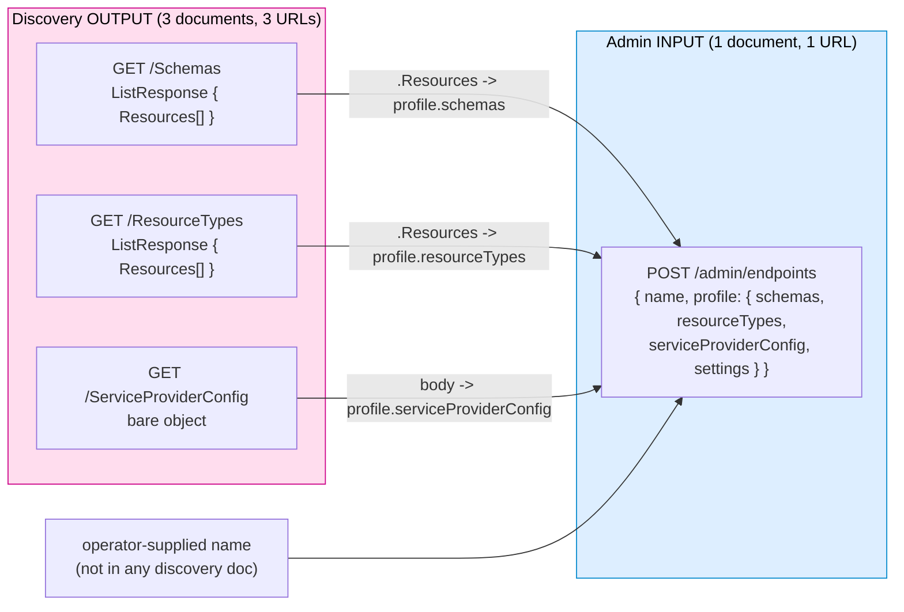
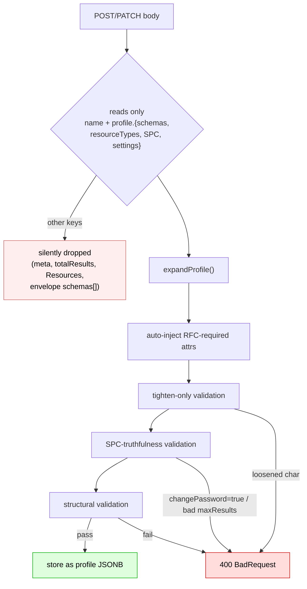

# Discovery Output -> Admin Endpoint Input: Interop & RFC Compliance Report

> **Document Purpose**: Tests the premise that SCIM discovery output (`/Schemas`, `/ResourceTypes`, `/ServiceProviderConfig`) - from a foreign SCIM server OR from SCIMServer itself - can be fed **as-is** into the admin endpoint provisioning API (`POST` / `PATCH /scim/admin/endpoints`). Also assesses whether SCIMServer's discovery APIs are RFC compliant.
>
> **Created**: June 1, 2026
> **Version**: current
> **RFC References**: RFC 7643 §5 (SPC), §6 (ResourceTypes), §7 (Schemas), §2.2 (default characteristics); RFC 7644 §3.4.2 (ListResponse), §4 (Discovery)

---

## Table of Contents

1. [Executive Summary & Verdicts](#1-executive-summary--verdicts)
2. [The Two Data Contracts](#2-the-two-data-contracts)
3. [Premise A - Foreign Server Discovery Output as-is](#3-premise-a---foreign-server-discovery-output-as-is)
4. [Premise B - SCIMServer's Own Discovery Output as-is](#4-premise-b---scimservers-own-discovery-output-as-is)
5. [Field-by-Field Difference Tables](#5-field-by-field-difference-tables)
6. [The Mechanical Transformation Required](#6-the-mechanical-transformation-required)
7. [RFC Compliance Assessment of Discovery APIs](#7-rfc-compliance-assessment-of-discovery-apis)
8. [Findings & Recommendations](#8-findings--recommendations)
9. [Source Map](#9-source-map)

---

## 1. Executive Summary & Verdicts

| Question | Verdict |
|---|---|
| Can **another SCIM server's** `/Schemas` + `/ResourceTypes` + `/ServiceProviderConfig` output be used **as-is** for `POST`/`PATCH /admin/endpoints`? | **NO** - structurally incompatible **and** can be rejected by validation. |
| Can **SCIMServer's own** discovery output be used **as-is** for `POST`/`PATCH /admin/endpoints`? | **NO (literally)** - same envelope/wrapper mismatch. **YES after a small mechanical re-assembly** - it then always passes validation. |
| Are SCIMServer's discovery APIs **RFC compliant**? | **YES** - RFC 7643 §5-§7 + RFC 7644 §4 conformant (per [DISCOVERY_ENDPOINTS_RFC_AUDIT.md](DISCOVERY_ENDPOINTS_RFC_AUDIT.md), all 6 historical gaps remediated). One cosmetic observation: `meta.location` is emitted as a relative path. |

**Root cause of the "not as-is" verdict (both premises):** the admin API does **not** consume RFC discovery documents. It consumes a single proprietary **shorthand profile envelope**:

```jsonc
{ "name": "...", "profile": { "schemas": [...], "resourceTypes": [...], "serviceProviderConfig": {...}, "settings": {...} } }
```

Discovery, by contrast, publishes **three separate documents at three URLs**, two of them wrapped in a SCIM `ListResponse`. The actual resource objects live in `Resources[]`, not at the top level. So even a perfect round-trip requires un-wrapping each `ListResponse`, dropping the `name`-less discovery envelopes, and re-nesting everything under a `profile` key with an operator-supplied `name`.



---

## 2. The Two Data Contracts

### 2.1 Discovery OUTPUT contract (what the server publishes)

Served by `EndpointScimDiscoveryController` -> `ScimDiscoveryService` from the stored `endpoint.profile` JSONB.

| Route | Envelope | Resource objects live in |
|---|---|---|
| `GET /scim/endpoints/{id}/Schemas` | `ListResponse` | `Resources[]` |
| `GET /scim/endpoints/{id}/ResourceTypes` | `ListResponse` | `Resources[]` |
| `GET /scim/endpoints/{id}/ServiceProviderConfig` | bare object | (the object itself) |

`ListResponse` shape (RFC 7644 §3.4.2):

```jsonc
{
  "schemas": ["urn:ietf:params:scim:api:messages:2.0:ListResponse"],
  "totalResults": 3, "startIndex": 1, "itemsPerPage": 3,
  "Resources": [ /* the Schema or ResourceType objects */ ]
}
```

Note the trap: the top-level `schemas` key here is the **envelope URN array**, *not* the list of schema objects.

### 2.2 Admin INPUT contract (what create/update consumes)

`CreateEndpointDto` / `UpdateEndpointDto` -> `validateAndExpandProfile`. Only **four** keys of `profile` are ever read - `schemas`, `resourceTypes`, `serviceProviderConfig`, `settings` (`ShorthandProfileInput`). Everything else is **silently ignored, never rejected**.



---

## 3. Premise A - Foreign Server Discovery Output as-is

**Verdict: NO.** Three independent blockers, any one of which is fatal.

### 3.1 Structural mismatch (always fatal)
- Discovery is **3 documents at 3 URLs**; admin wants **1 document**. They must be hand-assembled.
- `/Schemas` and `/ResourceTypes` are `ListResponse`-wrapped. If you POST the raw ListResponse, the admin API reads its top-level `schemas` key (= `["urn:...:ListResponse"]`, a string array) as `ShorthandSchemaInput[]`. That fails expansion/structural validation; `Resources[]` is ignored -> `MISSING_SCHEMAS` / `MISSING_RESOURCE_TYPES` -> **400**.
- No discovery document contains the required top-level **`name`**, and none is nested under **`profile`**.

### 3.2 Validation rejection (frequently fatal for foreign data)
Even after correct re-assembly, a foreign profile can be **rejected**:

| Foreign trait | Rule that rejects it | Error |
|---|---|---|
| An RFC attribute advertised **looser** than the RFC baseline (e.g. `userName` `required:false`, or `mutability` relaxed) | tighten-only validation (`runTightenOnlyValidation`) | `TIGHTEN_ONLY_VIOLATION` |
| `changePassword.supported: true` (SCIMServer hardcodes the capability to `false`) | SPC-truthfulness (`validateSpcTruthfulness`) | `SPC_UNIMPLEMENTED` |
| `filter.maxResults` outside 1..10000, or `bulk.maxOperations < 1` | SPC-truthfulness | `SPC_INVALID_VALUE` |
| A `resourceType.schema` (or extension URN) not present in the supplied `schemas[]` | structural | `RT_MISSING_SCHEMA` / `RT_MISSING_EXTENSION_SCHEMA` |
| A `resourceType` missing the `schemaExtensions` array entirely | structural loop dereferences it | TypeError -> 400 |

### 3.3 Semantic loss (silent)
- **`settings`** (the 16 behavioral flags) is **not an RFC concept** and is absent from any foreign discovery doc - the new endpoint silently gets defaults.
- Per-schema `meta`/`schemas` are **stripped** during expansion (the expander reconstructs each schema as only `{ id, name, description, attributes }`).
- On `serviceProviderConfig`, the input's `meta`, `schemas`, and `authenticationSchemes` are **ignored** - the server overrides them with its own constants on output. So a foreign server's auth schemes never carry over.

---

## 4. Premise B - SCIMServer's Own Discovery Output as-is

**Verdict: NO literally; YES after mechanical re-assembly.**

The *structural* blockers from §3.1 apply identically - our own `/Schemas` and `/ResourceTypes` are `ListResponse`-wrapped, the three docs live at three URLs, there is no `name`, and nothing is nested under `profile`. So a copy-paste of any single discovery response into `POST /admin/endpoints` fails.

**However**, the *validation* blockers from §3.2 do **not** fire on our own output, because the data SCIMServer publishes is already self-consistent:
- every RFC attribute is same-or-tighter than baseline (tighten-only passes),
- `changePassword.supported` is `false` and `filter.maxResults`/`bulk.maxOperations` are in range (SPC-truthful passes),
- every `resourceType.schema` + extension URN resolves within the published `schemas[]`, and `schemaExtensions` is always present (structural passes).

So once you **unwrap the two `ListResponse` envelopes** (take `.Resources`), **add a `name`**, and **nest under `profile`**, SCIMServer's own discovery output round-trips cleanly. The per-schema `meta`/`schemas` and the SPC `meta`/`schemas`/`authenticationSchemes` are dropped/overridden, but those are reconstructed identically on the next discovery read - so the round-trip is lossless for everything the admin contract actually governs. (`settings` is still absent from discovery and defaults on the new endpoint - the one true semantic gap even for self-round-trip.)

---

## 5. Field-by-Field Difference Tables

### 5.1 Top-level envelope

| Aspect | Discovery output | Admin input | Match? |
|---|---|---|:--:|
| Documents | 3 (Schemas, ResourceTypes, SPC) | 1 | NO |
| Wrapper for schema/RT lists | `ListResponse` (`Resources[]`) | bare array under `profile.schemas` / `profile.resourceTypes` | NO |
| `name` (endpoint id) | absent | **required** top-level | NO |
| `profile` nesting | absent (docs are top-level) | required | NO |
| `settings` | absent (not RFC) | optional under `profile` | partial |

### 5.2 Schema object

| Field | Discovery emits | Admin accepts | Notes |
|---|:--:|:--:|---|
| `id`, `name`, `description` | yes | yes | carried through |
| `attributes[]` (full RFC chars) | yes | yes | tolerated as `Partial<ScimSchemaAttribute>[]` |
| `meta` | yes (`{resourceType, location}`) | **stripped** | rebuilt as `{id,name,description,attributes}` |
| `schemas` (per-item envelope URN) | yes | **stripped** | re-injected on next read |

### 5.3 ResourceType object

| Field | Discovery emits | Admin accepts | Notes |
|---|:--:|:--:|---|
| `id`, `name`, `endpoint`, `description` | yes | yes | stored verbatim (no expansion) |
| `schema` (singular core URN) | yes | **required at runtime** | must exist in `schemas[]` else `RT_MISSING_SCHEMA` |
| `schemaExtensions[]` | yes | required (`[]` minimum) | absence -> TypeError |
| `meta`, `schemas` | yes | optional / passthrough | re-injected on next read |

### 5.4 ServiceProviderConfig object

| Field | Discovery emits | Admin accepts | Notes |
|---|:--:|:--:|---|
| `patch`/`bulk`/`filter`/`sort`/`etag`/`changePassword` | yes | yes (overlaid on defaults) | the only fields that round-trip |
| `documentationUri` | yes | yes | carried through |
| `meta` | yes | **ignored** -> server constant | not customizable via profile |
| `schemas` | yes | **ignored** -> server constant | not customizable via profile |
| `authenticationSchemes[]` | yes | **ignored** -> server constant | foreign auth schemes lost |

---

## 6. The Mechanical Transformation Required

To turn discovery output into a valid admin payload (works for self; works for foreign **only if** it also survives §3.2 validation):

```jsonc
// FROM three discovery responses:
//   schemasResp  = GET /Schemas            -> { ..., Resources: [ ...schemaObjs ] }
//   rtResp       = GET /ResourceTypes      -> { ..., Resources: [ ...rtObjs ] }
//   spcResp      = GET /ServiceProviderConfig -> { ...spcObj }

// TO one admin payload:
{
  "name": "my-new-endpoint",                 // operator-supplied; NOT in discovery
  "profile": {
    "schemas":              schemasResp.Resources,   // unwrap ListResponse
    "resourceTypes":        rtResp.Resources,        // unwrap ListResponse
    "serviceProviderConfig": spcResp,                // capability flags only survive
    "settings": { /* optional - choose behavioral flags; discovery has none */ }
  }
}
```

Key rules:
1. Use `.Resources`, **not** `.schemas`, for the schema/RT arrays.
2. Supply a `name`.
3. Nest everything under `profile`.
4. Expect `meta` / envelope `schemas` / SPC `authenticationSchemes` to be dropped (reconstructed by the server).
5. For **foreign** data, additionally pre-validate against tighten-only + SPC-truthfulness + RT-schema-resolution or expect a `400`.

---

## 7. RFC Compliance Assessment of Discovery APIs

SCIMServer's discovery APIs are **RFC compliant**. Summary (full detail in [DISCOVERY_ENDPOINTS_RFC_AUDIT.md](DISCOVERY_ENDPOINTS_RFC_AUDIT.md)):

| Requirement | RFC | Status |
|---|---|:--:|
| `/ServiceProviderConfig` returns a single object (no ListResponse), with all capability sub-objects + `authenticationSchemes` + `meta` | RFC 7643 §5 | PASS |
| `/ResourceTypes` returns `ListResponse`; `/ResourceTypes/{id}` returns a bare object | RFC 7643 §6 / RFC 7644 §3.4.2 | PASS |
| `/Schemas` returns `ListResponse`; `/Schemas/{urn}` returns a bare object | RFC 7643 §7 / RFC 7644 §3.4.2 | PASS |
| Each resource carries the correct `schemas` URN array + `meta.resourceType` | RFC 7643 §5-§7 | PASS |
| Attribute objects expose `name/type/multiValued/required/caseExact/mutability/returned/uniqueness/subAttributes/referenceTypes/canonicalValues` | RFC 7643 §7 | PASS |
| Discovery endpoints do **not** require authentication (`@Public()`) | RFC 7644 §4 | PASS |
| `application/scim+json` content type | RFC 7644 §3.1 | PASS |
| Read-only (GET only) | RFC 7644 §4 | PASS |

**Cosmetic observation (not a violation):** `meta.location` is emitted as a **relative** path (e.g. `/Schemas/{id}`) rather than an absolute URI. RFC 7643 §3.1 describes `meta.location` as "the URI of the resource"; absolute is conventional but relative is widely tolerated (Entra ID accepts it). Optional hardening, not a compliance gap.

---

## 8. Findings & Recommendations

| # | Finding | Severity | Recommendation |
|---|---|:--:|---|
| F1 | Admin API consumes a proprietary shorthand profile, not RFC discovery documents - so no discovery output is usable "as-is". | Info (by design) | Document the gap; do not change the contract. |
| F2 | `ListResponse` un-wrapping (`.Resources`) is the single most common foot-gun for would-be importers. | Medium | Add an `import` convenience that accepts the 3 discovery docs and performs §6 assembly server-side. |
| F3 | Unknown keys are silently dropped, never rejected - a malformed import looks like it "worked" but lost data. | Medium | Consider a `strict`/`warnUnknownKeys` mode echoing dropped top-level keys. |
| F4 | Foreign profiles can be rejected by tighten-only / SPC-truthfulness; the error path is correct but opaque to importers. | Low | Surface a dry-run validate endpoint (`POST /admin/endpoints?validateOnly=true`). |
| F5 | SPC `authenticationSchemes` / `meta` / `schemas` cannot be customized via profile (overridden by constants). | Low | Acceptable; note in operator docs. |
| F6 | `settings` is absent from discovery, so any import loses behavioral flags. | Info | Expected - settings are non-RFC; operator must choose them. |

---

## 9. Source Map

| Concern | File |
|---|---|
| Discovery controller (per-endpoint) | `api/src/modules/scim/controllers/endpoint-scim-discovery.controller.ts` |
| Discovery service (builds ListResponse + injects meta) | `api/src/modules/scim/discovery/scim-discovery.service.ts` |
| Static SPC / schema constants (overrides) | `api/src/modules/scim/discovery/scim-schemas.constants.ts` |
| Profile / shorthand types | `api/src/modules/scim/endpoint-profile/endpoint-profile.types.ts` |
| Expand pipeline (strips per-schema meta) | `api/src/modules/scim/endpoint-profile/auto-expand.service.ts` |
| Validate + expand (tighten-only / SPC-truth / structural) | `api/src/modules/scim/endpoint-profile/endpoint-profile.service.ts` |
| Create DTO | `api/src/modules/endpoint/dto/create-endpoint.dto.ts` |
| Update DTO + merge (`mergeProfilePartial`) | `api/src/modules/endpoint/dto/update-endpoint.dto.ts`, `api/src/modules/endpoint/services/endpoint.service.ts` |
| Prior RFC compliance audit | `docs/DISCOVERY_ENDPOINTS_RFC_AUDIT.md` |

---

> **Bottom line:** Discovery output is **not** drop-in input for endpoint provisioning in either direction. SCIMServer's own output round-trips after a 3-step mechanical re-assembly (unwrap `ListResponse` -> add `name` -> nest under `profile`); foreign output additionally has to survive tighten-only + SPC-truthfulness + structural validation. The discovery APIs themselves are RFC 7643/7644 compliant.
