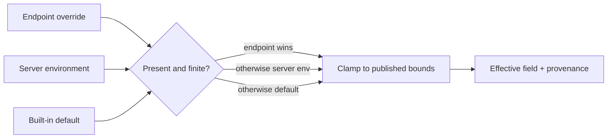

# Effective WIF/JWKS egress policy

> **Status:** Verified on dev - **Last verified:** 2026-09-24 - **Product version:** `0.55.32`

## Purpose

The Connect WIF settings panel shows the values the runtime actually enforces, not only raw endpoint overrides. Every field carries its effective value, configured endpoint override, source, unit, bounds, and clamping information.

## Resolution model



The numerical result is derived from the same `resolveServerEgressDefaults()` and `mergeEgressPolicy()` functions used by `ExternalJwksValidatorService`. The read model cannot advertise a value different from enforcement.

Cache, single-flight, stale fallback, background refresh, unknown-kid throttling, and startup prewarm are partitioned by JWKS URI plus the complete effective policy. Two endpoints may trust the same URI without the stricter endpoint inheriting keys fetched under the other endpoint's looser TTL, size, key-count, retry, refresh, or stale limits. Redirect resolution remains shared by URI because it changes only the already-allowlisted network destination, not policy enforcement; its LRU memory is bounded to the global maximum cache-entry bound. A zero cache TTL expires immediately, including within the fetch millisecond.

## API

`GET /scim/admin/endpoints/{endpointId}/egress-policy` returns exactly 11 fields:

- `timeoutMs`
- `retries`
- `retryBackoffMs`
- `cacheMaxAgeMs`
- `totalDeadlineMs`
- `maxResponseBytes`
- `maxKeys`
- `maxCacheEntries`
- `refreshIntervalMs`
- `unknownKidMinIntervalMs`
- `staleIfErrorMs`

Each field has this shape:

```json
{
  "effective": 1200,
  "configured": 1200,
  "source": "endpoint",
  "unit": "ms",
  "min": 100,
  "max": 60000,
  "clamped": false
}
```

When a requested server or endpoint value is adjusted, `clamped:true` and `requested` explain the difference. The route is assembled from the closed egress specification and cannot expose secrets, database URLs, or the JWKS host allowlist.

## Editing

Only WIF/JWKS numeric settings use the transactional editor:

- **Edit** opens a draft from configured values, or the effective value when inherited.
- **Save** sends only changed overrides.
- **Cancel** discards every draft and reset marker.
- **Reset to inherit** marks one configured endpoint override for removal; it persists only on Save.

Endpoint PATCH uses `null` as an explicit per-key remove operation. The shared profile merge removes that key while preserving every sibling setting and every other profile section. Omitting a key still means no change.

## UI contract

View mode displays:

- effective value with unit;
- source: Endpoint override, Server environment, or Built-in default;
- configured endpoint value when present;
- inclusive runtime bounds;
- requested and effective values when clamped.

The panel remains within the page at a measured 900 px viewport.

## Validation

| Layer | Evidence |
|---|---|
| Resolver/service/controller/cache unit | 160 focused API tests plus 90 JWKS/provider/wiring tests pass; shared-URI strict-TTL, strict-key-cap, per-policy refresh/prewarm, redirect-bound, and zero-TTL negative controls are locked |
| API E2E | Endpoint override, reset, inherited clamping, and response allowlist pass |
| Web Vitest | 99 focused settings and Connect tests; 1,538 full coverage tests pass |
| Playwright | 1/1 real Edit/Save/Cancel/Reset journey with 900 px bounds |
| Local live | 1,524/1,524; new section T1-T8 passes |
| Builds | API and web production builds pass |

PR #175 merged as `566ebd45`; v0.55.32 is verified on dev with live 1,524/1,524 and Playwright 242 passed / 4 intentionally skipped / 0 failed. Canary and customer prod are unchanged.
