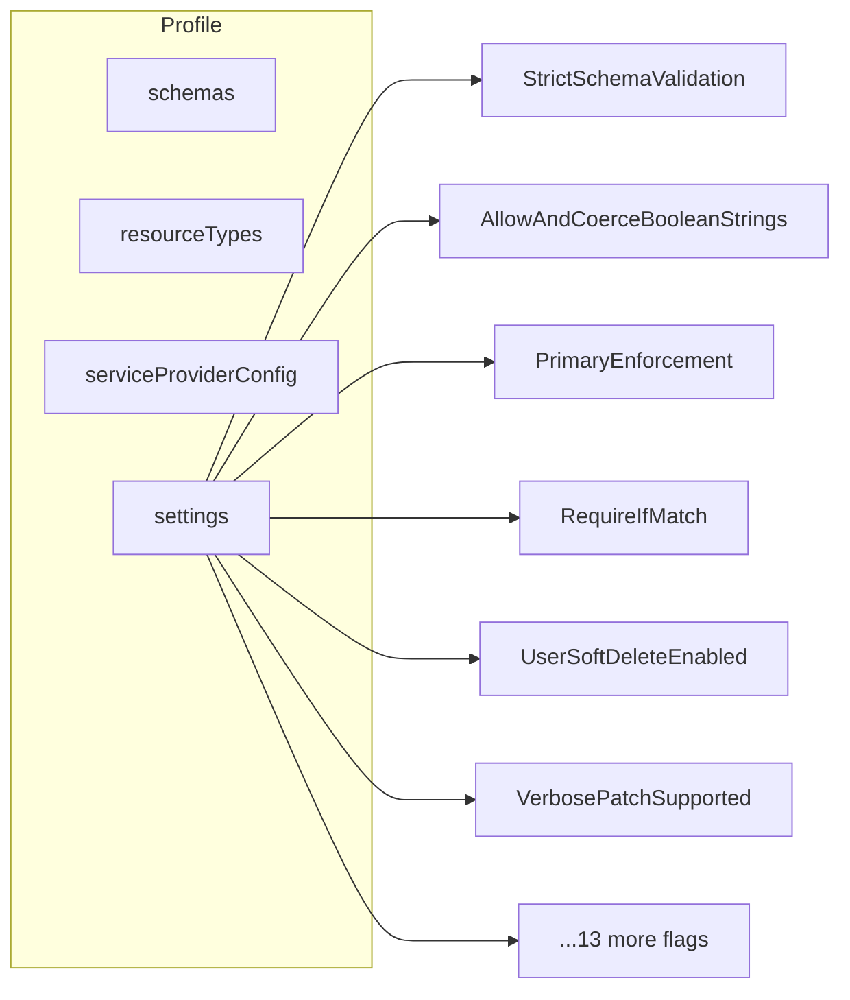

# Endpoint Configuration Flags Reference

> **Version:** 0.38.0 - **Updated:** April 24, 2026  
> **Source of truth:** [endpoint-config.interface.ts](../api/src/modules/endpoint/endpoint-config.interface.ts)  
> 16 flags: 13 boolean + 1 log level + 1 tri-state string + 1 boolean (logFile)

---

## Table of Contents

- [Overview](#overview)
- [How to Set Flags](#how-to-set-flags)
- [Flag Reference](#flag-reference)
- [Preset Defaults](#preset-defaults)
- [Flag Details](#flag-details)
- [Deprecated Flags](#deprecated-flags)

---

## Overview

Every endpoint has a `profile.settings` object containing behavioral configuration flags. These flags control SCIM protocol behavior, validation strictness, authentication, logging, and compatibility features.

Settings are part of the endpoint profile and can be:
- Set at creation via `profilePreset` (inherits preset defaults)
- Set at creation via inline `profile.settings`
- Updated at runtime via PATCH



---

## How to Set Flags

### At Endpoint Creation

```bash
curl -X POST http://localhost:8080/scim/admin/endpoints \
  -H "Authorization: Bearer changeme-scim" \
  -H "Content-Type: application/json" \
  -d '{
    "name": "my-endpoint",
    "profilePreset": "entra-id",
    "profile": {
      "settings": {
        "RequireIfMatch": true,
        "logLevel": "DEBUG"
      }
    }
  }'
```

### Update at Runtime

```bash
curl -X PATCH http://localhost:8080/scim/admin/endpoints/{id} \
  -H "Authorization: Bearer changeme-scim" \
  -H "Content-Type: application/json" \
  -d '{
    "profile": {
      "settings": {
        "VerbosePatchSupported": true,
        "PrimaryEnforcement": "reject"
      }
    }
  }'
```

Settings are **deep-merged** - only specified flags are updated, others remain unchanged.

---

## Flag Reference

| # | Flag | Type | Default | Category |
|---|------|------|---------|----------|
| 1 | [`StrictSchemaValidation`](#strictschemavalidation) | boolean | `true` | Validation |
| 2 | [`AllowAndCoerceBooleanStrings`](#allowandcoercebooleanstrings) | boolean | `true` | Compatibility |
| 3 | [`PrimaryEnforcement`](#primaryenforcement) | string | `passthrough` | Validation |
| 4 | [`RequireIfMatch`](#requireifmatch) | boolean | `false` | Concurrency |
| 5 | [`UserSoftDeleteEnabled`](#usersoftdeleteenabled) | boolean | `true` | Delete Behavior |
| 6 | [`UserHardDeleteEnabled`](#userharddeleteenabled) | boolean | `true` | Delete Behavior |
| 7 | [`GroupHardDeleteEnabled`](#groupharddeleteenabled) | boolean | `true` | Delete Behavior |
| 8 | [`MultiMemberPatchOpForGroupEnabled`](#multimemberpatchopforgroupenabled) | boolean | `true` | PATCH Behavior |
| 9 | [`PatchOpAllowRemoveAllMembers`](#patchopallowremoveallmembers) | boolean | `false` | PATCH Behavior |
| 10 | [`VerbosePatchSupported`](#verbosepatchsupported) | boolean | `false` | PATCH Behavior |
| 11 | [`IgnoreReadOnlyAttributesInPatch`](#ignorereadonlyattributesinpatch) | boolean | `false` | PATCH Behavior |
| 12 | [`IncludeWarningAboutIgnoredReadOnlyAttribute`](#includewarningaboutignoredreadonlyattribute) | boolean | `false` | PATCH Behavior |
| 13 | [`SchemaDiscoveryEnabled`](#schemadiscoveryenabled) | boolean | `true` | Discovery |
| 14 | [`PerEndpointCredentialsEnabled`](#perendpointcredentialsenabled) | boolean | `false` | Authentication |
| 15 | [`logLevel`](#loglevel) | string | (global) | Logging |
| 16 | [`logFileEnabled`](#logfileenabled) | boolean | `true` | Logging |

---

## Preset Defaults

How each preset overrides the central defaults:

| Flag | Central Default | entra-id | entra-id-minimal | rfc-standard | minimal | user-only | user-only-with-custom-ext |
|------|----------------|----------|-----------------|-------------|---------|-----------|---------------------------|
| StrictSchemaValidation | true | true | true | true | true | true | true |
| AllowAndCoerceBooleanStrings | true | **true** | **true** | true | true | true | true |
| PrimaryEnforcement | passthrough | **normalize** | **normalize** | **reject** | passthrough | passthrough | passthrough |
| RequireIfMatch | false | false | false | false | false | false | false |
| MultiMemberPatchOpForGroupEnabled | true | **true** | true | true | true | true | true |
| PatchOpAllowRemoveAllMembers | false | **true** | false | false | false | false | false |
| VerbosePatchSupported | false | **true** | false | false | false | false | false |

All other flags use central defaults across all presets.

---

## Flag Details

### StrictSchemaValidation

**Type:** boolean | **Default:** `true` | **Category:** Validation

When enabled, validates that extension URNs present in the request body are also listed in the `schemas[]` array. This enforces RFC 7643 S3.1 which states that `schemas` MUST contain the URIs of all schema classes present.

```mermaid
flowchart TD
    A[Incoming POST/PUT] --> B{StrictSchemaValidation?}
    B -->|true| C{Extension data in body?}
    C -->|Yes| D{URN in schemas[] array?}
    D -->|Yes| E[Allow]
    D -->|No| F[400 invalidValue<br>Extension URN missing from schemas]
    C -->|No| E
    B -->|false| E
```

**Example error:**

```json
{
  "schemas": ["urn:ietf:params:scim:api:messages:2.0:Error"],
  "status": "400",
  "scimType": "invalidValue",
  "detail": "Extension URN 'urn:ietf:params:scim:schemas:extension:enterprise:2.0:User' found in body but not in schemas[] array"
}
```

---

### AllowAndCoerceBooleanStrings

**Type:** boolean | **Default:** `true` | **Category:** Compatibility

Coerces string representations of booleans (`"True"`, `"False"`, `"true"`, `"false"`) to native boolean values. Required for Entra ID compatibility, which sends `"True"` instead of `true`.

**Before coercion:** `{ "active": "True" }`
**After coercion:** `{ "active": true }`

Applies to all boolean fields in POST, PUT, and PATCH request bodies, including nested extension attributes.

---

### PrimaryEnforcement

**Type:** string (tri-state) | **Default:** `passthrough` | **Category:** Validation

Controls how the `primary: true` sub-attribute is handled on multi-valued attributes (emails, phoneNumbers, etc.) per RFC 7643 S2.4.

| Value | Behavior |
|-------|----------|
| `passthrough` | No enforcement. Multiple `primary: true` values allowed |
| `normalize` | Auto-normalize: if multiple `primary: true`, keep only the last one. Applied on POST, PUT, and PATCH post-merge |
| `reject` | Strict: return 400 if request contains multiple `primary: true` values for the same multi-valued attribute |

**Preset defaults:** entra-id/entra-id-minimal = `normalize`, rfc-standard = `reject`

```json
{
  "emails": [
    { "value": "work@example.com", "type": "work", "primary": true },
    { "value": "home@example.com", "type": "home", "primary": true }
  ]
}
```

| Mode | Result |
|------|--------|
| `passthrough` | Both stored as-is |
| `normalize` | Only `home@example.com` keeps `primary: true` |
| `reject` | 400 error: "Multiple primary values" |

---

### RequireIfMatch

**Type:** boolean | **Default:** `false` | **Category:** Concurrency

When enabled, mandates the `If-Match` header on all PUT, PATCH, and DELETE operations. Prevents concurrent modification without optimistic locking.

**When enabled and If-Match missing:**

```json
{
  "schemas": ["urn:ietf:params:scim:api:messages:2.0:Error"],
  "status": "412",
  "detail": "If-Match header is required for this endpoint"
}
```

**When If-Match doesn't match:**

```json
{
  "schemas": ["urn:ietf:params:scim:api:messages:2.0:Error"],
  "status": "412",
  "scimType": "versionMismatch",
  "detail": "ETag mismatch: expected W/\"2\", got W/\"1\""
}
```

---

### UserSoftDeleteEnabled

**Type:** boolean | **Default:** `true` | **Category:** Delete Behavior

When enabled, a PATCH operation that sets `active: false` will mark the user as soft-deleted (sets `deletedAt` timestamp) rather than permanently removing it. The user remains in the database but is treated as inactive.

Soft-deleted users can be re-activated via PATCH `active: true`.

---

### UserHardDeleteEnabled

**Type:** boolean | **Default:** `true` | **Category:** Delete Behavior

When enabled, DELETE requests permanently remove the user from the database. When disabled, DELETE returns 400.

---

### GroupHardDeleteEnabled

**Type:** boolean | **Default:** `true` | **Category:** Delete Behavior

When enabled, DELETE requests permanently remove the group and all membership records.

---

### MultiMemberPatchOpForGroupEnabled

**Type:** boolean | **Default:** `true` | **Category:** PATCH Behavior

When enabled, allows adding or removing multiple members in a single PATCH operation:

```json
{
  "op": "add",
  "path": "members",
  "value": [
    { "value": "user-id-1" },
    { "value": "user-id-2" },
    { "value": "user-id-3" }
  ]
}
```

When disabled, only single-member operations are allowed per PATCH op.

---

### PatchOpAllowRemoveAllMembers

**Type:** boolean | **Default:** `false` | **Category:** PATCH Behavior

When enabled, allows removing all members from a group via:

```json
{ "op": "remove", "path": "members" }
```

When disabled (default), this operation returns 400 to prevent accidental mass removal.

---

### VerbosePatchSupported

**Type:** boolean | **Default:** `false` | **Category:** PATCH Behavior

When enabled, supports dot-notation PATCH paths:

```json
{ "op": "replace", "path": "name.givenName", "value": "Jane" }
```

Without this flag, only standard paths are supported (`"name"` with complex value, or valuePath syntax `"name[formatted eq \"old\"]"`).

---

### IgnoreReadOnlyAttributesInPatch

**Type:** boolean | **Default:** `false` | **Category:** PATCH Behavior

When enabled, PATCH operations targeting readOnly attributes (`id`, `meta`, `groups`) are silently stripped instead of returning 400. Useful for clients that send full resource representations in PATCH.

---

### IncludeWarningAboutIgnoredReadOnlyAttribute

**Type:** boolean | **Default:** `false` | **Category:** PATCH Behavior

When enabled and readOnly attributes are stripped from requests, includes a warning in the response detailing which attributes were ignored.

---

### SchemaDiscoveryEnabled

**Type:** boolean | **Default:** `true` | **Category:** Discovery

When enabled, endpoint-scoped discovery endpoints respond with the endpoint's schema configuration:
- `GET /scim/endpoints/{id}/Schemas`
- `GET /scim/endpoints/{id}/ResourceTypes`
- `GET /scim/endpoints/{id}/ServiceProviderConfig`

When disabled, these endpoints return 404.

---

### PerEndpointCredentialsEnabled

**Type:** boolean | **Default:** `false` | **Category:** Authentication

When enabled, activates the per-endpoint credential tier in the authentication chain. SCIM operations on this endpoint can be authenticated using endpoint-scoped bearer tokens created via the Admin Credential API.

Requires credential creation via `POST /scim/admin/endpoints/{id}/credentials`.

---

### logLevel

**Type:** string | **Default:** (global level) | **Category:** Logging

Overrides the global log level for this specific endpoint. Valid values: `TRACE`, `DEBUG`, `INFO`, `WARN`, `ERROR`, `FATAL`.

Useful for debugging a specific tenant without increasing log verbosity for all traffic.

---

### logFileEnabled

**Type:** boolean | **Default:** `true` | **Category:** Logging

When enabled, creates a dedicated log file for this endpoint under `logs/endpoints/{endpointId}/`.

---

## Deprecated Flags

These flags are recognized for backward compatibility but should not be used in new configurations:

| Deprecated Flag | Replacement |
|----------------|-------------|
| `SoftDeleteEnabled` | `UserSoftDeleteEnabled` |
| `MultiOpPatchRequestGroupAddMembersEnabled` | `MultiMemberPatchOpForGroupEnabled` |
| `MultiOpPatchRequestGroupRemoveMembersEnabled` | `MultiMemberPatchOpForGroupEnabled` |
| `ReprovisionOnConflictForSoftDeletedResource` | Removed (always re-provisions) |
