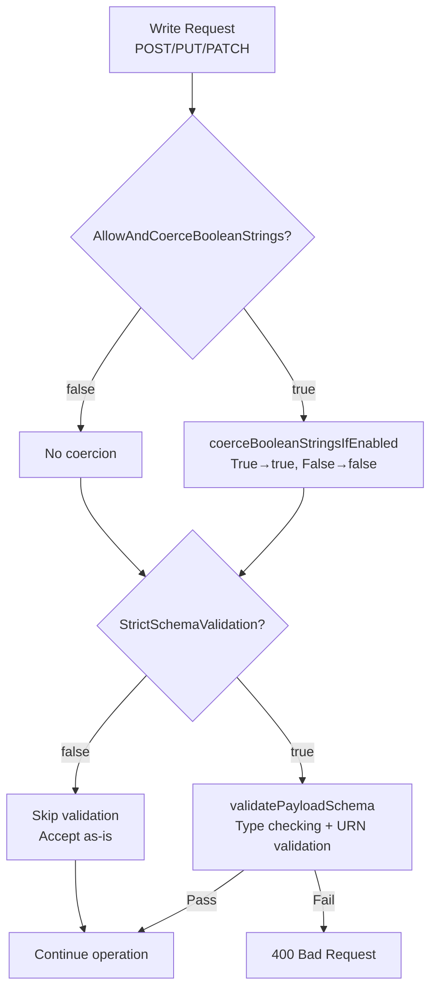
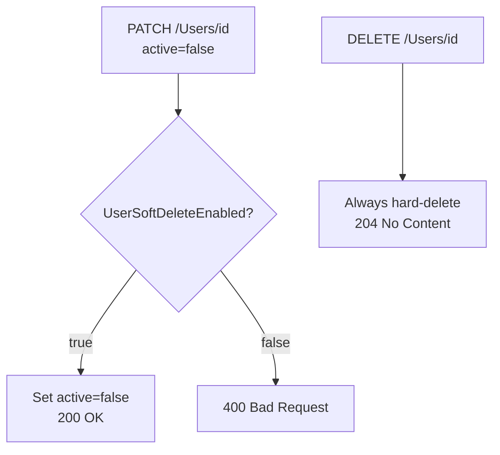
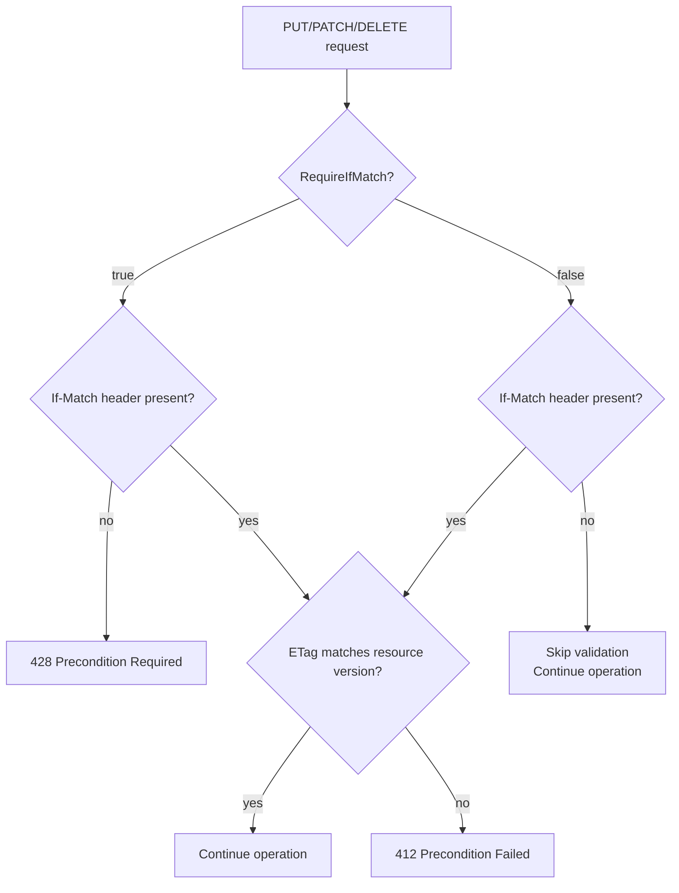
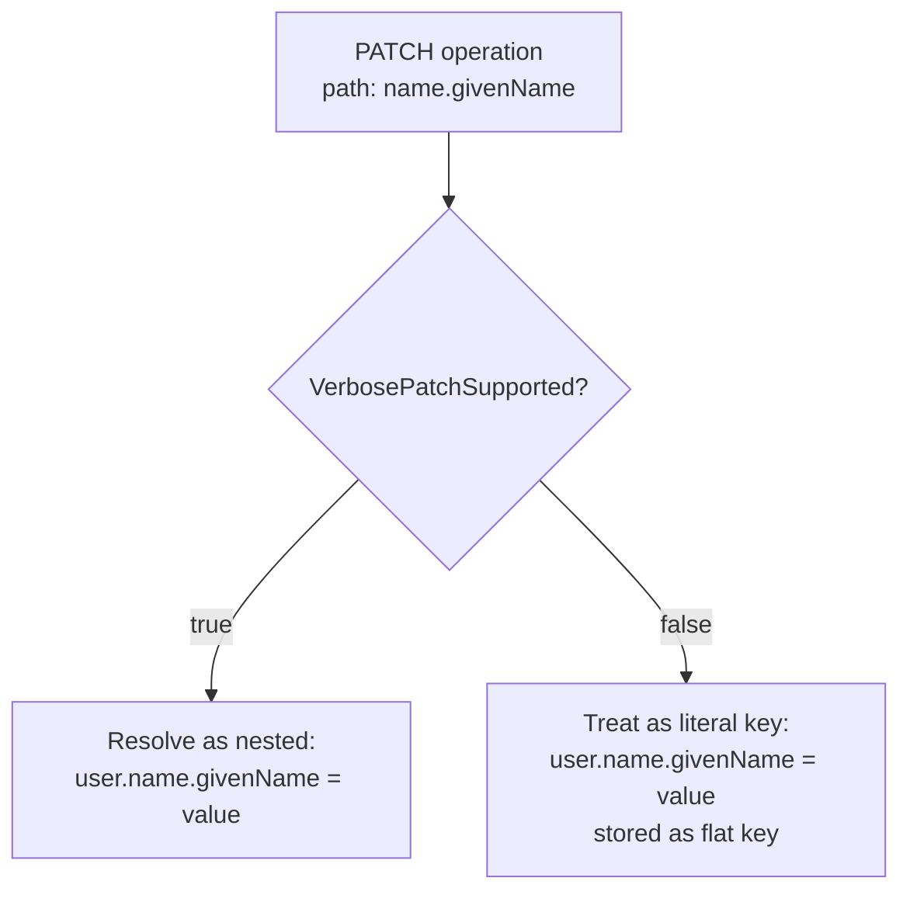
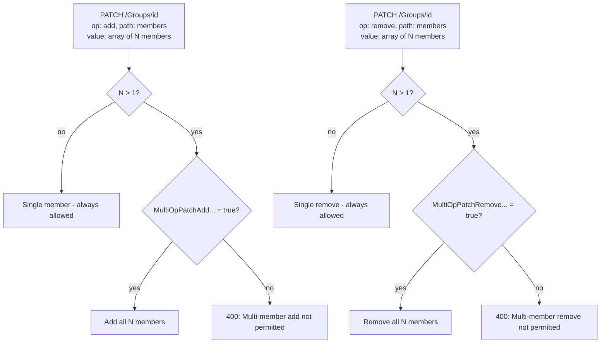
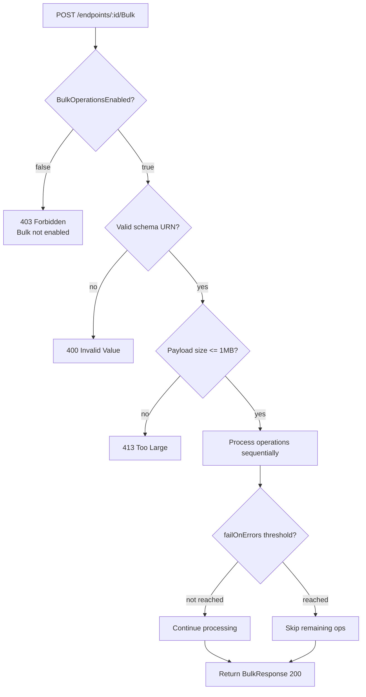
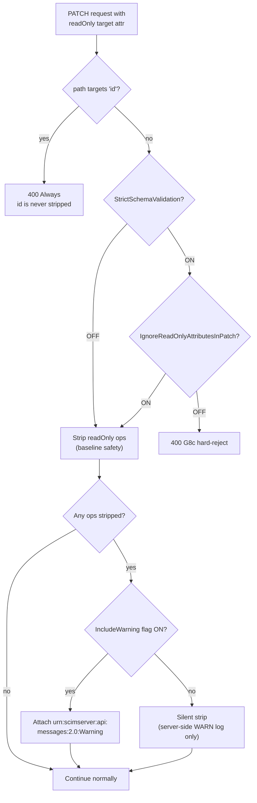
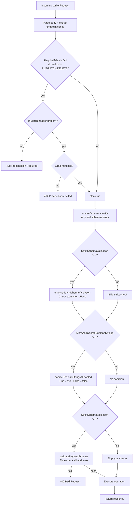
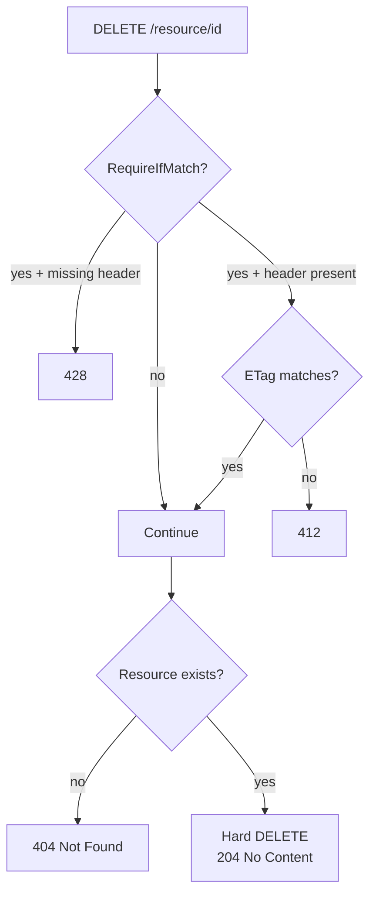
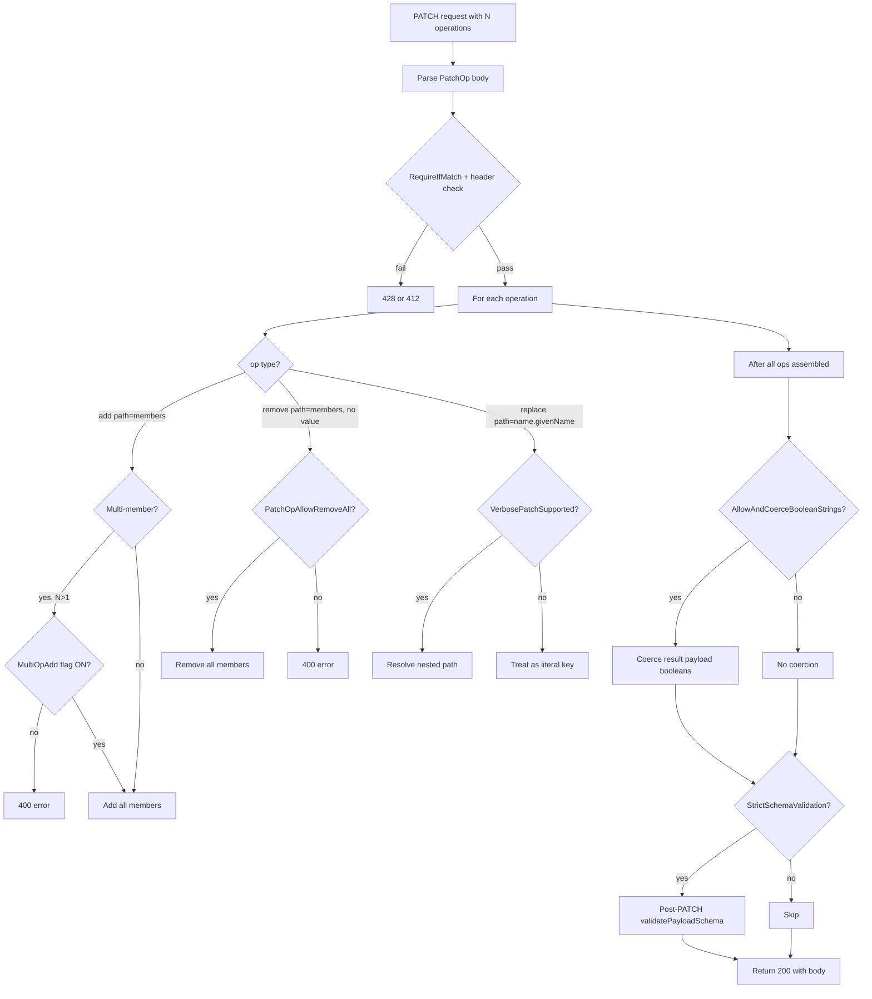

# Endpoint Configuration Flags — Complete Reference

> **Status:** Living document · **Last Updated:** 2026-04-09
>
> Authoritative reference for all per-endpoint configuration flags in SCIMServer.
> Covers flag definitions, defaults, type handling, precedence rules, applicability matrices,
> flag interaction combinations, request/response examples, and decision-flow diagrams.
>
> **Settings v7 (v0.34.0):** 4 flags removed, 5 added, 2 defaults changed. See [CHANGELOG.md](../CHANGELOG.md) for migration guide.

---

> **⚠️ v0.28.0 Migration Notice:** The legacy `"config": { ... }` field has been **removed** from the admin endpoint API. All per-endpoint settings are now managed through `"profile": { "settings": { ... } }`. The JSON examples in Sections 4, 7, 9, and 10 of this document may still show the legacy `"config"` format for historical reference — when using these examples, replace:
> ```json
> { "config": { "FlagName": "True" } }
> ```
> with:
> ```json
> { "profile": { "settings": { "FlagName": "True" } } }
> ```
> Capabilities like `BulkOperationsEnabled` and `CustomResourceTypesEnabled` are now **derived** from the profile structure (see sections 4.10 and 4.11).

---

## Table of Contents

1. [Overview](#1-overview)
2. [Flag Summary Table](#2-flag-summary-table)
3. [Flag Resolution Logic](#3-flag-resolution-logic)
4. [Individual Flag Reference](#4-individual-flag-reference)
   - 4.1 [AllowAndCoerceBooleanStrings](#41-allowandcoercebooleanstrings)
   - 4.2 [StrictSchemaValidation](#42-strictschemavalidation)
   - 4.3 [UserSoftDeleteEnabled](#43-usersoft-deleteenabled) *(replaces SoftDeleteEnabled)*
   - 4.4 [UserHardDeleteEnabled](#44-userharddeleteenabled) *(new in v0.33.0)*
   - 4.5 [GroupHardDeleteEnabled](#45-groupharddeleteenabled) *(new in v0.33.0)*
   - 4.6 [MultiMemberPatchOpForGroupEnabled](#46-multimemberpatchopforgroupenabled) *(replaces MultiOpPatchRequest…)*
   - 4.7 [SchemaDiscoveryEnabled](#47-schemadiscoveryenabled) *(new in v0.33.0)*
   - 4.8 [VerbosePatchSupported](#48-verbosepatchsupported)
   - 4.9 [PatchOpAllowRemoveAllMembers](#49-patchopallowremoveallmembers)
   - 4.10 [RequireIfMatch](#410-requireifmatch)
   - 4.11 [PerEndpointCredentialsEnabled](#411-perendpointcredentialsenabled)
   - 4.12 [IncludeWarningAboutIgnoredReadOnlyAttribute](#412-includewarningaboutignoredreadonlyattribute)
   - 4.13 [IgnoreReadOnlyAttributesInPatch](#413-ignorereadonlyattributesinpatch)
   - 4.14 [logFileEnabled](#414-logfileenabled) *(new in v0.33.0)*
   - 4.15 [logLevel](#415-loglevel)
   - 4.16 [CustomResourceTypesEnabled](#416-customresourcetypesenabled) *(derived)*
   - 4.17 [BulkOperationsEnabled](#417-bulkoperationsenabled) *(derived)*
5. [Flag Applicability Matrix](#5-flag-applicability-matrix)
6. [Flag Interaction & Precedence](#6-flag-interaction--precedence)
7. [Flag Combination Examples](#7-flag-combination-examples)
8. [Decision Flow Diagrams](#8-decision-flow-diagrams)
9. [Admin API — Setting Flags](#9-admin-api--setting-flags)
10. [Microsoft Entra ID Recommended Config](#10-microsoft-entra-id-recommended-config)

---

## 1. Overview

SCIMServer supports **14 per-endpoint configuration flags** (plus 1 per-endpoint log level override) that control SCIM protocol behavior.

> **v0.28.0 Profile Model:** Of the 14 flags, **12 boolean settings + logLevel** are persisted in `profile.settings` (the `EndpointProfile.settings` JSONB). Two capabilities are **derived at runtime** from the profile structure:
> - **`CustomResourceTypesEnabled`** → derived from `profile.resourceTypes` entries beyond User/Group (decision D9)
> - **`BulkOperationsEnabled`** → derived from `profile.serviceProviderConfig.bulk.supported` (decision D8)
>
> The `EndpointConfig` interface and `validateEndpointConfig()` still accept all 14 flags for backward compatibility with the legacy `config` JSON path.

### Key Concepts

- **Per-endpoint isolation**: Each endpoint has its own config. Flag changes on one endpoint do not affect others.
- **Boolean flag values**: Flags accept `true`, `false`, `"True"`, `"False"`, `"1"`, `"0"`. Parsing is case-insensitive.
- **Absent = default**: If a flag is not set, it uses its default value.
- **Two helper functions**: `getConfigBoolean()` (defaults absent → `false`) and `getConfigBooleanWithDefault()` (custom default for flags like `AllowAndCoerceBooleanStrings` that default to `true`).

### Source of Truth

All flag constants, interface definitions, defaults, validation, and helpers are defined in:

```
api/src/modules/endpoint/endpoint-config.interface.ts
```

---

## 2. Flag Summary Table

| # | Flag Name | Constant Key | Default | Type | Scope | Description |
|---|-----------|-------------|---------|------|-------|-------------|
| 1 | `AllowAndCoerceBooleanStrings` | `ALLOW_AND_COERCE_BOOLEAN_STRINGS` | **`true`** | boolean | All write paths | Coerce boolean strings ("True"/"False") → native booleans before validation |
| 2 | `StrictSchemaValidation` | `STRICT_SCHEMA_VALIDATION` | **`true`** | boolean | POST, PUT, PATCH | Enforce extension schema URN validation + type checking |
| 3 | `UserSoftDeleteEnabled` | `USER_SOFT_DELETE_ENABLED` | **`true`** | boolean | PATCH | PATCH {active:false} deactivates user (default true). When false, PATCH active=false → 400 error. |
| 4 | `UserHardDeleteEnabled` | `USER_HARD_DELETE_ENABLED` | **`true`** | boolean | DELETE (Users) | Allow permanent user deletion. When false, DELETE Users returns 400. |
| 5 | `GroupHardDeleteEnabled` | `GROUP_HARD_DELETE_ENABLED` | **`true`** | boolean | DELETE (Groups) | Allow permanent group deletion. When false, DELETE Groups returns 400. |
| 6 | `MultiMemberPatchOpForGroupEnabled` | `MULTI_MEMBER_PATCH_OP_FOR_GROUP_ENABLED` | **`true`** | boolean | PATCH (Groups) | Allow multi-member add/remove in single PATCH operation |
| 7 | `SchemaDiscoveryEnabled` | `SCHEMA_DISCOVERY_ENABLED` | **`true`** | boolean | GET | Enable endpoint-scoped discovery endpoints (/Schemas, /ResourceTypes, /ServiceProviderConfig) |
| 8 | `VerbosePatchSupported` | `VERBOSE_PATCH_SUPPORTED` | `false` | boolean | PATCH | Dot-notation path resolution (`name.givenName`) |
| 9 | `PatchOpAllowRemoveAllMembers` | `PATCH_OP_ALLOW_REMOVE_ALL_MEMBERS` | `false` | boolean | PATCH (Groups) | Allow removing all members via `path=members` |
| 10 | `RequireIfMatch` | `REQUIRE_IF_MATCH` | `false` | boolean | PUT, PATCH, DELETE | Require If-Match header (428 if missing) |
| 11 | `PerEndpointCredentialsEnabled` | `PER_ENDPOINT_CREDENTIALS_ENABLED` | `false` | boolean | Auth (all requests) | Enable per-endpoint bearer token credentials |
| 12 | `IncludeWarningAboutIgnoredReadOnlyAttribute` | `INCLUDE_WARNING_ABOUT_IGNORED_READONLY_ATTRIBUTE` | `false` | boolean | POST, PUT, PATCH | Attach warning URN when readOnly attributes stripped |
| 13 | `IgnoreReadOnlyAttributesInPatch` | `IGNORE_READONLY_ATTRIBUTES_IN_PATCH` | `false` | boolean | PATCH | Strip+warn instead of 400 for readOnly PATCH ops |
| 14 | `logFileEnabled` | `LOG_FILE_ENABLED` | `false` | boolean | Logging | Enable per-endpoint log file under `logs/endpoints/` |
| 15 | `logLevel` | `LOG_LEVEL` | *(unset)* | string/number | All requests | Per-endpoint log level override |
| — | `CustomResourceTypesEnabled` | *derived* | `false` | boolean | Admin API, SCIM CRUD | **Derived:** Implied by custom entries in `profile.resourceTypes` |
| — | `BulkOperationsEnabled` | *derived* | `false` | boolean | POST /Bulk | **Derived:** Implied by `profile.serviceProviderConfig.bulk.supported` |

> **Settings v7 defaults:** `AllowAndCoerceBooleanStrings`, `StrictSchemaValidation`, `UserSoftDeleteEnabled`, `UserHardDeleteEnabled`, `GroupHardDeleteEnabled`, `MultiMemberPatchOpForGroupEnabled`, `SchemaDiscoveryEnabled` default to `true`. All others default to `false`.
>
> **Deprecated flags (v0.33.0 settings v7 clean break):** `SoftDeleteEnabled` (replaced by `UserSoftDeleteEnabled` + `UserHardDeleteEnabled`), `ReprovisionOnConflictForSoftDeletedResource` (removed — POST collision always 409), `MultiOpPatchRequestAddMultipleMembersToGroup` and `MultiOpPatchRequestRemoveMultipleMembersFromGroup` (replaced by `MultiMemberPatchOpForGroupEnabled`).

---

## 2.1 Default Behavior — What Happens Out of the Box

**When you create an endpoint with no explicit settings** (e.g., `POST /admin/endpoints` with just `{ "name": "my-tenant" }` or with `{ "name": "my-tenant", "profilePreset": "entra-id" }`), the server applies the **`entra-id` preset** as the default profile. This preset explicitly sets 5 flags:

| Flag | Value in `entra-id` preset | Why |
|------|----------------------------|-----|
| `AllowAndCoerceBooleanStrings` | `True` | Entra sends `"True"`/`"False"` strings for boolean attributes |
| `StrictSchemaValidation` | `True` | Enforce schema compliance |
| `VerbosePatchSupported` | `True` | Entra uses dot-notation PATCH paths like `name.givenName` |
| `MultiMemberPatchOpForGroupEnabled` | `True` | Entra sends multi-member add/remove operations |

All other flags resolve to their defaults. Settings v7 defaults mean **out of the box**:

- ✅ **PATCH active=false deactivates users** (UserSoftDeleteEnabled = true) — PATCH {active:false} sets user inactive. DELETE always hard-deletes.
- ✅ **Hard delete also available** (UserHardDeleteEnabled = true) — DELETE permanently removes when invoked
- ✅ **Schema validation is strict** (StrictSchemaValidation = true) — extension URNs required in `schemas[]`
- ✅ **`If-Match` is optional** (RequireIfMatch = false) — ETag validated when present but not required
- ✅ **ReadOnly attributes silently stripped** — no warning headers, no 400 errors
- ✅ **Only global auth** (PerEndpointCredentialsEnabled = false) — shared secret / OAuth JWT only
- ✅ **409 on all POST conflicts** — no reprovision; POST collision always returns 409
- ✅ **Discovery endpoints enabled** (SchemaDiscoveryEnabled = true)
- ✅ **No Bulk operations** — disabled unless profile SPC says `bulk.supported: true`

### Per-Preset Default Comparison

| Flag | `entra-id` (default) | `rfc-standard` | `minimal` | `user-only-with-custom-ext` |
|------|---------------------|----------------|-----------|-----------|
| AllowAndCoerceBooleanStrings | **True** | *true (default)* | *true (default)* | *true (default)* |
| VerbosePatchSupported | **True** | false | false | false |
| MultiOpPatchRequest…Add | **True** | false | false | false |
| MultiOpPatchRequest…Remove | **True** | false | false | false |
| PatchOpAllowRemoveAllMembers | **True** | *true (default)* | *true (default)* | *true (default)* |
| UserSoftDeleteEnabled | *true (default)* | *true (default)* | *true (default)* | *true (default)* |
| StrictSchemaValidation | false | false | false | false |
| RequireIfMatch | false | false | false | false |
| All others | false | false | false | false |

> **Bold** = explicitly set in the preset's `settings` block. *Italic* = not set, resolved from code default.

## 2.2 True vs False — Every Flag's Effect

| # | Flag | When `true` | When `false` (or absent) |
|---|------|-----------|------------------------|
| 1 | **AllowAndCoerceBooleanStrings** | `"True"`/`"False"` strings in request bodies are silently converted to native `true`/`false` before schema validation. Prevents Entra rejections. | String boolean values pass through as-is. If `StrictSchemaValidation` is on, they fail type validation. |
| 2 | **StrictSchemaValidation** | POST/PUT bodies must include all extension URNs in `schemas[]`. Unknown attributes rejected. ReadOnly PATCH ops → 400. Full RFC 7643 §2 enforcement. | Extension data accepted without matching URNs. Unknown attributes stored as-is. ReadOnly attributes silently stripped. Lenient mode. |
| 3 | **UserSoftDeleteEnabled** | PATCH {active:false} deactivates user. | PATCH active=false → 400 error. |
| 4 | **VerbosePatchSupported** | Dot-notation PATCH paths (e.g., `name.givenName`) resolved into nested object updates. Required for Entra ID compatibility. | Dot-notation paths stored as literal top-level attribute names (not nested). |
| 5 | **MultiOpPatchRequest…Add** | A single PATCH operation can add multiple group members at once (array in `value`). | Each member addition requires a separate PATCH operation. |
| 6 | **MultiOpPatchRequest…Remove** | A single PATCH operation can remove multiple group members at once. | Each member removal requires a separate PATCH operation. |
| 7 | **PatchOpAllowRemoveAllMembers** | `PATCH /Groups/{id}` with `op:remove, path:members` (no `value`) removes ALL members. | Must provide explicit member IDs in the `value` array or use a value filter in the path. |
| 8 | **RequireIfMatch** | PUT/PATCH/DELETE **require** an `If-Match` header. Missing → **428 Precondition Required**. Matched → proceed. Mismatch → **412 Precondition Failed**. | `If-Match` is optional. If provided, it's still validated (412 on mismatch), but omission is allowed. |
| 9 | **~~ReprovisionOnConflict…~~** | *(Removed in v0.33.0)* — POST collision always returns 409 Conflict. | Collision → 409 Conflict. |
| 10 | **PerEndpointCredentialsEnabled** | Bearer tokens checked against per-endpoint credential table (bcrypt). Falls back to OAuth JWT → global shared secret if no match. | Only global shared secret and OAuth JWT are evaluated. Per-endpoint credential table ignored. |
| 11 | **IncludeWarningAboutIgnoredReadOnlyAttribute** | Write responses include `urn:scimserver:api:messages:2.0:Warning` extension listing readOnly attributes that were stripped. | ReadOnly attributes stripped silently — no indication in the response. |
| 12 | **IgnoreReadOnlyAttributesInPatch** | When `StrictSchemaValidation` is ON: PATCH ops targeting readOnly attributes are **stripped + warned** instead of rejected. No effect when strict is OFF. | With strict schema ON: PATCH ops on readOnly attributes → **400 Bad Request** (`mutability` error). |
| 13 | **logLevel** | *(string, not boolean)* — Overrides the global `LOG_LEVEL` for this endpoint. Values: `error`, `warn`, `info`, `debug`, `verbose`. | Global `LOG_LEVEL` is used (default: `info`). |

---

## 3. Flag Resolution Logic

### 3.1 `getConfigBoolean(config, key)` — Default: `false`

Used for most flags (default `false`).

```
getConfigBoolean(config, flagName)
      │
      ├── config === undefined?  → false
      ├── config[flag] is boolean?  → return directly
      ├── config[flag] is string?
      │     ├── "true" / "True" / "1"  → true
      │     └── "false" / "False" / "0"  → false
      └── else  → false
```

### 3.2 `getConfigBooleanWithDefault(config, key, defaultValue)` — Custom Default

Used for flags that default to `true`.

```
getConfigBooleanWithDefault(config, flagName, defaultValue)
      │
      ├── config === undefined?  → defaultValue
      ├── config[flag] === undefined?  → defaultValue
      ├── config[flag] is boolean?  → return directly
      ├── config[flag] is string?
      │     ├── "true" / "True" / "1"  → true
      │     └── "false" / "False" / "0"  → false
      └── else  → defaultValue
```

### 3.3 Resolution Examples

| Config JSON | `getConfigBoolean(config, 'UserSoftDeleteEnabled')` | `getConfigBooleanWithDefault(config, 'AllowAndCoerceBooleanStrings', true)` |
|---|---|---|
| `undefined` (no config) | `false` | `true` |
| `{}` (empty config) | `false` | `true` |
| `{"UserSoftDeleteEnabled": true}` | `true` | `true` |
| `{"UserSoftDeleteEnabled": "True"}` | `true` | `true` |
| `{"UserSoftDeleteEnabled": "1"}` | `true` | `true` |
| `{"UserSoftDeleteEnabled": false}` | `false` | `true` |
| `{"AllowAndCoerceBooleanStrings": false}` | `false` | `false` |
| `{"AllowAndCoerceBooleanStrings": "False"}` | `false` | `false` |
| `{"AllowAndCoerceBooleanStrings": "0"}` | `false` | `false` |

---

## 4. Individual Flag Reference

### 4.1 AllowAndCoerceBooleanStrings

| Property | Value |
|----------|-------|
| **Config key** | `AllowAndCoerceBooleanStrings` |
| **Constant** | `ENDPOINT_CONFIG_FLAGS.ALLOW_AND_COERCE_BOOLEAN_STRINGS` |
| **Default** | `true` |
| **Helper** | `getConfigBooleanWithDefault(config, key, true)` |
| **Scope** | POST body, PUT body, PATCH values, PATCH filter literals |
| **RFC** | RFC 7643 §2.2 (boolean type), RFC 7644 §3.12 (Postel's Law) |
| **Added** | v0.17.2 |

**Purpose:** Enables interoperability with SCIM clients that send boolean-typed attributes as strings. Microsoft Entra ID (Azure AD) sends `roles[].primary = "True"` (string) instead of `true` (boolean). Without coercion, `SchemaValidator` rejects these with: `Attribute 'primary' must be a boolean, got string.`

**Coercion rules:**
- `"True"`, `"true"`, `"TRUE"` → `true`
- `"False"`, `"false"`, `"FALSE"` → `false`
- Other strings → left unchanged (may be rejected by schema validation)

**Where it runs (all gated by this flag):**

| Path | Method | When |
|------|--------|------|
| POST `/Users`, `/Groups` | `coerceBooleanStringsIfEnabled()` | Before `validatePayloadSchema()` |
| PUT `/Users/{id}`, `/Groups/{id}` | `coerceBooleanStringsIfEnabled()` | Before `validatePayloadSchema()` |
| PATCH `/Users/{id}`, `/Groups/{id}` | Inline coercion of operation values | Before `validatePatchOperationValue()` (V2 block) |
| PATCH `/Users/{id}`, `/Groups/{id}` | `coerceBooleanStringsIfEnabled()` | After PATCH assembly, before post-PATCH `validatePayloadSchema()` (H-1) |
| PATCH filter matching | `matchesFilter()` fix | `roles[primary eq "True"]` matches `primary: true` |

**Interaction with StrictSchemaValidation:**

| `StrictSchemaValidation` | `AllowAndCoerceBooleanStrings` | `roles[].primary = "True"` result |
|---|---|---|
| `false` | `true` (default) | ✅ Coerced to `true`, schema check skipped |
| `false` | `false` | ✅ Stored as-is (no validation runs) |
| `true` | `true` (default) | ✅ Coerced to `true` before validation → passes |
| `true` | `false` | ❌ **400 error**: `Attribute 'primary' must be a boolean, got string` |

**Example — POST with coercion enabled (default):**

```http
POST /scim/v2/Users
Content-Type: application/scim+json
Authorization: Bearer <token>
```

```json
{
  "schemas": ["urn:ietf:params:scim:schemas:core:2.0:User"],
  "userName": "john@example.com",
  "roles": [
    { "value": "admin", "primary": "True" }
  ]
}
```

Response (201 Created):

```json
{
  "schemas": ["urn:ietf:params:scim:schemas:core:2.0:User"],
  "id": "a1b2c3d4-...",
  "userName": "john@example.com",
  "roles": [
    { "value": "admin", "primary": true }
  ],
  "meta": {
    "resourceType": "User",
    "created": "2026-02-25T10:00:00.000Z",
    "lastModified": "2026-02-25T10:00:00.000Z",
    "location": "https://host/scim/v2/Users/a1b2c3d4-...",
    "version": "W/\"v1\""
  }
}
```

Note: `"primary": "True"` in request → `"primary": true` in response.

**Example — POST with coercion disabled:**

Config: `{ "AllowAndCoerceBooleanStrings": "False", "StrictSchemaValidation": "True" }`

```http
POST /scim/v2/Users
Content-Type: application/scim+json
Authorization: Bearer <token>
```

```json
{
  "schemas": ["urn:ietf:params:scim:schemas:core:2.0:User"],
  "userName": "john@example.com",
  "roles": [
    { "value": "admin", "primary": "True" }
  ]
}
```

Response (400 Bad Request):

```json
{
  "schemas": ["urn:ietf:params:scim:api:messages:2.0:Error"],
  "status": "400",
  "scimType": "invalidValue",
  "detail": "Schema validation failed: roles[0].primary: Attribute 'primary' must be a boolean, got string."
}
```

**Example — PATCH with filter path:**

```http
PATCH /scim/v2/Users/{id}
Content-Type: application/scim+json
Authorization: Bearer <token>
```

```json
{
  "schemas": ["urn:ietf:params:scim:api:messages:2.0:PatchOp"],
  "Operations": [
    {
      "op": "replace",
      "path": "roles[primary eq \"True\"].value",
      "value": "superadmin"
    }
  ]
}
```

When `AllowAndCoerceBooleanStrings` is `true`, the filter `primary eq "True"` correctly matches elements where `primary` is the boolean `true`.

---

### 4.2 StrictSchemaValidation

| Property | Value |
|----------|-------|
| **Config key** | `StrictSchemaValidation` |
| **Constant** | `ENDPOINT_CONFIG_FLAGS.STRICT_SCHEMA_VALIDATION` |
| **Default** | `true` |
| **Helper** | `getConfigBoolean(config, key)` |
| **Scope** | POST, PUT, PATCH |
| **RFC** | RFC 7643 §8.7 (extension registration) |
| **Added** | v0.15.0 |

**Purpose:** Enforces full schema validation on write operations:
1. **Extension URN validation**: All extension URNs in the body must be declared in `schemas[]` and registered in the schema registry.
2. **Type checking**: Attribute types must match schema definitions (string, boolean, integer, etc.).
3. **Post-PATCH validation** (H-1): PATCH results are validated after assembly.
4. **Unknown attribute rejection**: Unrecognized attributes → 400.
5. **Canonical value enforcement**: Values must match schema-declared canonical values.

> **Note (P4 v0.34.0):** Two checks are now **unconditional** regardless of this flag:
> - **Required attributes** (RFC 7643 §2.4): Missing required attributes on POST/PUT always return 400.
> - **Immutable enforcement** (RFC 7643 §2.2): Changed immutable attributes on PUT/PATCH always return 400.

**When OFF:** Extension data is silently accepted. No type checking, unknown attribute rejection, or canonical value enforcement. Required and immutable checks still run.

**Example — Strict ON, unregistered extension rejected:**

```http
POST /scim/v2/Users
Content-Type: application/scim+json
Authorization: Bearer <token>
```

```json
{
  "schemas": [
    "urn:ietf:params:scim:schemas:core:2.0:User",
    "urn:custom:unknown:extension"
  ],
  "userName": "alice@example.com",
  "urn:custom:unknown:extension": {
    "customField": "value"
  }
}
```

Response (400):

```json
{
  "schemas": ["urn:ietf:params:scim:api:messages:2.0:Error"],
  "status": "400",
  "scimType": "invalidValue",
  "detail": "Schema validation failed: Unknown extension schema URN: urn:custom:unknown:extension"
}
```

---

### 4.3 SoftDeleteEnabled *(deprecated)*

> **⚠️ Deprecated:** This flag is stored but **ignored** by the system. DELETE always hard-deletes. Replaced by `UserSoftDeleteEnabled` + `UserHardDeleteEnabled`.

| Property | Value |
|----------|-------|
| **Config key** | `SoftDeleteEnabled` |
| **Constant** | `ENDPOINT_CONFIG_FLAGS.SOFT_DELETE_ENABLED` |
| **Default** | `false` |
| **Helper** | `getConfigBoolean(config, key)` |
| **Scope** | *(none — deprecated, ignored at runtime)* |
| **RFC** | RFC 7644 §3.6 |
| **Added** | v0.15.0 |
| **Deprecated** | v0.33.0 |
| **Replaced by** | `UserSoftDeleteEnabled` + `UserHardDeleteEnabled` |

**Original purpose (no longer active):** Previously set `active = false` on DELETE instead of physically removing the record. This behavior has been removed — DELETE now always hard-deletes. Use `UserSoftDeleteEnabled` to control whether PATCH {active:false} is allowed, and `UserHardDeleteEnabled` to control whether DELETE is allowed.

---

### 4.4 VerbosePatchSupported

| Property | Value |
|----------|-------|
| **Config key** | `VerbosePatchSupported` |
| **Constant** | `ENDPOINT_CONFIG_FLAGS.VERBOSE_PATCH_SUPPORTED` |
| **Default** | `false` |
| **Helper** | `getConfigBoolean(config, key)` |
| **Scope** | PATCH |
| **RFC** | RFC 7644 §3.5.2 (PATCH) |
| **Added** | v0.12.0 |

**Purpose:** Enables dot-notation path resolution for PATCH operations. When ON, paths like `name.givenName` are resolved as nested object access. When OFF, they are treated as literal top-level keys.

**Example — PATCH with dot-notation:**

```json
{
  "schemas": ["urn:ietf:params:scim:api:messages:2.0:PatchOp"],
  "Operations": [
    { "op": "replace", "path": "name.givenName", "value": "Alice" }
  ]
}
```

| VerbosePatchSupported | Behavior |
|---|---|
| `true` | Sets `user.name.givenName = "Alice"` (nested) |
| `false` | Sets `user["name.givenName"] = "Alice"` (literal flat key) |

---

### 4.5 MultiOpPatchRequestAddMultipleMembersToGroup

| Property | Value |
|----------|-------|
| **Config key** | `MultiOpPatchRequestAddMultipleMembersToGroup` |
| **Constant** | `MULTI_OP_PATCH_ADD_MULTIPLE_MEMBERS_TO_GROUP` |
| **Default** | `false` |
| **Helper** | `getConfigBoolean(config, key)` |
| **Scope** | PATCH (Groups only) |
| **RFC** | RFC 7644 §3.5.2.1 (add) |
| **Added** | v0.10.0 |

**Purpose:** When `true`, a single PATCH add operation can include multiple members. Required for Microsoft Entra ID, which sends multi-member adds.

**Example — Multi-member add (flag ON):**

```json
{
  "schemas": ["urn:ietf:params:scim:api:messages:2.0:PatchOp"],
  "Operations": [
    {
      "op": "add",
      "path": "members",
      "value": [
        { "value": "user-id-1" },
        { "value": "user-id-2" },
        { "value": "user-id-3" }
      ]
    }
  ]
}
```

| Flag | Behavior |
|---|---|
| `true` | All 3 members added in one operation |
| `false` (default) | **400 error**: multi-member add not permitted |

---

### 4.6 MultiOpPatchRequestRemoveMultipleMembersFromGroup

| Property | Value |
|----------|-------|
| **Config key** | `MultiOpPatchRequestRemoveMultipleMembersFromGroup` |
| **Constant** | `MULTI_OP_PATCH_REMOVE_MULTIPLE_MEMBERS_FROM_GROUP` |
| **Default** | `false` |
| **Helper** | `getConfigBoolean(config, key)` |
| **Scope** | PATCH (Groups only) |
| **RFC** | RFC 7644 §3.5.2.3 (remove) |
| **Added** | v0.10.0 |

**Purpose:** When `true`, a single PATCH remove operation can remove multiple members at once. Required for Microsoft Entra ID.

**Example — Multi-member remove (flag ON):**

```json
{
  "schemas": ["urn:ietf:params:scim:api:messages:2.0:PatchOp"],
  "Operations": [
    {
      "op": "remove",
      "path": "members",
      "value": [
        { "value": "user-id-1" },
        { "value": "user-id-2" }
      ]
    }
  ]
}
```

---

### 4.7 PatchOpAllowRemoveAllMembers

| Property | Value |
|----------|-------|
| **Config key** | `PatchOpAllowRemoveAllMembers` |
| **Constant** | `ENDPOINT_CONFIG_FLAGS.PATCH_OP_ALLOW_REMOVE_ALL_MEMBERS` |
| **Default** | **`true`** |
| **Helper** | `getConfigBoolean(config, key)` |
| **Scope** | PATCH (Groups only) |
| **RFC** | RFC 7644 §3.5.2.3 (remove) |
| **Added** | v0.10.0 |

**Purpose:** Allows removing ALL members from a group when the PATCH operation targets `path=members` without a value array or filter. When OFF, this operation is rejected.

**Example:**

```json
{
  "schemas": ["urn:ietf:params:scim:api:messages:2.0:PatchOp"],
  "Operations": [
    { "op": "remove", "path": "members" }
  ]
}
```

| Flag | Behavior |
|---|---|
| `true` (default) | All members removed from group |
| `false` | **400 error**: cannot remove all members without filter |

---

### 4.8 RequireIfMatch

| Property | Value |
|----------|-------|
| **Config key** | `RequireIfMatch` |
| **Constant** | `ENDPOINT_CONFIG_FLAGS.REQUIRE_IF_MATCH` |
| **Default** | `false` |
| **Helper** | `getConfigBoolean(config, key)` |
| **Scope** | PUT, PATCH, DELETE |
| **RFC** | RFC 7644 §3.5.2 (ETag), RFC 7232 (HTTP Conditional Requests) |
| **Added** | v0.16.0 |

**Purpose:** When ON, all mutating requests MUST include an `If-Match` header with the resource's current ETag. Missing header → `428 Precondition Required`. When OFF (default), `If-Match` is optional but validated against the resource version when present (mismatch → `412 Precondition Failed`).

**Example — Missing If-Match with RequireIfMatch ON:**

```http
PATCH /scim/v2/Users/a1b2c3d4-...
Content-Type: application/scim+json
Authorization: Bearer <token>
```

Response (428):

```json
{
  "schemas": ["urn:ietf:params:scim:api:messages:2.0:Error"],
  "status": "428",
  "detail": "If-Match header is required for this endpoint"
}
```

**Example — With correct If-Match:**

```http
PATCH /scim/v2/Users/a1b2c3d4-...
Content-Type: application/scim+json
Authorization: Bearer <token>
If-Match: W/"v3"
```

Response (200): Success, version incremented to `W/"v4"`.

---

### 4.9 ReprovisionOnConflictForSoftDeletedResource *(removed)*

> **⚠️ Removed in v0.33.0:** This flag has been removed. POST collision always returns **409 Conflict**. There is no soft-delete concept — DELETE always hard-deletes.

| Property | Value |
|----------|-------|
| **Config key** | `ReprovisionOnConflictForSoftDeletedResource` |
| **Status** | **Removed in v0.33.0** |
| **Current behavior** | POST collision always → 409 Conflict |

---

### 4.10 CustomResourceTypesEnabled

> **v0.28.0:** This capability is now **derived** from the endpoint `profile.resourceTypes` array. If `profile.resourceTypes` contains entries beyond `User` and `Group`, custom resource type CRUD is automatically available (decision D9). The legacy `CustomResourceTypesEnabled` config flag is still accepted for backward compatibility but is no longer required when using the profile model.

| Property | Value |
|----------|-------|
| **Config key** | `CustomResourceTypesEnabled` |
| **Constant** | `ENDPOINT_CONFIG_FLAGS.CUSTOM_RESOURCE_TYPES_ENABLED` |
| **Default** | `false` |
| **Helper** | `getConfigBoolean(config, key)` |
| **Scope** | Admin API (resource type registration), SCIM CRUD (generic wildcard routes) |
| **RFC** | RFC 7643 §6 (Defining New Resource Types) |
| **Added** | v0.18.0 |

**Purpose:** Enables data-driven extensibility beyond the built-in User and Group resource types. When ON, administrators can register custom resource types via the Admin API (`POST /admin/endpoints/:endpointId/resource-types`), and the generic SCIM CRUD controller processes requests for those resource types. When OFF (default), Admin API returns 403 and generic SCIM routes return 404.

**What it gates:**
- **Admin API**: `POST`, `GET`, `GET /:name`, `DELETE /:name` at `/admin/endpoints/:endpointId/resource-types`
- **Generic SCIM CRUD**: `POST`, `GET`, `GET /:id`, `PUT /:id`, `PATCH /:id`, `DELETE /:id` on wildcard `:resourceType` routes (e.g., `/scim/endpoints/:endpointId/Devices`)

**Validation guards:**
- Reserved names blocked (`User`, `Group`)
- Reserved paths blocked (`/Users`, `/Groups`, `/Schemas`, `/ResourceTypes`, `/ServiceProviderConfig`, `/Bulk`, `/Me`)
- Generic SCIM controller registered LAST in module to avoid intercepting built-in routes

**Example — Register a custom resource type:**

```http
POST /scim/admin/endpoints/42020f1f-.../resource-types
Content-Type: application/json
Authorization: Bearer <admin-token>
```

```json
{
  "name": "Device",
  "endpoint": "/Devices",
  "description": "IoT device records",
  "schema": "urn:example:scim:schemas:2.0:Device",
  "schemaExtensions": []
}
```

Response (201):
```json
{
  "name": "Device",
  "endpoint": "/Devices",
  "description": "IoT device records",
  "schema": "urn:example:scim:schemas:2.0:Device",
  "schemaExtensions": [],
  "endpointId": "42020f1f-..."
}
```

---

### 4.11 BulkOperationsEnabled

> **v0.28.0:** This capability is now **derived** from `profile.serviceProviderConfig.bulk.supported`. If the profile's SPC advertises `bulk.supported: true`, the `/Bulk` endpoint is automatically enabled (decision D8). The legacy `BulkOperationsEnabled` config flag is still accepted for backward compatibility but is no longer required when using the profile model.

| Property | Value |
|----------|-------|
| **Config key** | `BulkOperationsEnabled` |
| **Constant** | `ENDPOINT_CONFIG_FLAGS.BULK_OPERATIONS_ENABLED` |
| **Default** | `false` |
| **Helper** | `getConfigBoolean(config, key)` |
| **Scope** | POST /Bulk |
| **RFC** | RFC 7644 §3.7 (Bulk Operations) |
| **Added** | v0.19.0 |

**Purpose:** Enables SCIM Bulk Operations (RFC 7644 §3.7) for this endpoint. When ON, clients can POST to `/endpoints/:endpointId/Bulk` with multiple SCIM operations (POST, PUT, PATCH, DELETE) in a single HTTP request. When OFF (default), `POST /Bulk` returns `403 Forbidden`.

**Key behaviors when enabled:**
- **Sequential processing**: Operations are processed in array order to honor `bulkId` dependencies
- **bulkId cross-referencing**: A POST operation can assign a `bulkId`; subsequent operations can reference it via `bulkId:<id>` in their `path` field — the server resolves the reference to the created resource's server-assigned SCIM ID
- **failOnErrors**: Optional integer threshold — if the number of errors reaches this count, remaining operations are skipped (0 = process all)
- **Supported resource types**: `Users` and `Groups` (other types return 400)
- **Limits**: `maxOperations = 1000`, `maxPayloadSize = 1,048,576` bytes (1 MB)
- **Per-operation error isolation**: A failing operation does not abort the batch (unless `failOnErrors` threshold reached)

**Example — Bulk create user + add to group with bulkId cross-ref:**

```http
POST /scim/endpoints/42020f1f-.../Bulk
Content-Type: application/scim+json
Authorization: Bearer <token>
```

```json
{
  "schemas": ["urn:ietf:params:scim:api:messages:2.0:BulkRequest"],
  "Operations": [
    {
      "method": "POST",
      "path": "/Users",
      "bulkId": "user1",
      "data": {
        "schemas": ["urn:ietf:params:scim:schemas:core:2.0:User"],
        "userName": "bulk-user@example.com",
        "displayName": "Bulk User"
      }
    },
    {
      "method": "PATCH",
      "path": "/Groups/group-id-here",
      "data": {
        "schemas": ["urn:ietf:params:scim:api:messages:2.0:PatchOp"],
        "Operations": [
          {
            "op": "add",
            "path": "members",
            "value": [{ "value": "bulkId:user1" }]
          }
        ]
      }
    }
  ]
}
```

Response (200):

```json
{
  "schemas": ["urn:ietf:params:scim:api:messages:2.0:BulkResponse"],
  "Operations": [
    {
      "method": "POST",
      "bulkId": "user1",
      "location": "https://host/scim/endpoints/42020f1f-.../Users/a1b2c3d4-...",
      "status": "201"
    },
    {
      "method": "PATCH",
      "location": "https://host/scim/endpoints/42020f1f-.../Groups/group-id-here",
      "status": "200"
    }
  ]
}
```

**Example — Config flag OFF (default):**

```http
POST /scim/endpoints/42020f1f-.../Bulk
Content-Type: application/scim+json
Authorization: Bearer <token>
```

Response (403):

```json
{
  "statusCode": 403,
  "message": "Bulk operations are not enabled for this endpoint. Set the \"BulkOperationsEnabled\" config flag to \"True\" to enable."
}
```

**ServiceProviderConfig advertisement:**

When Bulk Operations is supported at the application level, `ServiceProviderConfig` advertises:

```json
{
  "bulk": {
    "supported": true,
    "maxOperations": 1000,
    "maxPayloadSize": 1048576
  }
}
```

> **Note:** The SPC advertises `bulk.supported = true` globally. The actual per-endpoint availability is controlled by the `BulkOperationsEnabled` config flag. Clients should check both SPC (capability) and per-endpoint config (authorization).

---

### 4.12 PerEndpointCredentialsEnabled

| Property | Value |
|----------|-------|
| **Config key** | `PerEndpointCredentialsEnabled` |
| **Constant** | `ENDPOINT_CONFIG_FLAGS.PER_ENDPOINT_CREDENTIALS_ENABLED` |
| **Default** | `false` |
| **Helper** | `getConfigBoolean(config, key)` |
| **Scope** | Auth (all requests to this endpoint) |
| **RFC** | RFC 7643 §7 (multi-tenant isolation) |
| **Added** | v0.21.0 |

**Purpose:** Enables per-endpoint bearer token credentials for this endpoint. When ON, incoming bearer tokens are first checked against bcrypt-hashed credentials stored in the `EndpointCredential` table. If no matching credential is found, the guard falls back to OAuth JWT and then the global `SCIM_SHARED_SECRET` (3-tier fallback chain).

**Key behaviors when enabled:**
- **3-tier fallback**: Per-endpoint bcrypt → OAuth JWT → global `SCIM_SHARED_SECRET`
- **Admin API**: `POST /admin/endpoints/:id/credentials` generates a 32-byte base64url token, stores bcrypt hash (12 rounds), returns plaintext **once**
- **Listing**: `GET /admin/endpoints/:id/credentials` lists credentials (hash never returned)
- **Revocation**: `DELETE /admin/endpoints/:id/credentials/:credentialId` deactivates credential
- **Expiry**: Optional `expiresAt` (ISO datetime) — expired credentials are automatically filtered out
- **Active state**: Inactive credentials (revoked) are ignored even if the hash matches

**Example — Create per-endpoint credential:**

```http
POST /scim/admin/endpoints/42020f1f-.../credentials
Content-Type: application/json
Authorization: Bearer <admin-token>
```

Response (201):

```json
{
  "id": "cred-uuid",
  "token": "1a2b3c4d...(plaintext — shown once only)",
  "createdAt": "2026-02-27T10:00:00Z",
  "expiresAt": null,
  "active": true
}
```

**Example — Authenticate using per-endpoint credential:**

```http
GET /scim/endpoints/42020f1f-.../Users
Authorization: Bearer 1a2b3c4d...(plaintext token)
```

**Example — Flag OFF (default):** All requests are validated against OAuth JWT or global shared secret only. Per-endpoint credential table is not consulted.

---

### 4.13 IncludeWarningAboutIgnoredReadOnlyAttribute

| Property | Value |
|----------|-------|
| **Config key** | `IncludeWarningAboutIgnoredReadOnlyAttribute` |
| **Constant** | `ENDPOINT_CONFIG_FLAGS.INCLUDE_WARNING_ABOUT_IGNORED_READONLY_ATTRIBUTE` |
| **Default** | `false` |
| **Helper** | `getConfigBoolean(config, key)` |
| **Scope** | POST, PUT, PATCH |
| **RFC** | RFC 7643 §2.2 (readOnly mutability) |
| **Added** | v0.22.0 |

**Purpose:** When enabled, attaches a `urn:scimserver:api:messages:2.0:Warning` extension to write responses whenever readOnly attributes (`id`, `meta`, `groups`, or custom readOnly attrs) were stripped from the client payload.

**Key behaviors when enabled:**
- Response `schemas[]` gains `urn:scimserver:api:messages:2.0:Warning`
- Response body gains `urn:scimserver:api:messages:2.0:Warning: { detail: "The following readOnly attributes were ignored: groups, meta" }`
- Works on POST, PUT, and PATCH responses
- Only triggers when at least one readOnly attribute was actually stripped

**Example — Flag ON + readOnly attrs present:**

```json
{
  "schemas": [
    "urn:ietf:params:scim:schemas:core:2.0:User",
    "urn:scimserver:api:messages:2.0:Warning"
  ],
  "id": "abc-123",
  "userName": "jdoe",
  "urn:scimserver:api:messages:2.0:Warning": {
    "detail": "The following readOnly attributes were ignored: groups, meta"
  }
}
```

**Example — Flag OFF (default):** readOnly attributes are still silently stripped, but no warning extension is added to the response. Stripping is logged server-side at WARN level.

---

### 4.14 IgnoreReadOnlyAttributesInPatch

| Property | Value |
|----------|-------|
| **Config key** | `IgnoreReadOnlyAttributesInPatch` |
| **Constant** | `ENDPOINT_CONFIG_FLAGS.IGNORE_READONLY_ATTRIBUTES_IN_PATCH` |
| **Default** | `false` |
| **Helper** | `getConfigBoolean(config, key)` |
| **Scope** | PATCH |
| **RFC** | RFC 7643 §2.2 (readOnly mutability) / RFC 7644 §3.5.2 (PATCH) |
| **Added** | v0.22.0 |

**Purpose:** Override the G8c strict-mode PATCH rejection (400 error) for readOnly attributes. When both `StrictSchemaValidation` and `IgnoreReadOnlyAttributesInPatch` are ON, PATCH operations targeting readOnly attributes are silently stripped instead of rejected.

**Interaction matrix:**

| StrictSchemaValidation | IgnoreReadOnlyAttributesInPatch | PATCH readOnly behavior |
|:---:|:---:|---|
| OFF | *(any)* | Strip readOnly ops + optional warning (baseline) |
| ON | OFF | 400 error (G8c hard-reject) |
| ON | ON | Strip readOnly ops + optional warning (override) |

**Special case:** PATCH targeting `id` always returns 400 regardless of any flags — `id` is never stripped to preserve RFC 7643 §3.1 semantics.

**Example — Both strict + ignore flags ON:**

```json
{
  "config": {
    "StrictSchemaValidation": "True",
    "IgnoreReadOnlyAttributesInPatch": "True",
    "IncludeWarningAboutIgnoredReadOnlyAttribute": "True"
  }
}
```

With this config, a PATCH replacing `groups` will be silently stripped and a warning URN returned, instead of being rejected with a 400 error.

---

### 4.15 logLevel

| Property | Value |
|----------|-------|
| **Config key** | `logLevel` |
| **Constant** | `ENDPOINT_CONFIG_FLAGS.LOG_LEVEL` |
| **Default** | *(unset — uses global/category level)* |
| **Type** | string (`"TRACE"`, `"DEBUG"`, `"INFO"`, `"WARN"`, `"ERROR"`, `"FATAL"`, `"OFF"`) or number (0-6) |
| **Scope** | All requests |
| **Added** | v0.11.0 |

**Purpose:** Overrides the global or category-level log verbosity for all requests routed to this endpoint. Useful for debugging specific endpoint issues without flooding logs for other endpoints.

**Example:**

```json
{
  "config": {
    "logLevel": "DEBUG"
  }
}
```

---

## 5. Flag Applicability Matrix

Which flags affect which HTTP methods and resource types:

| Flag | POST | PUT | PATCH | DELETE | GET | LIST | Users | Groups |
|------|------|-----|-------|--------|-----|------|-------|--------|
| `AllowAndCoerceBooleanStrings` | ✅ | ✅ | ✅ | — | — | — | ✅ | ✅ |
| `StrictSchemaValidation` | ✅ | ✅ | ✅ | — | — | — | ✅ | ✅ |
| `UserSoftDeleteEnabled` | — | — | ✅ | — | — | — | ✅ | — |
| ~~`ReprovisionOnConflict...`~~ | — | — | — | — | — | — | — | — |
| `VerbosePatchSupported` | — | — | ✅ | — | — | — | ✅ | — |
| `MultiOpPatchAdd...` | — | — | ✅ | — | — | — | — | ✅ |
| `MultiOpPatchRemove...` | — | — | ✅ | — | — | — | — | ✅ |
| `PatchOpAllowRemoveAll...` | — | — | ✅ | — | — | — | — | ✅ |
| `RequireIfMatch` | — | ✅ | ✅ | ✅ | — | — | ✅ | ✅ |
| `CustomResourceTypesEnabled` | ✅ | ✅ | ✅ | ✅ | ✅ | ✅ | — | — |
| `BulkOperationsEnabled` | ✅ | — | — | — | — | — | ✅ | ✅ |
| `PerEndpointCredentialsEnabled` | ✅ | ✅ | ✅ | ✅ | ✅ | ✅ | ✅ | ✅ |
| `IncludeWarningAboutIgnored...` | ✅ | ✅ | ✅ | — | — | — | ✅ | ✅ |
| `IgnoreReadOnlyAttributesInPatch` | — | — | ✅ | — | — | — | ✅ | ✅ |
| `logLevel` | ✅ | ✅ | ✅ | ✅ | ✅ | ✅ | ✅ | ✅ |

---

## 6. Flag Interaction & Precedence

### 6.1 StrictSchemaValidation × AllowAndCoerceBooleanStrings

This is the most important interaction. `AllowAndCoerceBooleanStrings` runs **before** `StrictSchemaValidation`'s type checking.



**Precedence:** `AllowAndCoerceBooleanStrings` supersedes `StrictSchemaValidation` for boolean type errors specifically. With both flags ON, string booleans are coerced first so they pass type checks.

### 6.2 UserSoftDeleteEnabled × PATCH active



> **Note:** DELETE always hard-deletes regardless of any flag. The old `SoftDeleteEnabled` behavior (set `active=false` on DELETE, filter from GET/LIST) has been removed.

### 6.3 RequireIfMatch × PUT/PATCH/DELETE



### 6.4 VerbosePatchSupported × PATCH Path Resolution



### 6.5 Multi-Member Flags × Group PATCH



### 6.6 BulkOperationsEnabled × POST /Bulk



### 6.7 StrictSchemaValidation × IgnoreReadOnlyAttributesInPatch × IncludeWarning



---

## 7. Flag Combination Examples

### 7.1 Microsoft Entra ID — Recommended Config

```json
{
  "name": "entra-production",
  "profile": {
    "settings": {
      "MultiOpPatchRequestAddMultipleMembersToGroup": "True",
      "MultiOpPatchRequestRemoveMultipleMembersFromGroup": "True",
      "PatchOpAllowRemoveAllMembers": "True",
      "VerbosePatchSupported": "True",
      "UserSoftDeleteEnabled": "True",
      "StrictSchemaValidation": "True",
      "AllowAndCoerceBooleanStrings": "True",
      "RequireIfMatch": "False",
      "logLevel": "INFO"
    },
    "serviceProviderConfig": {
      "bulk": { "supported": true }
    }
  }
}
```

**Why each flag:**
- `MultiOp*`: Entra sends multi-member PATCH operations
- `VerbosePatchSupported`: Entra uses `name.givenName` dot paths
- `UserSoftDeleteEnabled`: Allows Entra to deactivate users via PATCH {active:false} before deleting
- `StrictSchemaValidation`: Full type/schema enforcement
- `AllowAndCoerceBooleanStrings`: Entra sends `"True"` for boolean attrs
- `RequireIfMatch`: `False` — Entra does not send If-Match headers
- `BulkOperationsEnabled`: `True` — enables batch provisioning for large-scale syncs

### 7.2 Strict-Mode Maximum Validation

```json
{
  "config": {
    "StrictSchemaValidation": "True",
    "AllowAndCoerceBooleanStrings": "True",
    "RequireIfMatch": "True",
    "UserSoftDeleteEnabled": "True"
  }
}
```

**Behavior:** All validation enforced. Boolean strings coerced on input. ETags required. PATCH active=false allowed.

### 7.3 Lenient Mode (Minimal Validation)

```json
{
  "config": {}
}
```

Or equivalently:

```json
{
  "config": {
    "StrictSchemaValidation": "False",
    "AllowAndCoerceBooleanStrings": "True",
    "RequireIfMatch": "False",
    "UserSoftDeleteEnabled": "False"
  }
}
```

**Behavior:** No schema validation. Boolean strings still coerced (default on). No ETag enforcement. PATCH active=false blocked.

### 7.4 Strict Schema WITHOUT Boolean Coercion (Testing Only)

```json
{
  "config": {
    "StrictSchemaValidation": "True",
    "AllowAndCoerceBooleanStrings": "False"
  }
}
```

**Behavior:** Schema validation ON. Boolean strings NOT coerced → `roles[].primary = "True"` will be rejected as type error. Only useful for testing RFC-strict compliance with clients that send native booleans.

### 7.5 All Flags ON

```json
{
  "config": {
    "MultiOpPatchRequestAddMultipleMembersToGroup": "True",
    "MultiOpPatchRequestRemoveMultipleMembersFromGroup": "True",
    "PatchOpAllowRemoveAllMembers": "True",
    "VerbosePatchSupported": "True",
    "UserSoftDeleteEnabled": "True",
    "StrictSchemaValidation": "True",
    "AllowAndCoerceBooleanStrings": "True",
    "RequireIfMatch": "True",
    "CustomResourceTypesEnabled": "True",
    "BulkOperationsEnabled": "True",
    "logLevel": "DEBUG"
  }
}
```

### 7.6 All Flags OFF

```json
{
  "config": {
    "MultiOpPatchRequestAddMultipleMembersToGroup": "False",
    "MultiOpPatchRequestRemoveMultipleMembersFromGroup": "False",
    "PatchOpAllowRemoveAllMembers": "False",
    "VerbosePatchSupported": "False",
    "UserSoftDeleteEnabled": "False",
    "StrictSchemaValidation": "False",
    "AllowAndCoerceBooleanStrings": "False",
    "RequireIfMatch": "False",
    "CustomResourceTypesEnabled": "False",
    "BulkOperationsEnabled": "False"
  }
}
```

**Behavior:** Most restrictive for multi-member ops (no multi-member, no remove-all), and most lenient for validation (no schema checks, no coercion, no ETag enforcement). Hard deletes only.

---

## 8. Decision Flow Diagrams

### 8.1 Complete Write Path Decision Flow



### 8.2 DELETE Decision Flow



### 8.3 PATCH Operation Processing Flow



---

## 9. Admin API — Setting Flags

> **v0.28.0:** Use `profile.settings` instead of the removed `config` field.

### 9.1 Create Endpoint with Settings

```http
POST /scim/admin/endpoints
Content-Type: application/json
Authorization: Bearer <admin-token>
```

```json
{
  "name": "my-endpoint",
  "displayName": "My SCIM Endpoint",
  "profile": {
    "settings": {
      "StrictSchemaValidation": "True",
      "AllowAndCoerceBooleanStrings": "True",
      "UserSoftDeleteEnabled": "True",
      "VerbosePatchSupported": "True",
      "MultiOpPatchRequestAddMultipleMembersToGroup": "True",
      "MultiOpPatchRequestRemoveMultipleMembersFromGroup": "True"
    },
    "serviceProviderConfig": {
      "bulk": { "supported": true }
    }
  }
}
```

### 9.2 Update Endpoint Settings

```http
PATCH /scim/admin/endpoints/{id}
Content-Type: application/json
Authorization: Bearer <admin-token>
```

```json
{
  "profile": {
    "settings": {
      "RequireIfMatch": "True",
      "AllowAndCoerceBooleanStrings": "False"
    }
  }
}
```

> **Note:** PATCH merges `profile.settings` — only specified flags are changed. Unspecified flags retain their current values.

### 9.3 Get Endpoint (includes profile)

```http
GET /scim/admin/endpoints/{id}
Authorization: Bearer <admin-token>
```

Response:

```json
{
  "id": "42020f1f-...",
  "name": "my-endpoint",
  "displayName": "My SCIM Endpoint",
  "profile": {
    "settings": {
      "StrictSchemaValidation": "True",
      "AllowAndCoerceBooleanStrings": "True",
      "UserSoftDeleteEnabled": "True",
      "VerbosePatchSupported": "True",
      "MultiOpPatchRequestAddMultipleMembersToGroup": "True",
      "MultiOpPatchRequestRemoveMultipleMembersFromGroup": "True",
      "RequireIfMatch": "True"
    },
    "serviceProviderConfig": { "..." : "..." },
    "schemas": ["..."],
    "resourceTypes": ["..."]
  },
  "createdAt": "2026-02-25T10:00:00.000Z",
  "updatedAt": "2026-02-25T12:00:00.000Z"
}
```

### 9.4 Config Validation

The `validateEndpointConfig()` function validates all known boolean flags on endpoint create/update. Invalid values produce descriptive errors:

```json
{
  "statusCode": 400,
  "message": "Invalid config: AllowAndCoerceBooleanStrings must be a boolean or boolean string ('true', 'false', '1', '0'), got: 'maybe'"
}
```

---

## 10. Microsoft Entra ID Recommended Config

For production use with Microsoft Entra ID (Azure AD) provisioning, the recommended endpoint configuration is:

```json
{
  "name": "entra-production",
  "displayName": "Microsoft Entra ID Production",
  "profile": {
    "settings": {
      "MultiOpPatchRequestAddMultipleMembersToGroup": "True",
      "MultiOpPatchRequestRemoveMultipleMembersFromGroup": "True",
      "PatchOpAllowRemoveAllMembers": "True",
      "VerbosePatchSupported": "True",
      "UserSoftDeleteEnabled": "True",
      "StrictSchemaValidation": "True",
      "AllowAndCoerceBooleanStrings": "True",
      "IgnoreReadOnlyAttributesInPatch": "True",
      "IncludeWarningAboutIgnoredReadOnlyAttribute": "True",
      "logLevel": "INFO"
    },
    "serviceProviderConfig": {
      "bulk": { "supported": true }
    }
  }
}
```

**Why each flag matters for Entra:**

| Flag | Reason |
|------|--------|
| `MultiOpPatchAdd...` = True | Entra sends multi-member adds (e.g., assign 5 users to group) |
| `MultiOpPatchRemove...` = True | Entra sends multi-member removes (e.g., unassign 3 users) |
| `PatchOpAllowRemoveAll...` = True | Entra may remove all members on group sync |
| `VerbosePatchSupported` = True | Entra uses `name.givenName` dot-notation PATCH paths |
| `UserSoftDeleteEnabled` = True | Entra deactivates users via PATCH {active:false} before deleting |
| `StrictSchemaValidation` = True | Full type/schema enforcement for data quality |
| `AllowAndCoerceBooleanStrings` = True | **Critical**: Entra sends `roles[].primary = "True"` (string), not `true` (boolean) |
| `RequireIfMatch` = False (default) | Entra does NOT send If-Match headers — enabling would reject all writes |
| `BulkOperationsEnabled` = True | Enables batch provisioning for large-scale initial syncs |
| `IgnoreReadOnlyAttributesInPatch` = True | Entra may PATCH readOnly attrs — strip instead of 400 with strict ON |
| `IncludeWarningAboutIgnored...` = True | Provides warning feedback when Entra sends readOnly attrs |

> **SCIM Validator Score with this config:** 23/23 mandatory + 7/7 preview = **30/30 passed** ✅

---

*This document is the authoritative reference for SCIMServer endpoint configuration flags. For implementation details, see `api/src/modules/endpoint/endpoint-config.interface.ts`.*
