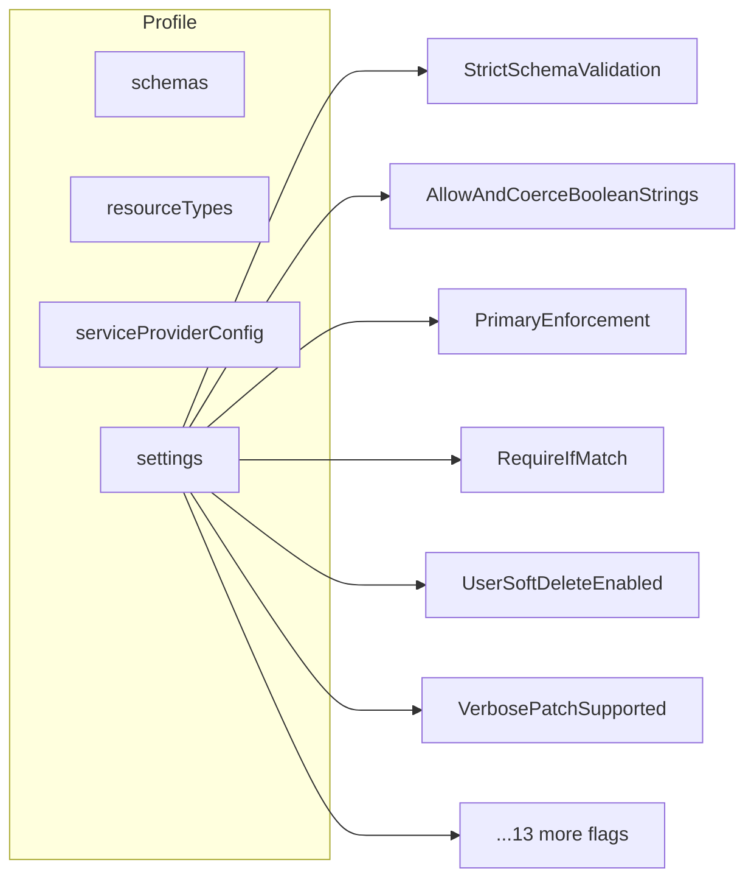
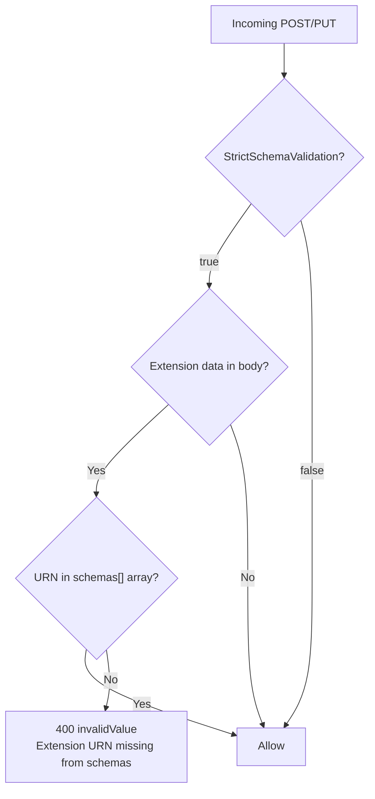

# Endpoint Configuration Flags Reference

> **Status:** User-facing reference - **Last verified:** 2026-07-31 - **Product version:** `0.55.3`

> **Version:** 0.55.3 - **Updated:** July 20, 2026  
> **Source of truth:** [endpoint-profile.types.ts](../api/src/modules/scim/endpoint-profile/endpoint-profile.types.ts) (`ProfileSettings`)  
> 27 flags: 19 boolean + 1 log level + 1 tri-state string (`PrimaryEnforcement`) + 1 two-value enum (`CredentialSecretVisibility`) + 8 numeric runtime-egress overrides + 1 request-log privacy boolean (`PersistRequestSecrets`).  
> 5 value-types: `boolean`, `logLevel`, `primaryEnforcement`, `credentialVisibility`, `structured`, and `number` (the last added for the runtime JWKS-fetch egress knobs).

---

## Table of Contents

- [Overview](#overview)
- [Flag Value Types](#flag-value-types)
- [How to Set Flags](#how-to-set-flags)
- [Flag Reference](#flag-reference)
- [Preset Defaults](#preset-defaults)
- [Flag Details](#flag-details)
- [Deprecated Flags](#deprecated-flags)

---

## Overview

Every endpoint has a `profile.settings` object containing behavioral configuration flags. These flags control SCIM protocol behavior, validation strictness, authentication, logging, and compatibility features.

Settings are part of the endpoint profile and can be:
- Set at creation via `profilePreset` (inherits preset defaults)
- Set at creation via inline `profile.settings`
- Updated at runtime via PATCH


```mermaid
flowchart LR
    subgraph Profile
        S[schemas]
        RT[resourceTypes]
        SPC[serviceProviderConfig]
        SET[settings]
    end
    SET --> F1[StrictSchemaValidation]
    SET --> F2[AllowAndCoerceBooleanStrings]
    SET --> F3[PrimaryEnforcement]
    SET --> F4[RequireIfMatch]
    SET --> F5[UserSoftDeleteEnabled]
    SET --> F6[VerbosePatchSupported]
    SET --> F7[...13 more flags]
```

---

## Flag Value Types

Every flag declares a `type` in the registry ([endpoint-config.interface.ts](../api/src/modules/endpoint/endpoint-config.interface.ts) `ENDPOINT_CONFIG_FLAGS_DEFINITIONS`). The validator (`validateEndpointConfig`) dispatches on that type, so adding a flag is a one-line registry entry - validation, defaulting, and discovery wiring follow automatically.

| Type | Accepted values | Reader helper | Validator |
|---|---|---|---|
| `boolean` | `true`/`false`, or the strings `"True"`/`"False"`/`"1"`/`"0"` (case-insensitive) | `getConfigBoolean` | `validateBooleanFlag` |
| `logLevel` | `"TRACE"`..`"OFF"` (case-insensitive) or `0`-`6` | `getConfigString` | `validateLogLevelFlag` |
| `primaryEnforcement` | `"passthrough"` / `"normalize"` / `"reject"` | `getConfigString` | `validatePrimaryEnforcementFlag` |
| `credentialVisibility` | `"always"` / `"once"` (case-insensitive) | `getConfigString` | `validateCredentialVisibilityFlag` |
| `number` | a whole number (or numeric string) within the flag's `[min, max]` bounds | `getConfigNumber` | `validateNumberFlag` |
| `structured` | a JSON object, optionally constrained by a `structuredSchema` | `getConfigStructured` | `validateStructuredFlag` |

### The `structured` value-type (Pre-Q.A)

The `structured` type lets a flag carry a nested object value rather than a scalar. It is the enabling machinery for the WIF trust object (Q6.2); no production flag uses it yet. A `structured` flag definition may declare a `structuredSchema`:

- `allowedKeys` - any top-level key not in this list is rejected (`Unknown key "..."`).
- `requiredKeys` - every entry must be present (`Missing required key "..."`).

A non-object value (string, number, boolean, array, or `null`) is rejected with `Invalid type`. When no `structuredSchema` is declared, any object shape is accepted. Read a structured value with `getConfigStructured(config, key)`, which returns the object or `undefined` for missing/non-object values.

---

## How to Set Flags

### At Endpoint Creation

```bash
curl -X POST http://localhost:8080/scim/admin/endpoints \
  -H "Authorization: Bearer changeme-scim" \
  -H "Content-Type: application/json" \
  -d '{
    "name": "my-endpoint",
    "profilePreset": "entra-id",
    "profile": {
      "settings": {
        "RequireIfMatch": true,
        "logLevel": "DEBUG"
      }
    }
  }'
```

### Update at Runtime

```bash
curl -X PATCH http://localhost:8080/scim/admin/endpoints/{id} \
  -H "Authorization: Bearer changeme-scim" \
  -H "Content-Type: application/json" \
  -d '{
    "profile": {
      "settings": {
        "VerbosePatchSupported": true,
        "PrimaryEnforcement": "reject"
      }
    }
  }'
```

Settings are **deep-merged** - only specified flags are updated, others remain unchanged.

---

## Flag Reference

| # | Flag | Type | Default | Category |
|---|------|------|---------|----------|
| 1 | [`StrictSchemaValidation`](#strictschemavalidation) | boolean | `true` | Validation |
| 2 | [`AllowAndCoerceBooleanStrings`](#allowandcoercebooleanstrings) | boolean | `true` | Compatibility |
| 3 | [`PrimaryEnforcement`](#primaryenforcement) | string | `passthrough` | Validation |
| 4 | [`RequireIfMatch`](#requireifmatch) | boolean | `false` | Concurrency |
| 5 | [`UserSoftDeleteEnabled`](#usersoftdeleteenabled) | boolean | `true` | Delete Behavior |
| 6 | [`UserHardDeleteEnabled`](#userharddeleteenabled) | boolean | `true` | Delete Behavior |
| 7 | [`GroupHardDeleteEnabled`](#groupharddeleteenabled) | boolean | `true` | Delete Behavior |
| 8 | [`MultiMemberPatchOpForGroupEnabled`](#multimemberpatchopforgroupenabled) | boolean | `true` | PATCH Behavior |
| 9 | [`PatchOpAllowRemoveAllMembers`](#patchopallowremoveallmembers) | boolean | `false` | PATCH Behavior |
| 10 | [`VerbosePatchSupported`](#verbosepatchsupported) | boolean | `false` | PATCH Behavior |
| 11 | [`IgnoreReadOnlyAttributesInPatch`](#ignorereadonlyattributesinpatch) | boolean | `false` | PATCH Behavior |
| 12 | [`IncludeWarningAboutIgnoredReadOnlyAttribute`](#includewarningaboutignoredreadonlyattribute) | boolean | `false` | PATCH Behavior |
| 13 | [`SchemaDiscoveryEnabled`](#schemadiscoveryenabled) | boolean | `true` | Discovery |
| 14 | [`PerEndpointCredentialsEnabled`](#perendpointcredentialsenabled) | boolean | `false` | Authentication |
| 15 | [`logLevel`](#loglevel) | string | (global) | Logging |
| 16 | [`logFileEnabled`](#logfileenabled) | boolean | `true` | Logging |
| 17 | [`WifCredentialsEnabled`](#wifcredentialsenabled) | boolean | `false` | Authentication |
| 18 | [`SecretTokenBearerAuthEnabled`](#wi-11-per-method-auth-enablement-flags) | boolean | `false`* | Authentication |
| 19 | [`OAuthClientCredentialsAuthEnabled`](#wi-11-per-method-auth-enablement-flags) | boolean | `false`* | Authentication |
| 20 | [`SharedSecretBearerAuthEnabled`](#wi-11-per-method-auth-enablement-flags) | boolean | `true` | Authentication |
| 21 | [`CredentialSecretVisibility`](#credentialsecretvisibility) | enum (`always`/`once`) | `always` | Authentication |
| 22 | [`EnforceResourceTypes`](#enforceresourcetypes) | boolean | `true` | Resource Types |
| 23 | [`JwksFetchTimeoutMs`](#runtime-egress-wif-jwks-fetch) | number | (server: 5000) | Runtime egress |
| 24 | [`JwksFetchRetries`](#runtime-egress-wif-jwks-fetch) | number | (server: 2) | Runtime egress |
| 25 | [`JwksFetchRetryBackoffMs`](#runtime-egress-wif-jwks-fetch) | number | (server: 200) | Runtime egress |
| 26 | [`JwksCacheMaxAgeMs`](#runtime-egress-wif-jwks-fetch) | number | (server: 600000) | Runtime egress |
| 27 | [`JwksTotalDeadlineMs`](#runtime-egress-wif-jwks-fetch) | number | (server: 10000) | Runtime egress |
| 28 | [`JwksMaxResponseBytes`](#runtime-egress-wif-jwks-fetch) | number | (server: 1048576) | Runtime egress |
| 29 | [`JwksMaxKeys`](#runtime-egress-wif-jwks-fetch) | number | (server: 100) | Runtime egress |
| 30 | [`JwksMaxCacheEntries`](#runtime-egress-wif-jwks-fetch) | number | (server: 50) | Runtime egress |
| 27 | [`PersistRequestSecrets`](#persistrequestsecrets) | boolean | (server: `true`) | Logging & privacy |
| 28 | [`RfcCompliantSubAttributes`](#rfccompliantsubattributes) | boolean | `false` | Validation |

### CredentialSecretVisibility

WI-7 (design section 6A). Controls whether a per-endpoint credential secret is
retained (encrypted at rest, re-viewable by an admin) or shown exactly once at
creation. Enum `always` (default) or `once`. The **server-scope** setting is the
ceiling: most-restrictive-wins, so a server value of `once` forces `once` on
every endpoint regardless of the endpoint value. When the effective value is
`always`, a freshly-created secret is encrypted via the WI-6 envelope scheme and
stored on the credential; when it is `once`, no ciphertext is retained (and a
flip to `once` purges any retained ciphertext). The retained envelope is NEVER
exposed on any response; reveal is a separate admin-only, audit-logged endpoint
(WI-8). Pre-feature credentials are bcrypt-only and cannot be retro-revealed.

### WifCredentialsEnabled

When `true`, enables Workload Identity Federation (WIF) for the endpoint: a `wif`
credential may be attached (via `POST /admin/endpoints/:id/credentials` with
`credentialType:"wif"`) and the WIF token-mint path is offered. When `false`
(default), WIF is off and existing endpoints are untouched. **Orthogonal** to
`PerEndpointCredentialsEnabled` (the bcrypt-bearer gate): a `wif` credential is
permitted when `WifCredentialsEnabled` is on, independent of the bearer gate,
and a `bearer` credential still requires `PerEndpointCredentialsEnabled`.
Added in A1 ([docs/auth/AUTHENTICATION_METHODS_ADMIN_API.md](auth/AUTHENTICATION_METHODS_ADMIN_API.md)).

### WI-11 per-method auth-enablement flags

WI-11 splits the double-duty `PerEndpointCredentialsEnabled` into three flags,
each gating one auth method independently (at credential-create AND on the
resource-plane validation path):

| Flag | Gates | Effective default |
|---|---|---|
| `SecretTokenBearerAuthEnabled` | per-endpoint `bearer` (Entra "Secret Token") | falls back to `PerEndpointCredentialsEnabled` when unset |
| `OAuthClientCredentialsAuthEnabled` | per-endpoint `oauth_client` (Entra "OAuth2 client-credentials") | falls back to `PerEndpointCredentialsEnabled` when unset |
| `SharedSecretBearerAuthEnabled` | whether the endpoint accepts the global `SCIM_SHARED_SECRET` | `true` (unset means accept, back-compat) |

The effective value is computed by `getEffectiveAuthEnablement()`
([endpoint-config.interface.ts](../api/src/modules/endpoint/endpoint-config.interface.ts)). The
migration is **value-preserving**: an endpoint that only has the legacy
`PerEndpointCredentialsEnabled` behaves byte-for-byte as before (that flag is
read as a one-release fallback for both per-endpoint methods). An explicit new
flag always overrides the legacy fallback. The new capability is
`SharedSecretBearerAuthEnabled=false`, which makes an endpoint refuse the global
shared secret on its resource routes and accept only its own credentials (or
endpoint-scoped OAuth tokens). `*` The two per-endpoint flags show `false` as
their registry default, but their EFFECTIVE value inherits the legacy flag when
that is set.
### EnforceResourceTypes

When `true` (**default**), a LIST/query on a resource type the endpoint profile
does not declare returns `404 RESOURCE_TYPE_NOT_SUPPORTED` (the v0.53.3 Gap-1
enforcement). When `false`, a **LIST/query** on an un-served resource type
instead returns a `200` empty `ListResponse` (RFC 7644 §3.4.2) plus a non-fatal
warning on three channels: a server log (**W1**), a
`urn:scimserver:api:messages:2.0:Warning` body member (**W2**), and an
`X-SCIM-Warning` response header (**W3**). **Item-by-id reads and all writes
(`POST`/`PUT`/`PATCH`/`DELETE`) still reject with `404`** regardless of the flag -
only LIST/query is relaxed. Applies symmetrically to `/Users` and `/Groups`.

**Set `false` for Microsoft Entra provisioning of a user-only (no Group)
endpoint**: Entra's Test Connection probes both `/Users` and `/Groups` and treats
a `/Groups` 404 as `SystemForCrossDomainIdentityManagementServiceIncompatible`.
See [ENDPOINT_PROFILE_ENFORCEMENT_DESIGN.md §8.1a](ENDPOINT_PROFILE_ENFORCEMENT_DESIGN.md#81a-enforceresourcetypes-flag---relax-listquery-to-200-empty-entra-test-connection).

### RfcCompliantSubAttributes

When `false` (**default**) the current behavior is preserved exactly, so no
existing endpoint changes when this flag ships. When `true`, sub-attribute
shapes are handled per RFC 7643 instead. The flag governs exactly two rules:

| Rule | RFC | Flag OFF (default) | Flag ON |
|---|---|---|---|
| **R1** complex sub-attribute | [RFC 7643 §2.3.8](rfcs/rfc7643.txt), erratum 8415 | a schema may declare one and a payload populating it is **accepted** | the payload is **rejected** `400 invalidValue` |
| **R2** multi-valued SIMPLE sub-attribute | [RFC 7643 §1.2](rfcs/rfc7643.txt), erratum 5607 | **rejected** (`must be a string, got object`) | **accepted**, each element type-checked with an `[index]` path |

RFC 7643 §2.3.8 states a complex attribute "MUST NOT contain sub-attributes that
have sub-attributes (i.e., that are complex)", and §1.2 defines a simple
attribute as "singular or multi-valued", which is why a multi-valued *simple*
sub-attribute is legal while a *complex* one is not. See
[SCIM_SUBATTRIBUTE_TYPE_RULES.md](rfcs/SCIM_SUBATTRIBUTE_TYPE_RULES.md) for the
full combination matrix and the ISV/IdP survey.

**It is standalone.** It is deliberately NOT gated on
[`StrictSchemaValidation`](#strictschemavalidation), because the two answer
different questions: strict asks *how carefully do I police this payload*, while
this flag asks *is this schema shape legal at all*. A lenient endpoint must
still be able to refuse a shape the RFC forbids. Concretely:

- turning this flag on does **not** enable strict validation (undeclared
  attributes stay tolerated when strict is off), and
- turning `StrictSchemaValidation` off does **not** lift an R1 rejection.

Because of that, an R1 rejection is always attributed to this flag in the
diagnostics envelope, whatever the strict setting:

```json
{
  "schemas": [
    "urn:ietf:params:scim:api:messages:2.0:Error"
  ],
  "status": "400",
  "scimType": "invalidValue",
  "detail": "Schema validation failed: address.geo: Sub-attribute 'geo' is complex, but RFC 7643 2.3.8 forbids a complex attribute from containing complex sub-attributes.",
  "urn:scimserver:api:messages:2.0:Diagnostics": {
    "errorCode": "VALIDATION_SCHEMA",
    "triggeredBy": "RfcCompliantSubAttributes",
    "attributePaths": [
      "address.geo"
    ],
    "activeConfig": {
      "StrictSchemaValidation": true,
      "RfcCompliantSubAttributes": true
    }
  }
}
```

**When to turn it on.** Only if you author custom schemas and want the server to
hold you to the RFC's shape rules, or if you need multi-valued simple
sub-attributes (R2). Leave it off otherwise - stock `User` and `Group` schemas
declare no complex sub-attributes, so the flag is a no-op for them.

Applies to `POST`, `PUT` and `PATCH`, to `/Users`, `/Groups` and custom resource
types alike. Full design: [RFC_COMPLIANT_SUBATTRIBUTES.md](RFC_COMPLIANT_SUBATTRIBUTES.md).

---

### Runtime egress (WIF JWKS fetch)

> **This four-flag family is the reference implementation of the repo's tier-2
> configuration pattern** (server env default, per-endpoint override, mandatory
> clamp at both levels). Any new environment-dependent numeric setting should
> follow this exact shape. The full model, the complete inventory of what is and
> is not configurable elsewhere in the server, and a recommended value for every
> knob per deployment form factor are in
> [perf/RUNTIME_TUNING_AND_CONFIGURATION_REFERENCE.md](perf/RUNTIME_TUNING_AND_CONFIGURATION_REFERENCE.md) (X15).

These four `number` flags tune the **runtime** egress the server makes when it
fetches an identity provider's JWKS to verify a WIF (RFC 7523 `jwt-bearer`)
client assertion during the endpoint token-mint. They are **per-endpoint
overrides of the server-level defaults**; the precedence is:

```text
effective = endpoint setting  ??  server env default  ??  hardcoded default
```

An endpoint value **overrides** the server value; when an endpoint leaves a flag
unset it inherits the server env default (and, absent the env var, the hardcoded
default). Each is bounds-checked by `validateNumberFlag` at admin create/update
time - an out-of-range or non-numeric value is rejected with `400`.

| Flag | Server env default | Bounds | Meaning |
|---|---|---|---|
| `JwksFetchTimeoutMs` | `JWKS_FETCH_TIMEOUT_MS` (5000) | 100 - 60000 | Per-attempt fetch timeout (ms). A hung IdP is aborted rather than blocking the mint (**G1**). |
| `JwksFetchRetries` | `JWKS_FETCH_RETRIES` (2) | 0 - 10 | Retries for a failed fetch; total tries = `retries + 1` (**G5**). |
| `JwksFetchRetryBackoffMs` | `JWKS_FETCH_RETRY_BACKOFF_MS` (200) | 0 - 10000 | Base retry backoff (ms); exponential `backoff * 2^(attempt-1)` + jitter. |
| `JwksCacheMaxAgeMs` | `JWKS_CACHE_MAX_AGE_MS` (600000) | 0 - 86400000 | How long a cached JWKS is served before a refetch (`0` = always refetch). **Open finding X15-F1:** Microsoft's guidance for its own signing keys is a 24 h TTL with a 1 h background refresh, so `600000` is ~144x more aggressive than the IdP asks. Do NOT simply raise this on today's code - the long TTL is only safe once W1.4 lands the background refresher and the rate-limited unknown-`kid` path. See [perf/RUNTIME_TUNING_AND_CONFIGURATION_REFERENCE.md](perf/RUNTIME_TUNING_AND_CONFIGURATION_REFERENCE.md) section 4.1. |
| `JwksTotalDeadlineMs` | `JWKS_TOTAL_DEADLINE_MS` (10000) | 100 - 120000 | **W1.5.** TOTAL wall-clock budget for the whole fetch - every attempt, every backoff sleep and every redirect hop combined. `JwksFetchTimeoutMs` bounds ONE attempt, which is not a bound on the operation: with `retries: 5` and a 200 ms base backoff the ladder alone sleeps 6.2 s. The backoff sleep is clamped to whatever remains of this budget. |
| `JwksMaxResponseBytes` | `JWKS_MAX_RESPONSE_BYTES` (1048576) | 1024 - 10485760 | **W1.5.** Maximum JWKS response body size; a larger body is rejected **before it is parsed**. A cap breach is non-retryable - it is deterministic, so retrying would only burn the deadline and then hide the cause behind the generic exhaustion message. |
| `JwksMaxKeys` | `JWKS_MAX_KEYS` (100) | 1 - 1000 | **W1.5.** Maximum number of keys accepted in a key set. Deliberately generous - Microsoft states a signing-key cache should hold 10-1000 keys across issuers, so a tight cap (e.g. 10) would reject a legitimate multi-issuer key set. |
| `JwksMaxCacheEntries` | `JWKS_MAX_CACHE_ENTRIES` (50) | 1 - 1000 | **W1.5.** Cardinality cap on the JWKS cache; past it the OLDEST entry is evicted. Without a cap the cache is an unbounded map keyed by a caller-influenced URI. |

Alongside these knobs the runtime fetch also enforces **single-flight** (G3 -
concurrent fetches for the same URI are coalesced into one) and **redirect
re-validation** (G2 - each 3xx `Location` is re-checked against the JWKS host
allowlist before it is followed, so a trusted host cannot redirect the fetch to
an internal address). These behaviors are not configurable; only the four
numeric knobs above are. On exhaustion the fetch **fails to a still-usable
cached copy** if one exists, otherwise it **fails closed** - it never skips the
signature check. See [egress-policy.ts](../api/src/oauth/egress-policy.ts) and
[external-jwks-validator.service.ts](../api/src/oauth/external-jwks-validator.service.ts).

Example - give a slow IdP more headroom on one endpoint without changing the
server default:

```json
{
  "profile": {
    "settings": {
      "JwksFetchTimeoutMs": 12000,
      "JwksFetchRetries": 4,
      "JwksFetchRetryBackoffMs": 300,
      "JwksCacheMaxAgeMs": 1800000
    }
  }
}
```

**Scope note:** these tune the **runtime** token-mint JWKS fetch only. The
config-time discovery/verify paths (admin "Verify WIF trust" / discovery
resolver) are unaffected by these flags.

---

### PersistRequestSecrets

Governs **request-log privacy** for this endpoint. When `true` (the **default**,
inherited from the server-level `PERSIST_REQUEST_SECRETS` env when unset here),
the RequestLog stores AND displays (in the admin API + UI) the **complete**
request/response for this endpoint - headers and body, secrets included - for
fast, complete RCA. When `false`, secret-bearing header and body values
(`Authorization`, `Cookie`, `client_secret`, `client_assertion`, `password`,
`access_token`, ...) are redacted to `[REDACTED]` **before the row is persisted**
(and therefore before it is shown anywhere).

Precedence: the endpoint value **overrides** the server default
(`endpoint ?? server-env ?? true`). The server default is the env var
`PERSIST_REQUEST_SECRETS` (default `true`; set to `false` to redact by default
across all endpoints).

Independent of this flag, the shipped **console/file structured logs always
redact** secrets (defense in depth for log aggregation) - the RequestLog is the
deliberate full-fidelity RCA surface this flag governs.

```json
{
  "profile": {
    "settings": {
      "PersistRequestSecrets": false
    }
  }
}
```

---

## Preset Defaults

How each preset overrides the central defaults:

| Flag | Central Default | entra-id | entra-id-minimal | rfc-standard | minimal | user-only | user-only-with-custom-ext |
|------|----------------|----------|-----------------|-------------|---------|-----------|---------------------------|
| StrictSchemaValidation | true | true | true | true | true | true | true |
| AllowAndCoerceBooleanStrings | true | **true** | **true** | true | true | true | true |
| PrimaryEnforcement | passthrough | **normalize** | **normalize** | **reject** | passthrough | passthrough | passthrough |
| RequireIfMatch | false | false | false | false | false | false | false |
| MultiMemberPatchOpForGroupEnabled | true | **true** | true | true | true | true | true |
| PatchOpAllowRemoveAllMembers | false | **true** | false | false | false | false | false |
| VerbosePatchSupported | false | **true** | false | false | false | false | false |

All other flags use central defaults across all presets.

---

## Flag Details

### StrictSchemaValidation

**Type:** boolean | **Default:** `true` | **Category:** Validation

When enabled, validates that extension URNs present in the request body are also listed in the `schemas[]` array. This enforces RFC 7643 S3.1 which states that `schemas` MUST contain the URIs of all schema classes present.


```mermaid
flowchart TD
    A[Incoming POST/PUT] --> B{StrictSchemaValidation?}
    B -->|true| C{Extension data in body?}
    C -->|Yes| D{"URN in schemas[] array?"}
    D -->|Yes| E[Allow]
    D -->|No| F[400 invalidValue<br>Extension URN missing from schemas]
    C -->|No| E
    B -->|false| E
```

**Example error:**

```json
{
  "schemas": ["urn:ietf:params:scim:api:messages:2.0:Error"],
  "status": "400",
  "scimType": "invalidValue",
  "detail": "Extension URN 'urn:ietf:params:scim:schemas:extension:enterprise:2.0:User' found in body but not in schemas[] array"
}
```

---

### AllowAndCoerceBooleanStrings

**Type:** boolean | **Default:** `true` | **Category:** Compatibility

Coerces string representations of booleans (`"True"`, `"False"`, `"true"`, `"false"`) to native boolean values. Required for Entra ID compatibility, which sends `"True"` instead of `true`.

**Before coercion:** `{ "active": "True" }`
**After coercion:** `{ "active": true }`

Applies to all boolean fields in POST, PUT, and PATCH request bodies, including nested extension attributes.

---

### PrimaryEnforcement

**Type:** string (tri-state) | **Default:** `passthrough` | **Category:** Validation

Controls how the `primary: true` sub-attribute is handled on multi-valued attributes (emails, phoneNumbers, etc.) per RFC 7643 S2.4.

| Value | Behavior |
|-------|----------|
| `passthrough` | No enforcement. Multiple `primary: true` values allowed |
| `normalize` | Auto-normalize: if multiple `primary: true`, keep only the last one. Applied on POST, PUT, and PATCH post-merge |
| `reject` | Strict: return 400 if request contains multiple `primary: true` values for the same multi-valued attribute |

**Preset defaults:** entra-id/entra-id-minimal = `normalize`, rfc-standard = `reject`

```json
{
  "emails": [
    { "value": "work@example.com", "type": "work", "primary": true },
    { "value": "home@example.com", "type": "home", "primary": true }
  ]
}
```

| Mode | Result |
|------|--------|
| `passthrough` | Both stored as-is |
| `normalize` | Only `home@example.com` keeps `primary: true` |
| `reject` | 400 error: "Multiple primary values" |

---

### RequireIfMatch

**Type:** boolean | **Default:** `false` | **Category:** Concurrency

When enabled, mandates the `If-Match` header on all PUT, PATCH, and DELETE operations. Prevents concurrent modification without optimistic locking.

**When enabled and If-Match missing:**

```json
{
  "schemas": ["urn:ietf:params:scim:api:messages:2.0:Error"],
  "status": "412",
  "detail": "If-Match header is required for this endpoint"
}
```

**When If-Match doesn't match:**

```json
{
  "schemas": ["urn:ietf:params:scim:api:messages:2.0:Error"],
  "status": "412",
  "scimType": "versionMismatch",
  "detail": "ETag mismatch: expected W/\"2\", got W/\"1\""
}
```

---

### UserSoftDeleteEnabled

**Type:** boolean | **Default:** `true` | **Category:** Delete Behavior

When enabled, a PATCH operation that sets `active: false` will mark the user as soft-deleted (sets `deletedAt` timestamp) rather than permanently removing it. The user remains in the database but is treated as inactive.

Soft-deleted users can be re-activated via PATCH `active: true`.

---

### UserHardDeleteEnabled

**Type:** boolean | **Default:** `true` | **Category:** Delete Behavior

When enabled, DELETE requests permanently remove the user from the database. When disabled, DELETE returns 400.

---

### GroupHardDeleteEnabled

**Type:** boolean | **Default:** `true` | **Category:** Delete Behavior

When enabled, DELETE requests permanently remove the group and all membership records.

---

### MultiMemberPatchOpForGroupEnabled

**Type:** boolean | **Default:** `true` | **Category:** PATCH Behavior

When enabled, allows adding or removing multiple members in a single PATCH operation:

```json
{
  "op": "add",
  "path": "members",
  "value": [
    { "value": "user-id-1" },
    { "value": "user-id-2" },
    { "value": "user-id-3" }
  ]
}
```

When disabled, only single-member operations are allowed per PATCH op.

---

### PatchOpAllowRemoveAllMembers

**Type:** boolean | **Default:** `false` | **Category:** PATCH Behavior

When enabled, allows removing all members from a group via:

```json
{ "op": "remove", "path": "members" }
```

When disabled (default), this operation returns 400 to prevent accidental mass removal.

---

### VerbosePatchSupported

**Type:** boolean | **Default:** `false` | **Category:** PATCH Behavior

When enabled, supports dot-notation PATCH paths:

```json
{ "op": "replace", "path": "name.givenName", "value": "Jane" }
```

Without this flag, only standard paths are supported (`"name"` with complex value, or valuePath syntax `"name[formatted eq \"old\"]"`).

---

### IgnoreReadOnlyAttributesInPatch

**Type:** boolean | **Default:** `false` | **Category:** PATCH Behavior

When enabled, PATCH operations targeting readOnly attributes (`id`, `meta`, `groups`) are silently stripped instead of returning 400. Useful for clients that send full resource representations in PATCH.

---

### IncludeWarningAboutIgnoredReadOnlyAttribute

**Type:** boolean | **Default:** `false` | **Category:** PATCH Behavior

When enabled and readOnly attributes are stripped from requests, includes a warning in the response detailing which attributes were ignored.

---

### SchemaDiscoveryEnabled

**Type:** boolean | **Default:** `true` | **Category:** Discovery

When enabled, endpoint-scoped discovery endpoints respond with the endpoint's schema configuration:
- `GET /scim/endpoints/{id}/Schemas`
- `GET /scim/endpoints/{id}/ResourceTypes`
- `GET /scim/endpoints/{id}/ServiceProviderConfig`

When disabled, these endpoints return 404.

---

### PerEndpointCredentialsEnabled

**Type:** boolean | **Default:** `false` | **Category:** Authentication

When enabled, activates the per-endpoint credential tier in the authentication chain. SCIM operations on this endpoint can be authenticated using endpoint-scoped bearer tokens created via the Admin Credential API.

Requires credential creation via `POST /scim/admin/endpoints/{id}/credentials`.

---

### logLevel

**Type:** string | **Default:** (global level) | **Category:** Logging

Overrides the global log level for this specific endpoint. Valid values: `TRACE`, `DEBUG`, `INFO`, `WARN`, `ERROR`, `FATAL`.

Useful for debugging a specific tenant without increasing log verbosity for all traffic.

---

### logFileEnabled

**Type:** boolean | **Default:** `true` | **Category:** Logging

When enabled, creates a dedicated log file for this endpoint under `logs/endpoints/{endpointId}/`.

---

## Deprecated Flags

These flags are recognized for backward compatibility but should not be used in new configurations:

| Deprecated Flag | Replacement |
|----------------|-------------|
| `SoftDeleteEnabled` | `UserSoftDeleteEnabled` |
| `MultiOpPatchRequestGroupAddMembersEnabled` | `MultiMemberPatchOpForGroupEnabled` |
| `MultiOpPatchRequestGroupRemoveMembersEnabled` | `MultiMemberPatchOpForGroupEnabled` |
| `ReprovisionOnConflictForSoftDeletedResource` | Removed (always re-provisions) |
