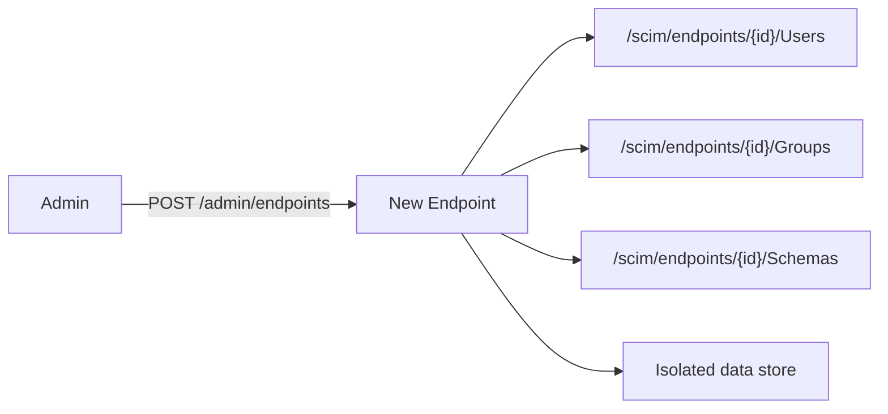

# Create Your Own SCIM Endpoint - Self-Service Wiki

> **Version:** 0.53.0 - **Updated:** June 2, 2026
> Beginner-friendly, copy-paste guide for standing up a SCIM endpoint in minutes.
> **Source of truth:** [endpoint.controller.ts](../api/src/modules/endpoint/controllers/endpoint.controller.ts) - [built-in-presets.ts](../api/src/modules/scim/endpoint-profile/built-in-presets.ts)

This is the "start here" page. For deeper reference see:
[ENDPOINT_LIFECYCLE_AND_USAGE.md](ENDPOINT_LIFECYCLE_AND_USAGE.md) (CRUD recipes) -
[ENDPOINT_PROFILE_ARCHITECTURE.md](ENDPOINT_PROFILE_ARCHITECTURE.md) (how profiles work) -
[ENDPOINT_CONFIG_FLAGS_REFERENCE.md](ENDPOINT_CONFIG_FLAGS_REFERENCE.md) (all 16 flags) -
[COMPLETE_API_REFERENCE.md](COMPLETE_API_REFERENCE.md) (every route).

---

## Table of Contents

- [What is an "endpoint"?](#what-is-an-endpoint)
- [The 3 tools you can use](#the-3-tools-you-can-use)
- [Quick Start (60 seconds)](#quick-start-60-seconds)
- [Pick a preset](#pick-a-preset)
- [Recipe 1 - All supported features](#recipe-1---all-supported-features)
- [Recipe 2 - Everything without manager](#recipe-2---everything-without-manager)
- [Recipe 3 - Everything without group support](#recipe-3---everything-without-group-support)
- [Turning individual features on/off (flags)](#turning-individual-features-onoff-flags)
- [Verify your endpoint](#verify-your-endpoint)
- [Clean up](#clean-up)
- [FAQ & Troubleshooting](#faq--troubleshooting)

---

## What is an "endpoint"?

An **endpoint** is one isolated, self-contained SCIM tenant. Each endpoint has:

- Its own **SCIM URL** (`/scim/endpoints/{id}/Users`, `/Groups`, `/Schemas`, ...)
- Its own **data** (users, groups - fully isolated from other endpoints)
- Its own **profile** = what schemas, resource types, capabilities and behavior flags it exposes

You create as many endpoints as you need (one per customer, per test scenario, per integration).



---

## The 3 tools you can use

You can create an endpoint with whichever tool you prefer - they all hit the same API.

| Tool | Best for | Where |
|------|----------|-------|
| **Web UI wizard** | Click-through, preview before commit | `/endpoints/new` (4 steps: Identity & Preset -> Preview -> Override -> Confirm) |
| **REST API (curl)** | Scripting, CI, copy-paste | `POST /scim/admin/endpoints` |
| **Presets browser** | See what each preset gives you before choosing | `GET /scim/admin/endpoints/presets` and `/presets/{name}` |

> The UI wizard is the friendliest way to start. Everything below shows the REST calls so you can automate it too.

---

## Quick Start (60 seconds)

Set your server + secret once, then create an endpoint from the default preset.

```powershell
# 1. Point at your server (pick one)
$base = "https://scimserver-dev.proudbush-ae90986e.eastus.azurecontainerapps.io"   # dev
# $base = "http://localhost:8080"                                                  # local Docker

# 2. Get an OAuth token (admin credentials)
$tok = (Invoke-RestMethod -Uri "$base/scim/oauth/token" -Method Post `
  -ContentType 'application/json' `
  -Body '{"grant_type":"client_credentials","client_id":"scimserver-client","client_secret":"changeme-oauth"}'
).access_token
$H = @{ Authorization = "Bearer $tok" }

# 3. Create an endpoint from the default preset
$body = @{ name = "my-first-endpoint"; displayName = "My First Endpoint"; profilePreset = "entra-id" } | ConvertTo-Json
$ep = Invoke-RestMethod -Uri "$base/scim/admin/endpoints" -Method Post -Headers $H -ContentType 'application/json' -Body $body
$ep | Select-Object id, name, displayName
```

Same thing with `curl`:

```bash
TOKEN=$(curl -s -X POST "$BASE/scim/oauth/token" -H "Content-Type: application/json" \
  -d '{"grant_type":"client_credentials","client_id":"scimserver-client","client_secret":"changeme-oauth"}' \
  | jq -r .access_token)

curl -X POST "$BASE/scim/admin/endpoints" \
  -H "Authorization: Bearer $TOKEN" -H "Content-Type: application/json" \
  -d '{"name":"my-first-endpoint","displayName":"My First Endpoint","profilePreset":"entra-id"}'
```

That's it - you now have a live SCIM endpoint. Jump to [Verify your endpoint](#verify-your-endpoint).

---

## Pick a preset

A **preset** is a ready-made profile. Start from one, then override only what you need.

| Preset | Users | Groups | EnterpriseUser (manager) | Extensions | Bulk | Sort |
|--------|:-----:|:------:|:------------------------:|------------|:----:|:----:|
| `entra-id` *(default)* | Yes | Yes | Yes | 4 Microsoft test ext. | No | No |
| `entra-id-minimal` | Yes | Yes | Yes | 4 Microsoft test ext. | No | No |
| `rfc-standard` | Yes | Yes | Yes | none | Yes (1000) | Yes |
| `minimal` | Yes | Yes | No | none | No | No |
| `user-only` | Yes | **No** | Yes | none | No | Yes |
| `user-only-with-custom-ext` | Yes | **No** | Yes | 1 custom | No | Yes |

Browse them live:

```powershell
Invoke-RestMethod -Uri "$base/scim/admin/endpoints/presets" -Headers $H | Select-Object -ExpandProperty presets | Format-Table name, description
# Full expanded profile for one preset:
Invoke-RestMethod -Uri "$base/scim/admin/endpoints/presets/entra-id" -Headers $H
```

> Rule of thumb: `entra-id` = "everything for Entra ID provisioning". `rfc-standard` = "everything per the RFC, plus bulk/sort". Both are good "all features" starting points.

---

## Recipe 1 - All supported features

Use a full preset as-is. `entra-id` gives Users + Groups + EnterpriseUser (incl. `manager`) + the Microsoft test extensions.

```powershell
$body = @{
  name          = "SelfServ-Entra-All-ISV"
  displayName   = "SelfServ Entra - All Features (ISV)"
  description   = "All supported features: Users, Groups, EnterpriseUser with manager, custom extensions."
  profilePreset = "entra-id"
} | ConvertTo-Json

Invoke-RestMethod -Uri "$base/scim/admin/endpoints" -Method Post -Headers $H -ContentType 'application/json' -Body $body |
  Select-Object id, name
```

---

## Recipe 2 - Everything without manager

`manager` is a sub-attribute of the EnterpriseUser extension
(`urn:ietf:params:scim:schemas:extension:enterprise:2.0:User`). Its sibling attributes are
`employeeNumber, costCenter, organization, division, department, manager`.

To keep **everything except manager**, start from the preset's expanded profile, drop the
`manager` attribute, and POST the result as an inline `profile`. The snippet below does it
automatically so you never hand-edit a giant JSON file.

```powershell
# 1. Pull the expanded preset
$preset = Invoke-RestMethod -Uri "$base/scim/admin/endpoints/presets/entra-id" -Headers $H
$profile = $preset.profile

# 2. Remove ONLY the 'manager' attribute from the EnterpriseUser extension
$entUrn = 'urn:ietf:params:scim:schemas:extension:enterprise:2.0:User'
foreach ($s in $profile.schemas) {
  if ($s.id -eq $entUrn) {
    $s.attributes = @($s.attributes | Where-Object { $_.name -ne 'manager' })
  }
}

# 3. Create the endpoint with the trimmed inline profile
$body = @{
  name        = "SelfServ-Entra-No-Manager-ISV"
  displayName = "SelfServ Entra - No Manager (ISV)"
  description = "All features except the EnterpriseUser 'manager' attribute."
  profile     = $profile
} | ConvertTo-Json -Depth 30

Invoke-RestMethod -Uri "$base/scim/admin/endpoints" -Method Post -Headers $H -ContentType 'application/json' -Body $body |
  Select-Object id, name
```

> **Why not a flag?** Manager is a schema attribute, not a behavior toggle - so you shape it
> in the profile's `schemas`, not in `settings`. The tighten-only validator allows **removing**
> an optional attribute; it only blocks *loosening* characteristics (see
> [ENDPOINT_PROFILE_ARCHITECTURE.md](ENDPOINT_PROFILE_ARCHITECTURE.md#tighten-only-validation)).

---

## Recipe 3 - Everything without group support

"No group support" means the endpoint exposes **no `Group` resource type**. Drop the Group
resource type (and its schema) from the profile - everything else (Users, EnterpriseUser,
manager, extensions) stays.

```powershell
# 1. Pull the expanded preset
$preset = Invoke-RestMethod -Uri "$base/scim/admin/endpoints/presets/entra-id" -Headers $H
$profile = $preset.profile

# 2. Remove the Group resource type + the Group core schema
$profile.resourceTypes = @($profile.resourceTypes | Where-Object { $_.id -ne 'Group' })
$profile.schemas       = @($profile.schemas | Where-Object { $_.id -notmatch ':Group$' -and $_.name -notmatch 'Group' })

# 3. Create the user-only endpoint
$body = @{
  name        = "SelfServ-Entra-OnlyUser-NoGroup"
  displayName = "SelfServ Entra - User Only, No Groups"
  description = "All features for Users (incl. manager + extensions). No Group resource type."
  profile     = $profile
} | ConvertTo-Json -Depth 30

Invoke-RestMethod -Uri "$base/scim/admin/endpoints" -Method Post -Headers $H -ContentType 'application/json' -Body $body |
  Select-Object id, name
```

> **Shortcut:** if you do **not** need the Microsoft extensions, the built-in `user-only`
> preset already removes Groups - just use `profilePreset = "user-only"` instead of the
> inline-profile approach above.

---

## Turning individual features on/off (flags)

Beyond schemas, endpoint **behavior** is controlled by 16 settings flags. Set them at create
time under `profile.settings`, or change them later with `PATCH` (settings are deep-merged,
so you only send what you want to change).

| Flag | Default | What it does |
|------|:-------:|--------------|
| `StrictSchemaValidation` | `true` | Enforce RFC 7643 schema rules on writes |
| `RequireIfMatch` | `false` | Require `If-Match` (ETag) on mutations |
| `VerbosePatchSupported` | `false` | Allow dot-notation paths in PATCH |
| `PerEndpointCredentialsEnabled` | `false` | Per-endpoint bearer tokens |
| `UserSoftDeleteEnabled` | `true` | `active:false` deactivates instead of hard delete |
| `UserHardDeleteEnabled` | `true` | Allow `DELETE /Users` |
| `GroupHardDeleteEnabled` | `true` | Allow `DELETE /Groups` |
| `SchemaDiscoveryEnabled` | `true` | Serve `/Schemas`, `/ResourceTypes`, `/ServiceProviderConfig` |
| `PrimaryEnforcement` | `passthrough` | `passthrough` / `normalize` / `reject` multi-valued `primary` |
| `logLevel` | (global) | `TRACE` ... `OFF` per endpoint |

Full list with descriptions: [ENDPOINT_CONFIG_FLAGS_REFERENCE.md](ENDPOINT_CONFIG_FLAGS_REFERENCE.md).

Set flags at creation:

```powershell
$body = @{
  name          = "strict-endpoint"
  profilePreset = "entra-id"
  profile       = @{ settings = @{ RequireIfMatch = $true; logLevel = "DEBUG" } }
} | ConvertTo-Json -Depth 10
Invoke-RestMethod -Uri "$base/scim/admin/endpoints" -Method Post -Headers $H -ContentType 'application/json' -Body $body
```

Change a flag later:

```powershell
$patch = @{ profile = @{ settings = @{ VerbosePatchSupported = $true } } } | ConvertTo-Json -Depth 10
Invoke-RestMethod -Uri "$base/scim/admin/endpoints/$($ep.id)" -Method Patch -Headers $H -ContentType 'application/json' -Body $patch
```

---

## Verify your endpoint

```powershell
$id = $ep.id

# Discovery - what does this endpoint advertise?
Invoke-RestMethod -Uri "$base/scim/endpoints/$id/ResourceTypes" -Headers $H | Select-Object -ExpandProperty Resources | Format-Table id, endpoint
Invoke-RestMethod -Uri "$base/scim/endpoints/$id/Schemas"       -Headers $H | Select-Object -ExpandProperty Resources | Format-Table id, name

# Create a user
$user = @{ schemas = @("urn:ietf:params:scim:schemas:core:2.0:User"); userName = "ada@example.com"; active = $true } | ConvertTo-Json
Invoke-RestMethod -Uri "$base/scim/endpoints/$id/Users" -Method Post -Headers $H -ContentType 'application/scim+json' -Body $user
```

Quick checks per recipe:

- **No manager:** `GET /Schemas` -> the EnterpriseUser schema has no `manager` attribute.
- **No groups:** `GET /ResourceTypes` -> no `Group` entry; `POST /Groups` returns `404`.

---

## Clean up

```powershell
# Deactivate (keeps data, blocks SCIM ops with 403)
Invoke-RestMethod -Uri "$base/scim/admin/endpoints/$id" -Method Patch -Headers $H -ContentType 'application/json' -Body '{"active":false}'

# Or delete permanently (cascades users, groups, logs, credentials)
Invoke-RestMethod -Uri "$base/scim/admin/endpoints/$id" -Method Delete -Headers $H
```

---

## FAQ & Troubleshooting

**Q. `profilePreset` and `profile` together?** No - they are mutually exclusive. Use a preset
*or* an inline profile. The "derive from preset, tweak, POST as `profile`" pattern in Recipes
2 and 3 is how you combine the convenience of a preset with custom edits.

**Q. "Tighten-only validation failed".** You tried to *loosen* an attribute (e.g. `readOnly`
-> `readWrite`, or `required:true` -> `false`). You may only tighten constraints. Removing an
optional attribute (like Recipe 2) is allowed; relaxing one is not.

**Q. 401 Unauthorized.** Your token expired (1 hour) or the secret is wrong. Re-run the OAuth
step. On dev/local the default client is `scimserver-client` / `changeme-oauth`.

**Q. Duplicate name.** Endpoint `name` must be unique. Pick another name or delete the existing one.

**Q. Where's the UI?** `/endpoints/new` for the create wizard, `/endpoints/$id/edit` to edit
displayName / description / active, and a type-name-to-confirm delete dialog on the detail page.

**Q. Which server?** Use **dev** (`scimserver-dev...`) to experiment. Production instances are
customer-facing - only create there when the endpoint is real.
