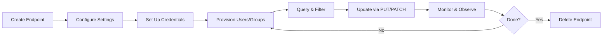

# SCIMServer — Endpoint Lifecycle & Usage Quick Reference

> **Version:** 0.31.0 · **Updated:** March 31, 2026  
> A hands-on guide for anyone new to the project: create, configure, use, and manage SCIM endpoints

---

## Table of Contents

1. [Concept: What Is an Endpoint?](#1-concept-what-is-an-endpoint)
2. [Lifecycle Overview](#2-lifecycle-overview)
3. [Step 1: Get Authenticated](#step-1-get-authenticated)
4. [Step 2: Create an Endpoint](#step-2-create-an-endpoint)
5. [Step 3: Configure the Endpoint](#step-3-configure-the-endpoint)
6. [Step 4: Provision Users & Groups](#step-4-provision-users--groups)
7. [Step 5: Query & Filter Resources](#step-5-query--filter-resources)
8. [Step 6: Update Resources (PUT/PATCH)](#step-6-update-resources-putpatch)
9. [Step 7: Delete Resources](#step-7-delete-resources)
10. [Step 8: Manage Endpoint Credentials](#step-8-manage-endpoint-credentials)
11. [Step 9: Monitor & Observe](#step-9-monitor--observe)
12. [Step 10: Delete the Endpoint](#step-10-delete-the-endpoint)
13. [Common Recipes](#common-recipes)
14. [Quick Reference Card](#quick-reference-card)

---

## 1. Concept: What Is an Endpoint?

An **endpoint** in SCIMServer is an isolated tenant — a completely separate SCIM namespace with its own:
- Users and Groups (no cross-contamination between endpoints)
- Configuration flags (soft-delete, strict schema, boolean coercion, etc.)
- Schema profile (which SCIM attributes are exposed)
- Optional per-endpoint credentials
- Request logs

Think of each endpoint as a separate SCIM server instance running within a single SCIMServer deployment.

```
SCIMServer Instance
├── Endpoint A (Entra ID production)  → /scim/endpoints/{id-a}/Users
├── Endpoint B (Entra ID staging)     → /scim/endpoints/{id-b}/Users
├── Endpoint C (Lexmark integration)  → /scim/endpoints/{id-c}/Users
└── Endpoint D (RFC testing)          → /scim/endpoints/{id-d}/Users
```

---

## 2. Lifecycle Overview



---

## Step 1: Get Authenticated

All examples below use `$BASE` for your server URL and `$TOKEN` for the auth token.

### Using Shared Secret (Simplest)

```powershell
$BASE = "http://localhost:8080"        # or your Azure URL
$TOKEN = "your-scim-shared-secret"
$headers = @{
    Authorization = "Bearer $TOKEN"
    "Content-Type" = "application/json"
}
```

### Using OAuth 2.0 (Production)

```powershell
$BASE = "http://localhost:8080"
$tokenResponse = Invoke-RestMethod -Uri "$BASE/scim/oauth/token" -Method POST -Body @{
    grant_type    = "client_credentials"
    client_id     = "scimserver-client"
    client_secret = "your-oauth-client-secret"
}
$TOKEN = $tokenResponse.access_token
$headers = @{
    Authorization = "Bearer $TOKEN"
    "Content-Type" = "application/json"
}
```

### curl Equivalent

```bash
BASE="http://localhost:8080"
TOKEN=$(curl -s -X POST "$BASE/scim/oauth/token" \
  -H "Content-Type: application/x-www-form-urlencoded" \
  -d 'grant_type=client_credentials&client_id=scimserver-client&client_secret=your-oauth-secret' \
  | jq -r .access_token)
```

---

## Step 2: Create an Endpoint

### Using a Built-in Preset (Recommended)

```powershell
$body = @{
    name          = "my-tenant"
    displayName   = "My Production Tenant"
    profilePreset = "entra-id"
} | ConvertTo-Json

$endpoint = Invoke-RestMethod -Uri "$BASE/scim/admin/endpoints" -Method POST -Headers $headers -Body $body
$ENDPOINT_ID = $endpoint.id
Write-Host "Endpoint created: $ENDPOINT_ID"
```

### Available Presets

| Preset | Use Case | Schemas | Resource Types |
|--------|----------|---------|---------------|
| `entra-id` (default) | Microsoft Entra ID provisioning | 7 | User + Group |
| `entra-id-minimal` | Entra with minimal attributes | 7 | User + Group |
| `rfc-standard` | Pure RFC compliance testing | 3 | User + Group |
| `minimal` | Bare minimum | 2 | User + Group |
| `user-only` | User-only provisioning | 2 | User |
| `lexmark` | Lexmark Cloud Print | 3 | User |

### List Available Presets

```powershell
Invoke-RestMethod -Uri "$BASE/scim/admin/endpoints/presets" -Headers $headers | ConvertTo-Json -Depth 5
```

### curl Equivalent

```bash
ENDPOINT_ID=$(curl -s -X POST "$BASE/scim/admin/endpoints" \
  -H "Authorization: Bearer $TOKEN" \
  -H "Content-Type: application/json" \
  -d '{"name":"my-tenant","profilePreset":"entra-id"}' \
  | jq -r .id)
echo "Endpoint: $ENDPOINT_ID"
```

---

## Step 3: Configure the Endpoint

Endpoints are created with sensible defaults from the selected preset. **If you create an endpoint with no explicit settings** (or use the default `entra-id` preset), the following behavior applies out of the box:

- **DELETE is hard-delete** — resources permanently removed
- **Schema validation is lenient** — extension data accepted without strict URN checks
- **`If-Match` is optional** — ETags validated when provided, but not required
- **ReadOnly attributes silently stripped** — no error, no warning
- **Boolean coercion ON** — `"True"`/`"False"` strings auto-converted to booleans (Entra compatibility)
- **Dot-notation PATCH ON** — `name.givenName` paths resolved correctly (Entra compatibility)

For the complete default-by-default behavior matrix and true/false effect of each flag, see [ENDPOINT_CONFIG_FLAGS_REFERENCE.md §2.1–2.2](ENDPOINT_CONFIG_FLAGS_REFERENCE.md#21-default-behavior--what-happens-out-of-the-box).

You can customize behavior per-endpoint by PATCHing settings:

### Enable Common Flags

```powershell
$settings = @{
    profile = @{
        settings = @{
            SoftDeleteEnabled                        = "True"   # DELETE → soft-delete
            StrictSchemaValidation                   = "True"   # Require correct schemas[]
            RequireIfMatch                           = "True"   # Require ETag on PUT/PATCH/DELETE
            AllowAndCoerceBooleanStrings             = "True"   # Accept "True"/"False" strings
            PerEndpointCredentialsEnabled             = "True"   # Enable per-endpoint auth
        }
    }
} | ConvertTo-Json -Depth 5

Invoke-RestMethod -Uri "$BASE/scim/admin/endpoints/$ENDPOINT_ID" -Method PATCH -Headers $headers -Body $settings
```

### All Available Flags

| Flag | Default | Description |
|------|---------|-------------|
| `AllowAndCoerceBooleanStrings` | True | Coerce `"True"`/`"False"` to booleans |
| `VerbosePatchSupported` | — | Enable dot-notation PATCH paths |
| `SoftDeleteEnabled` | — | DELETE sets `active=false` instead of hard delete |
| `StrictSchemaValidation` | — | Require extension URNs in `schemas[]` |
| `RequireIfMatch` | — | Require `If-Match` header on writes |
| `ReprovisionOnConflictForSoftDeletedResource` | — | Re-activate soft-deleted resources on 409 |
| `PerEndpointCredentialsEnabled` | — | Enable per-endpoint credentials |
| `IncludeWarningAboutIgnoredReadOnlyAttribute` | — | Warning header for readOnly stripping |
| `IgnoreReadOnlyAttributesInPatch` | — | Strip readOnly PATCH ops (don't error) |
| `MultiOpPatchRequestAddMultipleMembersToGroup` | — | Multi-member PATCH add |
| `MultiOpPatchRequestRemoveMultipleMembersFromGroup` | — | Multi-member PATCH remove |
| `PatchOpAllowRemoveAllMembers` | — | Allow remove-all via `path=members` |
| `logLevel` | — | Per-endpoint log level override |

---

## Step 4: Provision Users & Groups

### Create a User

```powershell
$user = @{
    schemas     = @("urn:ietf:params:scim:schemas:core:2.0:User")
    userName    = "jdoe@example.com"
    displayName = "John Doe"
    active      = $true
    name        = @{ givenName = "John"; familyName = "Doe" }
    emails      = @(@{ value = "jdoe@example.com"; type = "work"; primary = $true })
} | ConvertTo-Json -Depth 5

$scimHeaders = @{
    Authorization  = "Bearer $TOKEN"
    "Content-Type" = "application/scim+json"
}

$createdUser = Invoke-RestMethod -Uri "$BASE/scim/endpoints/$ENDPOINT_ID/Users" -Method POST -Headers $scimHeaders -Body $user
$USER_ID = $createdUser.id
Write-Host "User created: $USER_ID"
```

### Create a Group

```powershell
$group = @{
    schemas     = @("urn:ietf:params:scim:schemas:core:2.0:Group")
    displayName = "Engineering"
} | ConvertTo-Json

$createdGroup = Invoke-RestMethod -Uri "$BASE/scim/endpoints/$ENDPOINT_ID/Groups" -Method POST -Headers $scimHeaders -Body $group
$GROUP_ID = $createdGroup.id
```

### Add User to Group (PATCH)

```powershell
$addMember = @{
    schemas    = @("urn:ietf:params:scim:api:messages:2.0:PatchOp")
    Operations = @(@{
        op    = "add"
        path  = "members"
        value = @(@{ value = $USER_ID })
    })
} | ConvertTo-Json -Depth 5

Invoke-RestMethod -Uri "$BASE/scim/endpoints/$ENDPOINT_ID/Groups/$GROUP_ID" -Method PATCH -Headers $scimHeaders -Body $addMember
```

---

## Step 5: Query & Filter Resources

### List All Users

```powershell
$users = Invoke-RestMethod -Uri "$BASE/scim/endpoints/$ENDPOINT_ID/Users" -Headers @{ Authorization = "Bearer $TOKEN" }
Write-Host "Total users: $($users.totalResults)"
```

### Filter Users

```powershell
# By userName
$filtered = Invoke-RestMethod -Uri "$BASE/scim/endpoints/$ENDPOINT_ID/Users?filter=userName eq `"jdoe@example.com`"" -Headers @{ Authorization = "Bearer $TOKEN" }

# By displayName (contains)
$filtered = Invoke-RestMethod -Uri "$BASE/scim/endpoints/$ENDPOINT_ID/Users?filter=displayName co `"John`"" -Headers @{ Authorization = "Bearer $TOKEN" }

# Active users only
$filtered = Invoke-RestMethod -Uri "$BASE/scim/endpoints/$ENDPOINT_ID/Users?filter=active eq true" -Headers @{ Authorization = "Bearer $TOKEN" }
```

### Supported Filter Operators

| Operator | Example | Description |
|----------|---------|-------------|
| `eq` | `userName eq "jdoe"` | Equal |
| `ne` | `active ne false` | Not equal |
| `co` | `displayName co "John"` | Contains |
| `sw` | `userName sw "j"` | Starts with |
| `ew` | `userName ew ".com"` | Ends with |
| `pr` | `externalId pr` | Present (not null) |
| `gt`, `ge`, `lt`, `le` | `meta.created gt "2026-01-01"` | Comparison |
| `and`, `or` | `active eq true and userName co "j"` | Compound |

### Attribute Projection

```powershell
# Return only specific attributes
$slim = Invoke-RestMethod -Uri "$BASE/scim/endpoints/$ENDPOINT_ID/Users?attributes=userName,displayName,active" -Headers @{ Authorization = "Bearer $TOKEN" }

# Exclude specific attributes
$trimmed = Invoke-RestMethod -Uri "$BASE/scim/endpoints/$ENDPOINT_ID/Users?excludedAttributes=emails,phoneNumbers" -Headers @{ Authorization = "Bearer $TOKEN" }
```

### Sorting & Pagination

```powershell
$sorted = Invoke-RestMethod -Uri "$BASE/scim/endpoints/$ENDPOINT_ID/Users?sortBy=userName&sortOrder=ascending&startIndex=1&count=10" -Headers @{ Authorization = "Bearer $TOKEN" }
```

### POST /.search

```powershell
$search = @{
    schemas    = @("urn:ietf:params:scim:api:messages:2.0:SearchRequest")
    filter     = "displayName co `"John`""
    startIndex = 1
    count      = 10
    sortBy     = "userName"
    attributes = @("userName", "displayName")
} | ConvertTo-Json -Depth 3

$results = Invoke-RestMethod -Uri "$BASE/scim/endpoints/$ENDPOINT_ID/Users/.search" -Method POST -Headers $scimHeaders -Body $search
```

---

## Step 6: Update Resources (PUT/PATCH)

### PUT (Full Replace)

```powershell
$replacement = @{
    schemas     = @("urn:ietf:params:scim:schemas:core:2.0:User")
    userName    = "jdoe@example.com"
    displayName = "John Updated Doe"
    active      = $true
} | ConvertTo-Json

Invoke-RestMethod -Uri "$BASE/scim/endpoints/$ENDPOINT_ID/Users/$USER_ID" -Method PUT `
    -Headers @{ Authorization = "Bearer $TOKEN"; "Content-Type" = "application/scim+json"; "If-Match" = 'W/"1"' } `
    -Body $replacement
```

### PATCH (Partial Update)

```powershell
$patch = @{
    schemas    = @("urn:ietf:params:scim:api:messages:2.0:PatchOp")
    Operations = @(
        @{ op = "replace"; path = "displayName"; value = "Jane Doe" },
        @{ op = "replace"; path = "active"; value = $false },
        @{ op = "add"; path = "nickName"; value = "JD" },
        @{ op = "remove"; path = "title" }
    )
} | ConvertTo-Json -Depth 5

Invoke-RestMethod -Uri "$BASE/scim/endpoints/$ENDPOINT_ID/Users/$USER_ID" -Method PATCH -Headers $scimHeaders -Body $patch
```

---

## Step 7: Delete Resources

### Hard Delete (Default)

```powershell
Invoke-RestMethod -Uri "$BASE/scim/endpoints/$ENDPOINT_ID/Users/$USER_ID" -Method DELETE -Headers @{ Authorization = "Bearer $TOKEN" }
# Returns 204 No Content
```

### Soft Delete (When Enabled)

With `SoftDeleteEnabled = True`, DELETE sets `active = false` and records `deletedAt`. The user is hidden from LIST but can be re-provisioned.

---

## Step 8: Manage Endpoint Credentials

For multi-tenant isolation, create per-endpoint credentials instead of using the global shared secret.

### Enable Credentials on the Endpoint

```powershell
$body = @{ profile = @{ settings = @{ PerEndpointCredentialsEnabled = "True" } } } | ConvertTo-Json -Depth 4
Invoke-RestMethod -Uri "$BASE/scim/admin/endpoints/$ENDPOINT_ID" -Method PATCH -Headers $headers -Body $body
```

### Create a Credential

```powershell
$cred = Invoke-RestMethod -Uri "$BASE/scim/admin/endpoints/$ENDPOINT_ID/credentials" -Method POST -Headers $headers
$ENDPOINT_TOKEN = $cred.token  # ← Store this! Only returned once.
Write-Host "Endpoint token: $ENDPOINT_TOKEN"
```

### Use the Endpoint-Specific Token

```powershell
# This token only works for SCIM operations on this specific endpoint
$endpointHeaders = @{ Authorization = "Bearer $ENDPOINT_TOKEN"; "Content-Type" = "application/scim+json" }
Invoke-RestMethod -Uri "$BASE/scim/endpoints/$ENDPOINT_ID/Users" -Headers $endpointHeaders
```

### List & Revoke Credentials

```powershell
# List (hashes never exposed)
Invoke-RestMethod -Uri "$BASE/scim/admin/endpoints/$ENDPOINT_ID/credentials" -Headers $headers

# Revoke
Invoke-RestMethod -Uri "$BASE/scim/admin/endpoints/$ENDPOINT_ID/credentials/$CRED_ID" -Method DELETE -Headers $headers
```

---

## Step 9: Monitor & Observe

### Web Dashboard

Open your server URL in a browser:

```
http://localhost:8080/          # Local / Docker
https://your-app.azurecontainerapps.io/  # Azure
```

### Admin API

```powershell
# Endpoint stats
Invoke-RestMethod -Uri "$BASE/scim/admin/endpoints/$ENDPOINT_ID" -Headers $headers | ConvertTo-Json -Depth 5

# Recent logs
Invoke-RestMethod -Uri "$BASE/scim/admin/log-config/recent?limit=25" -Headers $headers

# App version & runtime info
Invoke-RestMethod -Uri "$BASE/scim/admin/version" -Headers $headers
```

### Discovery Endpoints (No Auth Required)

```powershell
# Per-endpoint discovery
Invoke-RestMethod -Uri "$BASE/scim/endpoints/$ENDPOINT_ID/ServiceProviderConfig"
Invoke-RestMethod -Uri "$BASE/scim/endpoints/$ENDPOINT_ID/Schemas"
Invoke-RestMethod -Uri "$BASE/scim/endpoints/$ENDPOINT_ID/ResourceTypes"
```

---

## Step 10: Delete the Endpoint

**Warning:** This cascades — deletes ALL users, groups, memberships, credentials, and logs for this endpoint.

```powershell
Invoke-RestMethod -Uri "$BASE/scim/admin/endpoints/$ENDPOINT_ID" -Method DELETE -Headers $headers
# Returns 204 No Content
```

---

## Common Recipes

### Recipe: Quick Entra ID Setup

```powershell
# 1. Create endpoint
$ep = Invoke-RestMethod -Uri "$BASE/scim/admin/endpoints" -Method POST -Headers $headers `
    -Body '{"name":"entra-prod","profilePreset":"entra-id"}'

# 2. Print the Entra configuration values
Write-Host "Tenant URL:   $BASE/scim/v2/endpoints/$($ep.id)/"
Write-Host "Secret Token: $TOKEN"
```

### Recipe: Bulk User Import

```powershell
$bulk = @{
    schemas    = @("urn:ietf:params:scim:api:messages:2.0:BulkRequest")
    Operations = @(
        @{ method = "POST"; path = "/Users"; bulkId = "u1"; data = @{
            schemas = @("urn:ietf:params:scim:schemas:core:2.0:User")
            userName = "alice@example.com"; displayName = "Alice"
        }},
        @{ method = "POST"; path = "/Users"; bulkId = "u2"; data = @{
            schemas = @("urn:ietf:params:scim:schemas:core:2.0:User")
            userName = "bob@example.com"; displayName = "Bob"
        }}
    )
} | ConvertTo-Json -Depth 5

# Requires rfc-standard preset (bulk.supported = true)
Invoke-RestMethod -Uri "$BASE/scim/endpoints/$ENDPOINT_ID/Bulk" -Method POST -Headers $scimHeaders -Body $bulk
```

### Recipe: Export All Users as JSON

```powershell
$allUsers = Invoke-RestMethod -Uri "$BASE/scim/endpoints/$ENDPOINT_ID/Users?count=200" -Headers @{ Authorization = "Bearer $TOKEN" }
$allUsers.Resources | ConvertTo-Json -Depth 10 | Out-File users-export.json
```

---

## Quick Reference Card

```
┌────────────────────────────────────────────────────────────┐
│  SCIMServer Endpoint Lifecycle — Quick Reference           │
├────────────────────────────────────────────────────────────┤
│                                                            │
│  AUTH:                                                     │
│  POST /scim/oauth/token                                    │
│  Authorization: Bearer <shared-secret | oauth-jwt | cred>  │
│                                                            │
│  ENDPOINT MGMT (Admin API):                                │
│  POST   /scim/admin/endpoints          Create              │
│  GET    /scim/admin/endpoints          List                 │
│  GET    /scim/admin/endpoints/:id      Get (with stats)     │
│  PATCH  /scim/admin/endpoints/:id      Update settings      │
│  DELETE /scim/admin/endpoints/:id      Delete (cascade!)    │
│  GET    /scim/admin/endpoints/presets  List presets          │
│                                                            │
│  SCIM OPERATIONS:                                          │
│  POST   /scim/endpoints/:id/Users           Create user    │
│  GET    /scim/endpoints/:id/Users           List/filter     │
│  GET    /scim/endpoints/:id/Users/:uid      Get by ID       │
│  PUT    /scim/endpoints/:id/Users/:uid      Replace          │
│  PATCH  /scim/endpoints/:id/Users/:uid      Partial update   │
│  DELETE /scim/endpoints/:id/Users/:uid      Delete           │
│  (Same pattern for /Groups, /Me, /Bulk, /.search)          │
│                                                            │
│  DISCOVERY (No auth):                                      │
│  GET /scim/endpoints/:id/ServiceProviderConfig              │
│  GET /scim/endpoints/:id/Schemas                            │
│  GET /scim/endpoints/:id/ResourceTypes                      │
│                                                            │
│  CREDENTIALS:                                              │
│  POST   /scim/admin/endpoints/:id/credentials   Create     │
│  GET    /scim/admin/endpoints/:id/credentials   List        │
│  DELETE /scim/admin/endpoints/:id/credentials/:cid Revoke   │
│                                                            │
└────────────────────────────────────────────────────────────┘
```

---

## See Also

- [COMPLETE_API_REFERENCE.md](COMPLETE_API_REFERENCE.md) — Full API reference with every endpoint
- [ENDPOINT_PROFILE_ARCHITECTURE.md](ENDPOINT_PROFILE_ARCHITECTURE.md) — Profile system internals
- [ENDPOINT_CONFIG_FLAGS_REFERENCE.md](ENDPOINT_CONFIG_FLAGS_REFERENCE.md) — All configuration flags
- [MULTI_ENDPOINT_GUIDE.md](MULTI_ENDPOINT_GUIDE.md) — Multi-tenant architecture details
- [SCIM_REFERENCE.md](SCIM_REFERENCE.md) — SCIM v2 protocol reference
