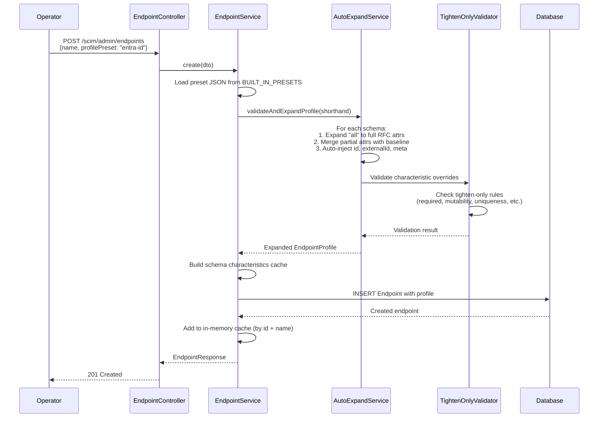
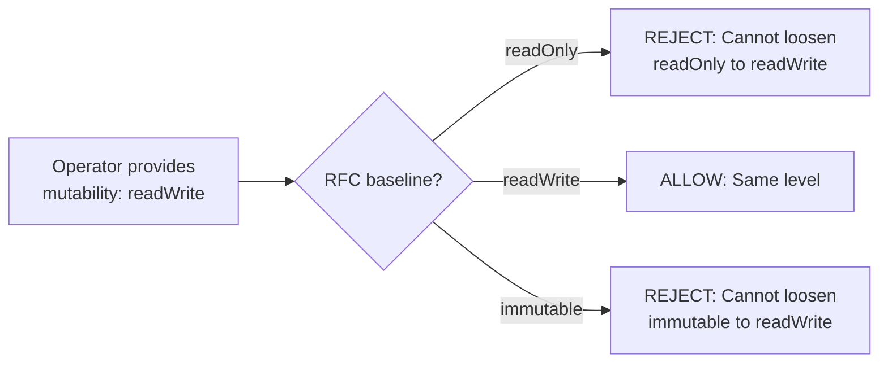
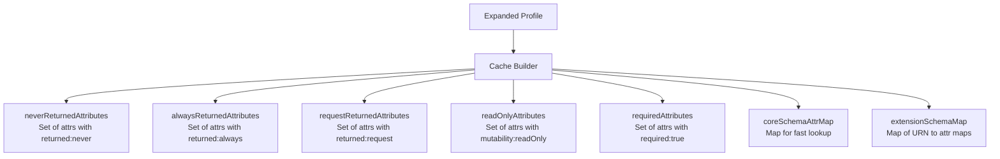

# Endpoint Profile Architecture

> **Version:** 0.38.0 - **Updated:** April 24, 2026  
> **Source of truth:** [endpoint-profile/](../api/src/modules/scim/endpoint-profile/)

---

## Table of Contents

- [Overview](#overview)
- [Profile Structure](#profile-structure)
- [Profile Creation Flow](#profile-creation-flow)
- [Built-In Presets](#built-in-presets)
- [Auto-Expand Engine](#auto-expand-engine)
- [Tighten-Only Validation](#tighten-only-validation)
- [Schema Characteristics Cache](#schema-characteristics-cache)
- [Profile Merging on PATCH](#profile-merging-on-patch)
- [Shorthand Syntax](#shorthand-syntax)
- [Examples](#examples)

---

## Overview

Every endpoint has a **profile** that fully defines its SCIM behavior. A profile is the single source of truth for:

1. **What schemas** are available (attributes, types, characteristics)
2. **What resource types** are supported (Users, Groups, custom types)
3. **What capabilities** the endpoint advertises (bulk, sort, filter, ETag)
4. **How the endpoint behaves** (validation, PATCH, delete, auth flags)

```mermaid
flowchart TD
    A[Operator Input] -->|profilePreset: 'entra-id'| B[Preset Loader]
    A -->|profile: {...}| C[Inline Profile]
    B --> D[Auto-Expand Engine]
    C --> D
    D -->|Expand 'all' attrs<br>Fill from RFC baseline| E[Tighten-Only Validator]
    E -->|Reject loosening| F[Schema Cache Builder]
    F -->|Precompute characteristic maps| G[Stored EndpointProfile]
    G --> H[SCIM Services]
    G --> I[Discovery Endpoints]
    G --> J[Schema Validator]
```

---

## Profile Structure

A full expanded profile has 4 top-level sections:

```typescript
interface EndpointProfile {
  schemas: ScimSchemaDefinition[];       // RFC 7643 S7
  resourceTypes: ScimResourceType[];      // RFC 7643 S6
  serviceProviderConfig: ServiceProviderConfig;  // RFC 7644 S4
  settings: ProfileSettings;              // Project-specific flags
}
```

### schemas[]

Each schema definition includes:

```typescript
interface ScimSchemaDefinition {
  id: string;        // URN (e.g., "urn:ietf:params:scim:schemas:core:2.0:User")
  name: string;      // Human name (e.g., "User")
  description?: string;
  attributes: ScimSchemaAttribute[];
}
```

Each attribute has RFC 7643 S2 characteristics:

```typescript
interface ScimSchemaAttribute {
  name: string;
  type: 'string' | 'boolean' | 'integer' | 'decimal' | 'dateTime' | 'reference' | 'complex' | 'binary';
  multiValued: boolean;
  description?: string;
  required: boolean;
  canonicalValues?: string[];
  caseExact: boolean;
  mutability: 'readOnly' | 'readWrite' | 'immutable' | 'writeOnly';
  returned: 'always' | 'default' | 'request' | 'never';
  uniqueness: 'none' | 'server' | 'global';
  subAttributes?: ScimSchemaAttribute[];      // For complex types
  referenceTypes?: string[];                   // For references
}
```

### resourceTypes[]

```typescript
interface ScimResourceType {
  id: string;       // e.g., "User"
  name: string;
  endpoint: string; // e.g., "/Users"
  schema: string;   // Core schema URN
  schemaExtensions?: SchemaExtensionRef[];
}

interface SchemaExtensionRef {
  schema: string;   // Extension schema URN
  required: boolean;
}
```

### serviceProviderConfig

```typescript
interface ServiceProviderConfig {
  patch: { supported: boolean };
  bulk: { supported: boolean; maxOperations?: number; maxPayloadSize?: number };
  filter: { supported: boolean; maxResults?: number };
  changePassword: { supported: boolean };
  sort: { supported: boolean };
  etag: { supported: boolean };
  authenticationSchemes?: AuthenticationScheme[];
}
```

### settings

See [ENDPOINT_CONFIG_FLAGS_REFERENCE.md](ENDPOINT_CONFIG_FLAGS_REFERENCE.md) for all 16 flags.

---

## Profile Creation Flow



---

## Built-In Presets

6 presets are compiled into the application from JSON files in `api/src/modules/scim/endpoint-profile/presets/`:

| Preset | File | Default | Description |
|--------|------|---------|-------------|
| `entra-id` | entra-id.json | **Yes** | Full Entra ID provisioning. All RFC user/group attributes + 4 Microsoft test extensions. EnterpriseUser. |
| `entra-id-minimal` | entra-id-minimal.json | No | Core identity fields only + 4 Microsoft test extensions. EnterpriseUser. |
| `rfc-standard` | rfc-standard.json | No | Full RFC 7643 compliance. All capabilities enabled (bulk, sort). No vendor extensions. |
| `minimal` | minimal.json | No | Bare minimum User + Group. No extensions. |
| `user-only` | user-only.json | No | User provisioning only. No Group resource type. EnterpriseUser included. |
| `user-only-with-custom-ext` | user-only-with-custom-ext.json | No | User-only with custom extension demonstrating writeOnly/returned:never attributes. |

**Backward compatibility alias:** `'lexmark'` resolves to `'user-only-with-custom-ext'`

### Preset Capabilities Comparison

| Capability | entra-id | entra-id-minimal | rfc-standard | minimal | user-only | user-only-with-custom-ext |
|-----------|----------|-----------------|-------------|---------|-----------|---------------------------|
| Users | Yes | Yes | Yes | Yes | Yes | Yes |
| Groups | Yes | Yes | Yes | Yes | No | No |
| EnterpriseUser | Yes | Yes | Yes | No | Yes | Yes |
| Custom extensions | 4 msft | 4 msft | None | None | None | 1 custom |
| Bulk | No | No | Yes (1000) | No | No | No |
| Sort | No | No | Yes | No | Yes | Yes |
| ETag | Yes | Yes | Yes | No | Yes | No |
| Filter max | 200 | 200 | 200 | 100 | 200 | 200 |
| PrimaryEnforcement | normalize | normalize | reject | passthrough | passthrough | passthrough |

---

## Auto-Expand Engine

The auto-expand engine (implemented in `auto-expand.service.ts`) converts shorthand profile input into a fully qualified EndpointProfile:

### Step 1: Schema Expansion

When a schema uses `"attributes": "all"`, it's expanded to the complete RFC 7643 attribute list for that schema URN:

```json
// Input (shorthand)
{ "id": "urn:ietf:params:scim:schemas:core:2.0:User", "name": "User", "attributes": "all" }

// Expanded output
{ "id": "urn:ietf:params:scim:schemas:core:2.0:User", "name": "User", "attributes": [
    { "name": "userName", "type": "string", "required": true, "uniqueness": "server", ... },
    { "name": "name", "type": "complex", "subAttributes": [...], ... },
    { "name": "displayName", "type": "string", ... },
    // ... all 20+ RFC attributes
  ]
}
```

### Step 2: Attribute Merging

For partial attribute definitions, the engine merges with the RFC baseline:

```json
// Input: operator overrides just required
{ "name": "displayName", "required": true }

// Merged with RFC baseline
{
  "name": "displayName",
  "type": "string",          // filled from baseline
  "multiValued": false,      // filled from baseline
  "required": true,          // operator override wins
  "mutability": "readWrite", // filled from baseline
  "returned": "default",     // filled from baseline
  "uniqueness": "none",      // filled from baseline
  "caseExact": false         // filled from baseline
}
```

### Step 3: Auto-Inject

Required structural attributes are auto-injected if missing:

| Schema | Auto-Injected |
|--------|---------------|
| User | `id` (readOnly), `userName` (required) |
| Group | `id` (readOnly), `displayName` (required) |
| All schemas | `externalId`, `meta` |
| Group (project) | `active` (for soft-delete support) |

---

## Tighten-Only Validation

After expansion, each attribute's characteristics are validated against the RFC baseline. Operators can only **tighten** constraints, never loosen them:



### Tighten-Only Rules

| Characteristic | Allowed Changes | Blocked Changes |
|----------------|----------------|-----------------|
| `required` | `false` - `true` | `true` - `false` |
| `mutability` | readWrite - immutable, readWrite - readOnly | readOnly - readWrite, immutable - readWrite |
| `uniqueness` | none - server, none - global, server - global | global - none, server - none |
| `caseExact` | `false` - `true` | `true` - `false` |
| `type` | **Cannot change** | Any change rejected |
| `multiValued` | **Cannot change** | Any change rejected |

### Error on Violation

```json
{
  "statusCode": 400,
  "message": "Tighten-only validation failed",
  "errors": [
    {
      "schemaId": "urn:ietf:params:scim:schemas:core:2.0:User",
      "attributeName": "userName",
      "characteristic": "mutability",
      "baselineValue": "readWrite",
      "providedValue": "readOnly",
      "message": "Cannot change type for attribute 'userName'"
    }
  ]
}
```

---

## Schema Characteristics Cache

After profile expansion and validation, precomputed characteristic maps are built and stored with the profile for runtime performance:



These caches enable O(1) lookups during request processing instead of scanning the full schema definition on every request.

**Note:** The `_schemaCaches` field is runtime-only and is never included in API responses.

---

## Profile Merging on PATCH

When updating an endpoint via PATCH, profile sections are merged with different strategies:

| Section | Merge Strategy | Rationale |
|---------|---------------|-----------|
| `settings` | **Deep merge** | Individual flags can be toggled without re-specifying all |
| `schemas` | **Replace** | Schema definitions are structural - partial merge would be ambiguous |
| `resourceTypes` | **Replace** | Resource types are structural |
| `serviceProviderConfig` | **Replace** | SPC is a unit configuration |

```bash
# Only updates RequireIfMatch, all other settings preserved
curl -X PATCH http://localhost:8080/scim/admin/endpoints/{id} \
  -H "Authorization: Bearer changeme-scim" \
  -H "Content-Type: application/json" \
  -d '{"profile": {"settings": {"RequireIfMatch": true}}}'
```

---

## Shorthand Syntax

Operators use **ShorthandProfileInput** for concise definitions. The auto-expand engine converts this to full EndpointProfile.

### Shorthand vs Full

| Shorthand Feature | Expansion |
|-------------------|-----------|
| `"attributes": "all"` | Full RFC attribute list for the schema |
| Partial attribute `{ "name": "emails", "required": true }` | Merged with RFC baseline |
| Missing `subAttributes` | Filled from RFC baseline (complex types) |
| Missing structural attrs (id, meta, externalId) | Auto-injected |
| Omitted characteristics | Filled from RFC baseline |

### Full Shorthand Example

```json
{
  "schemas": [
    {
      "id": "urn:ietf:params:scim:schemas:core:2.0:User",
      "name": "User",
      "attributes": [
        { "name": "userName" },
        { "name": "displayName" },
        { "name": "emails" },
        { "name": "active" },
        { "name": "password" }
      ]
    },
    {
      "id": "urn:ietf:params:scim:schemas:extension:enterprise:2.0:User",
      "name": "EnterpriseUser",
      "attributes": "all"
    },
    {
      "id": "urn:example:schemas:custom:2.0:User",
      "name": "CustomExtension",
      "attributes": [
        { "name": "badgeCode", "type": "string", "mutability": "writeOnly", "returned": "never" },
        { "name": "internalId", "type": "string", "mutability": "readOnly", "returned": "always" }
      ]
    }
  ],
  "resourceTypes": [
    {
      "id": "User",
      "name": "User",
      "endpoint": "/Users",
      "schema": "urn:ietf:params:scim:schemas:core:2.0:User",
      "schemaExtensions": [
        { "schema": "urn:ietf:params:scim:schemas:extension:enterprise:2.0:User", "required": false },
        { "schema": "urn:example:schemas:custom:2.0:User", "required": false }
      ]
    }
  ],
  "serviceProviderConfig": {
    "patch": { "supported": true },
    "bulk": { "supported": false },
    "filter": { "supported": true, "maxResults": 200 },
    "sort": { "supported": true },
    "etag": { "supported": true }
  },
  "settings": {
    "StrictSchemaValidation": true,
    "PrimaryEnforcement": "normalize"
  }
}
```

---

## Examples

### Create Endpoint with Preset

```bash
curl -X POST http://localhost:8080/scim/admin/endpoints \
  -H "Authorization: Bearer changeme-scim" \
  -H "Content-Type: application/json" \
  -d '{"name": "prod", "profilePreset": "entra-id"}'
```

### Create Endpoint with Preset + Overrides

```bash
curl -X POST http://localhost:8080/scim/admin/endpoints \
  -H "Authorization: Bearer changeme-scim" \
  -H "Content-Type: application/json" \
  -d '{
    "name": "strict-prod",
    "profilePreset": "entra-id",
    "profile": {
      "settings": {
        "RequireIfMatch": true,
        "PrimaryEnforcement": "reject",
        "PerEndpointCredentialsEnabled": true
      }
    }
  }'
```

### Create Endpoint with Inline Profile

```bash
curl -X POST http://localhost:8080/scim/admin/endpoints \
  -H "Authorization: Bearer changeme-scim" \
  -H "Content-Type: application/json" \
  -d '{
    "name": "custom-app",
    "profile": {
      "schemas": [
        { "id": "urn:ietf:params:scim:schemas:core:2.0:User", "name": "User", "attributes": "all" }
      ],
      "resourceTypes": [
        { "id": "User", "name": "User", "endpoint": "/Users", "schema": "urn:ietf:params:scim:schemas:core:2.0:User" }
      ],
      "serviceProviderConfig": {
        "patch": { "supported": true },
        "bulk": { "supported": false },
        "filter": { "supported": true, "maxResults": 100 }
      },
      "settings": {
        "StrictSchemaValidation": false
      }
    }
  }'
```

### Create Endpoint with Custom Resource Type

```bash
curl -X POST http://localhost:8080/scim/admin/endpoints \
  -H "Authorization: Bearer changeme-scim" \
  -H "Content-Type: application/json" \
  -d '{
    "name": "devices",
    "profile": {
      "schemas": [
        { "id": "urn:ietf:params:scim:schemas:core:2.0:User", "name": "User", "attributes": "all" },
        {
          "id": "urn:example:schemas:2.0:Device",
          "name": "Device",
          "attributes": [
            { "name": "serialNumber", "type": "string", "required": true, "uniqueness": "server" },
            { "name": "model", "type": "string" },
            { "name": "firmware", "type": "string", "mutability": "readOnly" },
            { "name": "location", "type": "complex", "subAttributes": [
              { "name": "building", "type": "string" },
              { "name": "floor", "type": "integer" }
            ]}
          ]
        }
      ],
      "resourceTypes": [
        { "id": "User", "name": "User", "endpoint": "/Users", "schema": "urn:ietf:params:scim:schemas:core:2.0:User" },
        { "id": "Device", "name": "Device", "endpoint": "/Devices", "schema": "urn:example:schemas:2.0:Device" }
      ]
    }
  }'
```
