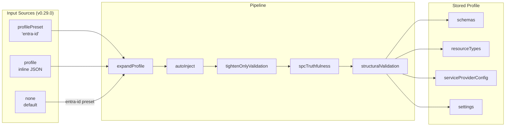
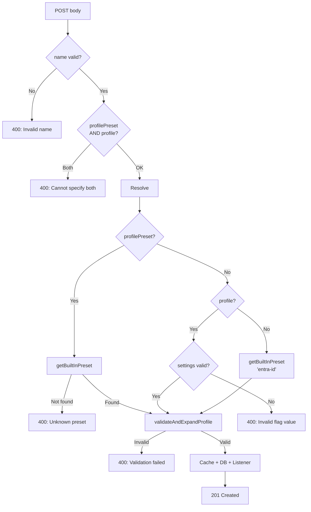
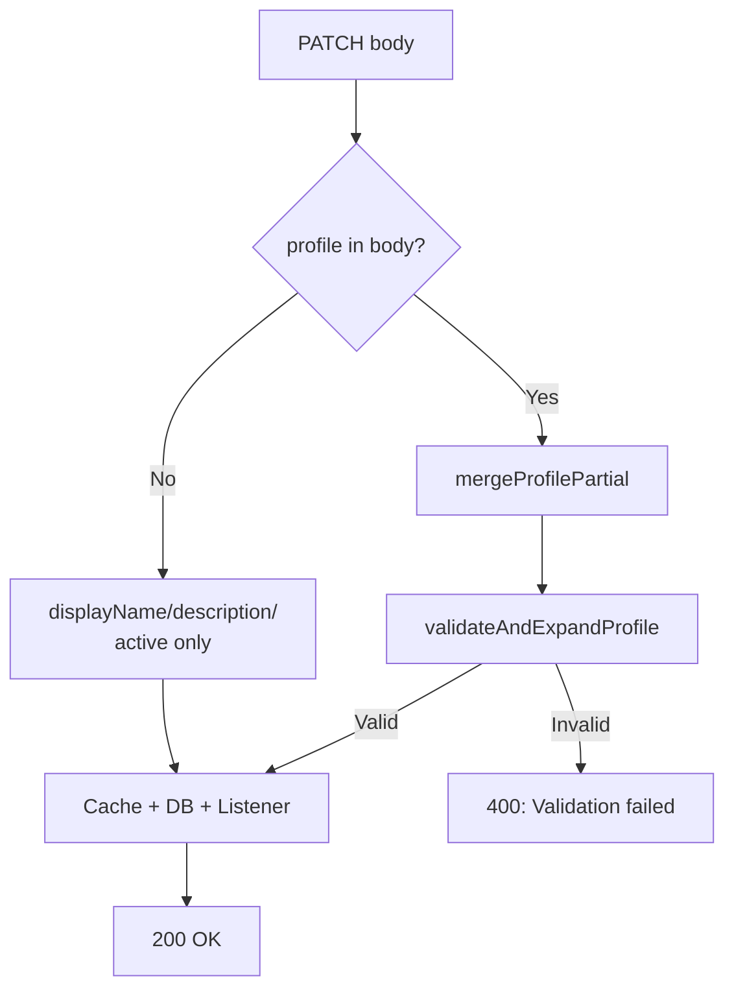
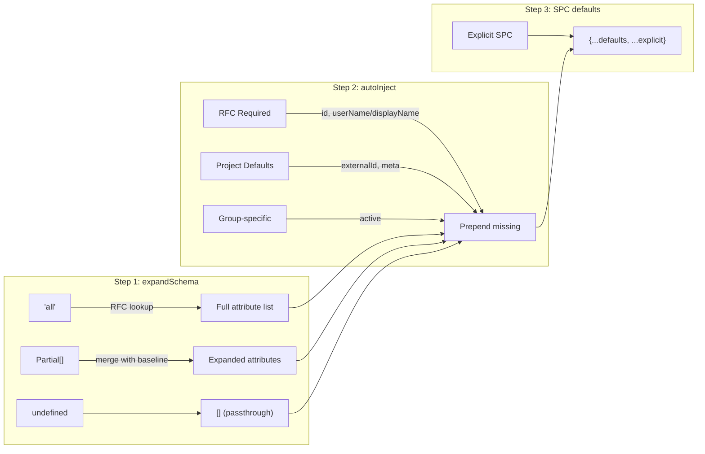
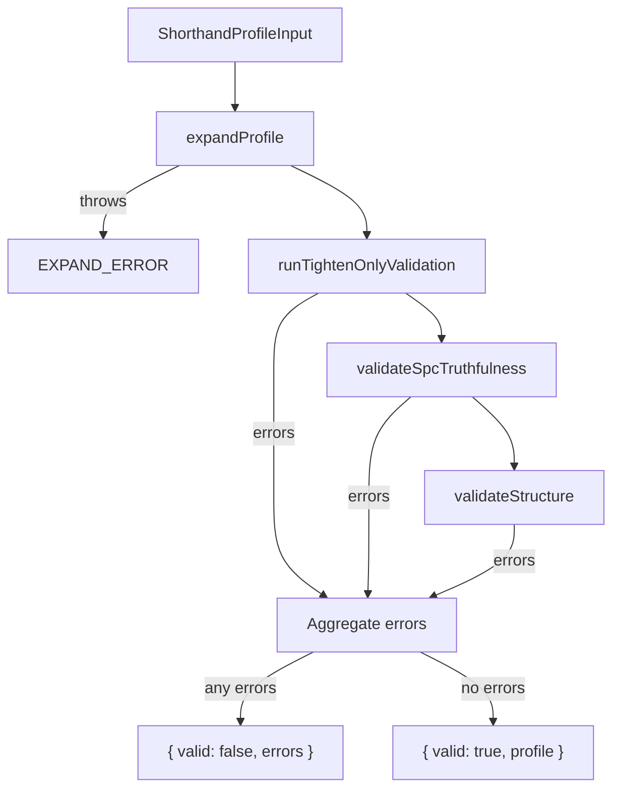
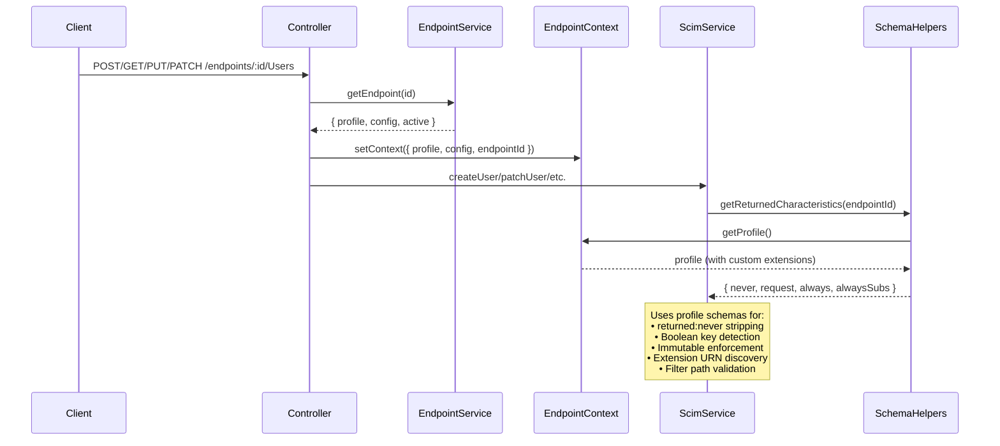
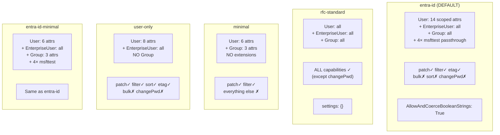

# Endpoint Profile Architecture — Complete Flow Reference

> **Version**: v0.29.0  
> **Date**: 2026-03-16  
> **Status**: Source-of-truth documentation  
> **Scope**: All endpoint profile creation, update, validation, expansion, runtime, and discovery flows

---

## Table of Contents

1. [Overview](#1-overview)
2. [Profile Data Model](#2-profile-data-model)
3. [Creation Flows (POST)](#3-creation-flows-post)
4. [Update Flows (PATCH)](#4-update-flows-patch)
5. [Expansion Pipeline](#5-expansion-pipeline)
6. [Validation Pipeline](#6-validation-pipeline)
7. [Runtime Usage](#7-runtime-usage)
8. [Discovery Endpoints](#8-discovery-endpoints)
9. [Built-in Presets](#9-built-in-presets)
10. [Combination Matrix](#10-combination-matrix)
11. [Error Catalog](#11-error-catalog)

---

## 1. Overview

Every SCIM endpoint has a **profile** — the single source of truth for its schema definitions,
resource type declarations, server capability advertisement, and behavioral settings.



> **v0.29.0**: The legacy `config` admin API field has been removed.
> All endpoint behavioral settings go through `profile.settings`.
> Bulk operations are controlled by `profile.serviceProviderConfig.bulk.supported`.
> Custom resource types are enabled by adding entries to `profile.resourceTypes`.

**Key principle**: The profile is expanded from API inputs using RFC baselines as merge defaults.
Custom schemas and extensions carry exactly the attributes the operator provides — no global
hardcoded injection for unknown schemas.

---

## 2. Profile Data Model

### `EndpointProfile` (stored)

```typescript
interface EndpointProfile {
  schemas: ScimSchemaDefinition[];      // Full expanded attribute definitions
  resourceTypes: ScimResourceType[];    // RT declarations with extension bindings
  serviceProviderConfig: ServiceProviderConfig;  // RFC 7644 §4 capability advertisement
  settings: ProfileSettings;            // Behavioral flags (12 persisted + logLevel)
}
```

### `ShorthandProfileInput` (API input)

```typescript
interface ShorthandProfileInput {
  schemas?: ShorthandSchemaInput[];     // Can use 'all' or partial attrs
  resourceTypes?: ScimResourceType[];   // Same as stored format
  serviceProviderConfig?: Partial<ServiceProviderConfig>;  // Partial OK
  settings?: ProfileSettings;           // Partial OK
}
```

### Schema attribute resolution modes

| `attributes` value | Behavior | Example |
|-------------------|----------|---------|
| `'all'` | Lookup full RFC attribute list for known schemas. **Throws for custom schemas** — they have no RFC baseline. | `{ id: 'urn:...:User', attributes: 'all' }` |
| `Partial<Attr>[]` | Each partial attribute merged with RFC baseline (if known). Explicit overrides win. Custom attributes used as-is. | `[{ name: 'displayName', required: true }]` |
| `undefined` | Passthrough extension — empty attributes. Extension data stored/returned without validation. | MSFT test extensions |

---

## 3. Creation Flows (POST)

### `POST /scim/admin/endpoints`



### Input priority table

| # | Condition | Profile source | Base preset |
|---|-----------|---------------|------------|
| 1 | `profilePreset` set | Named preset's shorthand input | Named preset |
| 2 | `profile` set | Inline shorthand input | N/A — input IS the profile |
| 3 | None provided | `entra-id` preset default | `entra-id` |

> **What this means for settings:** When no profile or preset is specified, the `entra-id` preset sets 5 behavioral flags to `True` (`AllowAndCoerceBooleanStrings`, `VerbosePatchSupported`, `MultiOp…Add`, `MultiOp…Remove`, `PatchOpAllowRemoveAllMembers`). All other flags default to `false`. DELETE is hard-delete, schema validation is lenient, `If-Match` is optional. See [ENDPOINT_CONFIG_FLAGS_REFERENCE.md §2.1](ENDPOINT_CONFIG_FLAGS_REFERENCE.md#21-default-behavior--what-happens-out-of-the-box) for the complete matrix.

### Examples

**Example 1: Preset creation**
```json
POST /scim/admin/endpoints
{ "name": "my-endpoint", "profilePreset": "rfc-standard" }
```
Result: Full RFC 7643 profile — User + EnterpriseUser + Group, all capabilities.

**Example 2: Inline profile with custom extension**
```json
POST /scim/admin/endpoints
{
  "name": "hr-endpoint",
  "profile": {
    "schemas": [
      { "id": "urn:ietf:params:scim:schemas:core:2.0:User", "name": "User", "attributes": "all" },
      {
        "id": "urn:example:hr:2.0:User",
        "name": "HRExtension",
        "attributes": [
          { "name": "badgeNumber", "type": "string", "multiValued": false, "required": false,
            "mutability": "readWrite", "returned": "default" },
          { "name": "secretToken", "type": "string", "multiValued": false, "required": false,
            "mutability": "writeOnly", "returned": "never" }
        ]
      },
      { "id": "urn:ietf:params:scim:schemas:core:2.0:Group", "name": "Group", "attributes": "all" }
    ],
    "resourceTypes": [
      { "id": "User", "name": "User", "endpoint": "/Users",
        "schema": "urn:ietf:params:scim:schemas:core:2.0:User",
        "schemaExtensions": [{ "schema": "urn:example:hr:2.0:User", "required": false }] },
      { "id": "Group", "name": "Group", "endpoint": "/Groups",
        "schema": "urn:ietf:params:scim:schemas:core:2.0:Group",
        "schemaExtensions": [] }
    ],
    "serviceProviderConfig": { "patch": { "supported": true }, "bulk": { "supported": false },
      "filter": { "supported": true, "maxResults": 200 }, "sort": { "supported": true },
      "etag": { "supported": true }, "changePassword": { "supported": false } }
  }
}
```
Result: `urn:example:hr:2.0:User` custom extension with `secretToken` (returned:never) — stripped from all responses.

**Example 3: Default creation (no input)**
```json
POST /scim/admin/endpoints
{ "name": "default-endpoint" }
```
Result: `entra-id` preset — scoped User attributes, MSFT test extensions, no bulk.

**Example 4: Settings-based creation**

> **v0.28.0**: The legacy `config` field has been removed. Use `profile.settings` for boolean flags and `profile.serviceProviderConfig` for capabilities.

```json
POST /scim/admin/endpoints
{
  "name": "custom-settings",
  "profile": {
    "settings": { "UserSoftDeleteEnabled": "True" },
    "serviceProviderConfig": { "bulk": { "supported": true } }
  }
}
```
Result: `rfc-standard` base + `bulk.supported=true` in SPC + `UserSoftDeleteEnabled` in `settings`.

---

## 4. Update Flows (PATCH)

### `PATCH /scim/admin/endpoints/:id`

> **v0.28.0**: The legacy `config` field has been removed from PATCH. Use `profile` exclusively.



### Merge semantics per profile section

| Section | Strategy | Implication |
|---------|----------|-------------|
| `schemas` | **Replace** | New array replaces old. Must include ALL schemas needed by RTs. |
| `resourceTypes` | **Replace** | New array replaces old. Must reference existing schemas. |
| `serviceProviderConfig` | **Shallow merge** | `{ ...current.SPC, ...partial.SPC }` — unmentioned capabilities preserved. |
| `settings` | **Shallow merge** (additive) | `{ ...current.settings, ...partial.settings }` — unmentioned flags preserved. |

### Structural integrity rule

When `schemas` are replaced, all `resourceTypes` must reference schemas in the new set.
The server **intentionally rejects** orphaned RT references to prevent accidental loss
of resource type endpoints:

```
PATCH { "profile": { "schemas": [User] } }
→ 400: ResourceType "Group" references schema "core:2.0:Group" not in schemas array.
```

**Correct approach**: Send both `schemas` and `resourceTypes` together:
```json
PATCH {
  "profile": {
    "schemas": [{ "id": "urn:...:User", "name": "User", "attributes": "all" }],
    "resourceTypes": [{ "id": "User", "name": "User", "endpoint": "/Users",
      "schema": "urn:...:User", "schemaExtensions": [] }]
  }
}
```

### Examples

**Example 5: Add a setting (additive merge)**
```json
PATCH /scim/admin/endpoints/:id
{ "profile": { "settings": { "UserSoftDeleteEnabled": "True" } } }
```
Result: `UserSoftDeleteEnabled` added to existing settings. Schemas, RTs, SPC unchanged.

**Example 6: Replace SPC (shallow merge)**
```json
PATCH /scim/admin/endpoints/:id
{ "profile": { "serviceProviderConfig": { "bulk": { "supported": false } } } }
```
Result: `bulk.supported` set to false. Other SPC fields (patch, filter, etc.) preserved.

**Example 7: Add custom extension via PATCH**
```json
PATCH /scim/admin/endpoints/:id
{
  "profile": {
    "schemas": [
      { "id": "urn:...:User", "name": "User", "attributes": "all" },
      { "id": "urn:custom:badge:2.0:User", "name": "Badge",
        "attributes": [{ "name": "badge", "type": "string", "multiValued": false,
          "required": false, "mutability": "readWrite", "returned": "default" }] },
      { "id": "urn:...:Group", "name": "Group", "attributes": "all" }
    ],
    "resourceTypes": [
      { "id": "User", "name": "User", "endpoint": "/Users", "schema": "urn:...:User",
        "schemaExtensions": [{ "schema": "urn:custom:badge:2.0:User", "required": false }] },
      { "id": "Group", "name": "Group", "endpoint": "/Groups", "schema": "urn:...:Group",
        "schemaExtensions": [] }
    ]
  }
}
```
Result: Custom `Badge` extension added. Existing settings and SPC preserved.

### Immediate Effect — No Restart Required

All profile PATCHes (examples 5–7) take effect **immediately** on the next SCIM request. The update pipeline:

1. `mergeProfilePartial()` merges the partial into the current profile (replace for schemas/RTs, shallow-merge for settings/SPC)
2. `validateAndExpandProfile()` validates the merged result (fails → 400, nothing changes)
3. In-memory endpoint cache is updated synchronously
4. `_schemaCaches` is deleted — lazily rebuilt on first request access
5. `profileChangeListener` fires for any registered listeners

There is no deferred reload, no scheduler, and no eventual consistency — the new profile is immediately visible to discovery, validation, and characteristic enforcement.

**Existing resources** without extension data continue working normally. Extension data is only returned for resources that have it stored in their `rawPayload`.

---

## 5. Expansion Pipeline

### `expandProfile(input) → EndpointProfile`



### Attribute expansion rules

For each attribute in a schema where the schema has an RFC baseline:

```
finalAttribute = {
  ...rfcBaselineAttribute,     // type, multiValued, returned, mutability, etc.
  ...operatorOverrides,        // explicit overrides win (e.g. required: true)
  subAttributes: operator.subAttributes ?? baseline.subAttributes
}
```

For custom schemas (no RFC baseline): attributes are used exactly as provided.

### Auto-inject rules

| Layer | Attributes | Condition |
|-------|-----------|-----------|
| RFC Required | `id` (readOnly, returned:always), `userName`/`displayName` | If missing from schema |
| Project Defaults | `externalId`, `meta` (complex, readOnly) | If missing from schema |
| Group-specific | `active` (boolean) | Group schema only, if missing |

These are injected **regardless** of whether the operator provided them — they are server-essential.

---

## 6. Validation Pipeline

### `validateAndExpandProfile(input) → { valid, errors, profile }`



### Tighten-only validation

Compares operator's attribute characteristics against RFC baseline:

| Characteristic | Allowed changes | Rejected |
|---------------|----------------|----------|
| `type` | None | Any change |
| `multiValued` | None | Any change |
| `required` | `false → true` | `true → false` |
| `mutability` | `readWrite → immutable → readOnly` | Loosening |
| `uniqueness` | `none → server → global` | Loosening |
| `caseExact` | `false → true` | `true → false` |
| `returned` | Any except from `never` | `never → *` |

Custom schemas (no baseline) — **skipped entirely**.

### Structural validation

| Check | Error |
|-------|-------|
| No schemas | `MISSING_SCHEMAS` |
| No resourceTypes | `MISSING_RESOURCE_TYPES` |
| RT's `schema` not in schemas | `RT_MISSING_SCHEMA` |
| RT's extension `schema` not in schemas | `RT_MISSING_EXTENSION_SCHEMA` |
| Duplicate schema IDs | `DUPLICATE_SCHEMA` |
| Duplicate RT names | `DUPLICATE_RT` |

---

## 7. Runtime Usage

### Request lifecycle



### Profile-aware schema resolution

`ScimSchemaHelpers.getProfileAwareSchemaDefinitions()` filters profile schemas to only
those relevant to the current resource type:

1. Build set of relevant URNs: `{ coreSchemaUrn } ∪ { ext.schema for each RT using this core }`
2. For each relevant URN: prefer profile schema, fall back to global registry
3. This ensures User service doesn't see Group schema attributes and vice versa

---

## 8. Discovery Endpoints

All discovery responses are built **directly from the stored profile** — not from any global registry.

| Endpoint | Source | Enrichment |
|----------|--------|------------|
| `GET /Schemas` | `profile.schemas` | Adds `schemas: [Schema URN]`, `meta: { resourceType: 'Schema' }` |
| `GET /Schemas/:urn` | `profile.schemas.find(s => s.id === urn)` | Same enrichment. 404 if not found. |
| `GET /ResourceTypes` | `profile.resourceTypes` | Adds `schemas: [ResourceType URN]`, `meta:` |
| `GET /ResourceTypes/:id` | `profile.resourceTypes.find(r => r.id === id)` | 404 if not found. |
| `GET /ServiceProviderConfig` | `profile.serviceProviderConfig` | Merges with global `meta`, `schemas`, `authenticationSchemes` |

---

## 9. Built-in Presets



| Preset | Schemas | User RTs | Group RTs | Extensions | Bulk | Sort |
|--------|:-------:|:--------:|:---------:|:----------:|:----:|:----:|
| `entra-id` | 7 | 1 (3 ext) | 1 (2 ext) | Enterprise + 4×msft | No | No |
| `entra-id-minimal` | 7 | 1 (3 ext) | 1 (2 ext) | Enterprise + 4×msft | No | No |
| `rfc-standard` | 3 | 1 (1 ext) | 1 (0 ext) | EnterpriseUser | Yes | Yes |
| `minimal` | 2 | 1 (0 ext) | 1 (0 ext) | None | No | No |
| `user-only` | 2 | 1 (1 ext) | **None** | EnterpriseUser | No | No |

---

## 10. Combination Matrix

### Creation input combinations

| `profilePreset` | `profile` | Result |
|:---------------:|:---------:|--------|
| Set | — | Named preset expanded |
| Set | Set | **400**: Cannot specify both |
| — | Set | Inline profile expanded |
| — | — | `entra-id` default preset |

### Update (PATCH) combinations

| `profile` | `displayName`/`active`/etc | Result |
|:---------:|:--------------------------:|--------|
| Set | Optional | Profile merged + fields updated |
| — | Set | Only metadata fields updated, profile unchanged |
| — | — | No-op (200 with unchanged endpoint) |

### Profile section update combinations

| `schemas` | `resourceTypes` | `SPC` | `settings` | Behavior |
|:---------:|:--------------:|:-----:|:----------:|----------|
| Set | Set | — | — | Both replaced. Must be structurally valid. |
| Set | — | — | — | Schemas replaced. **400 if existing RTs reference missing schemas.** |
| — | Set | — | — | RTs replaced. **400 if new RTs reference missing schemas.** |
| — | — | Set | — | SPC shallow-merged. Schemas/RTs untouched. |
| — | — | — | Set | Settings shallow-merged. Everything else untouched. |
| Set | Set | Set | Set | All sections updated. Full revalidation. |
| Set | — | — | Set | Schemas replaced + settings merged. **400 if RT mismatch.** |
| — | — | Set | Set | SPC + settings merged. Safe — no structural impact. |

---

## 11. Error Catalog

### Profile validation errors

| Code | Trigger | HTTP Status | Detail |
|------|---------|:-----------:|--------|
| `EXPAND_ERROR` | Schema expansion failed (e.g. `'all'` on custom schema) | 400 | `expandProfile` threw |
| `TIGHTEN_TYPE` | Type changed from RFC baseline | 400 | Cannot change type of 'X' on 'schemaId' |
| `TIGHTEN_MULTIVALUED` | multiValued changed | 400 | Cannot change multiValued |
| `TIGHTEN_REQUIRED` | Required loosened (`true → false`) | 400 | Cannot loosen required |
| `TIGHTEN_MUTABILITY` | Mutability loosened | 400 | Cannot loosen mutability |
| `TIGHTEN_RETURNED` | returned:never loosened | 400 | Cannot loosen returned:never |
| `SPC_UNIMPLEMENTED` | `changePassword.supported: true` | 400 | Server does not implement changePassword |
| `SPC_INVALID_VALUE` | maxResults < 1 or > 10000 | 400 | Invalid SPC numeric value |
| `MISSING_SCHEMAS` | No schemas in profile | 400 | Profile must contain at least one schema |
| `MISSING_RESOURCE_TYPES` | No resourceTypes | 400 | Profile must contain at least one resourceType |
| `RT_MISSING_SCHEMA` | RT core schema not in schemas[] | 400 | ResourceType "X" references missing schema |
| `RT_MISSING_EXTENSION_SCHEMA` | RT extension schema not in schemas[] | 400 | ResourceType "X" extension references missing schema |
| `DUPLICATE_SCHEMA` | Same schema ID twice | 400 | Duplicate schema id |
| `DUPLICATE_RT` | Same RT name twice | 400 | Duplicate resource type name |

### Admin API errors

| Condition | HTTP Status | Detail |
|-----------|:-----------:|--------|
| Invalid endpoint name | 400 | Name must match `[a-zA-Z0-9_-]+` |
| `profilePreset` + `profile` both set | 400 | Cannot specify both |
| Unknown preset name | 400 | Unknown preset "X". Valid: entra-id, ... |
| Duplicate endpoint name | 400 | Endpoint "X" already exists |
| Invalid settings value | 400 | Invalid value "Yes" for flag "X". Allowed: True/False/1/0 |

---

## 12. Database Storage

### Prisma Schema

The `Endpoint` model stores the profile as a JSONB column:

```prisma
model Endpoint {
  id          String   @id @default(uuid())
  name        String   @unique
  displayName String?
  description String?
  profile     Json?    // Full EndpointProfile stored as JSONB
  active      Boolean  @default(true)
  createdAt   DateTime @default(now())
  updatedAt   DateTime @updatedAt
}
```

### Stored Profile JSON (example from DB)

```json
{
  "schemas": [
    {
      "id": "urn:ietf:params:scim:schemas:core:2.0:User",
      "name": "User",
      "description": "User Account",
      "attributes": [
        { "name": "id", "type": "string", "multiValued": false, "required": true,
          "mutability": "readOnly", "returned": "always", "caseExact": true, "uniqueness": "server" },
        { "name": "userName", "type": "string", "multiValued": false, "required": true,
          "mutability": "readWrite", "returned": "default", "caseExact": false, "uniqueness": "server" },
        "... (20+ attributes)"
      ]
    },
    { "id": "urn:...:Group", "name": "Group", "attributes": ["..."] }
  ],
  "resourceTypes": [
    { "id": "User", "name": "User", "endpoint": "/Users",
      "schema": "urn:ietf:params:scim:schemas:core:2.0:User",
      "schemaExtensions": [] }
  ],
  "serviceProviderConfig": {
    "patch": { "supported": true },
    "bulk": { "supported": false },
    "filter": { "supported": true, "maxResults": 200 },
    "sort": { "supported": false },
    "etag": { "supported": true },
    "changePassword": { "supported": false }
  },
  "settings": {
    "AllowAndCoerceBooleanStrings": "True"
  }
}
```

### InMemory Storage

When `PERSISTENCE_BACKEND=inmemory`, endpoints are stored in a `Map<string, EndpointResponse>`
keyed by endpoint ID. The profile is the same JSON structure, held in memory.

---

## Version History

| Date | Change |
|------|--------|
| 2026-03-16 | v0.29.0 — Remove legacy config references, add DB storage section, update combination matrices |
| 2026-03-16 | Initial — comprehensive profile flow documentation from source code audit |
