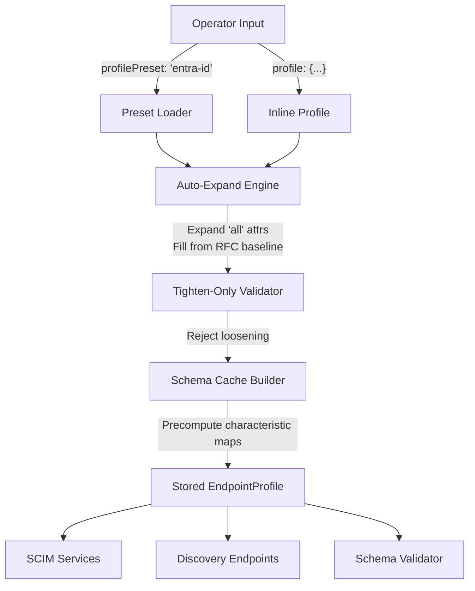
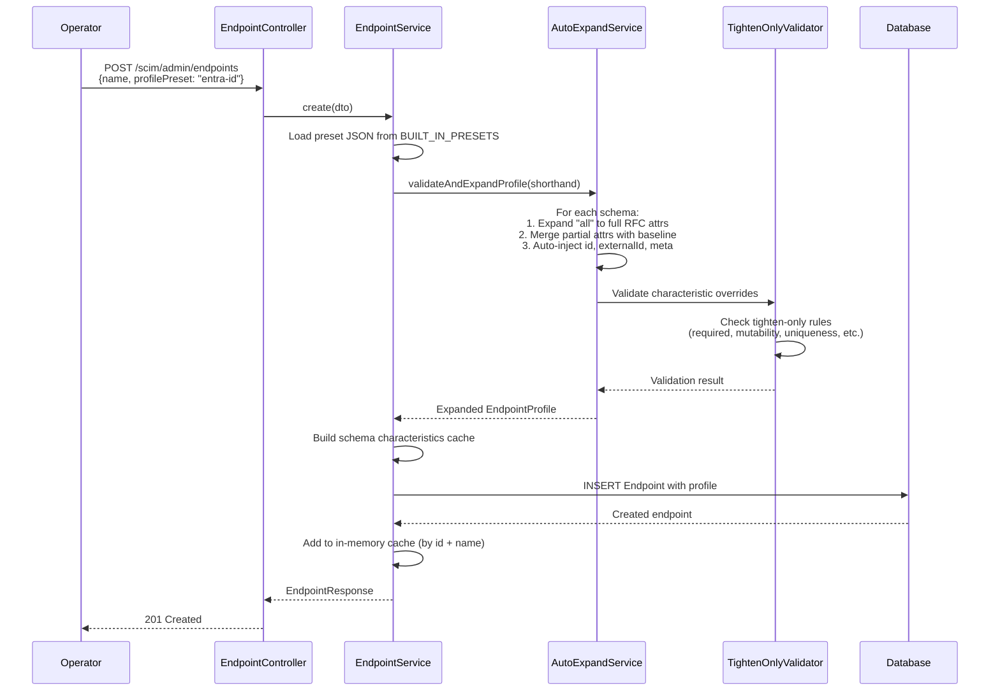
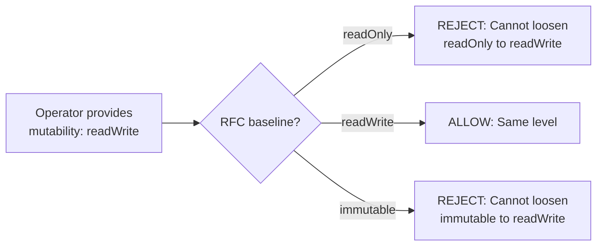
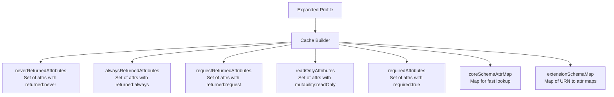
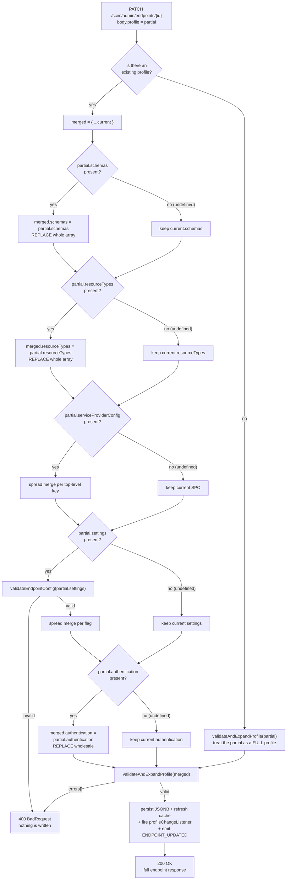

# Endpoint Profile Architecture

> **Status:** User-facing reference - **Last verified:** 2026-08-04 - **Product version:** `0.55.10`

> **Updated:** 2026-08-04  
> **Source of truth:** [endpoint-profile/](../api/src/modules/scim/endpoint-profile/) and [endpoint.service.ts](../api/src/modules/endpoint/services/endpoint.service.ts)

---

## Table of Contents

- [Overview](#overview)
- [Profile Structure](#profile-structure)
- [Profile Creation Flow](#profile-creation-flow)
- [Built-In Presets](#built-in-presets)
- [Auto-Expand Engine](#auto-expand-engine)
- [Tighten-Only Validation](#tighten-only-validation)
- [Schema Characteristics Cache](#schema-characteristics-cache)
- [Profile Merging on PATCH](#profile-merging-on-patch)
- [Shorthand Syntax](#shorthand-syntax)
- [Examples](#examples)

---

## Overview

Every endpoint has a **profile** that fully defines its SCIM behavior. A profile is the single source of truth for:

1. **What schemas** are available (attributes, types, characteristics)
2. **What resource types** are supported (Users, Groups, custom types)
3. **What capabilities** the endpoint advertises (bulk, sort, filter, ETag)
4. **How the endpoint behaves** (validation, PATCH, delete, auth flags)


```mermaid
flowchart TD
    A[Operator Input] -->|"profilePreset: 'entra-id'"| B[Preset Loader]
    A -->|"profile: {...}"| C[Inline Profile]
    B --> D[Auto-Expand Engine]
    C --> D
    D -->|Expand 'all' attrs<br>Fill from RFC baseline| E[Tighten-Only Validator]
    E -->|Reject loosening| F[Schema Cache Builder]
    F -->|Precompute characteristic maps| G[Stored EndpointProfile]
    G --> H[SCIM Services]
    G --> I[Discovery Endpoints]
    G --> J[Schema Validator]
```

---

## Profile Structure

A full expanded profile has 4 top-level sections:

```typescript
interface EndpointProfile {
  schemas: ScimSchemaDefinition[];       // RFC 7643 S7
  resourceTypes: ScimResourceType[];      // RFC 7643 S6
  serviceProviderConfig: ServiceProviderConfig;  // RFC 7644 S4
  settings: ProfileSettings;              // Project-specific flags
}
```

### schemas[]

Each schema definition includes:

```typescript
interface ScimSchemaDefinition {
  id: string;        // URN (e.g., "urn:ietf:params:scim:schemas:core:2.0:User")
  name: string;      // Human name (e.g., "User")
  description?: string;
  attributes: ScimSchemaAttribute[];
}
```

Each attribute has RFC 7643 S2 characteristics:

```typescript
interface ScimSchemaAttribute {
  name: string;
  type: 'string' | 'boolean' | 'integer' | 'decimal' | 'dateTime' | 'reference' | 'complex' | 'binary';
  multiValued: boolean;
  description?: string;
  required: boolean;
  canonicalValues?: string[];
  caseExact: boolean;
  mutability: 'readOnly' | 'readWrite' | 'immutable' | 'writeOnly';
  returned: 'always' | 'default' | 'request' | 'never';
  uniqueness: 'none' | 'server' | 'global';
  subAttributes?: ScimSchemaAttribute[];      // For complex types
  referenceTypes?: string[];                   // For references
}
```

### resourceTypes[]

```typescript
interface ScimResourceType {
  id: string;       // e.g., "User"
  name: string;
  endpoint: string; // e.g., "/Users"
  schema: string;   // Core schema URN
  schemaExtensions?: SchemaExtensionRef[];
}

interface SchemaExtensionRef {
  schema: string;   // Extension schema URN
  required: boolean;
}
```

### serviceProviderConfig

```typescript
interface ServiceProviderConfig {
  patch: { supported: boolean };
  bulk: { supported: boolean; maxOperations?: number; maxPayloadSize?: number };
  filter: { supported: boolean; maxResults?: number };
  changePassword: { supported: boolean };
  sort: { supported: boolean };
  etag: { supported: boolean };
  authenticationSchemes?: AuthenticationScheme[];
}
```

### settings

See [ENDPOINT_CONFIG_FLAGS_REFERENCE.md](ENDPOINT_CONFIG_FLAGS_REFERENCE.md) for all 16 flags.

---

## Profile Creation Flow


```mermaid
sequenceDiagram
    participant Op as Operator
    participant EC as EndpointController
    participant ES as EndpointService
    participant AE as AutoExpandService
    participant TV as TightenOnlyValidator
    participant DB as Database

    Op->>EC: POST /scim/admin/endpoints<br>{name, profilePreset: "entra-id"}
    EC->>ES: create(dto)
    ES->>ES: Load preset JSON from BUILT_IN_PRESETS
    ES->>AE: validateAndExpandProfile(shorthand)
    AE->>AE: For each schema:<br>1. Expand "all" to full RFC attrs<br>2. Merge partial attrs with baseline<br>3. Auto-inject id, externalId, meta
    AE->>TV: Validate characteristic overrides
    TV->>TV: Check tighten-only rules<br>(required, mutability, uniqueness, etc.)
    TV-->>AE: Validation result
    AE-->>ES: Expanded EndpointProfile
    ES->>ES: Build schema characteristics cache
    ES->>DB: INSERT Endpoint with profile
    DB-->>ES: Created endpoint
    ES->>ES: Add to in-memory cache (by id + name)
    ES-->>EC: EndpointResponse
    EC-->>Op: 201 Created
```

---

## Built-In Presets

6 presets are compiled into the application from JSON files in `api/src/modules/scim/endpoint-profile/presets/`:

| Preset | File | Default | Description |
|--------|------|---------|-------------|
| `entra-id` | entra-id.json | **Yes** | Full Entra ID provisioning. All RFC user/group attributes + 4 Microsoft test extensions. EnterpriseUser. |
| `entra-id-minimal` | entra-id-minimal.json | No | Core identity fields only + 4 Microsoft test extensions. EnterpriseUser. |
| `rfc-standard` | rfc-standard.json | No | Full RFC 7643 compliance. All capabilities enabled (bulk, sort). No vendor extensions. |
| `minimal` | minimal.json | No | Bare minimum User + Group. No extensions. |
| `user-only` | user-only.json | No | User provisioning only. No Group resource type. EnterpriseUser included. |
| `user-only-with-custom-ext` | user-only-with-custom-ext.json | No | User-only with custom extension demonstrating writeOnly/returned:never attributes. |

**Backward compatibility alias:** `'lexmark'` resolves to `'user-only-with-custom-ext'`

### Preset Capabilities Comparison

| Capability | entra-id | entra-id-minimal | rfc-standard | minimal | user-only | user-only-with-custom-ext |
|-----------|----------|-----------------|-------------|---------|-----------|---------------------------|
| Users | Yes | Yes | Yes | Yes | Yes | Yes |
| Groups | Yes | Yes | Yes | Yes | No | No |
| EnterpriseUser | Yes | Yes | Yes | No | Yes | Yes |
| Custom extensions | 4 msft | 4 msft | None | None | None | 1 custom |
| Bulk | No | No | Yes (1000) | No | No | No |
| Sort | No | No | Yes | No | Yes | Yes |
| ETag | Yes | Yes | Yes | No | Yes | No |
| Filter max | 200 | 200 | 200 | 100 | 200 | 200 |
| PrimaryEnforcement | normalize | normalize | reject | passthrough | passthrough | passthrough |

---

## Auto-Expand Engine

The auto-expand engine (implemented in `auto-expand.service.ts`) converts shorthand profile input into a fully qualified EndpointProfile:

### Step 1: Schema Expansion

When a schema uses `"attributes": "all"`, it's expanded to the complete RFC 7643 attribute list for that schema URN:

```jsonc
// Schematic shape - "..." marks elided attributes, not a literal value.
// Input (shorthand)
{ "id": "urn:ietf:params:scim:schemas:core:2.0:User", "name": "User", "attributes": "all" }

// Expanded output
{ "id": "urn:ietf:params:scim:schemas:core:2.0:User", "name": "User", "attributes": [
    { "name": "userName", "type": "string", "required": true, "uniqueness": "server", ... },
    { "name": "name", "type": "complex", "subAttributes": [...], ... },
    { "name": "displayName", "type": "string", ... },
    // ... all 20+ RFC attributes
  ]
}
```

### Step 2: Attribute Merging

For partial attribute definitions, the engine merges with the RFC baseline:

```jsonc
// Schematic shape - two documents shown for before/after comparison.
// Input: operator overrides just required
{ "name": "displayName", "required": true }

// Merged with RFC baseline
{
  "name": "displayName",
  "type": "string",          // filled from baseline
  "multiValued": false,      // filled from baseline
  "required": true,          // operator override wins
  "mutability": "readWrite", // filled from baseline
  "returned": "default",     // filled from baseline
  "uniqueness": "none",      // filled from baseline
  "caseExact": false         // filled from baseline
}
```

### Step 3: Auto-Inject

Required structural attributes are auto-injected if missing:

| Schema | Auto-Injected |
|--------|---------------|
| User | `id` (readOnly), `userName` (required) |
| Group | `id` (readOnly), `displayName` (required) |
| All schemas | `externalId`, `meta` |
| Group (project) | `active` (for soft-delete support) |

---

## Tighten-Only Validation

After expansion, each attribute's characteristics are validated against the RFC baseline. Operators can only **tighten** constraints, never loosen them:


```mermaid
flowchart LR
    A[Operator provides<br>mutability: readWrite] --> B{RFC baseline?}
    B -->|readOnly| C[REJECT: Cannot loosen<br>readOnly to readWrite]
    B -->|readWrite| D[ALLOW: Same level]
    B -->|immutable| E[REJECT: Cannot loosen<br>immutable to readWrite]
```

### Tighten-Only Rules

| Characteristic | Allowed Changes | Blocked Changes |
|----------------|----------------|-----------------|
| `required` | `false` - `true` | `true` - `false` |
| `mutability` | readWrite - immutable, readWrite - readOnly | readOnly - readWrite, immutable - readWrite |
| `uniqueness` | none - server, none - global, server - global | global - none, server - none |
| `caseExact` | `false` - `true` | `true` - `false` |
| `type` | **Cannot change** | Any change rejected |
| `multiValued` | **Cannot change** | Any change rejected |

### Error on Violation

```json
{
  "statusCode": 400,
  "message": "Tighten-only validation failed",
  "errors": [
    {
      "schemaId": "urn:ietf:params:scim:schemas:core:2.0:User",
      "attributeName": "userName",
      "characteristic": "mutability",
      "baselineValue": "readWrite",
      "providedValue": "readOnly",
      "message": "Cannot change type for attribute 'userName'"
    }
  ]
}
```

---

## Schema Characteristics Cache

After profile expansion and validation, precomputed characteristic maps are built and stored with the profile for runtime performance:


```mermaid
flowchart TD
    A[Expanded Profile] --> B[Cache Builder]
    B --> C[neverReturnedAttributes<br>Set of attrs with returned:never]
    B --> D[alwaysReturnedAttributes<br>Set of attrs with returned:always]
    B --> E[requestReturnedAttributes<br>Set of attrs with returned:request]
    B --> F[readOnlyAttributes<br>Set of attrs with mutability:readOnly]
    B --> G[requiredAttributes<br>Set of attrs with required:true]
    B --> H[coreSchemaAttrMap<br>Map for fast lookup]
    B --> I[extensionSchemaMap<br>Map of URN to attr maps]
```

These caches enable O(1) lookups during request processing instead of scanning the full schema definition on every request.

**Note:** The `_schemaCaches` field is runtime-only and is never included in API responses.

---

## Profile Merging on PATCH

`PATCH /scim/admin/endpoints/{endpointId}` accepts a **partial** profile. Each of the five
sections is merged with its own strategy by `mergeProfilePartial()` in
[endpoint.service.ts](../api/src/modules/endpoint/services/endpoint.service.ts) (lines 768-815),
and the **merged** document is then re-validated as a whole by `validateAndExpandProfile()`.

### The two rules that govern every PATCH

1. **A section you omit is preserved.** Every branch is guarded by
   `if (partial.<section> !== undefined)`, so leaving `schemas` out of the body cannot
   wipe it. Toggling one flag never endangers the schema set.
2. **A section you include is taken at face value.** For `schemas` and `resourceTypes`
   the whole array is swapped in. Sending a one-element `schemas` array leaves the
   endpoint with exactly one schema.

### Merge strategy per section

| Section | Strategy when **present** | Effect when **omitted** | Source line | Rationale |
|---------|---------------------------|-------------------------|-------------|-----------|
| `schemas` | **Replace whole array** | Preserved unchanged | 785-787 | Schema definitions are structural - a positional merge would be ambiguous |
| `resourceTypes` | **Replace whole array** | Preserved unchanged | 789-791 | Resource types are structural and reference schemas by URN |
| `serviceProviderConfig` | **Per-key merge** - `{ ...current, ...partial }`. A top-level key you send (`patch`, `bulk`, `filter`, `sort`, `etag`, `changePassword`) is replaced **wholesale**; a top-level key you omit is kept | Preserved unchanged | 793-795 | Each capability is an independent sub-object |
| `settings` | **Per-key merge** - validated by `validateEndpointConfig()` first, then `{ ...current, ...partial }`. `ProfileSettings` is a flat map of scalars, so the effect is per-flag | Preserved unchanged | 797-805 | Individual flags can be toggled without re-specifying all |
| `authentication` | **Replace wholesale** | Preserved unchanged | 807-809 | The admin authentication-methods API computes the full block and submits it |

> **Correction (2026-08-04):** earlier revisions of this table listed
> `serviceProviderConfig` as **Replace**. The source performs a spread merge, so
> omitted top-level capability keys survive a PATCH. Only the keys you actually send
> are overwritten.

### Decision flow


```mermaid
flowchart TD
    START["PATCH /scim/admin/endpoints/{id}<br/>body.profile = partial"] --> HAS{"is there an<br/>existing profile?"}
    HAS -->|no| FULL["validateAndExpandProfile(partial)<br/>treat the partial as a FULL profile"]
    HAS -->|yes| COPY["merged = { ...current }"]

    COPY --> S1{"partial.schemas<br/>present?"}
    S1 -->|yes| S1R["merged.schemas = partial.schemas<br/>REPLACE whole array"]
    S1 -->|"no (undefined)"| S1K["keep current.schemas"]

    S1R --> S2{"partial.resourceTypes<br/>present?"}
    S1K --> S2
    S2 -->|yes| S2R["merged.resourceTypes = partial.resourceTypes<br/>REPLACE whole array"]
    S2 -->|"no (undefined)"| S2K["keep current.resourceTypes"]

    S2R --> S3{"partial.serviceProviderConfig<br/>present?"}
    S2K --> S3
    S3 -->|yes| S3R["spread merge per top-level key"]
    S3 -->|"no (undefined)"| S3K["keep current SPC"]

    S3R --> S4{"partial.settings<br/>present?"}
    S3K --> S4
    S4 -->|yes| S4V["validateEndpointConfig(partial.settings)"]
    S4V -->|invalid| ERR400["400 BadRequest<br/>nothing is written"]
    S4V -->|valid| S4R["spread merge per flag"]
    S4 -->|"no (undefined)"| S4K["keep current settings"]

    S4R --> S5{"partial.authentication<br/>present?"}
    S4K --> S5
    S5 -->|yes| S5R["merged.authentication = partial.authentication<br/>REPLACE wholesale"]
    S5 -->|"no (undefined)"| S5K["keep current authentication"]

    S5R --> VAL["validateAndExpandProfile(merged)"]
    S5K --> VAL
    FULL --> VAL
    VAL -->|"errors[]"| ERR400
    VAL -->|valid| PERSIST["persist JSONB + refresh cache<br/>+ fire profileChangeListener<br/>+ emit ENDPOINT_UPDATED"]
    PERSIST --> OK200["200 OK<br/>full endpoint response"]
```

### Toggling one flag - the safe, minimal PATCH

```bash
# Only updates RequireIfMatch. schemas, resourceTypes, SPC and every other
# flag are preserved because they are absent from the body.
curl -X PATCH http://localhost:8080/scim/admin/endpoints/{id} \
  -H "Authorization: Bearer changeme-scim" \
  -H "Content-Type: application/json" \
  -d '{"profile": {"settings": {"RequireIfMatch": true}}}'
```

### Changing schemas or resourceTypes - always read-modify-write

Because both arrays are replaced wholesale, the only safe pattern is to fetch the
current profile, edit the arrays in place, and send the **complete** arrays back.

```powershell
$base = "http://localhost:8080"
$id   = "<endpointId>"
$h    = @{ Authorization = "Bearer changeme-scim"; "Content-Type" = "application/json" }

# 1. READ - single-get defaults to view=full, so profile is included
$current = Invoke-RestMethod -Uri "$base/scim/admin/endpoints/$id`?view=full" -Method GET -Headers $h

# 2. MODIFY - append the new extension schema, keep every existing one
$newSchema = @{
  id          = "urn:example:params:scim:schemas:extension:device:2.0:Device"
  name        = "Device"
  description = "Custom device extension"
  attributes  = @(
    @{ name = "serialNumber"; type = "string"; multiValued = $false; required = $false;
       mutability = "readWrite"; returned = "default"; caseExact = $false; uniqueness = "none" }
  )
}

# Bind the new schema to the User resource type as an extension
$resourceTypes = $current.profile.resourceTypes
($resourceTypes | Where-Object { $_.id -eq 'User' }).schemaExtensions += @{
  schema = $newSchema.id; required = $false
}

# 3. WRITE - send the COMPLETE arrays back
$body = @{
  profile = @{
    schemas       = @($current.profile.schemas) + $newSchema
    resourceTypes = @($resourceTypes)
  }
} | ConvertTo-Json -Depth 12

Invoke-RestMethod -Uri "$base/scim/admin/endpoints/$id" -Method PATCH -Headers $h -Body $body
```

### Structural integrity is validated across sections

`validateAndExpandProfile()` runs on the **merged** document, so a `resourceTypes[]` entry
may only reference a schema URN that is present in the merged `schemas[]`. Replacing
`schemas` without carrying the URNs the resource types depend on is rejected. Captured from
a live run against `localhost:6000` on 2026-08-04:

```http
HTTP/1.1 400 Bad Request
Content-Type: application/scim+json

{
  "schemas": [
    "urn:ietf:params:scim:api:messages:2.0:Error"
  ],
  "detail": "Profile validation failed: ResourceType \"Group\" references schema \"urn:ietf:params:scim:schemas:core:2.0:Group\" which is not in the schemas array.",
  "status": "400",
  "urn:scimserver:api:messages:2.0:Diagnostics": {
    "requestId": "9eee4966-9472-4938-a98f-01307e175c11",
    "endpointId": "59a49745-61a3-4e9a-ad5d-4d3f1e4be49c",
    "logsUrl": "/scim/endpoints/59a49745-61a3-4e9a-ad5d-4d3f1e4be49c/logs/recent?requestId=9eee4966-9472-4938-a98f-01307e175c11"
  }
}
```

Source of the `detail` string: [endpoint-profile.service.ts](../api/src/modules/scim/endpoint-profile/endpoint-profile.service.ts) line 131.

A rejected PATCH is atomic - `mergeProfilePartial()` throws before `prisma.endpoint.update()`
is reached, so the stored profile is left exactly as it was. Verified live: after this 400
the endpoint still had its previous single resource type.

### When the change takes effect

Immediately, on the next SCIM request. There is no restart and no TTL. After a successful
PATCH the service replaces the cached endpoint object synchronously, which discards the
lazily-built `_schemaCaches`, then fires `profileChangeListener` and broadcasts
`ENDPOINT_UPDATED` on SSE. Discovery (`/Schemas`, `/ResourceTypes`), schema validation and
characteristic enforcement all read the new profile on the very next call.

### Live verification of this section

Every claim above was measured against a running v0.55.0 server (inmemory backend,
`localhost:6000`) on 2026-08-04 - 17 assertions, 0 failures. The claims are outcome-level
(array contents, preserved key sets, persisted state after a rejection), not
status-code-level.

| # | Claim | Measured outcome |
|---|-------|------------------|
| C1 | Omitting a section preserves it | A settings-only PATCH left all 7 schemas, both resource types and all 6 SPC keys byte-identical, while the flag did change |
| C2 | `settings` merges per flag | A second single-flag PATCH did not clear the flag set by the first |
| C3 | `serviceProviderConfig` is a **per-key merge** | Sending only `sort` overwrote `sort` and preserved `patch`, `bulk`, `filter`, `changePassword`, `etag` |
| C4 | `schemas` / `resourceTypes` are replaced | A 1-element `schemas` array took the endpoint from 7 schemas to 1; the EnterpriseUser extension that was not resent was gone |
| C5 | Cross-section validation, atomic rejection | Adding a `Group` resource type with no Group schema returned `400` with the documented `detail`, and the stored profile was unchanged afterwards |
| C6 | Read-modify-write goes live immediately | A newly added extension URN appeared in `GET /endpoints/{id}/Schemas` and bound to the User type in `/ResourceTypes` with no restart |
| C7 | Top-level fields follow omit-preserves | A `displayName`-only PATCH left `name` and the whole profile intact |

C3 is the assertion that corrected this document: the previous revision's **Replace** row
would have predicted the other five SPC keys disappearing, and they did not.

---

## Shorthand Syntax

Operators use **ShorthandProfileInput** for concise definitions. The auto-expand engine converts this to full EndpointProfile.

### Shorthand vs Full

| Shorthand Feature | Expansion |
|-------------------|-----------|
| `"attributes": "all"` | Full RFC attribute list for the schema |
| Partial attribute `{ "name": "emails", "required": true }` | Merged with RFC baseline |
| Missing `subAttributes` | Filled from RFC baseline (complex types) |
| Missing structural attrs (id, meta, externalId) | Auto-injected |
| Omitted characteristics | Filled from RFC baseline |

### Full Shorthand Example

```json
{
  "schemas": [
    {
      "id": "urn:ietf:params:scim:schemas:core:2.0:User",
      "name": "User",
      "attributes": [
        { "name": "userName" },
        { "name": "displayName" },
        { "name": "emails" },
        { "name": "active" },
        { "name": "password" }
      ]
    },
    {
      "id": "urn:ietf:params:scim:schemas:extension:enterprise:2.0:User",
      "name": "EnterpriseUser",
      "attributes": "all"
    },
    {
      "id": "urn:example:schemas:custom:2.0:User",
      "name": "CustomExtension",
      "attributes": [
        { "name": "badgeCode", "type": "string", "mutability": "writeOnly", "returned": "never" },
        { "name": "internalId", "type": "string", "mutability": "readOnly", "returned": "always" }
      ]
    }
  ],
  "resourceTypes": [
    {
      "id": "User",
      "name": "User",
      "endpoint": "/Users",
      "schema": "urn:ietf:params:scim:schemas:core:2.0:User",
      "schemaExtensions": [
        { "schema": "urn:ietf:params:scim:schemas:extension:enterprise:2.0:User", "required": false },
        { "schema": "urn:example:schemas:custom:2.0:User", "required": false }
      ]
    }
  ],
  "serviceProviderConfig": {
    "patch": { "supported": true },
    "bulk": { "supported": false },
    "filter": { "supported": true, "maxResults": 200 },
    "sort": { "supported": true },
    "etag": { "supported": true }
  },
  "settings": {
    "StrictSchemaValidation": true,
    "PrimaryEnforcement": "normalize"
  }
}
```

---

## Examples

### Create Endpoint with Preset

```bash
curl -X POST http://localhost:8080/scim/admin/endpoints \
  -H "Authorization: Bearer changeme-scim" \
  -H "Content-Type: application/json" \
  -d '{"name": "prod", "profilePreset": "entra-id"}'
```

### Create Endpoint with Preset + Overrides

```bash
curl -X POST http://localhost:8080/scim/admin/endpoints \
  -H "Authorization: Bearer changeme-scim" \
  -H "Content-Type: application/json" \
  -d '{
    "name": "strict-prod",
    "profilePreset": "entra-id",
    "profile": {
      "settings": {
        "RequireIfMatch": true,
        "PrimaryEnforcement": "reject",
        "PerEndpointCredentialsEnabled": true
      }
    }
  }'
```

### Create Endpoint with Inline Profile

```bash
curl -X POST http://localhost:8080/scim/admin/endpoints \
  -H "Authorization: Bearer changeme-scim" \
  -H "Content-Type: application/json" \
  -d '{
    "name": "custom-app",
    "profile": {
      "schemas": [
        { "id": "urn:ietf:params:scim:schemas:core:2.0:User", "name": "User", "attributes": "all" }
      ],
      "resourceTypes": [
        { "id": "User", "name": "User", "endpoint": "/Users", "schema": "urn:ietf:params:scim:schemas:core:2.0:User" }
      ],
      "serviceProviderConfig": {
        "patch": { "supported": true },
        "bulk": { "supported": false },
        "filter": { "supported": true, "maxResults": 100 }
      },
      "settings": {
        "StrictSchemaValidation": false
      }
    }
  }'
```

### Create Endpoint with Custom Resource Type

```bash
curl -X POST http://localhost:8080/scim/admin/endpoints \
  -H "Authorization: Bearer changeme-scim" \
  -H "Content-Type: application/json" \
  -d '{
    "name": "devices",
    "profile": {
      "schemas": [
        { "id": "urn:ietf:params:scim:schemas:core:2.0:User", "name": "User", "attributes": "all" },
        {
          "id": "urn:example:schemas:2.0:Device",
          "name": "Device",
          "attributes": [
            { "name": "serialNumber", "type": "string", "required": true, "uniqueness": "server" },
            { "name": "model", "type": "string" },
            { "name": "firmware", "type": "string", "mutability": "readOnly" },
            { "name": "location", "type": "complex", "subAttributes": [
              { "name": "building", "type": "string" },
              { "name": "floor", "type": "integer" }
            ]}
          ]
        }
      ],
      "resourceTypes": [
        { "id": "User", "name": "User", "endpoint": "/Users", "schema": "urn:ietf:params:scim:schemas:core:2.0:User" },
        { "id": "Device", "name": "Device", "endpoint": "/Devices", "schema": "urn:example:schemas:2.0:Device" }
      ]
    }
  }'
```
