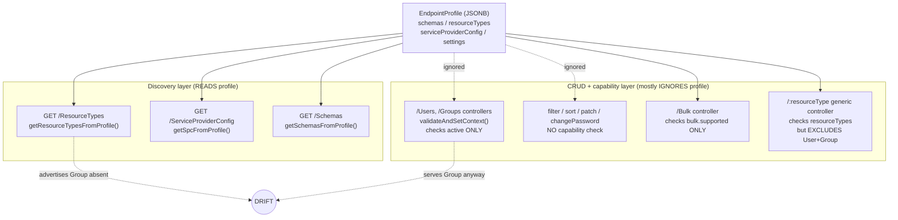
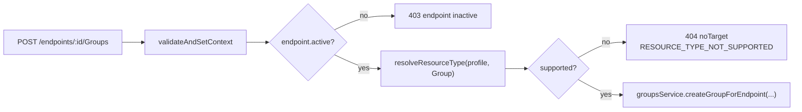
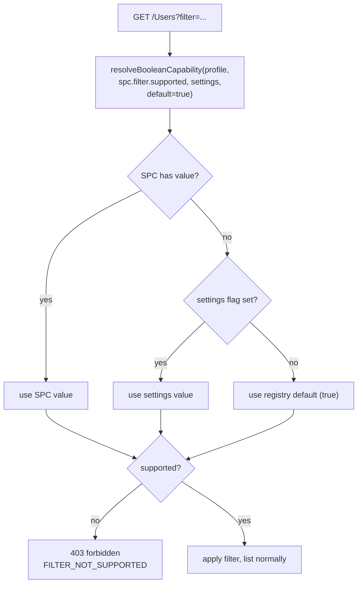
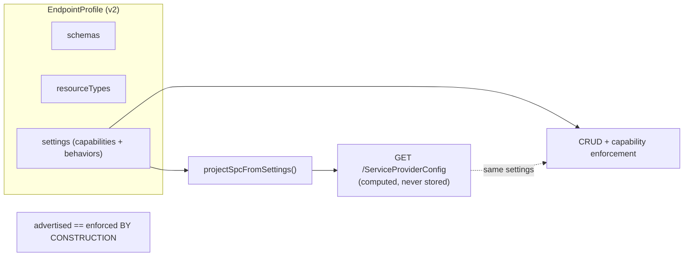
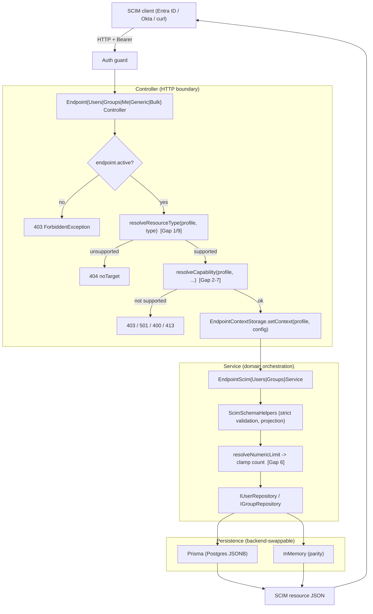
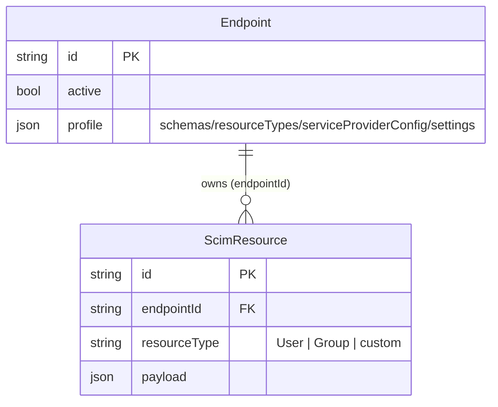
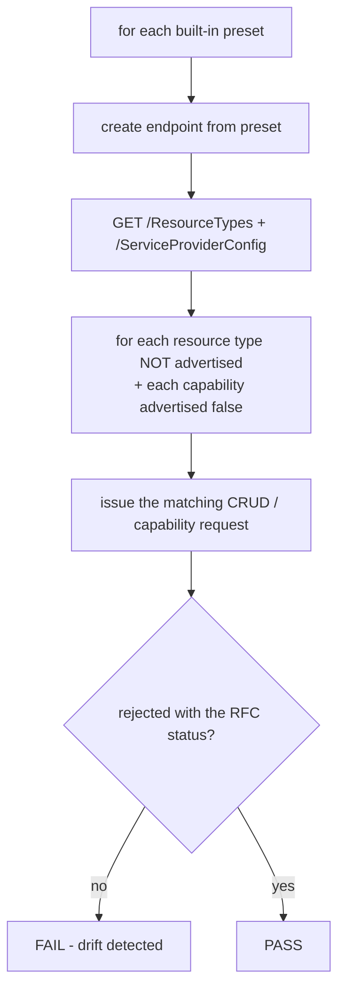

# Endpoint Profile Enforcement - Design Document

> **Status:** Proposed (Phase 1 in progress, Phase 2 deferred)
> **Branch:** `fix/profile-enforcement-gaps` (based on `58ca63b`, the v0.53.2 prod level)
> **Target version:** v0.53.3 (Phase 1), v0.54+ (Phase 2)
> **Author:** Engineering
> **Date:** 2026-06-23
> **Source of truth for behavior:** [endpoint-profile/](../api/src/modules/scim/endpoint-profile/), [scim/controllers/](../api/src/modules/scim/controllers/), [scim/discovery/scim-discovery.service.ts](../api/src/modules/scim/discovery/scim-discovery.service.ts)

---

## Table of Contents

- [1. Executive Summary](#1-executive-summary)
- [2. The Reported Bug](#2-the-reported-bug)
- [3. Root Cause: Dual Source of Truth](#3-root-cause-dual-source-of-truth)
- [4. Full Gap Inventory](#4-full-gap-inventory)
- [5. Why The Test Suite Missed It](#5-why-the-test-suite-missed-it)
- [6. Design Question: Why a Resolver At All?](#6-design-question-why-a-resolver-at-all)
- [7. Design Principles](#7-design-principles)
- [8. Phase 1 Design - Minimal Safe Enforcement](#8-phase-1-design---minimal-safe-enforcement)
- [9. Phase 2 Design - Settings-Only Model](#9-phase-2-design---settings-only-model)
- [10. Data Flow Across Layers](#10-data-flow-across-layers)
- [11. Persistence Model](#11-persistence-model)
- [12. Request / Response Examples](#12-request--response-examples)
- [13. Test Strategy](#13-test-strategy)
- [14. Rollout & Versioning](#14-rollout--versioning)
- [15. RFC References](#15-rfc-references)
- [16. Open Questions & Decisions Log](#16-open-questions--decisions-log)

---

## 1. Executive Summary

An endpoint's **profile** is the single document that declares what a SCIM endpoint is: its `schemas`, its `resourceTypes`, its `serviceProviderConfig` (capabilities), and its `settings` (behavioral flags). The **discovery** endpoints (`/Schemas`, `/ResourceTypes`, `/ServiceProviderConfig`) faithfully project this profile. The **CRUD and capability** layers, however, only partially consult it.

The result is a class of bugs we call **advertise-but-don't-enforce**: discovery says one thing, runtime does another. The reported instance is that a **user-only** endpoint (no `Group` resource type) still serves the entire Group CRUD surface. A full audit found **10 gaps** of the same shape.

This document specifies:

- **Phase 1 (v0.53.3, this branch):** a minimal, low-risk fix that makes the runtime honor the profile for all 10 gaps, with **no storage change and no migration**. It introduces two shared resolvers - one for resource types, one for capabilities - that both discovery and enforcement consult, so the two layers cannot drift.
- **Phase 2 (v0.54+, separate branch):** an architectural simplification where `serviceProviderConfig` is no longer stored in the profile but is **computed** from `settings`. This collapses the dual source of truth into one and is the permanent cure for the bug class.

---

## 2. The Reported Bug

### 2.1 Observed

Endpoint `3dbe8e5c-4a1f-410d-9db6-33b3c2964b8c` on customer-facing prod
(`https://scimserver-prod.calmsand-7f4fc5dc.centralus.azurecontainerapps.io`) was created from the
**user-only** profile. Its discovery output correctly contains **no Group**:

`GET /scim/endpoints/3dbe8e5c-.../ResourceTypes` returns only:

```json
{
  "schemas": ["urn:ietf:params:scim:api:messages:2.0:ListResponse"],
  "totalResults": 1,
  "Resources": [
    { "id": "User", "name": "User", "schema": "urn:ietf:params:scim:schemas:core:2.0:User", "endpoint": "/Users" }
  ]
}
```

Yet **all Group CRUD operations succeed**:

```text
POST   /scim/endpoints/3dbe8e5c-.../Groups        -> 201 Created   (should be 404)
GET    /scim/endpoints/3dbe8e5c-.../Groups         -> 200 OK        (should be 404)
GET    /scim/endpoints/3dbe8e5c-.../Groups/{id}    -> 200 OK        (should be 404)
PUT    /scim/endpoints/3dbe8e5c-.../Groups/{id}    -> 200 OK        (should be 404)
PATCH  /scim/endpoints/3dbe8e5c-.../Groups/{id}    -> 200 OK        (should be 404)
DELETE /scim/endpoints/3dbe8e5c-.../Groups/{id}    -> 204           (should be 404)
```

### 2.2 Expected

When a resource type is not declared in the endpoint's profile, the endpoint MUST behave as if that
route does not exist: **404 Not Found** with a SCIM error body. `StrictSchemaValidation` (already ON
for this endpoint) does not - and architecturally cannot - catch this, because it validates *payload
shape against a schema*, not *whether the resource type is served*.

---

## 3. Root Cause: Dual Source of Truth

The profile is consulted by **two independent code paths** that were never reconciled:



The defect is structural: **discovery reads source A, enforcement reads source B (or nothing).** They
can - and did - disagree. The single most important design goal below is to make discovery and
enforcement **read the same resolver** so drift becomes impossible.

### 3.1 The three code-level causes

1. **Built-in controllers never consult `profile.resourceTypes`.** `validateAndSetContext` in the
   Users, Groups, and Me controllers checks only `endpoint.active`. See
   [endpoint-scim-groups.controller.ts](../api/src/modules/scim/controllers/endpoint-scim-groups.controller.ts)
   and [endpoint-scim-users.controller.ts](../api/src/modules/scim/controllers/endpoint-scim-users.controller.ts).

2. **The generic controller gates correctly but excludes the built-ins.** Its `resolveContext` finds the
   resource type in `profile.resourceTypes`, returning 404 if absent - but with the filter
   `r.name !== 'User' && r.name !== 'Group'`. See
   [endpoint-scim-generic.controller.ts](../api/src/modules/scim/controllers/endpoint-scim-generic.controller.ts).
   That exclusion is the visible fingerprint of the split-brain design.

3. **Strict validation falls back to the global schema.** When the profile lacks a Group schema,
   `buildSchemaDefinitions` resolves the core schema from the **global** registry instead of failing.
   See [scim-service-helpers.ts](../api/src/modules/scim/common/scim-service-helpers.ts). So even strict
   validation cannot reject a Group payload on a user-only endpoint.

---

## 4. Full Gap Inventory

Every row is "advertised in discovery, not enforced at runtime." Status codes follow RFC 7644.

| # | Profile declaration | Discovery reflects? | Runtime enforces? | Correct behavior when disabled | RFC |
|---|---|---|---|---|---|
| 1 | `resourceTypes` (built-in User / Group) | Yes | **No** | 404 on the unsupported `/Users` or `/Groups` route | 7643 §6 |
| 2 | `filter.supported` | Yes | **No** | 403 `forbidden` when `?filter=` used; or ignore filter | 7644 §3.4.2.2 |
| 3 | `sort.supported` | Yes | **No** | 403 when `sortBy` used; or ignore sort | 7644 §3.4.2.3 |
| 4 | `patch.supported` | Yes | **No** | 501 `notImplemented` on PATCH | 7644 §3.5.2 |
| 5 | `changePassword.supported` | Yes | **No** | 400 `mutability` / strip `password` writes | 7643 §7.6 |
| 6 | `filter.maxResults` | Yes | **No** (global `MAX_COUNT=200`) | clamp `count` to the per-endpoint value | 7644 §3.4.2.4 |
| 7 | `bulk.maxOperations` / `maxPayloadSize` | Yes | **No** (global consts) | 413 `tooLarge` / 400 per the per-endpoint value | 7644 §3.7 |
| 8 | `bulk.supported` | Yes | **Yes** (the only one) | 403 on `/Bulk` | 7644 §3.7 |
| 9 | bulk dispatch re-check of `resourceTypes` | n/a | **No** | per-op 404 inside the bulk envelope | 7643 §6 |
| 10 | `etag.supported` | Yes | **No** | omit `ETag` header + `If-None-Match`/`If-Match` handling; reject `RequireIfMatch` when off | 7644 §3.14 |

Notes:
- Gap 8 is the precedent we follow: `bulk.supported` is read straight from the stored profile in
  [endpoint-scim-bulk.controller.ts](../api/src/modules/scim/controllers/endpoint-scim-bulk.controller.ts).
- Gap 9 is mitigated today only because the user-only presets ship `bulk.supported = false`; it would
  surface the moment bulk is enabled on a single-resource-type endpoint.
- Gap 10: the ETag interceptor always emits `ETag` headers, and `enforceIfMatch` honors `RequireIfMatch`
  regardless of `etag.supported`. See [scim-etag.interceptor.ts](../api/src/modules/scim/interceptors/scim-etag.interceptor.ts)
  and [scim-service-helpers.ts](../api/src/modules/scim/common/scim-service-helpers.ts) (`enforceIfMatch`).
  Latent today because `meta.version` is always generated, so no shipped endpoint sets
  `etag.supported = false`. The **`RequireIfMatch` setting (Tier D) must be guarded by `etag.supported`
  (Tier B)**: demanding `If-Match` for a versioning system the endpoint claims not to support is
  incoherent. This is the concrete reason the Phase 2 taxonomy models parent -> child flag dependencies
  (see [§9.2](#92-new-flag-taxonomy-tiers)).

---

## 5. Why The Test Suite Missed It

This was a coverage-design failure, not bad luck. Four compounding reasons, each verified in source:

1. **User-only tests assert profile *shape*, never *behavior*.**
   [built-in-presets.spec.ts](../api/src/modules/scim/endpoint-profile/built-in-presets.spec.ts) checks
   `resourceTypes.length === 1` and `[0].name === 'User'`. It proves discovery is right and creates false
   confidence that "user-only" is covered. No test ever sent a Group request to a user-only endpoint.

2. **Controller unit specs use a mock that makes the gate unreachable.** The Groups/Users controller
   specs mock the endpoint as `{ config: {}, active: true }` with **no `profile`**. A profile-driven gate
   can never trip against that mock.

3. **Every Group/User "404" test is the wrong 404.** All existing 404 assertions
   ([group-lifecycle.e2e-spec.ts](../api/test/e2e/group-lifecycle.e2e-spec.ts),
   [group-parity-gaps.e2e-spec.ts](../api/test/e2e/group-parity-gaps.e2e-spec.ts)) cover a *non-existent
   ID* or a *soft-deleted* resource - never "resource type not in this endpoint's profile."

4. **A stale comment hid the gap.** The generic controller's header claims it is
   *"Gated behind the `CustomResourceTypesEnabled` per-endpoint config flag"* - **a flag that does not
   exist** in the 17-flag registry. A test
   ([test-gaps-audit.e2e-spec.ts](../api/test/e2e/test-gaps-audit.e2e-spec.ts)) even sets
   `CustomResourceTypesEnabled: 'True'`, an unknown settings key that is **silently accepted**. The test
   looked like it exercised resource-type gating while testing a no-op.

**The systemic miss:** the repo has a `crossBackendParityAudit` (inmemory vs prisma) but nothing asserts
that **what discovery advertises is what CRUD enforces**. That missing invariant is closed by the parity
harness in [§13](#13-test-strategy).

---

## 6. Design Question: Why a Resolver At All?

> "Why is `isResourceTypeSupported` needed? `resourceTypes` and `schemas` from the profile describe what
> is supported in the endpoint."

**This is correct, and it reshapes the design.** `profile.resourceTypes` *is* the authority. We are not
inventing a new notion of "supported." We are fixing the fact that **enforcement does not consult the
authority that discovery already consults**.

The discovery layer already has the exact resolution we need -
`getResourceTypeByIdFromProfile` finds the resource type in `profile.resourceTypes` or throws 404:

```ts
// scim-discovery.service.ts (existing)
getResourceTypeByIdFromProfile(resourceTypeId: string, profile?: EndpointProfile) {
  const rt = profile?.resourceTypes?.find(r => r.id === resourceTypeId || r.name === resourceTypeId);
  if (!rt) throw createScimError({ status: 404, detail: `ResourceType "${resourceTypeId}" not found.` });
  return rt;
}
```

So the answer to "why a resolver" is **not** "to add a gate." It is:

1. **DRY across four call sites.** The same question ("does this endpoint serve resource type X?") must be
   answered by the Users controller, the Groups controller, the Me controller (via Users), and the bulk
   dispatcher. Inlining the `find` four times is how drift starts.
2. **Testability - the exact thing that was missing.** A pure function
   `resolveResourceType(profile, name)` is unit-testable in isolation. The bug existed because there was
   no single, tested unit expressing the rule.
3. **Shared with discovery so they cannot diverge.** The strongest form: discovery and enforcement call
   **the same** resolver. "Advertised == enforced" becomes structural, not a thing a reviewer must
   remember to check.

Therefore the design does **not** add a cleverly-named boolean gate. It **extracts the resolution the
discovery layer already performs** into a shared pure function and has the CRUD controllers call it. The
name is incidental; in this document it is `resolveResourceType` / `endpointServesResourceType`. The
generic controller's `r.name !== 'User' && r.name !== 'Group'` exclusion then becomes redundant and is
removed in Phase 2, leaving exactly one rule for every resource type:

> A resource type is served by an endpoint **if and only if** it appears in `profile.resourceTypes`.

The same reasoning applies to capabilities: rather than a new flag per capability, we extract one
`resolveCapability(profile, ...)` that both `getSpcFromProfile` (discovery) and the CRUD controllers
consult.

---

## 7. Design Principles

1. **Single source of truth.** The profile decides what an endpoint is. Discovery and enforcement read
   the same resolvers over the same profile.
2. **Structural, not structural-by-convention.** Wherever possible, make "advertised == enforced" a
   consequence of shared code, not a rule humans must remember.
3. **Fail-open on absence (Phase 1, prod-safety).** When the profile or a section is undefined (legacy
   endpoints, partial mocks), allow the operation. Only reject when the profile **explicitly** declares
   the constraint (e.g., `resourceTypes: [User]` present and `Group` absent). This bounds blast radius on
   a customer prod and keeps legacy data working.
4. **Resource types and schemas are profile-authoritative; capabilities and behaviors are
   resolver-authoritative.** Structural availability (which resource types/schemas exist) comes strictly
   from `profile.resourceTypes` / `profile.schemas`. Capability and behavior come from
   `resolveCapability` with precedence **SPC -> settings -> registry default**.
5. **RFC-correct status codes.** Each gap maps to the status the RFC specifies (404 / 403 / 501 / 413 /
   400) with a SCIM error body and a diagnostics extension.
6. **Forward-compatible.** Phase 1 code becomes Phase 2 code by deleting the SPC branch of the resolver -
   no rework.

---

## 8. Phase 1 Design - Minimal Safe Enforcement

No storage change. No migration. Two shared resolvers plus per-controller wiring.

### 8.1 Resource-type resolver (Gaps 1, 9)

A pure module, e.g. `api/src/modules/scim/common/resource-type-resolver.ts`:

```ts
import type { EndpointProfile } from '../endpoint-profile/endpoint-profile.types';
import type { ScimResourceType } from '../discovery/scim-schema-registry';

/**
 * Resolve a resource type from the endpoint profile by name OR endpoint path.
 * Fail-open: when resourceTypes is undefined/empty (legacy endpoints, partial
 * mocks) we return a synthetic "supported" result so behavior is unchanged.
 * Only when resourceTypes is present and the type is absent do we report unsupported.
 */
export function resolveResourceType(
  profile: EndpointProfile | undefined,
  match: { name?: string; endpointPath?: string },
): { supported: boolean; resourceType?: ScimResourceType } {
  const rts = profile?.resourceTypes;
  if (!rts || rts.length === 0) return { supported: true }; // fail-open

  const rt = rts.find(r =>
    (match.name !== undefined && (r.id === match.name || r.name === match.name)) ||
    (match.endpointPath !== undefined && r.endpoint === match.endpointPath),
  );
  return { supported: !!rt, resourceType: rt };
}
```

Controllers call it inside `validateAndSetContext`, throwing a SCIM 404 when unsupported:

```ts
// inside Groups controller validateAndSetContext (Users mirror)
const { supported } = resolveResourceType(endpoint.profile, { name: 'Group', endpointPath: '/Groups' });
if (!supported) {
  throw createScimError({
    status: 404,
    scimType: 'noTarget',
    detail: `Resource type "Group" is not supported by endpoint "${endpoint.name}".`,
    diagnostics: { errorCode: 'RESOURCE_TYPE_NOT_SUPPORTED', operation: 'group' },
  });
}
```

The bulk dispatcher ([bulk-processor.service.ts](../api/src/modules/scim/services/bulk-processor.service.ts))
calls the same resolver in `executeOperation` before dispatching a `Users` or `Groups` op, so each
sub-operation in the envelope reports its own 404 (Gap 9).



### 8.2 Capability resolver (Gaps 2-7, 10)

A pure module, e.g. `api/src/modules/scim/common/capability-resolver.ts`, with precedence
**SPC -> settings -> registry default**:

```ts
export function resolveBooleanCapability(
  profile: EndpointProfile | undefined,
  spcPath: (spc: ServiceProviderConfig) => boolean | undefined,
  settingKey: string | undefined,
  defaultValue: boolean,
): boolean {
  const spc = profile?.serviceProviderConfig;
  if (spc) {
    const v = spcPath(spc);
    if (typeof v === 'boolean') return v;          // 1. stored SPC wins
  }
  if (settingKey && profile?.settings) {
    const s = getConfigBoolean(profile.settings as EndpointConfig, settingKey);
    if (typeof s === 'boolean') return s;          // 2. settings flag (future-facing)
  }
  return defaultValue;                              // 3. registry default
}

export function resolveNumericLimit(
  profile: EndpointProfile | undefined,
  spcPath: (spc: ServiceProviderConfig) => number | undefined,
  defaultValue: number,
): number {
  const v = profile?.serviceProviderConfig ? spcPath(profile.serviceProviderConfig) : undefined;
  return typeof v === 'number' && v > 0 ? v : defaultValue;
}
```

Per-gap enforcement points and behavior:

| Gap | Where enforced | Resolver call | When false/over-limit |
|---|---|---|---|
| 2 filter | Users/Groups list + `.search` | `resolveBooleanCapability(p, spc=>spc.filter.supported, undefined, true)` | `?filter=` present -> **403 forbidden** |
| 3 sort | Users/Groups list + `.search` | `... spc.sort.supported ...` | `sortBy` present -> **403 forbidden** |
| 4 patch | Users/Groups/Me PATCH | `... spc.patch.supported ...` | **501 notImplemented** |
| 5 changePassword | Users/Me create/replace/patch | `... spc.changePassword.supported ...` | `password` write present -> **400 mutability** |
| 6 filter.maxResults | Users/Groups list service | `resolveNumericLimit(p, spc=>spc.filter.maxResults, MAX_COUNT)` | clamp `count` to per-endpoint value |
| 7 bulk limits | Bulk controller | `resolveNumericLimit(p, spc=>spc.bulk.maxOperations, BULK_MAX_OPERATIONS)` and `...maxPayloadSize...` | **413 tooLarge** / **400** per per-endpoint value || 10 etag | ETag interceptor + `enforceIfMatch` | `resolveBooleanCapability(p, spc=>spc.etag.supported, undefined, true)` | skip `ETag`/`If-None-Match`/`If-Match`; **`RequireIfMatch` ignored** (guarded by `etag.supported`) |


### 8.3 Why fail-open is safe here

The two live prods ship profiles where capabilities are explicitly set (presets always populate
`serviceProviderConfig`), so the SPC branch resolves first and behavior matches the advertised contract.
Fail-open only affects endpoints/tests with **no** profile or **no** `resourceTypes`, which by definition
have nothing to enforce and were never the bug.

---

## 9. Phase 2 Design - Settings-Only Model

Deferred to a separate branch off `master` at v0.54+. Starts with its own detailed design follow-up;
this section captures the target architecture so Phase 1 stays forward-compatible.

### 9.1 Idea

Stop storing `serviceProviderConfig` in the profile. Keep `schemas` + `resourceTypes` (structural).
Express every capability and behavior as a **setting**. Make `/ServiceProviderConfig` a **pure
projection** computed from settings:



Because advertisement is *computed from* the same flags enforcement reads, they cannot drift. This is
the permanent cure for the entire bug class in [§4](#4-full-gap-inventory).

### 9.2 New flag taxonomy (tiers)

Phase 2 introduces dependent flags, which the current independent-flag registry does not model:

| Tier | Flags | Parent | Meaning |
|---|---|---|---|
| B - capability master switches | `PatchSupported`, `BulkSupported`, `FilterSupported`, `SortSupported`, `EtagSupported`, `ChangePasswordSupported` | none | whether the capability exists at all (projected into SPC `*.supported`) |
| C - parameters | `BulkMaxOperations`, `BulkMaxPayloadSize`, `FilterMaxResults` | the matching Tier-B flag | only meaningful when the parent is on (projected into SPC `*.maxX`) |
| D - existing behavior tuners | `VerbosePatchSupported`, `IgnoreReadOnlyAttributesInPatch`, `MultiMemberPatchOpForGroupEnabled`, `PatchOpAllowRemoveAllMembers` | `PatchSupported` | refine behavior; only run when PATCH is supported |
| D | `RequireIfMatch` | `EtagSupported` | only meaningful when ETag is supported (see Gap 10 in [§4](#4-full-gap-inventory)); demanding `If-Match` with ETag off is incoherent and must be guarded |

### 9.3 New value type

Tier-C limits are integers. The registry today supports `boolean | logLevel | primaryEnforcement`.
Phase 2 adds a `number` flag type with a validator, reader (`getConfigNumber`), and the full 10-cell
endpoint-config-flag audit (registry / default / validator / enforcement / unit / e2e / live / doc /
UI Switch-or-Input / UI test).

### 9.4 Migration & write-path compatibility

- **Read path:** for endpoints whose stored profile still has `serviceProviderConfig`, derive the
  equivalent settings at load time (a one-time, idempotent translation). The resolver precedence
  `SPC -> settings -> default` chosen for Phase 1 means a stored SPC keeps working until migrated.
- **Write path:** profile authoring, presets, and the SCIM profile importer may still send inline
  `serviceProviderConfig`. A translate-on-write shim maps those into settings so the change is not
  breaking for existing callers.
- **Non-flag SPC fields** (`authenticationSchemes`, `documentationUri`, `meta`) are already computed
  from a global constant in `getSpcFromProfile`, so they need no per-endpoint storage.

### 9.5 Forward-compatibility guarantee

Phase 1's `resolveCapability` already checks settings as its second precedence tier. In Phase 2 the
stored SPC simply disappears, so the resolver naturally falls through to settings. **Phase 1 code becomes
Phase 2 code by deleting the now-dead SPC branch** - there is no rework, only deletion.

---

## 10. Data Flow Across Layers

End-to-end for a write, showing where each resolver sits:



The discovery layer reads the **same** `profile.resourceTypes` and (via `resolveCapability`) the same
capability values, so `GET /ResourceTypes`, `GET /ServiceProviderConfig`, and the enforcement decisions
above are guaranteed consistent.

---

## 11. Persistence Model

No schema change in Phase 1. The profile is a single JSONB column:

```prisma
// api/prisma/schema.prisma
model Endpoint {
  id          String   @id @default(uuid())
  // ...
  profile     Json?    // JSONB - { schemas, resourceTypes, serviceProviderConfig, settings }
}
```



Phase 1 reads `profile.resourceTypes` and `profile.serviceProviderConfig` from this column; it writes
nothing new. Phase 2 will stop persisting `serviceProviderConfig` and (optionally) GIN-index nothing new
because `resourceTypes` lookups are array scans over a tiny list.

---

## 12. Request / Response Examples

### 12.1 Gap 1 - Group CRUD on a user-only endpoint (after fix)

Request:

```http
POST /scim/endpoints/3dbe8e5c-.../Groups HTTP/1.1
Authorization: Bearer ***
Content-Type: application/scim+json

{ "schemas": ["urn:ietf:params:scim:schemas:core:2.0:Group"], "displayName": "x" }
```

Response:

```http
HTTP/1.1 404 Not Found
Content-Type: application/scim+json

{
  "schemas": ["urn:ietf:params:scim:api:messages:2.0:Error"],
  "status": "404",
  "scimType": "noTarget",
  "detail": "Resource type \"Group\" is not supported by endpoint \"SelfServ Entra - User Only No Groups\".",
  "urn:scimserver:api:messages:2.0:Diagnostics": {
    "errorCode": "RESOURCE_TYPE_NOT_SUPPORTED",
    "requestId": "…",
    "endpointId": "3dbe8e5c-…"
  }
}
```

### 12.2 Gap 4 - PATCH when `patch.supported = false`

```http
HTTP/1.1 501 Not Implemented
Content-Type: application/scim+json

{
  "schemas": ["urn:ietf:params:scim:api:messages:2.0:Error"],
  "status": "501",
  "scimType": "notImplemented",
  "detail": "PATCH is not supported by this endpoint (serviceProviderConfig.patch.supported = false).",
  "urn:scimserver:api:messages:2.0:Diagnostics": { "errorCode": "CAPABILITY_NOT_SUPPORTED" }
}
```

### 12.3 Gap 2 - filter when `filter.supported = false`

```http
HTTP/1.1 403 Forbidden
Content-Type: application/scim+json

{
  "schemas": ["urn:ietf:params:scim:api:messages:2.0:Error"],
  "status": "403",
  "detail": "Filtering is not supported by this endpoint (serviceProviderConfig.filter.supported = false).",
  "urn:scimserver:api:messages:2.0:Diagnostics": { "errorCode": "CAPABILITY_NOT_SUPPORTED", "filterExpression": "userName eq \"x\"" }
}
```

### 12.4 Gap 9 - bulk envelope with a per-op 404

```http
HTTP/1.1 200 OK
Content-Type: application/scim+json

{
  "schemas": ["urn:ietf:params:scim:api:messages:2.0:BulkResponse"],
  "Operations": [
    { "method": "POST", "bulkId": "u1", "location": ".../Users/…", "status": "201" },
    { "method": "POST", "bulkId": "g1", "status": "404",
      "response": { "schemas": ["…:Error"], "status": "404", "scimType": "noTarget",
        "detail": "Resource type \"Group\" is not supported by this endpoint." } }
  ]
}
```

---

## 13. Test Strategy

TDD red-first for every gap, plus the standing-rule layers (unit + e2e + live + parity harness).

### 13.1 Per-gap tests

For each gap, in order:
1. **RED** unit test at the resolver level (pure function) and at the controller level (mock profile that
   declares the constraint).
2. **GREEN** minimal implementation.
3. **E2E** spec that creates a real preset endpoint (`user-only`, or one with `filter.supported=false`,
   etc.) and asserts the RFC status + `scimType` + diagnostics `errorCode` + response key allowlist.
4. **Live** section in [scripts/live-test.ps1](../scripts/live-test.ps1) runnable against local node,
   Docker, and Azure dev.

### 13.2 The parity harness (the systemic fix)

A new E2E suite, e.g. `api/test/e2e/discovery-enforcement-parity.e2e-spec.ts`, that for **every built-in
preset** asserts advertised == enforced:



This single suite would have caught all 10 gaps at once and catches the next one. It is paired with a new
Stage-3 audit prompt (`discoveryEnforcementParityAudit`) added to the quality-gate doc so the discipline
is operationalized, not just a one-off test.

### 13.3 Coverage matrix (target)

| Layer | Gap 1 | Gap 2 | Gap 3 | Gap 4 | Gap 5 | Gap 6 | Gap 7 | Gap 9 | Gap 10 | Parity |
|---|---|---|---|---|---|---|---|---|---|---|
| Resolver unit | yes | yes | yes | yes | yes | yes | yes | yes | yes | n/a |
| Controller unit | yes | yes | yes | yes | yes | - | yes | yes | yes | n/a |
| Service unit | - | - | - | - | - | yes | - | - | - | n/a |
| E2E | yes | yes | yes | yes | yes | yes | yes | yes | yes | yes |
| Live (ps1) | yes | yes | yes | yes | yes | yes | yes | yes | yes | - |

---

## 14. Rollout & Versioning

- **Phase 1** lands on `fix/profile-enforcement-gaps` (based on v0.53.2 prod level `58ca63b`) and is
  versioned **v0.53.3** so it is cleanly promotable to both prods without pulling unreleased v0.54 work.
- Full quality-gate walk (Stages 0-6) per the standing rules, including cross-backend parity
  (inmemory + prisma), live tests on local + Docker + Azure dev, and Playwright if any web surface
  changes.
- **No automatic prod promotion.** Customer-facing prod (calmsand) is promoted only on an explicit
  operator `promote to prod`, canary-first via proudbush.
- **Phase 2** is a separate branch off `master` at v0.54+, gated behind its own design follow-up,
  migration plan, and the dependent-flag UI work.

### 14.1 Behavior-change risk

Phase 1 changes responses on endpoints that **explicitly** declare a constraint (e.g., user-only
endpoints will start returning 404 for Group routes). That is the intended correction. Endpoints created
from full presets (entra-id, rfc-standard, minimal) declare both User and Group and all capabilities, so
their behavior is unchanged. The fail-open rule guarantees legacy/partial-profile endpoints are
unaffected.

---

## 15. RFC References

- **RFC 7643 §6** - ResourceType definitions. An endpoint serves a resource type iff it declares it.
- **RFC 7643 §7** - Schema definitions and characteristics.
- **RFC 7643 §7.6 / §2.2** - `password` is `writeOnly`; `changePassword` capability governs password change.
- **RFC 7644 §3.4.2.2** - Filtering. A provider MAY declare `filter.supported = false`.
- **RFC 7644 §3.4.2.3** - Sorting.
- **RFC 7644 §3.4.2.4** - Pagination; `filter.maxResults` bounds page size.
- **RFC 7644 §3.5.2** - PATCH; `patch.supported` governs availability (501 when unsupported).
- **RFC 7644 §3.7** - Bulk; `bulk.supported`, `maxOperations`, `maxPayloadSize`.
- **RFC 7644 §3.12 / Table 9** - Error response shape and `scimType` keywords
  (`noTarget`, `invalidValue`, `mutability`, `tooLarge`, `notImplemented`, `versionMismatch`).
- **RFC 7644 §3.14** - ETag / `If-Match` / `If-None-Match` concurrency control; `etag.supported`
  governs availability. `RequireIfMatch` (428 on missing `If-Match`) only applies when ETag is supported.
- **RFC 7644 §4** - ServiceProviderConfig is the description of what the server does (the basis for
  Phase 2's "project SPC from settings").

---

## 16. Open Questions & Decisions Log

| # | Question | Decision | Rationale |
|---|---|---|---|
| D1 | Governance: SPC-driven vs new flags vs settings-only | **Phase 1 SPC/settings resolver; Phase 2 settings-only** | Unblock prod safely now; collapse the dual source of truth later |
| D2 | Resolver precedence | **SPC -> settings -> default** | Stored SPC keeps working; falls through to settings in Phase 2 with no flip |
| D3 | Fail-open vs fail-closed on absent profile | **Fail-open** | Bounds blast radius on customer prod; legacy/partial profiles unaffected |
| D4 | Structural (resource types/schemas) vs behavioral (capabilities) authority | **Structural from profile; behavioral from resolver** | Matches the operator's mental model and the discovery layer |
| D5 | Is a `isResourceTypeSupported` gate a new concept? | **No - it is the shared resolution the discovery layer already does** | Avoids inventing a parallel notion of "supported"; unifies discovery + enforcement |
| D6 | Status code for unsupported resource type | **404 noTarget** | The route effectively does not exist for this endpoint; matches the generic controller |
| D7 | Status code for unsupported PATCH | **501 notImplemented** | RFC 7644 §3.5.2 capability-not-implemented semantics |
| D8 | Status code for unsupported filter/sort | **403 forbidden** | Capability explicitly disabled by the provider |
| D9 | Version | **v0.53.3** | Keep the fix on the prod line, cleanly promotable |
| D10 | Parity harness | **Add it + a Stage-3 audit prompt** | The self-improvement that closes the systemic blind spot |
| D11 | Is `etag.supported` enforced today? | **No - it is Gap 10** | The interceptor always emits `ETag` and `enforceIfMatch` runs regardless; latent only because `meta.version` is always generated |
| D12 | Should `RequireIfMatch` be guarded by `etag.supported`? | **Yes - Tier D depends on Tier B** | Requiring `If-Match` for a versioning system the endpoint claims not to support is incoherent; guard it in Phase 1 enforcement and model the dependency in Phase 2 |

---

> This document is the design contract for `fix/profile-enforcement-gaps`. Phase 1 implementation
> proceeds gap-by-gap under TDD; Phase 2 requires its own follow-up design before any code.
