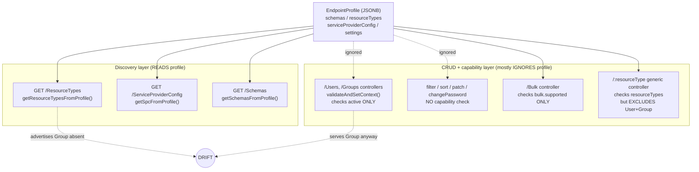
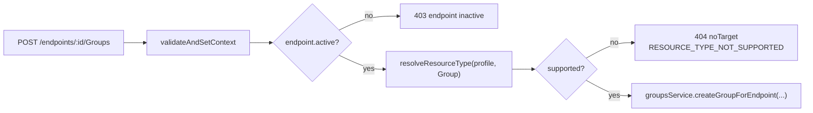
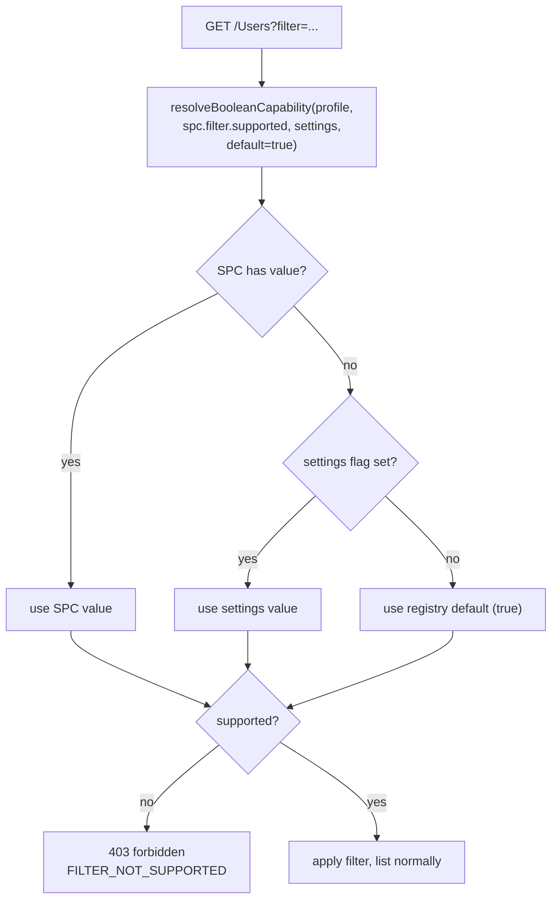
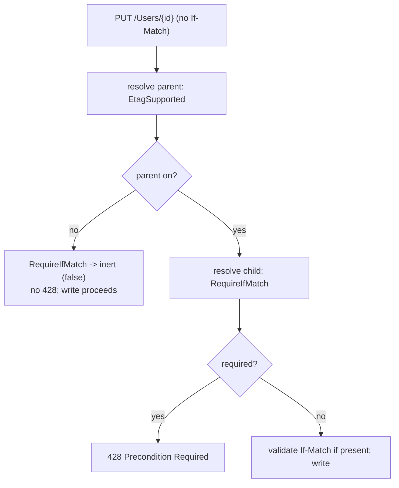
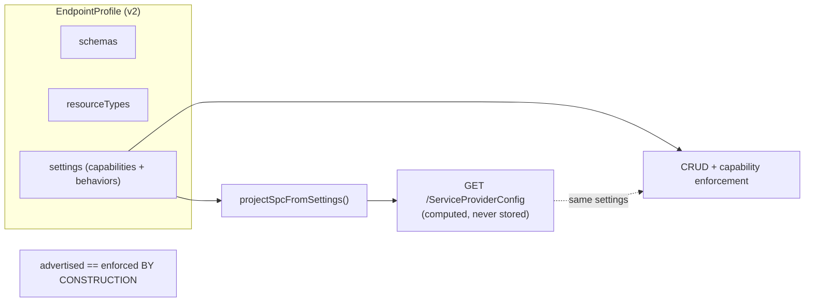
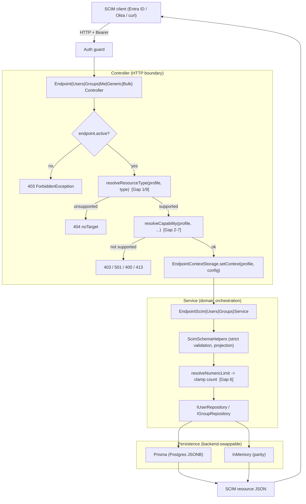
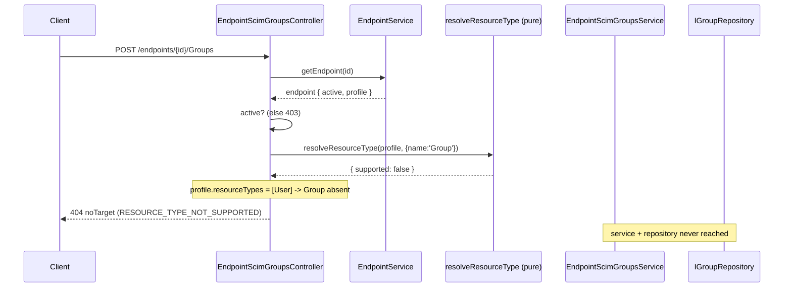
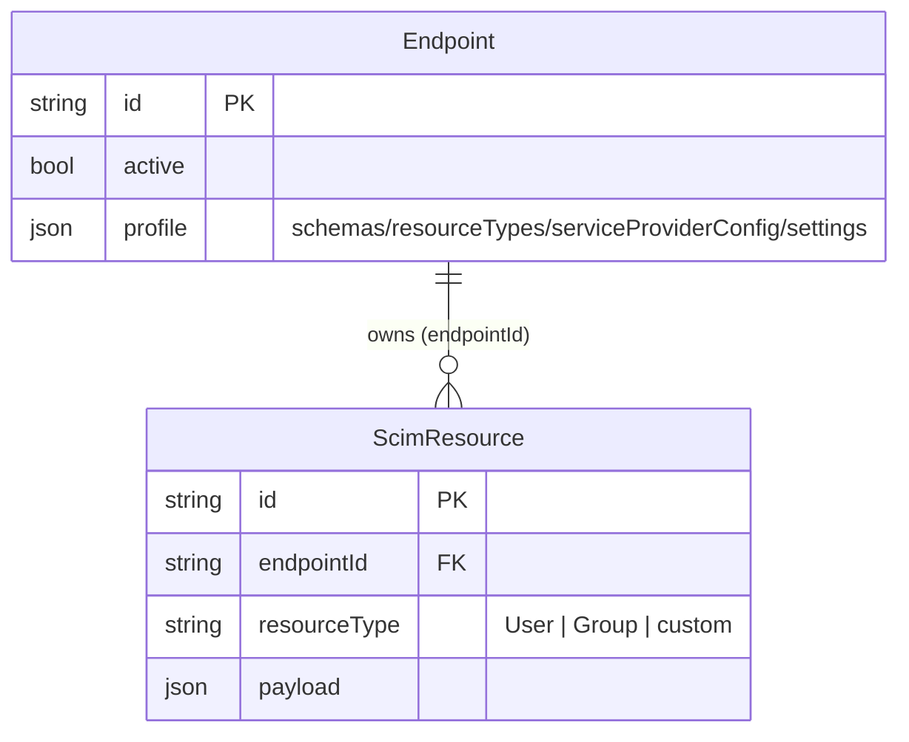
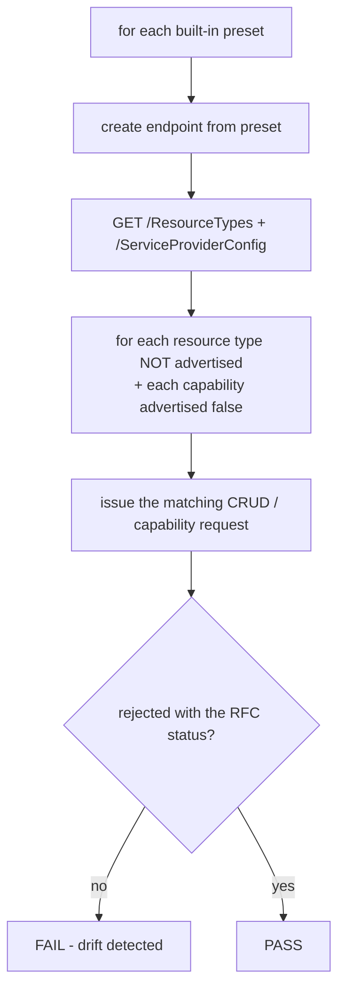

# Endpoint Profile Enforcement - Design Document

> **Status:** Proposed (Phase 1 in progress, Phase 2 deferred)
> **Branch:** `fix/profile-enforcement-gaps` (based on `58ca63b`, the v0.53.2 prod level)
> **Target version:** v0.53.3 (Phase 1), v0.54+ (Phase 2)
> **Author:** Engineering
> **Date:** 2026-06-23
> **Source of truth for behavior:** [endpoint-profile/](../api/src/modules/scim/endpoint-profile/), [scim/controllers/](../api/src/modules/scim/controllers/), [scim/discovery/scim-discovery.service.ts](../api/src/modules/scim/discovery/scim-discovery.service.ts)

---

## Table of Contents

- [1. Executive Summary](#1-executive-summary)
  - [1.1 Goals](#11-goals)
  - [1.2 Non-Goals](#12-non-goals)
- [2. The Reported Bug](#2-the-reported-bug)
- [3. Root Cause: Dual Source of Truth](#3-root-cause-dual-source-of-truth)
- [4. Full Gap Inventory](#4-full-gap-inventory)
- [5. Why The Test Suite Missed It](#5-why-the-test-suite-missed-it)
- [6. Design Question: Why a Resolver At All?](#6-design-question-why-a-resolver-at-all)
- [7. Design Principles & Alternatives Considered](#7-design-principles--alternatives-considered)
- [8. Phase 1 Design - Minimal Safe Enforcement](#8-phase-1-design---minimal-safe-enforcement)
  - [8.4 Typed resolution - settings are not just booleans](#84-typed-resolution---settings-are-not-just-booleans)
  - [8.5 Hierarchical (dependent) settings and runtime enforcement](#85-hierarchical-dependent-settings-and-runtime-enforcement)
- [9. Phase 2 Design - Settings-Only Model](#9-phase-2-design---settings-only-model)
- [10. Data Flow Across Layers](#10-data-flow-across-layers)
- [11. Persistence Model](#11-persistence-model)
- [12. Request / Response Examples](#12-request--response-examples)
- [13. Test Strategy](#13-test-strategy)
- [14. Rollout & Versioning](#14-rollout--versioning)
- [15. Cross-Cutting Concerns](#15-cross-cutting-concerns)
- [16. RFC References](#16-rfc-references)
- [17. Open Questions & Decisions Log](#17-open-questions--decisions-log)

---

## 1. Executive Summary

An endpoint's **profile** is the single document that declares what a SCIM endpoint is: its `schemas`, its `resourceTypes`, its `serviceProviderConfig` (capabilities), and its `settings` (behavioral flags). The **discovery** endpoints (`/Schemas`, `/ResourceTypes`, `/ServiceProviderConfig`) faithfully project this profile. The **CRUD and capability** layers, however, only partially consult it.

The result is a class of bugs we call **advertise-but-don't-enforce**: discovery says one thing, runtime does another. The reported instance is that a **user-only** endpoint (no `Group` resource type) still serves the entire Group CRUD surface. A full audit found **10 gaps** of the same shape.

This document specifies:

- **Phase 1 (v0.53.3, this branch):** a minimal, low-risk fix that makes the runtime honor the profile for all 10 gaps, with **no storage change and no migration**. It introduces two shared resolvers - one for resource types, one for capabilities - that both discovery and enforcement consult, so the two layers cannot drift.
- **Phase 2 (v0.54+, separate branch):** an architectural simplification where `serviceProviderConfig` is no longer stored in the profile but is **computed** from `settings`. This collapses the dual source of truth into one and is the permanent cure for the bug class.

### 1.1 Goals

- Make every endpoint's **runtime behavior match its advertised discovery contract** (`/ResourceTypes`,
  `/ServiceProviderConfig`, `/Schemas`) for all 10 gaps.
- Fix the reported user-only-endpoint Group bug on the customer-facing prod line **safely** (no storage
  change, no migration, cleanly promotable as v0.53.3).
- Make "advertised == enforced" **structural** (shared resolvers) rather than a convention humans must
  remember, and add a regression harness so the bug class cannot silently return.
- Keep the change **forward-compatible** with the Phase 2 settings-only model.

### 1.2 Non-Goals

- **Not** changing the persistence shape or running a data migration in Phase 1 (that is Phase 2).
- **Not** adding new `settings` flags in Phase 1 (the resolver reads the existing stored SPC).
- **Not** enforcing constraints on **legacy / partial-profile** endpoints (fail-open by design - see
  principle 3 in [§7](#7-design-principles--alternatives-considered)).
- **Not** collapsing `serviceProviderConfig` into `settings` yet, and **not** building the dependent-flag
  UI - both are explicitly Phase 2.
- **Not** altering authentication, schema attribute validation, or PATCH semantics beyond gating whether
  the capability/resource type is served at all.

---

## 2. The Reported Bug

### 2.1 Observed

Endpoint `3dbe8e5c-4a1f-410d-9db6-33b3c2964b8c` on customer-facing prod
(`https://scimserver-prod.calmsand-7f4fc5dc.centralus.azurecontainerapps.io`) was created from the
**user-only** profile. Its discovery output correctly contains **no Group**:

`GET /scim/endpoints/3dbe8e5c-.../ResourceTypes` returns only:

```json
{
  "schemas": ["urn:ietf:params:scim:api:messages:2.0:ListResponse"],
  "totalResults": 1,
  "Resources": [
    { "id": "User", "name": "User", "schema": "urn:ietf:params:scim:schemas:core:2.0:User", "endpoint": "/Users" }
  ]
}
```

Yet **all Group CRUD operations succeed**:

```text
POST   /scim/endpoints/3dbe8e5c-.../Groups        -> 201 Created   (should be 404)
GET    /scim/endpoints/3dbe8e5c-.../Groups         -> 200 OK        (should be 404)
GET    /scim/endpoints/3dbe8e5c-.../Groups/{id}    -> 200 OK        (should be 404)
PUT    /scim/endpoints/3dbe8e5c-.../Groups/{id}    -> 200 OK        (should be 404)
PATCH  /scim/endpoints/3dbe8e5c-.../Groups/{id}    -> 200 OK        (should be 404)
DELETE /scim/endpoints/3dbe8e5c-.../Groups/{id}    -> 204           (should be 404)
```

### 2.2 Expected

When a resource type is not declared in the endpoint's profile, the endpoint MUST behave as if that
route does not exist: **404 Not Found** with a SCIM error body. `StrictSchemaValidation` (already ON
for this endpoint) does not - and architecturally cannot - catch this, because it validates *payload
shape against a schema*, not *whether the resource type is served*.

---

## 3. Root Cause: Dual Source of Truth

The profile is consulted by **two independent code paths** that were never reconciled:



The defect is structural: **discovery reads source A, enforcement reads source B (or nothing).** They
can - and did - disagree. The single most important design goal below is to make discovery and
enforcement **read the same resolver** so drift becomes impossible.

### 3.1 The three code-level causes

1. **Built-in controllers never consult `profile.resourceTypes`.** `validateAndSetContext` in the
   Users, Groups, and Me controllers checks only `endpoint.active`. See
   [endpoint-scim-groups.controller.ts](../api/src/modules/scim/controllers/endpoint-scim-groups.controller.ts)
   and [endpoint-scim-users.controller.ts](../api/src/modules/scim/controllers/endpoint-scim-users.controller.ts).

2. **The generic controller gates correctly but excludes the built-ins.** Its `resolveContext` finds the
   resource type in `profile.resourceTypes`, returning 404 if absent - but with the filter
   `r.name !== 'User' && r.name !== 'Group'`. See
   [endpoint-scim-generic.controller.ts](../api/src/modules/scim/controllers/endpoint-scim-generic.controller.ts).
   That exclusion is the visible fingerprint of the split-brain design.

3. **Strict validation falls back to the global schema.** When the profile lacks a Group schema,
   `buildSchemaDefinitions` resolves the core schema from the **global** registry instead of failing.
   See [scim-service-helpers.ts](../api/src/modules/scim/common/scim-service-helpers.ts). So even strict
   validation cannot reject a Group payload on a user-only endpoint.

---

## 4. Full Gap Inventory

Every row is "advertised in discovery, not enforced at runtime." Status codes follow RFC 7644.

| # | Profile declaration | Discovery reflects? | Runtime enforces? | Correct behavior when disabled | RFC |
|---|---|---|---|---|---|
| 1 | `resourceTypes` (built-in User / Group) | Yes | **No** | 404 on the unsupported `/Users` or `/Groups` route | 7643 §6 |
| 2 | `filter.supported` | Yes | **No** | 403 `forbidden` when `?filter=` used; or ignore filter | 7644 §3.4.2.2 |
| 3 | `sort.supported` | Yes | **No** | 403 when `sortBy` used; or ignore sort | 7644 §3.4.2.3 |
| 4 | `patch.supported` | Yes | **No** | 501 `notImplemented` on PATCH | 7644 §3.5.2 |
| 5 | `changePassword.supported` | Yes | **No (intentional)** | not enforced - see note | 7643 §7.6 |
| 6 | `filter.maxResults` | Yes | **No** (global `MAX_COUNT=200`) | clamp `count` to the per-endpoint value | 7644 §3.4.2.4 |
| 7 | `bulk.maxOperations` / `maxPayloadSize` | Yes | **No** (global consts) | 413 `tooLarge` / 400 per the per-endpoint value | 7644 §3.7 |
| 8 | `bulk.supported` | Yes | **Yes** (the only one) | 403 on `/Bulk` | 7644 §3.7 |
| 9 | bulk dispatch re-check of `resourceTypes` | n/a | **No** | per-op 404 inside the bulk envelope | 7643 §6 |
| 10 | `etag.supported` | Yes | **No** | omit `ETag` header + `If-None-Match`/`If-Match` handling; reject `RequireIfMatch` when off | 7644 §3.14 |

Notes:
- Gap 8 is the precedent we follow: `bulk.supported` is read straight from the stored profile in
  [endpoint-scim-bulk.controller.ts](../api/src/modules/scim/controllers/endpoint-scim-bulk.controller.ts).
- Gap 9 is mitigated today only because the user-only presets ship `bulk.supported = false`; it would
  surface the moment bulk is enabled on a single-resource-type endpoint.
- Gap 10: the ETag interceptor always emits `ETag` headers, and `enforceIfMatch` honors `RequireIfMatch`
  regardless of `etag.supported`. See [scim-etag.interceptor.ts](../api/src/modules/scim/interceptors/scim-etag.interceptor.ts)
  and [scim-service-helpers.ts](../api/src/modules/scim/common/scim-service-helpers.ts) (`enforceIfMatch`).
  Latent today because `meta.version` is always generated, so no shipped endpoint sets
  `etag.supported = false`. The **`RequireIfMatch` setting (Tier D) must be guarded by `etag.supported`
  (Tier B)**: demanding `If-Match` for a versioning system the endpoint claims not to support is
  incoherent. This is the concrete reason the Phase 2 taxonomy models parent -> child flag dependencies
  (see [§9.2](#92-new-flag-taxonomy-tiers)).

---

## 5. Why The Test Suite Missed It

This was a coverage-design failure, not bad luck. Four compounding reasons, each verified in source:

1. **User-only tests assert profile *shape*, never *behavior*.**
   [built-in-presets.spec.ts](../api/src/modules/scim/endpoint-profile/built-in-presets.spec.ts) checks
   `resourceTypes.length === 1` and `[0].name === 'User'`. It proves discovery is right and creates false
   confidence that "user-only" is covered. No test ever sent a Group request to a user-only endpoint.

2. **Controller unit specs use a mock that makes the gate unreachable.** The Groups/Users controller
   specs mock the endpoint as `{ config: {}, active: true }` with **no `profile`**. A profile-driven gate
   can never trip against that mock.

3. **Every Group/User "404" test is the wrong 404.** All existing 404 assertions
   ([group-lifecycle.e2e-spec.ts](../api/test/e2e/group-lifecycle.e2e-spec.ts),
   [group-parity-gaps.e2e-spec.ts](../api/test/e2e/group-parity-gaps.e2e-spec.ts)) cover a *non-existent
   ID* or a *soft-deleted* resource - never "resource type not in this endpoint's profile."

4. **A stale comment hid the gap.** The generic controller's header claims it is
   *"Gated behind the `CustomResourceTypesEnabled` per-endpoint config flag"* - **a flag that does not
   exist** in the 17-flag registry. A test
   ([test-gaps-audit.e2e-spec.ts](../api/test/e2e/test-gaps-audit.e2e-spec.ts)) even sets
   `CustomResourceTypesEnabled: 'True'`, an unknown settings key that is **silently accepted**. The test
   looked like it exercised resource-type gating while testing a no-op.

**The systemic miss:** the repo has a `crossBackendParityAudit` (inmemory vs prisma) but nothing asserts
that **what discovery advertises is what CRUD enforces**. That missing invariant is closed by the parity
harness in [§13](#13-test-strategy).

---

## 6. Design Question: Why a Resolver At All?

> "Why is `isResourceTypeSupported` needed? `resourceTypes` and `schemas` from the profile describe what
> is supported in the endpoint."

**This is correct, and it reshapes the design.** `profile.resourceTypes` *is* the authority. We are not
inventing a new notion of "supported." We are fixing the fact that **enforcement does not consult the
authority that discovery already consults**.

The discovery layer already has the exact resolution we need -
`getResourceTypeByIdFromProfile` finds the resource type in `profile.resourceTypes` or throws 404:

```ts
// scim-discovery.service.ts (existing)
getResourceTypeByIdFromProfile(resourceTypeId: string, profile?: EndpointProfile) {
  const rt = profile?.resourceTypes?.find(r => r.id === resourceTypeId || r.name === resourceTypeId);
  if (!rt) throw createScimError({ status: 404, detail: `ResourceType "${resourceTypeId}" not found.` });
  return rt;
}
```

So the answer to "why a resolver" is **not** "to add a gate." It is:

1. **DRY across four call sites.** The same question ("does this endpoint serve resource type X?") must be
   answered by the Users controller, the Groups controller, the Me controller (via Users), and the bulk
   dispatcher. Inlining the `find` four times is how drift starts.
2. **Testability - the exact thing that was missing.** A pure function
   `resolveResourceType(profile, name)` is unit-testable in isolation. The bug existed because there was
   no single, tested unit expressing the rule.
3. **Shared with discovery so they cannot diverge.** The strongest form: discovery and enforcement call
   **the same** resolver. "Advertised == enforced" becomes structural, not a thing a reviewer must
   remember to check.

Therefore the design does **not** add a cleverly-named boolean gate. It **extracts the resolution the
discovery layer already performs** into a shared pure function and has the CRUD controllers call it. The
name is incidental; in this document it is `resolveResourceType` / `endpointServesResourceType`. The
generic controller's `r.name !== 'User' && r.name !== 'Group'` exclusion then becomes redundant and is
removed in Phase 2, leaving exactly one rule for every resource type:

> A resource type is served by an endpoint **if and only if** it appears in `profile.resourceTypes`.

The same reasoning applies to capabilities: rather than a new flag per capability, we extract one
`resolveCapability(profile, ...)` that both `getSpcFromProfile` (discovery) and the CRUD controllers
consult.

---

## 7. Design Principles & Alternatives Considered

1. **Single source of truth.** The profile decides what an endpoint is. Discovery and enforcement read
   the same resolvers over the same profile.
2. **Structural, not structural-by-convention.** Wherever possible, make "advertised == enforced" a
   consequence of shared code, not a rule humans must remember.
3. **Fail-open on absence (Phase 1, prod-safety).** When the profile or a section is undefined (legacy
   endpoints, partial mocks), allow the operation. Only reject when the profile **explicitly** declares
   the constraint (e.g., `resourceTypes: [User]` present and `Group` absent). This bounds blast radius on
   a customer prod and keeps legacy data working.
4. **Resource types and schemas are profile-authoritative; capabilities and behaviors are
   resolver-authoritative.** Structural availability (which resource types/schemas exist) comes strictly
   from `profile.resourceTypes` / `profile.schemas`. Capability and behavior come from
   `resolveCapability` with precedence **SPC -> settings -> registry default**.
5. **RFC-correct status codes.** Each gap maps to the status the RFC specifies (404 / 403 / 501 / 413 /
   400) with a SCIM error body and a diagnostics extension.
6. **Forward-compatible.** Phase 1 code becomes Phase 2 code by deleting the SPC branch of the resolver -
   no rework.

### 7.1 Alternatives Considered (with pros / cons)

The sections below record the options weighed for each significant decision, the trade-offs of each, and
why the selected option wins given the goals in [§1.1](#11-goals). Decisions are summarized in
[§17](#17-open-questions--decisions-log).

**A. Governance model - where does "is this capability on?" come from?**

| Option | Pros | Cons | Verdict |
|---|---|---|---|
| **A1. SPC/profile-driven resolver (chosen for Phase 1)** | No new flags; reads the value discovery already serves; smallest prod blast radius; matches the `bulk.supported` precedent | Keeps SPC in storage (the dual-source-of-truth stays until Phase 2) | **Chosen** - unblocks prod safely now, forward-compatible |
| A2. New per-capability `settings` flags now | Uniform with the 17-flag system; UI-ready | 6+ new flags x full 10-cell audit; needs a `number` type; bigger surface + slower; still leaves SPC as a second source | Deferred to Phase 2 |
| A3. Full settings-only collapse now | Permanent cure (one source) | Storage migration on a customer prod + write-path shim + UI in one risky drop | Deferred to Phase 2 (own design) |

**B. Status code for an unsupported resource type (Gap 1/9)**

| Option | Pros | Cons | Verdict |
|---|---|---|---|
| **404 noTarget (chosen)** | The route effectively does not exist for this endpoint; matches the generic controller's existing behavior; hides nothing extra | A client could read 404 as "wrong id" vs "type unsupported" (mitigated by the diagnostics `errorCode`) | **Chosen** |
| 403 forbidden | Signals "exists but blocked" | Implies the route exists, leaking surface; wrong for a type the endpoint does not model | Rejected |
| 501 notImplemented | Honest "not implemented here" | Conflicts with RFC usage for *capabilities*; resource types are existence, not capability | Rejected |

**C. Unsupported `filter` / `sort` (Gap 2/3) - reject or silently ignore?**

| Option | Pros | Cons | Verdict |
|---|---|---|---|
| **403 forbidden (chosen)** | Loud + honest; the client learns the endpoint cannot filter; matches `*.supported=false` semantics | A lenient client that always appends `?filter=` would now error | **Chosen** - advertised contract says unsupported |
| Silently ignore the param + return full list | Maximally lenient | Dangerous: client thinks it filtered but got everything; data-leak / wrong-sync risk | Rejected |

**D. Behavior when the profile is absent / partial (fail-open vs fail-closed)**

| Option | Pros | Cons | Verdict |
|---|---|---|---|
| **Fail-open (chosen)** | Min blast radius on prod; legacy + no-profile mocks keep working; only endpoints that **explicitly** declare a constraint are affected | A truly empty profile enforces nothing (acceptable - it advertises nothing) | **Chosen** |
| Fail-closed | Strict RFC posture | Would break legacy endpoints + many existing unit mocks that omit `profile` | Rejected for Phase 1 |

**E. Phasing**

| Option | Pros | Cons | Verdict |
|---|---|---|---|
| **Phase 1 minimal now + Phase 2 refactor later (chosen)** | Unblocks the colleague immediately; each phase independently reviewable; resolver is reused, not rewritten | The dual source of truth lives a bit longer | **Chosen** |
| One big settings-only PR | One-and-done | High risk on customer prod; large review; slower to unblock | Rejected |

---

## 8. Phase 1 Design - Minimal Safe Enforcement

No storage change. No migration. Two shared resolvers plus per-controller wiring.

### 8.1 Resource-type resolver (Gaps 1, 9)

A pure module, e.g. `api/src/modules/scim/common/resource-type-resolver.ts`:

```ts
import type { EndpointProfile } from '../endpoint-profile/endpoint-profile.types';
import type { ScimResourceType } from '../discovery/scim-schema-registry';

/**
 * Resolve a resource type from the endpoint profile by name OR endpoint path.
 * Fail-open: when resourceTypes is undefined/empty (legacy endpoints, partial
 * mocks) we return a synthetic "supported" result so behavior is unchanged.
 * Only when resourceTypes is present and the type is absent do we report unsupported.
 */
export function resolveResourceType(
  profile: EndpointProfile | undefined,
  match: { name?: string; endpointPath?: string },
): { supported: boolean; resourceType?: ScimResourceType } {
  const rts = profile?.resourceTypes;
  if (!rts || rts.length === 0) return { supported: true }; // fail-open

  const rt = rts.find(r =>
    (match.name !== undefined && (r.id === match.name || r.name === match.name)) ||
    (match.endpointPath !== undefined && r.endpoint === match.endpointPath),
  );
  return { supported: !!rt, resourceType: rt };
}
```

Controllers call it inside `validateAndSetContext`, throwing a SCIM 404 when unsupported:

```ts
// inside Groups controller validateAndSetContext (Users mirror)
const { supported } = resolveResourceType(endpoint.profile, { name: 'Group', endpointPath: '/Groups' });
if (!supported) {
  throw createScimError({
    status: 404,
    scimType: 'noTarget',
    detail: `Resource type "Group" is not supported by endpoint "${endpoint.name}".`,
    diagnostics: { errorCode: 'RESOURCE_TYPE_NOT_SUPPORTED', operation: 'group' },
  });
}
```

The bulk dispatcher ([bulk-processor.service.ts](../api/src/modules/scim/services/bulk-processor.service.ts))
calls the same resolver in `executeOperation` before dispatching a `Users` or `Groups` op, so each
sub-operation in the envelope reports its own 404 (Gap 9).



### 8.2 Capability resolver (Gaps 2-7, 10)

A pure module, e.g. `api/src/modules/scim/common/capability-resolver.ts`, with precedence
**SPC -> settings -> registry default**:

```ts
export function resolveBooleanCapability(
  profile: EndpointProfile | undefined,
  spcPath: (spc: ServiceProviderConfig) => boolean | undefined,
  settingKey: string | undefined,
  defaultValue: boolean,
): boolean {
  const spc = profile?.serviceProviderConfig;
  if (spc) {
    const v = spcPath(spc);
    if (typeof v === 'boolean') return v;          // 1. stored SPC wins
  }
  if (settingKey && profile?.settings) {
    const s = getConfigBoolean(profile.settings as EndpointConfig, settingKey);
    if (typeof s === 'boolean') return s;          // 2. settings flag (future-facing)
  }
  return defaultValue;                              // 3. registry default
}

export function resolveNumericLimit(
  profile: EndpointProfile | undefined,
  spcPath: (spc: ServiceProviderConfig) => number | undefined,
  defaultValue: number,
): number {
  const v = profile?.serviceProviderConfig ? spcPath(profile.serviceProviderConfig) : undefined;
  return typeof v === 'number' && v > 0 ? v : defaultValue;
}

// Settings are NOT all booleans. The registry already declares four value-types
// (boolean | logLevel | primaryEnforcement | structured); the resolver mirrors
// that dispatch so enum / string / structured settings resolve with the same
// precedence and the OpenFeature "never throw, fall back to default" rule
// (OpenFeature spec 1.4.10). Example: PrimaryEnforcement is a tri-state enum.
export function resolveEnumSetting<T extends string>(
  profile: EndpointProfile | undefined,
  settingKey: string,
  allowed: readonly T[],
  defaultValue: T,
): T {
  const raw = getConfigString(profile?.settings as EndpointConfig | undefined, settingKey);
  const lower = raw?.toLowerCase();
  if (lower && (allowed as readonly string[]).includes(lower)) return lower as T;
  return defaultValue; // missing OR invalid -> documented default, never throw
}
```

Per-gap enforcement points and behavior:

| Gap | Where enforced | Resolver call | When false/over-limit |
|---|---|---|---|
| 2 filter | Users/Groups list + `.search` | `resolveBooleanCapability(p, spc=>spc.filter.supported, undefined, true)` | `?filter=` present -> **403 forbidden** |
| 3 sort | Users/Groups list + `.search` | `... spc.sort.supported ...` | `sortBy` present -> **403 forbidden** |
| 4 patch | Users/Groups/Me PATCH | `... spc.patch.supported ...` | **501 notImplemented** |
| 5 changePassword | Users/Me create/replace/patch | `... spc.changePassword.supported ...` | `password` write present -> **400 mutability** |
| 6 filter.maxResults | Users/Groups list service | `resolveNumericLimit(p, spc=>spc.filter.maxResults, MAX_COUNT)` | clamp `count` to per-endpoint value |
| 7 bulk limits | Bulk controller | `resolveNumericLimit(p, spc=>spc.bulk.maxOperations, BULK_MAX_OPERATIONS)` and `...maxPayloadSize...` | **413 tooLarge** / **400** per per-endpoint value |
| 10 etag | ETag interceptor + `enforceIfMatch` | `resolveBooleanCapability(p, spc=>spc.etag.supported, undefined, true)` | skip `ETag`/`If-None-Match`/`If-Match`; **`RequireIfMatch` ignored** (guarded by `etag.supported`) |



### 8.3 Why fail-open is safe here

The two live prods ship profiles where capabilities are explicitly set (presets always populate
`serviceProviderConfig`), so the SPC branch resolves first and behavior matches the advertised contract.
Fail-open only affects endpoints/tests with **no** profile or **no** `resourceTypes`, which by definition
have nothing to enforce and were never the bug.

### 8.4 Typed resolution - settings are not just booleans

A capability/behavior setting can be a boolean, an enum, a number, or a structured object. The registry
**already** models this: every flag declares a `type` from
`'boolean' | 'logLevel' | 'primaryEnforcement' | 'structured'`, validated by a type-dispatched
`validateEndpointConfig` and read by typed getters (`getConfigBoolean` / `getConfigString` /
`getConfigStructured`). This mirrors the industry standard - the OpenFeature spec defines exactly four
typed flag kinds (**boolean / number / string / structure**), each with a typed default and a
"never throw, return the default on a bad value" rule.

The resolver therefore has **one resolver per value-type**, not one for booleans only. Each follows the
same `SPC -> settings -> default` precedence and never throws:

| Value-type | Registry `type` | Reader | Resolver | Example setting | Allowed values |
|---|---|---|---|---|---|
| Boolean | `boolean` | `getConfigBoolean` | `resolveBooleanCapability` | `BulkSupported`, `RequireIfMatch` | `true`/`false` (+ `"True"`/`"1"`...) |
| Enum (string) | `primaryEnforcement` | `getConfigString` | `resolveEnumSetting` | **`PrimaryEnforcement`** | `passthrough` / `normalize` / `reject` |
| Enum (level) | `logLevel` | `getConfigString` | `resolveEnumSetting` | `logLevel` | `TRACE`..`OFF` or `0`-`6` |
| Number | `number` (Phase 2) | `getConfigNumber` (Phase 2) | `resolveNumericLimit` | `FilterMaxResults`, `BulkMaxOperations` | integer `>= 1` |
| Structured | `structured` | `getConfigStructured` | `resolveStructuredSetting` | WIF trust object (reserved) | object matching `structuredSchema` |

**Worked example - `PrimaryEnforcement` (the multi-valued case).** It is a tri-state enum
(`passthrough` default / `normalize` / `reject`) that governs duplicate-`primary` handling on
multi-valued complex attributes (RFC 7643 §2.4). It is **not** a capability gap (it is a behavior tuner),
but it is the canonical proof that the resolver must handle non-booleans:

```ts
type PrimaryMode = 'passthrough' | 'normalize' | 'reject';
const mode = resolveEnumSetting<PrimaryMode>(
  profile, ENDPOINT_CONFIG_FLAGS.PRIMARY_ENFORCEMENT,
  ['passthrough', 'normalize', 'reject'], 'passthrough',
);
// mode drives: passthrough -> store + WARN; normalize -> keep first primary + WARN; reject -> 400 invalidValue
```

A boolean-only resolver would silently mis-handle `PrimaryEnforcement`, `logLevel`, and the future
structured flags. Modeling resolution by value-type is what makes the system correct for **all** settings,
not just on/off ones.

### 8.5 Hierarchical (dependent) settings and runtime enforcement

Some settings only make sense when a parent capability is on. The clearest case is Gap 10:
`RequireIfMatch` is meaningless when `etag.supported = false`. The same shape recurs:
`FilterMaxResults` under `FilterSupported`, the four PATCH tuners under `PatchSupported`. This is exactly
the **prerequisite flag** pattern: a dependent flag serves its parent-defined "off" behavior unless the
prerequisite is satisfied (LaunchDarkly prerequisites; OpenFeature provider **short-circuit**).

**Design - declare the dependency, enforce by short-circuit.** A flag definition gains an optional
`dependsOn` (the parent flag key). Resolution evaluates the parent first; if the parent is off, the child
**short-circuits to its documented inert value** and is never consulted further:

```ts
export function resolveDependentSetting<T>(
  profile: EndpointProfile | undefined,
  parentKey: string,            // e.g. EtagSupported
  resolveChild: () => T,        // e.g. resolveBooleanCapability(... RequireIfMatch ...)
  inertValue: T,                // value when parent is off (e.g. false)
): T {
  const parentOn = resolveBooleanCapability(profile, spcForKey(parentKey), parentKey, defaultFor(parentKey));
  if (!parentOn) return inertValue;   // short-circuit: child is inert
  return resolveChild();
}
```



**Two enforcement layers (defence in depth):**

1. **Resolution-time (runtime, authoritative):** the short-circuit above guarantees an inert child can
   never take effect, regardless of what is stored. This is the rule that actually protects the request.
2. **Validation-time (authoring, advisory):** when an operator sets a child while its parent is off,
   `validateEndpointConfig` emits a **WARNING** (not a hard error) so the misconfiguration is visible at
   write time without breaking back-compat. Hard-rejecting would break existing stored profiles, so the
   warning + runtime short-circuit pair is preferred (same rationale as the fail-open principle).

**Dependency is data, not code.** The parent links live in the registry (`dependsOn`), so the audit in
[§13](#13-test-strategy) can walk every flag and assert: (a) a declared parent exists, (b) the child has a
defined inert value, and (c) parent-off makes the child inert at runtime. No dependency is expressed by
ad-hoc `if` branches scattered across services.

---

## 9. Phase 2 Design - Settings-Only Model

Deferred to a separate branch off `master` at v0.54+. Starts with its own detailed design follow-up;
this section captures the target architecture so Phase 1 stays forward-compatible.

### 9.1 Idea

Stop storing `serviceProviderConfig` in the profile. Keep `schemas` + `resourceTypes` (structural).
Express every capability and behavior as a **setting**. Make `/ServiceProviderConfig` a **pure
projection** computed from settings:



Because advertisement is *computed from* the same flags enforcement reads, they cannot drift. This is
the permanent cure for the entire bug class in [§4](#4-full-gap-inventory).

### 9.2 New flag taxonomy (tiers)

Phase 2 introduces dependent + multi-valued flags, which the current independent-flag registry does not
fully model. Each flag carries a **value-type** (today `boolean | logLevel | primaryEnforcement |
structured`; Phase 2 adds `number`) and an optional **`dependsOn`** parent key:

| Tier | Flags | Value-type | `dependsOn` | Meaning |
|---|---|---|---|---|
| B - capability master switches | `PatchSupported`, `BulkSupported`, `FilterSupported`, `SortSupported`, `EtagSupported`, `ChangePasswordSupported` | boolean | none | whether the capability exists at all (projected into SPC `*.supported`) |
| C - parameters | `BulkMaxOperations`, `BulkMaxPayloadSize`, `FilterMaxResults` | number | matching Tier-B flag | only meaningful when the parent is on (projected into SPC `*.maxX`); inert value = the global default |
| D - behavior tuners (boolean) | `VerbosePatchSupported`, `IgnoreReadOnlyAttributesInPatch`, `MultiMemberPatchOpForGroupEnabled`, `PatchOpAllowRemoveAllMembers` | boolean | `PatchSupported` | refine behavior; only run when PATCH is supported; inert value = `false`/no-op |
| D - behavior tuners (boolean) | `RequireIfMatch` | boolean | `EtagSupported` | only meaningful when ETag is supported (Gap 10 in [§4](#4-full-gap-inventory)); inert value = `false` |
| D - behavior tuners (enum) | `PrimaryEnforcement` | primaryEnforcement (enum) | none (independent) | tri-state `passthrough`/`normalize`/`reject`; the multi-valued proof that resolution is type-aware, not boolean-only |
| (cross-cutting) | `logLevel` | logLevel (enum) | none | per-endpoint log level; enum value resolved via `resolveEnumSetting` |

Note two distinct axes: **value-type** (how a setting is read/validated/resolved - [§8.4](#84-typed-resolution---settings-are-not-just-booleans)) and **dependency** (whether a parent must be on - [§8.5](#85-hierarchical-dependent-settings-and-runtime-enforcement)). A flag can be enum-typed and independent (`PrimaryEnforcement`), boolean and dependent (`RequireIfMatch`), or number and dependent (`FilterMaxResults`).

### 9.3 New value type

Tier-C limits are integers. The registry today supports `boolean | logLevel | primaryEnforcement |
structured`. Phase 2 adds a `number` flag type with a validator, reader (`getConfigNumber`), and the full
10-cell
endpoint-config-flag audit (registry / default / validator / enforcement / unit / e2e / live / doc /
UI Switch-or-Input / UI test).

### 9.4 Migration & write-path compatibility

- **Read path:** for endpoints whose stored profile still has `serviceProviderConfig`, derive the
  equivalent settings at load time (a one-time, idempotent translation). The resolver precedence
  `SPC -> settings -> default` chosen for Phase 1 means a stored SPC keeps working until migrated.
- **Write path:** profile authoring, presets, and the SCIM profile importer may still send inline
  `serviceProviderConfig`. A translate-on-write shim maps those into settings so the change is not
  breaking for existing callers.
- **Non-flag SPC fields** (`authenticationSchemes`, `documentationUri`, `meta`) are already computed
  from a global constant in `getSpcFromProfile`, so they need no per-endpoint storage.

### 9.5 Forward-compatibility guarantee

Phase 1's `resolveCapability` already checks settings as its second precedence tier. In Phase 2 the
stored SPC simply disappears, so the resolver naturally falls through to settings. **Phase 1 code becomes
Phase 2 code by deleting the now-dead SPC branch** - there is no rework, only deletion.

---

## 10. Data Flow Across Layers

End-to-end for a write, showing where each resolver sits:



The discovery layer reads the **same** `profile.resourceTypes` and (via `resolveCapability`) the same
capability values, so `GET /ResourceTypes`, `GET /ServiceProviderConfig`, and the enforcement decisions
above are guaranteed consistent.

### 10.1 Request call trace (sequence)

The sequence below traces a single `POST /Groups` on a user-only endpoint end-to-end, showing the
resolver decision point and the rejection path (the canonical repo call-trace device, cf.
[USER_API_CALL_TRACE.md](USER_API_CALL_TRACE.md)).



For a supported type the `supported: true` branch continues into `GSvc.createGroupForEndpoint(...)` and
the repository, exactly as today.

---

## 11. Persistence Model

No schema change in Phase 1. The profile is a single JSONB column:

```prisma
// api/prisma/schema.prisma
model Endpoint {
  id          String   @id @default(uuid())
  // ...
  profile     Json?    // JSONB - { schemas, resourceTypes, serviceProviderConfig, settings }
}
```



Phase 1 reads `profile.resourceTypes` and `profile.serviceProviderConfig` from this column; it writes
nothing new. Phase 2 will stop persisting `serviceProviderConfig` and (optionally) GIN-index nothing new
because `resourceTypes` lookups are array scans over a tiny list.

---

## 12. Request / Response Examples

### 12.1 Gap 1 - Group CRUD on a user-only endpoint (before vs after)

The same request, on the same endpoint, before and after the fix:

Request (unchanged):

```http
POST /scim/endpoints/3dbe8e5c-.../Groups HTTP/1.1
Authorization: Bearer ***
Content-Type: application/scim+json

{ "schemas": ["urn:ietf:params:scim:schemas:core:2.0:Group"], "displayName": "x" }
```

**Before (today - the bug):** the Group is created on an endpoint that does not model Groups.

```http
HTTP/1.1 201 Created
Content-Type: application/scim+json

{
  "schemas": ["urn:ietf:params:scim:schemas:core:2.0:Group"],
  "id": "97c3fe15-5482-427a-a074-c799feabdb93",
  "displayName": "x",
  "meta": { "resourceType": "Group", "version": "W/\"v1\"" }
}
```

**After (fixed):** the route behaves as if it does not exist for this endpoint.

```http
HTTP/1.1 404 Not Found
Content-Type: application/scim+json

{
  "schemas": ["urn:ietf:params:scim:api:messages:2.0:Error"],
  "status": "404",
  "scimType": "noTarget",
  "detail": "Resource type \"Group\" is not supported by endpoint \"SelfServ Entra - User Only No Groups\".",
  "urn:scimserver:api:messages:2.0:Diagnostics": {
    "errorCode": "RESOURCE_TYPE_NOT_SUPPORTED",
    "requestId": "…",
    "endpointId": "3dbe8e5c-…"
  }
}
```

### 12.2 Gap 4 - PATCH when `patch.supported = false`

```http
HTTP/1.1 501 Not Implemented
Content-Type: application/scim+json

{
  "schemas": ["urn:ietf:params:scim:api:messages:2.0:Error"],
  "status": "501",
  "scimType": "notImplemented",
  "detail": "PATCH is not supported by this endpoint (serviceProviderConfig.patch.supported = false).",
  "urn:scimserver:api:messages:2.0:Diagnostics": { "errorCode": "CAPABILITY_NOT_SUPPORTED" }
}
```

### 12.3 Gap 2 - filter when `filter.supported = false`

```http
HTTP/1.1 403 Forbidden
Content-Type: application/scim+json

{
  "schemas": ["urn:ietf:params:scim:api:messages:2.0:Error"],
  "status": "403",
  "detail": "Filtering is not supported by this endpoint (serviceProviderConfig.filter.supported = false).",
  "urn:scimserver:api:messages:2.0:Diagnostics": { "errorCode": "CAPABILITY_NOT_SUPPORTED", "filterExpression": "userName eq \"x\"" }
}
```

### 12.4 Gap 9 - bulk envelope with a per-op 404

```http
HTTP/1.1 200 OK
Content-Type: application/scim+json

{
  "schemas": ["urn:ietf:params:scim:api:messages:2.0:BulkResponse"],
  "Operations": [
    { "method": "POST", "bulkId": "u1", "location": ".../Users/…", "status": "201" },
    { "method": "POST", "bulkId": "g1", "status": "404",
      "response": { "schemas": ["…:Error"], "status": "404", "scimType": "noTarget",
        "detail": "Resource type \"Group\" is not supported by this endpoint." } }
  ]
}
```

---

## 13. Test Strategy

TDD red-first for every gap, plus the standing-rule layers (unit + e2e + live + parity harness).

### 13.1 Per-gap tests

For each gap, in order:
1. **RED** unit test at the resolver level (pure function) and at the controller level (mock profile that
   declares the constraint).
2. **GREEN** minimal implementation.
3. **E2E** spec that creates a real preset endpoint (`user-only`, or one with `filter.supported=false`,
   etc.) and asserts the RFC status + `scimType` + diagnostics `errorCode` + response key allowlist.
4. **Live** section in [scripts/live-test.ps1](../scripts/live-test.ps1) runnable against local node,
   Docker, and Azure dev.

### 13.2 The parity harness (the systemic fix)

A new E2E suite, e.g. `api/test/e2e/discovery-enforcement-parity.e2e-spec.ts`, that for **every built-in
preset** asserts advertised == enforced:



This single suite would have caught all 10 gaps at once and catches the next one. It is paired with a new
Stage-3 audit prompt (`discoveryEnforcementParityAudit`) added to the quality-gate doc so the discipline
is operationalized, not just a one-off test.

### 13.3 Coverage matrix (target)

| Layer | Gap 1 | Gap 2 | Gap 3 | Gap 4 | Gap 5 | Gap 6 | Gap 7 | Gap 9 | Gap 10 | Parity |
|---|---|---|---|---|---|---|---|---|---|---|
| Resolver unit | yes | yes | yes | yes | yes | yes | yes | yes | yes | n/a |
| Controller unit | yes | yes | yes | yes | yes | - | yes | yes | yes | n/a |
| Service unit | - | - | - | - | - | yes | - | - | - | n/a |
| E2E | yes | yes | yes | yes | yes | yes | yes | yes | yes | yes |
| Live (ps1) | yes | yes | yes | yes | yes | yes | yes | yes | yes | - |

### 13.4 Concrete test-count tables (filled at implementation)

Following the house convention (cf. [G8E_RETURNED_CHARACTERISTIC_FILTERING.md](G8E_RETURNED_CHARACTERISTIC_FILTERING.md)),
each gap's commit fills a per-layer count table; the totals roll up into [CHANGELOG.md](../CHANGELOG.md).
The structure (counts are `TBD` until each gap is implemented under TDD):

| Layer | File | New | Description |
|---|---|---|---|
| Unit (resolver) | `resource-type-resolver.spec.ts` | TBD | fail-open, name/endpoint match, User+Group absence |
| Unit (resolver) | `capability-resolver.spec.ts` | TBD | SPC->settings->default precedence, numeric clamp |
| Unit (controller) | `endpoint-scim-{users,groups}.controller.spec.ts` | TBD | 404/403/501 per gap with a profile that declares the constraint |
| E2E | `discovery-enforcement-parity.e2e-spec.ts` | TBD | advertised == enforced for every preset (the harness) |
| E2E | `profile-enforcement-gaps.e2e-spec.ts` | TBD | one block per gap, RFC status + scimType + diagnostics + key allowlist |
| Live | `scripts/live-test.ps1` (new section) | TBD | per gap, runnable local + Docker + Azure dev |

---

## 14. Rollout & Versioning

- **Phase 1** lands on `fix/profile-enforcement-gaps` (based on v0.53.2 prod level `58ca63b`) and is
  versioned **v0.53.3** so it is cleanly promotable to both prods without pulling unreleased v0.54 work.
- Full quality-gate walk (Stages 0-6) per the standing rules, including cross-backend parity
  (inmemory + prisma), live tests on local + Docker + Azure dev, and Playwright if any web surface
  changes.
- **No automatic prod promotion.** Customer-facing prod (calmsand) is promoted only on an explicit
  operator `promote to prod`, canary-first via proudbush.
- **Phase 2** is a separate branch off `master` at v0.54+, gated behind its own design follow-up,
  migration plan, and the dependent-flag UI work.

### 14.1 Behavior-change risk

Phase 1 changes responses on endpoints that **explicitly** declare a constraint (e.g., user-only
endpoints will start returning 404 for Group routes). That is the intended correction. Endpoints created
from full presets (entra-id, rfc-standard, minimal) declare both User and Group and all capabilities, so
their behavior is unchanged. The fail-open rule guarantees legacy/partial-profile endpoints are
unaffected.

---

## 15. Cross-Cutting Concerns

Following the design-doc norm of explicitly addressing cross-cutting concerns (cf.
[CROSS_CUTTING_CONCERN_AUDIT.md](CROSS_CUTTING_CONCERN_AUDIT.md)):

### 15.1 Security

- **Reduced surface, not increased.** Every change *removes* a reachable operation (404/403/501) on
  endpoints that never advertised it; it never opens a new path. Net attack surface goes down.
- **No information leak.** A 404 for an unsupported resource type reveals only what discovery already
  advertises publicly (RFC 7644 §4 discovery is unauthenticated). The diagnostics `errorCode` carries no
  PII and no resource data.
- **Auth ordering unchanged.** Enforcement runs **after** the existing auth guard and the `active` check,
  so an unauthenticated caller still gets 401 first - the resolver never runs for them.

### 15.2 Privacy

- No new PII is read, logged, or returned. Rejections log only `endpointId`, resource-type name, and
  `requestId` (already standard correlation fields).

### 15.3 Observability

- Each rejection emits a structured WARN/INFO log via `ScimLogger` with the `errorCode`
  (`RESOURCE_TYPE_NOT_SUPPORTED` / `CAPABILITY_NOT_SUPPORTED`) and `requestId`, so the smart-error
  explainer and the per-endpoint log stream surface it. The 404/403 path is already covered by the
  global exception filter's level mapping (404 -> DEBUG, other 4xx -> INFO).

### 15.4 Backward compatibility

- The fail-open rule (principle 3) guarantees legacy and partial-profile endpoints are unaffected.
  Endpoints from full presets (entra-id, rfc-standard, minimal) declare both User and Group and all
  capabilities, so their behavior is unchanged. Only endpoints that **explicitly** narrow themselves
  (e.g., user-only) change behavior - which is the intended correction.

### 15.5 Performance

- The resolvers are in-memory array scans over a tiny list (<= a handful of resource types / a fixed set
  of capabilities) already loaded in the endpoint profile. No new DB query, no measurable latency impact.

### 15.6 Cross-backend parity

- Enforcement lives in the controller/service layer above the repository, so it is identical for the
  Prisma and InMemory backends. The Stage 2.5 `crossBackendParityAudit` applies.

---

## 16. RFC References

- **RFC 7643 §6** - ResourceType definitions. An endpoint serves a resource type iff it declares it.
- **RFC 7643 §7** - Schema definitions and characteristics.
- **RFC 7643 §7.6 / §2.2** - `password` is `writeOnly`; `changePassword` capability governs password change.
- **RFC 7644 §3.4.2.2** - Filtering. A provider MAY declare `filter.supported = false`.
- **RFC 7644 §3.4.2.3** - Sorting.
- **RFC 7644 §3.4.2.4** - Pagination; `filter.maxResults` bounds page size.
- **RFC 7644 §3.5.2** - PATCH; `patch.supported` governs availability (501 when unsupported).
- **RFC 7644 §3.7** - Bulk; `bulk.supported`, `maxOperations`, `maxPayloadSize`.
- **RFC 7644 §3.12 / Table 9** - Error response shape and `scimType` keywords
  (`noTarget`, `invalidValue`, `mutability`, `tooLarge`, `notImplemented`, `versionMismatch`).
- **RFC 7644 §3.14** - ETag / `If-Match` / `If-None-Match` concurrency control; `etag.supported`
  governs availability. `RequireIfMatch` (428 on missing `If-Match`) only applies when ETag is supported.
- **RFC 7644 §4** - ServiceProviderConfig is the description of what the server does (the basis for
  Phase 2's "project SPC from settings").

### 16.1 External references (config / flag patterns)

- **OpenFeature Specification §1.3-1.4** - typed flag evaluation across **boolean / number / string /
  structure**, each with a typed default and the "never throw, return default on bad value" rule
  (basis for [§8.4](#84-typed-resolution---settings-are-not-just-booleans)).
  <https://openfeature.dev/specification/sections/flag-evaluation>
- **OpenFeature provider lifecycle - short-circuit** - evaluation short-circuits to the default when a
  prerequisite/provider is not ready; the model adapted for parent-off dependent settings in
  [§8.5](#85-hierarchical-dependent-settings-and-runtime-enforcement).
- **LaunchDarkly prerequisite flags** - a dependent flag serves its off-variation unless the prerequisite
  is met; the product precedent for the `dependsOn` short-circuit.
  <https://launchdarkly.com/docs/home/flags/prerequisites>

---

## 17. Open Questions & Decisions Log

| # | Question | Decision | Rationale |
|---|---|---|---|
| D1 | Governance: SPC-driven vs new flags vs settings-only | **Phase 1 SPC/settings resolver; Phase 2 settings-only** | Unblock prod safely now; collapse the dual source of truth later |
| D2 | Resolver precedence | **SPC -> settings -> default** | Stored SPC keeps working; falls through to settings in Phase 2 with no flip |
| D3 | Fail-open vs fail-closed on absent profile | **Fail-open** | Bounds blast radius on customer prod; legacy/partial profiles unaffected |
| D4 | Structural (resource types/schemas) vs behavioral (capabilities) authority | **Structural from profile; behavioral from resolver** | Matches the operator's mental model and the discovery layer |
| D5 | Is a `isResourceTypeSupported` gate a new concept? | **No - it is the shared resolution the discovery layer already does** | Avoids inventing a parallel notion of "supported"; unifies discovery + enforcement |
| D6 | Status code for unsupported resource type | **404 noTarget** | The route effectively does not exist for this endpoint; matches the generic controller |
| D7 | Status code for unsupported PATCH | **501 notImplemented** | RFC 7644 §3.5.2 capability-not-implemented semantics |
| D8 | Status code for unsupported filter/sort | **403 forbidden** | Capability explicitly disabled by the provider |
| D9 | Version | **v0.53.3** | Keep the fix on the prod line, cleanly promotable |
| D10 | Parity harness | **Add it + a Stage-3 audit prompt** | The self-improvement that closes the systemic blind spot |
| D11 | Is `etag.supported` enforced today? | **No - it is Gap 10** | The interceptor always emits `ETag` and `enforceIfMatch` runs regardless; latent only because `meta.version` is always generated |
| D12 | Should `RequireIfMatch` be guarded by `etag.supported`? | **Yes - Tier D depends on Tier B** | Requiring `If-Match` for a versioning system the endpoint claims not to support is incoherent; guard it in Phase 1 enforcement and model the dependency in Phase 2 |
| D13 | Are settings only booleans? | **No - resolve by value-type** | Registry already declares 4 types (`boolean`/`logLevel`/`primaryEnforcement`/`structured`); resolver has one path per type (`resolveBooleanCapability` / `resolveEnumSetting` / `resolveNumericLimit` / `resolveStructuredSetting`), mirroring OpenFeature's boolean/number/string/structure typed evaluation. `PrimaryEnforcement` (tri-state enum) is the worked example |
| D14 | How are dependent settings enforced at runtime? | **Short-circuit on the parent** | A `dependsOn` registry link + `resolveDependentSetting` returns the child's inert value when the parent is off (prerequisite-flag / OpenFeature short-circuit pattern). Validation-time emits a WARNING; runtime is authoritative |
| D15 | Reject or warn when a child is set with parent off? | **Warn, not reject** | Hard-reject would break existing stored profiles; warning + runtime short-circuit matches the fail-open principle |
| D16 | Phase 1 release base | **Branch off prod tag `58ca63b` (v0.53.2), not master** | Customer prod gets only the targeted fix, not unreleased v0.54 work; cleanly promotable |
| D17 | Capability enforcement default | **Permissive (`true`) - enforce only an explicit `false`** | Bounds prod blast radius to endpoints that deliberately narrow themselves; legacy/full-preset endpoints unchanged |
| D18 | Enforcement layer | **Controller layer for capability gates; service layer for the `count` clamp** | HTTP status semantics (403/501/400/404) belong at the HTTP boundary; the page-size clamp is a list-shaping concern in the service. `/Me` mirrors the Users controller |
| D19 | Gap 5 scope (`changePassword.supported`) | **Not enforced - advertised metadata only** | This server has no distinct change-password operation to gate; `password` is a `writeOnly` attribute (RFC 7643 §7.6) whose writability is governed by its mutability (already handled: accepted on write, stripped from responses). Blocking password writes on this flag breaks standard Entra ID/Okta provisioning (initial password) AND password-reset (PATCH password) - both caught as regressions (e2e `returned-characteristic`/`p2` at create; live-test `9l.5` at PATCH). The flag stays advertised in discovery but is not a blockable operation here |
| D20 | Express auto-ETag | **Disabled app-wide (`app.set('etag', false)`)** | SCIM defines a `meta.version` weak ETag (RFC 7644 §3.14) set by `ScimEtagInterceptor`. Express's content-hash ETag is meaningless for SCIM versioning, leaks onto list/error responses, and would re-add an ETag on `etag.supported=false` endpoints (Gap 10). The SCIM ETag remains the only ETag source |
| D21 | UI parity with runtime enforcement (v0.53.4) | **Hide unsupported-resource-type tabs + best-effort loaders + contained empty state; mirror `resolveResourceType` in the client; add a Playwright spec** | v0.53.3 enforced at the API but the admin UI still rendered the Groups tab + eagerly prefetched `GET /Groups`, so a user-only endpoint surfaced the new 404 as the fatal route boundary. Every v0.53.3 gate was API-scoped; no Playwright spec drove the UI against a user-only endpoint. The client resolver (`endpointSupportsResourceType`) is a fail-open mirror so discovery/CRUD/UI cannot drift, and [web/e2e/profile-enforcement-ui.spec.ts](../web/e2e/profile-enforcement-ui.spec.ts) is the standing browser guard. **Standing rule: any new runtime enforcement that can make a previously-served route return 4xx/5xx MUST ship with a Playwright spec proving the admin UI degrades gracefully (hidden affordance + contained state), not a fatal page.** |

---

> This document is the design contract for `fix/profile-enforcement-gaps`. Phase 1 implementation
> proceeds gap-by-gap under TDD; Phase 2 requires its own follow-up design before any code.
