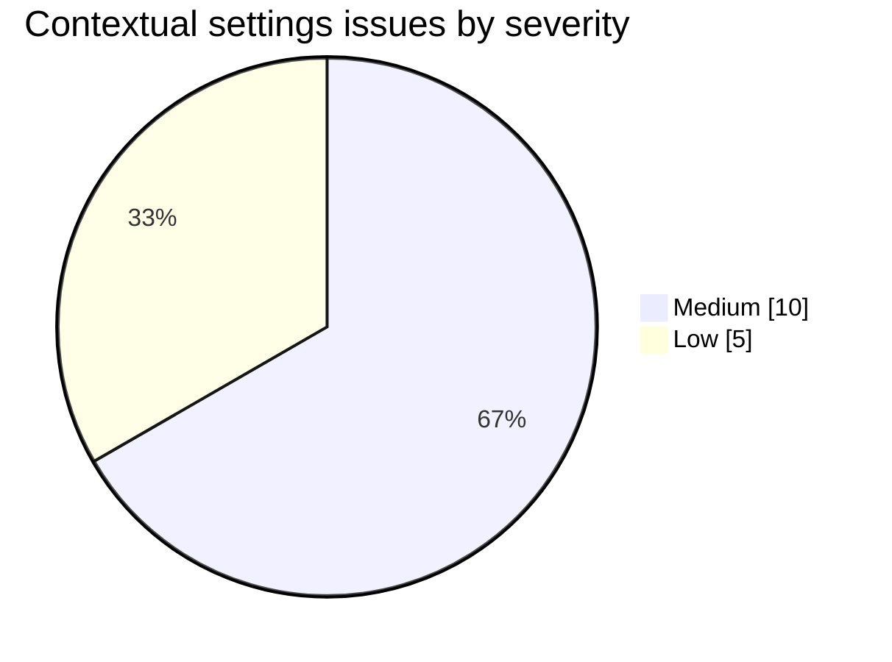
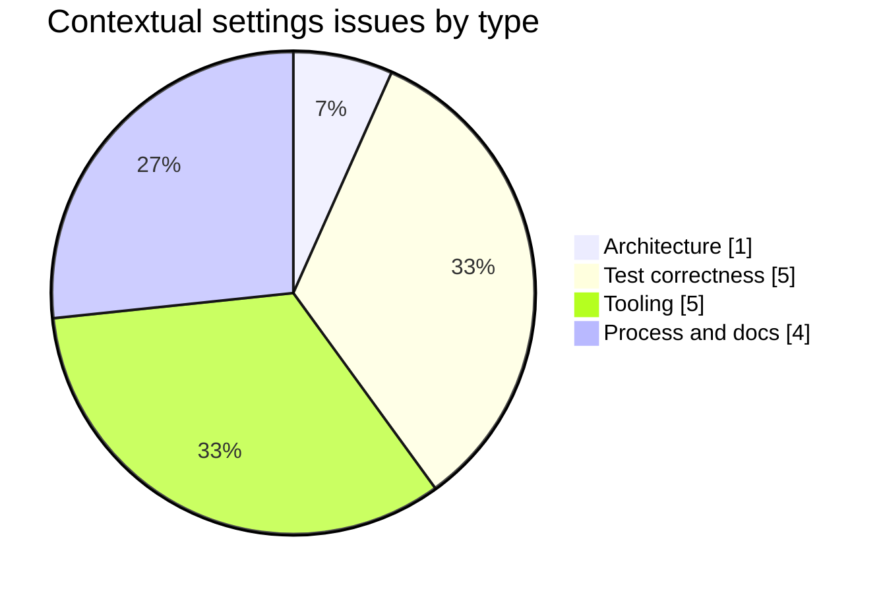

# Contextual Endpoint Settings UI - Execution Issues and RCA

> **Status:** Complete for the local v0.55.22 implementation - **Last verified:** 2026-09-15
>
> **Scope:** Extraction of the shared endpoint-settings registry, the reusable related-settings panel, contextual placement across Users, Groups, Schemas, Resource types, Logs, and Connect, and preservation of Settings as the complete 38-control inventory.
>
> **Companion references:** [ENDPOINT_SETTINGS_OPERATOR_GUIDE.md](ENDPOINT_SETTINGS_OPERATOR_GUIDE.md), [UI_GUIDE.md](UI_GUIDE.md), and [CHANGELOG.md](../CHANGELOG.md).
>
> **Provenance / completeness:** Reconciled against the full feature transcript window beginning at transcript line 65775, where the contextual-settings work started, through the final local audit. The reconciliation used an error/signal pass (`error TS`, `FAIL`, `RED`, `timeout`, `missing module`, `stale`, `duplicate`, `baseline`, `diff --check`, `trailing whitespace`, `npx`, `U-T7`) and a diagnosis-language pass (`root cause`, `turned out`, `silently`, `mismatch`, `complete inventory`). Later audit queries that merely repeated earlier findings were discarded. Verified non-issues are listed in Section 6.

---

## 1. Summary

The feature completed its local implementation with fifteen execution issues: ten medium-severity correctness/process findings and five low-severity tooling or hygiene findings. No runtime API defect, persistence-backend parity defect, database migration, or security-boundary change was found.

## 2. Issue Dashboard

| ID | Type | Severity | Symptom | Detected | Earliest possible |
|---|---|---|---|---|---|
| CS-1 | Architecture | Medium | The new shared definitions initially coexisted with the old inline Settings catalogs | Stage 1 TypeScript check | Authoring diff review |
| CS-2 | Test correctness | Medium | User and Group drawer resources remained typed as possibly undefined | Stage 1 TypeScript check | Stage 1 TypeScript check |
| CS-3 | Process and docs | Medium | The operator guide still claimed 27 controls and four numeric settings | Documentation review | Source-to-doc content audit |
| CS-4 | Test correctness | Medium | Browser RED was captured after production implementation rather than before it | Final transcript audit | Test planning |
| CS-5 | Tooling | Low | `npx` resolution attempted unavailable tooling instead of using the installed local binary | Focused test execution | Command selection |
| CS-6 | Tooling | Low | Long validation wrappers timed out or returned stale/ambiguous terminal capture | Full web validation | Command design |
| CS-7 | Tooling | Low | VS Code retained a stale GroupsTab diagnostic after executable TypeScript was clean | Editor diagnostics review | Same stage |
| CS-8 | Process and docs | Low | Ten stamped header lines failed `git diff --check`; two edited guide dates remained stale | Final diff/doc audit | Immediately after doc edit |
| CS-9 | Tooling | Low | The web coverage command was invoked twice from the repository root | Stage 2 coverage | Command construction |
| CS-10 | Test correctness | Medium | Prisma E2E V10 queried a buffered RequestLog row immediately and failed under matrix concurrency | Stage 2 six-mode matrix | Test authoring |
| CS-11 | Test correctness | Medium | Parallel E2E apps rotated one shared production-default log file and raced on rename | Stage 2 six-mode matrix | E2E harness configuration |
| CS-12 | Process and docs | Medium | Production audit found newly published patched floors in four transitive dependency chains | Stage 3b.5 dependency sweep | Scheduled dependency intake |
| CS-13 | Tooling | Medium | The public-registry lock selected sql-escaper 1.5.2, which the corporate feed does not carry | Lockfile reproducibility check | CI artifact review plus managed-device `npm ci` |
| CS-14 | Process and docs | Medium | The dev pipeline could watch an older workflow run and accept stale `latest` content | Stage 4 pre-deploy review | Pipeline contract test |
| CS-15 | Test correctness | Medium | The Prisma matrix consumed a stale `inmemory` marker as its database URL | Full deployment Stage 2 matrix | Cross-mode harness contract |

## 3. Detection Density

## 4. Detailed Entries

### CS-1 - Shared registry migration temporarily left two sources of truth

- **Type:** Architecture. **Severity:** Medium.
- **Symptom:** Importing `BOOLEAN_FLAGS`, `ENUM_SETTINGS`, and `NUMBER_SETTINGS` into `SettingsTab` while its old local declarations still existed produced duplicate-definition failures.
- **Root cause:** The extraction crossed an ownership boundary in two steps: create the shared registry, then remove the old private catalog. The intermediate state necessarily contained both.
- **Fix:** Removed the inline catalogs and made both Settings and contextual panels consume `endpoint-settings-definitions.ts`.
- **Why the fix works:** Defaults, bounds, labels, descriptions, and setting keys now have one declarative owner.
- **Prevention:** Applied in-place with `U-T7`, which asserts that Settings renders every registry family and all 38 server-registered controls. Contextual placement can no longer hollow out the complete Settings inventory silently.
- **Escape delta:** Detected by Stage 1 TypeScript; a narrow diff review could have caught it during authoring.

### CS-2 - List resource types did not satisfy the drawer contract

- **Type:** Test correctness. **Severity:** Medium.
- **Symptom:** `UsersTab` and `GroupsTab` passed `Record<string, unknown> | undefined` to a drawer requiring `ScimResource`.
- **Root cause:** List-response resources used a broad record type while the detail drawer kept a private, more specific resource interface. Repeated `.find()` expressions also prevented useful narrowing.
- **Fix:** Exported the existing `ScimResource` interface, typed list resources once, and passed the already-narrowed selected resource to the drawer.
- **Why the fix works:** The list and drawer now share the same structural contract, and the conditional render narrows one stable variable.
- **Prevention:** Executable `tsc --noEmit` is the authority. The repository baseline improved from 96 to 94 diagnostics, with zero diagnostics in changed files.
- **Escape delta:** Zero. Stage 1 TypeScript was the earliest executable detector and caught it.

### CS-3 - User-facing setting counts had drifted

- **Type:** Process and docs. **Severity:** Medium.
- **Symptom:** The endpoint-settings guide described 27 controls and four numeric JWKS settings while the server registry contains 38 controls, including 14 numeric settings.
- **Root cause:** The prose reflected an older settings surface and was not updated as credential caps and JWKS safety controls accumulated.
- **Fix:** Updated the endpoint-settings, UI, and authentication guides to describe the complete inventory and contextual ownership model.
- **Why the fix works:** Operators now see the same count and categories that the source registry exposes.
- **Prevention:** Existing `scripts/audit-doc-content.mjs` checks the total, boolean, numeric, and enum counts against `ENDPOINT_CONFIG_FLAGS_DEFINITIONS`, verifies every key is documented, and rejects phantom settings.
- **Escape delta:** Detected during feature documentation. The semantic content audit was the earliest automated detector available at final validation.

### CS-4 - Browser RED was a deployment regression proof, not the first implementation test

- **Type:** Test correctness. **Severity:** Medium.
- **Symptom:** The three Playwright journeys were run RED against the pre-feature dev deployment after the shared panel had already been implemented locally.
- **Root cause:** Component-level TDD drove the implementation first; assembled-browser coverage was authored after the cross-tab wiring existed.
- **Fix/status:** The core production component did follow RED-first: `EndpointRelatedSettings.test.tsx` failed on the missing production module before implementation, then passed. The Playwright RED is retained honestly as a pre-deployment regression proof and must turn GREEN on v0.55.22 dev.
- **Why this is acceptable but incomplete:** The implementation had a real failing test first, but the browser layer did not independently satisfy strict RED-before-production chronology.
- **Prevention:** For the next UI slice, author the Playwright skeleton and run it against the current deployment before wiring the final page integration. Do not describe a post-implementation deployment RED as the implementation's first RED.
- **Escape delta:** Detected only during the final transcript audit; the earliest possible point was test planning.

### CS-5 - Test runner resolution used the wrong entry point

- **Type:** Tooling. **Severity:** Low.
- **Symptom:** `npx` attempted to resolve tooling instead of consistently using the already-installed project binary.
- **Root cause:** The command relied on package-runner resolution in an environment where missing or differently resolved binaries can trigger installation behavior.
- **Fix:** Used `web/node_modules/.bin/vitest.cmd` for focused execution and did not install anything interactively.
- **Why the fix works:** It executes the repository-pinned binary and cannot fetch a different version.
- **Prevention:** Prefer package scripts or the local `.bin` executable for project tooling on this device.
- **Escape delta:** Zero; detected during the first affected command.

### CS-6 - Long validation capture became ambiguous

- **Type:** Tooling. **Severity:** Low.
- **Symptom:** Wrapper timeouts and reused terminal scrollback made one full-web run impossible to treat as authoritative.
- **Root cause:** Several long commands were grouped under a capture timeout, and a reused terminal contained output from earlier invocations.
- **Fix:** Discarded ambiguous output and ran a fresh authoritative validation, recording the final 105-file / 1,297-test result plus independent build and size results.
- **Why the fix works:** Only output tied to the fresh process is used as evidence.
- **Prevention:** Run long gates through one execution agent without a short timeout, or write each command's output to a uniquely named result file.
- **Escape delta:** Zero; the ambiguity was detected before its output was accepted.

### CS-7 - Editor diagnostic lagged behind executable TypeScript

- **Type:** Tooling. **Severity:** Low.
- **Symptom:** VS Code continued to report a `GroupsTab` resource-type error after the source was corrected.
- **Root cause:** The language-service diagnostic cache had not refreshed, while a fresh TypeScript process evaluated current files.
- **Fix:** Ran `tsc --noEmit` and checked changed-file diagnostics explicitly: 94 repository-baseline diagnostics, zero in changed files.
- **Why the fix works:** A fresh compiler process is independent of stale editor state.
- **Prevention:** When editor and command-line diagnostics disagree, use the executable compiler as the release gate and record both signals.
- **Escape delta:** Zero; detected and resolved within Stage 1.

### CS-8 - Documentation hygiene and provenance failed the final diff audit

- **Type:** Process and docs. **Severity:** Low.
- **Symptom:** Ten product-version header lines carried trailing spaces, causing `git diff --check` to fail; the edited authentication and UI guides still showed the prior verification date.
- **Root cause:** Automated version stamping preserved Markdown hard-break whitespace, and content edits did not update both provenance fields.
- **Fix:** Removed only the reported trailing spaces and updated both edited guides to 2026-09-15.
- **Why the fix works:** `git diff --check` and `audit-doc-freshness.ps1` now both pass.
- **Prevention:** Run both checks immediately after automated doc stamping rather than waiting for final review.
- **Escape delta:** Detected at final diff/doc audit; earliest possible detection was immediately after the doc edit.

### CS-9 - Package-owned coverage command ran from the repository root

- **Type:** Tooling. **Severity:** Low.
- **Symptom:** `npm run test:coverage` failed twice with `Missing script: "test:coverage"` because the persistent terminal was at the repository root, while the script belongs to `web/package.json`.
- **Root cause:** The first command omitted an explicit package directory. The retry relied on the terminal's intended working directory rather than encoding it in the command, so it repeated the same failure.
- **Fix:** Ran `Set-Location <repo>/web; npm run test:coverage` explicitly. The gate passed 105 files / 1,297 tests with 81.05% statements, 73.18% branches, 72.26% functions, and 84.31% lines.
- **Why the fix works:** The command resolves scripts from the owning package manifest regardless of persistent-shell state.
- **Prevention:** Every package-owned terminal command must include an explicit `Set-Location` in the same invocation, even when a previous command used that directory. Prefer the repository orchestrator when it already owns the working-directory transition.
- **Escape delta:** Zero runtime escape; command construction was the earliest possible detector, but the identical failed retry added avoidable friction.

### CS-10 - OAuth RequestLog assertions raced buffered Prisma persistence

- **Type:** Test correctness. **Severity:** Medium (false-red full-matrix gate).
- **Symptom:** The Prisma E2E matrix failed only `endpoint-oauth-client` V10: the 401 response was correct, but an immediate `GET /admin/logs` did not yet contain its buffered RequestLog row. The suite passed alone, confirming concurrency-sensitive timing.
- **Root cause:** V10 and neighboring W1 treated an eventually durable buffered write as immediately queryable. They also matched any endpoint/status 401, so W1 could accidentally select V10's prior row and pass against the wrong request. The shared E2E helper already states that shortening the flush timer narrows this race but does not remove it.
- **Fix:** Capture each rejected request's `X-Request-Id`, then use the existing `waitForLogRowByRequestId` helper, which force-flushes and polls the exact row before assertions.
- **Why the fix works:** Polling follows the persistence contract rather than machine timing, while request-ID selection prevents cross-test row substitution.
- **Prevention:** Any E2E assertion reading a RequestLog row must use `waitForLogRow` or `waitForLogRowByRequestId`; immediate list reads and fixed sleeps are forbidden. Prefer request-ID lookup whenever the triggering response exposes it.
- **Escape delta:** The issue survived isolated execution and was caught by the Stage 2 Prisma matrix. The earliest possible stage was test authoring, where the existing helper should have been used.

### CS-11 - Parallel E2E workers shared the production-default main log file

- **Type:** Test correctness. **Severity:** Medium (13-test false-red and cross-worker filesystem race).
- **Symptom:** After CS-10 was fixed, the next Prisma matrix run failed all 13 `http-error-codes` tests with `ENOENT` while renaming `api/logs/scimserver.log` to `.1`. The suite passed in isolation.
- **Root cause:** Every Jest worker creates its own Nest app, and the E2E helper did not set `LOG_FILE`. `FileLogTransport` therefore gave every process the same production-default main file. Two workers could both pass `existsSync`; one renamed the file before the other called `renameSync`.
- **Fix:** Set `process.env.LOG_FILE = ''` in `createTestApp` before the module compiles. Physical main-file and rotation behavior remains owned by the dedicated `FileLogTransport` and `RotatingFileWriter` unit suites; E2E endpoint-setting tests still validate the `logFileEnabled` profile contract.
- **Why the fix works:** Each E2E app no longer opens the shared main file, so independent test processes cannot race its rotation. Production defaults are unchanged.
- **Prevention:** Any process-parallel integration harness must explicitly isolate or disable shared filesystem transports. A production-default path is not a valid parallel-test default.
- **Escape delta:** Caught by the Stage 2 Prisma matrix; isolated suites could not reproduce it. The earliest possible stage was E2E harness design.

### CS-12 - Production dependency audit found four patchable transitive floors

- **Type:** Process and docs (supply chain). **Severity:** Medium (High advisories, zero Critical).
- **Symptom:** `npm audit --omit=dev` reported 11 High, 5 Moderate, 1 Low, and 0 Critical findings in API production dependencies; web production dependencies reported zero.
- **Root cause:** Four transitive floors had advanced after the previous override review: Multer 2.2.0 is affected by four 2026 advisories; fast-uri 4.1.2 by four URL-normalization advisories; deepmerge-ts below 8 by recursive-graph stack exhaustion; mysql2 through 3.23.0 by auth-downgrade and decompression-bomb advisories. npm expands those transitive findings through NestJS and Prisma parents, inflating the top-level High count.
- **Fix:** Raise overrides to Multer 2.3.0, fast-uri 4.1.3, deepmerge-ts 8.0.0, and mysql2 3.23.1. All four versions are available through the configured corporate feed and were published more than seven days before 2026-09-15. The final exact lockfile audits at 0 Critical / 0 High; 6 Moderate / 1 Low remain below the blocking threshold.
- **Why the fix works:** Each override meets the advisory's patched range without downgrading NestJS 11 or Prisma 7. It changes only vulnerable transitive implementations, not public application APIs.
- **Supply-chain constraint:** The corporate host must not generate the committed lockfile. `.github/workflows/regen-lockfile.yml` regenerates it on a public-registry GitHub runner, verifies registry hosts and sha512 integrity, and publishes a reviewable artifact.
- **Prevention:** Keep the scheduled dependency-pins review and Stage 3b.5 audit active; when a fix is available, verify seven-day age, update the override with advisory IDs, and use the CI lockfile workflow.
- **Escape delta:** Detected at the mandatory dependency sweep. The earliest automated stage is that same sweep; no feature test can detect advisory freshness.

### CS-13 - Clean public lockfile selected a package absent from the corporate feed

- **Type:** Tooling (cross-registry reproducibility). **Severity:** Medium because a clean lockfile that managed devices cannot install blocks every local gate.
- **Symptom:** The first CI-generated lockfile passed public-host and sha512 checks but `npm ci` on the managed device failed 404 for `sql-escaper@1.5.2`.
- **Root cause:** mysql2 3.23.1 declares `sql-escaper ^1.5.1`; the public registry selected 1.5.2, while the configured corporate feed currently exposes versions only through 1.5.1. Provenance correctness alone does not prove cross-registry availability.
- **Fix:** Add an explicit `sql-escaper: 1.5.1` override. It satisfies mysql2's range, carries no advisory in the sweep, and is available through the managed feed. The second public-runner artifact retained public hosts/sha512 and then installed successfully through the managed feed with `npm ci`.
- **Why the fix works:** Both public CI and managed local installs resolve one version that exists in both registries, while mysql2 remains above its patched floor.
- **Prevention:** After every CI lockfile regeneration, run `npm ci` on a managed device before accepting the artifact. The workflow's publish-age report should eventually add a configured-feed availability check for every newly introduced package.
- **Escape delta:** Caught immediately at the required post-artifact `npm ci`; the earliest possible detector is the same cross-environment reproduction check.

### CS-14 - Publish gate selected the newest workflow run without artifact identity

- **Type:** Process and docs (deployment gate correctness). **Severity:** Medium because a false-green publish gate can validate or deploy an older image.
- **Symptom:** Immediately after dispatching v0.55.22, `gh run list --limit 1` returned an older completed master run before the new event appeared. The pipeline used the same newest-run query after a fixed sleep, and its `latest` pull checked only that some image downloaded.
- **Root cause:** Run recency is not run identity. GitHub workflow-dispatch indexing is eventually consistent, so the newest visible row can predate the dispatch or carry another SHA. A successful anonymous pull likewise proves reachability, not that `latest` equals the requested version.
- **Fix:** Add `Select-GithubWorkflowRun`, filtering candidates by exact expected head SHA and `createdAt >= dispatch time`; poll boundedly until that run appears. Stage 4.4 now pulls both the version and latest tags and requires identical local image IDs.
- **Why the fix works:** The watched run is causally tied to the dispatch and source commit, and the pulled alias is byte-content-equivalent to the version tag before import/deploy.
- **Prevention:** The 8-assertion selector contract is a default Fast pre-push gate. It rejects an older different-SHA run, a stale same-SHA run, the prior newest-run query, missing pipeline integration, and a missing version/latest mismatch guard.
- **Escape delta:** Caught in Stage 4 pre-deploy review before any v0.55.22 deployment. The earliest automated detector is the new contract test.

### CS-15 - Cross-mode marker leaked InMemory state into Prisma E2E

- **Type:** Test correctness. **Severity:** Medium because the authoritative matrix produced 304 false failures across 14 unrelated suites and skipped database cleanup.
- **Symptom:** Prisma apps logged `Using database: inmemory`, then pg interpreted the malformed connection string as host `base` and returned `Can't reach database server at base` during endpoint creation.
- **Root cause:** InMemory global setup writes the literal `inmemory` to `.test-db-path`. `createTestApp` in Prisma mode trusted any marker content and assigned it to `DATABASE_URL`. Prisma global teardown could then also see `inmemory`, skip truncation, and leave hundreds of fixture endpoints accumulated in local `scimdb`.
- **Fix:** Add `resolveTestDatabaseUrl`, accepting only `postgresql://` or `postgres://` marker values and otherwise using the current environment/default PostgreSQL URL. The focused E2E contract covers stale InMemory, both valid schemes, empty, and malformed markers.
- **Why the fix works:** Backend mode remains the authority; a marker from another mode cannot override Prisma with a non-URL sentinel.
- **Prevention:** Every cross-mode filesystem marker must be parsed as a typed value rather than trusted as an arbitrary string. Run the full mode sequence on a clean local test database before deployment.
- **Confirmed resolution:** After resetting only local `scimdb`, all six modes passed in sequence; API E2E was 1,520/1,520 on both InMemory and Prisma. The failed deployment pipeline was stopped before Stage 4, so no image or estate received the invalid run.
- **Escape delta:** The issue appeared only when the official pipeline repeated the complete mode sequence. The earliest possible detector is the new pure marker contract.

## 5. Escape Analysis

| Issue | Detected stage | Earliest stage | Escape delta | Disposition |
|---|---|---|---:|---|
| CS-1 | Stage 1 | Authoring | 1 | Applied: one registry + U-T7 |
| CS-2 | Stage 1 | Stage 1 | 0 | Applied: shared resource type |
| CS-3 | Documentation | Documentation/content gate | 0 | Applied: guides corrected; C3/C5/C8 already enforce |
| CS-4 | Final audit | Test planning | 3 | Accepted for this slice; prevention recorded |
| CS-5 | Authoring | Authoring | 0 | Applied: local runner |
| CS-6 | Validation | Validation command design | 0 | Applied: discard ambiguous run |
| CS-7 | Stage 1 | Stage 1 | 0 | Applied: executable compiler authority |
| CS-8 | Final audit | Post-doc edit | 1 | Applied: diff + freshness checks |
| CS-9 | Stage 2 coverage | Command construction | 0 | Applied: explicit package directory |
| CS-10 | Stage 2 Prisma matrix | Test authoring | 2 | Applied: request-ID force-flush polling |
| CS-11 | Stage 2 Prisma matrix | Harness design | 2 | Applied: disable shared E2E main log file |
| CS-12 | Stage 3b.5 | Scheduled dependency intake | 0 | Applied: aged overrides + CI lockfile regeneration |
| CS-13 | Lockfile reproduction | Cross-registry availability | 0 | Applied: shared-availability sql-escaper pin |
| CS-14 | Stage 4 pre-deploy | Pipeline contract | 1 | Applied: exact-SHA selector + image-ID equality gate |
| CS-15 | Stage 2 full pipeline | Cross-mode harness contract | 2 | Applied: typed database-marker resolution |

## 6. Verified Non-Issues

- No API route, response contract, persistence model, Prisma schema, or backend branch changed.
- Existing live section `9z-Z` already covers settings PATCH, deep merge, follow-up GET, overview projection, and cleanup; another live section would duplicate the same wire contract.
- WIF trusts are secretless and unaffected by the keyed-credential migration. The previously measured live inventories remained complete: dev 7/7, canary 7/7, customer prod 1/1.
- Web TypeScript remains at the accepted baseline with zero changed-file diagnostics.
- The package-lock update changed only root version metadata; 1,190 package entries retained `registry.npmjs.org` resolution and `sha512` integrity.

## 7. Self-Improvement and Architecture Disposition

- **Test/gate disposition: applied.** `U-T7` makes Settings completeness falsifiable even as contextual surfaces grow. Existing semantic doc checks cover setting counts, missing keys, and phantom settings.
- **Design/architecture disposition: accepted.** The shared declarative registry and reusable panel reduce duplication and preserve the established endpoint mutation path. Further splitting would be speculative because there is one implementation with several data-driven consumers, not several competing implementations.
- **Pattern promotion:** No new central pattern is required. CS-1 is another instance of the existing single-source-of-truth rule; CS-4 strengthens the established RED-first discipline but has not escaped twice.
