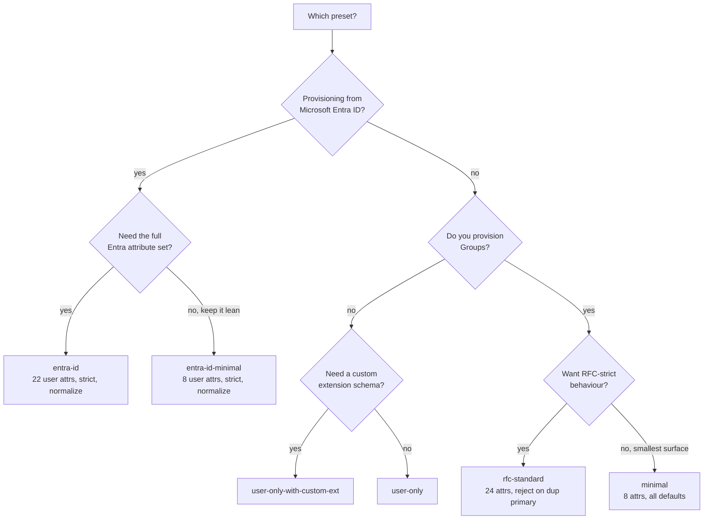

# Endpoint Settings - Operator Guide

> **Status:** Living reference - **Created:** 2026-07-31 - **Last verified:** 2026-09-24 - **Product version at capture:** `0.55.33`
> **Every value in this document was measured against a running server**, not transcribed from source. The preset matrix in [Section 3](#3-preset-matrix-measured) was produced by creating one endpoint per preset on the live dev estate, reading back what the server actually published, and deleting them. The request/response bodies in [Section 6](#6-changing-a-setting-over-the-api) are verbatim wire captures.
> **Companion docs:** [ENDPOINT_CONFIG_FLAGS_REFERENCE.md](ENDPOINT_CONFIG_FLAGS_REFERENCE.md) (flag registry internals), [AUTHENTICATION_GUIDE.md](AUTHENTICATION_GUIDE.md) (the five auth methods), [UI_GUIDE.md](UI_GUIDE.md) (screen-by-screen tour).

---

## 1. What this document is

Every endpoint in SCIMServer carries a **profile**, and the profile's `settings` block decides how that endpoint behaves on the wire: what it accepts, what it rejects, what it advertises, and who may talk to it.

The Settings tab renders **all 37 server-registered endpoint settings**:

| Kind | Count | Examples |
|---|---|---|
| Boolean switches | **19** | `StrictSchemaValidation`, `RequireIfMatch`, `UserHardDeleteEnabled` |
| Enum dropdowns | **2** | `PrimaryEnforcement`, `logLevel` |
| Numeric inputs | **14** | JWKS egress/safety/refresh knobs and per-method credential caps |
| Fixed policy statuses | **2** | encrypted admin secret retention; durable request-log redaction |

Settings remains the complete, structured inventory. Operational tabs also show a collapsed **Related settings** disclosure containing only controls unique to that workflow. Both presentations consume `web/src/pages/endpoint-settings-definitions.ts`, so changing a value in either place writes the same endpoint profile and the other surface reflects it.

The ownership rule is deliberate:

| Surface | Contextual controls | Kept only in Endpoint Settings |
|---|---|---|
| Users | `UserSoftDeleteEnabled`, `UserHardDeleteEnabled` | Common validation, boolean coercion, primary enforcement, PATCH semantics and ETags |
| Groups | `GroupHardDeleteEnabled`, `MultiMemberPatchOpForGroupEnabled`, `PatchOpAllowRemoveAllMembers` | Common validation, boolean coercion, primary enforcement, general PATCH semantics and ETags |
| Schemas | Discovery and schema-validation controls | Unrelated lifecycle, auth and logging controls |
| Resource types | Discovery and resource-type enforcement | Unrelated lifecycle, auth and logging controls |
| Logs | Redacted persistence status, file output and endpoint log level | Unrelated resource and auth controls |
| Connect method | The selected method's credential cap or WIF/JWKS policy | Other methods and unrelated endpoint behavior |

This avoids presenting the same common setting in both Users and Groups, where an operator could reasonably mistake it for two independent values. The collapsed header always shows the pane title and setting count; expand it only when changing that workflow's behavior.

Two properties of this system matter before you change anything:

1. **Settings are per-endpoint, not global.** Two endpoints on the same server can disagree about every one of these values. That is the entire point - one tenant can be strict while another is lenient.
2. **An unset setting is not the same as `false`.** A preset only writes the settings it cares about; everything else *inherits a default*. The Settings tab shows you the **effective** value, while the admin API returns only what was explicitly written. This is why [Section 3](#3-preset-matrix-measured) has blank cells.


---

## 2. The controls, by category

### 2.1 Validation and schema

| Setting | What it actually does |
|---|---|
| `StrictSchemaValidation` | Reject resources whose `schemas[]` is missing a declared extension URN. Also rejects attributes and sub-attributes the schema does not declare. |
| `AllowAndCoerceBooleanStrings` | Coerce `"True"` / `"False"` string values to real booleans on write. Without it, `"active": "True"` is a type error. |
| `RfcCompliantSubAttributes` | OFF (default) preserves current behaviour: a schema may declare a *complex* sub-attribute and payloads populating it are accepted. ON refuses that shape per RFC 7643 2.3.8 (erratum 8415). The flag only ever tightens. A multi-valued *simple* sub-attribute (1.2, erratum 5607) is accepted and element-wise type-checked by `StrictSchemaValidation` itself, at either setting of this flag. |
| `PrimaryEnforcement` | How a resource with more than one `primary=true` sub-attribute is handled. Three values: `passthrough` (accept as-is), `normalize` (keep the first primary, clear the rest), `reject` (422). |

> **Gotcha worth knowing.** `StrictSchemaValidation` governs *undeclared* attributes. It does **not** govern *required* attributes - those are checked by a separate `RequiredAttributeCheck` that runs regardless. Turning strict off will not let you create a user that is missing `displayName` on an `entra-id` endpoint. This was measured directly: a payload missing `displayName` and `emails` still returned 400 with `"triggeredBy": "RequiredAttributeCheck"` and `"activeConfig": { "StrictSchemaValidation": false }`.

### 2.2 Concurrency

| Setting | What it actually does |
|---|---|
| `RequireIfMatch` | Mandate an `If-Match` ETag header on PUT, PATCH and DELETE. A bare request is refused with **428 Precondition Required**. |

### 2.3 Lifecycle and deletes

| Setting | What it actually does |
|---|---|
| `UserSoftDeleteEnabled` | `PATCH active=false` soft-deactivates the user (default RFC behaviour). |
| `UserHardDeleteEnabled` | `DELETE /Users/{id}` permanently removes the row. Turn OFF and the DELETE is refused. |
| `GroupHardDeleteEnabled` | `DELETE /Groups/{id}` permanently removes the group. |

### 2.4 PATCH semantics

| Setting | What it actually does |
|---|---|
| `VerbosePatchSupported` | Resolve dot-notation paths (e.g. `name.familyName`) inside PATCH. |
| `MultiMemberPatchOpForGroupEnabled` | Accept multi-member add/remove inside a single PATCH op on a Group. |
| `PatchOpAllowRemoveAllMembers` | Allow `remove` with `path=members` - clearing the entire membership list. |
| `IgnoreReadOnlyAttributesInPatch` | Strip (instead of reject) readOnly attributes encountered in PATCH ops. |
| `IncludeWarningAboutIgnoredReadOnlyAttribute` | Append a warning header when a readOnly attribute is silently stripped. |

### 2.5 Discovery

| Setting | What it actually does |
|---|---|
| `SchemaDiscoveryEnabled` | Expose `/Schemas`, `/ResourceTypes` and `/ServiceProviderConfig` under this endpoint. |
| `EnforceResourceTypes` | ON (default): a query on an un-served resource type returns **404**. Turn OFF so a LIST on an un-served type (e.g. `/Groups` on a user-only endpoint) returns **200 empty + warning**. This is specifically needed for Entra's Test Connection probe. |

### 2.6 Authentication

Four real methods decide **who may call this endpoint's SCIM data plane**. They are covered in depth in [AUTHENTICATION_GUIDE.md](AUTHENTICATION_GUIDE.md).

> These four are editable in the collapsed **Authentication methods** pane on Connect, in setup order. The pane shows its enabled count without expanding. Endpoint Settings keeps the complete raw inventory.

When `profile.authentication.methods[]` declares one of these methods, that entry owns the effective state and overrides the corresponding flat setting. Both Connect and Endpoint Settings display the server-resolved value, show that it is managed by Authentication methods, and disable the lower-precedence switch. WIF follows the same rule across trust creation, diagnostics, token minting, connection info, and ServiceProviderConfig discovery.

| Setting | What it actually does |
|---|---|
| `OAuthClientCredentialsAuthEnabled` | Accept a per-endpoint `oauth_client` credential (Entra's "OAuth2 client-credentials"). |
| `WifCredentialsEnabled` | Accept federated-identity (WIF, RFC 7523 `jwt-bearer`) credentials and advertise the WIF authentication scheme. |
| `SharedSecretBearerAuthEnabled` | Whether this endpoint accepts the **global** SCIM shared secret. Turn OFF to make the endpoint accept only its own credentials. Defaults to on. |
| `SecretTokenBearerAuthEnabled` | Accept a per-endpoint bcrypt bearer token (Entra's "Secret Token" field). |
| `CredentialSecretVisibility` | Fixed to `always`: new and rotated bearer/OAuth secrets are retained encrypted for authenticated admin display and export. The retired `once` value is rejected. |

An explicit `profile.authentication.methods[]` entry is authoritative over the flat setting. Connection info reports `enablementSource` (`authentication-method`, `dedicated-setting`, or `default`). Connect disables a flat switch managed by an authentication-method entry instead of allowing a change that would look successful but have no effect.

> **These govern the DATA plane only.** Disabling `SharedSecretBearerAuthEnabled` stops the global secret working on `/scim/v2/endpoints/{id}/...`, but the admin plane (`/scim/admin/...`) keeps answering the admin bearer, so you can always get back in and re-enable it. That separation was a real bug until 0.55.1 - see [Section 7](#7-known-behaviour-worth-knowing).

### 2.7 Logging and privacy

| Setting | What it actually does |
|---|---|
| `logLevel` | Per-endpoint log verbosity override. Falls back to the server global level when unset. Values: `TRACE`, `DEBUG`, `INFO`, `WARN`, `ERROR`, `FATAL`, `OFF`. |
| `logFileEnabled` | ON (default): this endpoint's entries are also written to the rotating log **file**, not only to the in-memory ring buffer and the database. Turn OFF for a high-volume endpoint whose traffic you do not want on disk. Independent of `logLevel` - the level decides *what* is logged, this decides *where* it goes. |
| `PersistRequestSecrets` | Retired compatibility value. RequestLog always preserves non-secret diagnostics and redacts secret-bearing values (`Authorization`, `client_secret`, `access_token`) before durable storage. The Settings tab displays this as a fixed policy, not a switch. |

### 2.8 Runtime egress (WIF JWKS fetch)

Fourteen numeric controls cover how the server fetches and caches signing keys plus the active-credential limits for each authentication method. Both Endpoint Settings and the Connect WIF panel show authoritative effective runtime values. The 11 WIF/JWKS fields include configured endpoint override, source, unit, inclusive bounds, and any clamping. Connect provides transactional Edit, Save, Cancel, and Reset to inherit controls; Settings exports the effective values rather than blank placeholders.

| Setting | Bounds | Server default |
|---|---|---|
| `JwksFetchTimeoutMs` | 100 - 60000 | 5000 |
| `JwksFetchRetries` | 0 - 10 | 2 |
| `JwksFetchRetryBackoffMs` | 0 - 10000 | 200 |
| `JwksCacheMaxAgeMs` | 0 - 86400000 (0 = always refetch) | 86400000 |
| `JwksTotalDeadlineMs` | 100 - 120000 | 10000 |
| `JwksMaxResponseBytes` | 1024 - 10485760 | 1048576 |
| `JwksMaxKeys` | 1 - 1000 | 100 |
| `JwksMaxCacheEntries` | 1 - 1000 | 50 |
| `JwksRefreshIntervalMs` | 60000 - 86400000 | 3600000 |
| `JwksUnknownKidMinIntervalMs` | 0 - 3600000 | 300000 |
| `JwksStaleIfErrorMs` | 0 - 604800000 | 172800000 |

`GET /scim/admin/endpoints/{endpointId}/egress-policy` returns these 11 JWKS values with their effective/configured/source/unit/bounds/clamped shape. Endpoint PATCH with a setting value of `null` removes that per-key override while preserving sibling settings; omission still means no change.

### Active-credential caps

These bound how many ACTIVE credentials of each type an endpoint may hold. They exist for a
performance reason, not a tidiness one: the resource plane compares a presented opaque token against
**every** active credential with bcrypt, measured at ~293 ms per comparison, so three credentials
already exceed the 800 ms auth-latency gate. Counting is per type, so one type cannot exhaust
another's budget.

`MaxActiveWifTrusts` is deliberately more generous because WIF trusts are JWKS-verified and never
enter that comparison loop - it bounds configuration sprawl, not latency.

When a cap is reached the create is refused with `400` naming the flag; deactivate an existing
credential or raise the cap. Deactivated credentials do not count.

| Setting | Bounds | Default |
|---|---|---|
| `MaxActiveBearerCredentials` | 1 - 25 | 5 |
| `MaxActiveOAuthClientCredentials` | 1 - 25 | 5 |
| `MaxActiveWifTrusts` | 1 - 25 | 10 |

The last four are the **W1.5 safety envelope**. `JwksFetchTimeoutMs` bounds a single
attempt; `JwksTotalDeadlineMs` bounds the whole fetch - every attempt, every backoff
sleep and every redirect hop combined - which is the number that actually caps how long
a token mint can wait on a slow IdP. `JwksMaxResponseBytes` and `JwksMaxKeys` bound what
a single response may cost (`JwksMaxKeys` defaults to 100 rather than something tighter
because a signing-key cache legitimately holds 10-1000 keys across issuers), and
`JwksMaxCacheEntries` bounds how many key sets are retained at once, evicting the oldest.

The three W1.4 cadence knobs control *when* keys are re-read rather than how a
single fetch behaves. `JwksCacheMaxAgeMs` is how long a cached key set stays
fresh (now 24 h by default, matching Microsoft's published guidance for its
signing keys); `JwksRefreshIntervalMs` is the age at which a BACKGROUND sweep
refreshes it, which is what keeps the hot path a cache hit rather than paying a
fetch at every expiry. `JwksUnknownKidMinIntervalMs` rate-limits the
synchronous refetch that a token with an unrecognised `kid` triggers - that path
is caller-controlled, so without a floor it is an amplification vector against
the IdP. `JwksStaleIfErrorMs` is the hard ceiling on how old cached keys may be
and still be served when a refetch fails: raise it to favour availability during
a long IdP outage, lower it (or set `0`) to favour freshness. Note that an
allowlist revocation is never stale-eligible regardless of this value.

---

## 3. Preset matrix (measured)

A preset is just a starting set of schemas, resource types and settings. Six exist. **These were measured by instantiating each one**, so the numbers below are what the server actually publishes - not what a design doc claims.

| Preset | Schemas | ResourceTypes | User attributes | Required on create | `/Groups` |
|---|---|---|---|---|---|
| `entra-id` | 7 | 2 | 22 | `userName`, `displayName`, `emails` | 200 |
| `entra-id-minimal` | 7 | 2 | 8 | `userName`, `displayName`, `emails` | 200 |
| `rfc-standard` | 3 | 2 | 24 | `userName` | 200 |
| `minimal` | 2 | 2 | 8 | `userName` | 200 |
| `user-only` | 2 | **1** | 10 | `userName` | **404** |
| `user-only-with-custom-ext` | 3 | **1** | 8 | `userName` | **404** |

And the settings each preset explicitly writes. **A blank cell means the preset does not set that value at all** - the endpoint inherits the default:

| Setting | `entra-id` | `entra-id-minimal` | `rfc-standard` | `minimal` | `user-only` | `user-only-with-custom-ext` |
|---|---|---|---|---|---|---|
| `AllowAndCoerceBooleanStrings` | True | True | | | | |
| `MultiMemberPatchOpForGroupEnabled` | True | | | | | |
| `PatchOpAllowRemoveAllMembers` | True | | | | | |
| `PrimaryEnforcement` | normalize | normalize | reject | | | |
| `StrictSchemaValidation` | True | True | True | | | |
| `VerbosePatchSupported` | True | | | | | |

### Choosing a preset



> **`user-only` really does not serve Groups.** A `GET /Groups` returns **404**, measured. If you are wiring Entra and its Test Connection probes `/Groups`, either pick a Group-serving preset or turn `EnforceResourceTypes` **off** so the probe gets `200 empty` instead.

---

## 4. Changing a setting in the UI

Open **Endpoints -> (your endpoint) -> Settings**.


Each control saves immediately on change and confirms with a green **Saved** message bar. There is no separate Save button.

---

## 5. Behaviour you can verify yourself

These are the flags whose effect you can prove in one request. Each row was measured on the live dev estate.

| Flag | Try this | Result with flag ON | Result with flag OFF |
|---|---|---|---|
| `SchemaDiscoveryEnabled` | `GET /scim/v2/endpoints/{id}/Schemas` | **200** with the schema list | not 200 |
| `RequireIfMatch` | `PUT /Users/{id}` with no `If-Match` header | **428** Precondition Required | accepted |
| `StrictSchemaValidation` | `POST /Users` with an undeclared attribute | **400** `invalidSyntax` | **201** created |
| `UserHardDeleteEnabled` | `DELETE /Users/{id}` | **204** deleted | refused (4xx) |
| `GroupHardDeleteEnabled` | `DELETE /Groups/{id}` | **204** deleted | refused (4xx) |
| `AllowAndCoerceBooleanStrings` | `POST /Users` with `"active": "True"` | accepted, stored as boolean `true` | type error |
| `SharedSecretBearerAuthEnabled` | `GET /Users` with the global shared secret | **200** | **401** |

---

## 6. Changing a setting over the API

Settings are nested under `profile.settings`. Send only the keys you want to change - this is a merge, not a replacement.

**Request**

```http
PATCH /scim/admin/endpoints/{endpointId} HTTP/1.1
Host: scimserver-dev.purplecliff-91e4026d.eastus.azurecontainerapps.io
Authorization: Bearer <admin-token>
Content-Type: application/json
```

```json
{
  "profile": {
    "settings": {
      "StrictSchemaValidation": "True",
      "PrimaryEnforcement": "normalize",
      "JwksFetchTimeoutMs": 7500
    }
  }
}
```

**Reading the effective settings back**

```http
GET /scim/admin/endpoints/{endpointId} HTTP/1.1
Authorization: Bearer <admin-token>
```

The `profile.settings` object in the response contains only the explicitly-written values, exactly as in the preset matrix above.

---

## 7. Known behaviour worth knowing

**A data-plane 401 is not an admin-plane problem.** Turning off an auth method on one endpoint makes that endpoint's SCIM routes return 401 - which is correct and configured. Until **0.55.1**, two admin routes (`/scim/admin/endpoints/{id}/overview` and `/stats`) also began returning 401 in that state, because the auth guard extracted an endpoint id from any URL matching `/endpoints/<uuid>/`. Since the pattern required a trailing slash, `/admin/endpoints/{id}` was unaffected while `/admin/endpoints/{id}/overview` was not - which is what showed the behaviour was accidental rather than a policy. Admin routes are now excluded from endpoint-scoped auth, so you can always administer an endpoint whose data plane refuses you.

**Legacy data can outlive its schema.** A schema tightened after data was written leaves rows the endpoint would no longer accept. This is legitimate and observable: on one production endpoint, `GET /Users` returns records containing `name.formatted`, while `POST`-ing that same record back returns **400** because `name` now declares only `givenName` and `familyName`. If you are copying data between endpoints, expect this and relax `StrictSchemaValidation` for the duration of the copy.

**Custom resource types are not behind a setting.** You will not find a toggle for them, and you do not need one: an endpoint serves whatever is declared in `profile.resourceTypes[]`, so registering a type on the Resource Types tab is all that is required. A toggle did exist until settings-v8 and was retired as redundant. Until **0.55.13** the UI still hid Create and Delete when it was absent, which made a working capability look unavailable; if you previously concluded custom types were switched off for an endpoint, re-check it.

**A retired setting disappears from your profile.** Retired keys are removed when the endpoint is read, and the three that were renamed carry their value across to the modern key (the old server-wide soft-delete toggle becomes `UserSoftDeleteEnabled`, and the two multi-member PATCH toggles fold into `MultiMemberPatchOpForGroupEnabled`). A `PATCH` containing an old key is accepted rather than rejected, so existing automation keeps working, but the key will not be there when you read the profile back.

---

## 8. Where each control lives in the code

| Layer | Path |
|---|---|
| Flag registry + defaults | [api/src/modules/endpoint/endpoint-config.interface.ts](../api/src/modules/endpoint/endpoint-config.interface.ts) |
| Settings UI | [web/src/pages/SettingsTab.tsx](../web/src/pages/SettingsTab.tsx) |
| Auth enablement resolution | [api/src/modules/auth/shared-secret.guard.ts](../api/src/modules/auth/shared-secret.guard.ts) |
| Browser coverage of every control | [web/e2e/settings-matrix.spec.ts](../web/e2e/settings-matrix.spec.ts) |

The browser spec is worth knowing about: it drives **all 21 boolean switches, both dropdowns and all four numeric inputs** in a real browser and verifies each persisted value by reading it back from the admin API. It scrapes the control list from the rendered DOM rather than a hardcoded list, so a newly added setting is covered the moment it appears.
