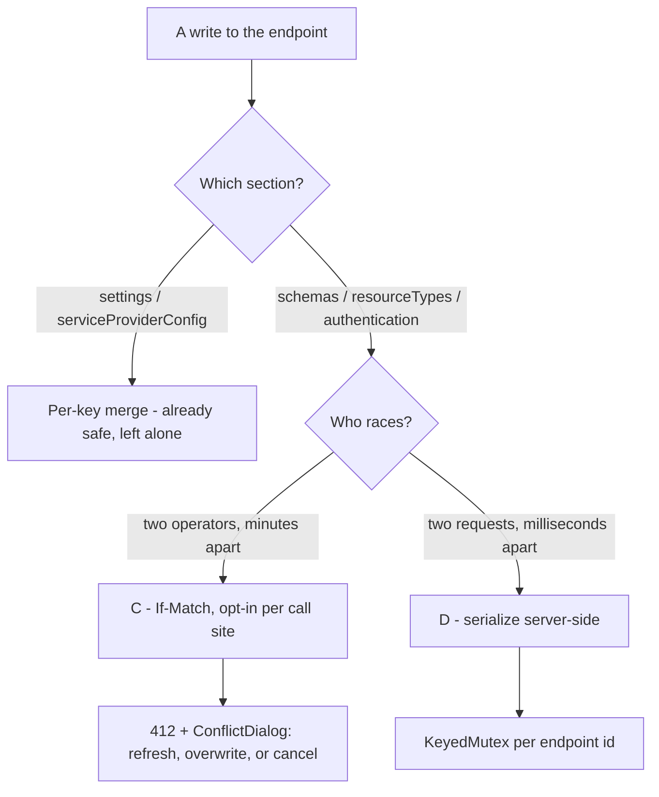

# Endpoint write concurrency (B / C / D)

**Last verified:** 2026-08-19
**Applies to:** v0.55.12+

## Why this exists

Endpoint configuration is edited rarely, usually by one person. That makes a lost update **unlikely** - but it does not make it harmless, because the failure was **silent**: two operators editing resource types both saw `200 OK`, and one of them simply no longer had the type they created. Nothing in the response, the logs, or the UI said so.

The work was scoped by first measuring **which writes can actually lose data**, which turned out to be far fewer than "profile writes".

## What can and cannot lose data

`mergeProfilePartial` ([endpoint.service.ts](../api/src/modules/endpoint/services/endpoint.service.ts)) does not treat all sections alike:

| Section | Merge semantics | Lost update possible? |
|---|---|---|
| `settings` | per-key merge | **No** |
| `serviceProviderConfig` | per-key merge | **No** |
| `schemas` | replaced wholesale | Yes |
| `resourceTypes` | replaced wholesale | Yes |
| `authentication` | replaced wholesale | Yes |

This is the central fact. Two admins toggling two different config flags **already** both succeed, because the server merges per key. A blanket precondition on the endpoint would have added a `412` to the frequent, already-correct path in order to protect a rare one - so it was deliberately **not** added there.

Only two places do read-modify-write of a wholesale-replaced section:

1. **[ResourceTypesTab](../web/src/pages/ResourceTypesTab.tsx)** merges the whole `resourceTypes[]` + `schemas[]` arrays **client-side**, from the profile read when the page loaded, then sends both. Operator-vs-operator, minutes apart.
2. **[admin-authentication-method.controller.ts](../api/src/modules/scim/controllers/admin-authentication-method.controller.ts)** loads the whole `authentication` block, edits it, and writes it back. Request-vs-request, milliseconds apart.

These need **different** fixes, which is why this is three changes and not one.



## B - the server publishes a version

`GET /admin/endpoints/:id` returns a weak ETag:

```http
GET /scim/admin/endpoints/ep-1 HTTP/1.1
Authorization: Bearer <token>

HTTP/1.1 200 OK
ETag: W/"e9adceb0cbc7d89b3ac549485c210902"
Content-Type: application/json
```

The value is a SHA-256 content hash of `{displayName, description, active, profile}` ([endpoint-etag.ts](../api/src/modules/endpoint/controllers/endpoint-etag.ts)).

Three choices worth stating:

- **`id` and `name` are excluded.** `name` is immutable after create and `id` identifies the row, so neither can participate in a lost update. Including them would only manufacture spurious conflicts.
- **A content hash, not a row version.** No migration, and it works identically on the Prisma and in-memory backends.
- **A content hash, not a timestamp.** Timestamps collide within a millisecond. It also gives a useful property for free: re-submitting **identical** content matches rather than conflicts, so an idempotent retry is not punished.

B alone changes no behaviour. It is safe to adopt on its own.

## C - `If-Match`, opt-in

A caller may state which version it edited. The server refuses a stale write:

```http
PATCH /scim/admin/endpoints/ep-1 HTTP/1.1
If-Match: W/"e9adceb0cbc7d89b3ac549485c210902"
Content-Type: application/json

{
  "profile": {
    "resourceTypes": [ ... ]
  }
}

HTTP/1.1 412 Precondition Failed
Content-Type: application/json

{
  "schemas": [
    "urn:ietf:params:scim:api:messages:2.0:Error"
  ],
  "status": "412",
  "scimType": "versionMismatch",
  "detail": "The endpoint was modified by someone else. You edited W/\"e9adce...\" but the current version is W/\"7b1f42...\".",
  "currentETag": "W/\"7b1f42...\""
}
```

Rules:

- **No `If-Match` means no opinion**, and the write proceeds exactly as before. Every existing caller is unaffected.
- **`If-Match: *` matches any state**, which is what the UI's force-overwrite uses.
- **The refusal names both versions**, so the caller can tell what it was working from and what it collided with.

In the UI, only the resource-types tab opts in, via `useUpdateEndpointConfig(id, { concurrencyChecked: true })`. Settings writes deliberately do not. Conflicts reuse the existing Phase K5 [ConflictDialog](../web/src/components/primitives/ConflictDialog.tsx) rather than a new surface, so the operator gets the established three-way recovery: refresh-and-reapply, force-overwrite, or cancel. Force-overwrite is implemented by forgetting the remembered version, so the retry simply carries no `If-Match`.

## D - a race no caller could have resolved

`POST` and `DELETE` on `/admin/endpoints/:id/authentication/methods` loaded the whole `authentication` block, edited it, and wrote it back. Three simultaneous adds all returned `201` and **one** method survived.

`If-Match` is the wrong instrument here. The race is between two requests milliseconds apart, not two operators, and no client could resolve a conflict it never saw. The fix is to serialize the read-modify-write per endpoint with [KeyedMutex](../api/src/common/keyed-mutex.ts).

Its limit is stated in the source rather than assumed: an in-process lock is a **complete** fix only while one process serves a given endpoint. Both dev and prod run `minReplicas = maxReplicas = 1`, so it closes the whole window today. Raising the replica count reopens it and would need a conditional write in the database instead.

## Test coverage

| Level | Location | What it locks |
|---|---|---|
| Unit | [endpoint-etag.spec.ts](../api/src/modules/endpoint/controllers/endpoint-etag.spec.ts) | ETag format, stability, what does and does not change it, the four `If-Match` outcomes |
| Unit | [keyed-mutex.spec.ts](../api/src/common/keyed-mutex.spec.ts) | Same-key serialization, different-key concurrency, release on rejection, no key leak |
| E2E | [endpoint-concurrency.e2e-spec.ts](../api/test/e2e/endpoint-concurrency.e2e-spec.ts) | The lost-update scenario end to end, and that three simultaneous auth-method adds all survive |
| Live | `scripts/live-test.ps1` section `9z-CI` | The same behaviour on a running server, including a genuinely parallel add via `ForEach-Object -Parallel` |
| Browser | [endpoint-write-conflict.spec.ts](../web/e2e/endpoint-write-conflict.spec.ts) | An operator saving over a competing edit sees the conflict dialog, and force-overwrite preserves their work |
| Component | [ResourceTypesTab.test.tsx](../web/src/pages/ResourceTypesTab.test.tsx) | 412 opens the dialog, force-overwrite retries the same payload, cancel writes nothing, non-412 uses the generic error |

**Each concurrency test was proven able to fail before it was trusted.** The unit test was run against an unlocked copy of the same body (2 of 3 writes were lost); `D-E1` was re-run with the lock neutralized and failed. A concurrency test that passes with and without the fix is worse than no test, because it reports safety it never checked.

Two assertions carry more weight than the status codes:

- After a `412`, the E2E and live tests **re-read the endpoint** and prove the data was not modified. A server that returned `412` *and* applied the write would be worse than no check at all, and asserting only the status would not notice.
- After force-overwrite, the browser test reads the endpoint back and proves the operator's resource type actually exists. A conflict flow that loses their work politely is still losing their work.

## Execution issues and RCA

Captured as each fix was confirmed, per the standing ledger rule.

| # | Type | Sev | Symptom | Root cause | Fix and why it works | Prevention |
|---|---|---|---|---|---|---|
| I-42 | Verification method | **High** | A search reported "the UI never replaces a wholesale section", which would have meant this feature protected nothing and should be dropped. | The regex was single-line; `ResourceTypesTab` sends `profile: { resourceTypes: ..., schemas: ... }` across several lines. A **false negative** on the one file that justifies the work. | Re-ran with a multi-line, whole-file match, which found it. The conclusion reversed. | An absence result is only as trustworthy as the pattern that produced it. Before concluding "there are none", verify the pattern finds a **known** instance. Same class as the earlier false perf probes. |
| I-43 | Test correctness | **High** | The `KeyedMutex` tests passed on the first run. | Nothing yet showed they could fail; a concurrency test that passes with and without the lock is worse than no test. | Ran the identical body without the lock: 2 of 3 writes were lost. Then re-ran `D-E1` with the lock neutralized: it failed. | Every concurrency or race test needs an explicit negative control before it is trusted. Recurrence of the I-40 lesson. |
| I-44 | Scope discipline | Med | The original A9 plan was a blanket `If-Match` on all profile writes. | The plan was written without measuring merge semantics. `settings` merges per key and was never at risk. | Re-scoped to the two sites that can actually lose data. The frequent path was left alone. | Before adding a guard, measure which inputs the defect can reach. A guard on a correct path is pure friction. |
| I-45 | Framework surprise | Low | `error TS2322: Type 'string \| undefined' is not assignable` after moving code into a closure. | TypeScript's narrowing from the validation guard does not survive into a callback, because `dto.type` is a mutable property. | Captured the validated value in a `const` before the closure. | Expect narrowing loss whenever a guarded value crosses into a callback. |
| I-46 | Test assumption | Low | `conflict-force-overwrite` was not found even though the dialog rendered. | `ConflictDialog` hides force-overwrite when it has no version to overwrite, which is correct. The test never seeded one. | Seeded the version store, which is what a real page load does. | A component test that skips a real precondition tests a state the app never reaches. |
| I-47 | Tooling friction | Low | Playwright failed with `net::ERR_UNSAFE_PORT` before reaching any assertion. | Chromium blocks port 6000 (X11). The repo's usual local live-test port cannot be a browser target. | Ran the server on 4000 for browser runs. | Recorded in this doc and the CHANGELOG so the next browser run does not rediscover it. |
| I-48 | Tooling friction | Low | `Invoke-WebRequest -UseBasicParsing` threw in the live script. | The parameter is not supported in the PowerShell 7 the runner uses. | Removed it; the default behaviour is what was wanted. | Live sections are smoke-run in the step they are authored, which is what surfaced this immediately. |
| I-49 | Process | Low | Lint rose from 510 to 514 warnings. | Four unnecessary type assertions in my own new spec. | Removed them; back to exactly 510. | Recurrence (third time this session). The ratchet is a ceiling to fix under, never to raise. |

**Detection-stage escape analysis.** I-42 was caught only by manual re-verification, and no gate exists that could have caught it - a wrong *absence* conclusion produces no failing test, it produces an abandoned feature. That is the highest-value residual risk here. I-43 was caught by deliberately applying the negative-control rule; without it the suite would have been green and blind. Everything else was caught by the earliest gate that could have caught it.

## Known gaps

- The `authentication` block is still replaced wholesale by the admin API, so the same read-modify-write shape exists for any future caller that edits it outside the serialized controller.
- `LogsTab`, `WorkbenchPage` and `DiscoveryExplorerPage` are unrelated to this change but remain on `table-layout: auto` (see the R5.3 note in the repo instructions).
- The in-process lock does not survive a move to more than one replica. That is a deliberate, documented boundary rather than an oversight.

## Tooling note

Chromium refuses `http://localhost:6000` with `ERR_UNSAFE_PORT` - port 6000 is X11 and is on the blocked list. The repo's usual local live-test port therefore cannot be used as a Playwright target; browser runs use port 4000.
