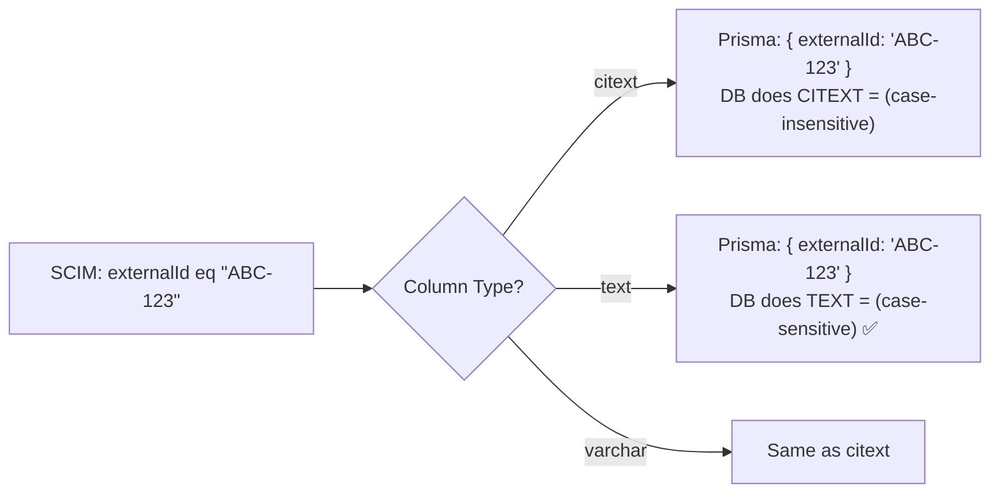
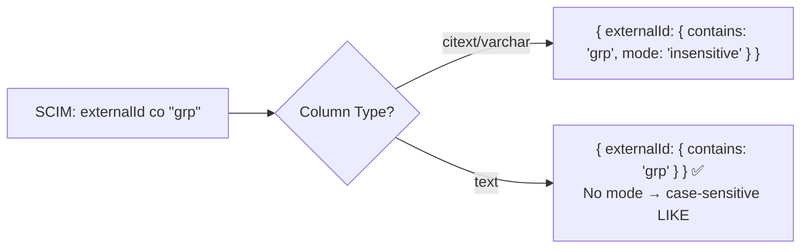
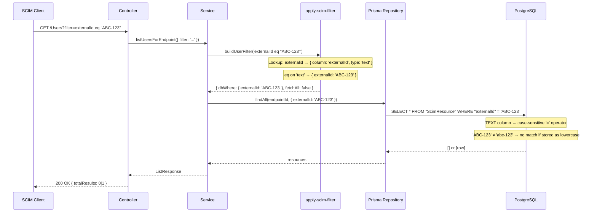

# externalId CITEXT → TEXT — RFC 7643 `caseExact` Compliance Fix

> **Date:** February 25, 2026  
> **Version:** v0.17.2  
> **Migration:** `20260225181836_externalid_citext_to_text`  
> **Impact:** Schema, filter engine, test suite, live test script  
> **RFC References:** RFC 7643 §2.2, §2.4, §3.1, §4.1, §4.2; RFC 7644 §3.4.2.2

---

## Table of Contents

1. [Executive Summary](#1-executive-summary)
2. [Root Cause Analysis](#2-root-cause-analysis)
3. [Affected Components](#3-affected-components)
4. [Technical Deep Dive](#4-technical-deep-dive)
5. [Migration & Deployment](#5-migration--deployment)
6. [Test Coverage](#6-test-coverage)
7. [Edge Cases & Risks](#7-edge-cases--risks)

---

## 1. Executive Summary

The `externalId` column in the `ScimResource` table used PostgreSQL's `CITEXT` (case-insensitive text) type, causing both equality comparisons and uniqueness constraints to be case-insensitive. This violated RFC 7643 §3.1, which defines `externalId` with `caseExact: true` — meaning filter comparisons, value storage, and uniqueness checks must all be case-sensitive. A client storing `externalId = "ABC-123"` and another storing `externalId = "abc-123"` on the same endpoint were incorrectly blocked with 409 Conflict, and filtering for one case would incorrectly return the other. The fix changes the column from `CITEXT` to `TEXT`, updates the filter engine to omit `mode: 'insensitive'` for case-exact attributes, and aligns all test expectations with RFC-correct behavior. After the fix: 2,096 unit tests, 368 E2E tests, and 334/334 Docker live tests all pass with zero failures.

---

## 2. Root Cause Analysis

### 2.1 The Specification

**RFC 7643 §3.1 — Common Attributes:**

> ```
> externalId
>   A String that is an identifier for the resource as defined by the
>   provisioning client. [...] Each resource MAY include a non-empty
>   "externalId" value. The value of the "externalId" attribute is
>   always issued by the provisioning client and MUST NOT be specified
>   by the service provider.
> ```

**RFC 7643 §2.2 — Attribute Characteristics:**

| Characteristic | Value |
|---|---|
| `type` | `string` |
| `caseExact` | **`true`** |
| `mutability` | `readWrite` |
| `returned` | `default` |
| `uniqueness` | `none` |

**RFC 7643 §2.4 — caseExact semantics:**

> *"For attributes with type 'string', the 'caseExact' characteristic determines how string value comparisons are handled."*

**RFC 7644 §3.4.2.2 — Filtering:**

> *"...case sensitivity for String type attributes SHALL be determined by the attribute's caseExact characteristic."*

### 2.2 The Bug

The Prisma schema used `@db.Citext` for the `externalId` column:

```prisma
// BEFORE (incorrect)
externalId  String?  @db.Citext  // CITEXT — case-insensitive per SCIM RFC §3.1
```

PostgreSQL `CITEXT` makes **all** operations on the column case-insensitive — `=`, `LIKE`, `ILIKE`, unique indexes, `ORDER BY`. This means the database-level unique constraint `@@unique([endpointId, resourceType, externalId])` also becomes case-insensitive, incorrectly rejecting case-variant values.

### 2.3 The Symptom

The Microsoft SCIM Validator live test `"Case-variant group externalId should be allowed (caseExact=true)"` **failed**:

```
Test 978: FAIL — Case-variant group externalId should be allowed (caseExact=true)
  Expected: 201 Created
  Actual:   409 Conflict
```

Additionally, filtering for `externalId eq "ABC-DEF-1234"` would match a resource stored with `externalId = "abc-def-1234"`, which violates `caseExact: true`.

### 2.4 Before / After Comparison

| Behavior | Before (CITEXT) | After (TEXT) | RFC Requirement |
|---|---|---|---|
| `externalId eq "ABC"` matches `abc` | ✅ Matches (wrong) | ❌ No match (correct) | §3.4.2.2: caseExact=true → sensitive |
| `externalId co "ABC"` matches `abc-def` | ✅ Matches (wrong) | ❌ No match (correct) | §3.4.2.2: caseExact=true → sensitive |
| `externalId sw "ABC"` matches `abc-def` | ✅ Matches (wrong) | ❌ No match (correct) | §3.4.2.2: caseExact=true → sensitive |
| POST `externalId="ABC"` then POST `externalId="abc"` | 409 Conflict (wrong) | 201 Created (correct) | §3.1: uniqueness="none" + caseExact=true |
| POST `externalId="ABC"` then POST `externalId="ABC"` | 409 Conflict | 409 Conflict | Server-enforced uniqueness (same value) |
| `userName eq "ALICE"` matches `alice` | ✅ Matches (correct) | ✅ Matches (correct) | §4.1: userName caseExact=false |

### 2.5 caseExact Matrix — All Core Attributes

```
┌────────────────────┬───────────┬─────────────────┬────────────────────┐
│ Attribute          │ caseExact │ Column Type      │ Filter Behavior    │
├────────────────────┼───────────┼─────────────────┼────────────────────┤
│ userName           │ false     │ CITEXT           │ Case-insensitive   │
│ displayName        │ false     │ CITEXT           │ Case-insensitive   │
│ externalId         │ TRUE ⚠️   │ TEXT (was CITEXT)│ Case-SENSITIVE     │
│ id (scimId)        │ TRUE      │ UUID             │ Case-sensitive     │
│ active             │ N/A       │ BOOLEAN          │ Exact match        │
└────────────────────┴───────────┴─────────────────┴────────────────────┘
```

---

## 3. Affected Components

### 3.1 By Layer

| Layer | File | Change Summary |
|---|---|---|
| **Schema** | `api/prisma/schema.prisma` | `@db.Citext` → `@db.Text` + comment fix |
| **Migration** | `api/prisma/migrations/20260225181836_*/migration.sql` | `ALTER COLUMN "externalId" SET DATA TYPE TEXT` |
| **Filter Engine** | `api/src/modules/scim/filters/apply-scim-filter.ts` | Added `'text'` column type; externalId → `type: 'text'`; `co/sw/ew` omit `mode: 'insensitive'` for `text` |
| **Unit Tests** | `api/src/modules/scim/filters/apply-scim-filter.spec.ts` | 4 externalId co/sw expectations updated, section comments updated |
| **Unit Tests** | `api/src/modules/scim/services/endpoint-scim-groups.service.spec.ts` | externalId filter test → case-sensitive |
| **E2E Tests** | `api/test/e2e/scim-validator-compliance.e2e-spec.ts` | 3 filter tests + 2 uniqueness tests updated |
| **Live Tests** | `scripts/live-test.ps1` | Group + User externalId filter expectations → case-sensitive |

### 3.2 Files NOT Changed (Correctness Verified)

| File | Why No Change Needed |
|---|---|
| `scim-schemas.constants.ts` | Already declares `caseExact: true` for externalId on both User and Group |
| `prisma-filter-evaluator.ts` | In-memory evaluator — `matchEquality` does exact `===`, in-memory filter path not affected by this DB-layer change |
| `prisma-filter-evaluator.spec.ts` | Tests cover in-memory path; no CITEXT interaction |
| `endpoint-scim-users.service.ts` | Service passes filter to repository; no externalId-specific logic |

---

## 4. Technical Deep Dive

### 4.1 Database Schema Diff

```sql
-- BEFORE
CREATE TABLE "ScimResource" (
    ...
    "externalId" CITEXT,
    ...
    CONSTRAINT "ScimResource_endpointId_resourceType_externalId_key"
        UNIQUE ("endpointId", "resourceType", "externalId")  -- CITEXT = case-insensitive unique
);

-- AFTER (migration 20260225181836)
ALTER TABLE "ScimResource" ALTER COLUMN "externalId" SET DATA TYPE TEXT;
-- The unique constraint now uses TEXT = case-SENSITIVE unique
```

**Prisma schema change:**

```prisma
// BEFORE
externalId  String?  @db.Citext  // CITEXT — case-insensitive per SCIM RFC §3.1

// AFTER
externalId  String?  @db.Text    // TEXT — case-sensitive per RFC 7643 §3.1 (caseExact=true)
```

### 4.2 Filter Engine Type System

The filter engine maps SCIM attribute names to Prisma column names with type annotations that control operator behavior:

```typescript
// BEFORE: ColumnType = 'citext' | 'varchar' | 'boolean' | 'uuid'
// AFTER:  ColumnType = 'citext' | 'text' | 'varchar' | 'boolean' | 'uuid'

// BEFORE
externalid:  { column: 'externalId',  type: 'varchar' },

// AFTER
externalid:  { column: 'externalId',  type: 'text' },  // caseExact=true per RFC 7643
```

### 4.3 Filter Translation — Before vs After

#### `eq` operator (equality)



For `eq`, the Prisma filter is identical (`{ column: value }`) because:
- **CITEXT columns**: PostgreSQL handles case-insensitivity at the database level
- **TEXT columns**: PostgreSQL does case-sensitive `=` comparison

The column type change itself fixes the `eq` behavior without filter code changes.

#### `co` / `sw` / `ew` operators (contains / startsWith / endsWith)



**Before** (type was `varchar` — treated same as `citext`):
```json
{ "externalId": { "contains": "grp", "mode": "insensitive" } }
```
→ Generates: `WHERE "externalId" ILIKE '%grp%'`

**After** (type is `text`):
```json
{ "externalId": { "contains": "grp" } }
```
→ Generates: `WHERE "externalId" LIKE '%grp%'` (case-sensitive)

### 4.4 Filter Engine Code — Key Implementation

```typescript
function buildColumnFilter(
  column: string,
  type: ColumnType,
  op: string,
  value: unknown,
): Record<string, unknown> | null {
  const isStringType = type === 'citext' || type === 'varchar' || type === 'text';
  const isCaseInsensitive = type === 'citext' || type === 'varchar';

  switch (op) {
    case 'eq':
      return { [column]: value };  // DB column type handles case sensitivity

    case 'co':
      if (!isStringType) return null;
      return isCaseInsensitive
        ? { [column]: { contains: String(value), mode: 'insensitive' } }
        : { [column]: { contains: String(value) } };  // text → case-sensitive

    case 'sw':
      if (!isStringType) return null;
      return isCaseInsensitive
        ? { [column]: { startsWith: String(value), mode: 'insensitive' } }
        : { [column]: { startsWith: String(value) } };

    case 'ew':
      if (!isStringType) return null;
      return isCaseInsensitive
        ? { [column]: { endsWith: String(value), mode: 'insensitive' } }
        : { [column]: { endsWith: String(value) } };
    // ...
  }
}
```

### 4.5 Data Flow — Filter Request Through Stack



### 4.6 JSON Request / Response Examples

#### Case-variant externalId creation (now allowed)

**Request 1 — Create group with lowercase externalId:**

```http
POST /scim/endpoint/{id}/Groups HTTP/1.1
Authorization: Bearer <token>
Content-Type: application/scim+json

{
  "schemas": ["urn:ietf:params:scim:schemas:core:2.0:Group"],
  "displayName": "Engineering",
  "externalId": "ext-eng-001"
}
```

```http
HTTP/1.1 201 Created
Location: /scim/endpoint/{id}/Groups/{uuid}

{
  "schemas": ["urn:ietf:params:scim:schemas:core:2.0:Group"],
  "id": "a1b2c3d4-...",
  "displayName": "Engineering",
  "externalId": "ext-eng-001",
  "meta": { "resourceType": "Group", "version": "W/\"v1\"", ... }
}
```

**Request 2 — Create different group with UPPERCASE externalId:**

```http
POST /scim/endpoint/{id}/Groups HTTP/1.1
Authorization: Bearer <token>
Content-Type: application/scim+json

{
  "schemas": ["urn:ietf:params:scim:schemas:core:2.0:Group"],
  "displayName": "Engineering Leads",
  "externalId": "EXT-ENG-001"
}
```

**Before (CITEXT):**
```http
HTTP/1.1 409 Conflict

{
  "schemas": ["urn:ietf:params:scim:api:messages:2.0:Error"],
  "detail": "Group with externalId 'EXT-ENG-001' already exists for this endpoint",
  "status": "409",
  "scimType": "uniqueness"
}
```

**After (TEXT) — Correct per RFC:**
```http
HTTP/1.1 201 Created

{
  "schemas": ["urn:ietf:params:scim:schemas:core:2.0:Group"],
  "id": "e5f6g7h8-...",
  "displayName": "Engineering Leads",
  "externalId": "EXT-ENG-001",
  "meta": { "resourceType": "Group", "version": "W/\"v1\"", ... }
}
```

#### Case-sensitive filter (no cross-case match)

```http
GET /scim/endpoint/{id}/Groups?filter=externalId eq "EXT-ENG-001" HTTP/1.1
Authorization: Bearer <token>
```

**Before (CITEXT) — returned BOTH groups:**
```json
{
  "schemas": ["urn:ietf:params:scim:api:messages:2.0:ListResponse"],
  "totalResults": 2,
  "Resources": [
    { "externalId": "ext-eng-001", ... },
    { "externalId": "EXT-ENG-001", ... }
  ]
}
```

**After (TEXT) — returns only exact match:**
```json
{
  "schemas": ["urn:ietf:params:scim:api:messages:2.0:ListResponse"],
  "totalResults": 1,
  "Resources": [
    { "externalId": "EXT-ENG-001", ... }
  ]
}
```

#### Contrast: userName (caseExact=false) remains case-insensitive

```http
GET /scim/endpoint/{id}/Users?filter=userName eq "ALICE@EXAMPLE.COM" HTTP/1.1
```

Still returns users with `userName = "alice@example.com"` — correct because `userName` has `caseExact: false` and the column remains `CITEXT`.

### 4.7 Column Type Mapping — Complete Reference

| SCIM Attribute | `caseExact` | Prisma Type | PostgreSQL Type | Filter `eq` | Filter `co`/`sw`/`ew` |
|---|---|---|---|---|---|
| `userName` | `false` | `@db.Citext` | `CITEXT` | DB case-insensitive | `mode: 'insensitive'` (ILIKE) |
| `displayName` | `false` | `@db.Citext` | `CITEXT` | DB case-insensitive | `mode: 'insensitive'` (ILIKE) |
| `externalId` | **`true`** | **`@db.Text`** | **`TEXT`** | DB case-sensitive | **No mode** (LIKE) |
| `id` (scimId) | `true` | `@db.Uuid` | `UUID` | Exact UUID match | N/A |
| `active` | N/A | `Boolean` | `BOOLEAN` | Exact boolean match | N/A |

---

## 5. Migration & Deployment

### 5.1 Migration SQL

```sql
-- Migration: 20260225181836_externalid_citext_to_text
-- AlterTable
ALTER TABLE "ScimResource" ALTER COLUMN "externalId" SET DATA TYPE TEXT;
```

This statement:
- Changes the column type from `CITEXT` to `TEXT` 
- The existing unique index `ScimResource_endpointId_resourceType_externalId_key` is automatically updated
- No data loss — existing values are preserved exactly as stored
- The index now performs case-sensitive comparisons

### 5.2 Deployment Steps

1. **Stop the API** (or put behind maintenance mode)
2. **Run Prisma migrate**: `npx prisma migrate deploy`
3. **Start the API** with updated code

### 5.3 Rollback Strategy

```sql
-- Rollback (if needed)
ALTER TABLE "ScimResource" ALTER COLUMN "externalId" SET DATA TYPE CITEXT;
```

**Warning:** Rolling back after case-variant duplicates have been created will cause a unique constraint violation. Check for duplicates first:

```sql
SELECT "endpointId", "resourceType", LOWER("externalId"), COUNT(*)
FROM "ScimResource"
WHERE "externalId" IS NOT NULL
GROUP BY "endpointId", "resourceType", LOWER("externalId")
HAVING COUNT(*) > 1;
```

### 5.4 Docker Deployment

```bash
# Rebuild and restart with the new schema
docker compose down -v
docker compose up --build -d

# Verify column type
docker exec scimserver-postgres psql -U scim -d scimdb \
  -c "SELECT column_name, data_type FROM information_schema.columns 
      WHERE table_name='ScimResource' AND column_name='externalId';"

# Expected output:
#  column_name | data_type
# -------------+-----------
#  externalId  | text
```

---

## 6. Test Coverage

### 6.1 Summary

| Test Level | Total | Pass | Fail | Status |
|---|---|---|---|---|
| **Unit** | 2,096 | 2,096 | 0 | ✅ All pass |
| **E2E** | 368 | 368 | 0 | ✅ All pass |
| **Docker Live** | 334 | 334 | 0 | ✅ All pass (was 333/334) |
| **TOTAL** | **2,798** | **2,798** | **0** | **100%** |

### 6.2 Key Test Cases Validating the Fix

| Test Suite | Test Name | What It Validates |
|---|---|---|
| `apply-scim-filter.spec` | `co` filter on externalId (case-sensitive) | No `mode: 'insensitive'` in Prisma WHERE for `text` type |
| `apply-scim-filter.spec` | `sw` filter on externalId (case-sensitive) | Same as above for `startsWith` |
| `scim-validator-compliance.e2e` | Filter group with externalId exact case | Exact-case filter returns 1 result |
| `scim-validator-compliance.e2e` | NOT match group externalId different case | Different-case filter returns 0 results |
| `scim-validator-compliance.e2e` | NOT match user externalId different case | Same for Users |
| `scim-validator-compliance.e2e` | Allow User with same externalId different case | 201 (not 409) for case-variant externalId |
| `scim-validator-compliance.e2e` | Allow Group with same externalId different case | 201 (not 409) for case-variant externalId |
| `groups.service.spec` | Filter groups by externalId case-sensitively | Service layer correct with TEXT column |
| `live-test.ps1` | Case-variant group externalId allowed | **The previously-failing test — now passes** |
| `live-test.ps1` | UPPERCASE externalId does NOT match | TEXT case-sensitive verification |
| `live-test.ps1` | MixedCase externalId does NOT match | TEXT case-sensitive verification |
| `live-test.ps1` | User externalId case-sensitive filter | Exact + different case assertions |

### 6.3 Tests Updated (Expectation Changes)

| File | Tests Changed | Old Expectation | New Expectation | Reason |
|---|---|---|---|---|
| `apply-scim-filter.spec.ts` | 4 (externalId co/sw — Group + User) | `{ contains: 'val', mode: 'insensitive' }` | `{ contains: 'val' }` | TEXT = no `mode` |
| `scim-validator-compliance.e2e-spec.ts` | 2 (Group/User externalId filter ≠ case) | `totalResults: 1` | `totalResults: 0` | Case-sensitive → no match |
| `scim-validator-compliance.e2e-spec.ts` | 2 (Group/User externalId uniqueness) | `expect(409)` | `expect(201)` | Case-variant = different value |
| `scim-validator-compliance.e2e-spec.ts` | 1 (Group externalId exact match) | Filter different case, expect 1 | Filter same case, expect 1 | Positive test for exact match |
| `endpoint-scim-groups.service.spec.ts` | 1 (filter by externalId) | Case-insensitive test setup | Case-sensitive test setup | Align with TEXT behavior |
| `live-test.ps1` | 4 (Group UPPERCASE/Mixed, User exact/UPPER) | Expect match for different cases | Expect 0 for different cases | TEXT = case-sensitive |

---

## 7. Edge Cases & Risks

### 7.1 Edge Cases Considered

| Edge Case | Handling |
|---|---|
| Existing data with case variants in same endpoint | No existing production data has this (CITEXT prevented it). Migration is safe. |
| `externalId` is `NULL` | TEXT handles NULL same as CITEXT. No change. |
| Attribute name casing (`EXTERNALID eq ...`) | Attribute names are always lowercased in the filter parser. Unaffected. |
| `userName` / `displayName` remain CITEXT | Correct — both have `caseExact: false`. No change needed. |
| In-memory persistence backend | `matchEquality` in `prisma-filter-evaluator.ts` already does exact `===` comparison (strings are case-sensitive by default in JS). No change needed. |
| `ne` / `pr` operators on externalId | `ne` uses `{ not: value }` — TEXT handles this correctly. `pr` checks `NOT NULL`. Both unaffected. |
| `gt` / `lt` / `ge` / `le` on externalId | These are string comparison operators. TEXT does lexicographic case-sensitive comparison. Correct per RFC. |

### 7.2 Risks & Trade-offs

| Risk | Severity | Mitigation |
|---|---|---|
| **Rollback after case-variant duplicates** | MEDIUM | Run duplicate check query before rollback (see §5.3) |
| **Microsoft Entra ID sends same externalId in different case** | LOW | Entra consistently sends the same case for the same user. No known case variance. |
| **Existing deployments with CITEXT data** | LOW | Migration preserves data. No case-variant duplicates exist (CITEXT prevented them). |
| **Performance: TEXT vs CITEXT index** | NEGLIGIBLE | Both use btree indexes. TEXT is actually slightly faster (no ICU collation overhead). |

### 7.3 Backward Compatibility

- **Breaking change for clients that relied on case-insensitive externalId matching**: Any client that stored `"ABC"` but filtered with `"abc"` will now get 0 results. This is the **correct** behavior per RFC 7643.
- **Non-breaking for `userName` and `displayName`**: These remain CITEXT (case-insensitive) per RFC.
- **Non-breaking for Entra ID**: Microsoft Entra ID uses consistent casing for externalId. No Entra flows depend on case-insensitive externalId matching.

---

## References

- [RFC 7643 — SCIM Core Schema](https://tools.ietf.org/html/rfc7643) — §2.2 (caseExact), §2.4 (characteristics), §3.1 (externalId), §4.1 (User), §4.2 (Group)
- [RFC 7644 — SCIM Protocol](https://tools.ietf.org/html/rfc7644) — §3.4.2.2 (filtering, caseExact SHALL determine sensitivity)
- [PostgreSQL CITEXT docs](https://www.postgresql.org/docs/current/citext.html) — Case-insensitive text type
- [Prisma column types](https://www.prisma.io/docs/concepts/components/prisma-schema/data-model) — `@db.Citext` vs `@db.Text`

---

*Generated: 2026-02-25 | SCIMServer v0.17.2*
