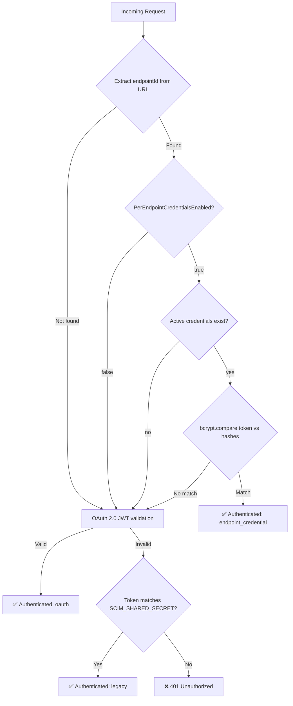
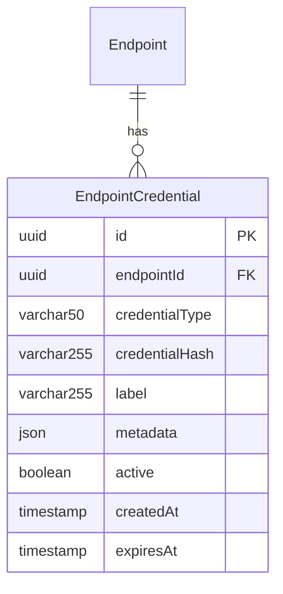

# G11: Per-Endpoint Credentials (Phase 11)

## Overview

Phase 11 implements per-endpoint credential management, enabling each SCIM endpoint to have its own isolated bearer tokens for authentication. This addresses RFC 7644 §2 (authentication) and RFC 7643 §7 (security considerations) requirements for multi-tenant authentication isolation.

## Architecture

### Auth Fallback Chain



### Data Model



### Key Design Decisions

| Decision | Rationale |
|----------|-----------|
| **bcrypt hashing** | Industry standard for credential storage; resistant to rainbow table attacks |
| **12 salt rounds** | Balance between security and performance (~250ms per hash) |
| **Plaintext returned once** | Token shown only at creation time; only hash is stored |
| **Per-endpoint config flag** | Opt-in per endpoint; disabled by default for backward compatibility |
| **Graceful fallback** | Per-endpoint check failure falls through to OAuth/legacy; never blocks valid auth |
| **Lazy bcrypt loading** | Dynamic import of native module avoids startup overhead for endpoints not using this feature |
| **Cascade delete** | Credentials are deleted when endpoint is deleted |

## Config Flag

| Flag | Values | Default | Description |
|------|--------|---------|-------------|
| `PerEndpointCredentialsEnabled` | `True` / `False` | `False` | Enables per-endpoint credential management and auth for this endpoint |

## Admin API

### Create Credential

```http
POST /admin/endpoints/{endpointId}/credentials
Authorization: Bearer {admin-token}
Content-Type: application/json

{
  "credentialType": "bearer",   // "bearer" (default) | "oauth_client"
  "label": "My API Key",        // Optional human-readable label
  "expiresAt": "2026-12-31T23:59:59Z"  // Optional ISO 8601 expiry
}
```

**Response (201):**
```json
{
  "id": "a1b2c3d4-...",
  "endpointId": "e5f6g7h8-...",
  "credentialType": "bearer",
  "label": "My API Key",
  "active": true,
  "createdAt": "2026-02-27T01:00:00Z",
  "expiresAt": "2026-12-31T23:59:59Z",
  "token": "Kx7mN2pQ..."  // ⚠️ Shown ONCE only
}
```

### List Credentials

```http
GET /admin/endpoints/{endpointId}/credentials
Authorization: Bearer {admin-token}
```

**Response (200):** Array of credentials (hash never returned).

### Revoke Credential

```http
DELETE /admin/endpoints/{endpointId}/credentials/{credentialId}
Authorization: Bearer {admin-token}
```

**Response:** `204 No Content`

## Authentication Flow

1. Client sends `Authorization: Bearer {per-endpoint-token}` to any SCIM endpoint URL (e.g., `/scim/endpoints/{id}/Users`)
2. Guard extracts `endpointId` from URL via regex
3. Guard checks if `PerEndpointCredentialsEnabled` is true for the endpoint
4. Guard loads active, non-expired credentials from the database
5. Guard bcrypt-compares the token against each stored hash
6. On match: request is authenticated as `authType: 'endpoint_credential'`
7. On mismatch or any error: falls through to OAuth/legacy auth

## Implementation Details

### Files Created

| File | Purpose |
|------|---------|
| `api/src/domain/models/endpoint-credential.model.ts` | Domain model interfaces |
| `api/src/domain/repositories/endpoint-credential.repository.interface.ts` | Repository interface |
| `api/src/infrastructure/repositories/prisma/prisma-endpoint-credential.repository.ts` | Prisma implementation |
| `api/src/infrastructure/repositories/inmemory/inmemory-endpoint-credential.repository.ts` | InMemory implementation |
| `api/src/modules/scim/controllers/admin-credential.controller.ts` | Admin CRUD API |
| `api/test/e2e/per-endpoint-credentials.e2e-spec.ts` | E2E tests |

### Files Modified

| File | Changes |
|------|---------|
| `api/prisma/schema.prisma` | Added `EndpointCredential` model + relation |
| `api/src/modules/endpoint/endpoint-config.interface.ts` | Added `PerEndpointCredentialsEnabled` flag |
| `api/src/domain/repositories/repository.tokens.ts` | Added `ENDPOINT_CREDENTIAL_REPOSITORY` token |
| `api/src/infrastructure/repositories/repository.module.ts` | Registered credential repo |
| `api/src/modules/auth/shared-secret.guard.ts` | Per-endpoint check + fallback chain |
| `api/src/modules/auth/auth.module.ts` | Import `EndpointModule` + `RepositoryModule` |
| `api/src/modules/scim/scim.module.ts` | Added `AdminCredentialController` |

### Dependencies

- `bcrypt` (+ `@types/bcrypt`): Native bcrypt hashing for credential storage

## Security Considerations

- **Credential hashes only**: Plaintext tokens are never stored; only bcrypt hashes
- **One-time token display**: Tokens are returned exactly once at creation time
- **Hash never exposed**: List and revoke endpoints never return `credentialHash`
- **Expiry support**: Credentials can have optional expiration dates
- **Soft revocation**: Revoked credentials are deactivated (not deleted) for audit trail
- **Cascade delete**: All credentials are deleted when the parent endpoint is deleted
- **Fallback safety**: Per-endpoint check errors never block OAuth/legacy auth

## Test Coverage

| Test Type | Count | Status |
|-----------|-------|--------|
| Unit tests (guard) | 19 | ✅ All pass |
| Unit tests (admin controller) | 14 | ✅ All pass |
| E2E tests | 16 | ✅ All pass |
| Live tests (local) | 22 | ✅ All pass |
| Live tests (Docker) | 22 | ✅ All pass |

## RFC References

- **RFC 7644 §2**: Authentication and Authorization — per-endpoint credentials provide endpoint-scoped auth isolation
- **RFC 7643 §7**: Security Considerations — credential hashing, one-time display, expiry support
