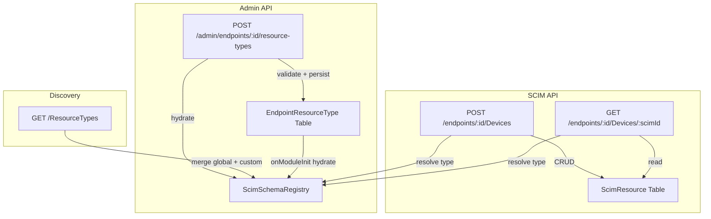
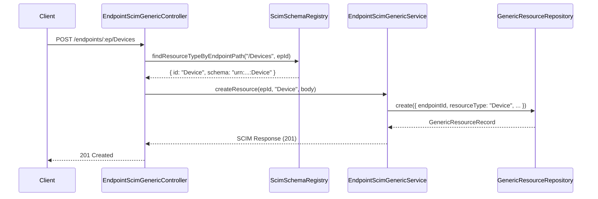

# G8b — Custom Resource Type Registration

> **Cross-reference**: For conceptual overview and operator guide, see [`SCHEMA_CUSTOMIZATION_GUIDE.md`](SCHEMA_CUSTOMIZATION_GUIDE.md) §Custom Resource Types. This document remains the canonical **implementation** reference (code-level files, test inventory).

> **⚠️ Partially Superseded (v0.28.0)**: The `EndpointResourceType` table, `IEndpointResourceTypeRepository` interface, and the `POST/GET/DELETE /admin/endpoints/:id/resource-types` admin routes described here were **removed** in Phase 13. Custom resource type data is now consolidated into `Endpoint.profile` JSONB. See [SCHEMA_TEMPLATES_DESIGN.md](SCHEMA_TEMPLATES_DESIGN.md).

> **Version**: v0.18.0 | **Phase**: 8 Part 2 | **Status**: ✅ Complete  
> **RFC References**: RFC 7643 §6, RFC 7644 §4  
> **Branch**: `feat/torfc1stscimsvr`

---

## Overview

G8b enables **data-driven custom resource type registration**, allowing operators to extend SCIM beyond the built-in `User` and `Group` resource types. Using an Admin API, arbitrary resource types (e.g., `Device`, `Application`, `Certificate`) can be registered per-endpoint, each with its own schema URI, SCIM endpoint path, and full CRUD lifecycle.

This feature is **gated behind the `CustomResourceTypesEnabled` per-endpoint configuration flag** (default: `false`), ensuring zero impact on existing deployments.

---

## Architecture



### Key Design Decisions

| Decision | Rationale |
|----------|-----------|
| **Per-endpoint flag gating** | Zero-risk opt-in; existing endpoints unaffected |
| **Polymorphic `ScimResource` table** | Reuses existing `resourceType` column as discriminator — no new tables for data |
| **Dedicated `EndpointResourceType` table** | Clean metadata model; cascade-deletes with endpoint |
| **SchemaRegistry overlay** | Runtime in-memory merge of global + per-endpoint types; DB-hydrated on startup |
| **Wildcard controller (LAST in module)** | `:resourceType` route catches custom paths; registered last to avoid shadowing `/Users`, `/Groups` |
| **GenericPatchEngine** | JSONB-based PATCH with URN-aware path resolution; no schema-specific coupling |

---

## Configuration

### Enabling Custom Resource Types

Set the `CustomResourceTypesEnabled` flag on the target endpoint:

```bash
# Create endpoint with flag enabled
curl -X POST http://localhost:6000/scim/admin/endpoints \
  -H "Authorization: Bearer <token>" \
  -H "Content-Type: application/json" \
  -d '{
    "name": "my-endpoint",
    "displayName": "My Endpoint",
    "config": { "CustomResourceTypesEnabled": "True" }
  }'

# Or update existing endpoint
curl -X PATCH http://localhost:6000/scim/admin/endpoints/<endpointId> \
  -H "Authorization: Bearer <token>" \
  -H "Content-Type: application/json" \
  -d '{ "config": { "CustomResourceTypesEnabled": "True" } }'
```

### Flag Behavior

| Flag Value | Behavior |
|-----------|----------|
| Not set / `"False"` | Admin API returns **403 Forbidden**; generic SCIM routes return **404** |
| `"True"` | Admin API and generic SCIM routes are fully operational |

---

## Admin API Reference

All routes require OAuth 2.0 authentication with `scim.manage` scope.

### Register Resource Type

```
POST /scim/admin/endpoints/:endpointId/resource-types
```

**Request Body:**

```json
{
  "name": "Device",
  "schemaUri": "urn:ietf:params:scim:schemas:custom:Device",
  "endpoint": "/Devices",
  "description": "Custom Device resource type",
  "schemaExtensions": [
    { "schema": "urn:example:ext:device:1.0", "required": false }
  ]
}
```

**Validation Rules:**

| Field | Rule |
|-------|------|
| `name` | Alphanumeric, starts with letter, regex `^[A-Za-z][A-Za-z0-9]*$` |
| `endpoint` | Must start with `/`, regex `^\/[A-Za-z][A-Za-z0-9]*$` |
| `name` | Not in reserved set: `User`, `Group` |
| `endpoint` | Not in reserved set: `/Users`, `/Groups`, `/Schemas`, `/ResourceTypes`, `/ServiceProviderConfig`, `/Bulk`, `/Me` |
| Uniqueness | No duplicate `name` per endpoint; no duplicate `endpoint` path per endpoint |

**Response:** `201 Created` with the registered resource type record.

**Error Codes:** `400` (validation), `403` (flag disabled), `404` (endpoint not found), `409` (duplicate)

### List Resource Types

```
GET /scim/admin/endpoints/:endpointId/resource-types
```

**Response:** `200 OK`

```json
{
  "totalResults": 2,
  "resourceTypes": [ ... ]
}
```

### Get Resource Type

```
GET /scim/admin/endpoints/:endpointId/resource-types/:name
```

**Response:** `200 OK` with the resource type record, or `404`.

### Delete Resource Type

```
DELETE /scim/admin/endpoints/:endpointId/resource-types/:name
```

**Response:** `204 No Content`. Built-in types (`User`, `Group`) cannot be deleted (`400`).

---

## Generic SCIM CRUD

Once a resource type is registered, its SCIM endpoint is immediately available:

### Create Resource

```
POST /scim/endpoints/:endpointId/Devices
Content-Type: application/scim+json

{
  "schemas": ["urn:ietf:params:scim:schemas:custom:Device"],
  "displayName": "Test Laptop",
  "externalId": "device-001"
}
```

**Response:** `201 Created` with full SCIM resource envelope (id, meta, schemas).

### Get Resource

```
GET /scim/endpoints/:endpointId/Devices/:scimId
```

### List Resources

```
GET /scim/endpoints/:endpointId/Devices
GET /scim/endpoints/:endpointId/Devices?filter=displayName eq "Test Laptop"
```

Supports `displayName eq` and `externalId eq` filter predicates.

### Replace Resource

```
PUT /scim/endpoints/:endpointId/Devices/:scimId
```

### Patch Resource

```
PATCH /scim/endpoints/:endpointId/Devices/:scimId
Content-Type: application/scim+json

{
  "schemas": ["urn:ietf:params:scim:api:messages:2.0:PatchOp"],
  "Operations": [
    { "op": "replace", "path": "displayName", "value": "Updated Laptop" }
  ]
}
```

Supports `add`, `replace`, `remove` operations with dot-notation paths and URN-prefixed extension paths.

### Delete Resource

```
DELETE /scim/endpoints/:endpointId/Devices/:scimId
```

**Response:** `204 No Content` (soft-delete).

---

## Implementation Details

### New Files (15)

| File | Purpose |
|------|---------|
| `prisma/migrations/.../migration.sql` | `EndpointResourceType` table |
| `domain/models/endpoint-resource-type.model.ts` | Type definitions |
| `domain/models/generic-resource.model.ts` | Generic resource type definitions |
| `domain/repositories/endpoint-resource-type.repository.interface.ts` | Repository interface |
| `domain/repositories/generic-resource.repository.interface.ts` | Repository interface |
| `infrastructure/repositories/prisma/prisma-endpoint-resource-type.repository.ts` | Prisma implementation |
| `infrastructure/repositories/prisma/prisma-generic-resource.repository.ts` | Prisma implementation |
| `infrastructure/repositories/inmemory/inmemory-endpoint-resource-type.repository.ts` | InMemory implementation |
| `infrastructure/repositories/inmemory/inmemory-generic-resource.repository.ts` | InMemory implementation |
| `modules/scim/dto/create-endpoint-resource-type.dto.ts` | DTO with class-validator |
| `modules/scim/controllers/admin-resource-type.controller.ts` | Admin API controller |
| `modules/scim/controllers/endpoint-scim-generic.controller.ts` | Generic SCIM CRUD controller |
| `modules/scim/services/endpoint-scim-generic.service.ts` | Generic SCIM CRUD service |
| `domain/patch/generic-patch-engine.ts` | JSONB PATCH engine |

### Modified Files (6)

| File | Change |
|------|--------|
| `prisma/schema.prisma` | Added `EndpointResourceType` model |
| `domain/repositories/repository.tokens.ts` | Added 2 new DI tokens |
| `infrastructure/repositories/repository.module.ts` | Registered new repo providers |
| `modules/endpoint/endpoint-config.interface.ts` | Added `CustomResourceTypesEnabled` flag |
| `modules/scim/discovery/scim-schema-registry.ts` | Per-endpoint resource type overlay |
| `modules/scim/scim.module.ts` | Registered controllers + service |

### Database Schema

```sql
CREATE TABLE "EndpointResourceType" (
    "id"               TEXT PRIMARY KEY DEFAULT gen_random_uuid(),
    "endpointId"       TEXT NOT NULL REFERENCES "Endpoint"("id") ON DELETE CASCADE,
    "name"             VARCHAR(50) NOT NULL,
    "description"      TEXT,
    "schemaUri"        VARCHAR(512) NOT NULL,
    "endpoint"         VARCHAR(255) NOT NULL,
    "schemaExtensions" JSONB DEFAULT '[]',
    "active"           BOOLEAN DEFAULT true,
    "createdAt"        TIMESTAMP(3) DEFAULT CURRENT_TIMESTAMP,
    "updatedAt"        TIMESTAMP(3) DEFAULT CURRENT_TIMESTAMP,
    UNIQUE("endpointId", "name"),
    UNIQUE("endpointId", "endpoint")
);
```

### URN Path Resolution (GenericPatchEngine)

The patch engine handles extension URN paths with version numbers:

```
urn:ietf:params:scim:schemas:extension:enterprise:2.0:User.employeeNumber
└─────────────────────── URN ───────────────────────┘ └── attribute ──┘
```

The regex `^(urn:[^.]+(?:\.\d+)*(?::[^.]+)*)\.(.+)$` correctly handles dots in URN version segments (e.g., `2.0`) while still splitting at the attribute-separating dot.

---

## Test Coverage

### Unit Tests: 121 new (2,277 total across 67 suites)

| Test File | Tests | Coverage |
|-----------|-------|----------|
| `generic-patch-engine.spec.ts` | 23 | add/replace/remove, URN paths, error handling |
| `admin-resource-type.controller.spec.ts` | 20 | POST/GET/DELETE lifecycle, flag gating, reserved names/paths |
| `create-endpoint-resource-type.dto.spec.ts` | 18 | DTO validation via class-validator |
| `endpoint-scim-generic.service.spec.ts` | 19 | Full CRUD + PATCH service tests |
| `scim-schema-registry.spec.ts` | 14 new | registerResourceType, unregisterResourceType, custom type queries |
| `inmemory-endpoint-resource-type.repository.spec.ts` | 12 | CRUD lifecycle |
| `inmemory-generic-resource.repository.spec.ts` | 15 | CRUD + findByExternalId + findByDisplayName |

### E2E Tests: 29 new (411 total across 21 suites)

| Test Group | Tests | Description |
|------------|-------|-------------|
| Config flag gating | 1 | 403 when disabled |
| Admin API registration | 9 | 201, reserved names, reserved paths, duplicate, invalid, auth |
| Admin API list & get | 3 | 200 list, 200 get, 404 |
| Admin API delete | 3 | 204, built-in rejection, 404 |
| Generic SCIM CRUD | 8 | POST/GET/GET-list/PUT/PATCH/DELETE + 404 + wrong schemas |
| Endpoint isolation | 1 | Custom types don't leak between endpoints |
| Built-in routes | 2 | /Users and /Groups still work |
| Multiple types | 2 | Multiple custom types on one endpoint |

### Live Integration Tests: 20 new (Section 9m)

| Test ID | Description |
|---------|-------------|
| 9m.1 | Config flag gating (403 when disabled) |
| 9m.2 | Register Device resource type |
| 9m.3 | Reject reserved name "User" |
| 9m.4 | Reject reserved endpoint path /Groups |
| 9m.5 | Reject duplicate name |
| 9m.6 | List resource types |
| 9m.7 | Get resource type by name |
| 9m.8 | Create Device via SCIM |
| 9m.9 | GET Device |
| 9m.10 | List Devices |
| 9m.11 | PUT replace Device |
| 9m.12 | PATCH Device |
| 9m.13 | DELETE Device |
| 9m.14 | 404 for non-existent |
| 9m.15 | Register Application type |
| 9m.16 | Create Application resource |
| 9m.17 | Endpoint isolation |
| 9m.18 | Built-in /Users still works |
| 9m.19 | Delete resource type |
| 9m.20 | Reject deletion of built-in type |

---

## Mermaid: Request Flow



---

## Future Enhancements

- **Schema validation for custom types**: Currently payload is schemaless JSONB; future phases could enforce attribute definitions
- **Custom type discovery**: Include custom types in `/ResourceTypes` endpoint responses
- **Bulk operations for custom types**: Integrate with G9 (Bulk Operations) when implemented
- **Custom type migrations**: Admin API for updating schema URI or endpoint path
