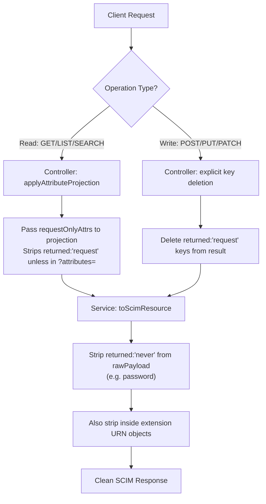
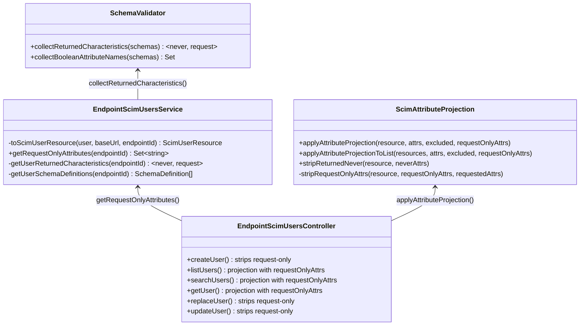

# G8e — Response `returned` Characteristic Filtering

## Overview

**Feature**: RFC 7643 §2.4 `returned` attribute characteristic enforcement  
**Version**: v0.17.4  
**Status**: ✅ Complete  
**RFC Reference**: [RFC 7643 §2.4 — Attribute Characteristics](https://datatracker.ietf.org/doc/html/rfc7643#section-2.4)

### Problem Statement

Prior to G8e, the SCIM server did not enforce the `returned` attribute characteristic defined in RFC 7643 §2.4. This meant:

1. **`returned:'never'` attributes (e.g. `password`) were exposed in responses** — a security violation where sensitive write-only data leaked back to clients in POST, PUT, PATCH, GET, and LIST responses.
2. **`returned:'request'` attributes were always included** — attributes meant to appear only when explicitly requested via the `attributes` query parameter were returned by default, increasing payload size and exposing data unnecessarily.
3. **The `password` attribute was missing from the User schema definition** — `/Schemas` discovery did not declare `password` at all, violating RFC 7643 §4.1.

### Solution

A **two-layer filtering architecture** that enforces `returned` characteristics at the appropriate level:

- **Service layer** → strips `returned:'never'` attributes from ALL responses (applies universally)
- **Controller layer** → strips `returned:'request'` attributes from responses unless explicitly requested via `attributes` param

## Architecture

```
┌─────────────────────────────────────────────────────────────┐
│                     Client Request                          │
│           POST / GET / PUT / PATCH / LIST / SEARCH          │
└───────────────────────┬─────────────────────────────────────┘
                        │
                        ▼
┌─────────────────────────────────────────────────────────────┐
│               Controller Layer (G8e)                        │
│                                                             │
│  Read Ops (GET/LIST/SEARCH):                                │
│    requestOnlyAttrs → applyAttributeProjection()            │
│    Strips returned:'request' unless in ?attributes=         │
│                                                             │
│  Write Ops (POST/PUT/PATCH):                                │
│    Explicitly deletes returned:'request' keys from result   │
└───────────────────────┬─────────────────────────────────────┘
                        │
                        ▼
┌─────────────────────────────────────────────────────────────┐
│                Service Layer (G8e)                           │
│                                                             │
│  toScimUserResource() / toScimGroupResource():              │
│    neverAttrs = getUserReturnedCharacteristics()            │
│    Deletes returned:'never' keys from rawPayload            │
│    Also handles extension URN nested objects                │
│                                                             │
│  getRequestOnlyAttributes():                                │
│    Returns Set<string> of returned:'request' attr names     │
│    Used by controllers for response filtering               │
└───────────────────────┬─────────────────────────────────────┘
                        │
                        ▼
┌─────────────────────────────────────────────────────────────┐
│              Infrastructure Layer (G8e)                      │
│                                                             │
│  SchemaValidator.collectReturnedCharacteristics(schemas)    │
│    → { never: Set<string>, request: Set<string> }           │
│                                                             │
│  stripReturnedNever(resource, neverAttrs)                   │
│    Utility for top-level + extension URN attribute removal  │
│                                                             │
│  applyAttributeProjection(..., requestOnlyAttrs)            │
│    Enhanced with 4th parameter for request-only filtering   │
└─────────────────────────────────────────────────────────────┘
```

## Key Components

| Component | File | Purpose |
|-----------|------|---------|
| `collectReturnedCharacteristics()` | `schema-validator.ts` | Walks schema attribute definitions, collects `returned:'never'` and `returned:'request'` names into two Sets |
| `stripReturnedNever()` | `scim-attribute-projection.ts` | Deletes never-returned attributes from resource objects, including inside extension URN objects |
| `stripRequestOnlyAttrs()` | `scim-attribute-projection.ts` | Internal helper — strips `returned:'request'` attrs unless explicitly listed in `attributes` param |
| `applyAttributeProjection()` | `scim-attribute-projection.ts` | Enhanced with `requestOnlyAttrs` 4th parameter — integrates request-only stripping with existing projection |
| `getRequestOnlyAttributes()` | Users/Groups service | Public method returning `Set<string>` of request-only attribute names for the endpoint |
| `getUserReturnedCharacteristics()` | Users service | Private helper combining schema collection with `collectReturnedCharacteristics()` |
| `getUserSchemaDefinitions()` | Users service | Gets core + extension schema definitions from `ScimSchemaRegistry` |
| `password` attribute | `scim-schemas.constants.ts` | New entry: `returned: 'never'`, `mutability: 'writeOnly'` |

## RFC 7643 §2.4 Compliance

The `returned` characteristic defines when an attribute should appear in responses:

| Value | Behavior | Implementation |
|-------|----------|----------------|
| `always` | Always returned regardless of query params | Existing: `ALWAYS_RETURNED_BASE` set + resource-type detection |
| `default` | Returned by default, removable via `excludedAttributes` | Existing: standard projection logic |
| `never` | **MUST NOT** appear in any response | **G8e**: Service-layer stripping in `toScim*Resource()` |
| `request` | Only returned when explicitly requested via `attributes` | **G8e**: Controller-layer `requestOnlyAttrs` filtering |

### RFC Sections Referenced

| RFC Section | Requirement | Status |
|------------|-------------|--------|
| RFC 7643 §2.4 | Attribute characteristics including `returned` | ✅ Fully implemented |
| RFC 7643 §4.1 | User schema MUST include `password` with `returned:'never'` | ✅ Added to schema constants |
| RFC 7644 §3.4.2.5 | `attributes` / `excludedAttributes` query parameters | ✅ Enhanced with request-only awareness |
| RFC 7643 §7 | Schema discovery MUST reflect attribute characteristics | ✅ `/Schemas` shows `password` correctly |

## Implementation Details

### 1. Service-Layer Stripping (`returned:'never'`)

In `toScimUserResource()` and `toScimGroupResource()`, after parsing `rawPayload` and sanitizing booleans:

```typescript
// G8e: Strip returned:'never' attributes from rawPayload (e.g. password)
const { never: neverAttrs } = this.getUserReturnedCharacteristics(endpointId);
for (const key of Object.keys(rawPayload)) {
  if (neverAttrs.has(key.toLowerCase())) {
    delete rawPayload[key];
  }
}
```

Extension URN objects are also handled:

```typescript
// Also strip never-returned attrs inside extension objects
const extObj = rawPayload[urn];
if (typeof extObj === 'object' && extObj !== null && !Array.isArray(extObj)) {
  for (const extKey of Object.keys(extObj as Record<string, unknown>)) {
    if (neverAttrs.has(extKey.toLowerCase())) {
      delete (extObj as Record<string, unknown>)[extKey];
    }
  }
}
```

### 2. Controller-Layer Filtering (`returned:'request'`)

**Read operations** (GET, LIST, SEARCH) pass `requestOnlyAttrs` to the enhanced projection function:

```typescript
const requestOnlyAttrs = this.usersService.getRequestOnlyAttributes(endpointId);
return applyAttributeProjection(result, attributes, excludedAttributes, requestOnlyAttrs);
```

**Write operations** (POST, PUT, PATCH) explicitly delete request-only keys:

```typescript
const requestOnlyAttrs = this.usersService.getRequestOnlyAttributes(endpointId);
if (requestOnlyAttrs.size > 0) {
  for (const key of Object.keys(result)) {
    if (requestOnlyAttrs.has(key.toLowerCase())) delete (result as Record<string, unknown>)[key];
  }
}
```

### 3. Schema Infrastructure

`SchemaValidator.collectReturnedCharacteristics()` walks all attributes (including sub-attributes) across core + extension schemas:

```typescript
static collectReturnedCharacteristics(
  schemas: readonly SchemaDefinition[],
): { never: Set<string>; request: Set<string> } {
  const never = new Set<string>();
  const request = new Set<string>();

  const collect = (attrs: readonly SchemaAttributeDefinition[]): void => {
    for (const attr of attrs) {
      const returned = attr.returned?.toLowerCase();
      if (returned === 'never') never.add(attr.name.toLowerCase());
      else if (returned === 'request') request.add(attr.name.toLowerCase());
      if (attr.subAttributes) collect(attr.subAttributes);
    }
  };

  for (const schema of schemas) {
    collect(schema.attributes);
  }
  return { never, request };
}
```

### 4. Schema Constants Update

`password` attribute added to `USER_SCHEMA_ATTRIBUTES` in `scim-schemas.constants.ts`:

```typescript
{
  name: 'password',
  type: 'string',
  multiValued: false,
  required: false,
  caseExact: false,
  mutability: 'writeOnly',
  returned: 'never',
  description: 'The User\'s cleartext password...',
}
```

## Configuration

This feature has **no configuration flags** — `returned` characteristic enforcement is mandatory per RFC 7643 §2.4 and applies to all endpoints unconditionally. Unlike G8c (which is gated behind `StrictSchemaValidation`), G8e cannot be disabled.

## Test Coverage

### Unit Tests (26 new)

| Test File | Count | Description |
|-----------|-------|-------------|
| `scim-attribute-projection.spec.ts` | 16 | `requestOnlyAttrs` filtering (include/exclude scenarios), `stripReturnedNever` (top-level, extension URN, case-insensitive, empty set, mixed attributes) |
| `schema-validator-v16-v32.spec.ts` | 10 | `collectReturnedCharacteristics` with never/request/always/default, sub-attributes, multiple schemas, empty schemas, case-insensitive matching |

### Service-Level Unit Tests

| Test File | Count | Description |
|-----------|-------|-------------|
| `endpoint-scim-users.service.spec.ts` | 4 | `toScimUserResource` strips password from response; `getRequestOnlyAttributes` returns correct set; password excluded even when in rawPayload; extension URN password stripped |
| `endpoint-scim-groups.service.spec.ts` | 2 | `toScimGroupResource` strips never-returned attrs; `getRequestOnlyAttributes` returns correct set |

### Controller-Level Unit Tests

| Test File | Count | Description |
|-----------|-------|-------------|
| `endpoint-scim-users.controller.spec.ts` | 4 | createUser strips request-only attrs; listUsers passes requestOnlyAttrs; getUser passes requestOnlyAttrs to projection; replaceUser strips request-only attrs |
| `endpoint-scim-groups.controller.spec.ts` | 4 | Same pattern as Users: create/list/get/replace request-only stripping |

### E2E Tests (8 new)

| Test File | Count | Description |
|-----------|-------|-------------|
| `returned-characteristic.e2e-spec.ts` | 8 | POST password not returned; GET password not returned; LIST password stripped from all resources; PUT password stripped; PATCH password stripped; SEARCH password stripped; `?attributes=password` still excluded; `/Schemas` shows `password` with `returned:'never'` |

### Live Integration Tests (10 new — Section 9l)

| Test ID | Description |
|---------|-------------|
| 9l.1 | POST /Users with password — password stripped from response |
| 9l.2 | GET /Users/:id — password stripped |
| 9l.3 | GET /Users list — password stripped from all resources |
| 9l.4 | PUT /Users with password — password stripped from response |
| 9l.5 | PATCH /Users — password stripped from response |
| 9l.6 | POST /Users/.search — password stripped from results |
| 9l.7 | GET /Users?attributes=password — returned:never overrides explicit request |
| 9l.8 | GET /Users?attributes=password,userName — mixed request (password stripped, userName returned) |
| 9l.9 | GET /Schemas — password attribute metadata (returned=never, mutability=writeOnly) |
| 9l.10 | POST /.search with attributes=password — returned:never wins |

**Live test results**: 361/361 passing on both local (inmemory) and Docker (PostgreSQL) deployments.

### Test Counts After G8e

| Suite | Count | Delta |
|-------|-------|-------|
| Unit tests | 2,156 | +40 (from 2,116) |
| Unit suites | 61 | +0 |
| E2E tests | 382 | +8 (from 374) |
| E2E suites | 20 | +1 (from 19) |
| Live tests | 361 | +27 (from 334) |

## Files Changed

| File | Change |
|------|--------|
| `api/src/domain/validation/schema-validator.ts` | Added `collectReturnedCharacteristics()` static method |
| `api/src/modules/scim/common/scim-attribute-projection.ts` | Added `stripReturnedNever()` export, `stripRequestOnlyAttrs()` internal, enhanced `applyAttributeProjection()` with `requestOnlyAttrs` param |
| `api/src/modules/scim/discovery/scim-schemas.constants.ts` | Added `password` attribute to `USER_SCHEMA_ATTRIBUTES`; added `deepFreeze()` for all schema constants to prevent runtime mutation |
| `api/src/modules/scim/services/endpoint-scim-users.service.ts` | G8e never-stripping in `toScimUserResource()`, added `getRequestOnlyAttributes()`, `getUserReturnedCharacteristics()`, `getUserSchemaDefinitions()` |
| `api/src/modules/scim/services/endpoint-scim-groups.service.ts` | Same G8e pattern as Users service |
| `api/src/modules/scim/controllers/endpoint-scim-users.controller.ts` | All 6 CRUD methods updated with request-only filtering |
| `api/src/modules/scim/controllers/endpoint-scim-groups.controller.ts` | All 6 CRUD methods updated with request-only filtering |
| `scripts/live-test.ps1` | Added TEST SECTION 9l: 10 live integration tests for returned characteristic filtering |
| `api/src/modules/scim/common/scim-attribute-projection.spec.ts` | 16 new unit tests |
| `api/src/domain/validation/schema-validator-v16-v32.spec.ts` | 10 new unit tests |
| `api/src/modules/scim/services/endpoint-scim-users.service.spec.ts` | 4 new service-level G8e unit tests |
| `api/src/modules/scim/services/endpoint-scim-groups.service.spec.ts` | 2 new service-level G8e unit tests |
| `api/src/modules/scim/controllers/endpoint-scim-users.controller.spec.ts` | 4 new controller-level G8e behavioral tests |
| `api/src/modules/scim/controllers/endpoint-scim-groups.controller.spec.ts` | 4 new controller-level G8e behavioral tests |
| `api/test/e2e/returned-characteristic.e2e-spec.ts` | 8 new E2E tests |
| `docs/G8E_RETURNED_CHARACTERISTIC_FILTERING.md` | This document |

## Migration Plan Impact

G8e implements item **G8e** from the migration plan (`MIGRATION_PLAN_CURRENT_TO_IDEAL_v3_2026-02-20.md`):

> **G8e**: Response filtering based on `returned` value — `always`, `default`, `never`, `request`

**Status**: ✅ DONE — `returned:'never'` and `returned:'request'` fully enforced. `returned:'always'` and `returned:'default'` were already handled by existing attribute projection logic.

## Mermaid Diagrams

### Two-Layer Filtering Flow



### Schema Infrastructure


