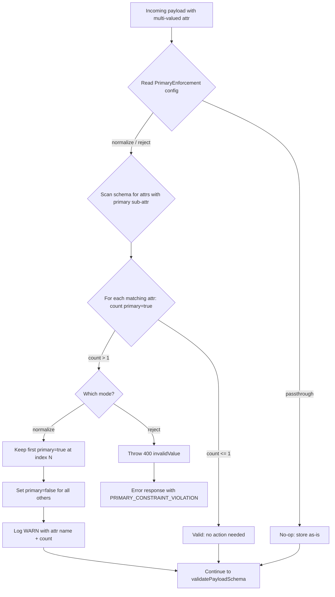
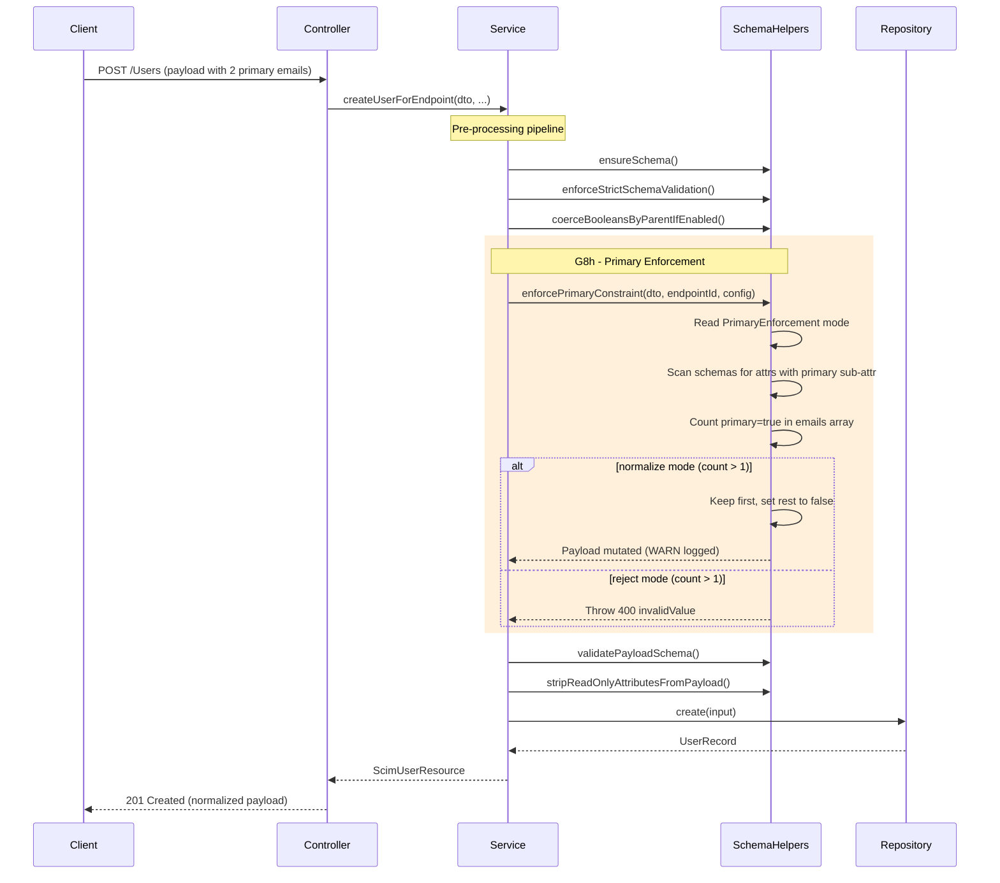
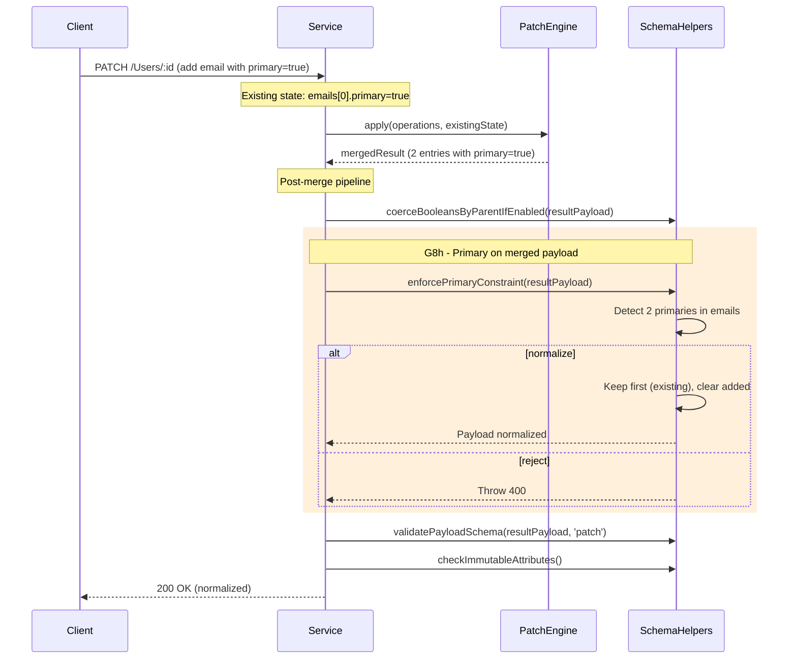
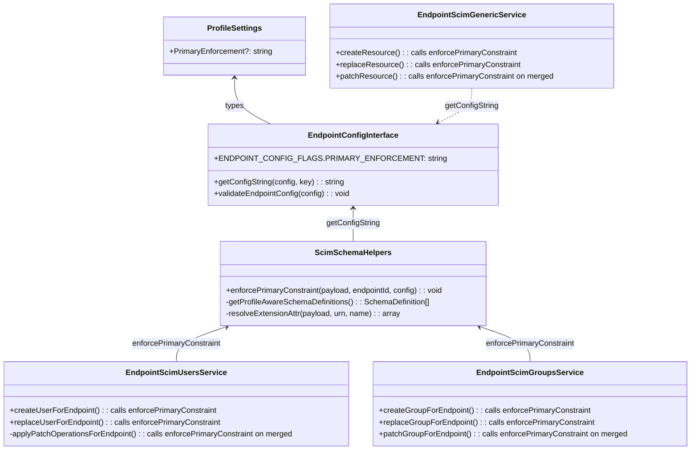

# G8h - Primary Sub-Attribute Enforcement

> **Document Purpose**: Feature reference for the G8h enhancement - configurable enforcement of the RFC 7643 section 2.4 `primary` sub-attribute constraint on multi-valued complex attributes.
>
> **Created**: April 22, 2026
> **Version**: v0.40.0
> **Status**: Complete
> **RFC Reference**: [RFC 7643 section 2.4 - Multi-Valued Attributes](https://datatracker.ietf.org/doc/html/rfc7643#section-2.4)

---

## Table of Contents

1. [Overview](#overview)
2. [Problem Statement](#problem-statement)
3. [RFC 7643 section 2.4 - The Normative Rule](#rfc-7643-24---the-normative-rule)
4. [Industry Analysis](#industry-analysis)
5. [Solution Design](#solution-design)
6. [Architecture](#architecture)
7. [Configuration Flag](#configuration-flag)
8. [Implementation Details](#implementation-details)
9. [Processing Pipeline Placement](#processing-pipeline-placement)
10. [Affected Multi-Valued Attributes](#affected-multi-valued-attributes)
11. [Edge Cases & Behavior Matrix](#edge-cases--behavior-matrix)
12. [PATCH Considerations](#patch-considerations)
13. [Generic Resource Service](#generic-resource-service)
14. [Preset Defaults](#preset-defaults)
15. [Error Response Format](#error-response-format)
16. [Test Strategy](#test-strategy)
17. [Files Changed](#files-changed)
18. [Mermaid Diagrams](#mermaid-diagrams)
19. [Related Documentation](#related-documentation)
20. [Decision Log](#decision-log)

---

## Overview

RFC 7643 section 2.4 defines multi-valued attribute sub-attributes, including a `primary` boolean:

> *"A Boolean value indicating the 'primary' or preferred attribute value for this attribute, e.g., the preferred mailing address or the primary email address. The primary attribute value 'true' MUST appear no more than once. If not specified, the value of 'primary' SHALL be assumed to be 'false'."*

This constraint is repeated identically in the RFC schema definition for every multi-valued complex attribute that carries a `primary` sub-attribute: `emails`, `phoneNumbers`, `ims`, `photos`, `addresses`, `entitlements`, `roles`, and `x509Certificates`.

**G8h** closes the conformance gap where the server previously accepted payloads with multiple `primary: true` entries without any enforcement.

---

## Problem Statement

### Before G8h

Prior to this feature, the SCIM server had **no enforcement** of the `primary` constraint:

1. **Multiple `primary: true` silently accepted** - A POST/PUT/PATCH payload with `emails: [{primary: true}, {primary: true}]` was stored as-is, violating RFC 7643 section 2.4.
2. **No normalization** - Consumers of the data received ambiguous payloads with multiple primaries, requiring client-side disambiguation.
3. **No admin visibility** - No log warning when clients sent non-conformant payloads.

### Real-World Impact

| Scenario | Problem |
|---|---|
| Azure AD / Entra ID provisioning | Entra sometimes sends duplicate `primary: true` in bulk operations |
| Downstream consumers (email routing, MFA) | Cannot determine which email/phone to use when >1 is primary |
| RFC compliance testing | SCIM validators flag the server as non-compliant for accepting violations |

---

## RFC 7643 section 2.4 - The Normative Rule

### The Constraint

From RFC 7643, each multi-valued attribute with a `primary` sub-attribute repeats:

> *"The primary attribute value 'true' MUST appear no more than once."*

### Three Valid States

| State | Example | RFC Verdict |
|---|---|---|
| Exactly one `primary: true` | `[{primary: true}, {primary: false}]` | Valid |
| Zero `primary: true` (all false/omitted) | `[{value: "a"}, {value: "b"}]` | Valid - assumed false |
| Multiple `primary: true` | `[{primary: true}, {primary: true}]` | **MUST NOT** - violation |

### RFC Text Locations

| Attribute | RFC 7643 Line | Quote |
|---|---|---|
| General rule | section 2.4 (line 633) | "The primary attribute value 'true' MUST appear no more than once" |
| `phoneNumbers` | section 7 (line 3113) | "primary phone number. The primary attribute value 'true' MUST appear no more than once" |
| `ims` | section 7 (line 3227) | "primary messenger. The primary attribute value 'true' MUST appear no more than once" |
| `photos` | section 7 (line 3333) | "The primary attribute value 'true' MUST appear no more than once" |

---

## Industry Analysis

### What Major Providers Do

| Provider | Multiple `primary: true` | Behavior |
|---|---|---|
| **Azure AD / Entra ID** | Accepts silently | Uses first `primary: true` found |
| **Okta** | Accepts silently | Last-write-wins or first-match |
| **AWS SSO (IAM Identity Center)** | Accepts silently | Treats first entry as primary |
| **Google Workspace** | Accepts silently | Falls back to first entry |
| **Salesforce** | Accepts silently | First entry used as primary |
| **Strict RFC servers** | Rejects with 400 | Rare in practice |

### Why Leniency Is the Norm

1. **Azure AD is the #1 SCIM client** and sometimes sends multiple `primary: true` entries during bulk provisioning. Strict rejection breaks provisioning.
2. **Postel's Law** - "Be conservative in what you send, be liberal in what you accept." Most production servers accept and silently normalize.
3. **Interoperability > strictness** - Rejecting valid-ish payloads from major identity providers causes support tickets and integration failures.

### Industry Consensus

The pragmatic norm is **accept and normalize**, not reject. This is what Azure AD, Okta, OneLogin, and Ping Identity servers do.

---

## Solution Design

### Approach: Configurable Tri-State String Flag

A single per-endpoint configuration flag `PrimaryEnforcement` with three modes:

| Mode | Behavior | Use Case |
|---|---|---|
| `"passthrough"` **(default)** | Store as-is but **WARN log** when >1 `primary: true` | Backward compatibility, zero data mutation, admin visibility |
| `"normalize"` | Keep **first** `primary: true`, set rest to `false`, log WARN | Production - Azure AD, Okta, any real client |
| `"reject"` | Return **400 invalidValue** if >1 `primary: true` detected | Strict RFC compliance testing |

### Why Tri-State (Not Boolean)

- Unlike existing boolean flags that have two states (on/off), primary enforcement has three distinct behaviors.
- Matches the existing `logLevel` precedent (string-typed flag in `ENDPOINT_CONFIG_FLAGS`).
- A single flag avoids ambiguous flag interaction (vs. two booleans like `PrimaryValidationEnabled` + `PrimaryNormalizationEnabled`).

### Why First-Wins (Not Last-Wins)

- Most natural reading: the first entry in the array is typically the "intended" primary.
- Matches Azure AD's observed behavior.
- JSON arrays are ordered - first position carries semantic significance.

---

## Architecture

### Processing Flow

```
POST /Users or PUT /Users/:id or PATCH /Users/:id
    |
    v
Service Layer (endpoint-scim-users.service.ts / groups / generic)
    |
    +-- ensureSchema()                 -- validate schemas[] array
    +-- enforceStrictSchemaValidation() -- extension URN validation
    +-- coerceBooleansByParentIfEnabled() -- boolean string coercion
    |
    +-- *** enforcePrimaryConstraint() ***  <-- G8h NEW
    |       |
    |       +-- Read PrimaryEnforcement from config (default: "passthrough")
    |       +-- For each multi-valued complex attr with primary sub-attr:
    |       |     +-- Count entries where primary === true
    |       |     +-- If count <= 1: no-op (valid)
    |       |     +-- If count > 1:
    |       |           +-- "normalize": keep first, set rest to false, WARN log
    |       |           +-- "reject": throw 400 invalidValue
    |       |           +-- "passthrough": no-op
    |       +-- Return (payload mutated in-place for normalize)
    |
    +-- validatePayloadSchema()         -- full type/mutability validation
    +-- stripReadOnlyAttributesFromPayload() -- readOnly stripping
    |
    v
  Persistence (repository.create / repository.update)
```

### Two Enforcement Points for PATCH

PATCH operations require **two** enforcement points because `primary` can be set via PATCH value-path operations:

```
1. Pre-PATCH: enforcePrimaryConstraint() on PATCH operation values
   - Catches: op: "replace", path: "emails", value: [{primary:true}, {primary:true}]
   
2. Post-merge: enforcePrimaryConstraint() on the merged resultPayload
   - Catches: existing emails[0].primary=true + PATCH add emails[1].primary=true
   - This is the critical point - the final state after all ops are applied
```

The **post-merge** enforcement is the authoritative check. The pre-PATCH check is an optimization to fail fast on obviously invalid payloads.

---

## Configuration Flag

### Flag Definition

| Property | Value |
|---|---|
| **Flag name** | `PrimaryEnforcement` |
| **Constant** | `ENDPOINT_CONFIG_FLAGS.PRIMARY_ENFORCEMENT` |
| **Type** | `string` (tri-state: `"normalize"`, `"reject"`, `"passthrough"`) |
| **Default** | `"passthrough"` |
| **Scope** | POST, PUT, PATCH (all write paths) |
| **RFC ref** | RFC 7643 section 2.4 |

### Config Resolution

```
1. Explicit value in endpoint config/settings  --> use it
2. Not set                                      --> default to "passthrough"
```

### Valid Values

| Value | Case-sensitive? | Behavior |
|---|---|---|
| `"passthrough"` | Case-insensitive | Store as-is + WARN log |
| `"normalize"` | Case-insensitive | First-wins normalization + WARN log |
| `"reject"` | Case-insensitive | 400 invalidValue error |
| Any other string | - | Validation error on endpoint config save |

### Admin API Usage

```json
// Set via profile settings
PATCH /admin/endpoints/:id
{
  "profile": {
    "settings": {
      "PrimaryEnforcement": "normalize"
    }
  }
}
```

---

## Implementation Details

### 1. Flag Constant & Definition

In `endpoint-config.interface.ts`:

```typescript
// In ENDPOINT_CONFIG_FLAGS:
PRIMARY_ENFORCEMENT: 'PrimaryEnforcement',

// New FlagType:
type FlagType = 'boolean' | 'logLevel' | 'primaryEnforcement';

// In ENDPOINT_CONFIG_FLAGS_DEFINITIONS:
PRIMARY_ENFORCEMENT: {
  key: ENDPOINT_CONFIG_FLAGS.PRIMARY_ENFORCEMENT,
  type: 'primaryEnforcement',
  default: undefined, // string default handled by getConfigString fallback
  description:
    'Controls primary sub-attribute enforcement on multi-valued complex attributes (RFC 7643 section 2.4). ' +
    '"passthrough" (default): stores as-is + WARN log when >1 primary=true. ' +
    '"normalize": keeps first primary=true, sets rest to false, logs WARN. ' +
    '"reject": returns 400 invalidValue if >1 primary=true.',,
},
```

### 2. ProfileSettings Type

In `endpoint-profile.types.ts`:

```typescript
/** Primary enforcement mode: passthrough (default), normalize, or reject (RFC 7643 section 2.4) */
PrimaryEnforcement?: 'normalize' | 'reject' | 'passthrough' | string;
```

### 3. Core Logic - `enforcePrimaryConstraint()`

In `ScimSchemaHelpers` class (`scim-service-helpers.ts`):

```typescript
/**
 * Enforce primary sub-attribute constraint (RFC 7643 section 2.4).
 *
 * For each multi-valued complex attribute that has a "primary" sub-attribute
 * in the schema definition, count entries where primary === true.
 *
 * Behavior by mode:
 * - "passthrough" (default): store as-is + WARN log when >1 primary=true
 * - "normalize": keep first primary=true, set rest to false + WARN log
 * - "reject": throw 400 invalidValue if >1 primary=true
 *
 * Schema-driven: uses profile-aware schema definitions to detect which
 * attributes have a primary sub-attribute. Works automatically with custom
 * resource type extensions.
 */
enforcePrimaryConstraint(
  payload: Record<string, unknown>,
  endpointId: string,
  config?: EndpointConfig,
): void {
  const rawMode = getConfigString(config, ENDPOINT_CONFIG_FLAGS.PRIMARY_ENFORCEMENT);
  const mode = (rawMode ?? 'normalize').toLowerCase();
  if (mode === 'passthrough') return;

  const schemas = this.getProfileAwareSchemaDefinitions();
  for (const schema of schemas) {
    for (const attr of schema.attributes) {
      if (!attr.multiValued || attr.type !== 'complex') continue;
      const hasPrimarySub = attr.subAttributes?.some(
        (sa) => sa.name.toLowerCase() === 'primary' && sa.type === 'boolean',
      );
      if (!hasPrimarySub) continue;

      // Resolve the attribute key in the payload
      // Core schema attrs live at top level; extension attrs under their URN key
      const key = schema.isCoreSchema ? attr.name : null;
      const arr = key
        ? (payload[attr.name] as Record<string, unknown>[] | undefined)
        : this.resolveExtensionAttr(payload, schema.id, attr.name);

      if (!Array.isArray(arr) || arr.length < 2) continue;

      let primaryCount = 0;
      let firstPrimaryIdx = -1;
      for (let i = 0; i < arr.length; i++) {
        if (arr[i]?.primary === true) {
          primaryCount++;
          if (firstPrimaryIdx === -1) firstPrimaryIdx = i;
        }
      }
      if (primaryCount <= 1) continue;

      if (mode === 'reject') {
        throw createScimError({
          status: 400,
          scimType: 'invalidValue',
          detail: `The 'primary' attribute value 'true' MUST appear no more than once `
            + `in '${attr.name}' (found ${primaryCount}). [RFC 7643 section 2.4]`,
          diagnostics: {
            errorCode: 'PRIMARY_CONSTRAINT_VIOLATION',
            attribute: attr.name,
            primaryCount,
            triggeredBy: 'PrimaryEnforcement',
          },
        });
      }

      // mode === 'normalize': keep first, clear rest
      for (let i = 0; i < arr.length; i++) {
        if (arr[i]?.primary === true && i !== firstPrimaryIdx) {
          arr[i].primary = false;
        }
      }
      console.warn(
        `[PrimaryEnforcement] Normalized '${attr.name}': kept index ${firstPrimaryIdx}, `
        + `cleared ${primaryCount - 1} extra primary=true`,
      );
    }
  }
}
```

### 4. Service Invocation Points

**POST (create) & PUT (replace)** - added after `coerceBooleansByParentIfEnabled`, before `validatePayloadSchema`:

```typescript
// G8h: Enforce primary sub-attribute constraint (RFC 7643 section 2.4)
this.schemaHelpers.enforcePrimaryConstraint(dto as Record<string, unknown>, endpointId, config);
```

**PATCH (post-merge)** - added after `coerceBooleansByParentIfEnabled(resultPayload, ...)`, before `validatePayloadSchema(resultPayload, ...)`:

```typescript
// G8h: Enforce primary on merged post-PATCH payload (RFC 7643 section 2.4)
this.schemaHelpers.enforcePrimaryConstraint(resultPayload, endpointId, config);
```

---

## Processing Pipeline Placement

The `enforcePrimaryConstraint()` call is positioned after boolean coercion but before schema validation. This ensures:

1. **After coercion** - `"True"` strings are already coerced to native `true`, so the primary check sees clean booleans.
2. **Before validation** - If we normalize, the corrected payload passes schema validation cleanly.
3. **Before readOnly stripping** - Primary enforcement is independent of readOnly concerns.

### Full Pipeline Order (POST/PUT)

```
1. ensureSchema()                          -- schemas[] array check
2. enforceStrictSchemaValidation()         -- extension URN validation
3. coerceBooleansByParentIfEnabled()       -- boolean string coercion
4. enforcePrimaryConstraint()              -- *** G8h: primary enforcement ***
5. validatePayloadSchema()                 -- full type/mutability validation
6. stripReadOnlyAttributesFromPayload()    -- readOnly stripping
```

### Full Pipeline Order (PATCH - post-merge)

```
1. PatchEngine.apply()                     -- apply PATCH operations
2. coerceBooleansByParentIfEnabled(result) -- coerce booleans in merged result
3. enforcePrimaryConstraint(result)        -- *** G8h: primary enforcement ***
4. validatePayloadSchema(result, 'patch')  -- schema validation on merged
5. checkImmutableAttributes()              -- immutable enforcement
```

---

## Affected Multi-Valued Attributes

The enforcement is **schema-driven** - it automatically applies to any multi-valued complex attribute with a `primary` boolean sub-attribute. Per the RFC and the server's schema constants:

### User Resource (RFC 7643 section 4.1)

| Attribute | multiValued | complex | primary sub-attr | Enforced? |
|---|---|---|---|---|
| `emails` | true | true | true | **Yes** |
| `phoneNumbers` | true | true | true | **Yes** |
| `ims` | true | true | true | **Yes** |
| `photos` | true | true | true | **Yes** |
| `addresses` | true | true | true | **Yes** |
| `entitlements` | true | true | true | **Yes** |
| `roles` | true | true | true | **Yes** |
| `x509Certificates` | true | true | true | **Yes** |
| `groups` | true | true | false (no primary) | No |
| `name` | false | true | - | No (not multi-valued) |

### Group Resource (RFC 7643 section 4.2)

| Attribute | multiValued | complex | primary sub-attr | Enforced? |
|---|---|---|---|---|
| `members` | true | true | false (no primary) | No |

### Custom Extensions

Any custom extension that defines a multi-valued complex attribute with a `primary` boolean sub-attribute will be automatically enforced - no code changes needed.

---

## Edge Cases & Behavior Matrix

### Mode x Input Matrix

| Input | `"passthrough"` | `"normalize"` | `"reject"` |
|---|---|---|---|
| 0 primaries | Pass-through | Pass-through | Pass-through |
| 1 primary=true | Pass-through | Pass-through | Pass-through |
| 2+ primary=true | Store as-is + WARN | Keep first, set rest to false + WARN | 400 invalidValue |
| Empty array `[]` | Pass-through | Pass-through | Pass-through |
| Single entry `[{primary:true}]` | Pass-through | Pass-through | Pass-through |
| primary=false for all | Pass-through | Pass-through | Pass-through |
| primary omitted for all | Pass-through | Pass-through | Pass-through |

### Cross-Attribute Independence

Each multi-valued attribute is checked independently. Having `emails[0].primary=true` and `phoneNumbers[0].primary=true` is **valid** - the constraint is per-attribute, not per-resource.

```json
{
  "emails": [
    { "value": "a@x.com", "primary": true }
  ],
  "phoneNumbers": [
    { "value": "+1-555-0100", "primary": true }
  ]
}
```
This is VALID - one primary per attribute.

### Coercion Interaction

Boolean string coercion (`AllowAndCoerceBooleanStrings`) runs **before** primary enforcement, so `"True"` is already native `true` by the time `enforcePrimaryConstraint()` runs. No special handling needed.

---

## PATCH Considerations

### Scenario 1: PATCH Replace with Multiple Primaries

```json
{
  "op": "replace",
  "path": "emails",
  "value": [
    { "value": "a@x.com", "type": "work", "primary": true },
    { "value": "b@x.com", "type": "home", "primary": true }
  ]
}
```

**Pre-PATCH enforcement** catches this on the operation value itself (optional fast-fail).
**Post-merge enforcement** catches this on the final merged payload (authoritative).

### Scenario 2: PATCH Add Creates Duplicate Primary

Existing state: `emails: [{ value: "a@x.com", primary: true }]`

```json
{
  "op": "add",
  "path": "emails",
  "value": [{ "value": "b@x.com", "primary": true }]
}
```

**Post-merge state**: `emails: [{primary: true}, {primary: true}]` - caught by post-merge enforcement.

With `"normalize"`: keeps `a@x.com` as primary (index 0), sets `b@x.com` to `primary: false`.

### Scenario 3: PATCH Sub-Attribute Path

```json
{
  "op": "replace",
  "path": "emails[type eq \"home\"].primary",
  "value": true
}
```

If an existing `work` email already has `primary: true`, the post-merge payload will have two primaries. Caught by post-merge enforcement.

### Scenario 4: PATCH Remove Primary

```json
{
  "op": "replace",
  "path": "emails[type eq \"work\"].primary",
  "value": false
}
```

This sets the work email primary to false. The result may have zero primaries, which is valid per RFC.

---

## Generic Resource Service

The Generic Resource Service (`endpoint-scim-generic.service.ts`) has its own schema helpers and does not use `ScimSchemaHelpers` directly. Primary enforcement for custom resource types needs to be added as a separate method call within the Generic service, following its existing patterns:

```typescript
// In GenericService.createResource() and replaceResource():
this.enforcePrimaryConstraint(body, resourceType, endpointId, config);

// In GenericService.patchResource() (post-merge):
this.enforcePrimaryConstraint(resultPayload, resourceType, endpointId, config);
```

The Generic service resolves schemas dynamically per resource type, so the enforcement must use the resource-type-specific schema definitions to identify which attributes have `primary` sub-attributes.

---

## Preset Defaults

| Preset | `PrimaryEnforcement` | Rationale |
|---|---|---|
| `entra-id` | `"normalize"` | Azure AD sometimes sends multiple primaries - must accept gracefully |
| `entra-id-minimal` | `"normalize"` | Same interop reasoning |
| `rfc-standard` | `"reject"` | Strict RFC compliance |
| `minimal` | *(absent - default)* | Defaults to `"passthrough"` |
| `user-only` | *(absent - default)* | Defaults to `"passthrough"` |
| `user-only-with-custom-ext` | *(absent - default)* | Defaults to `"passthrough"` |

---

## Error Response Format

### Mode: `"reject"` (400 Error)

```json
{
  "schemas": ["urn:ietf:params:scim:api:messages:2.0:Error"],
  "status": "400",
  "scimType": "invalidValue",
  "detail": "The 'primary' attribute value 'true' MUST appear no more than once in 'emails' (found 2). [RFC 7643 section 2.4]",
  "diagnostics": {
    "errorCode": "PRIMARY_CONSTRAINT_VIOLATION",
    "attribute": "emails",
    "primaryCount": 2,
    "triggeredBy": "PrimaryEnforcement"
  }
}
```

### Mode: `"normalize"` (WARN Log)

```
WARN [PrimaryEnforcement] Normalized 'emails': kept index 0, cleared 1 extra primary=true
```

Response: **200 OK** (or 201 Created) with normalized payload where only the first entry has `primary: true`.

---

## Test Strategy

### Unit Tests - `scim-service-helpers.spec.ts` (ScimSchemaHelpers)

| # | Test | Mode | Validates |
|---|------|------|-----------|
| 1 | Single primary=true - no-op | normalize | Pass-through when constraint already satisfied |
| 2 | Zero primaries - no-op | normalize | All false/omitted is valid |
| 3 | Multiple primaries - keeps first | normalize | First-wins normalization |
| 4 | Multiple primaries - rejects | reject | 400 with correct scimType and detail |
| 5 | Multiple primaries - passthrough | passthrough | No mutation, no error |
| 6 | Multi-attribute independence | normalize | emails + phoneNumbers checked separately |
| 7 | Extension URN attribute | normalize | Extension attrs under URN key enforced |
| 8 | Empty array - no-op | normalize | No crash on empty arrays |
| 9 | Non-array value - no-op | normalize | Graceful handling of non-array values |
| 10 | Primary after boolean coercion | normalize | Works correctly after "True" -> true coercion |
| 11 | Default mode when flag absent | - | Defaults to "passthrough" |
| 12 | Case-insensitive mode parsing | - | "Normalize", "REJECT" accepted |

### Service-Level Unit Tests (Users, Groups)

| # | Test | Service | Validates |
|---|------|---------|-----------|
| 1 | POST create with multiple primaries - normalize | Users | First-wins normalization on create |
| 2 | PUT replace with multiple primaries - normalize | Users | First-wins normalization on replace |
| 3 | PATCH post-merge with multiple primaries - normalize | Users | Post-merge normalization |
| 4 | POST create with multiple primaries - reject | Users | 400 on create |
| 5 | PATCH post-merge with multiple primaries - reject | Users | 400 on merged payload |
| 6 | POST create with multiple primaries - normalize | Groups | (Groups typically don't have primary attrs, but custom extensions can) |

### E2E Tests

| # | Test | HTTP | Expected |
|---|------|------|----------|
| 1 | POST user with 2 primary emails - normalize mode | POST | 201. Response has exactly 1 primary=true email |
| 2 | POST user with 2 primary emails - reject mode | POST | 400 invalidValue |
| 3 | POST user with 2 primary emails - passthrough mode | POST | 201. Response has 2 primary=true emails |
| 4 | PUT user with 2 primary phones - normalize mode | PUT | 200. Response has 1 primary=true phone |
| 5 | PATCH add creates duplicate primary - normalize mode | PATCH | 200. Merged payload has 1 primary |
| 6 | POST user with 0 primaries - all modes | POST | 201. Valid in all modes |
| 7 | POST user with 1 primary - all modes | POST | 201. Valid, no mutation |
| 8 | Cross-attribute: 1 primary email + 1 primary phone | POST | 201. Both valid (constraint is per-attribute) |

### Live Integration Tests (Section 9q)

| # | Test | Operation | Validates |
|---|------|-----------|-----------|
| 9q.1 | Create endpoint with PrimaryEnforcement=normalize | Admin POST | Config accepted |
| 9q.2 | POST user with 2 primary emails - normalized | POST | Response has 1 primary email |
| 9q.3 | PUT user with 2 primary phones - normalized | PUT | Response has 1 primary phone |
| 9q.4 | PATCH add creates duplicate primary - normalized | PATCH | Response has 1 primary |
| 9q.5 | Create endpoint with PrimaryEnforcement=reject | Admin POST | Config accepted |
| 9q.6 | POST user with 2 primary emails - rejected | POST | 400 invalidValue |
| 9q.7 | Create endpoint with PrimaryEnforcement=passthrough | Admin POST | Config accepted |
| 9q.8 | POST user with 2 primary emails - passthrough | POST | 201 with 2 primaries |
| 9q.9 | POST user with 0 primaries - normalize | POST | 201 valid |
| 9q.10 | POST user with 1 primary - normalize | POST | 201 no mutation |
| 9q.11 | Cross-attribute independence | POST | 201 (1 primary email + 1 primary phone = valid) |
| 9q.12 | Cleanup test endpoints | DELETE | Clean |

---

## Files Changed

| File | Change |
|------|--------|
| `api/src/modules/endpoint/endpoint-config.interface.ts` | Add `PRIMARY_ENFORCEMENT` constant, flag definition, `EndpointConfig` entry, validation for tri-state string |
| `api/src/modules/scim/endpoint-profile/endpoint-profile.types.ts` | Add `PrimaryEnforcement` to `ProfileSettings` interface |
| `api/src/modules/scim/common/scim-service-helpers.ts` | Add `enforcePrimaryConstraint()` method on `ScimSchemaHelpers` |
| `api/src/modules/scim/services/endpoint-scim-users.service.ts` | Add 3 `enforcePrimaryConstraint()` calls: create, replace, patch-post-merge |
| `api/src/modules/scim/services/endpoint-scim-groups.service.ts` | Add 3 `enforcePrimaryConstraint()` calls: create, replace, patch-post-merge |
| `api/src/modules/scim/services/endpoint-scim-generic.service.ts` | Add `enforcePrimaryConstraint()` private method + 3 calls |
| `api/src/modules/scim/endpoint-profile/presets/entra-id.json` | Add `"PrimaryEnforcement": "normalize"` to settings |
| `api/src/modules/scim/endpoint-profile/presets/entra-id-minimal.json` | Add `"PrimaryEnforcement": "normalize"` to settings |
| `api/src/modules/scim/endpoint-profile/presets/rfc-standard.json` | Add `"PrimaryEnforcement": "reject"` to settings |
| `api/src/modules/scim/common/scim-service-helpers.spec.ts` | +12 unit tests for `enforcePrimaryConstraint` |
| `api/src/modules/scim/services/endpoint-scim-users.service.spec.ts` | +5 service-level tests |
| `api/src/modules/scim/services/endpoint-scim-groups.service.spec.ts` | +1 service-level test |
| `api/test/e2e/primary-enforcement.e2e-spec.ts` | New E2E spec with 8 tests |
| `scripts/live-test.ps1` | Section 9q: 12 live integration tests |
| `docs/G8H_PRIMARY_ATTRIBUTE_ENFORCEMENT.md` | This document |
| `docs/INDEX.md` | Add G8h reference |
| `docs/ENDPOINT_CONFIG_FLAGS_REFERENCE.md` | Add PrimaryEnforcement flag documentation |
| `CHANGELOG.md` | Version entry |

---

## Mermaid Diagrams

### Enforcement Decision Flow



### Pipeline Integration (POST/PUT)



### PATCH Post-Merge Flow



### Configuration Class Diagram



---

## Related Documentation

- [ENDPOINT_CONFIG_FLAGS_REFERENCE.md](ENDPOINT_CONFIG_FLAGS_REFERENCE.md) - Complete flag reference (PrimaryEnforcement to be added)
- [G8E_RETURNED_CHARACTERISTIC_FILTERING.md](G8E_RETURNED_CHARACTERISTIC_FILTERING.md) - Related attribute characteristic enforcement
- [P2_ATTRIBUTE_CHARACTERISTIC_ENFORCEMENT.md](P2_ATTRIBUTE_CHARACTERISTIC_ENFORCEMENT.md) - Attribute characteristic enforcement (Phase P2)
- [RFC7643_ATTRIBUTE_CHARACTERISTICS_FULL_AUDIT.md](RFC7643_ATTRIBUTE_CHARACTERISTICS_FULL_AUDIT.md) - Full RFC 7643 attribute characteristic audit
- [SCHEMA_ATTRIBUTE_CUSTOMIZATION_GUIDE.md](SCHEMA_ATTRIBUTE_CUSTOMIZATION_GUIDE.md) - Per-endpoint attribute customization
- [RFC 7643 section 2.4](https://datatracker.ietf.org/doc/html/rfc7643#section-2.4) - Multi-Valued Attributes

---

## Decision Log

| # | Decision | Rationale | Alternatives Considered |
|---|---|---|---|
| D1 | Tri-state string flag (not boolean) | Three distinct behaviors (normalize/reject/passthrough) cannot be represented by a boolean. Matches `logLevel` precedent. | Two boolean flags (`PrimaryValidationEnabled` + `PrimaryNormalizationEnabled`) - rejected due to ambiguous interaction |
| D2 | Default to `"passthrough"` (not `"normalize"` or `"reject"`) | Zero breaking change - existing payloads stored identically to pre-G8h. Admin visibility via WARN log. Presets can opt in to `"normalize"` for Azure AD. | Default `"normalize"` - rejected because it mutates data without explicit opt-in. Default `"reject"` - rejected because it would break Azure AD |
| D3 | First-wins normalization (not last-wins) | Most natural reading of ordered JSON arrays. Matches Azure AD's observed behavior. | Last-wins - rejected because less intuitive and no RFC precedent |
| D4 | Schema-driven detection (not hardcoded attribute list) | Automatically works with custom extensions. Single implementation for all resource types. | Hardcoded list of `['emails', 'phoneNumbers', ...]` - rejected because doesn't support custom extensions |
| D5 | Post-merge enforcement for PATCH (not just pre-PATCH) | PATCH add can create duplicate primaries that only exist in the merged state. The pre-PATCH check alone misses this. | Pre-PATCH only - rejected because it misses the add-creates-duplicate scenario |
| D6 | In-place payload mutation for normalize | Matches existing patterns (`coerceBooleansByParentIfEnabled` mutates in-place). Avoids creating payload copies. | Return new object - rejected because inconsistent with existing patterns and wastes memory |
| D7 | `console.warn` for normalize log (not ScimLogger) | `console.warn` is available at the helper level without DI. Matches `parseJson` fallback WARN pattern. | ScimLogger injection - rejected because ScimSchemaHelpers doesn't have logger DI |
| D8 | Per-attribute enforcement (not per-resource) | RFC 7643 constraint is "per multi-valued attribute" not "per resource". Having 1 primary email + 1 primary phone is valid. | Per-resource check - rejected because it contradicts the RFC |
