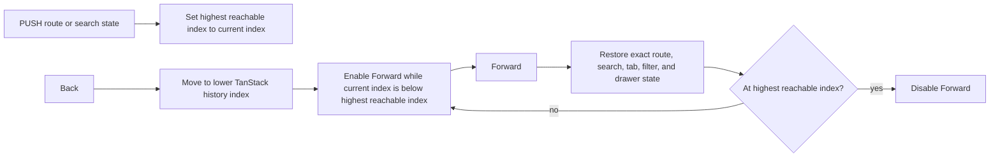

# Global navigation and workflow context

> **Status:** Implemented locally - **Last verified:** 2026-09-24 - **Product version:** `0.55.34`

## Purpose

The admin UI now exposes one global Back/Forward pair and uses endpoint identity according to workflow intent. The top-level workflows remain separate because they answer different operational questions.

| Surface | Question answered | Endpoint role |
| --- | --- | --- |
| Operations | What Users and Groups exist now across this server? | Provenance on every resource row |
| Logs | What recorded requests happened, with what outcome? | Optional filter and row provenance |
| Self-service `/Me` | Which SCIM User does this OAuth token represent on one endpoint? | Required identity-resolution scope |
| Manual Provision | Where should this new resource be created? | Required action target |
| Discovery | How do one or two endpoints advertise their SCIM contract? | Primary and optional comparison target |
| Endpoint detail | What can I inspect or change inside this endpoint? | Owned by the route, so no extra picker |

## Global Back and Forward

Back and Forward live in the application header, so they remain available on pages, endpoint panels, tabs, subtabs, filters, drawers, and other URL-owned workflow state.

The availability signal is TanStack history state `__TSR_index`, not `window.history.length`. Browser length includes documents outside SCIMServer and cannot prove an in-app destination exists. A new PUSH truncates the forward branch, matching browser behavior.

Workflow-local Back actions still own deterministic fallbacks for direct links. A direct load has no prior in-app entry, so the global Back button is disabled rather than leaving SCIMServer.

URL-owned state currently includes endpoint list filters; User, Group, global Logs, and endpoint Logs filters plus detail drawers; Connect method; Activity filters; Operations tabs, filters, and pages; Discovery primary/secondary endpoints and tab; Self-service `/Me` endpoint; and Manual Provision endpoint plus ResourceType. A new navigation after Back discards the stale forward branch.

## Endpoint presentation by intent

One endpoint control shape is not correct everywhere. The UI uses one identity model with context-specific presentation:

| Intent | Presentation | Information shown |
| --- | --- | --- |
| Choose an action target | Shared endpoint context selector | Display name, stable name, Active/Inactive state; inactive targets disabled |
| Filter an aggregate | Compact combobox with an All endpoints option | Display name, stable name, Active/Inactive state |
| Show provenance | Compact linked label or badge | Display name with full identity available on the link |
| Compare contracts | Side-by-side endpoint cards | Display name, stable name, Active/Inactive state |
| Work inside endpoint route | No redundant selector | Endpoint context comes from the route and detail header |

This prevents opaque UUID prefixes from being the primary identity while preserving IDs in API calls, links, copy surfaces, and diagnostics.

## Self-service `/Me`

Self-service `/Me` is not the SCIMServer administrator's account page. It exercises RFC 7644 section 3.11 for the SCIM User represented by the current OAuth token.

The page requires:

1. A selected endpoint.
2. A three-segment OAuth JWT.
3. A non-empty `sub` claim.
4. A User on that endpoint whose `userName` matches `sub`.

The browser decodes the JWT only to avoid a request that cannot succeed. The server remains responsible for signature, issuer, audience, expiry, and subject verification.

A shared admin secret now stops at a local preflight and offers **Open OAuth setup** and **Change token**. It sends no `/Me` request and does not render the generic SCIM `noTarget` explanation. A stale or inactive endpoint URL also stops before `/Me`. If the server verifies a JWT but no User matches its subject, the page shows the subject and links to the selected endpoint's Users tab.

That recovery link builds its `userName eq <subject>` expression through the shared structured RFC 7644 filter builder. The UI does not interpolate token claims into filter text; backslashes and quotes are escaped by the same serializer used by Workbench filters.

## Operations and Logs

Operations and Logs are complementary, not duplicate:

- **Operations** is current state. It aggregates Users, Groups, and statistics across endpoints. Endpoint labels identify resource ownership and deep-link to endpoint-local tabs.
- **Logs** is recorded history. It lists request method, URL, endpoint, status, authentication outcome, duration, timestamp, and request/response details subject to retention and filters.

Each page links to the other. Operations says "what exists now"; Logs says "what happened."

The Logs **Errors only** filter uses a boolean in typed router state and `true`/`false` text in the URL. Both forms are accepted by the same schema. This prevents the former `invalid_value` route error when the toolbar supplied native `true`.

## Manual Provision

Manual Provision is the cross-endpoint, choose-target-first creation workspace. It is useful when the operator starts with a resource to create and still needs to choose its owning endpoint or discovered custom ResourceType.

When the operator is already inside an endpoint, the endpoint's Users, Groups, or custom resource tab is the shorter scoped path. Both surfaces use the same profile-driven form engine and therefore enforce the same published schema characteristics.

After a successful manual create, **Open in endpoint** returns to the endpoint-local resource view. User and Group creates open their detail state; custom resources open their ResourceType tab.

## Responsive behavior

At widths below 720px, the sidebar becomes an icon rail at the established collapsed width. Accessible link names remain in the DOM, while the manual collapse toggle is hidden. At 390px, Chromium measurements require:

- every header action to remain inside the header;
- no adjacent header actions to overlap;
- sidebar width at most 64px;
- main content width at least 320px.

Manual Provision also stacks its form and result cards into one bounded column below 720px.

## Validation

| Layer | Evidence |
| --- | --- |
| Search schema | RED reproduced the exact `hasError` `invalid_value`; GREEN 26/26 |
| Global shell | Persistent-root Back/Forward plus branch truncation |
| Endpoint context | Shared selector 2/2; affected endpoint surfaces 48/48 |
| Self-service `/Me` | 9/9, including zero `/Me` calls under shared-secret auth |
| Manual Provision | 12/12, including endpoint-local handoff |
| Operations and Logs | 33/33 |
| Review closure | 78/78 focused tests for drawer URL state, stale links, keyboard access, and branch truncation |
| Browser | 6/6 in Chromium, including endpoint Logs drawer restoration and Manual Provision 390px stacking |
| Visual | Desktop Operations, Logs, Manual Provision, and `/Me` inspected; narrow Logs inspected after deterministic data readiness |

Canary and customer production are outside this change unless promoted through the normal explicit approval flow.
