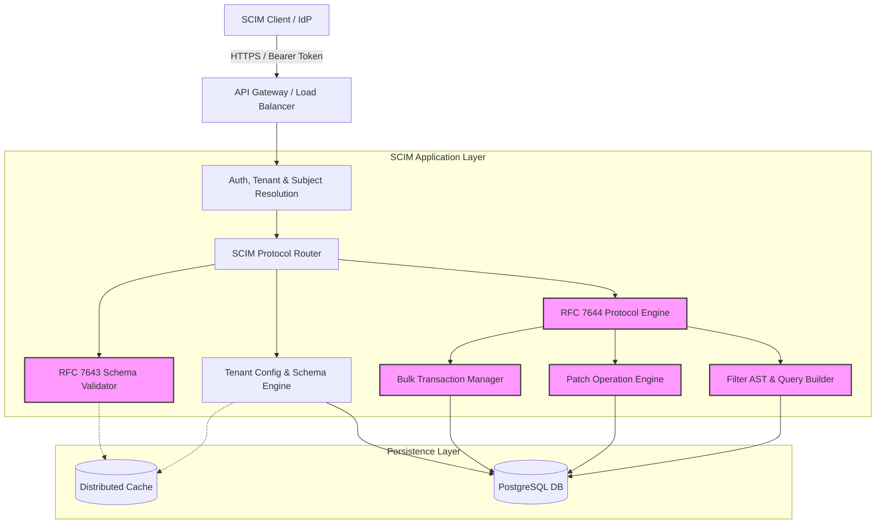

# Ideal Architecture & Design for a Multi-Tenant SCIM 2.0 Server

This document outlines a clean-slate, RFC-first architectural design for a multi-tenant SCIM 2.0 server. It strictly adheres to **RFC 7642 (Concepts)**, **RFC 7643 (Core Schema)**, and **RFC 7644 (Protocol)**, covering *all* SCIM functionality including Bulk operations, the `/Me` endpoint, advanced querying, and strict attribute mutability rules.

---

## 1. Core Architectural Principles

1. **RFC-First Domain Model:** The core domain entities are strictly modeled after RFC 7643 (Resource, Attribute, Schema, ResourceType).
2. **Tenant Isolation by Design:** Multi-tenancy is baked into the lowest persistence layer using Row-Level Security (RLS) and tenant-aware routing.
3. **Configuration-Driven Behavior:** Every tenant has an independent `ServiceProviderConfig` (RFC 7644 §4) and custom `Schemas` (RFC 7643 §2). The API behavior dynamically adapts to these flags.
4. **Hybrid Persistence (Relational + Document):** Uses a robust relational database (PostgreSQL) for strict tenant/metadata relationships, combined with `JSONB` for dynamic SCIM resource payloads and GIN indexing for fast RFC 7644 filtering.
5. **Stateless & Horizontally Scalable:** The API layer maintains no state. All tenant configurations are cached via distributed caches (e.g., Redis).

---

## 2. High-Level Architecture



---

## 3. Multi-Tenancy & Configuration Model

### 3.1. Tenant & Subject Resolution
* **Tenant Resolution:** The `Authorization: Bearer <token>` is decoded to extract the `tenant_id`.
* **Subject Resolution (for `/Me`):** The token also contains the `sub` (subject ID), mapping to a specific SCIM User ID for the `/Me` endpoint.

### 3.2. Independently Configurable Schema & API Flags
Each tenant possesses a configuration profile mapping to `/ServiceProviderConfig`.

```json
{
  "tenantId": "t-12345",
  "features": {
    "patch": { "supported": true },
    "bulk": { "supported": true, "maxOperations": 1000, "maxPayloadSize": 1048576 },
    "filter": { "supported": true, "maxResults": 200 },
    "changePassword": { "supported": true },
    "sort": { "supported": true },
    "etag": { "supported": true }
  }
}
```

---

## 4. Ideal Database Schema (PostgreSQL)

To support arbitrary schema extensions (RFC 7643 3.3) without schema migrations, a hybrid Relational + JSONB approach is required.

```sql
CREATE TABLE tenants (
    id UUID PRIMARY KEY DEFAULT gen_random_uuid(),
    name VARCHAR(255) NOT NULL
);

CREATE TABLE tenant_schemas (
    id UUID PRIMARY KEY DEFAULT gen_random_uuid(),
    tenant_id UUID REFERENCES tenants(id) ON DELETE CASCADE,
    schema_uri VARCHAR(255) NOT NULL,
    resource_type VARCHAR(50) NOT NULL,
    definition JSONB NOT NULL,
    UNIQUE(tenant_id, schema_uri)
);

CREATE TABLE scim_resources (
    id UUID PRIMARY KEY DEFAULT gen_random_uuid(),
    tenant_id UUID REFERENCES tenants(id) ON DELETE CASCADE,
    resource_type VARCHAR(50) NOT NULL, -- 'User', 'Group'
    external_id VARCHAR(255),
    user_name VARCHAR(255), -- Extracted for fast unique constraints
    version VARCHAR(255) NOT NULL, -- ETag
    data JSONB NOT NULL, -- Full SCIM payload
    created_at TIMESTAMPTZ DEFAULT NOW(),
    updated_at TIMESTAMPTZ DEFAULT NOW()
);

-- Row Level Security (RLS) for strict Tenant Isolation
ALTER TABLE scim_resources ENABLE ROW LEVEL SECURITY;
CREATE POLICY tenant_isolation_policy ON scim_resources 
    USING (tenant_id = current_setting('app.current_tenant')::UUID);

-- GIN Index for RFC 7644 Filtering on arbitrary JSONB attributes
CREATE INDEX idx_scim_data_gin ON scim_resources USING GIN (data jsonb_path_ops);
CREATE UNIQUE INDEX idx_scim_username_tenant ON scim_resources(tenant_id, user_name) WHERE resource_type = 'User';
CREATE INDEX idx_scim_external_id ON scim_resources(tenant_id, external_id);
```

---

## 5. Comprehensive API & Protocol Implementation

This section covers *all* endpoints and operations defined in RFC 7644.

### 5.1. Discovery Endpoints (RFC 7644 §4)
* `GET /ServiceProviderConfig`: Returns tenant-specific feature flags.
* `GET /Schemas`: Returns all schemas (Core User, Enterprise User, Group, plus tenant custom extensions).
* `GET /ResourceTypes`: Returns resource types, linking endpoints (`/Users`) to their respective schemas.

### 5.2. CRUD Operations (RFC 7644 §3.2, §3.3)
* **`POST /Users` & `POST /Groups` (Create):**
  * **Validation:** Enforces `required`, `type`, and `canonicalValues`.
  * **Mutability:** Rejects payloads containing `readOnly` attributes (e.g., `id`, `meta`).
  * **Uniqueness:** Checks `userName` and `externalId` against the DB.
* **`GET /Users/{id}` (Read):**
  * **Returnability:** Strips `writeOnly` attributes (e.g., `password`) and respects `never` or `request` return characteristics.
  * **ETags:** Evaluates `If-None-Match`. Returns `304 Not Modified` if matched.
* **`PUT /Users/{id}` (Replace):**
  * **Mutability:** Enforces `immutable` attributes (cannot be changed after POST).
  * **Concurrency:** Evaluates `If-Match` header against the DB `version`.
* **`DELETE /Users/{id}` (Delete):**
  * Hard deletes the row from `scim_resources` or sets an `active=false` flag depending on tenant compliance requirements.

### 5.3. Advanced Querying (RFC 7644 §3.4)
* **`GET /Users?filter=...` & `POST /.search`:**
  * `POST /.search` is supported at the root and resource level to handle massive query strings that exceed HTTP GET limits.
  * **Filtering:** Parses SCIM filters (`eq`, `co`, `sw`, `pr`, `gt`, `and`, `or`, `not`, `[ ]`) into an Abstract Syntax Tree (AST), translating them into PostgreSQL `jsonb_path_ops` queries.
  * **Sorting (`sortBy`, `sortOrder`):** Translates to SQL `ORDER BY data #> '{name, familyName}' ASC`.
  * **Pagination (`startIndex`, `count`):** Translates to SQL `OFFSET (startIndex - 1) LIMIT count`.
  * **Projection (`attributes`, `excludedAttributes`):** Prunes the JSONB payload before returning to the client to save bandwidth.

### 5.4. The PATCH Engine (RFC 7644 §3.5.2)
PATCH is executed via an in-memory JSON patch engine.
1. **Fetch:** Retrieve current `data` from DB.
2. **Evaluate:** For each operation (`add`, `replace`, `remove`):
   * If `path` has a value selection filter (e.g., `emails[type eq "work"].value`), evaluate the filter against the current JSON to find target indices.
3. **Validate:** Run the mutated JSON object through the Schema Validator to ensure constraints aren't violated.
4. **Persist:** Update DB, bump `meta.lastModified` and `meta.version`.

### 5.5. Bulk Operations (RFC 7644 §3.7)
* **`POST /Bulk`:** Allows clients to send multiple operations (POST, PUT, PATCH, DELETE) in a single request.
* **Transaction Management:** 
  * Operations are processed sequentially or in parallel depending on dependencies (`bulkId`).
  * If `failOnErrors` is specified, the engine tracks errors and halts processing when the threshold is reached.
  * **Cross-Referencing:** Supports `bulkId` resolution (e.g., creating a User with `bulkId: 1`, and immediately adding them to a Group in the same request using `"value": "bulkId:1"`).

### 5.6. Authenticated Subject Alias (RFC 7644 §3.11)
* **`/Me` Endpoint:** Allows a user to manage their own profile without knowing their SCIM ID.
* **Resolution:** The API Gateway extracts the `sub` claim from the Bearer token, looks up the corresponding `scim_resources.id`, and internally rewrites the request to `/Users/{id}`.
* Supports GET, PUT, PATCH, and DELETE (if self-deletion is allowed by tenant config).

---

## 6. Schema & Attribute Management (RFC 7643)

The Schema Validator is the heart of the system. It strictly enforces RFC 7643 attribute characteristics:

1. **Mutability:**
   * `readOnly`: Ignored on POST/PUT/PATCH. Generated by the server (e.g., `id`, `meta`).
   * `readWrite`: Standard behavior.
   * `immutable`: Accepted on POST. Rejected on PUT/PATCH if the value changes.
   * `writeOnly`: Accepted on POST/PUT/PATCH. *Never* returned in GET responses (e.g., `password`).
2. **Returned:**
   * `always`: Always included in responses (e.g., `id`).
   * `never`: Never included (e.g., `password`).
   * `default`: Included unless excluded by `excludedAttributes`.
   * `request`: Only included if explicitly requested via `attributes`.
3. **Uniqueness:**
   * `none`: No checks.
   * `server`: Unique within the tenant (e.g., `userName`). Enforced via DB Unique Indexes.
   * `global`: Unique across all tenants (rare, but supported).

---

## 7. Security & Rate Limiting (RFC 7644 §7)

* **Authentication:** Strictly OAuth 2.0 Bearer Tokens.
* **Authorization:** Scopes dictate access (e.g., `scim.read`, `scim.write`, `scim.me`).
* **Rate Limiting:** Applied per-tenant and per-IP at the API Gateway to prevent noisy-neighbor problems in the multi-tenant environment.
* **CORS:** Configurable per-tenant if browser-based SCIM clients are utilized.

---

## 8. Advanced Design Principles

### 8.1. Filter Parsing via AST (Abstract Syntax Tree)
Do not use Regex to parse SCIM filters. Use a formal parser (like PEG.js or ANTLR) to generate an AST.
* **Input:** `userType eq "Employee" and (emails co "example.com" or emails.value co "example.org")`
* **Translation:** The AST is traversed using the Visitor Pattern to generate the target database query (e.g., PostgreSQL `jsonb_path_ops`), ensuring complex nested groupings `()` are handled flawlessly.

### 8.2. Extensibility via "Schema Overlays"
Instead of hardcoding the Core User schema, the system boots with a "Base Schema". When a tenant is created, they receive a copy of the Base Schema in `tenant_schemas`. 
If a tenant wants to add a custom attribute (e.g., `urn:ietf:params:scim:schemas:extension:custom:2.0:User:badgeNumber`), they simply add a new row to `tenant_schemas`. The Schema Validator dynamically loads this at runtime, instantly allowing validation, storage, and filtering of `badgeNumber` without a single line of code change or DB migration.
