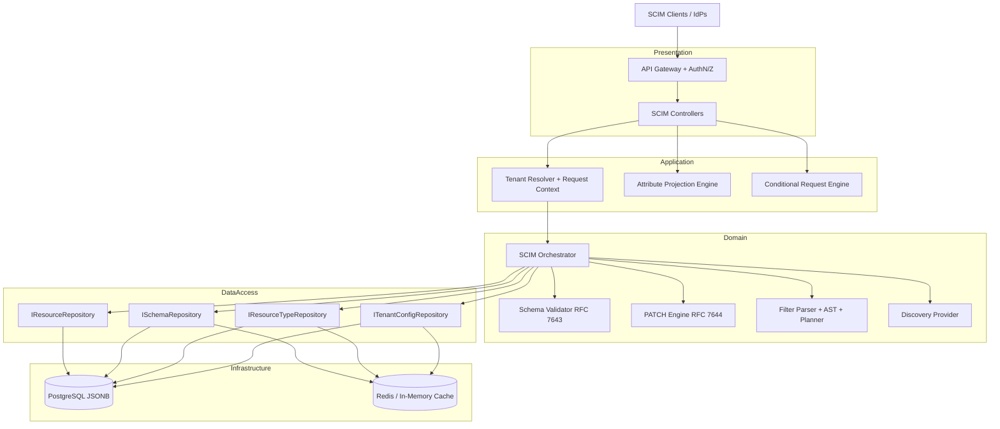
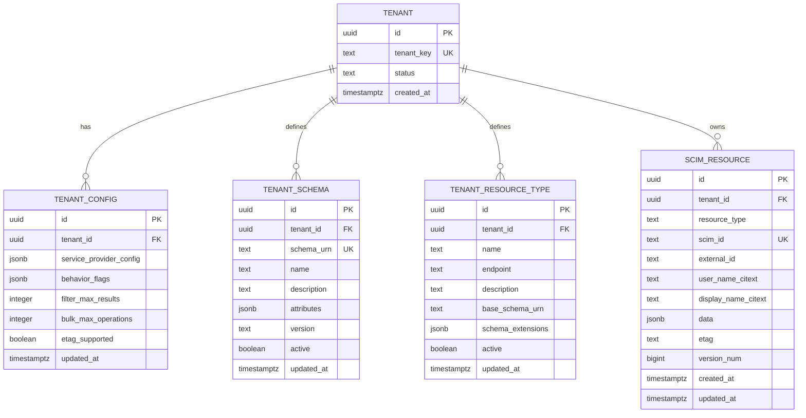
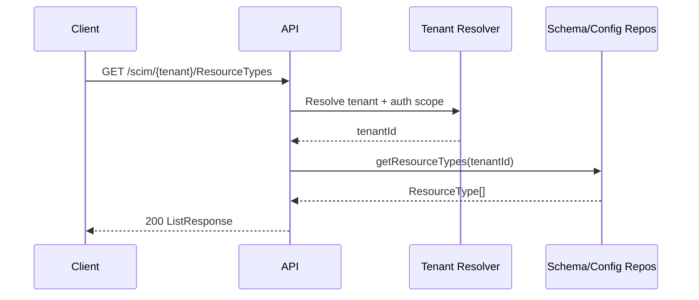

# Ideal SCIM 2.0 Multi-Tenant Architecture (RFC-First, Fresh Design)

Status: Draft (fresh redesign)
Last Updated: 2026-02-20
Scope: RFC-first ideal target for a multi-tenant SCIM 2.0 server with independently configurable schema and behavior flags per tenant.

---

## 1) Design Goals

1. Strict protocol and schema correctness for RFC 7643 and RFC 7644.
2. Hard multi-tenant isolation (data, schema, behavior, and throttling boundaries).
3. Dynamic schema and ResourceType discovery with no code changes per tenant.
4. High query efficiency for SCIM filters and pagination at scale.
5. Extensible behavior through tenant-level policy/config flags.
6. Persistence-agnostic domain via Repository Pattern, with a recommended concrete implementation.
7. Operational simplicity: debuggability, observability, safe migrations, and predictable performance.

---

## 2) RFC Scope and What Must Be Implemented

### RFC 7643 (Core Schema)
- Attribute characteristics: `type`, `multiValued`, `required`, `canonicalValues`, `caseExact`, `mutability`, `returned`, `uniqueness`, `referenceTypes`, and nested `subAttributes`.
- Core resources: User, Group, Enterprise User extension (and custom extensions).
- ResourceType and Schema definitions must be discoverable.

### RFC 7644 (Protocol)
- CRUD for resources and list/search operations.
- `POST /.search` parity with list semantics.
- Filter grammar and semantics (`eq`, `ne`, `co`, `sw`, `ew`, `gt`, `ge`, `lt`, `le`, `pr`, `and`, `or`, `not`, grouping, valuePath).
- PATCH semantics including multi-valued filtering paths.
- ETag/conditional requests (`If-Match`, `If-None-Match`).
- Discovery endpoints: `/ServiceProviderConfig`, `/Schemas`, `/ResourceTypes`.
- Optional endpoints/features: `/Bulk`, `/Me` (recommended if supported).

---

## 3) Target Architecture (N-Tier, Repository Pattern)



### Why this split
- Protocol logic is isolated from persistence logic.
- Any persistence technology can implement repository interfaces.
- Multi-tenant concerns are centralized in request context and repository scoping.

---

## 4) Persistence Strategy (Recommended Concrete Choice)

### Recommended: PostgreSQL + JSONB + targeted relational columns

Why:
- JSONB supports recursive schema/attribute definitions and dynamic extension payloads.
- GIN indexes support efficient filtering on JSON paths.
- CITEXT supports case-insensitive uniqueness and comparisons.
- Mature transactions and concurrency model for `/Bulk` and ETag workflows.

### Data modeling principle
Use hybrid modeling:
- Relational columns for frequently filtered identity fields and tenancy keys.
- JSONB for dynamic SCIM content and schema definitions.

---

## 5) Ideal Database Schema (Conceptual)



### Key indexes
- `(tenant_id, resource_type, scim_id)` unique.
- `(tenant_id, resource_type, external_id)` unique where non-null.
- `(tenant_id, resource_type, user_name_citext)` unique where applicable.
- `GIN(data jsonb_path_ops)` for filter pushdown.
- Additional expression indexes for frequent filters (e.g., emails value/type, members value).

---

## 6) Relation: ResourceTypes ↔ Schemas ↔ Attribute Definitions

1. `TenantResourceType.base_schema_urn` points to one schema document in `TenantSchema.schema_urn`.
2. `TenantResourceType.schema_extensions[]` points to 0..N extension schema URNs.
3. Each `TenantSchema.attributes` JSONB contains complete recursive attribute definitions.
4. Effective validation model for a resource type = `base schema` + `extensions` (merged by URN path).
5. Reuse: one extension schema can be attached to multiple resource types in same tenant.

This relation is the core of dynamic discovery and validation.

---

## 7) Discovery APIs (Mandatory)

### `GET /ServiceProviderConfig`
Must return tenant-specific capability declaration:
- patch support
- bulk support and limits
- filter support and limits
- sort support
- etag support
- auth schemes

### `GET /Schemas`
Must return all active schema definitions for tenant.
Each schema includes full attribute definitions and characteristics.

### `GET /ResourceTypes`
Must return all active resource types for tenant.
Each resource type references base schema and schema extensions and endpoint URI.

### Discovery flow



---

## 8) Resource API Surface (Ideal)

Per resource type endpoint:
- `POST /{ResourceType}` create
- `GET /{ResourceType}` list
- `POST /{ResourceType}/.search` search
- `GET /{ResourceType}/{id}` read
- `PUT /{ResourceType}/{id}` replace
- `PATCH /{ResourceType}/{id}` partial update
- `DELETE /{ResourceType}/{id}` delete

Optional:
- `POST /Bulk`
- `GET|PATCH /Me`

### Required headers and content
- Request/response content type: `application/scim+json`.
- ETag on resource responses.
- Respect `If-Match` and `If-None-Match` semantics.

---

## 9) Filter Engine and Query Planning

### Pipeline
1. Parse SCIM filter string into AST.
2. Validate attribute paths against effective schema.
3. Plan pushdown by translating AST to datastore query.
4. Execute fully in database whenever possible.
5. Avoid full dataset fetch + in-memory filtering except for tightly bounded fallback.

### Example
Filter:
```text
emails[type eq "work" and value co "@example.com"] and active eq true
```

Planner output (conceptual):
- JSON path predicate on `data.emails[*]` + scalar predicate on `active`.
- Uses GIN index and expression indexes where available.

---

## 10) PATCH Engine (RFC 7644) Ideal Behavior

### Steps
1. Load existing resource and effective schema.
2. Pre-check conditional headers (`If-Match`).
3. For each operation (`add`, `replace`, `remove`):
   - Parse SCIM path (including valuePath filters).
   - Resolve target nodes against current document.
   - Apply mutation.
4. Revalidate full mutated object against schema constraints.
5. Persist atomically; bump version and ETag.

### Why full revalidation
Prevents invalid end-state after legal individual operations.

---

## 11) Attribute Characteristic Enforcement Matrix

- `type`: strict type checks with coercion policy explicitly defined.
- `multiValued`: array-only enforcement when true.
- `required`: enforced at create and post-patch final state.
- `caseExact`: controls equality/uniqueness comparison mode.
- `mutability`:
  - `readOnly` rejected/ignored on writes.
  - `immutable` set-once, then locked.
  - `writeOnly` accepted but omitted in output.
- `returned`: `always|never|default|request` response shaping.
- `uniqueness`: `none|server|global` backed by repository constraints.
- `canonicalValues`: whitelist validation.
- `referenceTypes`: allowed target resource-type validation.

---

## 12) Tenant Config Flags (Behavior Policy Layer)

Tenant config should be explicit and typed. Example:

```json
{
  "patch": { "supported": true },
  "bulk": { "supported": true, "maxOperations": 500, "maxPayloadSize": 1048576 },
  "filter": { "supported": true, "maxResults": 200 },
  "etag": { "supported": true },
  "behaviorFlags": {
    "strictMode": true,
    "legacyMode": false,
    "verbosePatchSupported": true,
    "excludeMeta": false,
    "excludeSchemas": false
  }
}
```

Rules:
- Discovery responses must reflect actual effective behavior.
- Unsupported capabilities must be advertised as unsupported.
- Behavior flags must not violate RFC semantics (they can narrow behavior, not break protocol contracts).

---

## 13) Security and Isolation

- Tenant isolation key enforced on every data access path.
- Strong auth for SCIM APIs (OAuth bearer preferred; shared secret mode controlled and auditable).
- Secret values never echoed in logs.
- Per-tenant request rate limiting and abuse controls.
- Audit logging for write operations and admin config changes.

---

## 14) Observability and Operations

- Structured logs with requestId, tenantId, resourceType, operation, status.
- Metrics: p95 latency by endpoint and tenant, filter pushdown ratio, patch failure reason categories.
- Trace critical flows: filter parse/plan/execute, patch apply/validate/persist, discovery load/cache.
- Background schema cache invalidation on schema/resource type updates.

---

## 15) Why this architecture is optimal

- Simplicity: clear separation of protocol, domain, and persistence concerns.
- Extensibility: add schemas/resource types via data, not code.
- Efficiency: query pushdown + indexed JSONB avoids full scans.
- Compliance: discovery, validation, filtering, patch, and ETag are first-class.
- Portability: Repository Pattern keeps domain independent from persistence technology.

---

## 16) RFC/Design References

- RFC 7642: SCIM Concepts and Use Cases.
- RFC 7643: Core Schema.
- RFC 7644: Protocol (operations, filters, patch, discovery, versioning).
- HTTP conditional request semantics (`ETag`, `If-Match`, `If-None-Match`).
- Multi-tenant SaaS design principles (isolation, config-as-data, policy-driven behavior).
