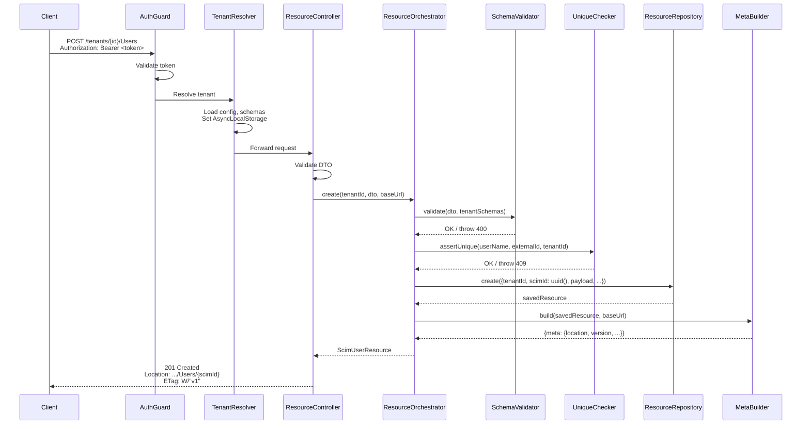
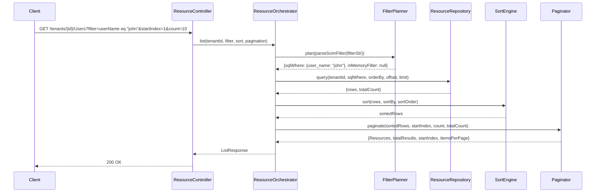
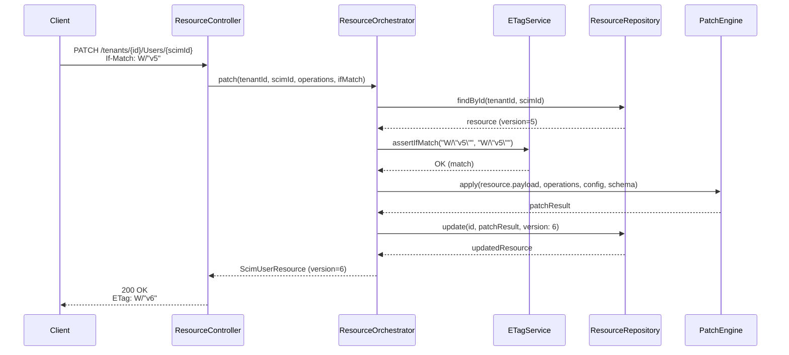

# Ideal Multi-Tenant SCIM 2.0 Server — RFC-First Architecture v3

> **Version**: 3.0 · **Date**: 2026-02-20
> **Approach**: Ground-up, RFC-first. No legacy assumptions.
> **RFCs**: 7642 (Concepts), 7643 (Core Schema), 7644 (Protocol)

---

## Table of Contents

1. [Design Principles](#1-design-principles)
2. [System Context & Deployment Topology](#2-system-context--deployment-topology)
3. [Layered Architecture](#3-layered-architecture)
4. [Tenant Model & Isolation](#4-tenant-model--isolation)
5. [Database Schema (PostgreSQL)](#5-database-schema-postgresql)
6. [Discovery Endpoints (RFC 7644 §4)](#6-discovery-endpoints-rfc-7644-4)
7. [Resource CRUD Operations (RFC 7644 §3)](#7-resource-crud-operations-rfc-7644-3)
8. [PATCH Engine (RFC 7644 §3.5.2)](#8-patch-engine-rfc-7644-352)
9. [Filtering & Query (RFC 7644 §3.4.2)](#9-filtering--query-rfc-7644-342)
10. [Attribute Projection (RFC 7644 §3.4.2.5)](#10-attribute-projection-rfc-7644-3425)
11. [Sorting & Pagination (RFC 7644 §3.4.2.3–4)](#11-sorting--pagination-rfc-7644-3423-4)
12. [ETag & Conditional Requests (RFC 7644 §3.14)](#12-etag--conditional-requests-rfc-7644-314)
13. [Bulk Operations (RFC 7644 §3.7)](#13-bulk-operations-rfc-7644-37)
14. [Authentication & Authorization](#14-authentication--authorization)
15. [API Route Map](#15-api-route-map)
16. [Non-Functional Requirements](#16-non-functional-requirements)
17. [Appendix A — Complete Mermaid Diagrams](#17-appendix-a--complete-mermaid-diagrams)
18. [Appendix B — Example JSON Payloads](#18-appendix-b--example-json-payloads)

---

## 1. Design Principles

| # | Principle | Rationale |
|---|-----------|-----------|
| P1 | **RFC-First** | Every API decision traces to a specific RFC section. Non-compliance is an explicit, documented deviation. |
| P2 | **Simplicity** | Each concern has exactly one owner. No flag-branching inside domain logic; behavior variation lives in configuration, not `if` blocks. |
| P3 | **Extensibility** | New resource types (Device, Application) require zero code changes — only `tenant_schema` + `tenant_resource_type` rows. |
| P4 | **Persistence Agnosticism** | Domain logic depends only on Repository interfaces. PostgreSQL, SQLite, or DynamoDB can be swapped without touching business rules. |
| P5 | **Optimal Efficiency** | Filters are pushed to the database. In-memory fallback is a measurable exception, not the default. |
| P6 | **Tenant Isolation** | Each tenant (endpoint) has independent schema definitions, config flags, resources, and log streams. Cross-tenant data leakage is structurally impossible. |
| P7 | **Fail-Safe Defaults** | Strict mode by default. Lenient flags are opt-in per tenant, never global. |

---

## 2. System Context & Deployment Topology

```
┌──────────────────────────────────────────────────────────────────┐
│                     Identity Providers                           │
│  ┌───────────┐  ┌───────────┐  ┌───────────┐  ┌──────────────┐ │
│  │ Entra ID  │  │  Okta     │  │  OneLogin │  │  Custom IdP  │ │
│  └─────┬─────┘  └─────┬─────┘  └─────┬─────┘  └──────┬───────┘ │
│        │              │              │               │          │
└────────┼──────────────┼──────────────┼───────────────┼──────────┘
         │  HTTPS + Bearer Token (OAuth2 / Shared Secret)
         ▼              ▼              ▼               ▼
    ┌────────────────────────────────────────────────────────┐
    │              SCIM 2.0 Server (NestJS)                  │
    │  ┌─────────────────────────────────────────────────┐   │
    │  │  /scim/v2/tenants/{tenantId}/Users              │   │
    │  │  /scim/v2/tenants/{tenantId}/Groups             │   │
    │  │  /scim/v2/tenants/{tenantId}/ServiceProviderConfig │ │
    │  │  /scim/v2/tenants/{tenantId}/Schemas            │   │
    │  │  /scim/v2/tenants/{tenantId}/ResourceTypes      │   │
    │  │  /scim/v2/tenants/{tenantId}/Bulk               │   │
    │  │  /scim/v2/tenants/{tenantId}/Me                 │   │
    │  └──────────────────────┬──────────────────────────┘   │
    │                         │                              │
    │  ┌──────────────────────▼──────────────────────────┐   │
    │  │            PostgreSQL / Redis                    │   │
    │  └─────────────────────────────────────────────────┘   │
    └────────────────────────────────────────────────────────┘
```

**Why NestJS?** Structured dependency injection, decorator-driven routing, interceptor pipeline, and first-class TypeScript support align with the layered architecture below.

**Why PostgreSQL?** JSONB for schema-flexible resource payloads, GIN indexing for filter push-down, CITEXT for RFC 7643 §2.1 case-insensitive attributes, row-level locking for concurrent writes, and `pg_trgm` for `co`/`sw`/`ew` operators.

---

## 3. Layered Architecture

```
┌─────────────────────────────────────────────────────────────────┐
│ PRESENTATION LAYER                                               │
│  Controllers · Guards · Interceptors · Pipes · Exception Filter  │
│  - Route requests to correct handler                             │
│  - Authenticate (OAuth2 JWT / Shared Secret)                     │
│  - Set Content-Type: application/scim+json                       │
│  - Set ETag, Location, If-Match/If-None-Match headers            │
│  - Apply attribute projection (§3.4.2.5)                         │
├─────────────────────────────────────────────────────────────────┤
│ APPLICATION LAYER                                                │
│  TenantResolver · ResourceOrchestrator · BulkProcessor           │
│  - Resolve tenant context from route parameter                   │
│  - Coordinate create/read/update/delete flows                    │
│  - Delegate to domain services                                   │
│  - Manage database transactions                                  │
├─────────────────────────────────────────────────────────────────┤
│ DOMAIN LAYER (no framework imports)                              │
│  PatchEngine · FilterPlanner · SchemaValidator · MetaBuilder     │
│  DiscoveryService · ETagService · SortEngine                     │
│  - Pure business logic + RFC rule enforcement                    │
│  - Depends ONLY on Repository interfaces (ports)                 │
│  - Unit-testable without database or HTTP                        │
├─────────────────────────────────────────────────────────────────┤
│ DATA ACCESS LAYER                                                │
│  Repository Interfaces (Ports)                                   │
│  ┌──────────────────────────┐ ┌─────────────────────────┐       │
│  │ IResourceRepository      │ │ ITenantRepository       │       │
│  │ ISchemaRepository         │ │ IResourceTypeRepository │       │
│  │ IMembershipRepository     │ │ IRequestLogRepository   │       │
│  └──────────────────────────┘ └─────────────────────────┘       │
├─────────────────────────────────────────────────────────────────┤
│ INFRASTRUCTURE LAYER                                             │
│  PostgresResourceRepository · PostgresTenantRepository           │
│  PostgresSchemaRepository · RedisCache · PrismaClient            │
│  - Concrete implementations of repository interfaces             │
│  - Database-specific query building                              │
│  - Connection pooling, retry logic                               │
└─────────────────────────────────────────────────────────────────┘
```

### Why This Layering?

| Layer | Depends On | Never Depends On | RFC Reference |
|-------|-----------|------------------|---------------|
| Presentation | Application | Domain, Infrastructure | §3.1, §3.12 |
| Application | Domain, Repository interfaces | Infrastructure | §3.3, §3.7 |
| Domain | Repository interfaces only | Framework, DB | §3.5.2, §3.4.2 |
| Infrastructure | External libraries | Domain logic | — |

**Key rule**: Domain layer has **zero** imports from `@nestjs/*`, `@prisma/*`, or any database driver. This ensures:
- Unit tests run in <100ms with in-memory mocks
- Database can be swapped without touching SCIM logic
- RFC compliance is provable in isolation

---

## 4. Tenant Model & Isolation

Each **tenant** (called "endpoint" in the current codebase) is a fully isolated SCIM service provider with its own:

| Concern | Isolation Mechanism | RFC Reference |
|---------|-------------------|---------------|
| Schema definitions | `tenant_schema` rows per tenant | §7643 §7 |
| Resource types | `tenant_resource_type` rows per tenant | §7643 §6 |
| Config flags | `tenant.config` JSONB column | — |
| Resources (Users/Groups) | `scim_resource.tenant_id` foreign key | §7644 §3 |
| Request logs | `request_log.tenant_id` foreign key | — |
| Auth credentials | `tenant_credential` rows per tenant | — |

### Current State Assessment — What's Already Strong

> _Sourced from per-endpoint isolation audit — see `SCIM_EXTENSIONS_DEEP_ANALYSIS.md` §2A for detailed 4-layer analysis._

The current codebase already provides **architecturally sound multi-tenant isolation** across 4 layers:

| Layer | Mechanism | Assessment |
|-------|-----------|------------|
| **Database** | Composite unique constraints (`endpointId` + `userName`/`displayName`); FK cascades ensure `ON DELETE CASCADE` from endpoint → resources | **Strong** — no cross-tenant data leakage possible |
| **URL** | `@Controller('endpoints/:endpointId')` prefix on all resource controllers | **Strong** — every request is scoped by URL parameter |
| **Runtime** | `AsyncLocalStorage` carries `endpointId` through the request lifecycle | **Strong** — service layer always has tenant context |
| **Config** | Per-endpoint JSON blob (`EndpointService.getConfig()`) stores tenant-specific flags | **Partial** — blob is loaded correctly but 7 of 12 flags are dead code (see G20) |

**One gap remains:** The **discovery layer** (`/Schemas`, `/ResourceTypes`, `/ServiceProviderConfig`) ignores per-endpoint config entirely — it returns the same hardcoded response for all tenants. This is addressed by Phase 6 of the Migration Plan.

### Tenant Config Flags (JSONB)

```jsonc
{
  // PATCH behavior
  "multiMemberPatchAdd": true,          // Allow multi-member add in single op
  "multiMemberPatchRemove": true,       // Allow multi-member remove in single op
  "allowRemoveAllMembers": true,        // Allow remove path=members without filter
  "verbosePatchSupported": false,       // Enable dot-notation path resolution
  
  // Response shaping
  "excludeMeta": false,                 // Omit meta from responses
  "excludeSchemas": false,              // Omit schemas from responses
  "includeEnterpriseSchema": true,      // Auto-attach enterprise extension schema
  
  // Compliance mode
  "strictMode": true,                   // Enforce If-Match, reject unknown attributes
  "legacyMode": false,                  // SCIM 1.1 compatibility
  
  // Custom schema URN
  "customSchemaUrn": null,              // Override base URN prefix
  
  // Logging
  "logLevel": "INFO"                    // Per-tenant log level override
}
```

### Config Flag Effect Matrix

| Flag | Affects | Default | When `true` | When `false` |
|------|---------|---------|-------------|--------------|
| `multiMemberPatchAdd` | PATCH Groups | `false` | Allow `[{value:"a"},{value:"b"}]` in single `add` op | Each member requires separate op |
| `multiMemberPatchRemove` | PATCH Groups | `false` | Allow multi-member `remove` value array | Each removal requires separate op |
| `allowRemoveAllMembers` | PATCH Groups | `true` | `remove` path=members without filter removes all | Rejects; must specify filter |
| `verbosePatchSupported` | PATCH Users | `false` | `name.givenName` → navigate into nested object | `name.givenName` stored as flat key |
| `strictMode` | All mutations | `true` | If-Match required; unknown attrs rejected | Lenient; If-Match optional |
| `includeEnterpriseSchema` | All User responses | `false` | Enterprise schema URN auto-appended to `schemas` array | Only core schema listed |
| `excludeMeta` | All responses | `false` | `meta` block omitted from response body | `meta` included per RFC |
| `excludeSchemas` | All responses | `false` | `schemas` array omitted from response body | `schemas` included per RFC |
| `legacyMode` | All operations | `false` | SCIM 1.1 compat (e.g., `id` as `externalId`) | Full 2.0 behavior |

---

## 5. Database Schema (PostgreSQL)

### Entity Relationship Diagram

```
┌──────────────┐     ┌─────────────────┐     ┌─────────────────────┐
│   tenant     │──┐  │  tenant_schema  │     │ tenant_resource_type │
│──────────────│  │  │─────────────────│     │─────────────────────│
│ id (PK)      │  │  │ id (PK)         │     │ id (PK)             │
│ name (UQ)    │  ├─>│ tenant_id (FK)  │  ┌─>│ tenant_id (FK)      │
│ display_name │  │  │ schema_urn (UQ) │  │  │ name                │
│ config JSONB │  │  │ name            │  │  │ endpoint             │
│ active       │  │  │ description     │  │  │ description          │
│ created_at   │  │  │ attributes JSONB│  │  │ base_schema_urn(FK)  │
│ updated_at   │  │  │ created_at      │  │  │ schema_extensions    │
└──────────────┘  │  └─────────────────┘  │  │   JSONB              │
                  │                        │  │ created_at           │
                  ├────────────────────────┘  └─────────────────────┘
                  │
                  │  ┌─────────────────────────────┐
                  │  │       scim_resource          │
                  │  │─────────────────────────────│
                  ├─>│ id (PK)                     │
                  │  │ tenant_id (FK)              │
                  │  │ resource_type VARCHAR        │  ← "User" or "Group"
                  │  │ scim_id UUID (UQ per tenant) │
                  │  │ external_id VARCHAR          │
                  │  │ display_name CITEXT          │
                  │  │ user_name CITEXT             │  ← NULL for Groups
                  │  │ active BOOLEAN               │
                  │  │ payload JSONB                │  ← Full SCIM resource body
                  │  │ version INT                  │  ← Monotonic for ETag
                  │  │ created_at TIMESTAMPTZ       │
                  │  │ updated_at TIMESTAMPTZ       │
                  │  └──────────────┬──────────────┘
                  │                 │
                  │  ┌──────────────▼──────────────┐
                  │  │      resource_member         │
                  │  │─────────────────────────────│
                  │  │ id (PK)                     │
                  │  │ group_resource_id (FK)       │
                  │  │ member_resource_id (FK,NULL)│
                  │  │ value VARCHAR               │  ← SCIM id of member
                  │  │ display VARCHAR              │
                  │  │ type VARCHAR                 │
                  │  │ created_at                   │
                  │  └─────────────────────────────┘
                  │
                  │  ┌─────────────────────────────┐
                  │  │      tenant_credential       │
                  │  │─────────────────────────────│
                  ├─>│ id (PK)                     │
                  │  │ tenant_id (FK)              │
                  │  │ credential_type VARCHAR      │ ← "bearer" / "oauth_client"
                  │  │ credential_hash VARCHAR      │
                  │  │ metadata JSONB               │ ← {clientId, scopes, ...}
                  │  │ active BOOLEAN               │
                  │  │ created_at / expires_at      │
                  │  └─────────────────────────────┘
                  │
                  │  ┌─────────────────────────────┐
                  │  │       request_log            │
                  │  │─────────────────────────────│
                  └─>│ id (PK)                     │
                     │ tenant_id (FK, nullable)     │
                     │ method, url, status          │
                     │ duration_ms                  │
                     │ request_headers JSONB         │
                     │ request_body JSONB            │
                     │ response_body JSONB           │
                     │ identifier VARCHAR            │
                     │ created_at TIMESTAMPTZ        │
                     └─────────────────────────────┘
```

### Detailed Column Descriptions

#### `tenant` table

| Column | Type | Constraints | Purpose |
|--------|------|-------------|---------|
| `id` | `UUID` | PK, default gen_random_uuid() | Internal identifier |
| `name` | `VARCHAR(100)` | UNIQUE, NOT NULL | URL-safe slug: `/tenants/{name}` |
| `display_name` | `VARCHAR(255)` | Nullable | Human-readable title |
| `description` | `TEXT` | Nullable | Purpose / notes |
| `config` | `JSONB` | DEFAULT '{}' | Behavior flags (see §4 matrix) |
| `active` | `BOOLEAN` | DEFAULT true | Inactive tenants reject all requests |
| `created_at` | `TIMESTAMPTZ` | DEFAULT now() | Audit trail |
| `updated_at` | `TIMESTAMPTZ` | Auto-updated | Audit trail |

#### `scim_resource` table

| Column | Type | Constraints | Purpose |
|--------|------|-------------|---------|
| `id` | `UUID` | PK | Internal storage ID (never exposed to clients) |
| `tenant_id` | `UUID` | FK→tenant(id), CASCADE | Tenant isolation |
| `resource_type` | `VARCHAR(50)` | NOT NULL | Discriminator: "User", "Group", etc. |
| `scim_id` | `UUID` | UQ(tenant_id, scim_id) | SCIM `id` field, exposed to clients |
| `external_id` | `VARCHAR(255)` | UQ(tenant_id, external_id) WHERE NOT NULL | IdP-assigned identifier |
| `user_name` | `CITEXT` | UQ(tenant_id, user_name) WHERE NOT NULL | RFC 7643 §4.1: case-insensitive |
| `display_name` | `CITEXT` | | RFC 7643 §4.1.1 / §4.2 |
| `active` | `BOOLEAN` | DEFAULT true | User active status |
| `payload` | `JSONB` | NOT NULL | Complete resource body (emails, addresses, extension attrs, etc.) |
| `version` | `INT` | DEFAULT 1 | Monotonically incremented; feeds ETag `W/"v{version}"` |
| `created_at` | `TIMESTAMPTZ` | DEFAULT now() | `meta.created` |
| `updated_at` | `TIMESTAMPTZ` | Auto-updated via trigger | `meta.lastModified` |

### Design Decisions

| Decision | Rationale |
|----------|-----------|
| **Unified `scim_resource` table** | User and Group are both SCIM resources. One table with `resource_type` discriminator avoids N tables per resource type and enables generic repository logic. Adding "Device" requires zero DDL. |
| **`payload JSONB`** | SCIM resources have open-ended attributes (§7643 §2). Relational columns for each attribute would require ALTER TABLE for every schema change. JSONB supports GIN indexing for filter queries. |
| **First-class indexed columns (`user_name`, `display_name`, `external_id`)** | Attributes that appear in `eq` filters or uniqueness constraints deserve indexed columns for O(log n) lookup instead of JSONB scan. |
| **`CITEXT` type** | RFC 7643 §2.1: `userName` has `caseExact: false`. PostgreSQL CITEXT provides transparent case-insensitive comparison without lowercase helper columns. |
| **`version INT`** | Monotonic integer incremented on every write. Generates deterministic ETags: `W/"v{version}"`. Avoids timestamp-based collisions. |
| **`tenant_schema.attributes JSONB`** | Schema attributes (§7643 §7) are a recursive tree (attribute → subAttributes → subAttributes…). JSONB is the natural representation. |
| **`tenant_resource_type.schema_extensions JSONB`** | ResourceType→Schema links (§7643 §6) include `{schema, required}` pairs. An array of these in JSONB avoids a join table. |
| **Partial unique indexes** | `external_id` may be NULL for resources not synced from an IdP. PostgreSQL partial unique index (`WHERE external_id IS NOT NULL`) enforces uniqueness only on non-null values. |

### Indexing Strategy

```sql
-- Uniqueness (per-tenant)
CREATE UNIQUE INDEX idx_resource_tenant_scimid 
  ON scim_resource(tenant_id, scim_id);
CREATE UNIQUE INDEX idx_resource_tenant_username 
  ON scim_resource(tenant_id, user_name) WHERE user_name IS NOT NULL;
CREATE UNIQUE INDEX idx_resource_tenant_externalid 
  ON scim_resource(tenant_id, external_id) WHERE external_id IS NOT NULL;
CREATE UNIQUE INDEX idx_resource_tenant_displayname_group
  ON scim_resource(tenant_id, display_name)
  WHERE resource_type = 'Group';

-- Filter push-down (GIN on JSONB)
CREATE INDEX idx_resource_payload_gin 
  ON scim_resource USING GIN (payload jsonb_path_ops);

-- Trigram for co/sw/ew operators
CREATE EXTENSION IF NOT EXISTS pg_trgm;
CREATE INDEX idx_resource_displayname_trgm 
  ON scim_resource USING GIN (display_name gin_trgm_ops);
CREATE INDEX idx_resource_username_trgm 
  ON scim_resource USING GIN (user_name gin_trgm_ops);

-- Type partitioning for common queries
CREATE INDEX idx_resource_tenant_type 
  ON scim_resource(tenant_id, resource_type);

-- Foreign key lookups for membership
CREATE INDEX idx_member_group ON resource_member(group_resource_id);
CREATE INDEX idx_member_member ON resource_member(member_resource_id);

-- Request log time-series
CREATE INDEX idx_log_created ON request_log(created_at DESC);
CREATE INDEX idx_log_tenant ON request_log(tenant_id);

-- Schema/ResourceType lookups
CREATE UNIQUE INDEX idx_schema_tenant_urn 
  ON tenant_schema(tenant_id, schema_urn);
CREATE UNIQUE INDEX idx_rt_tenant_name 
  ON tenant_resource_type(tenant_id, name);
```

### Why Not Separate User/Group Tables?

RFC 7644 §3 defines operations generically for **any** resource type. The PATCH, filter, and projection logic is identical regardless of type. A unified `scim_resource` table:

1. Enables a single `IResourceRepository` interface
2. Eliminates code duplication between User service and Group service
3. Makes adding new resource types (Device, Application) a configuration task, not a code change
4. Keeps the member relationship simple: group → member → another resource in the same table

The `resource_type` discriminator + nullable type-specific columns (`user_name` for Users) handle the variation.

---

## 6. Discovery Endpoints (RFC 7644 §4)

RFC 7644 §4 mandates three discovery endpoints at every SCIM root. In our multi-tenant model, each tenant's root is `/scim/v2/tenants/{tenantId}/`.

### 6.1 ServiceProviderConfig (§4.2)

**Purpose**: Declares server capabilities so clients can adapt behavior.

**Source**: `tenant.config` JSONB → mapped to SCIM ServiceProviderConfig format by `DiscoveryService`.

```
GET /scim/v2/tenants/{tenantId}/ServiceProviderConfig
```

Response (derived from tenant config):

```json
{
  "schemas": ["urn:ietf:params:scim:schemas:core:2.0:ServiceProviderConfig"],
  "patch": { "supported": true },
  "bulk": {
    "supported": true,
    "maxOperations": 1000,
    "maxPayloadSize": 1048576
  },
  "filter": {
    "supported": true,
    "maxResults": 200
  },
  "changePassword": { "supported": false },
  "sort": { "supported": true },
  "etag": { "supported": true },
  "authenticationSchemes": [
    {
      "type": "oauthbearertoken",
      "name": "OAuth 2.0 Bearer Token",
      "description": "Authentication using OAuth 2.0 Bearer Token (RFC 6750)",
      "specUri": "https://datatracker.ietf.org/doc/html/rfc6750",
      "primary": true
    }
  ]
}
```

### 6.2 Schemas (§4.3 / RFC 7643 §7)

**Purpose**: Returns full schema definitions including attribute metadata (type, mutability, returned, uniqueness, subAttributes).

**Source**: `tenant_schema` rows filtered by `tenant_id`.

```
GET /scim/v2/tenants/{tenantId}/Schemas
GET /scim/v2/tenants/{tenantId}/Schemas/{schemaUrn}
```

Each `tenant_schema.attributes` JSONB column stores the recursive attribute tree:

```json
[
  {
    "name": "userName",
    "type": "string",
    "multiValued": false,
    "required": true,
    "caseExact": false,
    "mutability": "readWrite",
    "returned": "always",
    "uniqueness": "server"
  },
  {
    "name": "name",
    "type": "complex",
    "multiValued": false,
    "required": false,
    "subAttributes": [
      {
        "name": "givenName",
        "type": "string",
        "multiValued": false,
        "required": false,
        "caseExact": false,
        "mutability": "readWrite",
        "returned": "default"
      },
      {
        "name": "familyName",
        "type": "string",
        "multiValued": false,
        "required": false,
        "caseExact": false,
        "mutability": "readWrite",
        "returned": "default"
      }
    ],
    "mutability": "readWrite",
    "returned": "default"
  }
]
```

### 6.3 ResourceTypes (§4.4 / RFC 7643 §6)

**Purpose**: Declares which resource types are available and their schema bindings.

**Source**: `tenant_resource_type` rows filtered by `tenant_id`.

```
GET /scim/v2/tenants/{tenantId}/ResourceTypes
GET /scim/v2/tenants/{tenantId}/ResourceTypes/{name}
```

The relational link between ResourceTypes and Schemas:

```
tenant_resource_type.base_schema_urn ──references──> tenant_schema.schema_urn
tenant_resource_type.schema_extensions[].schema ──references──> tenant_schema.schema_urn
```

Example `tenant_resource_type` row:
```json
{
  "name": "User",
  "endpoint": "/Users",
  "description": "User Account",
  "base_schema_urn": "urn:ietf:params:scim:schemas:core:2.0:User",
  "schema_extensions": [
    {
      "schema": "urn:ietf:params:scim:schemas:extension:enterprise:2.0:User",
      "required": false
    }
  ]
}
```

### Discovery Data Flow

```
Client GET /Schemas
       │
       ▼
┌─ Presentation ──────────────────────────────────┐
│ DiscoveryController.getSchemas(tenantId)         │
│   → TenantResolver.resolve(tenantId)             │
│   → DiscoveryService.listSchemas(tenantId)       │
└──────────────────────┬───────────────────────────┘
                       │
                       ▼
┌─ Domain ─────────────────────────────────────────┐
│ DiscoveryService                                  │
│   schemas = schemaRepo.findByTenant(tenantId)     │
│   return schemas.map(toScimSchemaResponse)         │
└──────────────────────┬───────────────────────────┘
                       │
                       ▼
┌─ Infrastructure ─────────────────────────────────┐
│ PostgresSchemaRepository                          │
│   SELECT * FROM tenant_schema                     │
│   WHERE tenant_id = $1                            │
│   ORDER BY schema_urn                             │
└──────────────────────────────────────────────────┘
```

---

## 7. Resource CRUD Operations (RFC 7644 §3)

### 7.1 Generic Resource Pipeline

Every CRUD operation follows the same pipeline, parameterized by tenant context:

```
 HTTP Request
      │
      ▼
┌─ Guard ──────────────────────┐
│ Authenticate (OAuth/Bearer)   │
│ Check tenant active           │
└──────────┬───────────────────┘
           ▼
┌─ TenantResolver Middleware ──┐
│ Load tenant config            │
│ Load tenant schemas           │
│ Set AsyncLocalStorage context │
└──────────┬───────────────────┘
           ▼
┌─ Controller ─────────────────┐
│ Parse params, body, query     │
│ Validate DTO                  │
│ Call ResourceOrchestrator     │
└──────────┬───────────────────┘
           ▼
┌─ ResourceOrchestrator ───────┐
│ (Application Layer)           │
│                               │
│ CREATE:                       │
│  1. SchemaValidator.validate  │
│  2. UniqueChecker.assert      │
│  3. ResourceRepo.create       │
│  4. MetaBuilder.build         │
│  5. Return ScimResource       │
│                               │
│ GET:                          │
│  1. ResourceRepo.findById     │
│  2. ETag check (304 / 412)    │
│  3. MetaBuilder.build         │
│  4. Return ScimResource       │
│                               │
│ LIST:                          │
│  1. FilterPlanner.plan        │
│  2. ResourceRepo.query        │
│  3. SortEngine.sort           │
│  4. Paginator.paginate        │
│  5. MetaBuilder.buildList     │
│  6. Return ListResponse       │
│                               │
│ REPLACE (PUT):                │
│  1. ETagService.assertMatch   │
│  2. SchemaValidator.validate  │
│  3. UniqueChecker.assert      │
│  4. ResourceRepo.replace      │
│  5. MetaBuilder.build         │
│  6. Return ScimResource       │
│                               │
│ PATCH:                        │
│  1. ETagService.assertMatch   │
│  2. ResourceRepo.findById     │
│  3. PatchEngine.apply         │
│  4. SchemaValidator.validate  │
│  5. UniqueChecker.assert      │
│  6. ResourceRepo.update       │
│  7. MetaBuilder.build         │
│  8. Return ScimResource       │
│                               │
│ DELETE:                       │
│  1. ETagService.assertMatch   │
│  2. ResourceRepo.delete       │
│  3. Return 204                │
└──────────────────────────────┘
```

### 7.2 Create (POST) — RFC 7644 §3.3

| Requirement | Implementation | RFC Ref |
|-------------|---------------|---------|
| Request body MUST include `schemas` | `SchemaValidator.ensureSchemas()` | §3.3 |
| `id` MUST be assigned by server | UUID v4 generated server-side | §3.3 |
| Response MUST be 201 Created | Controller `@HttpCode(201)` + Location header | §3.3 |
| Response MUST include `meta.location` | `MetaBuilder.build()` computes `{baseUrl}/{ResourceType}/{id}` | §3.1 |
| `userName` uniqueness (case-insensitive) | CITEXT unique index per tenant | §7643 §2.1 |
| `externalId` uniqueness per tenant | Partial unique index (WHERE NOT NULL) | §3.3 |

### 7.3 Read (GET) — RFC 7644 §3.4.1

| Requirement | Implementation | RFC Ref |
|-------------|---------------|---------|
| Return full resource w/ `meta` | Repository fetch + MetaBuilder | §3.4.1 |
| Support `attributes` / `excludedAttributes` params | `ProjectionEngine.apply()` in interceptor | §3.4.2.5 |
| ETag in response | `meta.version` = `W/"v{version}"` | §3.14 |
| If-None-Match → 304 | Interceptor compares header with current version | §3.14 |

### 7.4 List (GET) — RFC 7644 §3.4.2

| Requirement | Implementation | RFC Ref |
|-------------|---------------|---------|
| `filter` parameter | `FilterPlanner.plan(ast)` → SQL / in-memory | §3.4.2.2 |
| `sortBy` / `sortOrder` | `SortEngine.sort()` | §3.4.2.3 |
| `startIndex` / `count` | `Paginator.paginate()` (1-based) | §3.4.2.4 |
| ListResponse envelope | `{schemas, totalResults, startIndex, itemsPerPage, Resources}` | §3.4.2 |

### 7.5 Replace (PUT) — RFC 7644 §3.5.1

Full replacement of resource. All mutable attributes from the request body overwrite existing values. Read-only and immutable attributes are preserved. If-Match precondition is checked before the write.

### 7.6 Delete (DELETE) — RFC 7644 §3.6

Returns 204 No Content. Also cascades: deletes `resource_member` rows where this resource is a member.

---

## 8. PATCH Engine (RFC 7644 §3.5.2)

The PATCH engine is the most complex component. It MUST be a pure domain service with no database dependencies.

### 8.1 Operation Types

| Op | Path? | Behavior | RFC Ref |
|----|-------|----------|---------|
| `add` | Yes | Set attribute; create if absent. For multi-valued, append. | §3.5.2.1 |
| `add` | No | Merge value object into resource (each key treated as path) | §3.5.2.1 |
| `replace` | Yes | Overwrite attribute value. Error if immutable/readOnly. | §3.5.2.3 |
| `replace` | No | Merge, overwriting existing keys | §3.5.2.3 |
| `remove` | Yes | Delete attribute or array element matching filter | §3.5.2.2 |
| `remove` | No | **Error** — RFC requires path for remove | §3.5.2.2 |

### 8.2 Path Resolution

```
                    PATCH path string
                          │
               ┌──────────┼─────────────┐
               │          │              │
        Simple Path   ValuePath      URN Path
        "active"    "emails[type     "urn:...:User:
                     eq 'work']       manager"
                     .value"
               │          │              │
               ▼          ▼              ▼
         Direct key   Filter→match   Split URN→
         in payload   in array→set   namespace,
                      sub-attribute  set nested key
```

### 8.3 PatchEngine Interface

```typescript
// Domain layer — no framework imports
interface IPatchEngine {
  /**
   * Apply PATCH operations to a resource payload.
   * Returns the mutated payload + extracted first-class fields.
   */
  apply(
    currentPayload: Record<string, unknown>,
    operations: PatchOperation[],
    tenantConfig: TenantConfig,
    schemaDefinition: SchemaDefinition,
  ): PatchResult;
}

interface PatchOperation {
  op: 'add' | 'replace' | 'remove';
  path?: string;
  value?: unknown;
}

interface PatchResult {
  payload: Record<string, unknown>;
  userName?: string;      // Extracted if modified
  displayName?: string;   // Extracted if modified
  externalId?: string | null;
  active?: boolean;
}
```

The `schemaDefinition` parameter enables the PatchEngine to:
1. Validate that targeted attributes exist in the schema
2. Respect `mutability` (readOnly attributes → 400 error, per RFC 7644 §3.5.2 "mutability")
3. Identify multi-valued vs single-valued for correct `add` behavior
4. Handle sub-attributes for complex types

### 8.4 Member PATCH — Special Handling

Group member operations have specialized logic because members are stored in a separate table:

```
op=add, path=members →  Append to resource_member table
                         (deduplicate by value)

op=remove, path=members[value eq "id"] → DELETE FROM resource_member
                                          WHERE value = 'id'
                                          AND group_resource_id = $1

op=replace, path=members → DELETE all + INSERT new set
```

**Config flag interaction**:
- `multiMemberPatchAdd: false` → reject `add` with >1 member in value array
- `multiMemberPatchRemove: false` → reject `remove` with >1 member
- `allowRemoveAllMembers: false` → reject `remove` path=members without filter

### 8.5 No-Path Operations (RFC 7644 §3.5.2.1 para 4)

When `op=add` or `op=replace` and `path` is omitted, the `value` MUST be a JSON object. Each key in the object is treated as an independent path:

```json
{"op": "replace", "value": {"userName": "new@example.com", "active": false}}
```

Equivalent to:
```json
[
  {"op": "replace", "path": "userName", "value": "new@example.com"},
  {"op": "replace", "path": "active", "value": false}
]
```

Special handling for keys that contain dots (e.g., `name.givenName`) or URN prefixes:
- Dot keys → navigate into nested object  
- URN keys → resolve into extension namespace

---

## 9. Filtering & Query (RFC 7644 §3.4.2)

### 9.1 Filter Pipeline

```
Filter string: 'userName eq "john" and active eq true'
       │
       ▼
┌─ FilterParser ────────────────────────────────────┐
│ Recursive-descent parser (§3.4.2.2 ABNF grammar)  │
│ Produces AST:                                      │
│   LogicalNode(AND,                                 │
│     CompareNode(userName, eq, "john"),              │
│     CompareNode(active, eq, true)                   │
│   )                                                │
└──────────┬────────────────────────────────────────┘
           ▼
┌─ FilterPlanner ───────────────────────────────────┐
│ Walk AST and decide for each node:                 │
│   ✅ Push to DB (indexed column + supported op)    │
│   ⚠️  Partial push (some nodes to DB, rest memory) │
│   ❌ In-memory only (complex expression)           │
│                                                    │
│ Returns: {                                         │
│   sqlWhere: Prisma.WhereInput,                     │
│   inMemoryFilter?: (resource) => boolean,          │
│   requiresFetchAll: boolean                         │
│ }                                                  │
└──────────┬────────────────────────────────────────┘
           ▼
┌─ ResourceRepository ──────────────────────────────┐
│ If sqlWhere only: efficient DB query               │
│ If requiresFetchAll: fetch all + apply filter      │
└───────────────────────────────────────────────────┘
```

### 9.2 PostgreSQL Filter Push-Down Matrix

| Operator | Indexed Column | JSONB Path | Implementation |
|----------|---------------|------------|----------------|
| `eq` | `WHERE col = $1` | `payload->>'attr' = $1` | Direct equality |
| `ne` | `WHERE col != $1` | `payload->>'attr' != $1` | Negation |
| `co` | `WHERE col ILIKE '%val%'` | `payload->>'attr' ILIKE '%val%'` | Trigram + ILIKE |
| `sw` | `WHERE col ILIKE 'val%'` | `payload->>'attr' ILIKE 'val%'` | Trigram + ILIKE |
| `ew` | `WHERE col ILIKE '%val'` | `payload->>'attr' ILIKE '%val'` | Trigram + ILIKE |
| `gt/ge/lt/le` | `WHERE col > $1` | `(payload->>'attr')::type > $1` | Cast + compare |
| `pr` | `WHERE col IS NOT NULL` | `payload ? 'attr'` | Existence (GIN) |

**Why this matters**: SQLite's `LIKE` is case-sensitive by default. No ILIKE. No GIN. No JSONB operators. Every non-eq filter falls to full-table-scan + in-memory, which is why the current implementation has the `fetchAll` fallback.

### 9.3 Compound Filter Decomposition

For `AND` nodes, push **all** pushable children to SQL and keep the rest as in-memory post-filter:

```
Filter: "userName eq 'john' and emails[type eq 'work'].value co '@acme.com'"

AST:  AND(
        CompareNode(userName, eq, "john"),     ← Pushable (indexed column)
        ValuePathNode(emails, ...)              ← Not pushable (JSONB array)
      )

Plan: {
  sqlWhere: { user_name: "john" },             ← DB narrows to ~1 row
  inMemoryFilter: evaluateValuePath(emails...) ← Applied to the narrowed set
}
```

For `OR` nodes, both sides must be pushable for the entire expression to push. Otherwise, `requiresFetchAll: true`.

### 9.4 POST /.search (RFC 7644 §3.4.3)

Identical semantics to GET with filter, but parameters are in the request body:

```json
{
  "schemas": ["urn:ietf:params:scim:api:messages:2.0:SearchRequest"],
  "filter": "userName sw \"j\"",
  "startIndex": 1,
  "count": 50,
  "sortBy": "userName",
  "sortOrder": "ascending",
  "attributes": ["userName", "emails"]
}
```

This is necessary when filter expressions exceed URL length limits.

---

## 10. Attribute Projection (RFC 7644 §3.4.2.5)

```
┌─ Request ────────────────────────────┐
│ GET /Users?attributes=userName,emails │
│ GET /Users?excludedAttributes=photos  │
└──────────────────┬───────────────────┘
                   ▼
┌─ ProjectionEngine ───────────────────┐
│ 1. Parse comma-separated attr list    │
│ 2. Always include: id, schemas, meta  │
│ 3. If `attributes`: whitelist mode    │
│    If `excludedAttributes`: blacklist │
│    If both: `attributes` wins (§ rule)│
│ 4. Support dotted paths (name.given)  │
│ 5. Apply AFTER all processing         │
└──────────────────────────────────────┘
```

This runs in the **Presentation layer** (interceptor), after the Application layer returns the full resource. This ensures:
- Domain layer always has complete data for validation
- Projection is a view concern, not a business concern

---

## 11. Sorting & Pagination (RFC 7644 §3.4.2.3–4)

### Sorting

| Parameter | Values | Default | RFC Ref |
|-----------|--------|---------|---------|
| `sortBy` | Any attribute path (e.g., `userName`, `meta.lastModified`) | `meta.created` | §3.4.2.3 |
| `sortOrder` | `ascending` / `descending` | `ascending` | §3.4.2.3 |

For indexed columns → `ORDER BY col ASC/DESC`.
For JSONB attributes → `ORDER BY payload->>'attr' ASC/DESC`.

### Pagination

| Parameter | Meaning | Default | RFC Ref |
|-----------|---------|---------|---------|
| `startIndex` | 1-based offset | 1 | §3.4.2.4 |
| `count` | Maximum results | 100 (configurable) | §3.4.2.4 |

Response MUST include `totalResults` (total matching resources, not page size).

```json
{
  "schemas": ["urn:ietf:params:scim:api:messages:2.0:ListResponse"],
  "totalResults": 342,
  "startIndex": 1,
  "itemsPerPage": 100,
  "Resources": [...]
}
```

**Implementation**: SQL `OFFSET` + `LIMIT` (acceptable for SCIM's expected dataset sizes of hundreds to thousands per tenant). For extreme scale, cursor-based pagination can be layered behind the same interface.

---

## 12. ETag & Conditional Requests (RFC 7644 §3.14)

### ETag Generation

```
Resource.version (INT, incremented on every write)
ETag = W/"v{version}"

Example: W/"v42"
```

**Why integer version?** Timestamp-based ETags can collide within the same millisecond. Integer versions are monotonic and deterministic.

### Conditional Request Flow

```
┌────────┐        ┌──────────┐        ┌────────────┐
│ Client │        │ Guard/   │        │  Service    │
│        │        │ Intercept│        │  Layer      │
│ GET    ├───────>│          │        │             │
│ If-None│        │ After    │        │             │
│ -Match:│        │ response:│        │             │
│ W/"v5" │        │ compare  │        │             │
│        │        │ ETag     │        │             │
│        │<───────┤ match→304│        │             │
│        │        │ no→200   │        │             │
│        │        │          │        │             │
│ PUT    ├───────>│          ├───────>│             │
│ If-    │        │          │        │ BEFORE write│
│ Match: │        │          │        │ assertIfMatch
│ W/"v5" │        │          │        │ current=v6? │
│        │        │          │        │ → 412 FAIL  │
│        │        │          │        │ current=v5? │
│        │        │          │        │ → proceed   │
│        │<───────┤          │<───────┤             │
└────────┘        └──────────┘        └────────────┘
```

**Critical**: `If-Match` must be checked **before** the write (in the service layer), not after (in the interceptor). This is a pre-condition, not a post-condition.

### Enforcement Matrix

| Method | If-None-Match | If-Match | Implementation |
|--------|--------------|----------|----------------|
| GET | Supported → 304 | N/A | Interceptor (post-response) |
| PUT | N/A | **Enforced** → 412 | Service layer `assertIfMatch()` before write |
| PATCH | N/A | **Enforced** → 412 | Service layer `assertIfMatch()` before write |
| DELETE | N/A | **Enforced** → 412 | Service layer `assertIfMatch()` before write |

When `strictMode: true` in tenant config: If-Match is **required** for PUT/PATCH/DELETE (missing header → 428 Precondition Required).

---

## 13. Bulk Operations (RFC 7644 §3.7)

```
POST /scim/v2/tenants/{tenantId}/Bulk
Content-Type: application/scim+json

{
  "schemas": ["urn:ietf:params:scim:api:messages:2.0:BulkRequest"],
  "Operations": [
    {
      "method": "POST",
      "path": "/Users",
      "bulkId": "user-1",
      "data": { "schemas": [...], "userName": "john@example.com", ... }
    },
    {
      "method": "PATCH",
      "path": "/Groups/abc-123",
      "version": "W/\"v5\"",
      "data": {
        "schemas": ["urn:ietf:params:scim:api:messages:2.0:PatchOp"],
        "Operations": [
          { "op": "add", "path": "members", "value": [{"value": "bulkId:user-1"}] }
        ]
      }
    }
  ]
}
```

### Bulk Processor Design

```
┌─ BulkProcessor ──────────────────────────────────┐
│ 1. Validate total ops ≤ maxOperations             │
│ 2. Validate payload size ≤ maxPayloadSize         │
│ 3. Topological sort by bulkId dependencies        │
│ 4. Process sequentially (respect failOnErrors)    │
│ 5. Resolve bulkId references (bulkId:user-1 → id)│
│ 6. Wrap in transaction (atomic semantics)         │
│ 7. Return BulkResponse with per-op status         │
└──────────────────────────────────────────────────┘
```

**`bulkId` resolution**: When an operation references `bulkId:user-1`, the processor replaces it with the actual server-assigned `id` from the earlier POST operation. This enables creating a User and adding them to a Group in the same Bulk request.

---

## 14. Authentication & Authorization

### Auth Flow

```
┌────────────┐     ┌──────────────────┐     ┌──────────────────┐
│ IdP Client │     │  AuthGuard       │     │  OAuth Service   │
│            │     │  (NestJS Guard)  │     │                  │
│ Bearer:    ├────>│                  │     │                  │
│ <token>    │     │ 1. Is route      │     │                  │
│            │     │    public?       │     │                  │
│            │     │    → skip        │     │                  │
│            │     │                  │     │                  │
│            │     │ 2. Extract token │     │                  │
│            │     │    from header   ├────>│ 3. Try JWT       │
│            │     │                  │     │    validation    │
│            │     │                  │<────┤    success→oauth │
│            │     │                  │     │    fail→step 4   │
│            │     │                  │     │                  │
│            │     │ 4. Compare with  │     │                  │
│            │     │    per-tenant    │     │                  │
│            │     │    credential   │     │                  │
│            │     │    (bcrypt hash) │     │                  │
│            │     │                  │     │                  │
│            │     │ 5. Attach auth   │     │                  │
│            │     │    context to req│     │                  │
└────────────┘     └──────────────────┘     └──────────────────┘
```

### Per-Tenant Credentials

Each tenant has its own bearer token or OAuth client in `tenant_credential`:

```json
{
  "credential_type": "oauth_client",
  "metadata": {
    "clientId": "entra-id-client-123",
    "scopes": ["scim.read", "scim.write"]
  }
}
```

This prevents a token valid for Tenant A from accessing Tenant B's data.

---

## 15. API Route Map

| Method | Path | Handler | RFC Ref | Status Codes |
|--------|------|---------|---------|--------------|
| **Discovery** | | | | |
| GET | `/tenants/{id}/ServiceProviderConfig` | DiscoveryController | §4.2 | 200 |
| GET | `/tenants/{id}/Schemas` | DiscoveryController | §4.3 | 200 |
| GET | `/tenants/{id}/Schemas/{urn}` | DiscoveryController | §4.3 | 200, 404 |
| GET | `/tenants/{id}/ResourceTypes` | DiscoveryController | §4.4 | 200 |
| GET | `/tenants/{id}/ResourceTypes/{name}` | DiscoveryController | §4.4 | 200, 404 |
| **Users** | | | | |
| POST | `/tenants/{id}/Users` | ResourceController | §3.3 | 201, 400, 409 |
| GET | `/tenants/{id}/Users` | ResourceController | §3.4.2 | 200, 400 |
| GET | `/tenants/{id}/Users/{scimId}` | ResourceController | §3.4.1 | 200, 304, 404 |
| PUT | `/tenants/{id}/Users/{scimId}` | ResourceController | §3.5.1 | 200, 404, 412 |
| PATCH | `/tenants/{id}/Users/{scimId}` | ResourceController | §3.5.2 | 200, 400, 404, 412 |
| DELETE | `/tenants/{id}/Users/{scimId}` | ResourceController | §3.6 | 204, 404, 412 |
| POST | `/tenants/{id}/Users/.search` | ResourceController | §3.4.3 | 200 |
| **Groups** | | | | |
| POST | `/tenants/{id}/Groups` | ResourceController | §3.3 | 201, 400, 409 |
| GET | `/tenants/{id}/Groups` | ResourceController | §3.4.2 | 200, 400 |
| GET | `/tenants/{id}/Groups/{scimId}` | ResourceController | §3.4.1 | 200, 304, 404 |
| PUT | `/tenants/{id}/Groups/{scimId}` | ResourceController | §3.5.1 | 200, 404, 412 |
| PATCH | `/tenants/{id}/Groups/{scimId}` | ResourceController | §3.5.2 | 200, 400, 404, 412 |
| DELETE | `/tenants/{id}/Groups/{scimId}` | ResourceController | §3.6 | 204, 404, 412 |
| POST | `/tenants/{id}/Groups/.search` | ResourceController | §3.4.3 | 200 |
| **Bulk** | | | | |
| POST | `/tenants/{id}/Bulk` | BulkController | §3.7 | 200 |
| **Me** | | | | |
| GET | `/tenants/{id}/Me` | MeController | §3.11 | 200, 501 |
| **Admin (non-SCIM)** | | | | |
| POST | `/admin/tenants` | TenantController | — | 201 |
| GET | `/admin/tenants` | TenantController | — | 200 |
| PATCH | `/admin/tenants/{id}` | TenantController | — | 200 |
| DELETE | `/admin/tenants/{id}` | TenantController | — | 204 |
| POST | `/oauth/token` | OAuthController | RFC 6749 | 200, 401 |

---

## 16. Non-Functional Requirements

### Performance Targets

| Metric | Target | Mechanism |
|--------|--------|-----------|
| GET single resource | <10ms p99 | Indexed lookup + optional Redis cache |
| LIST with `eq` filter | <50ms p99 | DB push-down via indexed columns |
| LIST with complex filter | <200ms p99 | JSONB GIN index + pg_trgm |
| PATCH single resource | <30ms p99 | Optimistic locking, no full fetches |
| Bulk 100 operations | <2s p99 | Single transaction, prepared statements |

### Observability

- **Structured logging**: JSON format, per-tenant log level, request correlation ID
- **Metrics**: Prometheus-compatible (request count, duration histogram, error rate by tenant)
- **Health check**: `/health` → `{"status":"up","db":"connected","version":"..."}`
- **Request tracing**: Correlation ID propagated through AsyncLocalStorage

### Security

- Bearer tokens stored as bcrypt hashes in `tenant_credential`
- OAuth JWT validation with clock skew tolerance
- Rate limiting per tenant (configurable)
- No PII in logs above INFO level
- CORS restricted per tenant configuration
- Input size limits enforced (5MB body, 200 max results per page)

### Operational

- **Database migrations**: Prisma Migrate for schema evolution
- **Backup/Restore**: Automated daily snapshots (pg_dump or Azure Backup)
- **Graceful shutdown**: Drain in-flight requests before SIGTERM
- **Container-ready**: Stateless process; all state in PostgreSQL
- **Zero-downtime deploy**: Rolling updates with health check readiness gates

---

## 17. Appendix A — Complete Mermaid Diagrams

### A.1 Create User Sequence



### A.2 List with Filter Sequence



### A.3 PATCH with ETag Sequence



---

## 18. Appendix B — Example JSON Payloads

### B.1 Create User Request

```json
{
  "schemas": [
    "urn:ietf:params:scim:schemas:core:2.0:User",
    "urn:ietf:params:scim:schemas:extension:enterprise:2.0:User"
  ],
  "userName": "john.doe@example.com",
  "externalId": "ext-12345",
  "active": true,
  "name": {
    "givenName": "John",
    "familyName": "Doe"
  },
  "emails": [
    { "value": "john.doe@example.com", "type": "work", "primary": true },
    { "value": "jdoe@personal.com", "type": "home" }
  ],
  "urn:ietf:params:scim:schemas:extension:enterprise:2.0:User": {
    "employeeNumber": "EMP-001",
    "department": "Engineering",
    "manager": { "value": "mgr-uuid-123" }
  }
}
```

### B.2 Create User Response (201)

```json
{
  "schemas": [
    "urn:ietf:params:scim:schemas:core:2.0:User",
    "urn:ietf:params:scim:schemas:extension:enterprise:2.0:User"
  ],
  "id": "a1b2c3d4-e5f6-7890-abcd-ef1234567890",
  "userName": "john.doe@example.com",
  "externalId": "ext-12345",
  "active": true,
  "name": {
    "givenName": "John",
    "familyName": "Doe"
  },
  "emails": [
    { "value": "john.doe@example.com", "type": "work", "primary": true },
    { "value": "jdoe@personal.com", "type": "home" }
  ],
  "urn:ietf:params:scim:schemas:extension:enterprise:2.0:User": {
    "employeeNumber": "EMP-001",
    "department": "Engineering",
    "manager": { "value": "mgr-uuid-123" }
  },
  "meta": {
    "resourceType": "User",
    "created": "2026-02-20T10:00:00.000Z",
    "lastModified": "2026-02-20T10:00:00.000Z",
    "location": "https://scim.example.com/scim/v2/tenants/t1/Users/a1b2c3d4-e5f6-7890-abcd-ef1234567890",
    "version": "W/\"v1\""
  }
}
```

### B.3 PATCH Request — Multi-Operation

```json
{
  "schemas": ["urn:ietf:params:scim:api:messages:2.0:PatchOp"],
  "Operations": [
    {
      "op": "replace",
      "path": "active",
      "value": false
    },
    {
      "op": "add",
      "path": "emails[type eq \"home\"].value",
      "value": "newhome@example.com"
    },
    {
      "op": "replace",
      "path": "urn:ietf:params:scim:schemas:extension:enterprise:2.0:User:department",
      "value": "Product"
    },
    {
      "op": "remove",
      "path": "urn:ietf:params:scim:schemas:extension:enterprise:2.0:User:manager"
    }
  ]
}
```

### B.4 SCIM Error Response (409 Conflict)

```json
{
  "schemas": ["urn:ietf:params:scim:api:messages:2.0:Error"],
  "scimType": "uniqueness",
  "detail": "A resource with userName 'john.doe@example.com' already exists.",
  "status": "409"
}
```

### B.5 List Response with Pagination

```json
{
  "schemas": ["urn:ietf:params:scim:api:messages:2.0:ListResponse"],
  "totalResults": 342,
  "startIndex": 101,
  "itemsPerPage": 100,
  "Resources": [
    {
      "schemas": ["urn:ietf:params:scim:schemas:core:2.0:User"],
      "id": "...",
      "userName": "...",
      "meta": { "..." }
    }
  ]
}
```

### B.6 Tenant Config — Full Example

```json
{
  "name": "entra-id-production",
  "displayName": "Entra ID Production Sync",
  "config": {
    "multiMemberPatchAdd": true,
    "multiMemberPatchRemove": true,
    "allowRemoveAllMembers": true,
    "verbosePatchSupported": true,
    "includeEnterpriseSchema": true,
    "strictMode": true,
    "logLevel": "INFO"
  }
}
```

### B.7 Bulk Request Example

```json
{
  "schemas": ["urn:ietf:params:scim:api:messages:2.0:BulkRequest"],
  "failOnErrors": 0,
  "Operations": [
    {
      "method": "POST",
      "path": "/Users",
      "bulkId": "new-user-1",
      "data": {
        "schemas": ["urn:ietf:params:scim:schemas:core:2.0:User"],
        "userName": "bulk.user@example.com",
        "active": true
      }
    },
    {
      "method": "POST",
      "path": "/Groups",
      "bulkId": "new-group-1",
      "data": {
        "schemas": ["urn:ietf:params:scim:schemas:core:2.0:Group"],
        "displayName": "Engineering Team",
        "members": [{"value": "bulkId:new-user-1"}]
      }
    }
  ]
}
```

### B.8 ServiceProviderConfig Full Example

```json
{
  "schemas": ["urn:ietf:params:scim:schemas:core:2.0:ServiceProviderConfig"],
  "documentationUri": "https://scim.example.com/docs",
  "patch": { "supported": true },
  "bulk": {
    "supported": true,
    "maxOperations": 1000,
    "maxPayloadSize": 1048576
  },
  "filter": {
    "supported": true,
    "maxResults": 200
  },
  "changePassword": { "supported": false },
  "sort": { "supported": true },
  "etag": { "supported": true },
  "authenticationSchemes": [
    {
      "type": "oauthbearertoken",
      "name": "OAuth 2.0 Bearer Token",
      "description": "Authentication using OAuth 2.0 Bearer Token",
      "specUri": "https://datatracker.ietf.org/doc/html/rfc6750",
      "primary": true
    },
    {
      "type": "httpbasic",
      "name": "HTTP Basic",
      "description": "Authentication via shared bearer secret",
      "primary": false
    }
  ],
  "meta": {
    "resourceType": "ServiceProviderConfig",
    "location": "https://scim.example.com/scim/v2/tenants/t1/ServiceProviderConfig",
    "created": "2026-01-01T00:00:00.000Z",
    "lastModified": "2026-02-20T10:00:00.000Z"
  }
}
```
