# SCIMServer - Innovation & AI Report: Q1 2026 (Jan 1 - Mar 31)

> **Period:** January 1 - March 31, 2026 (90 days)
> **Starting State (Jan 1):** v0.8.13 - SQLite, ~212 live tests, basic SCIM CRUD, no prompt system, no unit/E2E tests
> **Ending State (Mar 31):** v0.31.0 - PostgreSQL 17, 74 unit suites (3,090 tests), 37 E2E suites (817 tests), ~1,063 live assertions
> **RFC 7643/7644 Compliance:** ~85% -> 100% | **Migration Gaps Closed:** 27/27 (G1-G20)

---

## Table of Contents

1. [Executive Summary](#1-executive-summary)
2. [Transformation Timeline](#2-transformation-timeline)
3. [AI-Powered Development System](#3-ai-powered-development-system)
4. [Architecture Innovations](#4-architecture-innovations)
5. [Feature Delivery Breakdown](#5-feature-delivery-breakdown)
6. [Testing Architecture](#6-testing-architecture)
7. [Infrastructure & DevOps](#7-infrastructure--devops)
8. [Documentation System](#8-documentation-system)
9. [Quantitative Analysis](#9-quantitative-analysis)
10. [Innovation Catalog](#10-innovation-catalog)

---

## 1. Executive Summary

In **90 days**, SCIMServer underwent a complete architectural transformation - from a basic SQLite-backed SCIM endpoint to a **production-grade, multi-tenant, 100% RFC-compliant server** - entirely through AI-augmented development with GitHub Copilot.

### Before vs After (Visual Comparison)

```
┌─────────────────────────────────────────────────────────────────────────────┐
│                    JANUARY 1, 2026 (v0.8.13)                                │
│                                                                             │
│  ┌──────────┐    ┌──────────┐    ┌──────────┐                              │
│  │  NestJS   │───>│  SQLite   │    │  React   │                             │
│  │  CRUD     │    │  (file)   │    │  Log UI  │                             │
│  └──────────┘    └──────────┘    └──────────┘                              │
│                                                                             │
│  Tests: ~212 live only │ Auth: bearer token │ Deploy: Docker + Azure        │
│  Docs: ~15 files       │ RFC: ~85%          │ Prompts: 0                    │
│  Flags: 7 basic        │ Presets: 0         │ Validator: 25/25 (4 FP)       │
└─────────────────────────────────────────────────────────────────────────────┘

                              ║ 90 days ║
                              ▼         ▼

┌─────────────────────────────────────────────────────────────────────────────┐
│                    MARCH 31, 2026 (v0.31.0)                                 │
│                                                                             │
│  ┌───────────────────────────────────────────────────────────────┐          │
│  │                     NestJS Application                         │          │
│  │  ┌─────────┐  ┌──────────┐  ┌──────────┐  ┌──────────┐      │          │
│  │  │  Auth    │  │  SCIM    │  │  Admin   │  │  Web     │      │          │
│  │  │ 3-tier   │  │ Full RFC │  │ Profiles │  │ React 19 │      │          │
│  │  │ cascade  │  │ Users    │  │ 5 preset │  │ Vite 7   │      │          │
│  │  │ bcrypt   │  │ Groups   │  │ Creds    │  │ Logs     │      │          │
│  │  │ OAuth    │  │ Custom   │  │ Stats    │  │ Activity │      │          │
│  │  │ Secret   │  │ Bulk     │  │ Config   │  │          │      │          │
│  │  └─────────┘  │ /Me      │  └──────────┘  └──────────┘      │          │
│  │               │ .search  │                                    │          │
│  │  ┌─────────┐  │ Sort     │  ┌──────────┐  ┌──────────┐      │          │
│  │  │ Logging │  │ ETag     │  │ Schema   │  │ Endpoint │      │          │
│  │  │ Correl. │  │ Filter   │  │ Cache    │  │ Context  │      │          │
│  │  │ SSE     │  │ Project  │  │ Zero-    │  │ ALS-     │      │          │
│  │  │ Files   │  │ PATCH    │  │ walk O(1)│  │ scoped   │      │          │
│  │  └─────────┘  └──────────┘  └──────────┘  └──────────┘      │          │
│  ├───────────────────────────────────────────────────────────────┤          │
│  │                    Persistence Layer                          │          │
│  │         ┌──────────────┐     ┌──────────────────┐            │          │
│  │         │ PostgreSQL 17 │     │   In-Memory      │            │          │
│  │         │ (Prisma 7)    │     │   (dev/test)     │            │          │
│  │         └──────────────┘     └──────────────────┘            │          │
│  └───────────────────────────────────────────────────────────────┘          │
│                                                                             │
│  Tests: 4,920 (3,090 unit + 817 E2E + 1,013 live)                         │
│  Auth: 3-tier cascade  │ RFC: 100%      │ Deploy: 4 modes                  │
│  Docs: ~55 files       │ Presets: 5     │ Prompts: ~10 self-improving      │
│  Flags: 13 boolean+    │ Gaps: 27/27    │ Validator: 25/25 (0 FP)          │
└─────────────────────────────────────────────────────────────────────────────┘
```

### Key Metrics at a Glance

| Metric | Jan 1 | Mar 31 | Delta |
|--------|-------|--------|-------|
| **Total tests** | ~212 | ~4,920 | **+4,708 (2,221%)** |
| **Versions** | v0.8.13 | v0.31.0 | **23 releases** |
| **API endpoints** | ~30 | ~75 | **+45** |
| **RFC compliance** | ~85% | 100% | **+15 pp** |
| **Migration gaps** | 27 open | 0 open | **All closed** |

---

## 2. Transformation Timeline

### Gantt Chart: Q1 2026 Development Phases

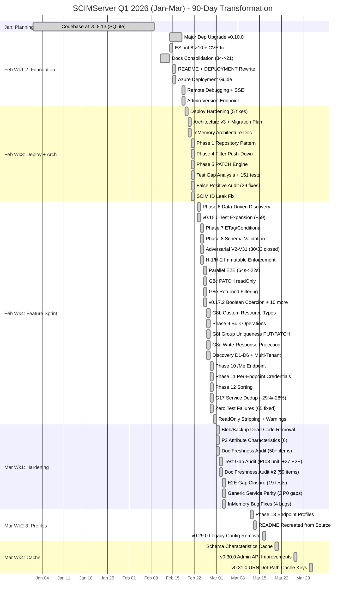

### Sequence: Request Flow Through Innovations (Mar 31 State)

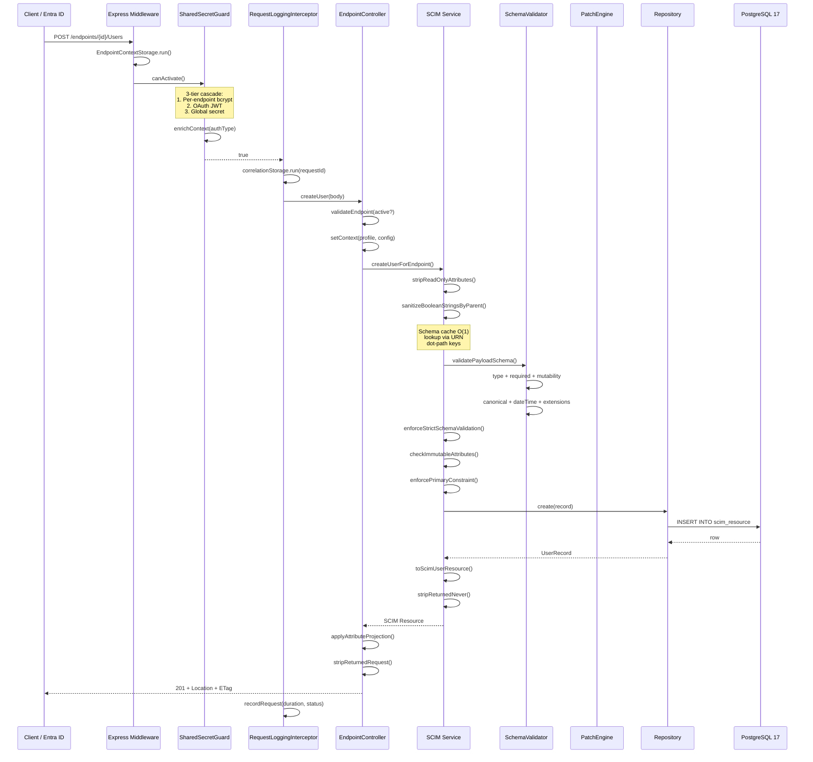

---

## 3. AI-Powered Development System

### 3.1 Session Continuity Architecture

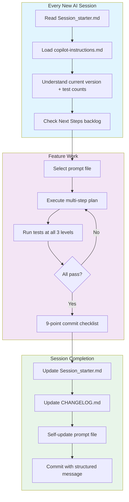

### 3.2 Prompt System Created in Q1

| Prompt | Created | Purpose | Self-Improving? |
|--------|---------|---------|-----------------|
| `addMissingTests.prompt.md` | Feb | 195-cell flag x operation coverage matrix | Yes - adds patterns |
| `fullValidationPipeline.prompt.md` | Feb | Local -> Docker -> Standalone 3-phase pipeline | Yes - adds env warnings |
| `auditAndUpdateDocs.prompt.md` | Mar | 8-category doc staleness scanner | Yes - adds format patterns |
| `auditAgainstRFC.prompt.md` | Mar | Fetches actual RFC text from IETF | Yes - appends lessons |
| `error-handling-verification.prompt.md` | Mar | 55-check error handling audit | Yes - adds Map/Set checks |
| `logging-verification.prompt.md` | Mar | 71-check logging audit | Yes - updates baselines |
| `session-startup.prompt.md` | Feb | Auto-loads Session_starter.md | No (trigger only) |
| `generateCommitMessage.prompt.md` | Feb | 8-tier change classification | No (stateless) |
| `runPhaseWorkflow.prompt.md` | Feb | Feature delivery governance | Yes - adds phase patterns |
| `updateProjectHealth.prompt.md` | Mar | Stats propagation across docs | Yes - adds count patterns |

### 3.3 Self-Improving Prompt Loop (Example)

```
┌─────────────────────────────────────────────────────┐
│  addMissingTests.prompt.md (Feb → Mar evolution)    │
│                                                     │
│  February state:                                    │
│  - 7 config flag validation blocks                  │
│  - Basic operation x flag matrix                    │
│  - No anti-patterns table                           │
│                                                     │
│  After 4 executions by March 31:                    │
│  - 13 config flag validation blocks                 │
│  - 195-cell coverage matrix                         │
│  - 14 flag combination pairs                        │
│  - 96-cell operation x projection x char matrix     │
│  - 8 anti-patterns discovered and recorded          │
│  - Live test section numbering convention           │
│  - Standing rules for `Test-Result` patterns        │
└─────────────────────────────────────────────────────┘
```

### 3.4 The 9-Point Feature Commit Checklist

Every feature delivered in Q1 was required to include:

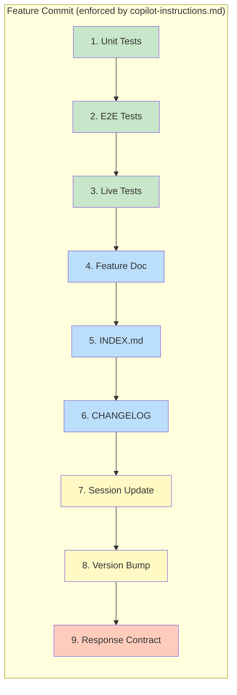

---

## 4. Architecture Innovations

### 4.1 Hexagonal Architecture (Ports & Adapters)

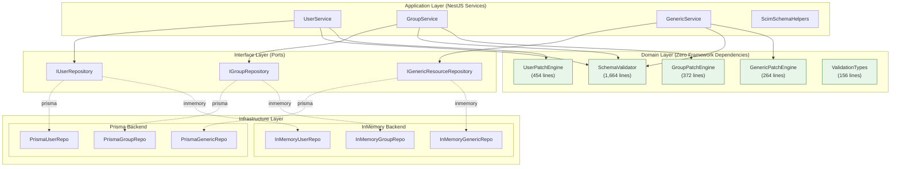

> **2,910 lines** of pure domain logic with **zero** NestJS/Prisma imports - independently testable without framework bootstrapping.

### 4.2 Precomputed Schema Cache (O(1) Lookups)

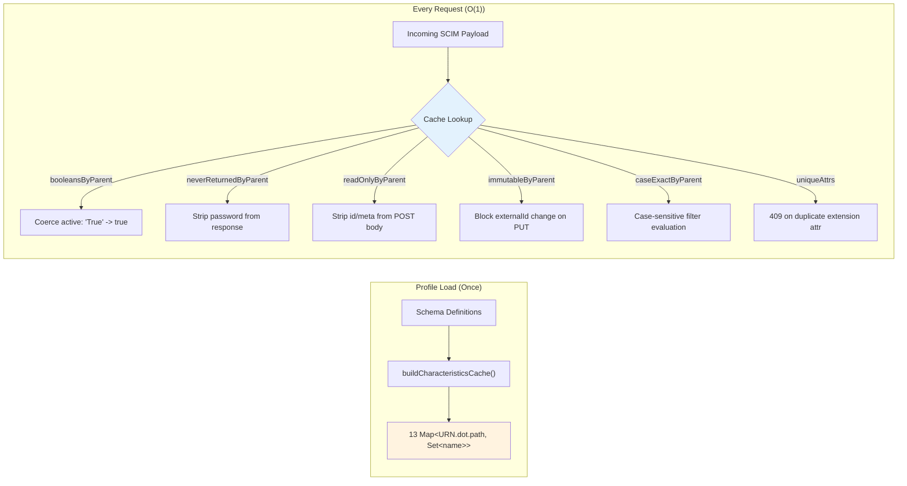

**Before (v0.17):** 2-9 schema tree walks per request = 40-180 µs overhead
**After (v0.29.2):** Zero per-request walks = O(1) Map lookups
**v0.31.0 refinement:** URN-qualified dot-path keys prevent name-collision between core `active` (boolean) and extension `active` (string)

### 4.3 Three-Tier Authentication Cascade

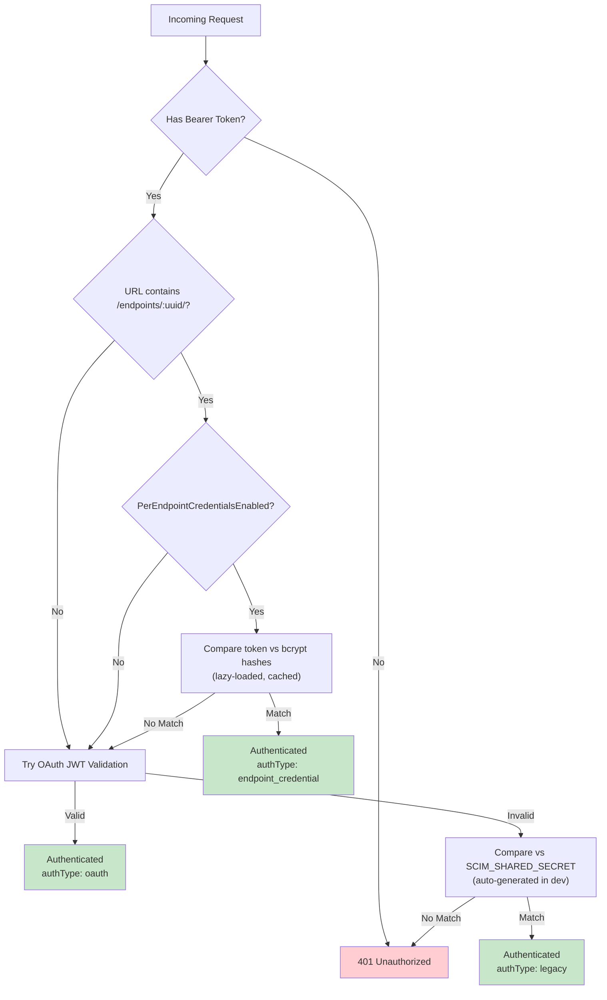

### 4.4 Hybrid Filter Push-Down

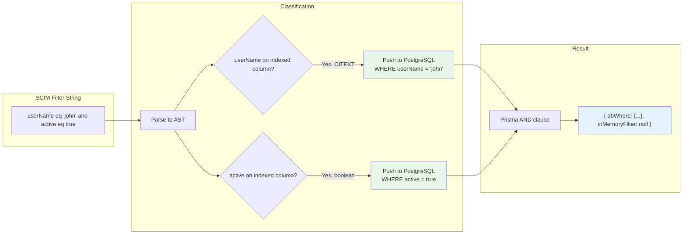

**10 operators** (`eq`, `ne`, `co`, `sw`, `ew`, `gt`, `ge`, `lt`, `le`, `pr`) on **5 columns** (`userName`, `displayName`, `externalId`, `scimId`, `active`). Unpushable expressions fall back to in-memory evaluation.

### 4.5 Config Flag Registry Pattern

```typescript
// Single entry = entire flag lifecycle
ENDPOINT_CONFIG_FLAGS_DEFINITIONS = {
  StrictSchemaValidation: {
    key: 'StrictSchemaValidation',
    type: 'boolean',
    default: true,
    description: 'Enforce RFC 7643 type/required/unknown attribute validation'
  },
  // ... 12 more boolean flags + logLevel
};

// Auto-derived from definitions:
DEFAULT_ENDPOINT_CONFIG     // computed via Object.fromEntries()
validateEndpointConfig()    // loops definitions, dispatches to type validators
getConfigBoolean()          // falls back: explicit -> central default -> false
```

> Adding a new flag requires **exactly one entry**. Defaults, validation, docs integration are automatic.

---

## 5. Feature Delivery Breakdown

### 5.1 Phases Completed in Q1

```mermaid
graph TB
    subgraph "Feb 21"
        P1["Phase 1<br/>Repository Pattern<br/>10 new files"]
        P4["Phase 4<br/>Filter Push-Down<br/>10 operators × 5 cols"]
        P5["Phase 5<br/>PATCH Engine<br/>3 pure domain engines"]
    end

    subgraph "Feb 23-24"
        P6["Phase 6<br/>Data-Driven Discovery<br/>Enterprise extension"]
        P7["Phase 7<br/>ETag/Conditional<br/>Monotonic W/\"v{N}\""]
        P8["Phase 8<br/>Schema Validation<br/>1,664-line validator"]
    end

    subgraph "Feb 26-27"
        P9["Phase 9<br/>Bulk Operations<br/>bulkId cross-ref"]
        P10["Phase 10<br/>/Me Endpoint<br/>JWT sub resolution"]
        P11["Phase 11<br/>Per-Endpoint Creds<br/>Lazy bcrypt"]
        P12["Phase 12<br/>Sorting<br/>caseExact-aware"]
    end

    subgraph "Mar 12"
        P13["Phase 13<br/>Endpoint Profiles<br/>5 presets + JSONB"]
    end

    P1 --> P4 --> P5
    P5 --> P6 --> P7 --> P8
    P8 --> P9
    P8 --> P10
    P8 --> P11
    P8 --> P12
    P12 --> P13

    style P1 fill:#bbdefb
    style P13 fill:#c8e6c9
```

### 5.2 Gap Closure Heat Map (27/27 Closed)

```
Gap ID  │ Description                          │ Closed  │ Phase
────────┼──────────────────────────────────────┼─────────┼──────
G1-G6   │ Core SCIM ops, pagination, filters   │ Feb 10  │ P1 RFC
G7      │ ETag/Conditional requests             │ Feb 24  │ P7
G8a     │ Schema validation engine              │ Feb 24  │ P8
G8b     │ Custom resource type registration     │ Feb 26  │ P8b
G8c     │ PATCH readOnly pre-validation         │ Feb 25  │ Gap
G8d     │ Immutable enforcement                 │ Feb 24  │ H-1/H-2
G8e     │ Returned characteristic filtering     │ Feb 25  │ Gap
G8f     │ Group uniqueness PUT/PATCH            │ Feb 26  │ Gap
G8g     │ Write-response attribute projection   │ Feb 26  │ Gap
G9      │ Bulk operations (RFC 7644 §3.7)       │ Feb 26  │ P9
G10     │ /Me endpoint (RFC 7644 §3.11)         │ Feb 27  │ P10
G11     │ Per-endpoint credentials              │ Feb 27  │ P11
G12     │ Sorting (RFC 7644 §3.4.2.3)           │ Feb 27  │ P12
G13     │ Conditional version-based ETag         │ Feb 24  │ P7
G14-G15 │ Schema-driven validation               │ Mar 1   │ P2
G16     │ Centralized extension URNs            │ Feb 23  │ P6
G17     │ Service deduplication                 │ Feb 27  │ G17
G18     │ Profile configuration                 │ Mar 12  │ P13
G19     │ Dynamic schemas[] in responses         │ Feb 23  │ P6
G20     │ Dead config flag removal              │ Feb 23  │ P6
────────┴──────────────────────────────────────┴─────────┴──────
                                        TOTAL: 27/27 ✅ ALL CLOSED
```

### 5.3 Weekly Delivery Velocity

```
Week          │ Features Delivered              │ Tests Added │ Cumulative
──────────────┼────────────────────────────────┼─────────────┼──────────
Feb 10-14     │ Dep upgrade, ESLint, docs      │     +280    │     ~492
Feb 15-17     │ README, deploy guide, debug    │     +188    │     ~680
Feb 18-21     │ Deploy, version, P1/P4/P5      │     +469    │   ~1,149
Feb 23-28     │ P6/7/8/9, G8×5, P10/11/12    │   +1,708    │   ~2,857
Mar 1-7       │ P2 chars, audits, parity       │     +636    │   ~3,493
Mar 12-16     │ P13 profiles, legacy removal   │     +207    │   ~3,700
Mar 20-31     │ Cache, admin API, URN keys     │     +200    │   ~3,900
              │                                │             │
              │ + ~1,013 live assertions        │             │   ~4,920
```

---

## 6. Testing Architecture

### 6.1 Three-Level Pyramid

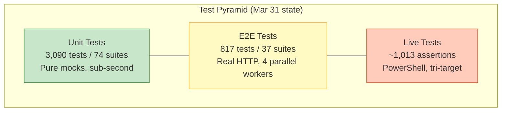

### 6.2 E2E Parallel Innovation

```
BEFORE (Feb 24):                    AFTER (Feb 25):
┌──────────────┐                    ┌────────┐┌────────┐┌────────┐┌────────┐
│  Worker 1    │                    │Worker 1││Worker 2││Worker 3││Worker 4│
│  All specs   │                    │ 9 specs││ 9 specs││ 9 specs││10 specs│
│  sequential  │                    │        ││        ││        ││        │
│              │                    │ w1-*   ││ w2-*   ││ w3-*   ││ w4-*   │
│  ~64 seconds │                    │fixtures││fixtures││fixtures││fixtures│
└──────────────┘                    └────────┘└────────┘└────────┘└────────┘
                                              ~22 seconds (65% faster)
```

Replaced `resetDatabase()` with **worker-prefixed resource names** (`w${JEST_WORKER_ID}-userName`) for conflict-free parallel execution.

### 6.3 Live Test Script Architecture

```
live-test.ps1 (8,746 lines)
├── Parameters: -BaseUrl, -ClientSecret, -Verbose
├── OAuth Token Acquisition
├── Endpoint Setup (create test endpoints)
├── Section 1-3: Core SCIM CRUD (Users + Groups)
├── Section 4-8: Filters, PATCH, ETag, Bulk, /Me
├── Section 9a-9y: Feature-specific sections
│   ├── 9o: G8f Group uniqueness
│   ├── 9p: G8g Write-response projection
│   ├── 9s: Per-endpoint credentials
│   ├── 9t: ReadOnly stripping + warnings
│   ├── 9v: P2 attribute characteristics
│   ├── 9x: Uniqueness on PUT/PATCH
│   └── 9y: Generic service parity
├── Section 10: Cleanup (orphan sweep)
└── JSON Pipeline Output
    ├── runId, version, duration
    ├── Per-section pass/fail summaries
    └── Per-test flow-step IDs → HTTP traces
```

---

## 7. Infrastructure & DevOps

### 7.1 Docker Multi-Stage Build

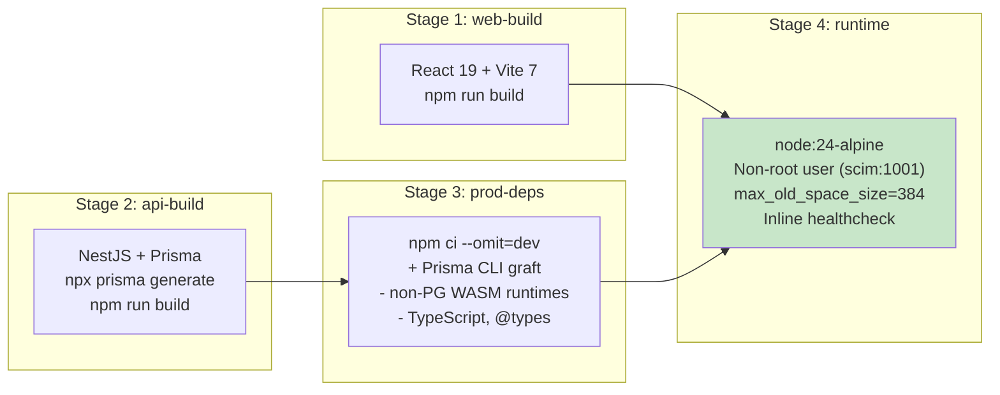

**Savings:** ~56 MB from non-PostgreSQL WASM deletion + ~50 MB from TypeScript/@types/Prisma-UI removal.

### 7.2 Azure Deploy Pipeline

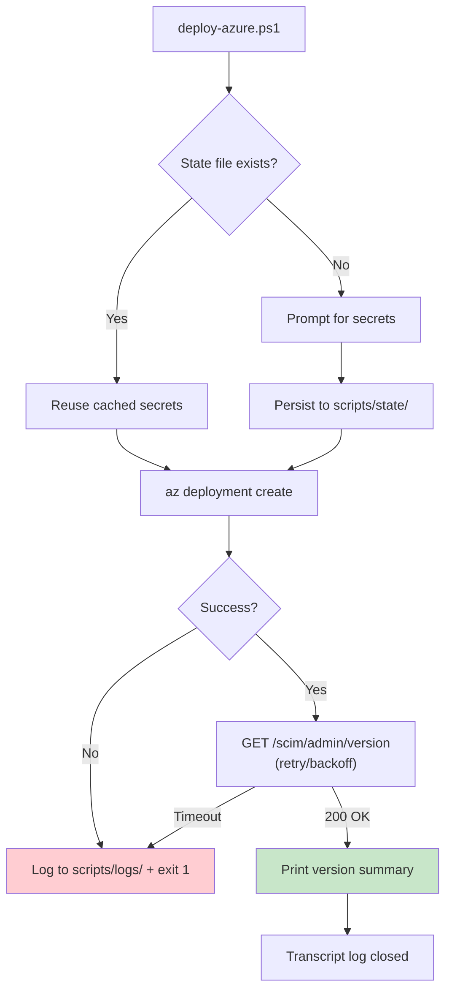

---

## 8. Documentation System

### 8.1 Doc Freshness Audit Results

| Audit | Date | Stale Items Found | Files Fixed |
|-------|------|-------------------|-------------|
| #1 | Mar 1 | 50+ items | 18 files |
| #2 | Mar 2 | 59 items | 28 files |
| #3 | Mar 2 | 73 items (v0.17.1) | 14 files |

**Total:** 182+ stale items detected and fixed across 60 file-instances in Q1.

### 8.2 Living Documentation Ecosystem

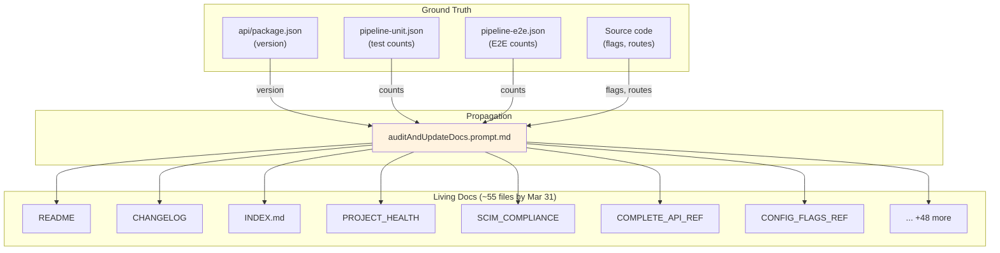

---

## 9. Quantitative Analysis

### 9.1 Test Growth Trajectory

```
Tests
5000 ┤
     │
4500 ┤                                                    ●  4,920 (Mar 31)
     │                                                   ╱
4000 ┤                                                  ╱
     │                                                 ╱
3500 ┤                                     ●──────────╱  3,700 (Mar 16)
     │                                    ╱
3000 ┤                              ●────╱  3,493 (Mar 7)
     │                             ╱
2500 ┤                     ●──────╱  2,857 (Feb 28)
     │                    ╱
2000 ┤                   ╱
     │                  ╱
1500 ┤          ●──────╱  1,149 (Feb 21)
     │         ╱
1000 ┤    ●───╱  680 (Feb 17)
     │   ╱
 500 ┤  ●  492 (Feb 14)
     │
 200 ┤ ●  212 (Jan 1)
     └────┬──────┬──────┬──────┬──────┬──────┬──────┬────
          Jan    Feb10  Feb20  Feb28  Mar7   Mar16  Mar31
```

### 9.2 Cumulative Version Releases

```
v0.31.0 ●──────────────────────────────────────────────── Mar 31
v0.30.0 ●────────────────────────────────────────────── Mar 26
v0.29.2 ●──────────────────────────────────────────── Mar 20
v0.29.0 ●────────────────────────────────────────── Mar 16
v0.28.0 ●──────────────────────────────────────── Mar 12
v0.27.0 ●────────────────────────────────────── Mar 3
v0.26.0 ●──────────────────────────────────── Mar 3
v0.24.0 ●────────────────────────────────── Mar 1
v0.22.0 ●──────────────────────────────── Feb 28
v0.21.0 ●────────────────────────────── Feb 27
v0.20.0 ●──────────────────────────── Feb 27
v0.19.3 ●────────────────────────── Feb 26
v0.19.0 ●──────────────────────── Feb 26
v0.18.0 ●────────────────────── Feb 26
v0.17.4 ●──────────────────── Feb 25
v0.17.2 ●────────────────── Feb 25
v0.17.0 ●──────────────── Feb 24
v0.16.0 ●────────────── Feb 24
v0.15.0 ●──────────── Feb 23
v0.14.0 ●────────── Feb 23
v0.13.0 ●──────── Feb 21
v0.12.0 ●────── Feb 21
v0.11.0 ●──── Feb 21
v0.10.0 ●── Feb 14
v0.8.13 ● Jan 1
        └──────────────────────────────────────────────────
```

### 9.3 Final Q1 Numbers

| Category | Metric | Value |
|----------|--------|-------|
| **Duration** | Calendar days | 90 |
| **Releases** | Version count | 23 (v0.8.13 -> v0.31.0) |
| **Tests** | Unit tests | 3,090 (74 suites) |
| | E2E tests | 817 (37 suites) |
| | Live assertions | ~1,013 (+ 112 Lexmark) |
| | **Total** | **~4,920** |
| | Growth rate | **2,221%** from Jan 1 |
| | Tests per day | **~52 tests/day** |
| **Architecture** | Phases completed | 12 (P1, P4-P13) |
| | Migration gaps closed | 27/27 |
| | Pure domain code | 2,910 lines |
| | Schema cache fields | 15 precomputed |
| **RFC** | Compliance | 85% -> 100% |
| | SCIM Validator | 25/25 pass, 0 FP |
| | RFC features | 18/18 implemented |
| **Config** | Boolean flags | 7 -> 13 |
| | Profile presets | 0 -> 5 |
| | Tri-state flags | 0 -> 1 |
| **Stack** | Node.js | 22 -> 24 |
| | NestJS | 10 -> 11 |
| | Prisma | 5 -> 7 |
| | TypeScript | 5.4 -> 5.9 |
| | Database | SQLite -> PostgreSQL 17 |
| | Persistence | 1 -> 2 backends |
| **Docs** | Active files | ~15 -> ~55 |
| | Prompt files | 0 -> ~10 |
| | Freshness audits | 3 (182+ stale items fixed) |
| **API** | Endpoints | ~30 -> ~75 |
| | Controllers | ~10 -> 19 |
| | Auth tiers | 1 -> 3 |
| **DevOps** | Docker stages | 2 -> 4 |
| | Deploy modes | 2 -> 4 |
| | CI workflows | 2 -> 3 |

---

## 10. Innovation Catalog

### Innovations by Category (Q1 2026)

| # | Innovation | Category | Date | Impact |
|---|-----------|----------|------|--------|
| 1 | Self-improving prompt system | AI | Feb | 10+ prompts that learn from each execution |
| 2 | Persistent AI session memory | AI | Feb | Context continuity across days/weeks |
| 3 | 9-point commit checklist | AI | Feb | Enforced quality at every commit |
| 4 | Self-improving verification docs | AI | Mar | 71-check + 55-check executable audits |
| 5 | Hexagonal repository pattern | Arch | Feb 21 | Swappable Prisma/InMemory persistence |
| 6 | Pure domain PATCH engines | Arch | Feb 21 | 3 engines, zero framework deps |
| 7 | Precomputed schema cache | Arch | Mar 20 | O(1) attribute lookups, zero tree-walks |
| 8 | URN dot-path cache keys | Arch | Mar 31 | Name-collision immunity at any depth |
| 9 | Three-tier auth cascade | Arch | Feb 27 | Per-endpoint bcrypt -> OAuth -> secret |
| 10 | Dual AsyncLocalStorage | Arch | Feb 28 | Request-scoped state without prop-drilling |
| 11 | Definition-driven config registry | Arch | Feb 25 | One entry = entire flag lifecycle |
| 12 | Hybrid filter push-down | Arch | Feb 21 | DB + in-memory filter compilation |
| 13 | Endpoint profile system | Arch | Mar 12 | 5 presets, tighten-only validation |
| 14 | Three-level test pyramid | Test | Feb-Mar | Unit + E2E + Live at every commit |
| 15 | Parallel E2E execution | Test | Feb 25 | 65% faster (64s -> 22s) |
| 16 | Worker-prefixed fixtures | Test | Feb 25 | Conflict-free parallel test isolation |
| 17 | False positive test audit | Test | Feb 21 | 29 false positives found and fixed |
| 18 | Industrial live test script | Test | Feb-Mar | 8,746 lines, tri-target portable |
| 19 | Pipeline JSON artifacts | Test | Feb | Machine-readable test baselines |
| 20 | Four-stage Docker build | DevOps | Feb 18 | Prisma grafting, ~106 MB savings |
| 21 | State-persistent deploy script | DevOps | Feb 19 | Secret caching + retry/backoff |
| 22 | Version bump automation | DevOps | Feb | Single-source propagation across all files |
| 23 | Document freshness automation | Docs | Mar | 8-category staleness detection |
| 24 | Living documentation ecosystem | Docs | Mar | 55+ files auto-synced from ground truth |
| 25 | Full stack upgrade (6 deps) | Foundation | Feb 14-18 | Node, NestJS, Prisma, ESLint, Jest, React |
| 26 | SQLite -> PostgreSQL migration | Foundation | Feb 21 | CITEXT, JSONB, GIN indexes |
| 27 | Adversarial security hardening | Security | Feb 24 | 30/33 validation gaps closed |
| 28 | Production-to-prompt feedback | Process | Feb-Mar | Bugs create permanent prompt additions |

---

*Generated: April 24, 2026 - Report covers Jan 1 - Mar 31, 2026*
*End-of-period state: v0.31.0, 3,090 unit (74 suites), 817 E2E (37 suites), ~1,013 live + 112 Lexmark ISV*
*Source-verified against Session_starter.md achievement log and CHANGELOG.md version history*
