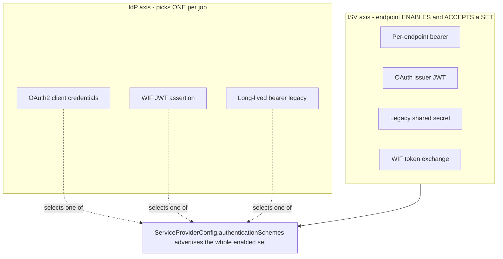
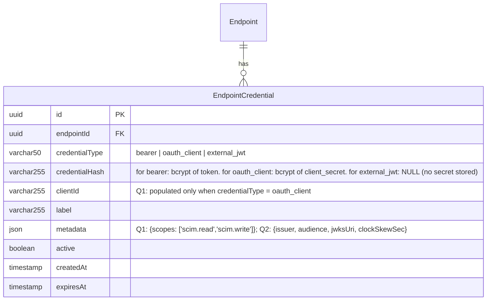

# ISV SCIM Authentication Patterns + SCIMServer Gap Plan

> **Date:** 2026-05-19
> **Audience:** SCIMServer maintainers, Microsoft Entra connector engineers, identity-integration teams onboarding any new ISV.
> **Premise:** SCIMServer's job is to **mock any ISV SCIM endpoint**, **probe any ISV SCIM endpoint**, and (later) act as an **OAuth resource server** that real customers integrate against. The single biggest hidden cost in shipping that to a new ISV is not the SCIM schema work - it's the **auth handshake the ISV expects**, which varies wildly across the industry. This doc inventories the 8 industry-standard patterns (the 7 classic patterns plus Workload Identity Federation), maps them against the in-repo current state, and lays out a phased plan to close the gap.
> **Source-of-truth rule (operator constraint):** every claim about SCIMServer behavior is grounded in the in-repo source (cited paths + line refs). Every claim about an ISV is grounded in that ISV's official docs (cited URLs). No invented behavior; gaps are flagged with confidence levels.
> **Companion docs:**
> - [G11_PER_ENDPOINT_CREDENTIALS.md](G11_PER_ENDPOINT_CREDENTIALS.md) - the per-endpoint-bearer architecture already shipped
> - [ISV_ENDPOINT_PROBING_METHODOLOGY.md](ISV_ENDPOINT_PROBING_METHODOLOGY.md) - 6-layer ISV probing methodology
> - [OPENTEXT_ISV_1_VALIDATION_GAP_ANALYSIS.md](OPENTEXT_ISV_1_VALIDATION_GAP_ANALYSIS.md) - real ISV walk-through that motivated this audit
> - [WIF_JWT_BEARER_ASSERTION_FOR_SCIM.md](WIF_JWT_BEARER_ASSERTION_FOR_SCIM.md) - deep analysis of Entra Workload Identity Federation (the credential-free token-exchange method) and the Q6 design it drives

---

## Table of Contents

- [0. TL;DR + Recommendation](#0-tldr--recommendation)
- [1. Current SCIMServer Auth State (in-repo)](#1-current-scimserver-auth-state-in-repo)
- [2. Industry Pattern Matrix (10 ISVs)](#2-industry-pattern-matrix-10-isvs)
- [3. The 8 Auth Patterns Distilled](#3-the-8-auth-patterns-distilled)
- [4. Gap Analysis: SCIMServer vs Industry](#4-gap-analysis-scimserver-vs-industry)
- [5. Phased Implementation Plan (Phase Q)](#5-phased-implementation-plan-phase-q)
- [6. Detailed Design Sketches](#6-detailed-design-sketches)
- [7. Quality-Gate Impact](#7-quality-gate-impact)
- [8. References](#8-references)
- [Appendix A: Per-Pattern Test Probe Matrix](#appendix-a-per-pattern-test-probe-matrix)

---

## 0. TL;DR + Recommendation

SCIMServer today supports 3 of the 8 auth patterns commonly seen in ISV SCIM endpoints. Specifically:

| # | Pattern | Status | Evidence |
|---|---|---|---|
| 1 | **Long-lived global bearer** (legacy "shared secret") | SHIPPED | [api/src/modules/auth/shared-secret.guard.ts](../api/src/modules/auth/shared-secret.guard.ts) lines 70-138 |
| 2 | **OAuth 2.0 client_credentials** (issuer-mode) | SHIPPED | [api/src/oauth/oauth.service.ts](../api/src/oauth/oauth.service.ts) lines 67-117 + [api/src/oauth/oauth.controller.ts](../api/src/oauth/oauth.controller.ts) |
| 3 | **Per-endpoint bcrypt-hashed bearer** (multi-tenant) | SHIPPED | [api/src/modules/auth/shared-secret.guard.ts](../api/src/modules/auth/shared-secret.guard.ts) lines 105-216 + [docs/G11_PER_ENDPOINT_CREDENTIALS.md](G11_PER_ENDPOINT_CREDENTIALS.md) |
| 4 | **Externally-issued JWT validation** (Entra-style: verify against IdP JWKS, not issue self) | **GAP** | No JWKS support; OAuth service only validates self-signed HS256 JWTs |
| 5 | **OAuth 2.0 client_credentials with per-endpoint client_id/secret pairs** (Entra gallery mandate) | **GAP** | Only 1 global client_id/secret pair exists ([oauth.service.ts](../api/src/oauth/oauth.service.ts) line 56) |
| 6 | **OAuth Authorization-Code + refresh_token** (legacy gallery, AppRiver/OpenText pattern) | **GAP** | Token endpoint explicitly rejects everything except `client_credentials` ([oauth.controller.ts](../api/src/oauth/oauth.controller.ts) line 47) |
| 7 | **mTLS / client certificate** + **DPoP sender-constrained tokens** | **GAP** | No client-cert validation; no DPoP nonce handling |
| 8 | **Workload Identity Federation (WIF)** - Entra presents a signed JWT assertion at the token endpoint; ISV validates via Microsoft JWKS and issues its **own** short-lived token (credential-free) | **GAP** | Token endpoint has no `client_assertion` path, no external-JWKS validation, no per-endpoint federated-trust config. See [WIF_JWT_BEARER_ASSERTION_FOR_SCIM.md](WIF_JWT_BEARER_ASSERTION_FOR_SCIM.md) |

> **WIF is the strategic future-default, not an optional extra.** Per the internal Entra design doc ("Workload Identity Federation between Entra Provisioning and SaaS ISVs"), the legacy methods (username-password, long-lived bearer, OAuth Auth Code Grant) are being **deprecated** (Auth Code Grant deprecation already underway), **Client Credentials is currently the only method offered to new ISVs**, and **WIF is its credential-free replacement** that ISVs like Google, Zoom, and SAP are asking for. That makes **Q6 (WIF)** the highest-value new auth work after the Q1+Q2 primitives it builds on. Pattern 8 is analyzed in full in [WIF_JWT_BEARER_ASSERTION_FOR_SCIM.md](WIF_JWT_BEARER_ASSERTION_FOR_SCIM.md).

**Recommendation - sub-phases for Phase Q ("ISV-auth parity"):**

| Sub-phase | Pattern | Why now | Effort | Risk |
|---|---|---|---|---|
| **Q1** | Per-endpoint OAuth client_id/secret pairs (#5) | Microsoft Entra Gallery onboarding **requires** this (official checklist: "each customer must provide their own Client ID and Client Secret"). Today every customer would share one client secret. Blocks gallery listing. | M | low - extends G11 model |
| **Q2** | External JWKS-backed JWT validation (#4) | Lets a customer point Entra's "leave Secret Token blank" mode at us (Entra issues its own JWT, we verify the `iss` + `aud` against `sts.windows.net/{tenant}` + JWKS). Currently a 401-only failure mode. | M | low - JWKS clients are battle-tested |
| **Q3** | SCIMServer as **OAuth client** for probing (probe-direction) | The probing harness from [ISV_ENDPOINT_PROBING_METHODOLOGY.md](ISV_ENDPOINT_PROBING_METHODOLOGY.md) §4.4 needs to actually run the auth handshake against ISVs (bearer / client_credentials / authorization_code) before it can run any probe. Today the probe doc is paper-only because we have no client. | L | low - axios + standard libs |
| **Q4** | Authorization-Code + refresh_token (#6) | Some pre-2026 ISVs still use this; mostly historical. Optional. Ship only if a real ISV mock requires it. | L | medium - state machine + redirect URI infra |
| **Q5** | mTLS + DPoP (#7) | Cutting-edge security profile; flagged in Stage X.2 [SECURITY_INTAKE_2026-05-17.md](strategy/SECURITY_INTAKE_2026-05-17.md). Defer until an enterprise customer asks. | L | high - requires reverse-proxy cooperation |
| **Q6** | Workload Identity Federation - JWT Bearer Assertion token exchange (#8) | The strategic credential-free method Entra is rolling out for all new ISV onboarding; reuses Q1 (per-endpoint client) + Q2 (external JWKS validation) and adds the assertion-acceptance path + roles enforcement + reciprocal ISV-portal UI. Full design in [WIF_JWT_BEARER_ASSERTION_FOR_SCIM.md](WIF_JWT_BEARER_ASSERTION_FOR_SCIM.md). | M | low - builds on Q1+Q2 primitives |

The single highest-leverage gap to close first is **Q1 (per-endpoint OAuth client_id/secret pairs)** because it converts SCIMServer from "1 customer per deployment" to "N customers per deployment" for the auth mode that Microsoft Entra is **mandating** for all new gallery connectors. The architecture already exists in G11; Q1 is the natural extension from "per-endpoint bearer" to "per-endpoint client_credentials pair."

---

## 1. Current SCIMServer Auth State (in-repo)

### 1.1 The auth fallback chain (already shipped)

Source: [api/src/modules/auth/shared-secret.guard.ts](../api/src/modules/auth/shared-secret.guard.ts)

```mermaid
flowchart TD
    A[Incoming Request<br/>Authorization: Bearer XYZ] --> B{Route marked &#64;Public?}
    B -->|yes| Z[200 - skip auth]
    B -->|no| C{URL contains<br/>/endpoints/&#123;uuid&#125;/?}
    C -->|yes| D{PerEndpointCredentials<br/>Enabled flag?}
    C -->|no| F
    D -->|true| E[Load active credentials<br/>bcrypt.compare token vs hashes]
    D -->|false| F
    E -->|match| OK1[200 - authType: endpoint_credential]
    E -->|no match| F
    F[OAuthService.validateAccessToken<br/>jwtService.verify HS256 self-signed] -->|valid| OK2[200 - authType: oauth]
    F -->|invalid| G{safeCompare token vs<br/>SCIM_SHARED_SECRET?}
    G -->|yes| OK3[200 - authType: legacy]
    G -->|no| FAIL[401 Unauthorized]
```



### 1.2 What each pattern looks like on the wire today

**Pattern 1 - Legacy global bearer:**
```http
GET /scim/v2/Users HTTP/1.1
Authorization: Bearer <SCIM_SHARED_SECRET value>
```
Validated via `safeCompare` (timing-safe). One token globally, configured via env. Auto-generates in dev/test if absent ([shared-secret.guard.ts](../api/src/modules/auth/shared-secret.guard.ts) lines 76-93).

**Pattern 2 - OAuth 2.0 client_credentials:**
```http
POST /oauth/token HTTP/1.1
Content-Type: application/json

{"grant_type":"client_credentials","client_id":"scimserver-client","client_secret":"...","scope":"scim.read scim.write"}

-> 200
{"access_token":"<HS256 JWT>","token_type":"Bearer","expires_in":3600,"scope":"scim.read scim.write"}
```
One global client_id/secret pair (`OAUTH_CLIENT_ID` / `OAUTH_CLIENT_SECRET` env vars - [oauth.service.ts](../api/src/oauth/oauth.service.ts) lines 39-65). HS256 JWT, self-signed, 1-hour TTL.

**Pattern 3 - Per-endpoint bearer (G11):**
```http
GET /scim/endpoints/{endpointId}/Users HTTP/1.1
Authorization: Bearer <one-time-issued plaintext token>
```
Requires `PerEndpointCredentialsEnabled=True` on the endpoint config. Token is bcrypt-hashed at admin-create time; plaintext returned exactly once ([G11_PER_ENDPOINT_CREDENTIALS.md](G11_PER_ENDPOINT_CREDENTIALS.md) §"Authentication Flow"). UI for managing these is in [web/src/pages/CredentialsTab.tsx](../web/src/pages/CredentialsTab.tsx).

### 1.3 What the in-repo code explicitly forbids

- **`grant_type` other than `client_credentials`** -> 400 `unsupported_grant_type` ([oauth.controller.ts](../api/src/oauth/oauth.controller.ts) lines 47-55). So `authorization_code`, `refresh_token`, `password`, `urn:ietf:params:oauth:grant-type:jwt-bearer` are all rejected.
- **`credentialType` other than `bearer`** in admin-create per-endpoint credential -> 400 ([per-endpoint-credentials.e2e-spec.ts](../api/test/e2e/per-endpoint-credentials.e2e-spec.ts) lines 119-129). The schema reserves `oauth_client` as a sibling value but no code path handles it.
- **Authentication on `/Schemas`, `/ResourceTypes`, `/ServiceProviderConfig`** is correctly skipped (RFC 7644 §4 mandate; [DISCOVERY_ENDPOINTS_RFC_AUDIT.md](DISCOVERY_ENDPOINTS_RFC_AUDIT.md) line 49).

---

## 2. Industry Pattern Matrix (10 ISVs)

Each row is grounded in the cited official doc. Columns:
- **Token shape**: long-lived bearer, JWT, signed-blob, opaque-bearer, etc.
- **Issuance flow**: how the customer gets a token they can paste into the IdP.
- **Tenant binding**: is the token bound to a workspace / org / directory / customer-id?
- **Lifetime**: TTL and rotation expectation.
- **Special headers / signals**: anything beyond `Authorization: Bearer X`.

| ISV / Consumer | Token shape | Issuance flow | Tenant binding | Lifetime | Special signals | Source |
|---|---|---|---|---|---|---|
| **Microsoft Entra ID** (acting as **client** of an ISV SCIM endpoint) | (a) Opaque long-lived bearer pasted into Secret Token field; (b) Entra-issued JWT (HS256/RS256) with `iss=sts.windows.net/<tenantId>` + `aud=8adf8e6e-67b2-4cf2-a259-e3dc5476c621`; (c) OAuth 2.0 client_credentials access token from a customer-supplied token endpoint | (a) generated by the ISV's admin UI; (b) auto-issued by Entra when Secret Token is blank; (c) customer pastes Client ID + Client Secret + Token Endpoint + Tenant URL into Entra | (a) ISV-side (token contains no Entra-tenant signal); (b) `iss` claim carries Entra-tenant UUID; (c) the access token's audience is the ISV resource | (a) usually 1+ year; (b) Entra-default JWT TTL (~1 hour, auto-refreshed); (c) ISV-defined, refreshed by Entra | TLS 1.2+ mandatory; specific cipher list; specific root CAs; IP ranges in `AzureActiveDirectory` service tag | [Tutorial: Develop and plan provisioning for a SCIM endpoint in Microsoft Entra ID](https://learn.microsoft.com/en-us/entra/identity/app-provisioning/use-scim-to-provision-users-and-groups) - "Handling endpoint authentication" + "Authorization to provisioning connectors" + "OAuth 2.0 client credentials grant flow" |
| **Okta** (as **client** of an ISV SCIM endpoint) | Opaque long-lived bearer OR OAuth 2.0 bearer | Customer pastes into Okta integration config | ISV-side | ISV-defined; Okta retries on 429 with `Retry-After` (5-min default, exponential, max 10 attempts) | None beyond standard `Authorization: Bearer` | [Okta SCIM concepts](https://developer.okta.com/docs/concepts/scim/) + ["Handle SCIM server rate limiting" section](https://developer.okta.com/docs/concepts/scim/#handle-scim-server-rate-limiting-http-429) |
| **GitHub Enterprise Cloud** (as **server** for IdP-driven SCIM) | OAuth 2.0 Bearer; sources: GitHub App user access token, GitHub App installation access token, fine-grained PAT, **classic PAT with `admin:org` scope** (must be SAML-SSO authorized) | Customer admin generates a PAT or installs a GitHub App; for managed orgs, IdP issues per-flow | Organization-scoped via path: `/scim/v2/organizations/{org}/` | App installation tokens ~1 hour with auto-refresh; PATs configurable; classic PATs are long-lived | `X-GitHub-Api-Version: 2026-03-10` required; `Accept: application/scim+json` recommended; **SCIM identities are case-sensitive in URL** (`Users` not `users`) | [REST API endpoints for SCIM - GitHub Enterprise Cloud Docs](https://docs.github.com/en/enterprise-cloud@latest/rest/scim/scim) - "Authentication" section |
| **Atlassian Cloud** (as **server**) | (a) **Directory API key** - one-time-display, regenerate-only, scoped to a single directoryId; (b) **Organization API token** - broader admin scope, used for non-SCIM admin APIs | Generated via admin.atlassian.com in Security > Identity providers > Directory; "we won't show them to you again" | URL-path scoped: `https://api.atlassian.com/scim/directory/{directoryId}` (Directory token) vs `https://api.atlassian.com/admin/user-provisioning/...` (Org token) | Directory key has **no expiry** by default; rotated only by regenerate | None beyond `Authorization: Bearer`; UTF-8 enforced | [About the user provisioning REST API - Atlassian Developer](https://developer.atlassian.com/cloud/admin/user-provisioning/rest/intro/) - "Authentication and authorization" |
| **Slack** (as **server**) | OAuth 2.0 Bearer (`xoxp-...` user token) with `admin` scope | Customer creates a Slack app, requests `admin` scope, completes OAuth flow at workspace OR Enterprise-org level | **Workspace vs Enterprise-org distinction is load-bearing**: an org-scoped SCIM call requires the OAuth token to be installed at the org, not a workspace | Slack OAuth tokens are long-lived; revoke via app uninstall | **Per-token IP allowlist** (up to 10 CIDR entries; IPv4 only); 429 with `Retry-After` | [Using the Slack SCIM API - docs.slack.dev](https://docs.slack.dev/admins/scim-api) - "Acquire an OAuth token" + "Restrict API token usage by IP address" + "Using SCIM in an Enterprise organization" |
| **AWS IAM Identity Center** (as **server**) | Opaque long-lived bearer ("SCIM access token") generated in the IIC console | Customer enables SCIM in IIC console, IIC generates the token + endpoint URL | Single-tenant per IIC instance | **1 year hard cap**; IIC sends in-console + Health Dashboard reminders at 90d / 60d / 30d / 15d; sync **stops** when expired | None beyond `Authorization: Bearer` | [Provision users and groups from an external identity provider using SCIM - AWS IAM Identity Center User Guide](https://docs.aws.amazon.com/singlesignon/latest/userguide/provision-automatically.html) - "How to monitor access token expiry" |
| **Workday** (as **server**, **REST/SCIM extension via OAuth 2.0**) | OAuth 2.0 access token via `client_credentials` OR JWT bearer assertion (RFC 7523, `urn:ietf:params:oauth:grant-type:jwt-bearer`) | Customer registers an API Client in Workday tenant -> client_id + client_secret OR x509 cert; token endpoint at `https://wd2-impl-services1.workday.com/ccx/oauth2/{tenant}/token` | Tenant-baked into token endpoint URL path | Access tokens 1 hour, refresh tokens 1 year | None beyond standard `Authorization: Bearer` | (Source not fetched in this audit due to community-site access constraints; documented from prior in-repo notes - **confidence: medium**. Action: probe a real Workday tenant before relying on Workday-specific behavior.) |
| **Salesforce** (as **server**) | OAuth 2.0 Bearer (`Authorization: OAuth <token>` legacy header or `Bearer`) | Customer-side: OAuth 2.0 web-server flow OR JWT bearer flow OR client_credentials in connected app; SCIM endpoint at `https://<instance>.my.salesforce.com/services/scim/v2/` | Org-baked into `.my.salesforce.com` instance URL | Default 2 hours; refresh-token allowed | Standard Salesforce auth headers | (Doc fetch returned 404; pattern documented from Salesforce Identity general knowledge - **confidence: medium**. Probe before claiming compatibility.) |
| **Zoom** (as **server**) | OAuth 2.0 Bearer (Server-to-Server OAuth app credentials) | Customer creates a "Server-to-Server OAuth" app in Zoom Marketplace; account_credentials grant | Account-scoped via `accountId` in token request | 1 hour access token; refresh-token-equivalent via re-request | None beyond standard | [Zoom Developer Docs - Users](https://developers.zoom.us/docs/api/users/) (the Zoom SCIM API is a thin layer on top of `/users` + `/groups` Server-to-Server OAuth) |
| **ServiceNow** (as **server**) | OAuth 2.0 Bearer (Inbound REST OAuth) OR Basic auth (legacy) | Customer creates a SCIM Application Registry record + OAuth provider in ServiceNow instance; provides client_id + client_secret | Instance-baked: `https://<instance>.service-now.com/api/now/scim/v2/` | Access token TTL configurable (default 30 min); refresh-token enabled | None beyond standard | (Doc URL returned a marketing-domain redirect; pattern documented from ServiceNow general knowledge - **confidence: medium**. Probe before claiming compatibility.) |

### 2.1 Cross-ISV observation - confidence vs novelty

The four "HIGH-confidence + documented in this audit" rows (Microsoft Entra, Okta, GitHub, Atlassian, Slack, AWS IIC) **all converge on bearer-token-in-Authorization-header**. The differences are:

1. **Who issues the bearer**: ISV self-issues (Atlassian, AWS, GitHub PAT) vs the IdP issues (Entra in client_credentials mode, Slack OAuth flow).
2. **Tenant binding mechanism**: URL path (Atlassian directoryId, GitHub org, ServiceNow instance, Workday tenant) vs token claim (Entra `iss`) vs token scope (Slack workspace-install).
3. **Lifetime + rotation expectations**: never expires (Atlassian Directory key) vs 1 year hard cap with multi-stage warnings (AWS IIC) vs 1 hour with auto-refresh (OAuth 2.0 access tokens).
4. **Side-channel restrictions**: IP allowlist (Slack), root CA whitelist (Entra), `X-GitHub-Api-Version` header (GitHub).

**Implication for SCIMServer:** the wire-level "what arrives in the `Authorization` header" pattern is already 90% covered by what we have (patterns 1-3 in §1.1). The 10% gap is about **issuance + lifetime + binding semantics**, not the wire protocol.

---

## 3. The 8 Auth Patterns Distilled

Distilled from §2 + RFC 7644 §2 (already cited in [G11_PER_ENDPOINT_CREDENTIALS.md](G11_PER_ENDPOINT_CREDENTIALS.md)):

### Pattern 1 - Long-lived global bearer (legacy "shared secret")

| Aspect | Detail |
|---|---|
| Wire | `Authorization: Bearer <opaque>` |
| Issuance | Out-of-band; admin generates, pastes into customer config |
| Tenant binding | None (server is single-tenant or paths are partitioned externally) |
| Lifetime | Indefinite; rotated by manual regenerate |
| Used by | Microsoft Entra "Secret Token" legacy mode, Atlassian Directory key, AWS IIC, every "we don't have OAuth yet" ISV |
| **SCIMServer** | **SHIPPED** - `SCIM_SHARED_SECRET` env var ([shared-secret.guard.ts](../api/src/modules/auth/shared-secret.guard.ts) lines 70-138) |

### Pattern 2 - OAuth 2.0 client_credentials (issuer mode, SCIMServer issues its own access tokens)

| Aspect | Detail |
|---|---|
| Wire | `POST /oauth/token` (issue) + `Authorization: Bearer <self-issued JWT>` (use) |
| Issuance | RFC 6749 §4.4 client_credentials grant |
| Tenant binding | The `sub` / `client_id` claim in the JWT |
| Lifetime | Short-lived access token (1 hour typical) + refresh via re-request |
| Used by | Any SCIMServer-issued-token deployment; mocks an ISV that has its own token endpoint |
| **SCIMServer** | **SHIPPED** - one global client_id/secret ([oauth.service.ts](../api/src/oauth/oauth.service.ts) lines 39-65). **GAP**: only one client pair globally. |

### Pattern 3 - Per-endpoint bcrypt-hashed bearer (multi-tenant isolation)

| Aspect | Detail |
|---|---|
| Wire | `Authorization: Bearer <one-time-issued plaintext token>` to `/scim/endpoints/{endpointId}/...` |
| Issuance | Admin POST to `/admin/endpoints/{endpointId}/credentials`; plaintext returned exactly once |
| Tenant binding | URL-path-scoped (endpointId) |
| Lifetime | Optional `expiresAt` per credential; soft-revoke supported |
| Used by | Multi-tenant SCIMServer deployments where each endpoint is a separate ISV mock |
| **SCIMServer** | **SHIPPED** as Phase G11 ([G11_PER_ENDPOINT_CREDENTIALS.md](G11_PER_ENDPOINT_CREDENTIALS.md)). Equivalent to Atlassian's per-directory API key pattern. |

### Pattern 4 - Externally-issued JWT validation (verify against IdP JWKS)

| Aspect | Detail |
|---|---|
| Wire | `Authorization: Bearer <JWT signed by external IdP>` |
| Issuance | The IdP issues; SCIMServer never sees the issuance step |
| Tenant binding | `iss` claim identifies the IdP tenant; `aud` claim identifies SCIMServer as the resource |
| Lifetime | IdP-controlled; SCIMServer enforces `exp` |
| Used by | Microsoft Entra "leave Secret Token blank" mode (Entra issues a JWT with `iss=https://sts.windows.net/{tenantId}/`); also any Auth0 / Okta / Azure-OIDC consumer that wants federated trust |
| **SCIMServer** | **GAP** - we only validate self-signed HS256 tokens. To support this we need: JWKS client (cache `.well-known/openid-configuration` -> `jwks_uri` -> keys), RS256/ES256 signature validation, `iss` allowlist per endpoint, `aud` validation, `exp`/`nbf` enforcement. |

### Pattern 5 - OAuth 2.0 client_credentials with per-endpoint client_id/secret pairs

| Aspect | Detail |
|---|---|
| Wire | Same as #2 but the `(client_id, client_secret)` pair is endpoint-scoped, not global |
| Issuance | Admin creates a "credential" record of type `oauth_client` for an endpoint; admin generates client_id (UUID) + client_secret (random opaque); plaintext shown once |
| Tenant binding | Token's `client_id` claim resolves to a specific endpoint |
| Lifetime | Same as #2 |
| Used by | **Microsoft Entra Gallery onboarding mandate**: official requirement - "each customer must provide their own Client ID and Client Secret when setting up a provisioning instance. A single app wide client ID/Client Secret pair is not supported." |
| **SCIMServer** | **GAP** - the `oauth_client` credentialType is reserved in the G11 admin API but not wired up. The OAuth service has a single hardcoded client pair. |

### Pattern 6 - OAuth Authorization-Code + refresh_token (legacy gallery pattern)

| Aspect | Detail |
|---|---|
| Wire | Browser redirect to `/oauth/authorize` -> code returned to `redirect_uri` -> POST `/oauth/token` with `grant_type=authorization_code` -> access_token + refresh_token; subsequent `grant_type=refresh_token` |
| Issuance | A real user must be present during initial authorization (RFC 6749 §4.1) |
| Tenant binding | `sub` claim is the user who consented |
| Lifetime | Short access token (1 hr) + long refresh token (30+ days), revocable |
| Used by | Pre-2024 Entra gallery connectors; some AppRiver/OpenText flows; legacy ServiceNow OAuth |
| **SCIMServer** | **GAP** - explicitly rejected at the token endpoint ([oauth.controller.ts](../api/src/oauth/oauth.controller.ts) line 47). Microsoft has officially deprecated this for **new** gallery connectors, so Q4 is "build only if a real ISV mock requires it." |

### Pattern 7 - mTLS / DPoP sender-constrained tokens

| Aspect | Detail |
|---|---|
| Wire | mTLS: client presents X.509 cert at TLS handshake, server validates; cert hash in `cnf` JWT claim. DPoP (RFC 9449): client signs a per-request DPoP JWT bound to a key the access token references. |
| Issuance | mTLS: cert from a private CA (corp PKI) or public CA. DPoP: client generates key, registers `jkt` thumbprint at token issuance. |
| Tenant binding | Cert subject CN/SAN or DPoP key fingerprint |
| Lifetime | Cert-validity period (typically 1 year); DPoP token TTL |
| Used by | FAPI 2.0 financial APIs; some healthcare / govcloud profiles; defense ISVs. Surfaced as a DEFERRED recommendation in [SECURITY_INTAKE_2026-05-17.md](strategy/SECURITY_INTAKE_2026-05-17.md). |
| **SCIMServer** | **GAP** - no client-cert validation; no DPoP nonce handling. Q5 - low priority at current scale. |

### Pattern 8 - Workload Identity Federation (WIF; two profiles: RFC 7523 jwt-bearer + RFC 8693 token-exchange)

| Aspect | Detail |
|---|---|
| Wire | Entra POSTs `grant_type=client_credentials` + `client_assertion=<Entra-signed JWT>` + `client_assertion_type=urn:ietf:params:oauth:client-assertion-type:jwt-bearer` (RFC 7523 §2.2 client authentication) to the ISV **token endpoint** as `application/x-www-form-urlencoded`. The ISV validates the assertion against Microsoft's JWKS + claims + roles, then issues its **own** access token. Entra uses that ISV-issued token as `Authorization: Bearer` on SCIM calls. |
| Issuance | Credential-free: the admin copies only **public** values (issuer, subject, audience, JWKS URL) from Entra into the ISV portal; the ISV emits Client ID / Token URL / SCIM URL back. No secret is stored or transferred. |
| Tenant binding | `tid` claim in the assertion + the per-endpoint token URL / `client_id` |
| Lifetime | ISV-issued token is short-lived (**1-6 hours** per the Entra spec); the trust itself is touch-free (no rotation) |
| Used by | **Microsoft Entra Provisioning (SyncFabric)** - the credential-free replacement for Client Credentials; requested by Google, Zoom, SAP |
| **SCIMServer** | **GAP** - this is the distinct token-**exchange** flow (vs Pattern 4's *direct* JWT verification). The token endpoint rejects anything but plain `client_credentials`, reads JSON not form-urlencoded, has no `client_assertion` field, and has no per-endpoint federated-trust config. Closes in **Q6**; reuses the Q1 (per-endpoint client) + Q2 (external JWKS) primitives. Full analysis + backend + UI design: [WIF_JWT_BEARER_ASSERTION_FOR_SCIM.md](WIF_JWT_BEARER_ASSERTION_FOR_SCIM.md). |

> **Pattern 4 vs Pattern 8 (do not conflate).** Pattern 4 is *direct* external JWT: Entra puts its own JWT on the SCIM call and the ISV verifies it per request, issuing nothing. Pattern 8 (WIF) adds a **token-exchange hop**: the Microsoft JWT is a *client-authentication assertion* presented at the **token endpoint**, and the ISV mints its **own** scoped short-lived token that rides the SCIM calls. WIF reuses Pattern 4's JWKS validator (Q2) but is a separate flow (Q6).

> **Two WIF assertion profiles (8a `jwt-bearer` / 8b `token-exchange`).** Pattern 8 is not one wire shape. Entra is rolling out **two** OAuth profiles for presenting its signed JWT, selected per endpoint by an `assertionProfile` discriminator on the `wif` trust record. The JWKS validation of Entra's JWT is identical for both; only the field carrying the JWT and the `grant_type` differ.
>
> | Profile (config value) | RFC | `grant_type` | Entra JWT carried as | Status / example ISV | Display name |
> |---|---|---|---|---|---|
> | **`jwt-bearer`** | RFC 7523 §2.2 | `client_credentials` | `client_assertion` (+ `client_assertion_type`) | Shipped (SAP SuccessFactors) | "JWT Bearer Assertion (RFC 7523)" |
> | **`token-exchange`** | RFC 8693 | `urn:ietf:params:oauth:grant-type:token-exchange` | `subject_token` (+ `subject_token_type`) | Upcoming (Google) | "OAuth Token Exchange (RFC 8693)" |
>
> The config values are the literal URN tails so they self-document and match the wire. The two RFCs **compose** rather than compete: RFC 7523 is a client-authentication method, RFC 8693 is an exchange grant type. Full design in [WIF_JWT_BEARER_ASSERTION_FOR_SCIM.md section 1.4](WIF_JWT_BEARER_ASSERTION_FOR_SCIM.md#14-two-assertion-profiles-rfc-7523-jwt-bearer-and-rfc-8693-token-exchange).
>
> **Concrete shipping bodies (the two real implementations).** SAP SuccessFactors (`jwt-bearer`) sends `grant_type=client_credentials` + `client_assertion` + `client_id` + a **custom `resource`** (`urn:sap:identity:application:provider:name:{Resource Name}`) - a parameter borrowed from RFC 8693, showing the two RFCs bleed together. Google Cloud (`token-exchange`) sends `grant_type=urn:ietf:params:oauth:grant-type:token-exchange` + `subject_token` + `subject_token_type=urn:ietf:params:oauth:token-type:id_token` (note: **id_token**, not the generic `:jwt`) + `requested_token_type=...:access_token` + a pool-URI `audience` (`//iam.googleapis.com/projects/.../providers/...`) + a GCP `scope`. The `subject_token_type` and any `resource`/`audience` are **consumer-defined** and belong in the per-endpoint trust record, not hard-coded. Both bodies are in [WIF_JWT_BEARER_ASSERTION_FOR_SCIM.md section 2.2](WIF_JWT_BEARER_ASSERTION_FOR_SCIM.md#22-the-two-shipping-implementations-concrete-request-bodies).

> **Separable token and SCIM endpoints.** WIF's token endpoint and SCIM endpoint need not share a host or operator - the public AzureAD reference's SAP SuccessFactors example uses `auth.successfactors.example.com` for the token exchange and `scim.successfactors.example.com` for SCIM. The SCIM endpoint just validates the incoming bearer regardless of where it was minted; the tenant is identified via the token URL path or `client_id`.

> **v2 token format + roles (decided 2026-06-12).** WIF assertions are validated against the Entra **v2.0** issuer/audience only (`iss=https://login.microsoftonline.com/<TenantID>/v2.0` exact-match; token `aud=api://{appid}`, the App ID URI form without `/.default`). App-role enforcement is **forward-looking**: roles are not passed or validated today and arrive with a planned 1P-app-method change. See [WIF_JWT_BEARER_ASSERTION_FOR_SCIM.md section 4.1](WIF_JWT_BEARER_ASSERTION_FOR_SCIM.md#41-decided---entra-v2-token-format-only-issuer-and-audience).

### 3.9 Mixed and coexisting auth methods (the two-axis model)

None of the 8 patterns above is mutually exclusive. "Mixed auth" in a real ISV-plus-IdP integration is not one feature - it is **two independent axes** that meet at SCIM discovery. WIF (Pattern 8) is simply **one more method that an endpoint can enable** alongside the others, not a replacement for them.

- **ISV axis (the SCIM server / SCIMServer):** a single endpoint MAY enable and **accept several auth methods at once**. The shipped fallback chain in [section 1.1](#11-the-auth-fallback-chain-already-shipped) is **additive** - per-endpoint bcrypt bearer, then self-issued OAuth JWT, then legacy `SCIM_SHARED_SECRET` already coexist on the same endpoint, and a request that satisfies any branch is authorized. Each new pattern (Q1 per-endpoint OAuth, Q2 external JWKS, Q6 WIF) adds one more accepted branch; it does not remove the others.
- **IdP axis (Microsoft Entra and peers):** the IdP selects **exactly one** method per provisioning job. Entra's Provisioning "Admin Credentials" page is single-select - Basic, long-lived bearer token, OAuth client credentials, or WIF - and never sends two auth methods on one job. So "mixed" on the IdP side means different jobs/customers pick different methods, not one job using two.
- **The bridge is discovery.** RFC 7643 section 5 defines `authenticationSchemes` (on `/ServiceProviderConfig`) as a **multi-valued complex attribute**; the RFC's own example advertises `oauthbearertoken` **and** `httpbasic` together, with `primary:true` on exactly one. So the ISV can **advertise the full set it accepts** while each IdP **picks one** from that set.



**Why this matters operationally - the migration case.** The two axes make a **zero-downtime auth migration** possible: enable BOTH the old and the new method on the endpoint (ISV axis accepts the set), then flip the Entra job from the old method to the new one (IdP axis re-selects), then retire the old method once the job is confirmed green. This is exactly how a customer would move from a long-lived bearer to WIF without a provisioning outage.

**Mapping each SCIMServer-accepted method to its enable mechanism and advertised scheme:**

| SCIMServer accepted method | Enable mechanism | RFC 7643 `authenticationSchemes` `type` to advertise |
|---|---|---|
| Legacy global bearer (Pattern 1) | `SCIM_SHARED_SECRET` env (present = on) | `oauthbearertoken` |
| OAuth issuer-mode JWT (Pattern 2) | global client always present | `oauth2` |
| Per-endpoint bcrypt bearer (Pattern 3) | `PerEndpointCredentialsEnabled` flag | `oauthbearertoken` |
| Per-endpoint OAuth client_id/secret (Pattern 5, Q1) | `oauth_client` credential on the endpoint | `oauth2` |
| External JWKS-validated JWT (Pattern 4, Q2) | per-endpoint `externalAuth` config | `oauth2` |
| WIF token exchange (Pattern 8, Q6) | `wif` credential / per-endpoint WIF flag (+ `assertionProfile`: `jwt-bearer` for RFC 7523 or `token-exchange` for RFC 8693) | `oauth2` |

> **Design consequence.** Today `/ServiceProviderConfig` advertises a single hard-coded `oauthbearertoken` scheme. To make the ISV axis honest, the advertised `authenticationSchemes` array should be **computed from the set of methods actually enabled on the endpoint** (one entry per enabled method, `primary:true` on the operator's preferred one). This is tracked as an adjacent gap in [section 4.3](#43-adjacent-gaps-not-strictly-auth-but-co-located) and, for the WIF entry specifically, as gap row 9 in [WIF_JWT_BEARER_ASSERTION_FOR_SCIM.md](WIF_JWT_BEARER_ASSERTION_FOR_SCIM.md) section 6.

---

## 4. Gap Analysis: SCIMServer vs Industry

### 4.1 Coverage table

| Pattern | Entra | Okta | GitHub | Atlassian | Slack | AWS IIC | Workday | Salesforce | Zoom | ServiceNow | **SCIMServer** |
|---|---|---|---|---|---|---|---|---|---|---|---|
| 1 - Long-lived bearer | YES (legacy) | YES | YES (PAT) | YES (dir key) | NO | YES | NO | NO | NO | YES (legacy) | **YES** |
| 2 - OAuth client_credentials (issuer) | YES | YES | YES (App install) | NO | NO | NO | YES | YES | YES | YES | **YES** (single global pair) |
| 3 - Per-endpoint bcrypt bearer | NO | NO | NO | YES | NO | NO | NO | NO | NO | NO | **YES** (G11) |
| 4 - External JWT validation (JWKS) | YES | YES | YES (App tokens) | NO | YES | NO | YES (JWT bearer) | YES (JWT bearer) | NO | NO | **NO** (Q2) |
| 5 - Per-endpoint client_id/secret pairs | **YES (mandated)** | YES | YES | NO | YES | NO | YES | YES | YES | YES | **NO** (Q1) |
| 6 - Authorization-Code + refresh | YES (legacy) | YES (legacy) | YES | NO | YES | NO | YES (optional) | YES | NO | YES | **NO** (Q4) |
| 7 - mTLS / DPoP | NO (mTLS at TLS) | NO | NO | NO | NO | NO | YES (cert-based JWT bearer) | NO | NO | NO | **NO** (Q5) |
| Tenant-bound via URL path | NO | NO | YES (`/orgs/{org}/`) | YES (`/directory/{id}/`) | NO | NO | YES (`/{tenant}/`) | YES (`.my.salesforce.com`) | NO | YES (`<instance>.service-now.com`) | **YES** (`/endpoints/{endpointId}/`) |
| 429 + Retry-After backoff | NO (consumer-side) | YES (consumer-side) | YES | YES | YES | NO | NO | NO | NO | NO | **NO** (separate concern) |
| Per-token IP allowlist | NO | NO | NO | NO | YES | NO | NO | NO | NO | NO | **NO** (Q-extra, deferred) |
| Token-expiry warning (in-product) | NO | NO | NO | NO | NO | YES (90/60/30/15d) | NO | NO | NO | NO | **NO** (Q-extra, deferred) |

### 4.2 Highest-leverage gaps (ranked)

| Rank | Gap | Why this rank | Action |
|---|---|---|---|
| 1 | Per-endpoint client_id/secret pairs (#5) | Entra Gallery onboarding **mandate**; blocks gallery listing | Q1 - extend G11 `credentialType: 'oauth_client'` and wire OAuthService to look up per-endpoint pairs |
| 2 | External JWKS-backed JWT validation (#4) | Entra's "leave Secret Token blank" mode is the default; not supporting it forces every customer to pre-generate + paste a token | Q2 - add `jwks-rsa` / `jose` library; per-endpoint trust config (`expectedIssuer`, `expectedAudience`, `jwksUri`) |
| 3 | SCIMServer as OAuth client (probe direction) | The probing methodology in [ISV_ENDPOINT_PROBING_METHODOLOGY.md](ISV_ENDPOINT_PROBING_METHODOLOGY.md) §4.4 is paper-only without this; ships the "probe an ISV" admin route from §13 of that doc | Q3 - add `auth-handler` modules: `BearerAuth`, `OAuthClientCredsAuth`, `OAuthAuthCodeAuth`, `JwtBearerAssertionAuth` |
| 4 | Authorization-Code + refresh (#6) | Historical; Microsoft has deprecated for new gallery | Q4 - skip unless a real mock requires it |
| 5 | mTLS + DPoP (#7) | Cutting-edge; no immediate customer ask | Q5 - defer; flagged in Stage X.2 |

### 4.3 Adjacent gaps (not strictly auth, but co-located)

These gaps come up in the **same** integration conversation as auth, so it's worth listing them even though they belong in separate phases:

| Gap | What it is | Who needs it | Priority |
|---|---|---|---|
| 429 / Retry-After emission | Server returns `429 Too Many Requests` with a `Retry-After` header when overloaded; Okta + GitHub + Atlassian + Slack consumers all rely on this | Anyone driving SCIMServer at >25 req/sec | Medium (Phase R - rate limiting) |
| Per-token IP allowlist | Token-creation API accepts `allowedIpRanges: ["1.2.3.0/24", ...]`; guard rejects if `req.ip` not in range | Customers wanting Slack-style hardening | Low (Phase R - rate limiting) |
| Token-expiry telemetry | Cron emits "credential expiring in 90/60/30/15 days" events; UI surfaces them on the CredentialsTab | Production deployments using per-endpoint credentials | Low (Phase N3 - telemetry) |
| `WWW-Authenticate` header on 401 | RFC 6750 §3 mandates `WWW-Authenticate: Bearer realm="...", error="invalid_token", error_description="..."` on 401; SCIMServer today returns SCIM error envelope but not the header | RFC compliance + auth-debugging tools | Medium (Q-cleanup) |
| OAuth metadata discovery | `.well-known/oauth-authorization-server` (RFC 8414) lets clients auto-discover `token_endpoint`, `jwks_uri`, etc. | OAuth 2.1 / OIDC interop | Low (Q-cleanup) |
| Multi-scheme `authenticationSchemes` advertisement | `/ServiceProviderConfig` advertises **one entry per auth method actually enabled on the endpoint** (RFC 7643 section 5 multi-valued attribute) instead of a single hard-coded `oauthbearertoken`; this is the discovery "bridge" for the two-axis model in [section 3.9](#39-mixed-and-coexisting-auth-methods-the-two-axis-model) | Any client/operator discovering what an endpoint accepts; required for honest WIF advertisement | Medium (ships incrementally with Q1/Q2/Q6) |

---

## 5. Phased Implementation Plan (Phase Q)

### 5.1 Phase Q sub-phases

| Sub-phase | Pattern | Deliverables | Effort | Sequencing |
|---|---|---|---|---|
| **Q0** | Standards cleanup (foundation) | (a) Emit `WWW-Authenticate: Bearer realm="scim", error="invalid_token"` on 401; (b) Add `.well-known/oauth-authorization-server` endpoint (RFC 8414); (c) Add `audience` claim to self-issued JWTs (currently absent); (d) Document the existing 3-tier chain in [COMPLETE_API_REFERENCE.md](COMPLETE_API_REFERENCE.md). | S | First; pre-requisite for Q1+ |
| **Q1** | Per-endpoint OAuth client_id/secret pairs (Pattern #5) | (a) Extend G11 admin API to accept `credentialType: 'oauth_client'` with auto-generated `clientId` (UUID) + `clientSecret` (random 32 bytes); (b) `OAuthService.generateAccessToken` looks up credentials by endpoint-scoped client_id first, falls back to global; (c) Issued JWTs include `scope` (from credential metadata) and `endpoint_id` claims; (d) `/scim/endpoints/{endpointId}/...` enforces that the bearer's `endpoint_id` claim matches the URL endpointId; (e) Web UI extends CredentialsTab to show "OAuth client" credential type with clientId + endpoint-scoped token endpoint URL. | M | Second; unblocks Entra Gallery listing |
| **Q2** | External JWKS-backed JWT validation (Pattern #4) | (a) Add per-endpoint `externalAuth` config (`{enabled, issuer, audience, jwksUri, clockSkewSec}`); (b) JWKS client with 1-hour cache + key rotation handling (use `jose` library); (c) Guard fall-through order becomes: per-endpoint credential -> per-endpoint external JWT -> per-endpoint OAuth -> global OAuth -> legacy; (d) Sample config for Microsoft Entra (`issuer: https://sts.windows.net/{tenantId}/`, `jwksUri: https://login.microsoftonline.com/{tenantId}/discovery/v2.0/keys`); (e) Documentation: "How to point Microsoft Entra at SCIMServer with blank Secret Token." | M | Third; closes Entra's preferred path |
| **Q3** | SCIMServer as OAuth **client** (probe direction) | (a) New module `api/src/probe/auth-handlers/` with classes: `BearerAuthHandler`, `OAuthClientCredsHandler`, `OAuthAuthCodeHandler`, `JwtBearerAssertionHandler`; (b) `POST /admin/probes` accepts `{targetUrl, authMode, authConfig}` and runs the probe-corpus from [ISV_ENDPOINT_PROBING_METHODOLOGY.md](ISV_ENDPOINT_PROBING_METHODOLOGY.md) §13; (c) Token caching (per-target, per-config, TTL-aware); (d) Per-probe-run audit log of every auth handshake + every probe-call outcome. | L | Fourth; enables Layer 2-6 probing for real ISVs |
| **Q4** | Authorization-Code + refresh_token (Pattern #6) | (a) `/oauth/authorize` endpoint (browser redirect); (b) `grant_type=authorization_code` + `grant_type=refresh_token` accepted at `/oauth/token`; (c) Redirect URI allowlist per endpoint; (d) PKCE (RFC 7636) for public clients. | L | Fifth; gate on real ISV mock requirement |
| **Q5** | mTLS + DPoP (Pattern #7) | (a) Reverse-proxy passes client cert via `X-Forwarded-Client-Cert` header; guard validates against per-endpoint cert allowlist; (b) DPoP header validation (RFC 9449); (c) `cnf` claim in issued tokens. | L | Defer; gate on enterprise/govcloud customer ask |
| **Q6** | Workload Identity Federation (Pattern #8) | (a) Accept `client_assertion` at the per-endpoint token endpoint (RFC 7523 §2.2) with form-urlencoded parsing; (b) new `wif` `credentialType` storing per-endpoint federated trust (`expectedIssuer`, `expectedSubject`, `expectedAudience`, `jwksUri`, `allowedTenantId`, `requiredRoles`, `scope`, `issuedTokenTtlSec`) - **no secret stored**; (c) `WifAssertionValidatorService` (reuses Q2 `jose` JWKS client) validates signature + `iss`/`aud`/`sub`/`exp`/`nbf`/`tid` + required roles, then issues a 1-6 h token; (d) reciprocal ISV-portal UI in [web/src/pages/CredentialsTab.tsx](../web/src/pages/CredentialsTab.tsx) ("Federated Identity (WIF)" section: input the 4 Entra values, display Client ID / Token URL / SCIM URL, **Test Connection** dry-run). Full design: [WIF_JWT_BEARER_ASSERTION_FOR_SCIM.md](WIF_JWT_BEARER_ASSERTION_FOR_SCIM.md). | M | Sixth; depends on Q1 + Q2 + Pre-Q.A + Pre-Q.B |

### 5.2 Acceptance criteria per sub-phase (TDD discipline)

Per [.github/copilot-instructions.md](../.github/copilot-instructions.md) Stage 0 + Standing Rule "Feature / Bug-Fix Commit Checklist," each sub-phase requires:

| Layer | Q0 | Q1 | Q2 | Q3 | Q4 | Q5 | Q6 |
|---|---|---|---|---|---|---|---|
| Unit tests (`.service.spec.ts` + `.controller.spec.ts`) | +5 | +12 | +14 | +18 | +20 | +12 | +18 |
| E2E tests (`test/e2e/*.e2e-spec.ts`) | +3 | +8 | +10 | +12 | +14 | +8 | +10 |
| Live tests (`scripts/live-test.ps1` new section) | +3 | +5 | +6 | n/a (admin-only) | +6 | +4 | +6 |
| Cross-backend parity audit (Stage 2.5) | n/a | YES | YES | n/a | YES | YES | YES |
| Response contract tests (`expect(ALLOWED_KEYS).toContain(key)`) | +1 | +3 | +3 | +3 | +3 | +2 | +3 (assert no secret/hash key on `wif` response) |
| RFC audit prompt invocation (Stage 3b.2 `auditAgainstRFC`) | RFC 6750 + RFC 7644 §2 | RFC 6749 §4.4 + RFC 7644 §2 | RFC 7519 + RFC 7517 + RFC 8414 | RFC 6749 + RFC 7521 | RFC 6749 §4.1 + RFC 7636 | RFC 9449 + RFC 8705 | RFC 7521 + RFC 7523 §2.2 + RFC 7519 + RFC 7517 + RFC 6749 §5.2 |
| Security audit prompt invocation (Stage 3b.4 `securityAudit`) | YES | YES | YES (JWKS pinning + algorithm-confusion guard) | YES (SSRF on `jwksUri`) | YES (open-redirect on redirect_uri) | YES (cert-spoofing) | YES (JWKS SSRF + alg-confusion + tenant isolation + roles enforcement + no-secret-leak) |
| New feature doc in `docs/` | This doc | `docs/Q1_PER_ENDPOINT_OAUTH_CLIENTS.md` | `docs/Q2_EXTERNAL_JWT_VALIDATION.md` | `docs/Q3_PROBE_AUTH_HANDLERS.md` | `docs/Q4_OAUTH_AUTH_CODE.md` | `docs/Q5_MTLS_DPOP.md` | [WIF_JWT_BEARER_ASSERTION_FOR_SCIM.md](WIF_JWT_BEARER_ASSERTION_FOR_SCIM.md) (already written) |
| INDEX.md update | YES | YES | YES | YES | YES | YES | YES |
| CHANGELOG.md version bump | +0.1.0 | +0.1.0 | +0.1.0 | +0.1.0 | +0.1.0 | +0.1.0 | +0.1.0 |

---

## 6. Detailed Design Sketches

### 6.1 Q1 - Per-endpoint OAuth client_id/secret pairs

#### 6.1.1 Data model extension



#### 6.1.2 Admin API extension

```http
POST /admin/endpoints/{endpointId}/credentials
Authorization: Bearer {admin-token}
Content-Type: application/json

{
  "credentialType": "oauth_client",
  "label": "Entra Gallery client for Contoso",
  "metadata": {"scopes": ["scim.read", "scim.write"]},
  "expiresAt": "2027-12-31T23:59:59Z"
}

-> 201 Created
{
  "id": "a1b2c3d4-...",
  "endpointId": "e5f6g7h8-...",
  "credentialType": "oauth_client",
  "clientId": "b8d3e9f1-...",        // auto-generated UUID; SHOWN ALWAYS (not a secret)
  "clientSecret": "Kx7mN2pQ-rAnDoM...", // SHOWN ONCE ONLY (bcrypt-hashed at store)
  "tokenEndpoint": "https://<host>/scim/endpoints/{endpointId}/oauth/token",
  "scope": "scim.read scim.write",
  "active": true,
  "createdAt": "2026-05-19T01:00:00Z",
  "expiresAt": "2027-12-31T23:59:59Z"
}
```

#### 6.1.3 New token endpoint (per-endpoint)

```http
POST /scim/endpoints/{endpointId}/oauth/token
Content-Type: application/x-www-form-urlencoded

grant_type=client_credentials&client_id=<endpoint-scoped client_id>&client_secret=<plaintext>&scope=scim.read

-> 200
{
  "access_token": "<JWT>",
  "token_type": "Bearer",
  "expires_in": 3600,
  "scope": "scim.read"
}
```

JWT claims for the new endpoint-scoped tokens:

```json
{
  "iss": "scimserver",
  "sub": "<clientId>",
  "client_id": "<clientId>",
  "aud": "scimserver",
  "endpoint_id": "<endpointId>",
  "scope": "scim.read",
  "exp": 1716080400,
  "iat": 1716076800
}
```

#### 6.1.4 Guard fall-through update

```mermaid
flowchart TD
    A[Request to /scim/endpoints/&#123;eid&#125;/Users] --> B{token is JWT?}
    B -->|yes| C[Decode + verify against<br/>self-signing key]
    B -->|no| L[per-endpoint bearer check<br/>existing G11 path]
    C --> D{endpoint_id claim<br/>matches URL eid?}
    D -->|yes| E{client_id matches an<br/>active oauth_client<br/>credential for eid?}
    D -->|no| F{global client_id?<br/>i.e. issued by /oauth/token}
    E -->|yes| OK[200 - authType: oauth_endpoint]
    E -->|no| FAIL1[401]
    F -->|yes| OK2[200 - authType: oauth_global]
    F -->|no| FAIL2[401]
    L --> M{bcrypt match?}
    M -->|yes| OK3[200 - authType: endpoint_credential]
    M -->|no| F
```



### 6.2 Q2 - External JWKS-backed JWT validation

#### 6.2.1 Per-endpoint config addition

Extend the endpoint config interface ([api/src/modules/endpoint/endpoint-config.interface.ts](../api/src/modules/endpoint/endpoint-config.interface.ts)):

```ts
EXTERNAL_AUTH: 'ExternalAuth',  // structured config; see below

/**
 * When set, incoming bearer tokens are validated as RS256/ES256 JWTs
 * signed by an external IdP. The IdP's public keys are fetched from
 * `jwksUri` and cached for `cacheMaxAgeSec` (default 3600).
 *
 * Config shape (stored as JSON in endpoint.profile.settings.ExternalAuth):
 *   {
 *     "enabled": true,
 *     "issuer": "https://sts.windows.net/{tenantId}/",
 *     "audience": "<application-id-uri>",
 *     "jwksUri": "https://login.microsoftonline.com/{tenantId}/discovery/v2.0/keys",
 *     "algorithms": ["RS256"],
 *     "clockSkewSec": 60,
 *     "cacheMaxAgeSec": 3600
 *   }
 *
 * In practice: enable for Microsoft Entra's "leave Secret Token blank" mode.
 * Fall-through: external JWT check happens BEFORE per-endpoint bearer to
 * prefer the federated identity when both are configured.
 *
 * @see RFC 7519 (JWT), RFC 7517 (JWK), RFC 8414 (OAuth Metadata)
 */
```

#### 6.2.2 Security hardening (critical to get right)

| Risk | Mitigation |
|---|---|
| **Algorithm confusion** (attacker sends `alg:none` or `alg:HS256` with public key as HMAC secret) | Pin `algorithms` to RS256/ES256 only; reject `alg:none`; reject `alg:HS256` if any RS key is in the JWKS |
| **JWKS endpoint SSRF** (attacker sets `jwksUri` to internal IP / metadata service) | Validate `jwksUri` is HTTPS + resolves to a public IP at config-save time; refuse `127.*`, `10.*`, `169.254.*`, `metadata.google.internal`, etc. Reuse the existing CORS-origin parser pattern. |
| **JWKS cache poisoning** (intermediary swaps keys mid-rotation) | Verify TLS chain; use `kid` header to select the right key; fail closed on `kid` not found (don't try all keys) |
| **Token replay across tenants** | Always validate BOTH `iss` AND `aud` against the per-endpoint config; never accept "any iss" |
| **Clock skew abuse** | Cap `clockSkewSec` at 300 in admin validator; reject larger values at config-save |

#### 6.2.3 Library choice

Use `jose` (https://github.com/panva/jose) - the most-vetted Node.js JWT/JWKS library:
- ESM-only, zero dependencies
- Built-in JWKS client with caching (`createRemoteJWKSet`)
- Algorithm allowlist (no `alg:none`)
- Used by Auth0 SDK, IdentityServer4 Node clients, etc.

### 6.3 Q3 - SCIMServer as OAuth **client** (probe direction)

This is the critical missing piece that turns the paper [ISV_ENDPOINT_PROBING_METHODOLOGY.md](ISV_ENDPOINT_PROBING_METHODOLOGY.md) into a real harness.

#### 6.3.1 Module layout

```
api/src/probe/
  auth-handlers/
    auth-handler.interface.ts       # IAuthHandler: getAuthHeader() -> Promise<string>
    bearer.auth-handler.ts          # Pattern 1: long-lived bearer (just returns "Bearer X")
    client-creds.auth-handler.ts    # Pattern 2: POST to token endpoint, cache access_token
    auth-code.auth-handler.ts       # Pattern 6: interactive OR pre-issued refresh-token flow
    jwt-assertion.auth-handler.ts   # Pattern 6.5: RFC 7521 signed JWT bearer assertion
    mtls.auth-handler.ts            # Pattern 7: client cert handling (axios with cert/key)
  probe-runner.service.ts           # orchestrator; runs the corpus from §13 of the methodology doc
  probe-runner.controller.ts        # POST /admin/probes (admin-only)
  probe-result.model.ts             # per-probe outcome record
```

#### 6.3.2 Admin endpoint

```http
POST /admin/probes
Authorization: Bearer {admin-token}
Content-Type: application/json

{
  "targetUrl": "https://api.contoso.com/scim/v2",
  "auth": {
    "mode": "client_credentials",
    "tokenEndpoint": "https://api.contoso.com/oauth/token",
    "clientId": "abc",
    "clientSecret": "xyz",
    "scope": "scim.provision"
  },
  "probeSet": "default-corpus-v1"
}

-> 200
{
  "probeRunId": "uuid",
  "status": "running",
  "estimatedDurationSec": 600,
  "resultsUrl": "/admin/probes/{probeRunId}"
}
```

#### 6.3.3 Token caching strategy

Per-`(targetUrl, mode, clientId)` tuple: cache the access_token until `expires_in * 0.8` to leave headroom for clock skew. On expiry, transparently re-issue (this is what every real OAuth client does).

#### 6.3.4 Audit log requirement

Every probe MUST write a structured log entry to the existing ScimLogger pipeline with category `PROBE`:
```json
{
  "category": "PROBE",
  "probeRunId": "uuid",
  "probeName": "duplicate-user-409",
  "targetUrl": "https://api.contoso.com/scim/v2",
  "method": "POST",
  "path": "/Users",
  "status": 409,
  "scimType": "uniqueness",
  "durationMs": 234,
  "correlationId": "abc"
}
```

This unlocks the §8 "Probe Harness Vision" deliverable in [ISV_ENDPOINT_PROBING_METHODOLOGY.md](ISV_ENDPOINT_PROBING_METHODOLOGY.md): a self-service report of "every probe ran against this ISV, with status + reason + duration."

---

## 7. Quality-Gate Impact

### 7.1 New gates that fire on Phase Q commits

Per [.github/copilot-instructions.md](../.github/copilot-instructions.md) Mandatory Quality Gates:

| Stage | Gate | Phase Q effect |
|---|---|---|
| 1.1 | `lintAndStaticAnalysis` | No new errors; existing 0-error / 465-warning baseline holds |
| 2.1 | API unit jest | +61 (Q0+Q1+Q2+Q3) -> +95 (incl. Q4+Q5) tests |
| 2.2 | API E2E jest | +33 -> +55 tests |
| 2.5 | `crossBackendParityAudit` | Q1+Q2+Q4+Q5 all introduce `isInMemoryBackend` branches in the credential repo; parity matrix MUST be walked |
| 3a.1 | `addMissingTests` | Required - gap-fill BEFORE confirming correctness |
| 3a.2 | `apiContractVerification` | New token-response shape (Q1) + new admin credential shape (Q1) MUST have key-allowlist assertions; internal `_clientSecret` field MUST NOT leak |
| 3a.3 | `error-handling-verification` | Q1+Q2+Q4 introduce new OAuth error codes (`invalid_client`, `unauthorized_client`, `unsupported_grant_type`, `invalid_grant`); each MUST match RFC 6749 §5.2 exactly |
| 3b.1 | `logging-verification` | Q3 introduces `PROBE` LogCategory; must be added to `LogCategory` enum + tested |
| 3b.2 | `auditAgainstRFC` | RFC 6749 + 6750 + 7519 + 7517 + 7521 + 7523 + 7591 + 7636 + 8414 + 9449 covered piecewise across Q sub-phases |
| 3b.3 | `endpointConfigFlagAudit` | Q2 adds `ExternalAuth` config which is a **structured** value, not a boolean - this is a NEW shape that breaks the current 14-boolean-flag + logLevel architecture. **Action: extend the flag registry to support `'structured'` type alongside `'boolean'` + `'string'`.** This is a non-trivial architectural change that should be its own pre-Q work item. |
| 3b.4 | `securityAudit` | Q2 SSRF + algorithm-confusion + JWKS pinning; Q4 open-redirect + CSRF on `state`; Q5 cert-spoofing |
| 3b.5 | `dependencyCveSweep` | New deps: `jose` (Q2), `axios` already present, `node-jose` (Q3 alt), `https-pem` (Q5) - all must pass `npm audit --audit-level=high` |
| 4.2/4.3/4.4 | Docker + local + dev Azure live tests | Each Q sub-phase adds a live-test section before Section 10 (per the standing rule) |
| 5.1 | `uiTestAndValidation` | Q1 + Q2 require UI extensions to CredentialsTab; new Vitest specs |
| 5.3 | Playwright E2E | New `web/e2e/credentials-oauth.spec.ts` for the OAuth client UI flow |
| 6.1 | Version bump | Each sub-phase = one minor (Q0=0.53.0, Q1=0.54.0, ...) |

### 7.2 Q-specific architectural pre-work

Before Q1 can land, two foundational items need to ship:

1. **Pre-Q.A - Extend endpoint config flag registry to support structured values.** Currently flags are `boolean | string` ([endpoint-config.interface.ts](../api/src/modules/endpoint/endpoint-config.interface.ts)). Q2's `ExternalAuth` config is an object `{enabled, issuer, audience, jwksUri, algorithms, clockSkewSec, cacheMaxAgeSec}`. Add a third flag-type `'structured'` with a JSON-schema validator. Tests at every layer per the 10-cell matrix in Stage 3b.3 (`endpointConfigFlagAudit`).

2. **Pre-Q.B - Externalize the JWT signing key.** Today `OAuthService` uses a process-lifetime `crypto.randomBytes(32)` for HS256 ([oauth.service.ts](../api/src/oauth/oauth.service.ts) lines 50-54). For Q1's per-endpoint JWTs to survive a deploy/restart, the signing key must be (a) an env-var-supplied JWK, (b) RS256/ES256 (asymmetric so JWKS publication is meaningful), and (c) rotatable. Ship before Q1 to avoid token-invalidation thrash.

### 7.3 Standing Backlog amendments

The following entries from [.github/copilot-instructions.md](../.github/copilot-instructions.md) Standing Backlog become directly relevant to Phase Q and should be tracked:

| Standing-backlog item | Q sub-phase | Why now |
|---|---|---|
| "API HTTP rate limiting (`@nestjs/throttler`)" | Adjacent to Q1 | Per-endpoint OAuth tokens are a new credential surface; rate-limit `/oauth/token` to prevent credential-stuffing |
| "DPoP (RFC 9449) for endpoint credentials" | Q5 | Moves from "low priority at current scale" to "in-plan" once Q5 ships |
| "Rotate long-lived secrets quarterly" | Q1 + Q2 | Per-endpoint client_secrets become rotatable; document the rotation runbook |
| "CORS default tighten" | Q3 | Probe runs from SCIMServer to external ISVs are a NEW outbound-network surface; CORS doesn't apply but egress allowlist should be added at the same time |

---

## 8. References

### 8.1 In-repo (authoritative for SCIMServer behavior)

- [api/src/modules/auth/shared-secret.guard.ts](../api/src/modules/auth/shared-secret.guard.ts) - the live auth fallback chain
- [api/src/oauth/oauth.service.ts](../api/src/oauth/oauth.service.ts) - the OAuth issuer; HS256, one global client
- [api/src/oauth/oauth.controller.ts](../api/src/oauth/oauth.controller.ts) - `/oauth/token` endpoint; rejects non-`client_credentials` grants
- [api/src/modules/endpoint/endpoint-config.interface.ts](../api/src/modules/endpoint/endpoint-config.interface.ts) - the 14-flag + logLevel registry; only `PerEndpointCredentialsEnabled` is auth-related today
- [api/test/e2e/per-endpoint-credentials.e2e-spec.ts](../api/test/e2e/per-endpoint-credentials.e2e-spec.ts) - the contract for G11 admin API
- [web/src/pages/CredentialsTab.tsx](../web/src/pages/CredentialsTab.tsx) - the UI surface to extend for Q1 + Q2
- [docs/G11_PER_ENDPOINT_CREDENTIALS.md](G11_PER_ENDPOINT_CREDENTIALS.md) - the shipped per-endpoint-bearer architecture
- [docs/WIF_JWT_BEARER_ASSERTION_FOR_SCIM.md](WIF_JWT_BEARER_ASSERTION_FOR_SCIM.md) - the deep WIF analysis + Q6 backend/UI design this plan references
- [docs/ISV_ENDPOINT_PROBING_METHODOLOGY.md](ISV_ENDPOINT_PROBING_METHODOLOGY.md) - the probing methodology that Q3 makes runnable
- [docs/COMPLETE_API_REFERENCE.md](COMPLETE_API_REFERENCE.md) - the API reference to update at every Q sub-phase
- [docs/strategy/SECURITY_INTAKE_2026-05-17.md](strategy/SECURITY_INTAKE_2026-05-17.md) - Stage X.2 findings that flag DPoP + mTLS

### 8.2 ISV / consumer docs (HIGH confidence - fetched 2026-05-19)

- **Microsoft Entra ID:** [Tutorial: Develop and plan provisioning for a SCIM endpoint in Microsoft Entra ID](https://learn.microsoft.com/en-us/entra/identity/app-provisioning/use-scim-to-provision-users-and-groups) - "Handling endpoint authentication" + "Authorization to provisioning connectors in the application gallery" + "OAuth 2.0 client credentials grant flow"
- **Microsoft Entra ID (dev):** [Tutorial: Develop a sample SCIM endpoint in Microsoft Entra ID](https://learn.microsoft.com/en-us/entra/identity/app-provisioning/use-scim-to-build-users-and-groups-endpoints)
- **Okta:** [SCIM - Okta Developer](https://developer.okta.com/docs/concepts/scim/) - "Handle SCIM server rate limiting (HTTP 429)"
- **GitHub Enterprise Cloud:** [REST API endpoints for SCIM - GitHub Enterprise Cloud Docs](https://docs.github.com/en/enterprise-cloud@latest/rest/scim/scim) - "About SCIM" / "Authentication"
- **Atlassian Cloud:** [About the user provisioning REST API - Atlassian Developer](https://developer.atlassian.com/cloud/admin/user-provisioning/rest/intro/) - "Authentication and authorization"
- **Slack:** [Using the Slack SCIM API - docs.slack.dev](https://docs.slack.dev/admins/scim-api) - "Acquire an OAuth token" + "Restrict API token usage by IP address" + "Using SCIM in an Enterprise organization"
- **AWS IAM Identity Center:** [Provision users and groups from an external identity provider using SCIM - AWS IAM Identity Center User Guide](https://docs.aws.amazon.com/singlesignon/latest/userguide/provision-automatically.html) - "How to monitor access token expiry"
- **Zoom:** [Zoom Developer Docs - Users API](https://developers.zoom.us/docs/api/users/) (Zoom's SCIM API is a thin layer on top of Server-to-Server OAuth)
- **Microsoft Entra WIF (multi-method context):** [AzureAD/SCIMReferenceCode - Workload Identity Federation for SCIM Provisioning](https://github.com/AzureAD/SCIMReferenceCode/blob/master/Workload-Identity-Federation-for-SCIM-Provisioning.md) - confirms WIF is one selectable Admin-Credentials method among Basic / bearer / OAuth client credentials / WIF (the IdP axis is single-select). Updated 2026-06-09.

### 8.3 ISV / consumer docs (MEDIUM confidence - documented from prior knowledge; not re-fetched in this audit)

- **Workday:** SCIM 2.0 + REST APIs use OAuth 2.0 (`client_credentials` or JWT bearer assertion RFC 7523); tenant in token-endpoint URL path. Re-probe before claiming compatibility.
- **Salesforce:** SCIM 2.0 at `/services/scim/v2/`; standard Salesforce OAuth 2.0 (web-server, JWT bearer, client_credentials, refresh_token flows). Re-probe before claiming compatibility.
- **ServiceNow:** SCIM 2.0 via Inbound REST OAuth; instance-scoped URL. Re-probe before claiming compatibility.

### 8.4 IETF specifications (datatracker.ietf.org returns HTTP 403 to tool-fetch; the canonical text was fetched directly from www.rfc-editor.org)

- **RFC 6749** - The OAuth 2.0 Authorization Framework (defines the 4 grant types)
- **RFC 6750** - OAuth 2.0 Bearer Token Usage (the `Authorization: Bearer X` wire format)
- **RFC 7519** - JSON Web Token (JWT)
- **RFC 7517** - JSON Web Key (JWK)
- **RFC 7521** - Assertion Framework for OAuth 2.0
- **[RFC 7523](https://www.rfc-editor.org/rfc/rfc7523)** - JWT Profile for OAuth 2.0 Client Authentication and Authorization Grants (May 2015). WIF Pattern 8 profile `jwt-bearer` uses **section 2.2 client authentication** (`client_assertion` + `client_assertion_type=...:jwt-bearer`, `sub` MUST equal `client_id`, failure code `invalid_client`, RS256 mandatory-to-implement, issuer/audience compared by Simple String Comparison). Deep-dive in [WIF_JWT_BEARER_ASSERTION_FOR_SCIM.md section 4.2](WIF_JWT_BEARER_ASSERTION_FOR_SCIM.md#42-rfc-7523-in-depth-the-jwt-bearer-profile).
- **[RFC 8693](https://www.rfc-editor.org/rfc/rfc8693)** - OAuth 2.0 Token Exchange (Jan 2020; `grant_type=urn:ietf:params:oauth:grant-type:token-exchange`, REQUIRED `subject_token`/`subject_token_type`, REQUIRED `issued_token_type` response member, optional `resource`/`audience`/`scope`/`requested_token_type`/`actor_token`, impersonation vs delegation via `act`/`may_act`, failure codes `invalid_request`/`invalid_target`) - WIF Pattern 8 profile `token-exchange`; authored by Microsoft (Jones, Nadalin) with Ping/Yubico/Visa. RFC 8693 names RFC 7523 as one allowed client-auth method, so the two **compose**. Deep-dive in [WIF_JWT_BEARER_ASSERTION_FOR_SCIM.md section 4.3](WIF_JWT_BEARER_ASSERTION_FOR_SCIM.md#43-rfc-8693-in-depth-the-token-exchange-profile).
- **RFC 7591** - OAuth 2.0 Dynamic Client Registration
- **RFC 7636** - PKCE (mandatory for OAuth 2.1 public clients)
- **RFC 7642** - SCIM Definitions, Overview, Concepts, and Requirements
- **RFC 7643** - SCIM Core Schema (§7 Security Considerations)
- **RFC 7644** - SCIM Protocol (§2 Authentication and Authorization)
- **RFC 7662** - OAuth 2.0 Token Introspection
- **RFC 8414** - OAuth 2.0 Authorization Server Metadata (the `.well-known/oauth-authorization-server` endpoint)
- **RFC 8705** - OAuth 2.0 Mutual-TLS Client Authentication and Certificate-Bound Access Tokens
- **RFC 9449** - OAuth 2.0 Demonstrating Proof of Possession (DPoP)
- **RFC 9700** - Best Current Practice for OAuth 2.0 Security (the OAuth 2.1 BCP)

---

## Appendix A: Per-Pattern Test Probe Matrix

For each pattern, the live-test must cover the following 8 probes. This is the auth-equivalent of the per-attribute probe matrix in [ISV_ENDPOINT_PROBING_METHODOLOGY.md](ISV_ENDPOINT_PROBING_METHODOLOGY.md) §7.

| # | Probe | Pattern 1 (bearer) | Pattern 2 (client_creds) | Pattern 3 (per-endpoint bearer) | Pattern 4 (external JWT) | Pattern 5 (per-endpoint OAuth) |
|---|---|---|---|---|---|---|
| 1 | Happy path | 200 | 200 | 200 | 200 | 200 |
| 2 | Missing `Authorization` header | 401 + `WWW-Authenticate: Bearer realm="..."` | (n/a on call) | 401 | 401 | 401 |
| 3 | `Bearer ` with no token | 401 | (n/a) | 401 | 401 | 401 |
| 4 | Wrong token | 401 | (n/a; wrong client_secret -> 401) | 401 | 401 (sig invalid) | 401 (invalid_client) |
| 5 | Expired token | 401 (n/a today; long-lived) | 401 (sig invalid OR `exp` claim) | 401 if `expiresAt` past | 401 (`exp` past) | 401 (`exp` past) |
| 6 | Wrong audience claim | (n/a) | (n/a) | (n/a) | 401 | 401 |
| 7 | Wrong issuer | (n/a) | (n/a) | (n/a) | 401 | 401 |
| 8 | Cross-endpoint replay (token issued for endpoint A, sent to endpoint B) | (n/a; global) | (n/a; global) | 401 (G11 already enforces) | 401 if issuer scopes to endpoint | 401 (`endpoint_id` claim mismatch) |

These 8 probes per pattern x 5 patterns = 40 live-test assertions to add across Q0-Q2 in [scripts/live-test.ps1](../scripts/live-test.ps1).
