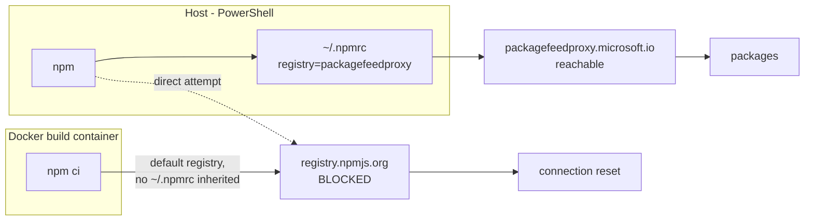

# Local Docker build on a corporate-managed device

**Last verified:** 2026-08-20
**Status:** SOLVED. `docker build` works again locally; see [The fix](#the-fix).

## The symptom

```
 > [prod-deps 5/9] RUN npm ci --omit=dev --no-audit --no-fund && npm cache clean --force:
72.94 npm error Exit handler never called!
72.94 npm error This is an error with npm itself. Please report this error at:
72.94 npm error   <https://github.com/npm/cli/issues>
```

Reproducible, at the same step, at ~72 seconds every time. The message is misleading: `Exit handler never called!` is npm's generic crash when its network work never completes. It invites you to file an npm bug. The cause is not npm.

## What is actually blocked

Measured on this device on 2026-08-20:

| From | To | Result |
|---|---|---|
| Host (PowerShell) | `https://registry.npmjs.org/` | **blocked** - `The SSL connection could not be established` |
| Container (`node:24-alpine`) | `https://registry.npmjs.org/` | **blocked** - `Connection reset by peer` |
| Container | `https://packagefeedproxy.microsoft.io/npm/` | **200 OK**, packages served anonymously |

The host's npm is configured to avoid the public registry entirely:

```
registry=https://packagefeedproxy.microsoft.io/npm/
```

So the block is **not container-specific and not new**. The public npm registry is unreachable from this machine at all, by corporate policy, and the host works only because `~/.npmrc` redirects it to the corporate feed proxy. **A container does not inherit `~/.npmrc`**, so every `npm ci` inside a build went straight at `registry.npmjs.org` and hung.



## Why it only surfaced now

This is the important part, because nothing about the network changed on the day it broke.

| When | What | Effect on local builds |
|---|---|---|
| 2026-02-05 | `~/.npmrc` created | - |
| 2026-07-09 | `~/.npmrc` last modified - registry pointed at the corporate feed proxy | Host npm keeps working; containers now have no route |
| 2026-07-30/31 | Corporate npm policy investigated and documented in [NPM_SUPPLY_CHAIN_QUARANTINE_POLICY.md](strategy/NPM_SUPPLY_CHAIN_QUARANTINE_POLICY.md). The repo instructions were corrected to say a container **cannot** reach the public registry. | The fact was **known and written down**, but only in the context of *lockfile regeneration*. Nobody connected it to the image build. |
| 2026-07-31 -> 2026-08-19 | Every local `docker build` reused the **cached** `RUN npm ci` layer | Builds kept succeeding. The block was invisible. |
| 2026-08-19 | Version bumped to 0.55.12, which edits `api/package.json` and `web/package.json` | `COPY api/package*.json ./` changed -> **cache invalidated** -> first real `npm ci` in weeks -> failure |

**The lesson is the cache.** A Docker layer cache can mask a hard environmental block indefinitely, and it fails at the least convenient moment: the exact commit where you change a dependency or a version. The build did not break on 2026-08-19; it had been broken since 2026-07-09 and was merely not executed.

## How this is normally handled

The general problem - "CI/build containers on a locked-down corporate network cannot reach the public package registry" - has four recognised answers.

| # | Approach | How it works | Trade-off |
|---|---|---|---|
| **1** | **Point the build at the corporate mirror** (registry override) | Pass `--registry` / `NPM_CONFIG_REGISTRY` into the build. npm's `replace-registry-host` default (`npmjs`) rewrites the host of `resolved` URLs that point at `registry.npmjs.org`, so the lockfile still drives *what* is installed. | Needs the mirror to be reachable and to proxy the full public set. Build is no longer reproducible on a machine without the mirror unless the arg defaults sensibly. |
| 2 | **Inject the host `.npmrc` as a build secret** | `RUN --mount=type=secret,id=npmrc ...` with BuildKit. | Carries **credentials** into the build. Our host `.npmrc` holds an Azure DevOps password for a different feed, so this leaks more than it needs to. Rejected on least-privilege grounds. |
| 3 | **Vendor dependencies** (commit `node_modules`, or use an offline cache / `npm ci --offline` with a pre-seeded cache) | Build needs no network at all. | Large repo bloat, and it defeats the lockfile integrity story. Reasonable for air-gapped builds, disproportionate here. |
| 4 | **Do not build locally; build in CI** | GitHub Actions runners have clean egress. Pull the image back for local testing. | Correct fallback and what we used on 2026-08-19, but a 5-to-10 minute round trip per change, and it makes local iteration painful. |

Approach 1 is the standard answer in corporate environments (it is what Artifactory / Nexus / Azure Artifacts upstream-sources exist for), and it is the only one that keeps the local loop fast without handling secrets.

## The fix

`Dockerfile` now takes an **opt-in** build arg, defaulting to the public registry so CI is unchanged:

```dockerfile
ARG NPM_REGISTRY=https://registry.npmjs.org/

FROM node:24-alpine AS web-build
ARG NPM_REGISTRY
RUN npm ci --no-audit --no-fund --registry="$NPM_REGISTRY"
```

Build locally with:

```powershell
docker build -f Dockerfile `
  --build-arg NPM_REGISTRY=https://packagefeedproxy.microsoft.io/npm/ `
  -t scimserver-local:<version> .
```

**Verified end to end on 2026-08-20:** image builds, starts against PostgreSQL, and passes the full live SCIM suite at **1429/1429**.

### Why this is safe for supply chain

This was checked, not assumed:

- **`npm ci` never rewrites the lockfile.** Byte-compared before and after: identical, and `git status` sees no modification.
- **The lockfile still contains only `registry.npmjs.org` in every `resolved` URL**, and every `integrity` value is still `sha512`. The mirror changes the *transport*, not the recorded provenance.
- **Integrity is still verified** against those sha512 hashes, so a mirror serving different bytes would fail the install rather than silently substitute a package.
- Nothing is written to `~/.npmrc`, and **no credential** is passed into the build. The proxy served packages anonymously in testing.

This matters because [NPM_SUPPLY_CHAIN_QUARANTINE_POLICY.md](strategy/NPM_SUPPLY_CHAIN_QUARANTINE_POLICY.md) forbids contaminating a lockfile with internal feed URLs or downgraded integrity hashes. A **registry override at fetch time** is a different operation from **regenerating a lockfile against an internal feed**, and only the second is dangerous.

### What NOT to do

- **Do not** run `npm install` / `npm ci --package-lock-only` on the host to "fix" a lockfile. A measured attempt previously rewrote a `resolved` URL to an internal feed **and downgraded that entry's integrity from sha512 to sha1**. Revert such an entry rather than patching it.
- **Do not** bake the proxy URL in as the Dockerfile default. CI has clean egress and should keep using the public registry, so the default stays public and the corporate value is supplied per-invocation.

## Standing guidance

1. **Local builds are for iteration; CI remains the authoritative image builder.** Images that get deployed are published by [publish-ghcr.yml](../.github/workflows/publish-ghcr.yml) and pulled by digest.
2. **If a local build fails at `npm ci`, check reachability before debugging npm.** One command settles it:
   ```powershell
   docker run --rm node:24-alpine sh -c "wget -q -T 10 -O /dev/null https://registry.npmjs.org/ && echo OK || echo BLOCKED"
   ```
3. **Treat a long run of cache-hit builds as unverified, not as proof.** Periodically build with `--no-cache` so an environmental break surfaces on a day of your choosing rather than mid-release.
