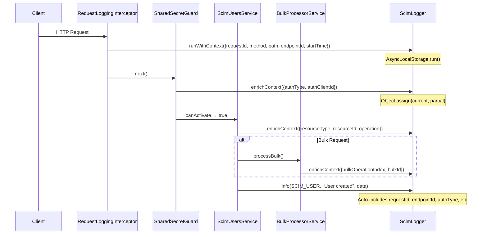
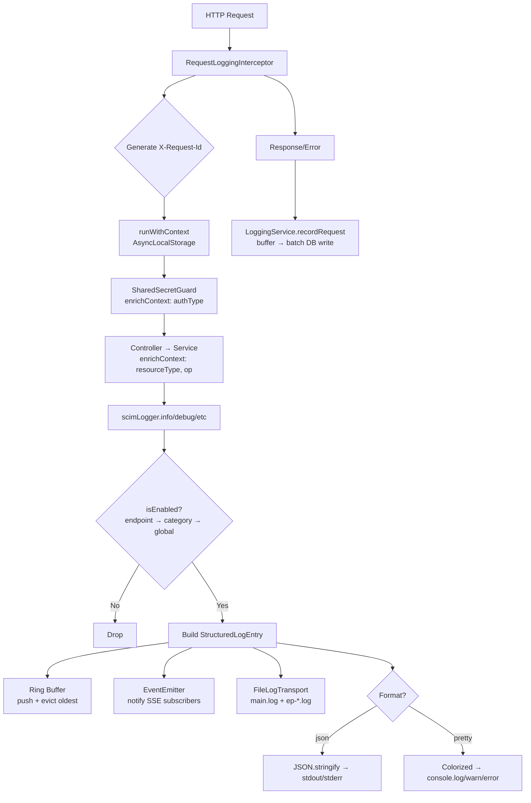
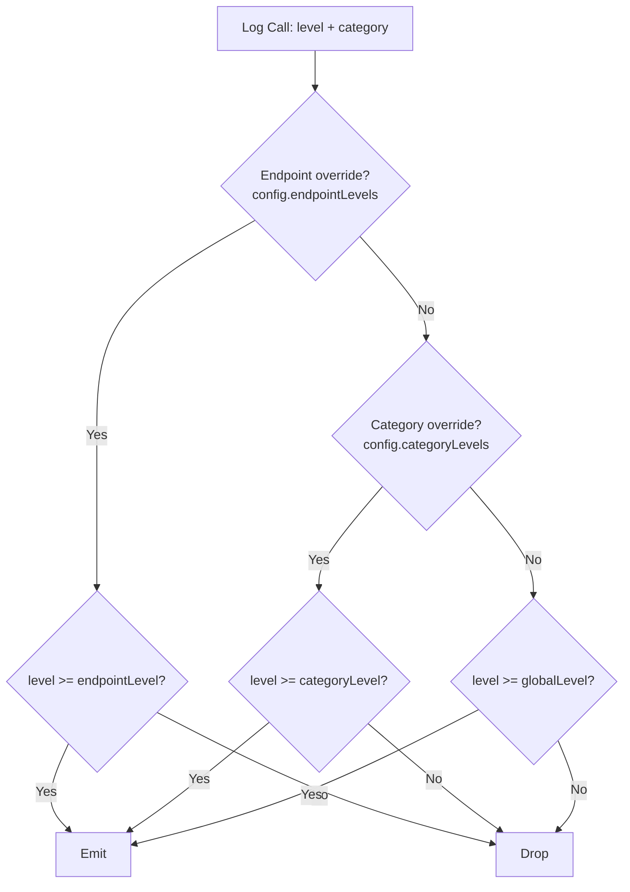
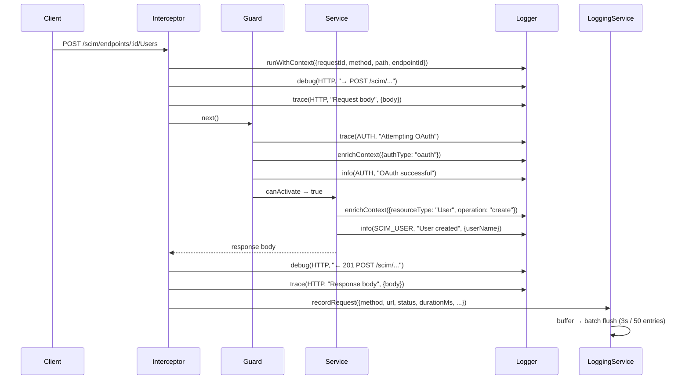

# Logging & Observability Guide

> **Version:** 4.0 · **Source-verified against:** v0.34.0 · **Rewritten:** April 13, 2026  
> Every statement in this document references the actual source file and line — nothing is assumed.

---

## Table of Contents

1. [Architecture Overview](#1-architecture-overview)
2. [Log Levels (RFC 5424-aligned)](#2-log-levels-rfc-5424-aligned)
3. [Log Categories (14 Subsystems)](#3-log-categories-14-subsystems)
4. [Structured Log Entry Format](#4-structured-log-entry-format)
5. [Correlation Context & AsyncLocalStorage](#5-correlation-context--asynclocalstorage)
6. [Output Modes: JSON vs Pretty](#6-output-modes-json-vs-pretty)
7. [Ring Buffer (In-Memory Recent Logs)](#7-ring-buffer-in-memory-recent-logs)
8. [SSE Live Stream](#8-sse-live-stream)
9. [Log File Transport & Rotation](#9-log-file-transport--rotation)
10. [Per-Endpoint Log Isolation](#10-per-endpoint-log-isolation)
11. [Persistent Request Logging (DB)](#11-persistent-request-logging-db)
12. [Runtime Configuration via Admin API](#12-runtime-configuration-via-admin-api)
13. [Environment Variables Reference](#13-environment-variables-reference)
14. [Log Level Decision Matrix](#14-log-level-decision-matrix)
15. [Sensitive Data Handling](#15-sensitive-data-handling)
16. [Slow Request Detection](#16-slow-request-detection)
17. [Audit Trail](#17-audit-trail)
18. [Deployment Mode Behavior](#18-deployment-mode-behavior)
19. [Troubleshooting Log-Related Issues](#19-troubleshooting-log-related-issues)
20. [Mermaid Diagrams](#20-mermaid-diagrams)
21. [Source File Reference](#21-source-file-reference)

---

## 1. Architecture Overview

SCIMServer uses a **fully custom, zero-dependency logging stack** — no Winston, Pino, Bunyan, or Morgan. The entire stack is built on NestJS `Logger`, Node.js `AsyncLocalStorage`, and plain `fs`.

```
┌────────────────────────────────────────────────────────────────┐
│                      Request Pipeline                          │
│                                                                │
│  HTTP Request                                                  │
│    │                                                           │
│    ├─ RequestLoggingInterceptor                                │
│    │    ├─ Generates/propagates X-Request-Id (UUID)            │
│    │    ├─ Creates CorrelationContext via runWithContext()      │
│    │    ├─ Logs request start (DEBUG)                          │
│    │    ├─ Logs request body (TRACE)                           │
│    │    └─ On completion:                                      │
│    │         ├─ Logs response + duration (DEBUG)               │
│    │         ├─ Logs slow requests (WARN)                      │
│    │         └─ Persists to LoggingService (DB buffer)         │
│    │                                                           │
│    ├─ SharedSecretGuard                                        │
│    │    └─ Enriches context: authType, authClientId            │
│    │                                                           │
│    ├─ Controller → Service                                     │
│    │    └─ Enriches context: resourceType, resourceId, op      │
│    │                                                           │
│    └─ Exception Filters                                        │
│         ├─ ScimExceptionFilter (HttpException → SCIM format)   │
│         └─ GlobalExceptionFilter (raw Error → SCIM 500)        │
│                                                                │
├────────────────────────────────────────────────────────────────┤
│                     ScimLogger (singleton)                      │
│                                                                │
│  ┌─────────────┐  ┌─────────────┐  ┌──────────────────┐       │
│  │ Ring Buffer  │  │ SSE Emitter │  │ FileLogTransport │       │
│  │ (2000 max)   │  │ EventEmit   │  │   ├─ main.log    │       │
│  └──────┬──────┘  └──────┬──────┘  │   └─ ep-*.log    │       │
│         │                │         └────────┬─────────┘       │
│         │                │                  │                  │
│  admin/log-config/  SSE stream      logs/ directory           │
│     recent              │                                      │
│                    text/event-stream                            │
│                                                                │
├────────────────────────────────────────────────────────────────┤
│                     Console Output                              │
│  ┌──────────────────┐  ┌──────────────────┐                    │
│  │ JSON mode (prod) │  │ Pretty mode (dev)│                    │
│  │ One JSON/line    │  │ Color + indent   │                    │
│  │ stdout/stderr    │  │ console.log/warn │                    │
│  └──────────────────┘  └──────────────────┘                    │
└────────────────────────────────────────────────────────────────┘
```

**Source files:**
- `api/src/modules/logging/scim-logger.service.ts` — central logger (524 lines)
- `api/src/modules/logging/logging.module.ts` — `@Global()` module registration (27 lines)
- `api/src/modules/logging/request-logging.interceptor.ts` — request lifecycle (146 lines)

---

## 2. Log Levels (RFC 5424-aligned)

Defined in `api/src/modules/logging/log-levels.ts` as a TypeScript enum with ascending numeric severity:

| Level | Numeric | Use Case | Console Target |
|-------|---------|----------|----------------|
| **TRACE** | 0 | Full request/response bodies, SQL, patch path steps | `stdout` (JSON) / `console.debug` (pretty) |
| **DEBUG** | 1 | Operational detail: filter parsing, config reads | `stdout` / `console.debug` |
| **INFO** | 2 | Business events: user created, endpoint activated | `stdout` / `console.log` |
| **WARN** | 3 | Recoverable anomalies: deprecated header, slow query | `stderr` / `console.warn` |
| **ERROR** | 4 | Failed operations: auth failure, DB error | `stderr` / `console.error` |
| **FATAL** | 5 | Unrecoverable: DB lost, secret not configured | `stderr` / `console.error` |
| **OFF** | 6 | Suppress all output | — |

**Parsing:** `parseLogLevel(value)` accepts case-insensitive strings (`'trace'`, `'WARN'`) or numeric values (`'0'`, `'4'`). Unknown values default to `INFO`.

**IMPORTANT:** WARN and above go to `stderr`; DEBUG and below go to `stdout`. This is intentional for container log routing (Azure Monitor, Docker, etc.).

---

## 3. Log Categories (14 Subsystems)

Defined as the `LogCategory` enum in `api/src/modules/logging/log-levels.ts`:

| Category | Value | Subsystem |
|----------|-------|-----------|
| `HTTP` | `http` | Request/response lifecycle |
| `AUTH` | `auth` | Authentication & authorization |
| `SCIM_USER` | `scim.user` | SCIM User operations |
| `SCIM_GROUP` | `scim.group` | SCIM Group operations |
| `SCIM_PATCH` | `scim.patch` | SCIM PATCH operations (detailed) |
| `SCIM_FILTER` | `scim.filter` | SCIM filter parsing & evaluation |
| `SCIM_DISCOVERY` | `scim.discovery` | Discovery endpoints |
| `ENDPOINT` | `endpoint` | Endpoint management |
| `DATABASE` | `database` | Database / Prisma operations |
| `OAUTH` | `oauth` | OAuth token operations |
| `SCIM_BULK` | `scim.bulk` | Bulk operations (RFC 7644 §3.7) |
| `SCIM_RESOURCE` | `scim.resource` | Custom resource type operations |
| `CONFIG` | `config` | Admin config changes (log levels, settings) |
| `GENERAL` | `general` | General / uncategorized |

Each category can have an independent log level override via the admin API or `LOG_CATEGORY_LEVELS` env var.

---

## 4. Structured Log Entry Format

Every log message produces a `StructuredLogEntry` (defined in `scim-logger.service.ts`):

### JSON Output (Production)

```json
{
  "timestamp": "2026-04-13T10:30:45.123Z",
  "level": "INFO",
  "category": "scim.user",
  "message": "User created",
  "requestId": "a1b2c3d4-e5f6-7890-abcd-ef1234567890",
  "endpointId": "ep-contoso-prod",
  "method": "POST",
  "path": "/scim/endpoints/ep-contoso-prod/Users",
  "durationMs": 45,
  "authType": "oauth",
  "resourceType": "User",
  "resourceId": "usr-abc-123",
  "operation": "create",
  "data": {
    "userName": "jsmith@contoso.com"
  }
}
```

### Pretty Output (Development)

```
10:30:45.123 INFO  scim.user      [a1b2c3d4] ep:ep-conto POST /scim/endpoints/ep-contoso-prod/Users +45ms User created | {"userName":"jsmith@contoso.com"}
```

**Color coding** (TTY only):
- TRACE: gray (`\x1b[90m`)
- DEBUG: cyan (`\x1b[36m`)
- INFO: green (`\x1b[32m`)
- WARN: yellow (`\x1b[33m`)
- ERROR: red (`\x1b[31m`)
- FATAL: magenta (`\x1b[35m`)

### Error Entries

Error entries include an `error` object:

```json
{
  "level": "ERROR",
  "category": "http",
  "message": "Unhandled TypeError on POST /scim/endpoints/.../Users",
  "error": {
    "message": "Cannot read properties of undefined",
    "name": "TypeError",
    "stack": "TypeError: Cannot read properties..."
  }
}
```

Stack traces are included by default; controlled by `includeStackTraces` config flag.

---

## 5. Correlation Context & AsyncLocalStorage

**Source:** `scim-logger.service.ts` lines 18–55, 104–106, 164–185

The `CorrelationContext` interface tracks request lifecycle metadata across async boundaries using Node.js `AsyncLocalStorage`. No `cls-hooked` or zone.js — pure Node.js.

### Context Lifecycle


```mermaid
sequenceDiagram
    participant Client
    participant Interceptor as RequestLoggingInterceptor
    participant Guard as SharedSecretGuard
    participant Service as ScimUsersService
    participant Bulk as BulkProcessorService
    participant Logger as ScimLogger

    Client->>Interceptor: HTTP Request
    Interceptor->>Logger: runWithContext({requestId, method, path, endpointId, startTime})
    Note over Logger: AsyncLocalStorage.run()

    Interceptor->>Guard: next()
    Guard->>Logger: enrichContext({authType, authClientId})
    Note over Logger: Object.assign(current, partial)

    Guard->>Service: canActivate → true
    Service->>Logger: enrichContext({resourceType, resourceId, operation})

    alt Bulk Request
        Service->>Bulk: processBulk()
        Bulk->>Logger: enrichContext({bulkOperationIndex, bulkId})
    end

    Service->>Logger: info(SCIM_USER, "User created", data)
    Note over Logger: Auto-includes requestId, endpointId, authType, etc.
```

### Context Fields (populated incrementally)

| Layer | Fields Set | Source |
|-------|-----------|--------|
| **Interceptor** | `requestId`, `method`, `path`, `endpointId`, `startTime` | `request-logging.interceptor.ts` lines 30–37 |
| **Guard** | `authType`, `authClientId`, `authCredentialId` | `shared-secret.guard.ts` lines 119, 137, 169 |
| **Service** | `resourceType`, `resourceId`, `operation` | Service methods via `enrichContext()` |
| **BulkProcessor** | `bulkOperationIndex`, `bulkId` | `bulk-processor.service.ts` |

### External Access

```typescript
// From any module — no DI required:
import { getCorrelationContext } from '../logging/scim-logger.service';

const ctx = getCorrelationContext();
// ctx?.requestId, ctx?.endpointId — available in error factories, guards, etc.
```

This is used by `createScimError()` to auto-enrich SCIM error responses with `requestId` and `endpointId` without requiring the logger to be injected.

---

## 6. Output Modes: JSON vs Pretty

Controlled by the `format` field in `LogConfig` (source: `log-levels.ts` lines 116–117):

| Mode | When | Behavior |
|------|------|----------|
| **`json`** | `NODE_ENV=production` (default in prod) | One JSON line per entry to `stdout`/`stderr`. Ideal for ELK, Azure Monitor, CloudWatch. |
| **`pretty`** | Non-production (default in dev) | Human-readable with ANSI colors, timestamps shortened to `HH:mm:ss.SSS`, data indented at TRACE/DEBUG. |

Can be overridden via:
- `LOG_FORMAT=json` (env var)
- `PUT /scim/admin/log-config` with `{ "format": "json" }` (runtime)

### Output Routing

| Level | JSON mode | Pretty mode |
|-------|-----------|-------------|
| TRACE, DEBUG, INFO | `process.stdout.write()` | `console.debug()` / `console.log()` |
| WARN | `process.stderr.write()` | `console.warn()` |
| ERROR, FATAL | `process.stderr.write()` | `console.error()` |

---

## 7. Ring Buffer (In-Memory Recent Logs)

**Source:** `scim-logger.service.ts` lines 125–128, 250–285

The ScimLogger maintains a circular buffer of the most recent log entries for real-time debugging via the admin API.

| Parameter | Default | Env Var | Description |
|-----------|---------|---------|-------------|
| Size | 2,000 entries | `LOG_RING_BUFFER_SIZE` | Maximum entries before oldest is discarded |

### Access via Admin API

```bash
# Get recent 25 entries
GET /scim/admin/log-config/recent?limit=25

# Filter by level (entries ≥ WARN)
GET /scim/admin/log-config/recent?level=WARN

# Filter by category
GET /scim/admin/log-config/recent?category=scim.patch

# Filter by requestId (trace a single request)
GET /scim/admin/log-config/recent?requestId=a1b2c3d4-...

# Filter by endpointId
GET /scim/admin/log-config/recent?endpointId=ep-contoso

# Clear buffer
DELETE /scim/admin/log-config/recent
```

**Response format:**

```json
{
  "count": 25,
  "entries": [
    { "timestamp": "...", "level": "INFO", "category": "scim.user", "message": "...", ... }
  ]
}
```

When filtered by `requestId` and nothing is found, the response includes a hint:

```json
{
  "count": 0,
  "entries": [],
  "hint": "No entries in ring buffer for requestId 'abc'. Try persistent logs: GET /scim/admin/logs?search=abc"
}
```

---

## 8. SSE Live Stream

**Source:** `log-config.controller.ts` lines 248–305, `log-query.service.ts` lines 70–118

Real-time log tailing via Server-Sent Events:

```bash
# Stream all INFO+ entries
curl -N https://host/scim/admin/log-config/stream?level=INFO

# Stream only authentication events
curl -N https://host/scim/admin/log-config/stream?category=auth

# Stream for a specific endpoint
curl -N https://host/scim/admin/log-config/stream?endpointId=ep-abc123

# Per-endpoint scoped stream (endpoint credential holders)
curl -N https://host/scim/endpoints/ep-abc123/logs/stream
```

### SSE Protocol Details

| Feature | Implementation |
|---------|----------------|
| **Initial event** | `event: connected\ndata: ...` with filter summary |
| **Log events** | `data: {JSON}\n\n` — one structured entry per event |
| **Keep-alive** | `: ping {ISO-8601}\n\n` every 30 seconds |
| **NGINX buffering** | `X-Accel-Buffering: no` header prevents proxy caching |
| **Max listeners** | `emitter.setMaxListeners(50)` — supports 50 concurrent SSE clients |
| **Cleanup** | `res.on('close')` unsubscribes + clears interval |

### Browser Usage

```javascript
const source = new EventSource('/scim/admin/log-config/stream?level=INFO');
source.addEventListener('connected', (e) => console.log(JSON.parse(e.data)));
source.onmessage = (e) => console.log(JSON.parse(e.data));
```

---

## 9. Log File Transport & Rotation

**Source:** `file-log-transport.ts` (101 lines), `rotating-file-writer.ts` (99 lines)

### File Layout

```
logs/
  scimserver.log                              ← ALL traffic (main file)
  scimserver.log.1                            ← Previous rotation
  scimserver.log.2                            ← Oldest rotation
  endpoints/
    contoso-prod_ep-a1b2c3d4/
      contoso-prod_ep-a1b2c3d4.log            ← Endpoint-specific
    fabrikam-test_ep-e5f67890/
      fabrikam-test_ep-e5f67890.log           ← Another endpoint
```

### Configuration

| Env Var | Default | Description |
|---------|---------|-------------|
| `LOG_FILE` | `logs/scimserver.log` | Main log file path. Set to empty string `""` to disable file logging. |
| `LOG_FILE_MAX_SIZE` | `10485760` (10 MB) | Max bytes per file before rotation |
| `LOG_FILE_MAX_COUNT` | `3` | Number of rotated files to keep |

### Rotation Scheme

Pure Node.js `fs` (synchronous writes, no external dependencies):

```
scimserver.log       ← current (appending)
    │ (exceeds 10 MB)
    ▼
scimserver.log.3     ← DELETED (exceeds maxFiles)
scimserver.log.2     ← renamed from .1
scimserver.log.1     ← renamed from scimserver.log
scimserver.log       ← NEW empty file opened
```

### Per-Endpoint File Logging

Enabled per-endpoint via `enableEndpointFileLogging(endpointId, endpointName)`. The directory name is sanitized for filesystem safety:
- Non-alphanumeric characters → hyphens
- Truncated to 50 characters
- Format: `{safeName}_ep-{first8chars}/`

---

## 10. Per-Endpoint Log Isolation

**Source:** `endpoint-log.controller.ts` (127 lines)

Each SCIM endpoint gets isolated log access under `/scim/endpoints/:endpointId/logs/*`:

| Route | Description |
|-------|-------------|
| `GET /scim/endpoints/:id/logs/recent` | Ring buffer filtered by `endpointId` |
| `GET /scim/endpoints/:id/logs/stream` | SSE stream filtered by `endpointId` |
| `GET /scim/endpoints/:id/logs/download` | File download filtered by `endpointId` |
| `GET /scim/endpoints/:id/logs/history` | Persistent DB logs filtered by URL pattern |

This provides **tenant-safe log access** — per-endpoint credential holders can only see their own endpoint's log entries. The `endpointId` is taken from the URL path parameter, not from a query string, so it cannot be spoofed.

The controller delegates to `LogQueryService` for shared ring buffer query, SSE stream setup, and file download logic.

---

## 11. Persistent Request Logging (DB)

**Source:** `logging.service.ts` (715 lines)

Every HTTP request is persisted to the database (Prisma/PostgreSQL or in-memory) for historical analysis.

### Buffered Write Strategy

| Parameter | Value | Rationale |
|-----------|-------|-----------|
| Flush interval | 3,000 ms | Trade up to 3s data loss on crash for reduced DB write overhead |
| Max buffer size | 50 entries | Flush immediately when 50 entries accumulate |
| Write strategy | `createMany` (single batch insert) | 1 write instead of N individual writes |

### Record Fields

Each `RequestLog` row contains:
- `id` (UUID), `method`, `url`, `status`, `durationMs`, `createdAt`
- `requestHeaders`, `requestBody` (JSON stringified)
- `responseHeaders`, `responseBody` (JSON stringified)
- `errorMessage`, `errorStack`
- `identifier` — derived reportable identifier (userName, email, displayName)

### Identifier Derivation

The `LoggingService` derives a human-readable identifier for each log entry:
1. **User endpoints:** Extracts `userName`, primary email, `externalId`, or resource `id` from request/response bodies
2. **Group endpoints:** Extracts `displayName`
3. **URL fallback:** Extracts last UUID-like segment from URL path
4. **Display name resolution:** For User IDs, attempts DB lookup → `displayName` / `name.formatted` / `name.givenName + familyName` / `userName`

### Query API

```bash
# List logs (paginated, filtered)
GET /scim/admin/logs?page=1&pageSize=50&method=POST&status=409

# Full text search across all fields
GET /scim/admin/logs?search=jsmith@contoso.com

# Date range
GET /scim/admin/logs?since=2026-04-01T00:00:00Z&until=2026-04-13T23:59:59Z

# Show slow requests only
GET /scim/admin/logs?minDurationMs=1000

# Include admin endpoints (excluded by default)
GET /scim/admin/logs?includeAdmin=true

# Hide keepalive probes (Entra ID filter probes)
GET /scim/admin/logs?hideKeepalive=true
```

### Log Retention

```bash
# Delete logs older than 30 days
# Programmatic: loggingService.pruneOldLogs(30)

# Clear all logs
DELETE /scim/admin/logs
```

### In-Memory Backend

When `PERSISTENCE_BACKEND=inmemory`, logs are stored in a plain array (`inMemoryLogRows`). Same query interface applies but all data is ephemeral.

---

## 12. Runtime Configuration via Admin API

**Source:** `log-config.controller.ts` (352 lines)

All log configuration is changeable at runtime without server restart:

### Routes

| Method | Route | Description |
|--------|-------|-------------|
| `GET` | `/scim/admin/log-config` | Current config + available levels/categories |
| `PUT` | `/scim/admin/log-config` | Update config (partial updates supported) |
| `PUT` | `/scim/admin/log-config/level/:level` | Quick: set global level |
| `PUT` | `/scim/admin/log-config/category/:cat/:level` | Set category level |
| `PUT` | `/scim/admin/log-config/endpoint/:id/:level` | Set endpoint level |
| `DELETE` | `/scim/admin/log-config/endpoint/:id` | Remove endpoint override |
| `GET` | `/scim/admin/log-config/recent` | Ring buffer query |
| `GET` | `/scim/admin/log-config/audit` | Audit trail (CONFIG, ENDPOINT, AUTH entries) |
| `DELETE` | `/scim/admin/log-config/recent` | Clear ring buffer |
| `GET` | `/scim/admin/log-config/stream` | SSE live stream |
| `GET` | `/scim/admin/log-config/download` | Download logs as NDJSON/JSON |

### Example: PUT Config

```bash
curl -X PUT https://host/scim/admin/log-config \
  -H "Authorization: Bearer $TOKEN" \
  -H "Content-Type: application/json" \
  -d '{
    "globalLevel": "DEBUG",
    "includePayloads": true,
    "includeStackTraces": true,
    "maxPayloadSizeBytes": 16384,
    "format": "json",
    "slowRequestThresholdMs": 1000,
    "categoryLevels": {
      "scim.patch": "TRACE",
      "auth": "WARN"
    }
  }'
```

### Audit Logging of Config Changes

Every config change is logged at INFO level with before/after values:

```json
{
  "level": "INFO",
  "category": "config",
  "message": "Log configuration updated",
  "data": {
    "changes": {
      "globalLevel": { "from": 2, "to": 1 },
      "format": { "from": "pretty", "to": "json" }
    }
  }
}
```

---

## 13. Environment Variables Reference

| Variable | Default | Description |
|----------|---------|-------------|
| `LOG_LEVEL` | `INFO` | Global minimum log level (TRACE/DEBUG/INFO/WARN/ERROR/FATAL/OFF) |
| `LOG_FORMAT` | `pretty` (dev) / `json` (prod) | Output format |
| `LOG_CATEGORY_LEVELS` | _(empty)_ | Per-category overrides. Format: `scim.patch=TRACE,auth=WARN,http=DEBUG` |
| `LOG_INCLUDE_PAYLOADS` | `true` (dev) / `false` (prod) | Include request/response bodies in TRACE/DEBUG |
| `LOG_INCLUDE_STACKS` | `true` | Include stack traces in ERROR/FATAL |
| `LOG_MAX_PAYLOAD_SIZE` | `8192` (8 KB) | Max bytes before payload truncation in log data |
| `LOG_RING_BUFFER_SIZE` | `2000` | Ring buffer capacity (entries) |
| `LOG_SLOW_REQUEST_MS` | `2000` | Slow request threshold (ms) — emits WARN |
| `LOG_FILE` | `logs/scimserver.log` | Main log file path. Set to `""` to disable. |
| `LOG_FILE_MAX_SIZE` | `10485760` (10 MB) | Max file size before rotation |
| `LOG_FILE_MAX_COUNT` | `3` | Number of rotated files to keep |
| `NODE_ENV` | _(unset)_ | `production` → JSON format, payloads off by default |

---

## 14. Log Level Decision Matrix

The system uses **tiered log levels** based on HTTP status codes and operation context. Source: `request-logging.interceptor.ts` lines 97–116, `scim-exception.filter.ts` lines 53–72.

| Status / Event | Level | Rationale |
|---------------|-------|-----------|
| 5xx | **ERROR** | Server fault — operator should investigate |
| 401 / 403 | **WARN** | Potential security event |
| 404 | **DEBUG** | Routine probe (especially from Entra ID) |
| Other 4xx (400, 409, 412, 415) | **INFO** | Client error — logged for traceability |
| Request start | **DEBUG** | Operational detail (not business event) |
| Request body | **TRACE** | Full payload detail |
| Response completion | **DEBUG** | Operational detail with duration |
| Response body | **TRACE** | Full payload detail |
| Slow request | **WARN** | Performance anomaly |
| Auth success | **INFO** | Business event |
| Auth skip (public) | **TRACE** | No-op, extremely verbose |
| Config change | **INFO** | Audit trail |
| User/Group created | **INFO** | Business event |
| Repository failure | **ERROR** | Service-level failure |
| FATAL (no secret, DB lost) | **FATAL** | Unrecoverable |

---

## 15. Sensitive Data Handling

**Source:** `scim-logger.service.ts` lines 361–380 (`sanitizeData`)

### Automatic Redaction

Any log data key matching this regex is replaced with `[REDACTED]`:

```
/secret|password|token|authorization|bearer|jwt/i
```

### Payload Truncation

Large string values are truncated to `maxPayloadSizeBytes` (default 8 KB) with a suffix:

```
"requestBody": "{ very long json ..... ...[truncated 15234B]"
```

Object values are serialized to JSON first, then truncated if needed:

```
"data": "{ serialized json ..... ...[truncated]"
```

---

## 16. Slow Request Detection

**Source:** `request-logging.interceptor.ts` lines 87–91, `log-levels.ts` line 120

Requests exceeding `slowRequestThresholdMs` (default 2,000 ms) emit a WARN log:

```json
{
  "level": "WARN",
  "category": "http",
  "message": "Slow request: 3456ms",
  "durationMs": 3456,
  "status": 200
}
```

Configurable via:
- `LOG_SLOW_REQUEST_MS` env var
- `PUT /scim/admin/log-config` with `{ "slowRequestThresholdMs": 1000 }`

---

## 17. Audit Trail

**Source:** `log-config.controller.ts` lines 232–246

The `GET /scim/admin/log-config/audit` endpoint returns audit trail entries — CONFIG, ENDPOINT, and AUTH category logs from the ring buffer:

```json
{
  "count": 12,
  "entries": [
    { "category": "config", "message": "Log configuration updated", ... },
    { "category": "endpoint", "message": "Endpoint created", ... },
    { "category": "auth", "message": "Per-endpoint credential authentication successful", ... }
  ]
}
```

---

## 18. Deployment Mode Behavior

| Behavior | Development | Production | Docker | Azure Container Apps |
|----------|-------------|------------|--------|---------------------|
| Default format | `pretty` | `json` | `json` | `json` |
| Include payloads | `true` | `false` | `false` | `false` |
| Console colors | Yes (TTY) | No (no TTY) | No | No |
| File logging | Optional | Optional | Via volume mount | Via Azure Files share |
| Ring buffer | Yes | Yes | Yes | Yes |
| SSE stream | Yes | Yes | Yes | Yes |
| DB log persistence | Yes | Yes | Yes | Yes |
| Slow request threshold | 2,000 ms | 2,000 ms | 2,000 ms | 2,000 ms |

**Docker Compose** example:

```yaml
environment:
  - LOG_LEVEL=INFO
  - LOG_FORMAT=json
  - LOG_FILE=/app/logs/scimserver.log
  - LOG_SLOW_REQUEST_MS=3000
volumes:
  - ./logs:/app/logs
```

---

## 19. Troubleshooting Log-Related Issues

### TL-01: "No entries in ring buffer" — logs disappeared

**Symptom:** `GET /scim/admin/log-config/recent?requestId=abc` returns `{"count": 0, "entries": []}`.

**Response hint:**
```json
{
  "count": 0,
  "entries": [],
  "hint": "No entries in ring buffer for requestId 'abc'. Try persistent logs: GET /scim/admin/logs?search=abc"
}
```

**Cause:** The ring buffer holds only the last 2,000 entries (default). Older entries are evicted.

**Resolution:**
1. Use persistent DB logs instead: `GET /scim/admin/logs?search=abc`
2. Increase buffer: set `LOG_RING_BUFFER_SIZE=10000` env var
3. For future incidents: download logs before they're evicted: `GET /scim/admin/log-config/download`

---

### TL-02: Logs are too verbose / flooding console

**Symptom:** Thousands of TRACE/DEBUG lines in stdout.

**Resolution — runtime (no restart):**
```bash
# Set to INFO (suppress DEBUG/TRACE)
curl -X PUT https://host/scim/admin/log-config/level/INFO \
  -H "Authorization: Bearer $TOKEN"

# Or suppress a noisy category:
curl -X PUT https://host/scim/admin/log-config/category/http/WARN \
  -H "Authorization: Bearer $TOKEN"
```

**Resolution — env var (restart required):**
```bash
LOG_LEVEL=INFO
LOG_CATEGORY_LEVELS=http=WARN,scim.filter=WARN
```

---

### TL-03: Logs don't show request/response bodies

**Symptom:** Only `"→ POST /scim/..."` and `"← 201"` log entries, no body content.

**Cause:** Request/response bodies are logged at **TRACE** level. Default `LOG_LEVEL=INFO` suppresses them.

**Resolution:**
```bash
# Enable TRACE for HTTP category only (targeted)
curl -X PUT https://host/scim/admin/log-config/category/http/TRACE \
  -H "Authorization: Bearer $TOKEN"
```

Also ensure `includePayloads` is `true`:
```bash
curl -X PUT https://host/scim/admin/log-config \
  -H "Authorization: Bearer $TOKEN" \
  -H "Content-Type: application/json" \
  -d '{"includePayloads": true}'
```

---

### TL-04: SSE stream disconnects immediately

**Symptom:** `curl -N https://host/scim/admin/log-config/stream` connects then closes.

**Cause:** Reverse proxy (NGINX, Azure Front Door) buffering the SSE response.

**Resolution:** The server sends `X-Accel-Buffering: no` but some proxies may still buffer. Check:
1. NGINX: add `proxy_buffering off;` in your location block
2. Azure Container Apps: SSE works out of the box (no proxy buffering by default)
3. Verify with: `curl -N -v https://host/scim/admin/log-config/stream` — look for the `event: connected` line

---

### TL-05: Log files not appearing in `logs/` directory

**Symptom:** No `logs/scimserver.log` file created.

**Cause:** File logging is disabled or path is not writable.

**Resolution:**
1. Check `LOG_FILE` env var — empty string `""` disables file logging
2. Default path is `logs/scimserver.log` relative to working directory
3. In Docker: ensure volume mount exists and is writable
4. Check permissions: the Node.js process needs write access to the directory

---

### TL-06: "[REDACTED]" appearing in log data

**Symptom:** Log entries show `"authorization": "[REDACTED]"` or `"password": "[REDACTED]"`.

**This is expected behavior.** The logger automatically redacts any data key matching `/secret|password|token|authorization|bearer|jwt/i` to prevent credential leakage.

---

### TL-07: Request ID not matching between request and response

**Symptom:** `X-Request-Id` in the response doesn't match what you sent.

**Expected behavior:** If you send `X-Request-Id: my-id` in the request header, the server propagates it. If you don't send it, the server generates a UUID.

**Resolution:** If you need deterministic request IDs for tracing, always send `X-Request-Id` header in your requests:
```bash
curl -H "X-Request-Id: my-trace-id-123" \
     -H "Authorization: Bearer $TOKEN" \
     https://host/scim/endpoints/ep-abc123/Users
```

---

### TL-08: GET /admin/log-config returns 401

**Cause:** The admin API requires the same bearer token as SCIM endpoints. The log config endpoints are protected by `SharedSecretGuard`.

**Resolution:** Include `Authorization: Bearer <your-token>` header. All `/scim/admin/*` routes require authentication.

---

### TL-09: Per-endpoint logs show entries from other endpoints

**Symptom:** `GET /scim/endpoints/ep-abc/logs/recent` returns entries without `endpointId` or with a different `endpointId`.

**This should not happen.** The endpoint log controller filters by `endpointId` from the URL path. If you see this:
1. Verify the URL path: it must be `/scim/endpoints/{exact-id}/logs/recent`
2. Check if you're hitting the admin endpoint by mistake: `/scim/admin/log-config/recent` (unfiltered)

---

### TL-10: Slow request warnings but response times look normal

**Symptom:** WARN logs say "Slow request: 3456ms" but your client sees fast responses.

**Cause:** The slow request threshold may be set too low, or server-side processing genuinely takes longer than client-side perceived latency (e.g., async DB write after response is sent).

**Resolution:** Adjust the threshold:
```bash
curl -X PUT https://host/scim/admin/log-config \
  -H "Authorization: Bearer $TOKEN" \
  -H "Content-Type: application/json" \
  -d '{"slowRequestThresholdMs": 5000}'
```

Or via env var: `LOG_SLOW_REQUEST_MS=5000`

---

## 20. Mermaid Diagrams

### Log Entry Flow


```mermaid
flowchart TD
    A[HTTP Request] --> B[RequestLoggingInterceptor]
    B --> C{Generate X-Request-Id}
    C --> D[runWithContext<br/>AsyncLocalStorage]
    D --> E[SharedSecretGuard<br/>enrichContext: authType]
    E --> F[Controller → Service<br/>enrichContext: resourceType, op]
    F --> G[scimLogger.info/debug/etc]

    G --> H{isEnabled?<br/>endpoint → category → global}
    H -->|No| I[Drop]
    H -->|Yes| J[Build StructuredLogEntry]

    J --> K[Ring Buffer<br/>push + evict oldest]
    J --> L[EventEmitter<br/>notify SSE subscribers]
    J --> M[FileLogTransport<br/>main.log + ep-*.log]
    J --> N{Format?}
    N -->|json| O[JSON.stringify → stdout/stderr]
    N -->|pretty| P[Colorized → console.log/warn/error]

    B --> Q[Response/Error]
    Q --> R[LoggingService.recordRequest<br/>buffer → batch DB write]
```

### Level Resolution Priority


```mermaid
flowchart TD
    A[Log Call: level + category] --> B{Endpoint override?<br/>config.endpointLevels}
    B -->|Yes| C{level >= endpointLevel?}
    C -->|Yes| D[Emit]
    C -->|No| E[Drop]

    B -->|No| F{Category override?<br/>config.categoryLevels}
    F -->|Yes| G{level >= categoryLevel?}
    G -->|Yes| D
    G -->|No| E

    F -->|No| H{level >= globalLevel?}
    H -->|Yes| D
    H -->|No| E
```

### Request Lifecycle Logging


```mermaid
sequenceDiagram
    participant C as Client
    participant I as Interceptor
    participant G as Guard
    participant S as Service
    participant L as Logger
    participant DB as LoggingService

    C->>I: POST /scim/endpoints/:id/Users
    I->>L: runWithContext({requestId, method, path, endpointId})
    I->>L: debug(HTTP, "→ POST /scim/...")
    I->>L: trace(HTTP, "Request body", {body})

    I->>G: next()
    G->>L: trace(AUTH, "Attempting OAuth")
    G->>L: enrichContext({authType: "oauth"})
    G->>L: info(AUTH, "OAuth successful")

    G->>S: canActivate → true
    S->>L: enrichContext({resourceType: "User", operation: "create"})
    S->>L: info(SCIM_USER, "User created", {userName})

    S-->>I: response body
    I->>L: debug(HTTP, "← 201 POST /scim/...")
    I->>L: trace(HTTP, "Response body", {body})
    I->>DB: recordRequest({method, url, status, durationMs, ...})
    DB->>DB: buffer → batch flush (3s / 50 entries)
```

---

## 21. Source File Reference

### Core Logging Module (`api/src/modules/logging/`)

| File | Lines | Purpose |
|------|-------|---------|
| `scim-logger.service.ts` | 524 | Central logger: AsyncLocalStorage, ring buffer, structured JSON, SSE, file transport |
| `log-levels.ts` | 149 | LogLevel enum (TRACE→OFF), LogCategory enum (14), LogConfig interface, env parsing |
| `logging.service.ts` | 715 | Persistent request log: buffered writes, batch insert, identifier derivation |
| `log-config.controller.ts` | 352 | Admin API: GET/PUT config, recent, audit, stream, download |
| `log-query.service.ts` | 147 | Shared query/stream/download logic for admin + endpoint controllers |
| `request-logging.interceptor.ts` | 146 | Request lifecycle: X-Request-Id, correlation context, duration, persist |
| `file-log-transport.ts` | 101 | File transport: main + per-endpoint log files |
| `rotating-file-writer.ts` | 99 | Size-based file rotation: pure Node.js fs |
| `logging.module.ts` | 27 | @Global() NestJS module registration |

### Exception Filters (`api/src/modules/scim/filters/`)

| File | Lines | Purpose |
|------|-------|---------|
| `global-exception.filter.ts` | 104 | Catch-all for non-HttpException → SCIM 500 |
| `scim-exception.filter.ts` | 128 | HttpException → SCIM error format (RFC 7644 §3.12) |

### Error Utilities

| File | Lines | Purpose |
|------|-------|---------|
| `scim-errors.ts` | 134 | `createScimError()` factory with diagnostics extension |
| `scim-constants.ts` | 67 | `SCIM_ERROR_SCHEMA`, `SCIM_DIAGNOSTICS_URN`, `SCIM_ERROR_TYPE` |
| `repository-error.ts` | 51 | Domain error: NOT_FOUND, CONFLICT, CONNECTION, UNKNOWN |
| `prisma-error.util.ts` | 43 | Prisma error code → RepositoryError mapping |
| `patch-error.ts` | 32 | PATCH-specific error with operationIndex, failedPath |
| `scim-service-helpers.ts` | 1,348 | `handleRepositoryError()` bridge function |

### Per-Endpoint Log Controller

| File | Lines | Purpose |
|------|-------|---------|
| `endpoint-log.controller.ts` | 127 | `/scim/endpoints/:id/logs/*` — recent, stream, download, history |

### Test Coverage

| File | Lines | Type |
|------|-------|------|
| `scim-logger.service.spec.ts` | 666 | Unit |
| `log-levels.spec.ts` | 193 | Unit |
| `log-config.controller.spec.ts` | 533 | Unit |
| `request-logging.interceptor.spec.ts` | 258 | Unit |
| `file-log-transport.spec.ts` | 137 | Unit |
| `rotating-file-writer.spec.ts` | 85 | Unit |
| `log-config.e2e-spec.ts` | 350 | E2E |
| `endpoint-scoped-logs.e2e-spec.ts` | 126 | E2E |
| `rca-diagnostics.e2e-spec.ts` | 171 | E2E |
| `error-handling.e2e-spec.ts` | 345 | E2E |
| `http-error-codes.e2e-spec.ts` | 165 | E2E |
| `scripts/live-test.ps1` (Section 9j) | — | Live integration |

---

> **Total logging stack:** 55 dedicated files, ~14,767 lines of source code + tests.  
> **External dependencies:** Zero (no Winston, Pino, Bunyan, or Morgan).  
> **Test coverage:** 6 unit suites, 5 E2E suites, 1 live test section.
