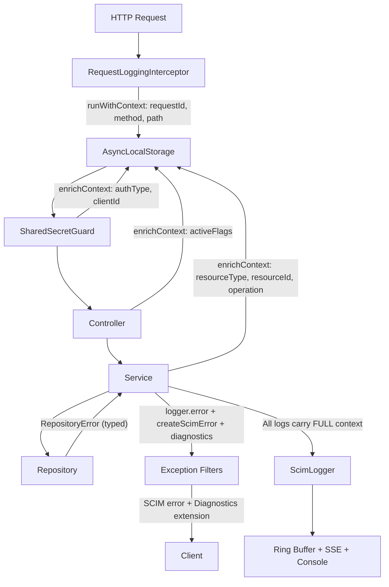
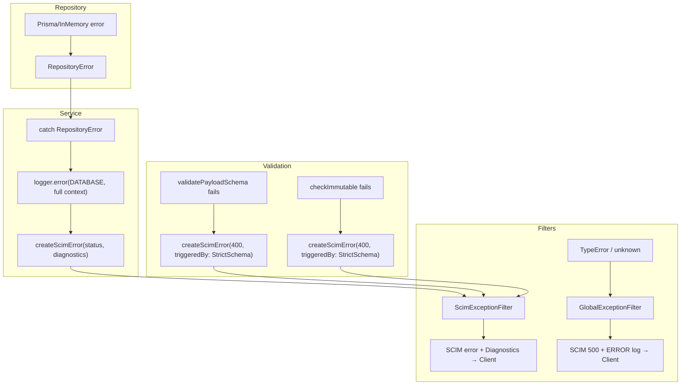

# Logging & Error Handling — Ideal Design Proposal

> **Date:** April 6, 2026 | **Version:** 2.0 (comprehensive redesign)  
> **Scope:** Complete observability strategy — logging, error handling, levels, placement, deployment, operations  
> **Status:** 📋 PROPOSED  
> **Prerequisite:** [LOGGING_ERROR_HANDLING_QUALITY_AUDIT.md](LOGGING_ERROR_HANDLING_QUALITY_AUDIT.md) — 28-gap audit  
> **RFC References:** [RFC 7644 §3.12](https://datatracker.ietf.org/doc/html/rfc7644#section-3.12), [RFC 5424](https://datatracker.ietf.org/doc/html/rfc5424), [OpenTelemetry Logs](https://opentelemetry.io/docs/specs/otel/logs/)

---

## Table of Contents

### Part I — Root Cause Analysis

| # | Section |
|---|---|
| 1 | [Executive Summary](#1-executive-summary) |
| 2 | [Three Core Design Problems](#2-three-core-design-problems) |

### Part II — Design Principles (What & Why)

| # | Section |
|---|---|
| 3 | [Principle Overview](#3-principle-overview) |
| 4 | [P1: Enriched Correlation Context](#4-p1-enriched-correlation-context) |
| 5 | [P2: Self-Diagnosable Error Responses](#5-p2-self-diagnosable-error-responses) |
| 6 | [P3: Unified Logger](#6-p3-unified-logger) |
| 7 | [P4: Domain Error Boundary](#7-p4-domain-error-boundary) |
| 8 | [P5: Decision Logging](#8-p5-decision-logging) |
| 9 | [P6: Bulk Operation Correlation](#9-p6-bulk-operation-correlation) |
| 10 | [P7: No Silent Catches](#10-p7-no-silent-catches) |
| 11 | [P8: Error Log Completeness](#11-p8-error-log-completeness) |
| 12 | [P9: Log Level Redesign](#12-p9-log-level-redesign) |

### Part III — Event Types & Placement (Where & When)

| # | Section |
|---|---|
| 13 | [Log Event Taxonomy](#13-log-event-taxonomy) |
| 14 | [Layer-by-Layer Placement Map](#14-layer-by-layer-placement-map) |
| 15 | [Master Level Assignment Table](#15-master-level-assignment-table) |

### Part IV — Error Classification & Handling

| # | Section |
|---|---|
| 16 | [Error Classification Taxonomy](#16-error-classification-taxonomy) |
| 17 | [Error Path Coverage](#17-error-path-coverage) |
| 18 | [Catch-All Exception Filter](#18-catch-all-exception-filter) |

### Part V — Console, Deployment & Operations

| # | Section |
|---|---|
| 19 | [Console Output Strategy](#19-console-output-strategy) |
| 20 | [Deployment Access Matrix](#20-deployment-access-matrix) |
| 21 | [PII & Data Privacy](#21-pii--data-privacy) |

### Part VI — Future Observability

| # | Section |
|---|---|
| 22 | [Metrics & Counters](#22-metrics--counters) |
| 23 | [Health Check Depth](#23-health-check-depth) |
| 24 | [Multi-Instance Considerations](#24-multi-instance-considerations) |
| 25 | [Remaining Topics (P3 priority)](#25-remaining-topics) |

### Part VII — Implementation

| # | Section |
|---|---|
| 26 | [Before & After Comparison](#26-before--after-comparison) |
| 27 | [Architecture Diagrams](#27-architecture-diagrams) |
| 28 | [Implementation Plan](#28-implementation-plan) |
| 29 | [Change Register](#29-change-register) |

---

## 1. Executive Summary

The [quality audit](LOGGING_ERROR_HANDLING_QUALITY_AUDIT.md) identified 28 gaps. These stem from **three fundamental design problems**. This document proposes **9 design principles** and a complete **event type taxonomy + placement map** that resolve all gaps.

### The Core Shift

```
CURRENT:  "A log entry tells you WHAT happened"
IDEAL:    "A log entry or error response tells you WHAT happened,
           WHY it happened, and HOW to diagnose it — without
           leaving the artifact you're looking at"
```

### Principles at a Glance

| # | Principle | Highest Gap Resolved | ROI |
|---|---|---|---|
| P1 | Enriched Correlation Context | G5, G12, G13 | **Highest** — all logs get richer for free |
| P2 | Self-Diagnosable Error Responses | G12, G13 | High — eliminates error↔log gap |
| P3 | Unified Logger | G11 | Medium — consistency |
| P4 | Domain Error Boundary | G1, G2, G6 | High — eliminates backend parity issues |
| P5 | Decision Logging | G17, G18 | Medium — transforms RCA speed |
| P6 | Bulk Operation Correlation | G3 | High — unlocks bulk RCA |
| P7 | No Silent Catches | G14 | Medium — makes corruption visible |
| P8 | Error Log Completeness | G7, G8, G9 | **Critical** — most 5xx paths currently unlogged |
| P9 | Log Level Redesign | G17, G21 | Medium — reduces noise, correct severity |

---

## 2. Three Core Design Problems

### Problem 1: Log Entry ↔ Error Response Isolation

```
┌─────────────────────┐        ┌──────────────────────┐
│     LOG ENTRY        │        │   ERROR RESPONSE     │
│  requestId ✓         │        │  requestId ✗         │
│  endpointId ✓        │        │  endpointId ✗        │
│  configFlags ✗       │        │  triggeredBy ✗       │
│  (presetName derivable from endpointId — excluded)     │
│  resourceId ✗        │        │  logsUrl ✗           │
└─────────────────────┘        └──────────────────────┘
        └───── No shared context ───────┘
```

### Problem 2: Scattered Context

Each layer logs its own slice. No layer has the full picture. The `enrichContext()` method exists on ScimLogger but is **never called** anywhere.

### Problem 3: Fire-and-Forget Errors

`createScimError()` throws. By the time `ScimExceptionFilter` catches it, all rich context from the throw site (which service, which validation step, which config flags) is gone. Only the text message travels.

---

## 3. Principle Overview

| # | Principle | Summary | Gaps | Priority |
|---|---|---|---|---|
| P1 | Enriched Context | Accumulate auth, config, resource info in `AsyncLocalStorage` | G5,G12,G13,G25 | **P0** |
| P2 | Diagnosable Errors | `requestId`, `triggeredBy`, `logsUrl` in error response extension | G12,G13 | **P0** |
| P3 | Unified Logger | Replace all NestJS `Logger` → `ScimLogger` | G11 | **P1** |
| P4 | Domain Error Boundary | `RepositoryError` at repo layer | G1,G2,G6,G16 | **P0** |
| P5 | Decision Logging | One rich INFO per operation outcome | G17,G18 | **P1** |
| P6 | Bulk Correlation | `bulkOperationIndex` in context + start/complete/error | G3 | **P1** |
| P7 | No Silent Catches | Every catch → WARN with context | G14 | **P1** |
| P8 | Error Log Completeness | ERROR before every 5xx throw + catch-all filter | G7,G8,G9 | **P0** |
| P9 | Level Redesign | HTTP bookends → DEBUG; 4xx demotion; event type taxonomy | G17,G21 | **P1** |

---

## 4. P1: Enriched Correlation Context

### Current → Ideal

```typescript
// CURRENT: 5 fields, set only by interceptor, never enriched
interface CorrelationContext {
  requestId: string; method?: string; path?: string;
  endpointId?: string; startTime?: number;
}

// IDEAL: 16 fields, enriched by every layer
interface CorrelationContext {
  // HTTP (interceptor)
  requestId: string; method: string; path: string; startTime: number;
  // Endpoint (controller)
  endpointId?: string; endpointName?: string;
  // Auth (guard)
  authType?: 'oauth' | 'legacy' | 'endpoint_credential' | 'public';
  authClientId?: string; authCredentialId?: string;
  // Config (controller)
  activeFlags?: Record<string, boolean>;
  // Operation (service)
  resourceType?: string; resourceId?: string;
  operation?: string; // 'create' | 'get' | 'list' | 'patch' | 'put' | 'delete'
  // Bulk (bulk processor)
  bulkOperationIndex?: number; bulkId?: string;
}
```

### Enrichment Points

| Layer | Call | Fields Added |
|---|---|---|
| Interceptor | `runWithContext(...)` | requestId, method, path, endpointId, startTime |
| Guard | `enrichContext(...)` | authType, authClientId, authCredentialId |
| Controller | `enrichContext(...)` | activeFlags |
| Service | `enrichContext(...)` | resourceType, resourceId, operation |
| BulkProcessor | `enrichContext(...)` | bulkOperationIndex, bulkId |

**Key insight**: Every subsequent log statement inherits the full context via `AsyncLocalStorage`. A WARN from `stripReadOnlyAttributes()` deep in a helper automatically carries `authType`, `activeFlags`, `resourceType`. `presetName` is intentionally excluded — it's derivable from `endpointId` via `GET /admin/endpoints/:id` and never changes the operator's fix action.

---

## 5. P2: Self-Diagnosable Error Responses

### RFC-Compliant Diagnostic Extension

The extension carries only **actionable** fields — things that change what the operator does next:

```json
{
  "schemas": ["urn:ietf:params:scim:api:messages:2.0:Error"],
  "detail": "Schema validation failed: department: expected type 'string', got 'integer'",
  "scimType": "invalidValue",
  "status": "400",
  "urn:scimserver:api:messages:2.0:Diagnostics": {
    "requestId": "a1b2c3d4-e5f6-7890-abcd-1234567890ab",
    "endpointId": "ep-abc123",
    "triggeredBy": "StrictSchemaValidation",
    "logsUrl": "/scim/endpoints/ep-abc123/logs/recent?requestId=a1b2c3d4-e5f6-7890-abcd-1234567890ab"
  }
}
```

`logsUrl` points to the **endpoint-scoped** log path — accessible to per-endpoint credential holders without admin access. Falls back to `/scim/admin/log-config/recent?requestId=...` when no `endpointId` is in scope (OAuth, discovery, admin routes).

**Why not `presetName` (in diagnostics or context)?** It's derivable from `endpointId` via `GET /admin/endpoints/:id`. The `detail` already tells you which attribute failed. Adding `presetName` to every log entry and error response doesn't change the fix action — the operator either corrects the payload or disables `StrictSchemaValidation`. Keeping both the diagnostics extension and correlation context lean avoids noise.
```

### Enhanced createScimError

```typescript
export function createScimError({ status, detail, scimType, diagnostics }: ScimErrorOptions): HttpException {
  const body = { schemas: [SCIM_ERROR_SCHEMA], detail, scimType, status: String(status) };
  const ctx = correlationStorage.getStore();
  if (ctx || diagnostics) {
    body[SCIM_DIAGNOSTICS_URN] = {
      requestId: ctx?.requestId,
      endpointId: ctx?.endpointId,
      triggeredBy: diagnostics?.triggeredBy,
      logsUrl: ctx?.requestId
        ? ctx?.endpointId
          ? `/scim/endpoints/${ctx.endpointId}/logs/recent?requestId=${ctx.requestId}`
          : `/scim/admin/log-config/recent?requestId=${ctx.requestId}`
        : undefined,
    };
  }
  return new HttpException(body, status);
}
```

---

## 6. P3: Unified Logger

Replace all `new Logger(ClassName.name)` with injected `ScimLogger`. **5 files**:

| File | Current | New Category |
|---|---|---|
| `logging.service.ts` | NestJS Logger | `LogCategory.DATABASE` |
| `endpoint.service.ts` | NestJS Logger | `LogCategory.ENDPOINT` |
| `prisma.service.ts` | NestJS Logger | `LogCategory.DATABASE` |
| `admin-credential.controller.ts` | NestJS Logger | `LogCategory.AUTH` |
| `scim-schema-registry.ts` | NestJS Logger | `LogCategory.SCIM_DISCOVERY` |

---

## 7. P4: Domain Error Boundary

### RepositoryError

```typescript
export class RepositoryError extends Error {
  constructor(
    public readonly code: 'NOT_FOUND' | 'CONFLICT' | 'CONNECTION' | 'UNKNOWN',
    message: string,
    public readonly cause?: Error,
  ) { super(message); this.name = 'RepositoryError'; }
}
```

Both Prisma and InMemory repos translate native errors → `RepositoryError`. Services catch + log at ERROR + re-throw as `createScimError`.

---

## 8. P5: Decision Logging

Replace intent+completion pairs with **one rich completion entry**:

```
// CURRENT (4 entries per POST):
INFO  http       → POST /Users
INFO  scim.user  Creating user
INFO  scim.user  User created  {scimId, userName}
INFO  http       ← 201 POST /Users

// IDEAL (1 entry at INFO in production):
INFO  scim.user  User created  {scimId, userName, decision: "new-resource",
                  validationsRun: [...], readOnlyStripped: [...],
                  coercionApplied: true, softDelete: false}
```

---

## 9. P6: Bulk Operation Correlation

```
INFO  scim.bulk  Bulk started    {opCount: 30, failOnErrors: 5}      [req-001]
INFO  scim.user  User created    {scimId, bulkIndex: 0, bulkId: "u1"} [req-001]
WARN  scim.bulk  Bulk op failed  {bulkIndex: 17, status: 409}         [req-001]
INFO  scim.bulk  Bulk completed  {total: 30, success: 29, errors: 1}  [req-001]
```

New categories: `SCIM_BULK`, `SCIM_RESOURCE` (replaces `GENERAL` for generic service).

---

## 10. P7: No Silent Catches

Every `catch` that doesn't re-throw MUST log at WARN with: what failed, fallback value, identifiers, error message.

```typescript
// CURRENT:
try { rawPayload = JSON.parse(existing.rawPayload); } catch { /* silent */ }

// IDEAL:
try { rawPayload = JSON.parse(existing.rawPayload); }
catch (e) {
  this.logger.warn(LogCategory.DATABASE, 'Corrupt rawPayload — using empty object', {
    scimId: existing.scimId, endpointId, error: (e as Error).message,
  });
}
```

9 sites identified in the audit.

---

## 11. P8: Error Log Completeness

### Rule 1: Every 5xx throw MUST be preceded by `logger.error()`

```typescript
try {
  await this.userRepo.create(input);
} catch (err) {
  this.logger.error(LogCategory.SCIM_USER, 'Repository failure during user create', err, {
    operation: 'create', resourceType: 'User', endpointId,
    errorCode: err instanceof RepositoryError ? err.code : 'UNKNOWN',
  });
  throw createScimError({ status: 500, detail: ..., diagnostics: { triggeredBy: 'database' } });
}
```

### Rule 2: ERROR entries MUST include

| Field | Required | Example |
|---|---|---|
| `operation` | Yes | `'create'`, `'patch'`, `'flush'` |
| `resourceType` | If SCIM | `'User'`, `'Group'` |
| `errorCode` | Yes | `'REPO_NOT_FOUND'`, `'PATCH_ENGINE'`, `'UNKNOWN'` |
| `component` | Yes | `'EndpointScimUsersService'` |
| `recoverable` | Yes | `true` (can retry) / `false` |

### Rule 3: Catch-all exception filter

```typescript
@Catch()  // catches EVERYTHING — not just HttpException
export class GlobalExceptionFilter implements ExceptionFilter {
  catch(exception: unknown, host: ArgumentsHost): void {
    if (exception instanceof HttpException) throw exception; // let ScimExceptionFilter handle

    this.logger.error(LogCategory.HTTP, 'Unhandled exception', exception, {
      errorClass: 'SERVER_INTERNAL', component: 'GlobalExceptionFilter',
    });

    // Return SCIM-compliant 500
    response.status(500).setHeader('Content-Type', 'application/scim+json; charset=utf-8')
      .json({ schemas: [SCIM_ERROR_SCHEMA], detail: 'Internal server error', status: '500' });
  }
}
```

### Rule 4: Admin operations MUST be logged (audit trail)

| Admin Action | Level | Category |
|---|---|---|
| Log level changed | INFO | `ENDPOINT` |
| Endpoint created/updated/deleted | INFO | `ENDPOINT` |
| Credential created/revoked | INFO | `AUTH` |
| Ring buffer cleared | INFO | `HTTP` |
| Logs downloaded | DEBUG | `HTTP` |

### Rule 5: Startup errors must produce structured FATAL

```typescript
async function bootstrap(): Promise<void> {
  try { /* ... */ await app.listen(port); }
  catch (err) {
    process.stderr.write(JSON.stringify({
      timestamp: new Date().toISOString(), level: 'FATAL', category: 'system',
      message: `Server failed to start: ${(err as Error).message}`,
      error: { message: (err as Error).message, stack: (err as Error).stack },
    }) + '\n');
    process.exit(1);
  }
}
```

---

## 12. P9: Log Level Redesign

### Level Philosophy

| Level | Operator Question | Production? |
|---|---|---|
| TRACE | Show me raw data flowing through | Off |
| DEBUG | Show me internal decisions | Off |
| **INFO** | **Show me business events that matter** | **On** |
| **WARN** | **Show me things to investigate** | **On** |
| **ERROR** | **Show me things broken RIGHT NOW** | **On** |
| FATAL | Server cannot function | On |

### Key Level Changes

| Current | Level | Ideal | Level | Rationale |
|---|---|---|---|---|
| HTTP request bookend (→/←) | INFO | Same | **DEBUG** | Operational detail, not business event |
| "Creating user" (intent) | INFO | **Remove** | — | Redundant — keep completion only |
| "List users" | INFO | Same | **DEBUG** | Query, not a state change |
| 404 client error | WARN | Same | **DEBUG** | Routine probe (Entra does thousands) |
| 409 conflict | WARN | Same | **INFO** | Normal dedup, not operator concern |
| 400 bad request | WARN | Same | **INFO** | Client's problem |
| 401 unauthorized | WARN | **WARN** | Same | Potential security event |

### What Production INFO Looks Like After Redesign

```
INFO  auth         OAuth authentication successful  {clientId: "..."}
INFO  scim.user    User created  {scimId, userName, decision: "new-resource"}
INFO  scim.user    User patched  {scimId, opCount: 3, stripped: 1}
INFO  scim.bulk    Bulk completed  {total: 30, success: 28, errors: 2}
INFO  endpoint     Endpoint created  {endpointId, preset: "entra-id", by: "oauth:client1"}
```

One line per business event. No HTTP noise. No redundant intent/result pairs.

---

## 13. Log Event Taxonomy

Every log statement is classifiable into one of **7 event types**:

| Type | Level | Purpose | Example |
|---|---|---|---|
| **LIFECYCLE** | INFO | Resource created/updated/deleted | `"User created"`, `"Group patched"` |
| **REQUEST** | DEBUG | HTTP in/out, routing, content negotiation | `"→ POST /Users"`, `"← 201"` |
| **SECURITY** | INFO/WARN | Auth success (INFO), failure (WARN) | `"OAuth successful"`, `"Auth failed"` |
| **VALIDATION** | DEBUG/WARN | Schema check passed (DEBUG), stripped (WARN) | `"ReadOnly stripped"` |
| **SYSTEM** | INFO→FATAL | Startup, shutdown, connectivity, performance | `"DB connected"`, `"Slow query"` |
| **ADMIN** | INFO | Config/admin changes | `"Log level changed"`, `"Endpoint created"` |
| **DATA** | TRACE | Full payloads, SQL, parse trees | `"Request body"`, `"Response body"` |

---

## 14. Layer-by-Layer Placement Map

```
┌── Middleware ──────────────────────────────────────────┐
│  WARN  → 415 content-type rejection          NEW      │
└────────────────────────────────────────────────────────┘
┌── Interceptor ─────────────────────────────────────────┐
│  DEBUG → request in/out (demoted from INFO)            │
│  TRACE → request/response bodies                       │
│  WARN  → slow request >threshold                       │
│  ERROR → on exception (catch-all safety net)           │
└────────────────────────────────────────────────────────┘
┌── Guard ───────────────────────────────────────────────┐
│  INFO  → auth success                                  │
│  WARN  → auth failure, missing secret                  │
│  DEBUG → auth cascade steps                            │
│  FATAL → secret not configured (production)            │
│  + enrichContext: authType, clientId                    │
└────────────────────────────────────────────────────────┘
┌── Controller ──────────────────────────────────────────┐
│  CURRENTLY: ZERO logging                               │
│  IDEAL:                                                │
│    + enrichContext: activeFlags                        │
│    INFO → admin CRUD (endpoint/credential changes) NEW │
│    INFO → log config changes                      NEW  │
└────────────────────────────────────────────────────────┘
┌── Service ─────────────────────────────────────────────┐
│  INFO  → operation completed (one rich entry)          │
│  WARN  → readOnly stripped, data integrity             │
│  ERROR → repository failure, transaction failure  NEW  │
│  DEBUG → validation passed, coercion applied      NEW  │
│  + enrichContext: resourceType, resourceId, operation  │
└────────────────────────────────────────────────────────┘
┌── Domain (PatchEngine, SchemaValidator) ───────────────┐
│  ZERO logging — pure domain. Throws typed errors.      │
│  Services catch and log.                               │
└────────────────────────────────────────────────────────┘
┌── Repository ──────────────────────────────────────────┐
│  CURRENTLY: ZERO logging                               │
│  IDEAL:                                                │
│    DEBUG → query duration                         NEW  │
│    WARN  → slow query >500ms                      NEW  │
│    ERROR → connection failure (RepositoryError)   NEW  │
└────────────────────────────────────────────────────────┘
┌── Exception Filters ──────────────────────────────────┐
│  ScimExceptionFilter: 5xx→ERROR, 4xx→varies           │
│  GlobalExceptionFilter: non-HttpException→ERROR   NEW │
└────────────────────────────────────────────────────────┘
```

---

## 15. Master Level Assignment Table

| Layer | Event | Current | Ideal | Type |
|---|---|---|---|---|
| Interceptor | `→ POST /Users` | INFO | **DEBUG** | REQUEST |
| Interceptor | `← 201 POST /Users` | INFO | **DEBUG** | REQUEST |
| Interceptor | Request/response body | TRACE | TRACE | DATA |
| Interceptor | Slow request | WARN | WARN | SYSTEM |
| Middleware | 415 rejection | *(none)* | **WARN** | VALIDATION |
| Guard | Auth success | INFO | INFO | SECURITY |
| Guard | Auth failure | WARN | WARN | SECURITY |
| Guard | Auth cascade | DEBUG | DEBUG | SECURITY |
| Guard | Secret missing (prod) | FATAL | FATAL | SYSTEM |
| Service | "Creating user" (intent) | INFO | **Remove** | — |
| Service | "User created" (result) | INFO | INFO | LIFECYCLE |
| Service | "Get user" | DEBUG | DEBUG | REQUEST |
| Service | "User not found" → 404 | DEBUG | **INFO** | LIFECYCLE |
| Service | "List users" | INFO | **DEBUG** | REQUEST |
| Service | "Patch user" (intent) | INFO | **Remove** | — |
| Service | "User patched" (result) | INFO | INFO | LIFECYCLE |
| Service | "Replace user" (intent) | INFO | **Merge into completion** | — |
| Service | "User replaced" | *(missing)* | **INFO** | LIFECYCLE |
| Service | "User deleted" | INFO | INFO | LIFECYCLE |
| Service | ReadOnly stripped | WARN | WARN | VALIDATION |
| Service | Schema validation passed | *(none)* | **DEBUG** | VALIDATION |
| Service | Boolean coercion applied | *(none)* | **DEBUG** | VALIDATION |
| Service | Soft-delete guard 404 | DEBUG | **INFO** | LIFECYCLE |
| Service | JSON.parse failure | *(none/silent)* | **WARN** | SYSTEM |
| Service | DB error (RepositoryError) | *(none/Groups only)* | **ERROR** | SYSTEM |
| Bulk | Bulk started | *(none)* | **INFO** | LIFECYCLE |
| Bulk | Bulk op failed | *(none)* | **WARN** | LIFECYCLE |
| Bulk | Bulk completed | *(none)* | **INFO** | LIFECYCLE |
| Repository | Query duration | *(none)* | **DEBUG** | SYSTEM |
| Repository | Slow query >500ms | *(none)* | **WARN** | SYSTEM |
| Repository | Connection failure | *(none)* | **ERROR** | SYSTEM |
| Admin | Log level changed | *(none)* | **INFO** | ADMIN |
| Admin | Endpoint CRUD | *(none)* | **INFO** | ADMIN |
| Admin | Credential CRUD | *(none)* | **INFO** | ADMIN |
| Filter | 400 Bad Request | WARN | **INFO** | — |
| Filter | 401 Unauthorized | WARN | WARN | SECURITY |
| Filter | 404 Not Found | WARN | **DEBUG** | — |
| Filter | 409 Conflict | WARN | **INFO** | — |
| Filter | 5xx Server Error | ERROR | ERROR | SYSTEM |
| Startup | Server listening | INFO (NestJS) | INFO (ScimLogger) | SYSTEM |
| Startup | DB connected | INFO (NestJS) | INFO (ScimLogger) | SYSTEM |
| Startup | Startup failure | *(process crash)* | **FATAL** (structured) | SYSTEM |

---

## 16. Error Classification Taxonomy

| Class | Status | Level | Retryable | Example |
|---|---|---|---|---|
| `CLIENT_VALIDATION` | 400 | INFO | No | Missing schema, wrong type |
| `CLIENT_AUTH` | 401/403 | WARN | Yes (new token) | Expired token |
| `CLIENT_CONFLICT` | 409 | INFO | No | Duplicate userName |
| `CLIENT_PRECONDITION` | 412/428 | INFO | Yes (re-fetch ETag) | Stale ETag |
| `CLIENT_NOT_FOUND` | 404 | DEBUG | No | Resource doesn't exist |
| `SERVER_DATABASE` | 500/503 | **ERROR** | Yes | Connection timeout |
| `SERVER_TRANSACTION` | 500 | **ERROR** | Yes | Deadlock/rollback |
| `SERVER_DATA_INTEGRITY` | 500 | **ERROR** | No | Corrupt rawPayload |
| `SERVER_INTERNAL` | 500 | **ERROR** | Maybe | TypeError, unexpected null |
| `INFRA_STARTUP` | N/A | **FATAL** | No (fix config) | Missing secret, bad DB URL |
| `INFRA_CONNECTIVITY` | 503 | **FATAL** | Yes (wait) | Cannot reach DB |

---

## 17. Error Path Coverage

### Every `throw` → Does It Get an ERROR Log?

| Error Source | Current | Ideal |
|---|---|---|
| `createScimError(4xx)` | WARN (filter) | INFO or DEBUG (per classification) |
| `createScimError(5xx)` | ERROR (filter) + ERROR (Groups only) | ERROR (service) + ERROR (filter) |
| Prisma raw error | ERROR (interceptor, raw) | **ERROR (service, structured)** + ERROR (filter) |
| InMemory `new Error()` | ERROR (interceptor, raw) + non-SCIM body | **ERROR (service)** + SCIM body via RepositoryError |
| PatchEngine TypeError | ERROR (interceptor, raw) | **ERROR (service)** + SCIM body via catch-all |
| `BadRequestException` | WARN (filter) | INFO (reclassified as CLIENT_VALIDATION) |
| Startup crash | Raw stack trace | **FATAL** (structured JSON to stderr) |
| OOM/segfault | Nothing | Nothing (OS level — out of scope) |

---

## 18. Catch-All Exception Filter

```typescript
@Catch()
export class GlobalExceptionFilter implements ExceptionFilter {
  constructor(private readonly logger: ScimLogger) {}

  catch(exception: unknown, host: ArgumentsHost): void {
    if (exception instanceof HttpException) throw exception;

    const ctx = host.switchToHttp();
    const request = ctx.getRequest<Request>();
    const response = ctx.getResponse<Response>();

    this.logger.error(LogCategory.HTTP, 'Unhandled exception', exception, {
      errorClass: 'SERVER_INTERNAL',
      component: 'GlobalExceptionFilter',
      url: request?.originalUrl,
      method: request?.method,
      errorType: (exception as any)?.constructor?.name ?? typeof exception,
    });

    response.status(500)
      .setHeader('Content-Type', 'application/scim+json; charset=utf-8')
      .json({
        schemas: [SCIM_ERROR_SCHEMA],
        detail: 'Internal server error',
        status: '500',
      });
  }
}
```

Registered with **lower priority** than `ScimExceptionFilter` — only fires for non-`HttpException` errors.

---

## 19. Console Output Strategy

### Current Problem — 4 Interleaved Formats at Startup

| Source | Format | Example |
|---|---|---|
| Raw `console.warn` | Plain text | `[PrismaService] DATABASE_URL not set...` |
| NestJS internals | `[Nest] PID - timestamp LOG [Context] msg` | `[Nest] 12345 - ... LOG [RoutesResolver]` |
| NestJS Logger | Same | `[Nest] 12345 - ... LOG [PrismaService]` |
| ScimLogger | JSON or pretty | `{"timestamp":"...","level":"INFO",...}` |

**Ideal**: All runtime logging through ScimLogger (P3 unifies). Pre-DI startup messages (`PrismaService` constructor) remain as raw `console.warn` — this is an architectural constraint (ScimLogger doesn't exist yet).

### stdout vs stderr Split

| Level | JSON mode | Pretty mode |
|---|---|---|
| TRACE/DEBUG/INFO | `process.stdout.write` | `console.log`/`console.debug` → stdout |
| WARN/ERROR/FATAL | `process.stderr.write` | `console.warn`/`console.error` → stderr |

---

## 20. Deployment Access Matrix

| Access Method | Local Dev | Docker | Azure | What It Accesses |
|---|---|---|---|---|
| Terminal stdout/stderr | Direct | `docker logs -f` | `az containerapp logs --follow` | All console output |
| Ring buffer API | `curl localhost` | Same | `curl fqdn` + auth | Last 500 ScimLogger entries |
| SSE stream | `curl -N localhost` | Same | Same | Real-time ScimLogger entries |
| Download API | `curl -o file` | Same | Same | Ring buffer snapshot as file |
| DB request logs | Requires PostgreSQL | Via PostgreSQL | Same | Full request history |
| Azure Log Analytics | N/A | N/A | KQL (30-day, 5-min delay) | All stdout/stderr |
| `remote-logs.ps1` | All modes | All modes | All modes | Admin API wrapper |
| **Log file on disk** | **N/A** | **N/A** | **N/A** | — (stdout-only is correct per 12-factor) |

**Docker compose gap**: No `logging.driver` config → unbounded log growth. Add:
```yaml
logging: { driver: json-file, options: { max-size: "10m", max-file: "3" } }
```

---

## 21. PII & Data Privacy

### Current State

- TRACE-level logs include full SCIM payloads → **emails, phone numbers, names, addresses**
- Ring buffer stores 500 entries in memory → PII accessible via admin API
- `RequestLog` table stores full request/response bodies → PII persisted in DB
- Log download endpoint serves PII to bearer token holders
- Only secret-field redaction exists (`/secret|password|token|.../i`)

### Ideal Policy

| Level | PII Policy |
|---|---|
| TRACE | Full payloads — only enable temporarily, clear ring buffer after |
| DEBUG | Identifiers only (userName, scimId) — no emails, no phone numbers |
| INFO | Business identifiers only (scimId, userName) |
| WARN/ERROR | Error detail only — may include userName from error message |

**Future**: Configurable PII redaction rules for SCIM attributes (e.g., redact `emails[].value`, `phoneNumbers[].value`).

---

## 22. Metrics & Counters

**Not implemented; design for future.**

| Metric | Type | Use |
|---|---|---|
| `scim_requests_total{method, status, endpoint}` | Counter | Request volume + error rates |
| `scim_request_duration_seconds{method, endpoint}` | Histogram | Latency (p50/p95/p99) |
| `scim_active_requests` | Gauge | Concurrency |
| `scim_auth_failures_total{reason}` | Counter | Security monitoring |
| `scim_db_query_duration_seconds{operation}` | Histogram | DB performance |
| `scim_ring_buffer_size` | Gauge | Buffer utilization |
| `scim_log_flush_errors_total` | Counter | Log persistence health |

Integration: Prometheus `/metrics` endpoint or Azure Application Insights SDK.

---

## 23. Health Check Depth

**Current**: `GET /scim/health` → `{"status":"ok"}` (shallow).

**Ideal**:

```json
{
  "status": "healthy",
  "checks": {
    "database": { "status": "healthy", "latencyMs": 2 },
    "memory": { "status": "healthy", "heapUsedMB": 120, "heapLimitMB": 384 },
    "ringBuffer": { "status": "healthy", "size": 342, "capacity": 500 },
    "logFlush": { "status": "healthy", "bufferDepth": 3, "lastFlushAgo": "2s" }
  },
  "version": "0.31.0",
  "uptime": "4h 23m"
}
```

---

## 24. Multi-Instance & Tenant Isolation

### Multi-Instance Considerations

**Deferred (P3 priority) but documented for awareness:**

| Problem | Impact | Future Solution |
|---|---|---|
| Ring buffer per-instance | Different results per replica | Shared ring buffer (Redis) or centralized logging |
| SSE connects to one replica | See 1/N logs | Client-side merge or centralized SSE proxy |
| Config changes per-instance | Other replicas keep old level | Shared config store or broadcast mechanism |
| No replica ID in logs | Can't distinguish instances | Add `instanceId` to `CorrelationContext` |

### Tenant Log Isolation — Two-Tier Access Model

**Principle**: Endpoint-scoped paths auto-filter by endpointId. Admin paths see everything with optional filtering.

#### Tier 1 — Endpoint-Scoped (per-endpoint credential holders)

**Recent logs (ring buffer):**
```
GET  /scim/endpoints/:endpointId/logs/recent
```

| Parameter | Type | Default | Description |
|---|---|---|---|
| `limit` | number | 100 | Max entries to return |
| `level` | string | — | Minimum severity: `TRACE`, `DEBUG`, `INFO`, `WARN`, `ERROR`, `FATAL` |
| `category` | string | — | Filter by category: `scim.user`, `scim.group`, `scim.patch`, `scim.bulk`, `http`, `auth` |
| `requestId` | string | — | Filter by correlation ID (from `X-Request-Id` header) |
| `method` | string | — | Filter by HTTP method: `GET`, `POST`, `PATCH`, `PUT`, `DELETE` |
| `resourceId` | string | — | Filter by SCIM resource ID (from enriched context) |
| `since` | ISO date | — | Entries after this timestamp |

Examples:
```bash
# All recent errors for this endpoint
GET /scim/endpoints/ep-abc123/logs/recent?level=ERROR

# Trace a specific request
GET /scim/endpoints/ep-abc123/logs/recent?requestId=a1b2c3d4-...

# Bulk operation failures only
GET /scim/endpoints/ep-abc123/logs/recent?category=scim.bulk&level=WARN

# PATCH operations in the last hour
GET /scim/endpoints/ep-abc123/logs/recent?category=scim.patch&since=2026-04-06T09:00:00Z

# Everything related to a specific user
GET /scim/endpoints/ep-abc123/logs/recent?resourceId=usr-789xyz
```

**Live stream (SSE):**
```
GET  /scim/endpoints/:endpointId/logs/stream
```

| Parameter | Type | Description |
|---|---|---|
| `level` | string | Minimum severity filter |
| `category` | string | Category filter |

Example:
```bash
# Tail WARN+ for this endpoint in real time
curl -N "https://host/scim/endpoints/ep-abc123/logs/stream?level=WARN"
```

**Download (file export):**
```
GET  /scim/endpoints/:endpointId/logs/download
```

| Parameter | Type | Default | Description |
|---|---|---|---|
| `format` | string | `ndjson` | `ndjson` or `json` |
| `level` | string | — | Minimum severity filter |
| `category` | string | — | Category filter |
| `requestId` | string | — | Correlation ID filter |
| `limit` | number | all | Max entries |

**DB request logs (persistent history):**
```
GET  /scim/endpoints/:endpointId/logs
```

| Parameter | Type | Default | Description |
|---|---|---|---|
| `page` | number | 1 | Pagination page |
| `pageSize` | number | 50 | Items per page (max 200) |
| `method` | string | — | HTTP method filter |
| `status` | number | — | HTTP status code filter |
| `hasError` | boolean | — | Only error entries |
| `since` | ISO date | — | Entries after timestamp |
| `until` | ISO date | — | Entries before timestamp |
| `search` | string | — | Full-text search in URL, body, error |

Example:
```bash
# Last 20 failed requests for this endpoint
GET /scim/endpoints/ep-abc123/logs?hasError=true&pageSize=20

# All POST operations today
GET /scim/endpoints/ep-abc123/logs?method=POST&since=2026-04-06T00:00:00Z
```

- **Auto-filtered** by `endpointId` from the URL path — no `?endpointId=` parameter needed
- Per-endpoint credentials can only access their own endpoint's path (existing URL-based auth scoping)
- Sources: ring buffer (`/recent`, `/stream`, `/download`) + DB request logs (`/logs`)
- No access to admin API, global config, or other endpoints' data

#### Tier 2 — Admin (global secret / OAuth holders)

**Admin-specific paths (cross-tenant, all endpoints):**
```
GET  /scim/admin/log-config/recent?endpointId=ep-abc123    (optional filter)
GET  /scim/admin/log-config/stream?endpointId=ep-abc123    (optional filter)
GET  /scim/admin/log-config/download?endpointId=ep-abc123  (optional filter)
GET  /scim/admin/logs?endpointId=ep-abc123                 (optional filter — NEW)
PUT  /scim/admin/log-config/level/TRACE                    (global config change)
```

- **No `?endpointId=`** → returns all endpoints' logs (full cross-tenant visibility)
- **With `?endpointId=`** → filtered to one endpoint
- Only accessible via global shared secret or OAuth (restrict per-endpoint credentials from `/scim/admin/*`)
- `GET /admin/logs` gains `?endpointId=` parameter (currently missing — see G29)

**Admins also access all Tier 1 endpoint-scoped paths:**
```
GET  /scim/endpoints/:any-endpointId/logs/recent
GET  /scim/endpoints/:any-endpointId/logs/stream
GET  /scim/endpoints/:any-endpointId/logs/download
GET  /scim/endpoints/:any-endpointId/logs
```

Global secret and OAuth credentials pass the `SharedSecretGuard` for any endpoint path — admins can use either the admin API (cross-tenant) or the endpoint-scoped API (single-tenant) depending on what they need.

#### Current Gaps

| Problem | Fix |
|---|---|
| No endpoint-scoped log endpoint exists | Add `GET /endpoints/:id/logs` (Tier 1) |
| Per-endpoint credentials can access admin API | Restrict `/scim/admin/*` to global/OAuth only |
| `GET /admin/logs` (DB) has no `?endpointId=` filter | Add `endpointId` filter parameter |
| Ring buffer shared — noisy endpoint evicts others | P2: per-endpoint partition |
| Error responses don't carry `endpointId` in body | P2: diagnostics extension adds it |

---

## 25. Remaining Topics

| Topic | Priority | Notes |
|---|---|---|
| OpenTelemetry / distributed tracing | P3 | Single-service today; add when downstream calls exist |
| Log sampling / rate limiting | P3 | Add when scale > 1000 req/s |
| Alerting thresholds | P3 | Integrate with metrics (§22) |
| Structured error codes (SCIM-001..NNN) | P3 | Machine-parseable beyond scimType |
| Log schema versioning | P3 | `logVersion: 2` field for consumer compatibility |
| Performance impact measurement | P3 | Benchmark AsyncLocalStorage + JSON.stringify overhead |
| Compliance logging (SOC 2, HIPAA) | P3 | Tamper-proof audit, retention policies |
| Logging graceful degradation | P2 | Circuit breaker for flush failures; safe JSON.stringify |
| Request/response size logging | P3 | Add `requestSize`, `responseSize` to HTTP entries |

---

## 26. Before & After Comparison

### Scenario: POST /Users with schema validation error

**Before** (current):
```json
// Error response — no requestId, no way to know which flag caused this
// Attribute path is bare "department" — ambiguous if a custom extension also defines it
{
  "schemas": ["urn:ietf:params:scim:api:messages:2.0:Error"],
  "detail": "Schema validation failed: department: expected type 'string', got 'integer'",
  "scimType": "invalidValue",
  "status": "400"
}
```
```
// Logs — 3 INFO/WARN entries, no config context, no endpointId detail
INFO  http       → POST /Users
WARN  http       Client error 400  {"status":400,"detail":"Schema validation failed: department: expected type 'string', got 'integer'"}
INFO  http       ← 400 POST /Users
```
**RCA time**: 10+ minutes — operator must: find X-Request-Id header (often not captured by client), query endpoint config, determine which flag caused this, check schema definitions.

**After** (ideal):
```json
// Error response — URN-qualified attribute path eliminates ambiguity
// Diagnostics extension makes the error self-diagnosable
{
  "schemas": ["urn:ietf:params:scim:api:messages:2.0:Error"],
  "detail": "Schema validation failed: urn:ietf:params:scim:schemas:extension:enterprise:2.0:User:department: expected type 'string', got 'integer'",
  "scimType": "invalidValue",
  "status": "400",
  "urn:scimserver:api:messages:2.0:Diagnostics": {
    "requestId": "a1b2c3d4-e5f6-7890-abcd-1234567890ab",
    "endpointId": "ep-abc123",
    "triggeredBy": "StrictSchemaValidation",
    "logsUrl": "/scim/endpoints/ep-abc123/logs/recent?requestId=a1b2c3d4-e5f6-7890-abcd-1234567890ab"
  }
}
```
```
// Logs — WARN with enriched context from AsyncLocalStorage
WARN  http       Client error 400  {"status":400,
                  "detail":"Schema validation failed: urn:...:enterprise:2.0:User:department: expected type 'string', got 'integer'",
                  "triggeredBy":"StrictSchemaValidation",
                  "endpointId":"ep-abc123","authType":"oauth"}
```
**RCA time**: 30 seconds — error response tells you `triggeredBy: StrictSchemaValidation` (so you know to disable that flag or fix the payload), the URN-qualified path tells you exactly which schema's `department` failed, `requestId` lets you click `logsUrl` for full trace, `endpointId` identifies which tenant.

> **Implementation note — URN-qualified attribute paths in errors**: The current `SchemaValidator` already produces URN-qualified paths for extension attributes (`urn:...:enterprise:2.0:User.department`) and hierarchical paths for sub-attributes (`name.familyName`, `emails[0].type`). Core top-level attributes are reported as bare names (`active`, `userName`). For full disambiguation — especially when custom extensions redefine a core attribute name — core attributes should also be URN-prefixed: `urn:ietf:params:scim:schemas:core:2.0:User:userName`. This is a `SchemaValidator` improvement, not a logging change.

### Scenario: Bulk request, operation #17 fails

**Before**: Zero bulk logging. Must parse HTTP response body externally.

**After**:
```
INFO  scim.bulk  Bulk started    {opCount: 30}                  [req-001]
WARN  scim.bulk  Bulk op failed  {bulkIndex: 17, status: 409}   [req-001]
INFO  scim.bulk  Bulk completed  {total: 30, success: 29}       [req-001]
```
`GET /admin/log-config/recent?requestId=req-001&category=scim.bulk` → immediate.

---

## 27. Architecture Diagrams

### Ideal Context Enrichment Flow



### Ideal Error Flow



---

## 28. Step-by-Step Implementation Recommendation

### Guiding Principles

- **Each step is independently deployable** — no step requires the next to function
- **Each step has immediate RCA value** — operators see improvement right away
- **Dependencies flow downward** — later steps build on earlier ones but never the reverse
- **Tests first** — every step includes the test changes needed

### Step 1: Catch-All Exception Filter (30 min)

**What**: Create a `GlobalExceptionFilter` with `@Catch()` that handles non-`HttpException` errors.

**Why first**: Today, raw `Error` from InMemory repos, `TypeError` from PatchEngine, and `PrismaClientKnownRequestError` all bypass `ScimExceptionFilter` and produce non-SCIM responses. This is the worst production bug — clients get `{"statusCode":500,"message":"Internal Server Error"}` with wrong Content-Type.

**Files**:
- Create: `api/src/modules/scim/filters/global-exception.filter.ts`
- Edit: `api/src/modules/scim/scim.module.ts` (register filter with lower priority than ScimExceptionFilter)

**Result**: Every error now returns a SCIM-compliant response. No client-visible behavior change for `HttpException` paths.

**Gaps resolved**: G7

---

### Step 2: RepositoryError Domain Boundary (2-3 hours)

**What**: Create `RepositoryError` class. Wrap all Prisma + InMemory repo methods to translate native errors → `RepositoryError`.

**Why**: After Step 1 catches unknown errors generically, this step makes repo errors **typed and meaningful**. `RepositoryError('NOT_FOUND')` produces a 404 instead of 500. `RepositoryError('CONNECTION')` produces 503 with a clear message.

**Files**:
- Create: `api/src/domain/errors/repository-error.ts`
- Edit: `api/src/infrastructure/repositories/prisma/prisma-user.repository.ts`
- Edit: `api/src/infrastructure/repositories/prisma/prisma-group.repository.ts`
- Edit: `api/src/infrastructure/repositories/inmemory/inmemory-user.repository.ts`
- Edit: `api/src/infrastructure/repositories/inmemory/inmemory-group.repository.ts`
- Edit: `api/src/infrastructure/repositories/inmemory/inmemory-generic-resource.repository.ts`

**Result**: InMemory and Prisma backends produce identical error types. `repo.update()` miss → 404 in both backends. `repo.delete()` miss → consistent behavior.

**Gaps resolved**: G1, G2, G16

---

### Step 3: Service-Level Error Logging (2-3 hours)

**What**: Add `try/catch` around all repository calls in all three SCIM services. Catch `RepositoryError`, log at ERROR with full context, re-throw as `createScimError`.

**Why**: After Step 2 provides typed errors, this step ensures every 5xx has a **service-level ERROR log** with operation, resourceType, endpointId, and error code — not just the generic interceptor catch.

**Files**:
- Edit: `api/src/modules/scim/services/endpoint-scim-users.service.ts`
- Edit: `api/src/modules/scim/services/endpoint-scim-groups.service.ts`
- Edit: `api/src/modules/scim/services/endpoint-scim-generic.service.ts`

**Result**: `logger.error()` fires before every 5xx throw. Ring buffer and SSE show ERROR entries with full context.

**Gaps resolved**: G6, G8

**Depends on**: Step 2

---

### Step 4: Diagnostics Extension in Error Responses (1-2 hours)

**What**: Add optional `diagnostics` parameter to `createScimError()`. Auto-enrich from `AsyncLocalStorage` correlation context. Update `ScimExceptionFilter` to preserve the extension in the response.

**Why**: After Steps 1-3 ensure every error is properly caught and logged, this step makes error responses **self-diagnosable** — the client sees `requestId`, `endpointId`, `triggeredBy`, and `logsUrl` in the error body.

**Files**:
- Edit: `api/src/modules/scim/common/scim-errors.ts` (add `diagnostics` param)
- Edit: `api/src/modules/scim/filters/scim-exception.filter.ts` (preserve extension)
- Edit: ~30 `createScimError` call sites (add `diagnostics: { triggeredBy: '...' }`)

**Result**: Every error response carries a diagnostics extension. Clients can self-serve RCA.

**Gaps resolved**: G12, G13

---

### Step 5: Unified Logger (1-2 hours)

**What**: Replace all `new Logger(ClassName.name)` with injected `ScimLogger` in 5 infrastructure files.

**Why**: Infrastructure errors (DB connection, cache warm, log flush) are currently invisible to the ring buffer, SSE stream, and admin API. This is one of the simplest changes with broadest impact.

**Files**:
- Edit: `api/src/modules/logging/logging.service.ts` → `ScimLogger` + `LogCategory.DATABASE`
- Edit: `api/src/modules/endpoint/services/endpoint.service.ts` → `ScimLogger` + `LogCategory.ENDPOINT`
- Edit: `api/src/modules/prisma/prisma.service.ts` → `ScimLogger` + `LogCategory.DATABASE`
- Edit: `api/src/modules/scim/controllers/admin-credential.controller.ts` → `ScimLogger` + `LogCategory.AUTH`
- Edit: `api/src/modules/scim/discovery/scim-schema-registry.ts` → `ScimLogger` + `LogCategory.SCIM_DISCOVERY`
- Delete: dead code `logger2` in `endpoint-scim-generic.service.ts`

**Result**: All logs flow through ScimLogger. Ring buffer, SSE, and admin API see everything.

**Gaps resolved**: G11

---

### Step 6: Enriched Correlation Context (1-2 hours)

**What**: Expand `CorrelationContext` interface with auth, config, and operation fields. Add `enrichContext()` calls in the guard, controllers, and services.

**Why**: After Step 5 unifies the logger, enriching the context means **every existing log statement automatically gets richer** — authType, activeFlags, resourceType, resourceId flow into every entry without changing log call sites.

**Files**:
- Edit: `api/src/modules/logging/scim-logger.service.ts` (expand interface + `StructuredLogEntry` emission)
- Edit: `api/src/modules/auth/shared-secret.guard.ts` (add `enrichContext` after auth)
- Edit: `api/src/modules/scim/controllers/endpoint-scim-users.controller.ts` (add `enrichContext` for flags)
- Edit: `api/src/modules/scim/controllers/endpoint-scim-groups.controller.ts`
- Edit: `api/src/modules/scim/controllers/endpoint-scim-generic.controller.ts`
- Edit: 3 service files (add `enrichContext` for resourceType/resourceId/operation)

**Result**: Log entries carry full request context. `guardSoftDeleted()` DEBUG log now shows `activeFlags.softDelete=true`.

**Gaps resolved**: G5

**Depends on**: Step 5

---

### Step 7: Silent Catch Elimination (30 min)

**What**: Replace all 9 silent `catch {}` blocks with `catch (e) { this.logger.warn(...) }`.

**Why**: Quick win. Corrupt `rawPayload`, failed identifier backfill, broken filter parse — all become visible as WARN entries.

**Files**: `scim-service-helpers.ts`, `endpoint-scim-generic.service.ts`, `logging.service.ts`

**Result**: Data corruption and silent failures leave a trace in logs.

**Gaps resolved**: G14

**Depends on**: Step 5 (for logging.service.ts to use ScimLogger)

---

### Step 8: Bulk Operation Logging (1-2 hours)

**What**: Add `SCIM_BULK` and `SCIM_RESOURCE` log categories. Inject `ScimLogger` into `BulkProcessorService`. Add start/complete/per-error logging with `bulkOperationIndex` in `enrichContext`.

**Files**:
- Edit: `api/src/modules/logging/log-levels.ts` (add categories)
- Edit: `api/src/modules/scim/services/bulk-processor.service.ts` (inject logger, add logging)
- Edit: `api/src/modules/scim/services/endpoint-scim-generic.service.ts` (replace `GENERAL` → `SCIM_RESOURCE`)

**Result**: Bulk operations produce per-operation-indexed log entries. `GET /admin/log-config/recent?category=scim.bulk` shows exactly which operations failed.

**Gaps resolved**: G3, G4

**Depends on**: Step 6 (for bulkOperationIndex in context)

---

### Step 9: Log Level Redesign (1 hour)

**What**: Demote HTTP bookends from INFO → DEBUG. Reclassify 4xx error levels (404→DEBUG, 400/409/412/428→INFO, 401/403→WARN). Remove redundant intent logs ("Creating user").

**Files**:
- Edit: `api/src/modules/logging/request-logging.interceptor.ts` (INFO → DEBUG for bookends)
- Edit: `api/src/modules/scim/filters/scim-exception.filter.ts` (4xx level reclassification)
- Edit: 3 service files (remove intent logs, add PUT completion log)

**Result**: Production INFO is clean — one line per business event, no HTTP noise. Log volume drops ~50%.

**Gaps resolved**: G17, G18, G21

---

### Step 10: Admin Audit Trail (1-2 hours)

**What**: Add INFO-level logging for all admin operations: log config changes, endpoint CRUD, credential CRUD.

**Files**:
- Edit: `api/src/modules/logging/log-config.controller.ts` (log level/config changes)
- Edit: `api/src/modules/endpoint/services/endpoint.service.ts` (endpoint CRUD)
- Edit: `api/src/modules/scim/controllers/admin-credential.controller.ts` (credential CRUD)

**Result**: "Who changed the log level to TRACE?" is now answerable. Full admin audit trail in logs.

**Gaps resolved**: G9

**Depends on**: Step 5 (for ScimLogger in these files)

---

### Step 11: Endpoint-Scoped Log Access (2-3 hours)

**What**: Create `GET /scim/endpoints/:id/logs` (+ `/stream`, `/download`) endpoints. Auto-filter by endpointId from URL path. Restrict `/scim/admin/*` to global/OAuth auth.

**Files**:
- Create: new controller for endpoint-scoped log access
- Edit: Guard or middleware to restrict admin routes

**Result**: Per-endpoint credential holders can see only their own logs. Admin sees everything with optional filter.

**Gaps resolved**: G29

**Depends on**: Steps 5-6 (ScimLogger + enriched context)

---

### Step 12: Remaining Hardening (1-2 hours)

**What**: Config validation (invalid category → 400), configurable ring buffer size, configurable slow threshold, Docker compose log rotation, content-type middleware → `createScimError`.

**Files**:
- Edit: `log-config.controller.ts` (return 400 for unknown category)
- Edit: `scim-logger.service.ts` (configurable `maxRingBufferSize`)
- Edit: `request-logging.interceptor.ts` (configurable slow threshold)
- Edit: `docker-compose.yml` (add logging config)
- Edit: `scim-content-type-validation.middleware.ts` (use `createScimError`)

**Gaps resolved**: G19, G20, G22, G24

---

### Summary — Dependency Graph

```
Step 1: Catch-All Filter                    ← standalone, do first
Step 2: RepositoryError                     ← standalone
Step 3: Service Error Logging               ← depends on Step 2
Step 4: Diagnostics Extension               ← standalone (builds on correlation context)
Step 5: Unified Logger                      ← standalone
Step 6: Enriched Context                    ← depends on Step 5
Step 7: Silent Catch Elimination            ← depends on Step 5
Step 8: Bulk Logging                        ← depends on Step 6
Step 9: Log Level Redesign                  ← standalone
Step 10: Admin Audit Trail                  ← depends on Step 5
Step 11: Endpoint-Scoped Logs               ← depends on Steps 5-6
Step 12: Hardening                          ← standalone
```

### Parallelization

Steps 1, 2, 4, 5, 9, 12 are **independent** — they can be done in parallel by different developers.

Steps 3, 6, 7, 8, 10, 11 have dependencies — they must wait for their prerequisites.

### Total Effort Estimate

| Steps | Effort | Gaps Resolved |
|---|---|---|
| Steps 1-4 (error safety) | **6-10 hours** | G1, G2, G6, G7, G8, G12, G13, G16 |
| Steps 5-7 (logging consistency) | **3-5 hours** | G5, G11, G14 |
| Steps 8-10 (features) | **3-5 hours** | G3, G4, G9, G17, G18, G21 |
| Steps 11-12 (hardening) | **3-5 hours** | G19, G20, G22, G24, G29 |
| **Total** | **~15-25 hours** | **All 29 gaps** |

---

## 29. Change Register

| Component | Decision | Rationale |
|---|---|---|
| `AsyncLocalStorage` correlation | **KEEP** | Excellent foundation — just enrich |
| 3-tier level cascade | **KEEP** | No changes needed |
| Ring buffer + SSE + admin API | **KEEP** | Add configurable size (`LOG_RING_BUFFER_SIZE`) |
| Secret redaction | **KEEP** | Works correctly |
| JSON / pretty dual format | **KEEP** | Good dev/prod split |
| `CorrelationContext` | **EVOLVE** | 5 → 16 fields |
| `StructuredLogEntry` | **EVOLVE** | Add authType, resourceType, resourceId, operation, bulkIndex |
| `createScimError()` | **EVOLVE** | Add optional `diagnostics` parameter |
| SCIM error response | **EVOLVE** | Add `urn:scimserver:...:Diagnostics` extension |
| HTTP bookend level | **EVOLVE** | INFO → DEBUG |
| 4xx error levels | **EVOLVE** | WARN → varies by status (see §16) |
| `data: Record<string, unknown>` | **EVOLVE** | Add `kind` discriminator |
| Dual logger (ScimLogger + NestJS) | **ELIMINATE** | Single ScimLogger everywhere |
| Raw repo errors | **ELIMINATE** | RepositoryError at boundary |
| Silent catches (9 sites) | **ELIMINATE** | WARN with context |
| BulkProcessor no logging | **ELIMINATE** | Full correlation + start/complete/error |
| `GENERAL` category for generic | **ELIMINATE** | New `SCIM_RESOURCE` |
| `logger2` dead code | **ELIMINATE** | Remove |
| Content-type middleware manual HttpException | **EVOLVE** | Use `createScimError()` |
| Invalid category returns 200 | **FIX** | Return 400 |
| Hardcoded ring buffer (500) | **EVOLVE** | `LOG_RING_BUFFER_SIZE` env var |
| Hardcoded slow threshold (2000ms) | **EVOLVE** | `LOG_SLOW_REQUEST_MS` env var |
| Docker compose logging | **FIX** | Add `max-size`/`max-file` |

---

*Proposed for SCIMServer — April 6, 2026*
