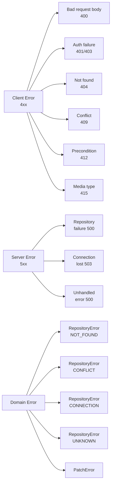
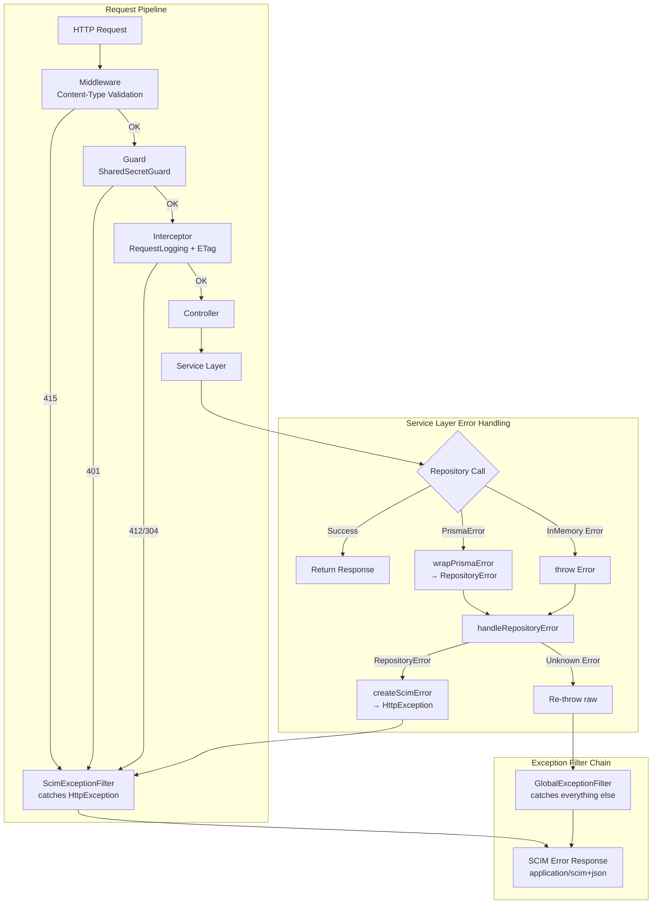
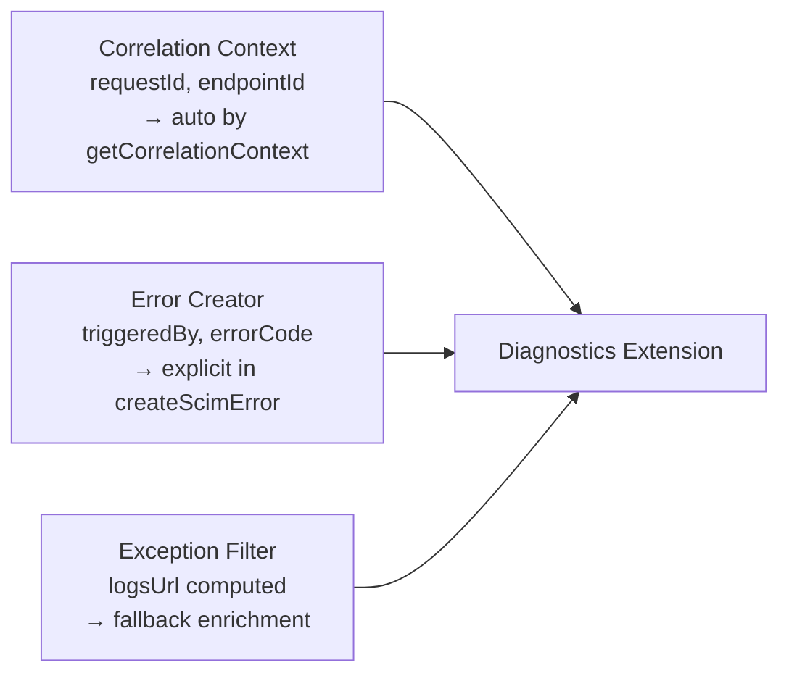
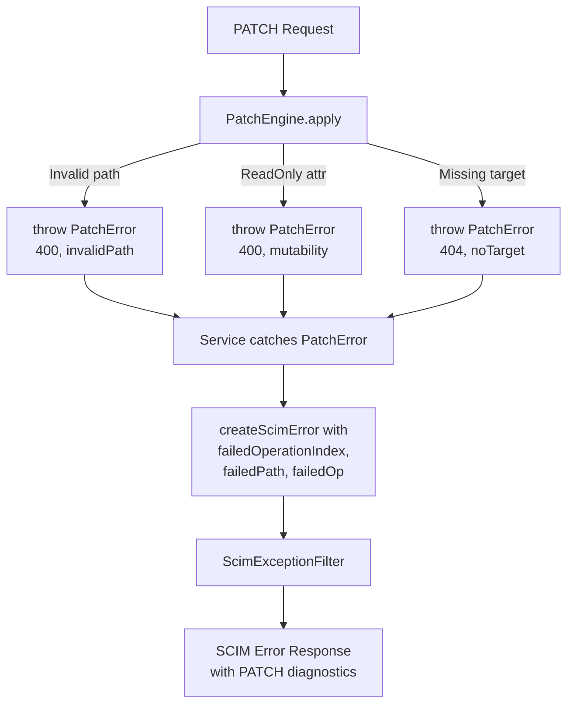
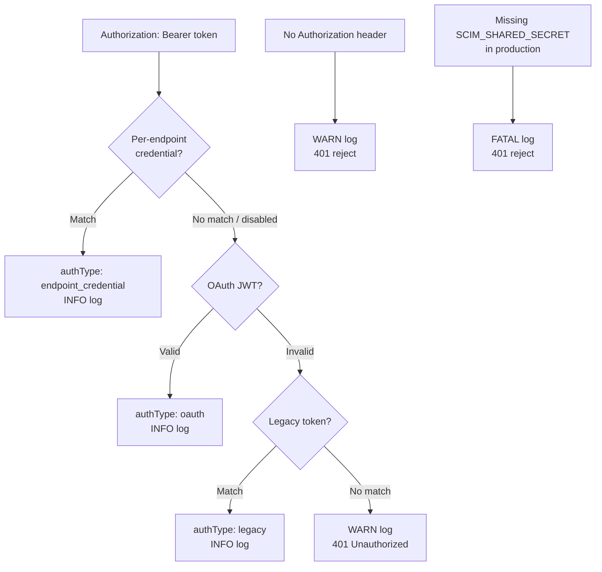
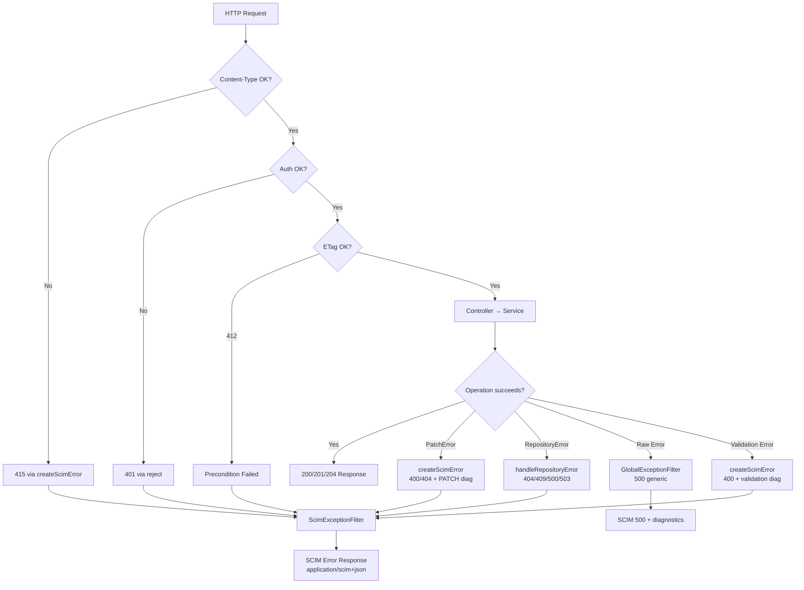
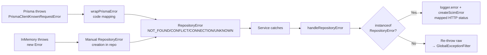
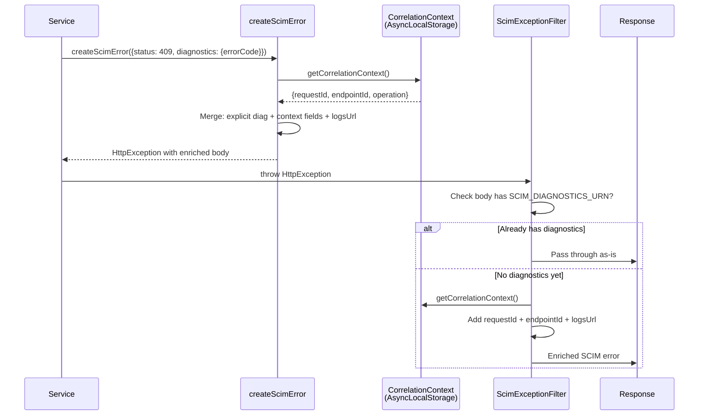

# Error Handling Architecture & Ideal Design

> **Version:** 3.0 · **Source-verified against:** v0.38.0 · **Rewritten from scratch:** April 13, 2026  
> Describes the *as-built* error handling architecture plus design principles - every claim verified against source.

---

## Table of Contents

1. [Design Principles](#1-design-principles)
2. [Error Classification Taxonomy](#2-error-classification-taxonomy)
3. [Error Flow Architecture](#3-error-flow-architecture)
4. [Exception Filter Chain](#4-exception-filter-chain)
5. [SCIM Error Format (RFC 7644 §3.12)](#5-scim-error-format-rfc-7644-312)
6. [Diagnostics Extension (Self-Service RCA)](#6-diagnostics-extension-self-service-rca)
7. [Error Factory: createScimError()](#7-error-factory-createscimerror)
8. [Domain Errors: RepositoryError](#8-domain-errors-repositoryerror)
9. [Prisma Error Translation](#9-prisma-error-translation)
10. [PATCH Error Handling](#10-patch-error-handling)
11. [Service Layer Bridge: handleRepositoryError()](#11-service-layer-bridge-handlerepositoryerror)
12. [Content-Type Validation (415)](#12-content-type-validation-415)
13. [Authentication Error Handling](#13-authentication-error-handling)
14. [ETag & Precondition Errors (412/304)](#14-etag--precondition-errors-412304)
15. [Log Level Assignment by Status Code](#15-log-level-assignment-by-status-code)
16. [SCIM Error Type Vocabulary](#16-scim-error-type-vocabulary)
17. [Error Response Examples](#17-error-response-examples)
18. [Troubleshooting: Error Catalog by Status Code](#18-troubleshooting-error-catalog-by-status-code)
19. [Mermaid Diagrams](#19-mermaid-diagrams)
20. [Error Handling Checklist](#20-error-handling-checklist)
21. [Source File Reference](#21-source-file-reference)

---

## 1. Design Principles

The error handling architecture follows 9 core principles, all implemented in the current codebase:

| # | Principle | Implementation |
|---|-----------|----------------|
| 1 | **RFC 7644 §3.12 compliance** | `status` as string, `schemas` array with Error URN, `scimType` vocabulary |
| 2 | **Content-Type: application/scim+json** | Both exception filters set this header on all SCIM error responses |
| 3 | **Self-service RCA via diagnostics** | Every SCIM error includes `requestId`, `endpointId`, `logsUrl` in diagnostics extension |
| 4 | **Correlation context auto-enrichment** | `createScimError()` reads `getCorrelationContext()` - no DI injection needed |
| 5 | **Layered error boundaries** | Domain (RepositoryError) → Service (handleRepositoryError) → Filter (ScimExceptionFilter/GlobalExceptionFilter) |
| 6 | **Tiered log levels** | 5xx=ERROR, 401/403=WARN, 404=DEBUG, other 4xx=INFO |
| 7 | **No sensitive data leakage** | Internal error details never exposed to client; logger sanitizes secrets |
| 8 | **Cause chain preservation** | RepositoryError preserves original Prisma/Error stack via `cause` field |
| 9 | **Non-SCIM route isolation** | Exception filters detect non-`/scim` routes and return NestJS-style JSON (not SCIM format) |

---

## 2. Error Classification Taxonomy

### By Origin Layer



### Error → HTTP Status Mapping

| Error Source | Error Type | HTTP Status | SCIM scimType |
|-------------|-----------|-------------|---------------|
| Repository | `NOT_FOUND` | 404 | `noTarget` |
| Repository | `CONFLICT` | 409 | `uniqueness` |
| Repository | `CONNECTION` | 503 | _(none)_ |
| Repository | `UNKNOWN` | 500 | _(none)_ |
| PATCH engine | `PatchError(400)` | 400 | `invalidPath` / `invalidValue` / `mutability` |
| PATCH engine | `PatchError(404)` | 404 | `noTarget` |
| Schema validation | Strict mode | 400 | `invalidSyntax` / `invalidValue` |
| Auth guard | Missing/invalid token | 401 | _(none)_ |
| Content-Type | Wrong media type | 415 | _(none)_ |
| ETag interceptor | If-Match mismatch | 412 | `versionMismatch` |
| Uniqueness check | Duplicate attribute | 409 | `uniqueness` |
| Global catch-all | Raw Error/TypeError | 500 | _(none, generic message)_ |

---

## 3. Error Flow Architecture



---

## 4. Exception Filter Chain

**Source:** `scim.module.ts` lines 73–82

NestJS applies `APP_FILTER` providers in **reverse registration order** (last registered runs first). The registration order ensures correct catch precedence:

```typescript
// scim.module.ts - registration order
{ provide: APP_FILTER, useClass: GlobalExceptionFilter },   // registered first → runs LAST
{ provide: APP_FILTER, useClass: ScimExceptionFilter },      // registered second → runs FIRST
```

### Filter Responsibilities

| Filter | Catches | Source | Behavior |
|--------|---------|--------|----------|
| **ScimExceptionFilter** | `HttpException` | `scim-exception.filter.ts` | Formats as SCIM error, sets `application/scim+json`, tiered logging |
| **GlobalExceptionFilter** | Everything else | `global-exception.filter.ts` | Logs at ERROR, returns generic SCIM 500, auto-enriches diagnostics |

### Non-SCIM Route Handling

Both filters check `url.startsWith('/scim')`. For non-SCIM routes (web UI, health checks):
- **ScimExceptionFilter:** Returns NestJS-style JSON `{ statusCode, message }`
- **GlobalExceptionFilter:** Returns `{ statusCode: 500, message: error.message }`

---

## 5. SCIM Error Format (RFC 7644 §3.12)

Every SCIM error response conforms to:

```json
{
  "schemas": ["urn:ietf:params:scim:api:messages:2.0:Error"],
  "detail": "User not found",
  "status": "404",
  "scimType": "noTarget",
  "urn:scimserver:api:messages:2.0:Diagnostics": {
    "requestId": "a1b2c3d4-...",
    "endpointId": "ep-contoso",
    "logsUrl": "/scim/endpoints/ep-contoso/logs/recent?requestId=a1b2c3d4-..."
  }
}
```

### RFC Compliance Points

| Requirement | Status | Implementation |
|------------|--------|----------------|
| `schemas` array with Error URN | Yes | Both filters include `[SCIM_ERROR_SCHEMA]` |
| `status` as **string** (not number) | Yes | `body.status = String(status)` - enforced in both filters |
| `Content-Type: application/scim+json` | Yes | `response.setHeader('Content-Type', 'application/scim+json; charset=utf-8')` |
| `scimType` vocabulary from Table 9 | Yes | `SCIM_ERROR_TYPE` enum in `scim-constants.ts` |
| `detail` human-readable message | Yes | Always present |

---

## 6. Diagnostics Extension (Self-Service RCA)

**Source:** `scim-errors.ts` lines 10–55 (`ScimErrorDiagnostics` interface)

The server adds a custom extension `urn:scimserver:api:messages:2.0:Diagnostics` to every SCIM error response. This enables operators to self-diagnose without server access.

### Diagnostics Fields

| Field | Type | Source | Description |
|-------|------|--------|-------------|
| `requestId` | string | Correlation context | UUID linking to all logs for this request |
| `endpointId` | string | Correlation context | SCIM endpoint that handled the request |
| `logsUrl` | string | Computed | Direct URL to view logs for this request |
| `triggeredBy` | string | Error creator | Config flag that activated validation (e.g., `StrictSchemaValidation`) |
| `errorCode` | string | Error creator | Machine-readable code (e.g., `DATABASE_ERROR`, `CONTENT_TYPE_UNSUPPORTED`) |
| `operation` | string | Context/explicit | SCIM operation: create, replace, patch, delete |
| `attributePath` | string | Validation | Attribute path causing the error (e.g., `name.givenName`) |
| `schemaUrn` | string | Validation | Schema URN where failing attribute is defined |
| `conflictingResourceId` | string | Uniqueness check | scimId of existing conflicting resource |
| `conflictingAttribute` | string | Uniqueness check | Which attribute collided (e.g., `userName`) |
| `incomingValue` | string | Uniqueness check | The value that caused the conflict |
| `failedOperationIndex` | number | PATCH | Zero-based index of failing bulk/PATCH op |
| `failedPath` | string | PATCH | Path from the failing PATCH operation |
| `failedOp` | string | PATCH | Op type: add/replace/remove |
| `currentETag` | string | ETag interceptor | Server-side ETag for 412 responses |
| `parseError` | string | Filter parser | Original parse error detail |

### Auto-Enrichment Chain

Diagnostics are populated from three sources (additive):



**Three enrichment points:**
1. `createScimError()` - reads correlation context + explicit diagnostics
2. `ScimExceptionFilter` - adds diagnostics if not already present (G.4 fallback)
3. `GlobalExceptionFilter` - adds diagnostics from correlation context for raw errors

---

## 7. Error Factory: createScimError()

**Source:** `scim-errors.ts` lines 73–134

The central factory for creating SCIM-compliant `HttpException` instances:

```typescript
throw createScimError({
  status: 409,
  detail: 'userName "jsmith" already exists',
  scimType: 'uniqueness',
  diagnostics: {
    errorCode: 'UNIQUENESS_VIOLATION',
    conflictingAttribute: 'userName',
    conflictingResourceId: 'existing-user-id',
    incomingValue: 'jsmith',
  },
});
```

### Key Behaviors

1. **Auto-enriches from correlation context** - reads `getCorrelationContext()` to add `requestId`, `endpointId`, `logsUrl` without DI
2. **logsUrl computation** - routes to endpoint-scoped logs when `endpointId` is available, admin logs otherwise:
   - With endpoint: `/scim/endpoints/{endpointId}/logs/recent?requestId={requestId}`
   - Without: `/scim/admin/log-config/recent?requestId={requestId}`
3. **Only adds extension if meaningful** - skips `SCIM_DIAGNOSTICS_URN` if no fields are populated
4. **Preserves scimType** - passes through to response body for client-side error handling

---

## 8. Domain Errors: RepositoryError

**Source:** `repository-error.ts` (51 lines)

A typed domain error that abstracts backend-specific errors (Prisma, InMemory) into a consistent interface:

```typescript
export class RepositoryError extends Error {
  readonly isRepositoryError = true;

  constructor(
    public readonly code: RepositoryErrorCode,  // NOT_FOUND | CONFLICT | CONNECTION | UNKNOWN
    message: string,
    public readonly cause?: Error,              // Original error for stack chain
  ) {
    super(message);
    this.name = 'RepositoryError';
    // Stack chain: this.stack + "\n  Caused by: " + cause.stack
  }
}
```

### Error Code → HTTP Status Mapping

```typescript
function repositoryErrorToHttpStatus(code: RepositoryErrorCode): number {
  switch (code) {
    case 'NOT_FOUND':  return 404;
    case 'CONFLICT':   return 409;
    case 'CONNECTION': return 503;
    case 'UNKNOWN':    return 500;
  }
}
```

---

## 9. Prisma Error Translation

**Source:** `prisma-error.util.ts` (43 lines)

The `wrapPrismaError()` function translates Prisma-specific error codes:

| Prisma Code | RepositoryError Code | Meaning |
|------------|---------------------|---------|
| `P2025` | `NOT_FOUND` | Record not found (update/delete on nonexistent) |
| `P2002` | `CONFLICT` | Unique constraint violation |
| `P1001` | `CONNECTION` | Can't reach database server |
| `P1002` | `CONNECTION` | Database server reached but timed out |
| `P1008` | `CONNECTION` | Operations timed out |
| `P1017` | `CONNECTION` | Server closed the connection |
| Message contains `connect` / `timed out` / `ECONNREFUSED` | `CONNECTION` | Pattern-match fallback |
| _(anything else)_ | `UNKNOWN` | Catch-all |

**Usage in repositories:**

```typescript
try {
  await this.prisma.scimResource.create({ data });
} catch (error) {
  throw wrapPrismaError(error, `User create(${userName})`);
}
```

---

## 10. PATCH Error Handling

**Source:** `patch-error.ts` (32 lines)

The `PatchError` class captures PATCH-specific context:

```typescript
class PatchError extends Error {
  status: number;              // HTTP status code
  scimType?: string;           // SCIM error type (invalidPath, mutability, etc.)
  operationIndex?: number;     // Zero-based index of failing operation
  failedPath?: string;         // SCIM attribute path
  failedOp?: string;           // add | replace | remove
}
```

### PATCH Error Flow



### Example PATCH Error Response

```json
{
  "schemas": ["urn:ietf:params:scim:api:messages:2.0:Error"],
  "detail": "Attribute 'name.familyName' is readOnly and cannot be modified",
  "status": "400",
  "scimType": "mutability",
  "urn:scimserver:api:messages:2.0:Diagnostics": {
    "requestId": "a1b2c3d4-...",
    "endpointId": "ep-contoso",
    "failedOperationIndex": 2,
    "failedPath": "name.familyName",
    "failedOp": "replace",
    "logsUrl": "/scim/endpoints/ep-contoso/logs/recent?requestId=a1b2c3d4-..."
  }
}
```

---

## 11. Service Layer Bridge: handleRepositoryError()

**Source:** `scim-service-helpers.ts` lines 47–70

Central bridge between domain errors and SCIM HTTP responses:

```typescript
function handleRepositoryError(
  error: unknown,
  operation: string,        // e.g., "create user"
  logger: ScimLogger,
  logCategory: LogCategory, // SCIM_USER, SCIM_GROUP, etc.
  context: Record<string, unknown> = {},
): never {
  if (error instanceof RepositoryError) {
    logger.error(logCategory, `Repository failure: ${operation}`, error.cause ?? error, {
      operation,
      errorCode: error.code,
      ...context,
    });
    throw createScimError({
      status: repositoryErrorToHttpStatus(error.code),
      detail: `Failed to ${operation}: ${error.message}`,
      diagnostics: { errorCode: 'DATABASE_ERROR', triggeredBy: 'database' },
    });
  }
  // Non-RepositoryError - re-throw for GlobalExceptionFilter
  throw error;
}
```

### Behavior

1. **RepositoryError** → log at ERROR + throw SCIM HttpException with appropriate status
2. **Unknown error** → re-throw as-is → caught by `GlobalExceptionFilter` → generic 500

Used by all three SCIM services: `EndpointScimUsersService`, `EndpointScimGroupsService`, `EndpointScimGenericService`.

---

## 12. Content-Type Validation (415)

**Source:** `scim-content-type-validation.middleware.ts` (52 lines)

Applied as NestJS middleware (not guard/interceptor) for earliest-possible rejection:

| Validation | Rule |
|-----------|------|
| **Methods checked** | POST, PUT, PATCH only (body-carrying methods) |
| **Accepted types** | `application/json`, `application/scim+json` (with charset tolerance) |
| **Empty body bypass** | Allows missing Content-Type if body is empty |
| **Error response** | `createScimError({ status: 415, ... })` → SCIM format |

**Scope:** Applied to SCIM endpoint routes only. Excluded: OAuth token endpoint, admin endpoints, GET/DELETE/HEAD/OPTIONS.

---

## 13. Authentication Error Handling

**Source:** `shared-secret.guard.ts` (200+ lines)

The `SharedSecretGuard` implements a 3-tier authentication chain:



### Auth Error Behaviors

| Scenario | Log Level | Response |
|----------|-----------|----------|
| Missing Authorization header | WARN | 401 `Invalid bearer token` |
| All auth methods fail | WARN | 401 `Invalid bearer token` |
| Missing secret in production | FATAL | 401 `SCIM shared secret not configured` |
| Missing secret in dev | WARN | Auto-generates ephemeral secret |
| Public route (`@IsPublic()`) | TRACE | Skips auth entirely |

---

## 14. ETag & Precondition Errors (412/304)

**Source:** `scim-etag.interceptor.ts` (74 lines)

| Scenario | Response | SCIM scimType |
|----------|----------|---------------|
| `If-Match` header doesn't match resource ETag | 412 Precondition Failed | `versionMismatch` |
| `If-None-Match` header matches resource ETag | 304 Not Modified | _(empty body)_ |

---

## 15. Log Level Assignment by Status Code

Both the `RequestLoggingInterceptor` and `ScimExceptionFilter` use identical tiered logic:

```typescript
// Tiered log level (P9 convention):
if (status >= 500)             → ERROR  // Server fault
else if (status === 401 || 403) → WARN   // Security event  
else if (status === 404)        → DEBUG  // Routine probe
else if (status >= 400)         → INFO   // Client error
else                           → ERROR  // Unknown (safety net)
```

This avoids log noise from expected 404 probes (Entra ID regularly probes for users that don't exist) while ensuring genuine server errors are prominently logged.

---

## 16. SCIM Error Type Vocabulary

**Source:** `scim-constants.ts` lines 48–67

The `SCIM_ERROR_TYPE` object enumerates all RFC 7644 Table 9 error keywords:

| scimType | HTTP Status | Description |
|----------|-------------|-------------|
| `uniqueness` | 409 | Duplicate value (userName, externalId, displayName) |
| `invalidFilter` | 400 | Invalid filter syntax |
| `invalidSyntax` | 400 | Invalid request body |
| `invalidPath` | 400 | Invalid SCIM attribute path |
| `noTarget` | 404 | Resource not found |
| `invalidValue` | 400 | Invalid attribute value |
| `mutability` | 400 | Attempt to modify readOnly/immutable attribute |
| `versionMismatch` | 412 | ETag precondition failure |
| `tooMany` | 400 | Too many results, use filter |

---

## 17. Error Response Examples

### 409 Uniqueness Conflict

```json
{
  "schemas": ["urn:ietf:params:scim:api:messages:2.0:Error"],
  "detail": "userName \"jsmith\" already exists on this endpoint",
  "status": "409",
  "scimType": "uniqueness",
  "urn:scimserver:api:messages:2.0:Diagnostics": {
    "requestId": "f47ac10b-58cc-4372-a567-0e02b2c3d479",
    "endpointId": "ep-contoso-prod",
    "errorCode": "UNIQUENESS_VIOLATION",
    "conflictingAttribute": "userName",
    "conflictingResourceId": "usr-existing-123",
    "incomingValue": "jsmith",
    "logsUrl": "/scim/endpoints/ep-contoso-prod/logs/recent?requestId=f47ac10b-..."
  }
}
```

### 400 PATCH Mutability Error

```json
{
  "schemas": ["urn:ietf:params:scim:api:messages:2.0:Error"],
  "detail": "Attribute 'id' is readOnly and cannot be modified via PATCH",
  "status": "400",
  "scimType": "mutability",
  "urn:scimserver:api:messages:2.0:Diagnostics": {
    "requestId": "...",
    "endpointId": "...",
    "failedOperationIndex": 0,
    "failedPath": "id",
    "failedOp": "replace",
    "triggeredBy": "PatchReadOnlyPrevalidation",
    "logsUrl": "..."
  }
}
```

### 500 Unhandled Server Error

```json
{
  "schemas": ["urn:ietf:params:scim:api:messages:2.0:Error"],
  "detail": "Internal server error",
  "status": "500",
  "urn:scimserver:api:messages:2.0:Diagnostics": {
    "requestId": "...",
    "endpointId": "...",
    "logsUrl": "/scim/endpoints/.../logs/recent?requestId=..."
  }
}
```

Note: Internal error details (`TypeError`, stack traces) are NEVER exposed to the client - only logged server-side.

### 415 Unsupported Media Type

```json
{
  "schemas": ["urn:ietf:params:scim:api:messages:2.0:Error"],
  "detail": "Content-Type must be application/json or application/scim+json",
  "status": "415",
  "urn:scimserver:api:messages:2.0:Diagnostics": {
    "errorCode": "CONTENT_TYPE_UNSUPPORTED",
    "requestId": "..."
  }
}
```

### 401 Authentication Failure

```json
{
  "schemas": ["urn:ietf:params:scim:api:messages:2.0:Error"],
  "detail": "Invalid bearer token.",
  "status": "401"
}
```

---

## 18. Troubleshooting: Error Catalog by Status Code

Complete reference of every HTTP error status the server can return, with exact `scimType`, `diagnostics.errorCode`, and triggering condition. Source-verified against v0.35.0.

### 400 Bad Request

| scimType | errorCode | detail (pattern) | Trigger |
|----------|-----------|-------------------|--------|
| `invalidSyntax` | `VALIDATION_REQUIRED` | Missing required schema '...' | `schemas[]` missing required URN |
| `invalidSyntax` | `VALIDATION_SCHEMA` | Extension URN found but not declared in schemas[] | Undeclared extension URN key in body (strict mode) |
| `invalidValue` | `VALIDATION_SCHEMA` | Extension URN is not a registered extension schema | Unknown extension URN in body (strict mode) |
| _(dynamic)_ | `VALIDATION_SCHEMA` | Schema validation failed: ... | Required attribute missing, type mismatch, unknown attribute (strict) |
| `invalidFilter` | `FILTER_INVALID` | Unsupported or invalid filter expression | Filter syntax error or unknown attribute |
| `invalidFilter` | `VALIDATION_FILTER` | Filter validation failed: ... | Filter path references unknown schema attribute |
| `mutability` | `VALIDATION_IMMUTABLE` | Immutable attribute violation: ... | PUT/PATCH attempts to change immutable attribute |
| _(from PatchError)_ | `VALIDATION_PATCH` | _(dynamic)_ | PatchEngine rejects operation (invalidPath, invalidValue, noTarget, mutability) |
| `invalidValue` | `HARD_DELETE_DISABLED` | User hard delete is not enabled | DELETE when `UserHardDeleteEnabled=false` |
| `invalidValue` | `SOFT_DELETE_DISABLED` | User soft-delete is not enabled | PATCH `active=false` when `UserSoftDeleteEnabled=false` |
| - | `DELETE_DISABLED` | Group/resource deletion is disabled | DELETE when `GroupHardDeleteEnabled=false` |
| `invalidValue` | `BULK_INVALID_OPERATION` | POST operation requires data / missing schema | Invalid bulk operation structure |
| `invalidPath` | `BULK_INVALID_OPERATION` | Unsupported resource type in bulk path | Bulk path is not `/Users` or `/Groups` |
| `invalidValue` | `BULK_UNRESOLVED_BULKID` | Unresolved bulkId reference | bulkId not defined by a prior POST |

### 401 Unauthorized

| detail | Trigger | Response Headers |
|--------|---------|------------------|
| Missing bearer token. | No `Authorization: Bearer` header | `WWW-Authenticate: Bearer realm="SCIM"` |
| Invalid bearer token. | All auth methods failed | `WWW-Authenticate: Bearer realm="SCIM"` |
| SCIM shared secret not configured. | Production with no `SCIM_SHARED_SECRET` | `WWW-Authenticate: Bearer realm="SCIM"` |
| Invalid client credentials | Wrong OAuth `client_id`/`client_secret` | _(OAuth error format)_ |
| Invalid or expired token | JWT verification failure | _(standard 401)_ |

### 403 Forbidden

| detail | Trigger |
|--------|---------|
| Endpoint "..." is inactive. SCIM operations are not allowed. | `isActive=false` on endpoint (all controllers) |
| Bulk operations are not enabled for this endpoint. | `bulk.supported=false` in SPC |
| Per-endpoint credentials are not enabled for endpoint "...". | `PerEndpointCredentialsEnabled=false` |

### 404 Not Found

| scimType | errorCode | detail (pattern) | Trigger |
|----------|-----------|-------------------|--------|
| `noTarget` | `RESOURCE_NOT_FOUND` | Resource {id} not found. | GET/PATCH/PUT/DELETE by ID - not found |
| - | - | Schema "{urn}" not found. | Discovery: unknown schema URN |
| - | - | ResourceType "{id}" not found. | Discovery: unknown resource type |
| - | - | Resource not found. | `SchemaDiscoveryEnabled=false` |
| `noTarget` | - | No User resource found matching "..." | `/Me` - JWT `sub` doesn't match any user |
| - | - | No custom resource type registered at "/..." | Custom RT path not configured |
| - | - | Endpoint "{id}" not found | Admin endpoint CRUD |
| - | - | Unknown preset "...". Valid presets: ... | Invalid preset name |

### 409 Conflict

| scimType | errorCode | detail (pattern) | diagnostics fields |
|----------|-----------|-------------------|--------------------|
| `uniqueness` | `UNIQUENESS_USERNAME` | A resource with userName '...' already exists. | `conflictingResourceId`, `conflictingAttribute`, `incomingValue`, `operation` |
| `uniqueness` | `UNIQUENESS_DISPLAY_NAME` | A group with displayName '...' already exists. | Same as above |
| `uniqueness` | `UNIQUENESS_SCHEMA_ATTR` | Attribute '...' value '...' must be unique. | Schema-driven uniqueness check |

### 412 Precondition Failed

| scimType | errorCode | detail | diagnostics fields |
|----------|-----------|--------|--------------------|
| `versionMismatch` | `PRECONDITION_VERSION_MISMATCH` | ETag mismatch. Expected: ..., current: ... | `currentETag` |

### 413 Payload Too Large

| scimType | errorCode | detail | Trigger |
|----------|-----------|--------|---------|
| `tooLarge` | `BULK_PAYLOAD_TOO_LARGE` | Bulk request payload (...) exceeds maximum allowed size | `Content-Length` > 1 MB |

### 415 Unsupported Media Type

| scimType | errorCode | detail | Trigger |
|----------|-----------|--------|---------|
| `invalidValue` | `CONTENT_TYPE_UNSUPPORTED` | Unsupported Media Type: "...". SCIM requests MUST use... | POST/PUT/PATCH with non-JSON Content-Type |

### 428 Precondition Required

| errorCode | detail | diagnostics fields |
|-----------|--------|--------------------|
| `PRECONDITION_IF_MATCH` | If-Match header is required for this operation. Current ETag: ... | `currentETag` |

### 500 Internal Server Error

| errorCode | detail | Trigger |
|-----------|--------|---------|
| `DATABASE_ERROR` | Failed to {operation}: ... | RepositoryError with code `UNKNOWN` |
| - | Internal server error | Unhandled Error/TypeError (GlobalExceptionFilter) |
| `DATABASE_ERROR` | Failed to retrieve updated group. | Post-write re-fetch returns null |

### 503 Service Unavailable

| errorCode | detail | Trigger |
|-----------|--------|---------|
| `DATABASE_ERROR` | Failed to {operation}: database connection error | RepositoryError `CONNECTION` (Prisma P1001/P1002/P1008) |

---

## 19. Mermaid Diagrams

### Complete Error Processing Pipeline



### RepositoryError Lifecycle



### Diagnostics Auto-Enrichment



---

## 20. Error Handling Checklist

### Completeness Verification

| Checkpoint | Status | Evidence |
|-----------|--------|---------|
| All SCIM routes return `application/scim+json` on error | Yes | Both filter `setHeader('Content-Type', 'application/scim+json; charset=utf-8')` |
| `status` field is always a string | Yes | `body.status = String(status)` in both filters |
| `schemas` always includes Error URN | Yes | `[SCIM_ERROR_SCHEMA]` in factory + both filters |
| All repository errors go through `handleRepositoryError` | Yes | All 3 SCIM services use it |
| Prisma errors are translated via `wrapPrismaError` | Yes | All Prisma repos use it consistently |
| Raw errors caught by GlobalExceptionFilter | Yes | `@Catch()` with no type constraint |
| Diagnostics auto-enriched from correlation context | Yes | 3 enrichment points: factory + 2 filters |
| Sensitive data never in error responses | Yes | Generic "Internal server error" for 500; details logged only |
| Non-SCIM routes get NestJS-style errors | Yes | `url.startsWith('/scim')` check in both filters |
| 404 not logged at ERROR | Yes | 404 → DEBUG level in both interceptor and filter |
| Auth failures logged at WARN (not ERROR) | Yes | 401/403 → WARN in both interceptor and filter |

---

## 21. Source File Reference

| File | Lines | Purpose |
|------|-------|---------|
| `scim-exception.filter.ts` | 128 | HttpException → SCIM format, tiered logging, diagnostics fallback |
| `global-exception.filter.ts` | 104 | Catch-all → SCIM 500, diagnostics from context |
| `scim-errors.ts` | 134 | `createScimError()` factory, `ScimErrorDiagnostics` interface |
| `scim-constants.ts` | 67 | URNs: `SCIM_ERROR_SCHEMA`, `SCIM_DIAGNOSTICS_URN`, `SCIM_ERROR_TYPE` |
| `repository-error.ts` | 51 | Domain error class: code + cause chain |
| `prisma-error.util.ts` | 43 | Prisma → RepositoryError translation |
| `patch-error.ts` | 32 | PATCH-specific error context |
| `scim-service-helpers.ts` | 1,348 | `handleRepositoryError()` bridge |
| `scim-content-type-validation.middleware.ts` | 52 | Content-Type → 415 |
| `shared-secret.guard.ts` | 200+ | 3-tier auth → 401 |
| `scim-etag.interceptor.ts` | 74 | ETag → 412/304 |
| `request-logging.interceptor.ts` | 146 | Tiered error logging |
| `scim.module.ts` | 92 | Filter + interceptor registration |

### Test Coverage

| File | Lines | Type |
|------|-------|------|
| `global-exception.filter.spec.ts` | 242 | Unit |
| `scim-exception.filter.spec.ts` | 191 | Unit |
| `scim-errors.spec.ts` | 208 | Unit |
| `repository-error.spec.ts` | 51 | Unit |
| `prisma-error.util.spec.ts` | 46 | Unit |
| `patch-error.spec.ts` | 47 | Unit |
| `scim-service-helpers.spec.ts` | 1,215 | Unit |
| `error-handling.e2e-spec.ts` | 345 | E2E |
| `http-error-codes.e2e-spec.ts` | 165 | E2E |
| `rca-diagnostics.e2e-spec.ts` | 171 | E2E |

---

> **Architecture summary:** 5-layer error boundary (middleware → guard → interceptor → service → filter) with 3-point diagnostics enrichment, domain error abstraction, and RFC 7644-compliant output. Zero internal detail leakage. 13 source files, ~2,275 dedicated lines + ~2,681 test lines.
