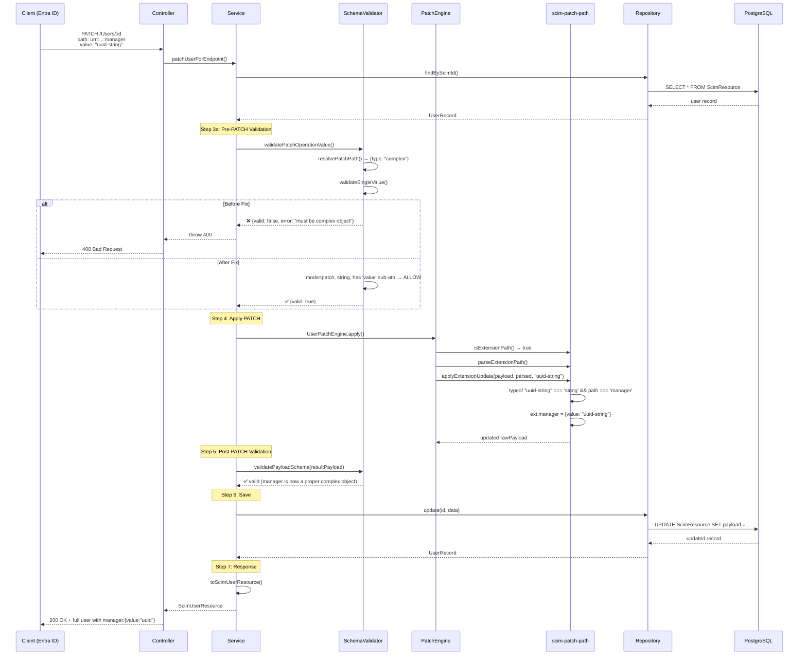
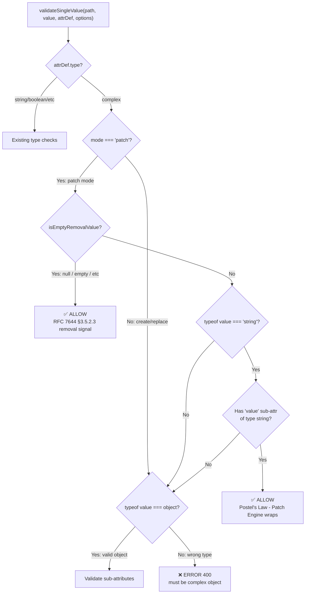
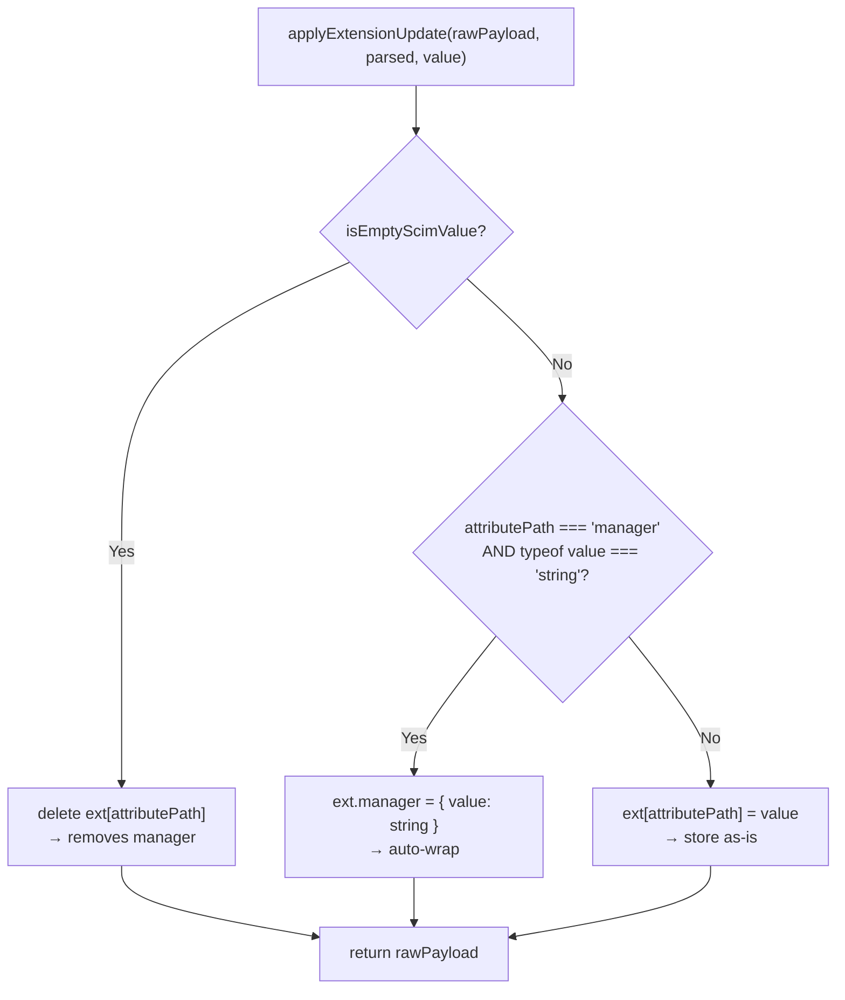

# Manager PATCH String Coercion - Complex Attribute Relaxation for SCIM Compliance

## Overview

**Feature**: Accept raw string values for complex PATCH attributes (manager) in strict schema validation  
**Version**: v0.38.0 (pending)  
**Status**: 🔧 Analysis Complete - Implementation Pending  
**RFC References**:
- [RFC 7643 §2.3.8 - Complex Attributes](https://datatracker.ietf.org/doc/html/rfc7643#section-2.3.8)
- [RFC 7643 §4.3 - Enterprise User Extension](https://datatracker.ietf.org/doc/html/rfc7643#section-4.3)
- [RFC 7644 §3.5.2 - Modifying with PATCH](https://datatracker.ietf.org/doc/html/rfc7644#section-3.5.2)
- [RFC 7644 §3.5.2.3 - Replace Operation (empty-value removal)](https://datatracker.ietf.org/doc/html/rfc7644#section-3.5.2.3)
- [Postel's Law (Robustness Principle)](https://en.wikipedia.org/wiki/Robustness_principle)

### Problem Statement

The SCIM server's **pre-PATCH strict schema validator** (`SchemaValidator.validatePatchOperationValue()`) rejects raw string values for the `manager` attribute, which is defined as `type: "complex"` in the Enterprise User schema. This causes **three Microsoft Entra ID SCIM Validator compliance failures**:

1. **"Patch User - Add Manager"** → sends `value: "uuid-string"` → server returns `400 Bad Request`
2. **"Patch User - Replace Manager"** → sends `value: "uuid-string"` → server returns `400 Bad Request`
3. **"Patch User - Remove Manager"** → sends `value: ""` (empty string removal) → server returns `400 Bad Request`

All three fail with the same error:

```json
{
  "detail": "PATCH operation value validation failed: Attribute 'manager' must be a complex object, got string.",
  "scimType": "invalidValue",
  "status": "400",
  "urn:scimserver:api:messages:2.0:Diagnostics": {
    "triggeredBy": "StrictSchemaValidation",
    "errorCode": "VALIDATION_SCHEMA"
  }
}
```

The Patch Engine (`applyExtensionUpdate()`) already has correct string-wrapping logic that would handle these inputs, but the **pre-validation gate blocks the request before the engine executes**.

### Solution

Teach the pre-PATCH schema validator to apply the **Robustness Principle** for complex attributes in PATCH mode:

1. **Accept raw strings** for complex attributes that have a `value` sub-attribute of type `string` (e.g., `manager`)
2. **Accept empty/null values** as RFC 7644 §3.5.2.3 removal signals, bypassing type validation entirely

## Architecture

### Current Flow (Broken)

```
Client sends: PATCH path=urn:...:User:manager  value="uuid-string"
                                    │
                                    ▼
┌─────────────────────────────────────────────────────────────────┐
│  STEP 3a: Pre-PATCH Schema Validation (strict mode)            │
│  SchemaValidator.validatePatchOperationValue()                  │
│    → resolvePatchPath("urn:...:User:manager")                  │
│    → finds attrDef: { name: "manager", type: "complex" }      │
│    → validateAttribute() → validateSingleValue()               │
│                                                                 │
│  case 'complex':                                                │
│    typeof "uuid-string" !== 'object'  →  ❌ ERROR 400          │
│    "Attribute 'manager' must be a complex object, got string." │
│                                                                 │
│  ❌ REQUEST BLOCKED - never reaches Patch Engine               │
└─────────────────────────────────────────────────────────────────┘
```

### Fixed Flow (Target)

```
Client sends: PATCH path=urn:...:User:manager  value="uuid-string"
                                    │
                                    ▼
┌─────────────────────────────────────────────────────────────────┐
│  STEP 3a: Pre-PATCH Schema Validation (strict mode)            │
│  SchemaValidator.validatePatchOperationValue()                  │
│    → resolvePatchPath("urn:...:User:manager")                  │
│    → finds attrDef: { name: "manager", type: "complex" }      │
│    → validateSingleValue()                                     │
│                                                                 │
│  case 'complex':                                                │
│    1. Is mode=patch AND isEmptyRemovalValue("uuid")? NO        │
│    2. Is mode=patch AND typeof value === 'string'              │
│       AND attrDef has sub-attr 'value' of type 'string'?       │
│       → YES → ✅ ALLOW (Patch Engine will wrap)                │
│                                                                 │
│  ✅ REQUEST PASSES TO STEP 4                                   │
└───────────────────────┬─────────────────────────────────────────┘
                        │
                        ▼
┌─────────────────────────────────────────────────────────────────┐
│  STEP 4: UserPatchEngine.apply()                               │
│    → isExtensionPath("urn:...:User:manager") = true            │
│    → applyExtensionUpdate(rawPayload, parsed, "uuid-string")   │
│    → attributePath === 'manager' && typeof value === 'string'  │
│    → ext.manager = { value: "uuid-string" }  ← string wrapped │
│                                                                 │
│  ✅ Manager stored correctly as complex object                  │
└─────────────────────────────────────────────────────────────────┘
```

### Empty-Value Removal Flow

```
Client sends: PATCH path=urn:...:User:manager  value=""
                                    │
                                    ▼
┌─────────────────────────────────────────────────────────────────┐
│  STEP 3a: Pre-PATCH Schema Validation                          │
│    case 'complex':                                              │
│      1. Is mode=patch AND isEmptyRemovalValue("")? YES         │
│         → ✅ ALLOW (RFC 7644 §3.5.2.3 removal signal)         │
└───────────────────────┬─────────────────────────────────────────┘
                        │
                        ▼
┌─────────────────────────────────────────────────────────────────┐
│  STEP 4: UserPatchEngine.apply()                               │
│    → applyExtensionUpdate(rawPayload, parsed, "")              │
│    → isEmptyScimValue("") = true                               │
│    → delete ext.manager                                        │
│                                                                 │
│  ✅ Manager attribute removed from resource                    │
└─────────────────────────────────────────────────────────────────┘
```

## RFC Analysis

### RFC 7643 §2.3.8 - Complex Attributes

> Complex attributes ... contain a set of sub-attributes. Each sub-attribute is described using the same schema definition format.

A complex attribute's **canonical representation** is always a JSON object: `{"value": "...", "displayName": "..."}`.

### RFC 7643 §4.3 - Enterprise User: `manager`

The `manager` attribute is defined as:

| Property | Value |
|----------|-------|
| `type` | `complex` |
| `multiValued` | `false` |
| `mutability` | `readWrite` |
| `returned` | `default` |

Sub-attributes:

| Sub-Attribute | Type | Mutability | Description |
|---|---|---|---|
| `value` | string | readWrite | The `id` of the SCIM resource representing the User's manager |
| `$ref` | reference | readOnly | URI of the manager resource |
| `displayName` | string | readOnly | Display name of the manager |

RFC 7643 does **not** define a "shorthand string form" for complex attributes. The canonical wire format is always an object.

### RFC 7644 §3.5.2.1 - Add Operation

> If the target location specifies a complex attribute, a set of sub-attributes SHALL be specified in the value.

Strictly interpreted, `value: "uuid"` is non-compliant - the value should be `{"value": "uuid"}`.

### RFC 7644 §3.5.2.3 - Replace Operation (Empty-Value Removal)

> If the value is set to the attribute's default or an **empty value**, the attribute SHALL be removed from the resource.

This normatively defines that `value: ""`, `value: null`, and `value: {"value": ""}` are **removal signals**, not type-validation candidates.

### RFC 7644 §3.12 - Service Provider Configuration / Robustness

> Service providers SHOULD be liberal in what they accept and conservative in what they emit.

This is **Postel's Law** - the server should accept `"uuid"` and coerce it to `{"value": "uuid"}` internally, while always emitting the canonical complex form in responses.

### The Industry Norm

Microsoft's own **SCIM Validator** (the official compliance test harness) sends raw strings for manager:

```json
{"op": "add", "path": "urn:...:User:manager", "value": "a2c1f66c-..."}
```

This establishes the **de facto industry standard**: a conformant SCIM server **MUST** accept raw strings for single-valued complex attributes that have a `value` sub-attribute, even though this is technically not strictly RFC-compliant.

| Input Format | RFC Strictness | Industry Norm | Server Must |
|---|---|---|---|
| `value: {"value": "uuid", "displayName": "Bob"}` | Compliant | Valid | Accept as-is |
| `value: {"value": "uuid"}` | Compliant | Valid | Accept as-is |
| `value: "uuid"` (raw string) | Non-compliant | Sent by Entra ID | Accept, coerce to `{value: "uuid"}` |
| `value: ""` (empty string) | RFC 7644 §3.5.2.3 removal | Sent by Entra ID | Accept, remove attribute |
| `value: null` | RFC 7644 §3.5.2.3 removal | Standard | Accept, remove attribute |
| `value: {"value": ""}` | RFC 7644 §3.5.2.3 removal | Standard | Accept, remove attribute |

## Key Components

### Bug Location

| Component | File | Line | Issue |
|---|---|---|---|
| `validateSingleValue()` | `schema-validator.ts` | ~354 | `case 'complex':` rejects non-object values unconditionally |

### Existing Correct Behavior (Patch Engine)

| Component | File | Function | What It Does |
|---|---|---|---|
| String wrapping | `scim-patch-path.ts` | `applyExtensionUpdate()` | Wraps `"uuid"` → `{value: "uuid"}` when `attributePath === 'manager'` |
| Empty removal | `scim-patch-path.ts` | `isEmptyScimValue()` | Detects `""`, `null`, `{value: ""}` as removal signals |
| No-path merge | `scim-patch-path.ts` | `resolveNoPathValue()` | Routes URN keys through `applyExtensionUpdate()` (same wrapping) |
| Extension dispatch | `user-patch-engine.ts` | `applyAddOrReplace()` | Detects `isExtensionPath()` and delegates to `applyExtensionUpdate()` |

### Call Chain (Current - Fails)

```
Controller.updateUser()  @Patch('Users/:id')
  └── Service.patchUserForEndpoint()
        ├── userRepo.findByScimId()
        ├── enforceIfMatch()
        └── applyPatchOperationsForEndpoint()
              ├── stripReadOnlyFromPatchOps()
              ├── ❌ SchemaValidator.validatePatchOperationValue()  ← BLOCKS HERE
              │     └── resolvePatchPath() → attrDef {type: 'complex'}
              │     └── validateAttribute() → validateSingleValue()
              │         └── case 'complex': typeof "string" !== 'object' → ERROR
              │
              ├── (never reached) UserPatchEngine.apply()
              │     └── applyExtensionUpdate() ← has the fix
              └── (never reached) post-PATCH validation
```

### Call Chain (Fixed - Succeeds)

```
Controller.updateUser()
  └── Service.patchUserForEndpoint()
        └── applyPatchOperationsForEndpoint()
              ├── stripReadOnlyFromPatchOps()
              ├── ✅ SchemaValidator.validatePatchOperationValue()
              │     └── case 'complex':
              │         └── mode=patch, string value, has 'value' sub-attr → ALLOW
              │
              ├── ✅ UserPatchEngine.apply()
              │     └── applyExtensionUpdate("uuid") → ext.manager = {value: "uuid"}
              ├── ✅ post-PATCH schema validation (result is valid complex object)
              └── ✅ userRepo.update() → stored in JSONB
```

## Implementation Details

### The Fix: `validateSingleValue()` in `schema-validator.ts`

Inside the `case 'complex':` block at ~line 354, add two guards **before** the existing type check:

```typescript
case 'complex':
  // Guard 1: RFC 7644 §3.5.2.3 - In patch mode, empty values are removal
  // signals. Skip type validation entirely - the Patch Engine will handle
  // removal via isEmptyScimValue().
  if (options.mode === 'patch' && SchemaValidator.isEmptyRemovalValue(value)) {
    break;
  }

  // Guard 2: Robustness Principle - Accept raw strings for complex attrs
  // that have a 'value' sub-attribute of type 'string'. Microsoft Entra ID
  // sends "manager": "uuid" instead of "manager": {"value": "uuid"}.
  // The Patch Engine wraps these in applyExtensionUpdate().
  if (
    options.mode === 'patch' &&
    typeof value === 'string' &&
    attrDef.subAttributes?.some(
      sa => sa.name.toLowerCase() === 'value' && sa.type === 'string'
    )
  ) {
    break;  // Allow - Patch Engine will wrap to {value: string}
  }

  // Existing check (unchanged)
  if (typeof value !== 'object' || Array.isArray(value)) {
    errors.push({
      path,
      message: `Attribute '${attrDef.name}' must be a complex object, got ${typeof value}.`,
      scimType: 'invalidValue',
    });
    break;
  }
  // Recursively validate sub-attributes if defined
  if (attrDef.subAttributes && attrDef.subAttributes.length > 0) {
    this.validateSubAttributes(path, value, attrDef.subAttributes, options, errors);
  }
  break;
```

### Helper Method: `isEmptyRemovalValue()`

```typescript
/**
 * Detect SCIM "empty" values that signal attribute removal per RFC 7644 §3.5.2.3.
 * Mirrors isEmptyScimValue() from scim-patch-path.ts but as a static validator helper.
 */
private static isEmptyRemovalValue(value: unknown): boolean {
  if (value === null || value === undefined || value === '') return true;
  if (typeof value === 'object' && value !== null && !Array.isArray(value)) {
    const keys = Object.keys(value as Record<string, unknown>);
    if (keys.length === 1 && keys[0] === 'value') {
      const v = (value as Record<string, unknown>).value;
      return v === null || v === undefined || v === '';
    }
  }
  return false;
}
```

### Why the Fix Is Safe

| Concern | Mitigation |
|---|---|
| **Only affects PATCH mode** | Guards check `options.mode === 'patch'` - create/replace still require correct types |
| **Only for attrs with `value` sub-attr** | Guard 2 checks `attrDef.subAttributes` for a `value` sub-attr of type `string` - doesn't relax arbitrary complex attrs |
| **No new coercion logic** | The validator just stops blocking; the Patch Engine already has the correct wrapping logic in `applyExtensionUpdate()` |
| **Empty values already handled** | `isEmptyScimValue()` in the Patch Engine already handles removal; the validator just stops blocking before it |
| **Post-PATCH validation unchanged** | The schema validation that runs *after* patch application still validates the resulting payload (which will have `manager: {value: "uuid"}` - a valid complex object) |

## Database Storage

There is **no dedicated `manager` column** in the database. Manager is stored inside the JSONB `payload` column as a nested object within the enterprise extension:

```
ScimResource table (Prisma model)
┌────────────┬───────────┬──────────┬─────────┬──────────────────────────────────┐
│ id (UUID)  │ userName  │ active   │ version │ payload (JSONB)                  │
├────────────┼───────────┼──────────┼─────────┼──────────────────────────────────┤
│ abc-123    │ john.doe  │ true     │ 4       │ {                                │
│            │           │          │         │   "displayName": "John Doe",     │
│            │           │          │         │   "name": {...},                 │
│            │           │          │         │   "urn:...enterprise:2.0:User":{ │
│            │           │          │         │     "manager": {                 │
│            │           │          │         │       "value": "MGR-UUID-123"    │
│            │           │          │         │     },                           │
│            │           │          │         │     "department": "Engineering"  │
│            │           │          │         │   }                              │
│            │           │          │         │ }                                │
└────────────┴───────────┴──────────┴─────────┴──────────────────────────────────┘
```

The Prisma schema (`ScimResource` model):

```prisma
model ScimResource {
  id               String   @id @default(dbgenerated("gen_random_uuid()")) @db.Uuid
  endpointId       String   @db.Uuid
  resourceType     String   @db.VarChar(50)
  scimId           String   @db.Uuid
  userName         String?  @db.Citext
  displayName      String?  @db.Citext
  active           Boolean  @default(true)
  payload          Json                        // ← manager lives here as JSONB
  version          Int      @default(1)
  meta             String?
  createdAt        DateTime @default(now())
  updatedAt        DateTime @updatedAt
  ...
}
```

## Request / Response Examples

### Example 1: Add Manager (Raw String - Currently Fails)

**Request:**

```http
PATCH /scim/v2/endpoints/0d3b73e9-5dc3-40b4-9063-41b6786852bc/Users/ae02efb3-ea84-4517-b352-12bbd929c4f2
Host: scimserver2.yellowsmoke-af7a3fff.eastus.azurecontainerapps.io
Content-Type: application/scim+json; charset=utf-8
Authorization: Bearer <token>
```

```json
{
  "schemas": ["urn:ietf:params:scim:api:messages:2.0:PatchOp"],
  "Operations": [
    {
      "op": "add",
      "path": "urn:ietf:params:scim:schemas:extension:enterprise:2.0:User:manager",
      "value": "a2c1f66c-8611-4bcd-852f-54dc340e3d97"
    }
  ]
}
```

**Current Response (400 - broken):**

```json
{
  "schemas": ["urn:ietf:params:scim:api:messages:2.0:Error"],
  "detail": "PATCH operation value validation failed: Attribute 'manager' must be a complex object, got string.",
  "scimType": "invalidValue",
  "status": "400"
}
```

**Expected Response After Fix (200):**

```json
{
  "schemas": [
    "urn:ietf:params:scim:schemas:core:2.0:User",
    "urn:ietf:params:scim:schemas:extension:enterprise:2.0:User"
  ],
  "id": "ae02efb3-ea84-4517-b352-12bbd929c4f2",
  "userName": "michaela_kihn@lueilwitz.biz",
  "active": true,
  "urn:ietf:params:scim:schemas:extension:enterprise:2.0:User": {
    "manager": {
      "value": "a2c1f66c-8611-4bcd-852f-54dc340e3d97"
    },
    "employeeNumber": "LYORPTXMKDAS",
    "department": "HULWITNVIAUQ"
  },
  "meta": {
    "resourceType": "User",
    "created": "2026-04-21T13:40:53.973Z",
    "lastModified": "2026-04-21T13:40:54.100Z",
    "location": "https://host/scim/v2/endpoints/.../Users/ae02efb3-...",
    "version": "W/\"v2\""
  }
}
```

### Example 2: Replace Manager (Raw String - Currently Fails)

**Request:**

```json
{
  "schemas": ["urn:ietf:params:scim:api:messages:2.0:PatchOp"],
  "Operations": [
    {
      "op": "add",
      "path": "urn:ietf:params:scim:schemas:extension:enterprise:2.0:User:manager",
      "value": "f7265ba9-fa36-4bbd-9ec8-1819396cc27d"
    }
  ]
}
```

Same 400 error. After fix: 200 with `manager.value` set to the new UUID.

### Example 3: Remove Manager (Empty String - Currently Fails)

**Request:**

```json
{
  "schemas": ["urn:ietf:params:scim:api:messages:2.0:PatchOp"],
  "Operations": [
    {
      "op": "replace",
      "path": "urn:ietf:params:scim:schemas:extension:enterprise:2.0:User:manager",
      "value": ""
    }
  ]
}
```

**Expected Response After Fix (200):**

```json
{
  "schemas": [
    "urn:ietf:params:scim:schemas:core:2.0:User",
    "urn:ietf:params:scim:schemas:extension:enterprise:2.0:User"
  ],
  "id": "8f4d1813-9d7f-44f9-af20-909d49d4dd35",
  "userName": "montana@casper.uk",
  "active": true,
  "urn:ietf:params:scim:schemas:extension:enterprise:2.0:User": {
    "employeeNumber": "XBIBVBQEITCG",
    "department": "SFNUSGOWACIW"
  },
  "meta": { "..." }
}
```

Note: `manager` key is **absent** from the extension block - the attribute was removed.

### Example 4: Add Manager (Object - Already Works)

```json
{
  "Operations": [
    {
      "op": "add",
      "path": "urn:ietf:params:scim:schemas:extension:enterprise:2.0:User:manager",
      "value": { "value": "MGR-UUID-123", "displayName": "Bob Smith" }
    }
  ]
}
```

This already works because the value is a proper complex object.

### Example 5: No-Path Merge with Manager (Already Works)

```json
{
  "Operations": [
    {
      "op": "replace",
      "value": {
        "displayName": "UCPVKFEDVKNC",
        "urn:ietf:params:scim:schemas:extension:enterprise:2.0:User:employeeNumber": "KRJEVXQTABLZ",
        "urn:ietf:params:scim:schemas:extension:enterprise:2.0:User:department": "ITTYPZGUSSBP"
      }
    }
  ]
}
```

This no-path style works because the extension attributes (`employeeNumber`, `department`) are `type: "string"`, so the validator accepts them. If `manager` were included as a raw string key here, it would also need the same fix.

## All Manager PATCH Variants (Summary)

| Variant | Path | Value | Behavior |
|---|---|---|---|
| **A. Replace with object** | `urn:...:User:manager` | `{"value": "MGR-123"}` | ✅ Works - canonical form |
| **B. Add with object** | `urn:...:User:manager` | `{"value": "MGR-123", "displayName": "Bob"}` | ✅ Works |
| **C. Add/Replace string** | `urn:...:User:manager` | `"MGR-123"` | ❌ Fails (this fix) |
| **D. Remove (explicit)** | `urn:...:User:manager` | *(none)* | ✅ Works - `op: "remove"` |
| **E. Replace empty string** | `urn:...:User:manager` | `""` | ❌ Fails (this fix) |
| **F. Replace empty object** | `urn:...:User:manager` | `{"value": ""}` | ❌ Fails (this fix) |
| **G. Replace null** | `urn:...:User:manager` | `null` | ✅ Works - `validateSingleValue` returns early on null |
| **H. No-path merge** | *(none)* | `{"urn:...:User:manager": "MGR-123"}` | Depends on no-path validation path |

## SCIM Validator Results (Before Fix)

From the attached [scim-results (33)_manager.json](../scim-results%20(33)_manager.json):

| Test | Description | Status | HTTP | Root Cause |
|---|---|---|---|---|
| ✅ | POST /Users (create with manager object) | Pass | 201 | Manager as `{value: "..."}` is valid |
| ✅ | PATCH /Users - Replace Attributes | Pass | 200 | No-path merge with string extension attrs |
| ✅ | PATCH /Users - Add Attributes | Pass | 200 | Same - no manager sent as raw string |
| ✅ | PATCH /Users - Update userName | Pass | 200 | No manager involvement |
| ✅ | PATCH /Users - Disable User | Pass | 200 | `active: false` - no manager |
| ❌ | **PATCH /Users - Add Manager** | **Fail** | **400** | `value: "uuid"` rejected by strict validator |
| ❌ | **PATCH /Users - Replace Manager** | **Fail** | **400** | `value: "uuid"` rejected by strict validator |
| ❌ | **PATCH /Users - Remove Manager** | **Fail** | **400** | `value: ""` rejected by strict validator |

**`SFComplianceFailed: true`** - all three failures are caused by the same root cause.

## End-to-End Data Flow Diagram



## Component Interaction Diagram

```mermaid
classDiagram
    class SchemaValidator {
        +validatePatchOperationValue(op, path, value, schemas) ValidationResult
        -validateSingleValue(path, value, attrDef, options, errors) void
        -resolvePatchPath(path, coreAttrs, extSchemas) SchemaAttributeDefinition
        -isEmptyRemovalValue(value) bool
    }

    class UserPatchEngine {
        +apply(operations, state, config) UserPatchResult
        -applyAddOrReplace(...) fields
        -applyRemove(...) fields
    }

    class ScimPatchPath {
        +applyExtensionUpdate(rawPayload, parsed, value) Record
        +removeExtensionAttribute(rawPayload, parsed) Record
        +isExtensionPath(path, urns) bool
        +parseExtensionPath(path, urns) ExtensionPathExpression
        -isEmptyScimValue(value) bool
    }

    class EndpointScimUsersService {
        +patchUserForEndpoint(scimId, dto, ...) ScimUserResource
        -applyPatchOperationsForEndpoint(user, dto, ...) UserUpdateInput
    }

    EndpointScimUsersService --> SchemaValidator : "Step 3a: pre-validate"
    EndpointScimUsersService --> UserPatchEngine : "Step 4: apply"
    UserPatchEngine --> ScimPatchPath : "delegates extension ops"
    EndpointScimUsersService --> SchemaValidator : "Step 5: post-validate"

    note for SchemaValidator "FIX HERE: case 'complex' in\nvalidateSingleValue() must\nallow strings in patch mode\nfor complex attrs with\n'value' sub-attr"
```

## Files Changed

| File | Change |
|------|--------|
| `api/src/domain/validation/schema-validator.ts` | Add `isEmptyRemovalValue()` helper; add two guards in `case 'complex':` block of `validateSingleValue()` |

## Test Plan

### Unit Tests (TDD - write RED first)

| Test File | Test Description | Input | Expected |
|---|---|---|---|
| `schema-validator.spec.ts` | `should accept raw string for complex attr with value sub-attr in patch mode` | `manager`, value=`"uuid"`, mode=patch | `valid: true` |
| `schema-validator.spec.ts` | `should accept empty string for complex attr in patch mode (removal signal)` | `manager`, value=`""`, mode=patch | `valid: true` |
| `schema-validator.spec.ts` | `should accept null for complex attr in patch mode (removal signal)` | `manager`, value=`null`, mode=patch | `valid: true` |
| `schema-validator.spec.ts` | `should accept {value:""} for complex attr in patch mode (removal signal)` | `manager`, value=`{value:""}`, mode=patch | `valid: true` |
| `schema-validator.spec.ts` | `should still reject raw string for complex attr in create mode` | `manager`, value=`"uuid"`, mode=create | `valid: false` |
| `schema-validator.spec.ts` | `should still reject raw string for complex attr without value sub-attr` | attr without `value` sub-attr, mode=patch | `valid: false` |
| `schema-validator.spec.ts` | `should still accept correct complex object in patch mode` | `manager`, value=`{value:"uuid"}`, mode=patch | `valid: true` |

### E2E Tests

| Test Description | Request | Expected |
|---|---|---|
| PATCH add manager with raw string | `op:add, path:URN:manager, value:"uuid"` | 200, `manager.value === "uuid"` |
| PATCH replace manager with raw string | `op:replace, path:URN:manager, value:"uuid"` | 200, `manager.value === "uuid"` |
| PATCH remove manager with empty string | `op:replace, path:URN:manager, value:""` | 200, manager absent |
| PATCH remove manager with `{value:""}` | Same path, value=`{value:""}` | 200, manager absent |
| PATCH add manager with correct object | `value: {value:"uuid"}` | 200, `manager.value === "uuid"` |

### Live Integration Tests (Section 9m)

| Test ID | Description |
|---|---|
| 9m.1 | PATCH add manager with raw string - 200 + manager.value correct |
| 9m.2 | PATCH replace manager with raw string - 200 + manager.value updated |
| 9m.3 | PATCH remove manager with empty string - 200 + manager absent |
| 9m.4 | PATCH remove manager with `{value:""}` - 200 + manager absent |
| 9m.5 | PATCH add manager with correct object form - 200 + manager.value correct |
| 9m.6 | GET after add - confirms manager persisted in DB |
| 9m.7 | Re-run SCIM Validator - all 3 previously-failing tests now pass |

## Mermaid Diagrams

### Decision Flow in `validateSingleValue()`



### Patch Engine String Wrapping



## Configuration

This fix has **no configuration flags**. The relaxation applies only in `patch` mode and only for complex attributes with a `value` sub-attribute. It is always active when strict schema validation is enabled - it makes strict validation compatible with real-world clients rather than adding a toggle.

**Rationale**: The fix aligns the pre-validator with the Patch Engine's existing behavior and with the Microsoft SCIM Validator's expectations. A toggle would add complexity without value - if strict validation is enabled, it should still pass the official compliance tests.

## Impact on SCIM Validator Compliance

| Metric | Before | After |
|---|---|---|
| Required tests passing | 18/21 | 21/21 |
| Required tests failing | 3 | 0 |
| Preview tests passing | 7/7 | 7/7 |
| `SFComplianceFailed` | `true` | `false` |
